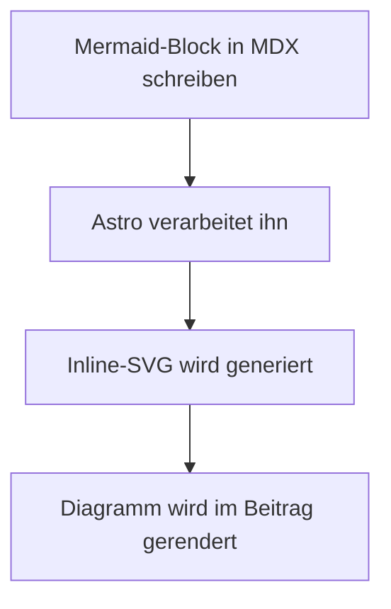
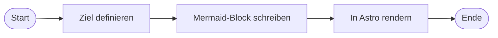
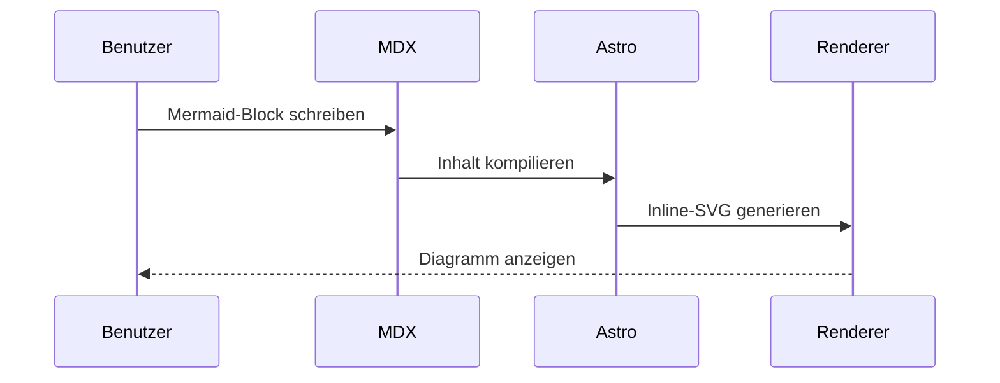
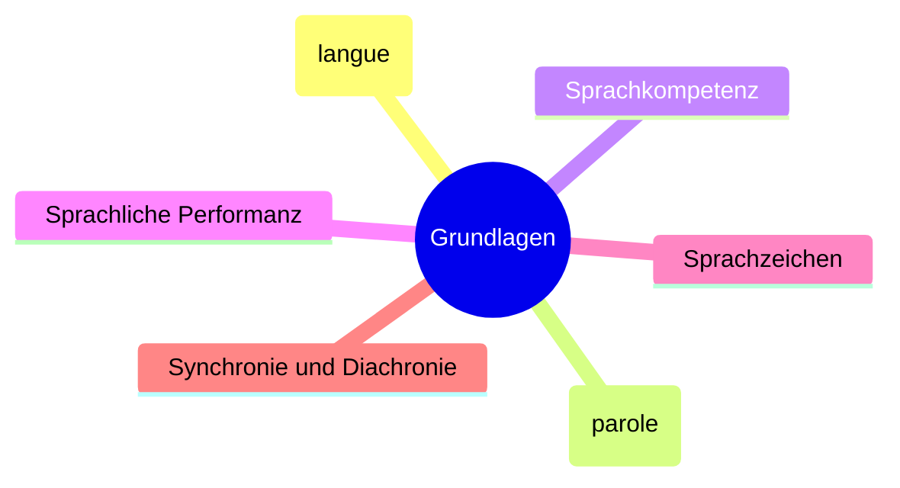
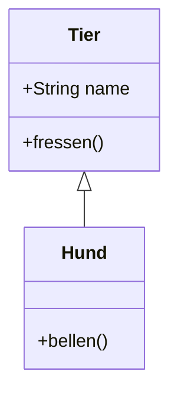
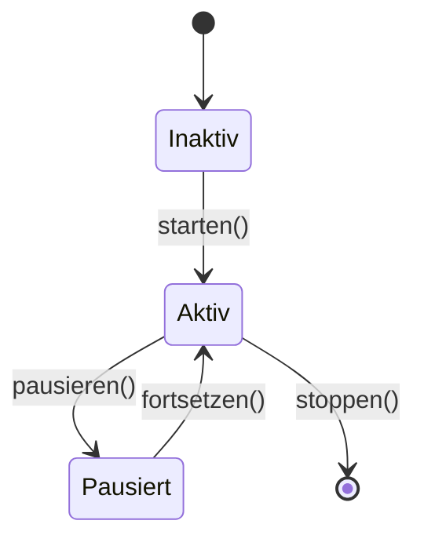
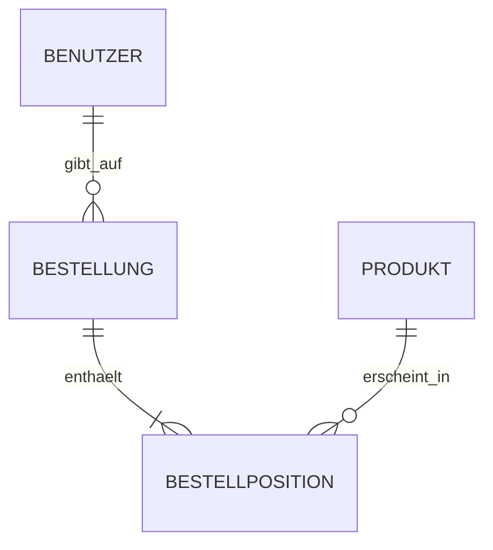
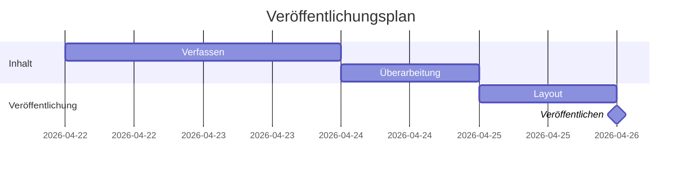
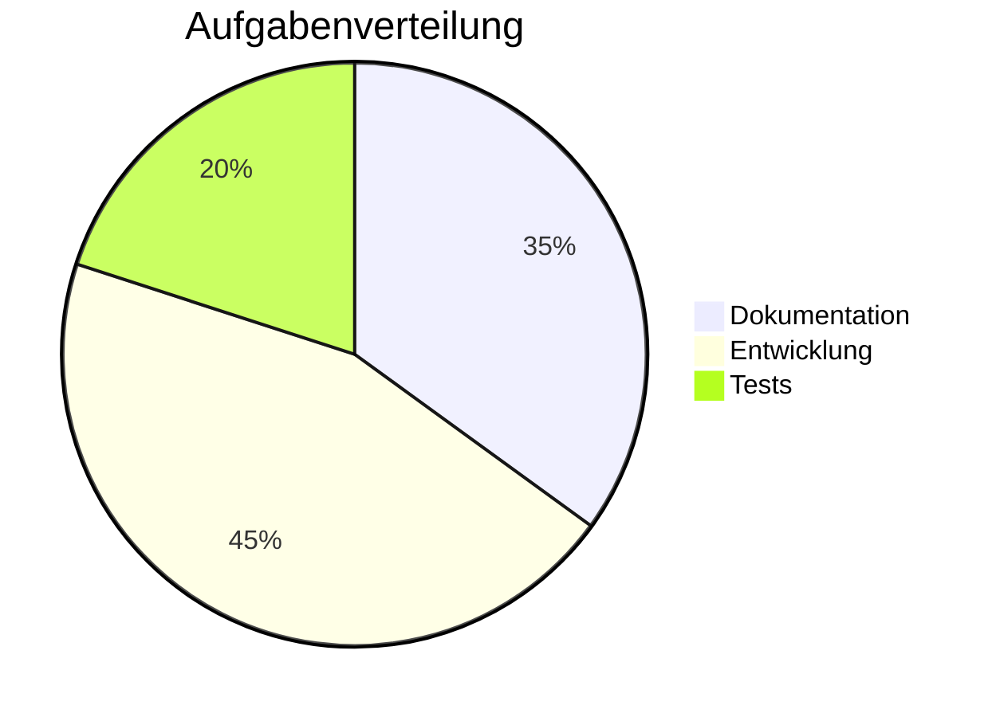
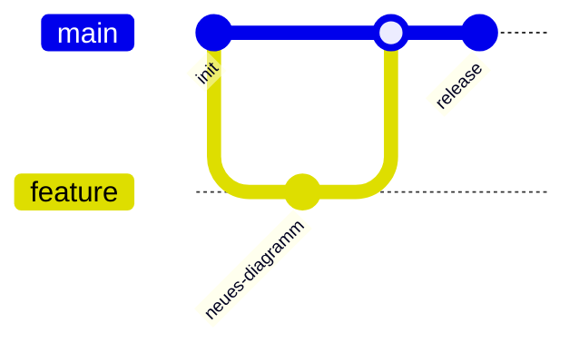

## Einleitung

<a href="https://mermaid.js.org/" target="_blank">Mermaid</a> ist eine
Auszeichnungssprache, mit der sich Diagramme deklarativ erstellen lassen,
indem eine <a href="https://github.com/mermaid-js/mermaid" target="_blank">JavaScript-Bibliothek</a>
die Grafiken generiert.

Mermaid wurde von Knut Sveidqvist entwickelt, der sich <a href="https://github.com/mermaid-js/mermaid/issues/1904">inspirieren</a>
ließ, als er mit seinen Kindern *Arielle, die Meerjungfrau* (*The Little
Mermaid*) sah. Ursprünglich als Werkzeug zur Diagrammerstellung aus Text
mit Markdown-ähnlicher Syntax entwickelt, hat es sich zu einem vollständigen
Ökosystem entwickelt, das in der Community weit verbreitet ist: Das Projekt
zählt mittlerweile über 87.500 Sterne auf GitHub.

Mermaid lässt sich nativ in Systeme wie GitHub, GitLab, Visual Studio Code
oder Notion integrieren, unter anderem. Ebenso gibt es Integrationen für
praktisch alle Frontend-Bibliotheken und -Frameworks.

Mit der einfachen Sprache von Mermaid lassen sich Diagramme deklarativ
definieren, ohne ein visuelles Zeichenprogramm erlernen zu müssen, was
von Natur aus langsamer ist. Außerdem ist es viel einfacher, Code zu
pflegen als Gimp- oder
<a href="https://draw.elpato.dev/" target="_blank">El Pato</a>-Quelldateien.

Ich entdeckte es (etwas spät) bei der Erstellung des Lernleitfadens für
[NLP](https://rodolfo.gg/de/posts/2026/04/glosario-linguistica-nlp/).

Im Folgenden stelle ich einige Integrationsbeispiele und mit Mermaid
erstellte Diagramme vor, gefolgt von einer Anleitung zur Installation
und Anpassung in <a href="https://astro.build/" target="_blank">Astro</a>.

---

## Inhaltsverzeichnis

---

## Beliebte Mermaid-Integrationen

Je nach Stack kann man die offizielle `mermaid`-Bibliothek oder Community-*Wrapper*
verwenden:

- **Svelte / SvelteKit:** `@friendofsvelte/mermaid`
- **React:** `mermaid` (offiziell, clientseitiges Rendering), `mdx-mermaid`
- **Vue.js:** `vue-mermaid-string`, `vue-mermaid-render`
- **Next.js:** `mermaid` + `dynamic import`, `mdx-mermaid`
- **Angular:** `mermaid` (offiziell) oder Integration mit `ngx-markdown` + Mermaid
- **Flutter / Dart:** `mermaid` (Dart JS Interop), `flutter_smooth_markdown` (enthält `MermaidDiagram`)
- **Nuxt:** `@d0rich/nuxt-content-mermaid`
- **Docusaurus:** `@docusaurus/theme-mermaid`
- **VitePress:** `vitepress-plugin-mermaid`
- **Astro:** `astro-mermaid` oder clientseitiges Rendering mit `mermaid`

> Bei der Wahl einer Bibliothek empfiehlt es sich, Wartungsstand und
> Kompatibilität mit der verwendeten Mermaid- und Framework-Version zu prüfen.
> Außerdem sollte geprüft werden, wie sie sich ohne Konflikte mit anderen
> Syntax-Highlighting-Bibliotheken integrieren lässt.

---

## Beispiele

### Graph TD

Quellcode:

````md

````

Gerendertes Diagramm:


### Flowchart LR

Quellcode:

````md

````

Gerendertes Diagramm:



### Sequence Diagram

Quellcode:

````md

````

Gerendertes Diagramm:


### Mindmap

Quellcode:

````md

````

Gerendertes Diagramm:


### Class Diagram

Quellcode:

````md

````

Gerendertes Diagramm:


### State Diagram

Quellcode:

````md

````

Gerendertes Diagramm:


### Entity Relationship (ER)

Quellcode:

````md

````

Gerendertes Diagramm:


### Gantt

Quellcode:

````md

````

Gerendertes Diagramm:


### Pie Chart

Quellcode:

````md

````

Gerendertes Diagramm:


### Git Graph

Quellcode:

````md

````

Gerendertes Diagramm:


<a href="https://astro-mermaid-demo.netlify.app/" target="_blank">Weitere Beispiele hier.</a>

---

## Installationsanleitung für Astro

### 1. Mermaid installieren

```bash
bun add mermaid
```

> Ich verwende `bun`, aber es funktioniert genauso mit `npm`, `yarn`, `pnpm` usw.

### 2. Remark-Plugin in `astro.config.ts`

> Das Folgende ist **sehr wichtig**. Als ich die Integration zum ersten Mal
> mit `astro-mermaid` versuchte, verschwand die gesamte Syntaxhervorhebung.
> Das liegt an der Funktionsweise der Highlighting-Plugin-Pipeline in Astro.
> Ähnliches könnte auch in anderen Frameworks wie Svelte passieren.

Das Problem mit Build-Zeit-Rendering-Lösungen (wie `astro-mermaid` oder
`rehype-mermaid`) ist, dass sie Konflikte mit `astro-expressive-code`
erzeugen, der Bibliothek für *Syntax-Highlighting*, und die Hervorhebung
in allen ```` ```javascript ````, ```` ```bash ```` etc.-Blöcken kaputt machen.

Die Lösung ist, Mermaid clientseitig zu rendern, aber `expressiveCode` darf
die ` ```mermaid `-Blöcke nicht verarbeiten. Dafür wandelt ein Remark-Plugin
diese Blöcke in rohen HTML-Code `<pre class="mermaid">` um, bevor
expressiveCode sie sieht:

```typescript
// astro.config.ts
import { visit } from 'unist-util-visit';

function remarkMermaidBypass() {
  return (tree: any) => {
    visit(tree, 'code', (node: any, index: number | undefined, parent: any) => {
      if (node.lang === 'mermaid' && parent && typeof index === 'number') {
        parent.children[index] = {
          type: 'html',
          value: `<pre class="mermaid">\n${node.value}\n</pre>`,
        };
      }
    });
  };
}
```

In das Array `markdown.remarkPlugins` einfügen (Reihenfolge wichtig: muss zuerst stehen):

```typescript
// astro.config.ts
markdown: {
  remarkPlugins: [
    remarkMermaidBypass,  // zuerst
    remarkToc,
    remarkMath,
    remarkCollapse,
  ],
  // ...
},
```

Wichtig ist auch, dass die MDX-Integration die Markdown-Konfiguration erbt,
anstatt eigene Plugins zu definieren:

```typescript
// astro.config.ts
mdx({
  extendMarkdownConfig: true,  // erbt remarkPlugins und rehypePlugins
}),
```

Werden `rehypePlugins` oder `remarkPlugins` direkt an `mdx()` übergeben,
*ersetzen* sie (und werden nicht mit) denen aus `markdown.*` zusammengeführt,
was dazu führt, dass `rehypeExpressiveCode` lautlos aus der MDX-Pipeline
verschwindet.

### 3. Rendering-Skript im Post-Layout

> Ich verwende Mermaid-Diagramme in Blog-Beiträgen, aber dasselbe gilt auch
> für andere Stellen. Ich benutze Astro Paper.

Im Layout, das die Beiträge rendert
(in <a href="https://astro-paper.pages.dev/" target="_blank">Astro Paper</a>: `PostDetails.astro`),
wird ein `<script>` hinzugefügt, der `mermaid` importiert und clientseitig
rendert. Das Skript verwendet das Ereignis `astro:page-load` für
Kompatibilität mit View Transitions und einen `MutationObserver`, der bei
Theme-Wechsel (hell/dunkel) neu rendert:

```typescript
// PostDetails.astro
import mermaid from "mermaid";

let themeObserver: MutationObserver | null = null;

function getTheme() {
  return document.documentElement.dataset.theme === "dark" ? "dark" : "forest";
}

async function renderMermaid() {
  // Bereits gerenderte Diagramme zu pre.mermaid zurücksetzen für erneutes Rendern
  // (beim Theme-Wechsel erforderlich)
  document.querySelectorAll<HTMLElement>("[data-mermaid]").forEach(el => {
    const pre = document.createElement("pre");
    pre.className = "mermaid";
    pre.textContent = el.dataset.mermaid!;
    el.replaceWith(pre);
  });

  const blocks = Array.from(document.querySelectorAll<HTMLPreElement>("pre.mermaid"));
  if (!blocks.length) return;

  mermaid.initialize({ startOnLoad: false, theme: getTheme() });

  await Promise.all(blocks.map(async pre => {
    const source = (pre.textContent ?? "").trim();
    const id = `mermaid-${Math.random().toString(36).slice(2, 9)}`;
    try {
      const { svg } = await mermaid.render(id, source);
      const wrapper = document.createElement("div");
      wrapper.className = "my-6 flex justify-center overflow-x-auto";
      wrapper.dataset.mermaid = source;  // Source für erneutes Rendern beim Theme-Wechsel speichern
      wrapper.innerHTML = svg;
      pre.replaceWith(wrapper);
    } catch (err) {
      console.error("[mermaid]", err);
    }
  }));
}

document.addEventListener("astro:page-load", () => {
  renderMermaid();
  themeObserver?.disconnect();
  themeObserver = new MutationObserver(renderMermaid);
  themeObserver.observe(document.documentElement, {
    attributes: true,
    attributeFilter: ["data-theme"],
  });
});
```

> **Wichtiger Hinweis:** Wenn das *Layout* auch *„Copy"*-Schaltflächen für
> Code-Blöcke enthält, sicherstellen, dass `pre.mermaid` vom Selektor
> ausgeschlossen wird, da der Button-Text an den Quellcode angehängt wird
> und Parse-Fehler verursacht:

```javascript
// falsch
const codeBlocks = Array.from(document.querySelectorAll("pre"));

// richtig
const codeBlocks = Array.from(document.querySelectorAll("pre:not(.mermaid)"));
```

### 4. Theme-Erkennung

Die Website verwendet das Attribut `data-theme` am `<html>`-Element, um das
aktive Theme anzuzeigen (`"light"` oder `"dark"`). Die Funktion `getTheme()`
liest dieses Attribut und gibt den entsprechenden Mermaid-Theme-Namen zurück.
Dieser Blog verwendet `"forest"` für hell und `"dark"` für dunkel.

## Farbanpassung mit CSS

Mermaid rendert SVG *inline*, und seine internen Styles verwenden
hochspezifische Selektoren (`#id .klasse`). Um sie mit den Theme-Farben der
Website zu überschreiben, ist `!important` im globalen CSS erforderlich.

In Mermaid v11 gibt es einige Besonderheiten gegenüber früheren Versionen:

* **Flowcharts** (`graph TD`, `flowchart LR`) verwenden `.node rect/circle/etc.`
  für Knoten und `.arrowheadPath` für Pfeilspitzen
  (in v10 war es `.arrowMarkerPath`).
* **Sequenzdiagramme** verwenden `.actor` direkt am `rect`
  (in v10 war es `.actor rect`), `.messageLine0`/`.messageLine1` für
  Nachrichtenlinien und `[id$="-arrowhead"] path` für Pfeilspitzen.
* **Mindmaps** verwenden `span` innerhalb von `foreignObject` für den
  Abschnittstext. Die Farbe wird mit der CSS-Eigenschaft `color:` auf dem
  `span` gesteuert, nicht mit `fill:` auf SVG-Elementen.
* `themeVariables` bei der Mermaid-Initialisierung **beeinflusst nicht** die
  Abschnittsfarben in Mindmaps: Diese werden algorithmisch auf Basis des
  gewählten Basisthemas berechnet.

Das vollständige in diesem Blog verwendete CSS in `global.css`:

```css
/* Mermaid: mindmap — nicht-Root-Abschnitte verwenden die Vordergrundfarbe des Themes */
svg.mindmapDiagram [class*="section-"]:not(.section-root) span {
  color: var(--foreground) !important;
}

/* Mermaid: flowchart — Knoten (graph TD, flowchart LR, etc.) */
[id^="mermaid-"] .node rect,
[id^="mermaid-"] .node circle,
[id^="mermaid-"] .node ellipse,
[id^="mermaid-"] .node polygon,
[id^="mermaid-"] .node path {
  fill: var(--muted) !important;
  stroke: var(--border) !important;
}

/* Mermaid: flowchart — Kanten */
[id^="mermaid-"] .edgePath .path,
[id^="mermaid-"] .flowchart-link {
  stroke: var(--accent) !important;
}

/* Mermaid: flowchart — Pfeilspitzen (v11: .arrowheadPath) */
[id^="mermaid-"] .arrowheadPath {
  fill: var(--accent) !important;
  stroke: var(--accent) !important;
}

/* Mermaid: sequence — Akteure (v11: .actor direkt auf rect) */
[id^="mermaid-"] .actor {
  fill: var(--muted) !important;
  stroke: var(--border) !important;
}

/* Mermaid: sequence — Nachrichtenlinien */
[id^="mermaid-"] .messageLine0,
[id^="mermaid-"] .messageLine1 {
  stroke: var(--accent) !important;
}

/* Mermaid: sequence — Pfeilspitzen */
[id$="-arrowhead"] path {
  fill: var(--accent) !important;
  stroke: var(--accent) !important;
}

/* Mermaid: sequence — vertikale Lifelines */
[id^="mermaid-"] .actor-line {
  stroke: var(--border) !important;
}
```
