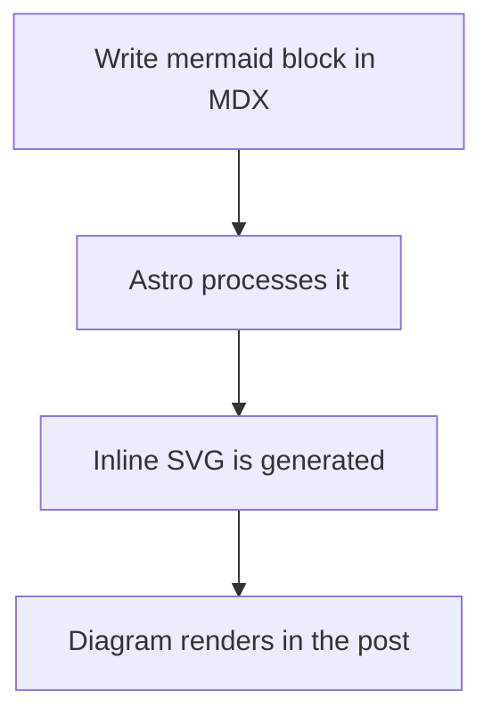
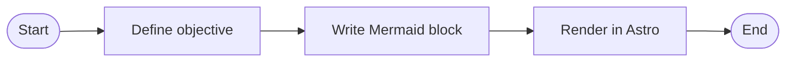
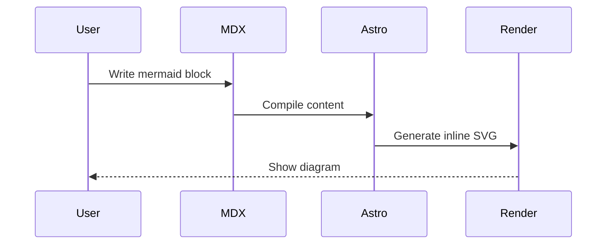
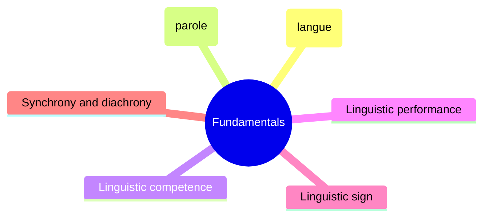
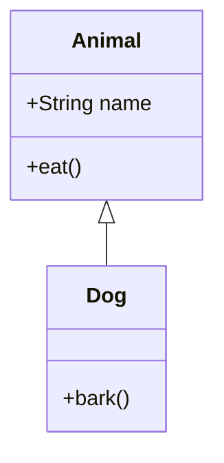
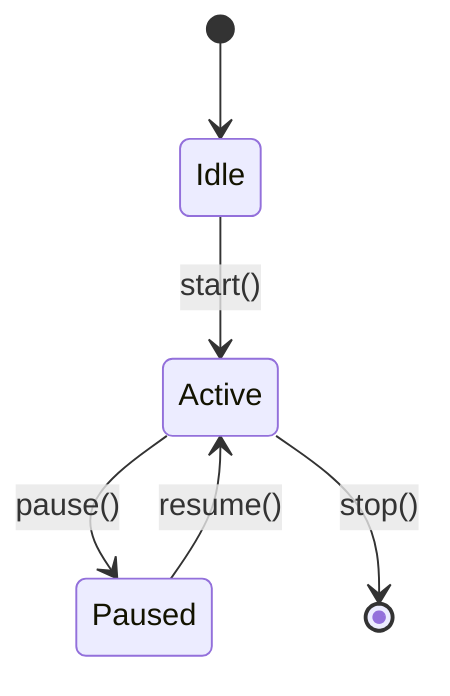
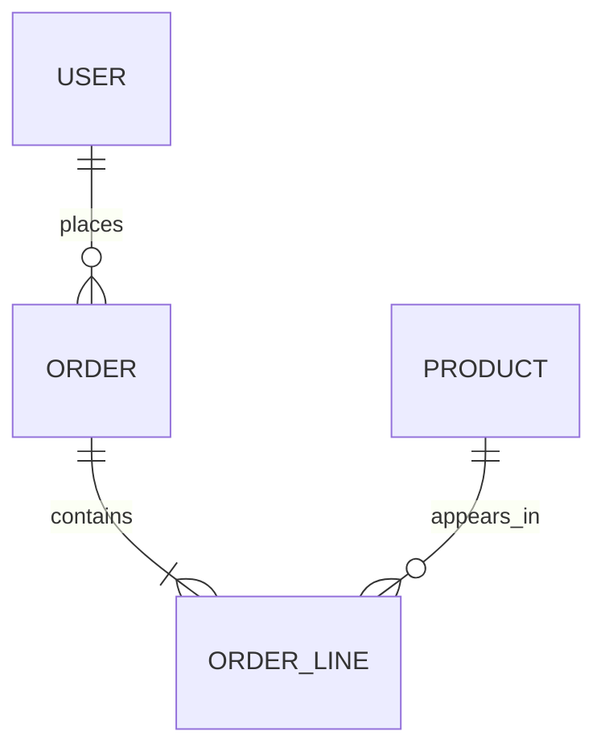
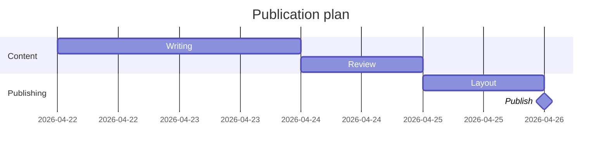
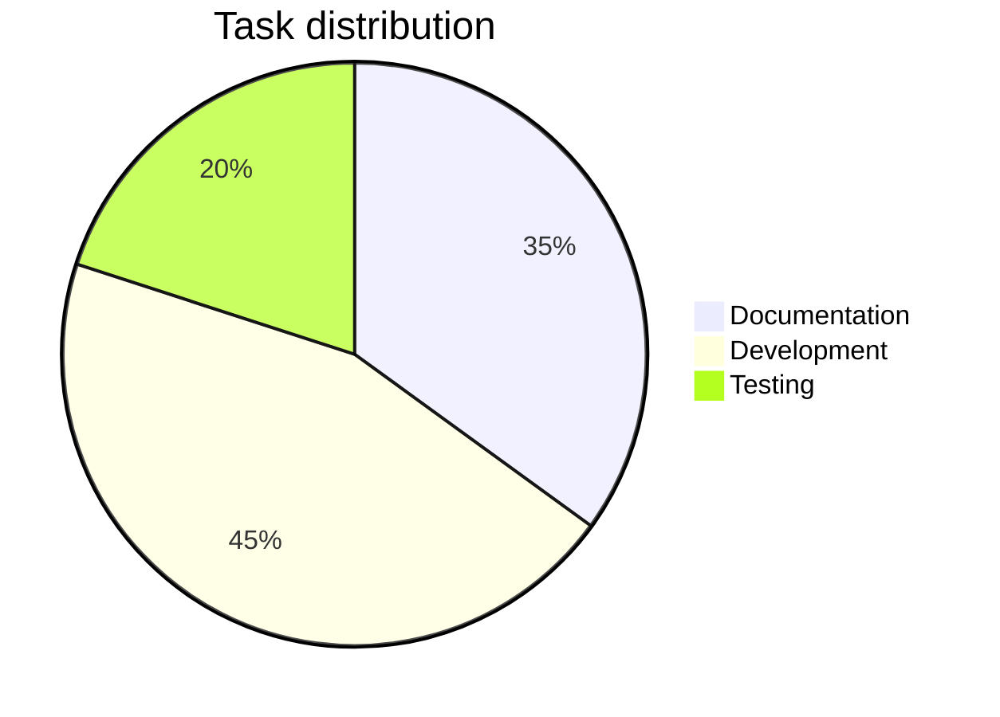
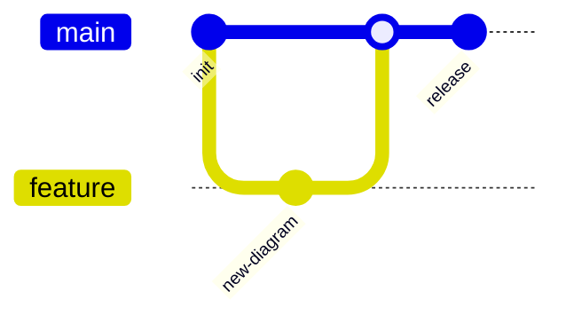

## Introduction

<a href="https://mermaid.js.org/" target="_blank">Mermaid</a> is a markup
language that allows you to create diagrams declaratively, using a
<a href="https://github.com/mermaid-js/mermaid" target="_blank">JavaScript library</a>
to generate the graphics.

Mermaid was created by Knut Sveidqvist, who was <a href="https://github.com/mermaid-js/mermaid/issues/1904">inspired</a>
by his children while watching *The Little Mermaid*. Initially developed as
a tool to generate diagrams from text using a Markdown-like syntax, it has
evolved into a full ecosystem widely used in the community: the project now
has a massive user base, with over 87,500 stars on GitHub.

Mermaid integrates natively in systems such as GitHub, GitLab, Visual Studio
Code, and Notion, among many others. Similarly, there are integrations for
virtually all frontend libraries and frameworks.

By using a simple language like Mermaid, you can declaratively define diagrams
without having to learn a visual drawing tool, which is inherently slower. It
is also much easier to maintain code than a set of Gimp or
<a href="https://draw.elpato.dev/" target="_blank">El Pato</a> source files.

I discovered it (somewhat late) while putting together the study guide for
[NLP](https://rodolfo.gg/en/posts/2026/04/glosario-linguistica-nlp/).

Below are some integration examples and diagrams made with Mermaid, followed
by a guide to install and customize it in
<a href="https://astro.build/" target="_blank">Astro</a>.

---

## Table of Contents

---

## Popular Mermaid Integrations

Depending on the stack, you can use the official `mermaid` library or
community *wrappers*:

- **Svelte / SvelteKit:** `@friendofsvelte/mermaid`
- **React:** `mermaid` (official, client-side render), `mdx-mermaid`
- **Vue.js:** `vue-mermaid-string`, `vue-mermaid-render`
- **Next.js:** `mermaid` + `dynamic import`, `mdx-mermaid`
- **Angular:** `mermaid` (official) or integration with `ngx-markdown` + Mermaid
- **Flutter / Dart:** `mermaid` (Dart JS interop), `flutter_smooth_markdown` (includes `MermaidDiagram`)
- **Nuxt:** `@d0rich/nuxt-content-mermaid`
- **Docusaurus:** `@docusaurus/theme-mermaid`
- **VitePress:** `vitepress-plugin-mermaid`
- **Astro:** `astro-mermaid` or client-side rendering with `mermaid`

> When choosing a library, check its maintenance status and compatibility with
> the version of Mermaid and the framework you are using. You also need to
> verify how to integrate it without causing conflicts with other syntax
> highlighting libraries.

---

## Examples

### Graph TD

Source code:

````md

````

Rendered diagram:


### Flowchart LR

Source code:

````md

````

Rendered diagram:


### Sequence Diagram

Source code:

````md

````

Rendered diagram:


### Mindmap

Source code:

````md

````

Rendered diagram:


### Class Diagram

Source code:

````md

````

Rendered diagram:


### State Diagram

Source code:

````md

````

Rendered diagram:


### Entity Relationship (ER)

Source code:

````md

````

Rendered diagram:


### Gantt

Source code:

````md

````

Rendered diagram:


### Pie Chart

Source code:

````md

````

Rendered diagram:


### Git Graph

Source code:

````md

````

Rendered diagram:


<a href="https://astro-mermaid-demo.netlify.app/" target="_blank">See more examples here.</a>

---

## Installation Procedure in Astro

### 1. Install mermaid

```bash
bun add mermaid
```

> I use `bun`, but it works the same with `npm`, `yarn`, `pnpm`, etc.

### 2. Remark plugin in `astro.config.ts`

> The following is **very important**. When I first tried the integration
> using `astro-mermaid`, all syntax highlighting blocks disappeared. This
> is due to how the highlighting plugin pipeline works in Astro. Something
> similar could happen in other frameworks like Svelte.

The problem with build-time rendering solutions (such as `astro-mermaid`
or `rehype-mermaid`) is that they conflict with `astro-expressive-code`,
the library responsible for *syntax highlighting*, breaking code highlighting
in all ```` ```javascript ````, ```` ```bash ```` etc. blocks.

The solution is to render Mermaid on the client side, but we need to prevent
`expressiveCode` from processing ` ```mermaid ` blocks. A remark plugin
converts those blocks to raw HTML `<pre class="mermaid">` before
expressiveCode sees them:

```typescript
// astro.config.ts
import { visit } from 'unist-util-visit';

function remarkMermaidBypass() {
  return (tree: any) => {
    visit(tree, 'code', (node: any, index: number | undefined, parent: any) => {
      if (node.lang === 'mermaid' && parent && typeof index === 'number') {
        parent.children[index] = {
          type: 'html',
          value: `<pre class="mermaid">\n${node.value}\n</pre>`,
        };
      }
    });
  };
}
```

Add it to the `markdown.remarkPlugins` array (order matters: it must come first):

```typescript
// astro.config.ts
markdown: {
  remarkPlugins: [
    remarkMermaidBypass,  // first
    remarkToc,
    remarkMath,
    remarkCollapse,
  ],
  // ...
},
```

It is also important that the MDX integration inherits the markdown
configuration rather than defining its own plugins:

```typescript
// astro.config.ts
mdx({
  extendMarkdownConfig: true,  // inherits remarkPlugins and rehypePlugins
}),
```

If you pass `rehypePlugins` or `remarkPlugins` directly to `mdx()`, they
*replace* (not merge with) those in `markdown.*`, which causes
`rehypeExpressiveCode` to silently disappear from the MDX pipeline.

### 3. Rendering script in the post layout

> I use Mermaid diagrams in blog posts, but the same approach applies
> elsewhere. By the way, I use Astro Paper.

In the layout that renders posts
(in <a href="https://astro-paper.pages.dev/" target="_blank">Astro Paper</a>: `PostDetails.astro`),
add a `<script>` that imports `mermaid` and renders it on the client side.
The script uses the `astro:page-load` event for View Transitions compatibility,
and a `MutationObserver` to re-render when the user switches themes (light/dark):

```typescript
// PostDetails.astro
import mermaid from "mermaid";

let themeObserver: MutationObserver | null = null;

function getTheme() {
  return document.documentElement.dataset.theme === "dark" ? "dark" : "forest";
}

async function renderMermaid() {
  // Restore already-rendered diagrams to pre.mermaid for re-rendering
  // (needed on theme change)
  document.querySelectorAll<HTMLElement>("[data-mermaid]").forEach(el => {
    const pre = document.createElement("pre");
    pre.className = "mermaid";
    pre.textContent = el.dataset.mermaid!;
    el.replaceWith(pre);
  });

  const blocks = Array.from(document.querySelectorAll<HTMLPreElement>("pre.mermaid"));
  if (!blocks.length) return;

  mermaid.initialize({ startOnLoad: false, theme: getTheme() });

  await Promise.all(blocks.map(async pre => {
    const source = (pre.textContent ?? "").trim();
    const id = `mermaid-${Math.random().toString(36).slice(2, 9)}`;
    try {
      const { svg } = await mermaid.render(id, source);
      const wrapper = document.createElement("div");
      wrapper.className = "my-6 flex justify-center overflow-x-auto";
      wrapper.dataset.mermaid = source;  // store source for re-render on theme change
      wrapper.innerHTML = svg;
      pre.replaceWith(wrapper);
    } catch (err) {
      console.error("[mermaid]", err);
    }
  }));
}

document.addEventListener("astro:page-load", () => {
  renderMermaid();
  themeObserver?.disconnect();
  themeObserver = new MutationObserver(renderMermaid);
  themeObserver.observe(document.documentElement, {
    attributes: true,
    attributeFilter: ["data-theme"],
  });
});
```

> **Important note:** If the *layout* also includes *"Copy"* buttons for code
> blocks, make sure to exclude `pre.mermaid` from the selector, as the button
> text gets concatenated to the source and causes parse errors:

```javascript
// wrong
const codeBlocks = Array.from(document.querySelectorAll("pre"));

// correct
const codeBlocks = Array.from(document.querySelectorAll("pre:not(.mermaid)"));
```

### 4. Theme detection

The site uses the `data-theme` attribute on `<html>` to indicate the active
theme (`"light"` or `"dark"`). The `getTheme()` function reads that attribute
and returns the corresponding Mermaid theme name. This blog uses `"forest"`
for light and `"dark"` for dark.

## Color customization with CSS

Mermaid renders SVG *inline*, and its internal styles use high-specificity
selectors (`#id .class`). To override them with the site's theme colors,
`!important` is needed in global CSS.

There are some quirks in Mermaid v11 compared to earlier versions:

* **Flowcharts** (`graph TD`, `flowchart LR`) use `.node rect/circle/etc.`
  for nodes and `.arrowheadPath` for arrowheads
  (in v10 it was `.arrowMarkerPath`).
* **Sequence diagrams** use `.actor` directly on the `rect`
  (in v10 it was `.actor rect`), `.messageLine0`/`.messageLine1` for message
  lines, and `[id$="-arrowhead"] path` for arrowheads.
* **Mindmaps** use `span` inside `foreignObject` for section text. Color is
  controlled with the CSS `color:` property on the `span`, not with `fill:`
  on SVG elements.
* `themeVariables` in the Mermaid initialization **does not affect** section
  colors in mindmaps: those are calculated algorithmically based on the
  selected base theme.

The complete CSS used in this blog, in `global.css`:

```css
/* Mermaid: mindmap — non-root sections use the theme's foreground color */
svg.mindmapDiagram [class*="section-"]:not(.section-root) span {
  color: var(--foreground) !important;
}

/* Mermaid: flowchart — nodes (graph TD, flowchart LR, etc.) */
[id^="mermaid-"] .node rect,
[id^="mermaid-"] .node circle,
[id^="mermaid-"] .node ellipse,
[id^="mermaid-"] .node polygon,
[id^="mermaid-"] .node path {
  fill: var(--muted) !important;
  stroke: var(--border) !important;
}

/* Mermaid: flowchart — edges */
[id^="mermaid-"] .edgePath .path,
[id^="mermaid-"] .flowchart-link {
  stroke: var(--accent) !important;
}

/* Mermaid: flowchart — arrowheads (v11: .arrowheadPath) */
[id^="mermaid-"] .arrowheadPath {
  fill: var(--accent) !important;
  stroke: var(--accent) !important;
}

/* Mermaid: sequence — actors (v11: .actor directly on rect) */
[id^="mermaid-"] .actor {
  fill: var(--muted) !important;
  stroke: var(--border) !important;
}

/* Mermaid: sequence — message lines */
[id^="mermaid-"] .messageLine0,
[id^="mermaid-"] .messageLine1 {
  stroke: var(--accent) !important;
}

/* Mermaid: sequence — arrowheads */
[id$="-arrowhead"] path {
  fill: var(--accent) !important;
  stroke: var(--accent) !important;
}

/* Mermaid: sequence — vertical lifelines */
[id^="mermaid-"] .actor-line {
  stroke: var(--border) !important;
}
```
