## Introducción

Este glosario reúne los términos fundamentales de la lingüística que se emplean
en las diferentes ramas del **Procesamiento de Lenguaje Natural** (NLP, por sus
siglas en inglés). Está organizado por áreas temáticas —desde la fonética y la
morfología hasta la pragmática, la semántica distribucional y los paradigmas
modernos de modelado del lenguaje— con el objetivo de servir como guía de
estudio integral.

Cada entrada incluye una definición clara, su relevancia dentro de NLP y al
menos un ejemplo concreto.

---

## Tabla de contenido

- [Introducción](#introducción)
- [1 · Fundamentos de lingüística general](#1-fundamentos-de-lingüística-general)
  - [1.1 Lengua (_langue_)](#11-lengua-langue)
  - [1.2 Habla (_parole_)](#12-habla-parole)
  - [1.3 Competencia lingüística](#13-competencia-lingüística)
  - [1.4 Actuación lingüística (_performance_)](#14-actuación-lingüística-performance)
  - [1.5 Signo lingüístico](#15-signo-lingüístico)
  - [1.6 Sincronía y diacronía](#16-sincronía-y-diacronía)
- [2 · Fonética y fonología](#2-fonética-y-fonología)
  - [2.1 Fonema](#21-fonema)
  - [2.2 Alófono](#22-alófono)
  - [2.3 Prosodia](#23-prosodia)
  - [2.4 Transcripción fonética (IPA)](#24-transcripción-fonética-ipa)
  - [2.5 Grafema](#25-grafema)
  - [2.6 Sílaba](#26-sílaba)
  - [2.7 Acento léxico](#27-acento-léxico)
- [3 · Morfología](#3-morfología)
  - [3.1 Morfema](#31-morfema)
  - [3.2 Raíz (_root_)](#32-raíz-root)
  - [3.3 Lema](#33-lema)
  - [3.4 Flexión](#34-flexión)
  - [3.5 Derivación](#35-derivación)
  - [3.6 Composición](#36-composición)
  - [3.7 Afijo (prefijo, sufijo, infijo, circunfijo)](#37-afijo-prefijo-sufijo-infijo-circunfijo)
  - [3.8 Palabra funcional vs. palabra de contenido](#38-palabra-funcional-vs-palabra-de-contenido)
  - [3.9 Tokenización](#39-tokenización)
  - [3.10 Tokenización subword (BPE, WordPiece, Unigram)](#310-tokenización-subword-bpe-wordpiece-unigram)
  - [3.11 Stemming](#311-stemming)
  - [3.12 Lematización](#312-lematización)
  - [3.13 Análisis morfológico (_morphological parsing_)](#313-análisis-morfológico-morphological-parsing)
  - [3.14 Vocabulario abierto vs. cerrado (_OOV — Out of Vocabulary_)](#314-vocabulario-abierto-vs-cerrado-oov-out-of-vocabulary)
- [4 · Sintaxis](#4-sintaxis)
  - [4.1 Categoría gramatical / Parte del discurso (_Part of Speech, POS_)](#41-categoría-gramatical-parte-del-discurso-part-of-speech-pos)
  - [4.2 POS Tagging (etiquetado POS)](#42-pos-tagging-etiquetado-pos)
  - [4.3 Constituyente](#43-constituyente)
  - [4.4 Sintagma (_phrase_)](#44-sintagma-phrase)
  - [4.5 Gramática libre de contexto (_Context-Free Grammar, CFG_)](#45-gramática-libre-de-contexto-context-free-grammar-cfg)
  - [4.6 Gramática de dependencias (_Dependency Grammar_)](#46-gramática-de-dependencias-dependency-grammar)
  - [4.7 Dependency Parsing (análisis de dependencias)](#47-dependency-parsing-análisis-de-dependencias)
  - [4.8 Universal Dependencies (UD)](#48-universal-dependencies-ud)
  - [4.9 Chunking (análisis superficial)](#49-chunking-análisis-superficial)
  - [4.10 Oración principal y subordinada](#410-oración-principal-y-subordinada)
  - [4.11 Concordancia (_agreement_)](#411-concordancia-agreement)
  - [4.12 Orden de palabras](#412-orden-de-palabras)
  - [4.13 Ambigüedad estructural (_structural ambiguity_)](#413-ambigüedad-estructural-structural-ambiguity)
  - [4.14 Recursividad](#414-recursividad)
- [5 · Semántica](#5-semántica)
  - [5.1 Semántica léxica](#51-semántica-léxica)
  - [5.2 Sinonimia](#52-sinonimia)
  - [5.3 Antonimia](#53-antonimia)
  - [5.4 Hiperonimia e hiponimia](#54-hiperonimia-e-hiponimia)
  - [5.5 Meronimia y holonimia](#55-meronimia-y-holonimia)
  - [5.6 Polisemia](#56-polisemia)
  - [5.7 Homonimia](#57-homonimia)
  - [5.8 Word Sense Disambiguation (WSD)](#58-word-sense-disambiguation-wsd)
  - [5.9 Roles semánticos (_Semantic Role Labeling, SRL_)](#59-roles-semánticos-semantic-role-labeling-srl)
  - [5.10 Marco semántico (_FrameNet_)](#510-marco-semántico-framenet)
  - [5.11 Implicación textual (_Textual Entailment / NLI_)](#511-implicación-textual-textual-entailment-nli)
  - [5.12 Paráfrasis](#512-paráfrasis)
  - [5.13 Similitud semántica textual (_Semantic Textual Similarity, STS_)](#513-similitud-semántica-textual-semantic-textual-similarity-sts)
  - [5.14 Presuposición](#514-presuposición)
  - [5.15 Composicionalidad](#515-composicionalidad)
  - [5.16 Expresiones multipalabra (_Multi-Word Expressions, MWE_)](#516-expresiones-multipalabra-multi-word-expressions-mwe)
- [6 · Pragmática y discurso](#6-pragmática-y-discurso)
  - [6.1 Acto de habla (_Speech Act_)](#61-acto-de-habla-speech-act)
  - [6.2 Intención del hablante (_intent_)](#62-intención-del-hablante-intent)
  - [6.3 Slot filling (relleno de ranuras)](#63-slot-filling-relleno-de-ranuras)
  - [6.4 Máximas de Grice](#64-máximas-de-grice)
  - [6.5 Implicatura conversacional](#65-implicatura-conversacional)
  - [6.6 Deixis](#66-deixis)
  - [6.7 Anáfora y catáfora](#67-anáfora-y-catáfora)
  - [6.8 Correferencia (_Coreference Resolution_)](#68-correferencia-coreference-resolution)
  - [6.9 Coherencia y cohesión](#69-coherencia-y-cohesión)
  - [6.10 Relaciones discursivas (_Rhetorical Structure Theory, RST_)](#610-relaciones-discursivas-rhetorical-structure-theory-rst)
  - [6.11 Registro y estilo](#611-registro-y-estilo)
  - [6.12 Turno de diálogo (_turn-taking_)](#612-turno-de-diálogo-turn-taking)
- [7 · Semántica distribucional y representaciones vectoriales](#7-semántica-distribucional-y-representaciones-vectoriales)
  - [7.1 Hipótesis distribucional](#71-hipótesis-distribucional)
  - [7.2 Espacio vectorial semántico](#72-espacio-vectorial-semántico)
  - [7.3 Word Embedding](#73-word-embedding)
  - [7.4 Word2Vec](#74-word2vec)
  - [7.5 GloVe (Global Vectors)](#75-glove-global-vectors)
  - [7.6 FastText](#76-fasttext)
  - [7.7 Embedding contextual](#77-embedding-contextual)
  - [7.8 Similitud coseno](#78-similitud-coseno)
  - [7.9 Sentence Embedding](#79-sentence-embedding)
  - [7.10 Reducción de dimensionalidad (t-SNE, UMAP, PCA)](#710-reducción-de-dimensionalidad-t-sne-umap-pca)
- [8 · Modelos de lenguaje](#8-modelos-de-lenguaje)
  - [8.1 Modelo de lenguaje (_Language Model, LM_)](#81-modelo-de-lenguaje-language-model-lm)
  - [8.2 N-grama](#82-n-grama)
  - [8.3 Perplejidad (_perplexity_)](#83-perplejidad-perplexity)
  - [8.4 Suavizado (_smoothing_)](#84-suavizado-smoothing)
  - [8.5 Modelo de lenguaje neuronal](#85-modelo-de-lenguaje-neuronal)
  - [8.6 Atención (_Attention Mechanism_)](#86-atención-attention-mechanism)
  - [8.7 Transformer](#87-transformer)
  - [8.8 Self-Attention (autoatención)](#88-self-attention-autoatención)
  - [8.9 Modelo autorregresivo (_Autoregressive LM_)](#89-modelo-autorregresivo-autoregressive-lm)
  - [8.10 Modelo de lenguaje enmascarado (_Masked Language Model, MLM_)](#810-modelo-de-lenguaje-enmascarado-masked-language-model-mlm)
  - [8.11 Fine-tuning (ajuste fino)](#811-fine-tuning-ajuste-fino)
  - [8.12 Transfer Learning (aprendizaje por transferencia)](#812-transfer-learning-aprendizaje-por-transferencia)
  - [8.13 Prompt y Prompt Engineering](#813-prompt-y-prompt-engineering)
  - [8.14 In-Context Learning (ICL)](#814-in-context-learning-icl)
  - [8.15 Temperatura (en la generación de texto)](#815-temperatura-en-la-generación-de-texto)
  - [8.16 Top-k y Top-p (nucleus sampling)](#816-top-k-y-top-p-nucleus-sampling)
- [9 · Tareas clásicas de NLP](#9-tareas-clásicas-de-nlp)
  - [9.1 Reconocimiento de Entidades Nombradas (_Named Entity Recognition, NER_)](#91-reconocimiento-de-entidades-nombradas-named-entity-recognition-ner)
  - [9.2 Clasificación de texto](#92-clasificación-de-texto)
  - [9.3 Análisis de sentimiento (_Sentiment Analysis_)](#93-análisis-de-sentimiento-sentiment-analysis)
  - [9.4 Traducción automática (_Machine Translation, MT_)](#94-traducción-automática-machine-translation-mt)
  - [9.5 Respuesta a preguntas (_Question Answering, QA_)](#95-respuesta-a-preguntas-question-answering-qa)
  - [9.6 Resumen automático (_Summarization_)](#96-resumen-automático-summarization)
  - [9.7 Generación de lenguaje natural (_Natural Language Generation, NLG_)](#97-generación-de-lenguaje-natural-natural-language-generation-nlg)
  - [9.8 Extracción de información (_Information Extraction, IE_)](#98-extracción-de-información-information-extraction-ie)
  - [9.9 Resolución de correferencia](#99-resolución-de-correferencia)
  - [9.10 Extracción de relaciones (_Relation Extraction_)](#910-extracción-de-relaciones-relation-extraction)
  - [9.11 Inferencia en lenguaje natural (_Natural Language Inference, NLI_)](#911-inferencia-en-lenguaje-natural-natural-language-inference-nli)
- [10 · Lingüística computacional y corpus](#10-lingüística-computacional-y-corpus)
  - [10.1 Corpus](#101-corpus)
  - [10.2 Anotación](#102-anotación)
  - [10.3 Acuerdo entre anotadores (_Inter-Annotator Agreement, IAA_)](#103-acuerdo-entre-anotadores-inter-annotator-agreement-iaa)
  - [10.4 Treebank](#104-treebank)
  - [10.5 Frecuencia de término (_Term Frequency, TF_)](#105-frecuencia-de-término-term-frequency-tf)
  - [10.6 Frecuencia inversa de documento (_Inverse Document Frequency, IDF_)](#106-frecuencia-inversa-de-documento-inverse-document-frequency-idf)
  - [10.7 TF-IDF](#107-tf-idf)
  - [10.8 Bag of Words (BoW)](#108-bag-of-words-bow)
  - [10.9 Ley de Zipf](#109-ley-de-zipf)
  - [10.10 Colocación (_collocation_)](#1010-colocación-collocation)
  - [10.11 Pointwise Mutual Information (PMI)](#1011-pointwise-mutual-information-pmi)
- [11 · Semántica formal y lógica](#11-semántica-formal-y-lógica)
  - [11.1 Lógica de predicados (primer orden)](#111-lógica-de-predicados-primer-orden)
  - [11.2 Representación semántica (_semantic parsing_)](#112-representación-semántica-semantic-parsing)
  - [11.3 Lambda cálculo (en semántica)](#113-lambda-cálculo-en-semántica)
  - [11.4 AMR (Abstract Meaning Representation)](#114-amr-abstract-meaning-representation)
- [12 · Sociolingüística y variación](#12-sociolingüística-y-variación)
  - [12.1 Variación dialectal](#121-variación-dialectal)
  - [12.2 Code-switching (alternancia de código)](#122-code-switching-alternancia-de-código)
  - [12.3 Registro](#123-registro)
  - [12.4 Jerga y argot (_slang_)](#124-jerga-y-argot-slang)
  - [12.5 Sesgo lingüístico (_linguistic bias_)](#125-sesgo-lingüístico-linguistic-bias)
- [13 · Tipología lingüística y NLP multilingüe](#13-tipología-lingüística-y-nlp-multilingüe)
  - [13.1 Tipología morfológica](#131-tipología-morfológica)
  - [13.2 Tipología del orden de constituyentes](#132-tipología-del-orden-de-constituyentes)
  - [13.3 NLP multilingüe](#133-nlp-multilingüe)
  - [13.4 Transferencia cross-lingual](#134-transferencia-cross-lingual)
  - [13.5 Lenguas de bajos recursos (_low-resource languages_)](#135-lenguas-de-bajos-recursos-low-resource-languages)
- [14 · Evaluación en NLP](#14-evaluación-en-nlp)
  - [14.1 Precisión (_Precision_)](#141-precisión-precision)
  - [14.2 Exhaustividad (_Recall_)](#142-exhaustividad-recall)
  - [14.3 F1-Score](#143-f1-score)
  - [14.4 Exactitud (_Accuracy_)](#144-exactitud-accuracy)
  - [14.5 BLEU (Bilingual Evaluation Understudy)](#145-bleu-bilingual-evaluation-understudy)
  - [14.6 ROUGE](#146-rouge)
  - [14.7 Matriz de confusión](#147-matriz-de-confusión)
  - [14.8 Benchmark](#148-benchmark)
- [15 · Procesamiento del habla](#15-procesamiento-del-habla)
  - [15.1 ASR (Automatic Speech Recognition)](#151-asr-automatic-speech-recognition)
  - [15.2 TTS (Text-to-Speech)](#152-tts-text-to-speech)
  - [15.3 MFCC (Mel-Frequency Cepstral Coefficients)](#153-mfcc-mel-frequency-cepstral-coefficients)
  - [15.4 Diarización de hablantes (_Speaker Diarization_)](#154-diarización-de-hablantes-speaker-diarization)
  - [15.5 Word Error Rate (WER)](#155-word-error-rate-wer)
- [16 · Generación y diálogo](#16-generación-y-diálogo)
  - [16.1 Seq2Seq (Sequence-to-Sequence)](#161-seq2seq-sequence-to-sequence)
  - [16.2 Beam Search](#162-beam-search)
  - [16.3 Greedy Decoding](#163-greedy-decoding)
  - [16.4 Fluencia vs. adecuación](#164-fluencia-vs-adecuación)
  - [16.5 Alucinación (_hallucination_)](#165-alucinación-hallucination)
  - [16.6 Grounding](#166-grounding)
  - [16.7 RLHF (Reinforcement Learning from Human Feedback)](#167-rlhf-reinforcement-learning-from-human-feedback)
  - [16.8 Gestión de diálogo (_Dialogue Management_)](#168-gestión-de-diálogo-dialogue-management)
  - [16.9 Estado del diálogo (_Dialogue State Tracking, DST_)](#169-estado-del-diálogo-dialogue-state-tracking-dst)
- [17 · Recuperación de información y RAG](#17-recuperación-de-información-y-rag)
  - [17.1 Recuperación de información (_Information Retrieval, IR_)](#171-recuperación-de-información-information-retrieval-ir)
  - [17.2 Modelo de espacio vectorial (VSM)](#172-modelo-de-espacio-vectorial-vsm)
  - [17.3 BM25](#173-bm25)
  - [17.4 Búsqueda semántica (_Semantic Search_)](#174-búsqueda-semántica-semantic-search)
  - [17.5 RAG (Retrieval-Augmented Generation)](#175-rag-retrieval-augmented-generation)
  - [17.6 Índice invertido](#176-índice-invertido)
  - [17.7 Re-ranking](#177-re-ranking)
- [18 · Grafos de conocimiento y representación del conocimiento](#18-grafos-de-conocimiento-y-representación-del-conocimiento)
  - [18.1 Knowledge Graph (grafo de conocimiento)](#181-knowledge-graph-grafo-de-conocimiento)
  - [18.2 Ontología](#182-ontología)
  - [18.3 Knowledge Base (base de conocimiento)](#183-knowledge-base-base-de-conocimiento)
  - [18.4 Entity Linking](#184-entity-linking)
  - [18.5 Knowledge Graph Embedding](#185-knowledge-graph-embedding)
- [19 · Ética, sesgo y seguridad en NLP](#19-ética-sesgo-y-seguridad-en-nlp)
  - [19.1 Sesgo algorítmico](#191-sesgo-algorítmico)
  - [19.2 Equidad (_Fairness_)](#192-equidad-fairness)
  - [19.3 Toxicidad](#193-toxicidad)
  - [19.4 Privacidad y memorización](#194-privacidad-y-memorización)
  - [19.5 Explicabilidad (_Explainability / Interpretability_)](#195-explicabilidad-explainability-interpretability)
  - [19.6 Adversarial attacks en NLP](#196-adversarial-attacks-en-nlp)
- [20 · Términos transversales y avanzados](#20-términos-transversales-y-avanzados)
  - [20.1 Alineación (_Alignment_)](#201-alineación-alignment)
  - [20.2 Cadena de pensamiento (_Chain-of-Thought, CoT_)](#202-cadena-de-pensamiento-chain-of-thought-cot)
  - [20.3 Tokenización Byte-level (UTF-8)](#203-tokenización-byte-level-utf-8)
  - [20.4 Positional Encoding](#204-positional-encoding)
  - [20.5 Cross-Entropy Loss](#205-cross-entropy-loss)
  - [20.6 Softmax](#206-softmax)
  - [20.7 Normalización de texto](#207-normalización-de-texto)
  - [20.8 Segmentación de oraciones (_Sentence Segmentation_)](#208-segmentación-de-oraciones-sentence-segmentation)
  - [20.9 Desambiguación (_Disambiguation_)](#209-desambiguación-disambiguation)
  - [20.10 Lectura automática de máquina (_Machine Reading Comprehension, MRC_)](#2010-lectura-automática-de-máquina-machine-reading-comprehension-mrc)
  - [20.11 Few-shot, Zero-shot y One-shot Learning](#2011-few-shot-zero-shot-y-one-shot-learning)
  - [20.12 Data Augmentation (aumento de datos)](#2012-data-augmentation-aumento-de-datos)
  - [20.13 Active Learning](#2013-active-learning)
  - [20.14 Annotation Guidelines (guías de anotación)](#2014-annotation-guidelines-guías-de-anotación)
  - [20.15 Label Smoothing](#2015-label-smoothing)
- [21 · Glosario rápido de acrónimos](#21-glosario-rápido-de-acrónimos)
- [22 · Mapas mentales resumen](#22-mapas-mentales-resumen)
  - [22.1 Estructura general del Glosario de Lingüística para NLP](#221-estructura-general-del-glosario-de-lingüística-para-nlp)
  - [22.2 Morfología y Tokenización](#222-morfología-y-tokenización)
  - [22.3 Semántica y Semántica Distribucional](#223-semántica-y-semántica-distribucional)
  - [22.4 Modelos de Lenguaje y Transformers](#224-modelos-de-lenguaje-y-transformers)
  - [22.5 Tareas Clásicas de NLP](#225-tareas-clásicas-de-nlp)
  - [22.6 Áreas Avanzadas y Evaluación](#226-áreas-avanzadas-y-evaluación)
- [Referencias recomendadas](#referencias-recomendadas)

---

## 1 · Fundamentos de lingüística general

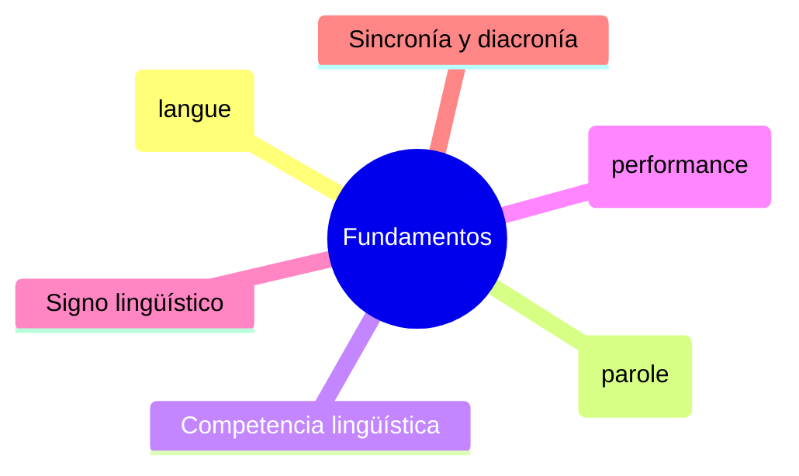
```mermaid
mindmap
  root((Fundamentos))
    Lengua (langue)
    Habla (parole)
    Competencia lingüística
    Actuación lingüística (performance)
    Signo lingüístico
    Sincronía y diacronía
```


### 1.1 Lengua (_langue_)

Sistema abstracto de reglas y convenciones compartido por una comunidad de hablantes. En NLP, la lengua es el objeto que intentamos modelar: las regularidades estadísticas y estructurales que un modelo de lenguaje aprende a partir de un corpus.

**Ejemplo:** El español posee la regla de concordancia de género y número entre sustantivo y adjetivo (_casa blanca_, no \*_casa blanco_). Un modelo de lenguaje bien entrenado asigna probabilidad muy baja a secuencias que violan esta regla.

### 1.2 Habla (_parole_)

Realización concreta e individual de la lengua en un acto comunicativo. Cada oración que un usuario escribe en un chatbot es un acto de habla; el corpus de entrenamiento de un LLM es una colección masiva de actos de habla.

**Ejemplo:** Dos usuarios pueden pedir lo mismo de maneras muy distintas: "¿Qué clima hace?" vs. "Oye, ¿va a llover hoy o qué?". Ambas son instancias de habla del mismo acto ilocutivo (solicitar información meteorológica).

### 1.3 Competencia lingüística

Conocimiento implícito que un hablante posee sobre su lengua. En la analogía con NLP, la competencia corresponde a los pesos internos de un modelo que codifican patrones gramaticales, sin que el modelo "sepa" que los sabe.

**Ejemplo:** Un hablante nativo sabe que "El gato duerme" es gramatical y que \*"Gato el duerme" no lo es, aunque no pueda enunciar la regla formal de orden SVO.

### 1.4 Actuación lingüística (_performance_)

Uso real de la lengua en situaciones concretas. Incluye errores, vacilaciones y autocorrecciones. En NLP, la actuación se refleja en los datos ruidosos del corpus: erratas, fragmentos incompletos y code-switching.

**Ejemplo:** Un tuit como "jajaj no mmes wey ya vi q no sirve" es actuación: contiene abreviaturas, risas escritas y registro coloquial que un tokenizer robusto debe manejar.

### 1.5 Signo lingüístico

Unidad compuesta por un **significante** (forma fonológica o gráfica) y un **significado** (concepto). En NLP, la relación arbitraria entre significante y significado es el motivo por el cual no basta con mirar la forma de las palabras para entender su sentido; se necesitan representaciones distribucionales.

**Ejemplo:** La secuencia de letras "banco" puede significar un asiento o una institución financiera. El modelo debe desambiguar a partir del contexto.

### 1.6 Sincronía y diacronía

- **Sincronía:** estudio de la lengua en un momento dado.
- **Diacronía:** estudio de la evolución histórica de la lengua.

En NLP, el _concept drift_ —cambio en la distribución de los datos con el paso del tiempo— es un problema diacrónico: los modelos entrenados con textos de 2015 pueden fallar con jerga de 2026.

**Ejemplo:** La palabra "viral" tenía un uso predominantemente médico en corpus de los 90; hoy su uso dominante en redes sociales es metafórico.

---

## 2 · Fonética y fonología

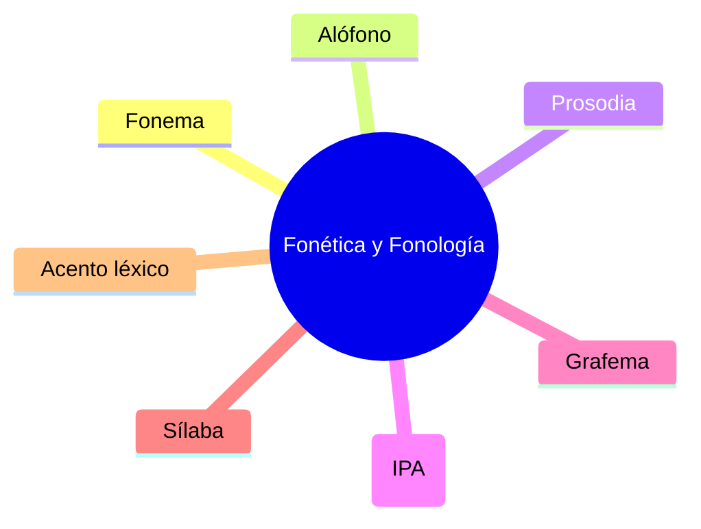
```mermaid
mindmap
  root((Fonética y Fonología))
    Fonema
    Alófono
    Prosodia
    Transcripción fonética (IPA)
    Grafema
    Sílaba
    Acento léxico
```


### 2.1 Fonema

Unidad mínima de sonido con valor distintivo en una lengua. Aunque NLP trabaja mayoritariamente con texto, la fonología es central en **ASR** (Automatic Speech Recognition) y **TTS** (Text-to-Speech).

**Ejemplo:** En español, /p/ y /b/ son fonemas distintos: _pata_ vs. _bata_. Un sistema ASR debe distinguirlos en la señal acústica.

### 2.2 Alófono

Variante fonética de un fonema que no cambia el significado. Los sistemas TTS necesitan generar alófonos correctos para sonar naturales.

**Ejemplo:** La /d/ en "dado" se realiza como oclusiva [d] al inicio y como fricativa [ð] entre vocales. Un TTS de alta calidad modela esta alternancia.

### 2.3 Prosodia

Patrones suprasegmentales: entonación, acento, ritmo y pausas. Es crucial en análisis de sentimiento basado en audio y en TTS expresivo.

**Ejemplo:** La oración "Viene mañana" puede ser afirmación (entonación descendente) o pregunta (entonación ascendente). Un clasificador de intención sobre audio debe capturar esta diferencia.

### 2.4 Transcripción fonética (IPA)

Representación estandarizada de los sonidos del habla usando el Alfabeto Fonético Internacional. Se usa en lexicones de pronunciación para ASR y TTS (por ejemplo, el CMU Pronouncing Dictionary).

**Ejemplo:** La palabra "chocolate" se transcribe /tʃokoˈlate/ en español. Un sistema G2P (Grapheme-to-Phoneme) convierte grafemas a esta representación.

### 2.5 Grafema

Unidad mínima de escritura. La conversión grafema-fonema (G2P) es un componente clave en pipelines TTS.

**Ejemplo:** En español la correspondencia es bastante regular ("c" antes de "a" = /k/), pero en inglés es notoriamente irregular ("through", "though", "tough").

### 2.6 Sílaba

Unidad fonológica formada por un núcleo vocálico y opcionalmente consonantes. Algunos tokenizers subword producen unidades que coinciden con sílabas.

**Ejemplo:** "com-pu-ta-do-ra" tiene cinco sílabas. Un modelo de segmentación silábica puede ayudar en tareas de alineación texto-audio.

### 2.7 Acento léxico

Prominencia relativa de una sílaba dentro de una palabra. En español es fonémico: cambia el significado.

**Ejemplo:** "público" (sustantivo/adjetivo), "publico" (verbo, presente) y "publicó" (verbo, pretérito) se distinguen solo por la posición del acento.

---

## 3 · Morfología

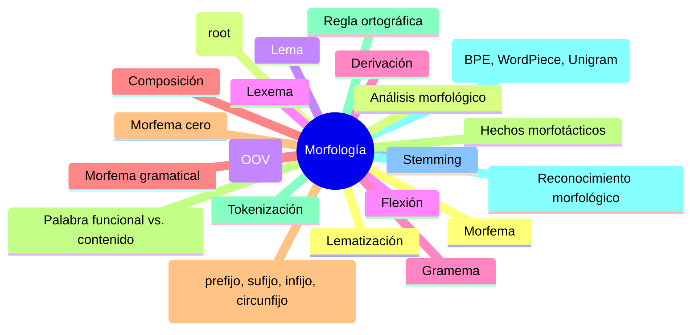
```mermaid
mindmap
  root((Morfología))
    Morfema
    Raíz (root)
    Lema
    Flexión
    Derivación
    Composición
    Afijo (prefijo, sufijo, infijo, circunfijo)
    Palabra funcional vs. contenido
    Tokenización
    Tokenización subword (BPE, WordPiece, Unigram)
    Stemming
    Lematización
    Análisis morfológico
    Vocabulario abierto vs. cerrado (OOV)
    Lexema
    Gramema
    Morfema gramatical
    Morfema cero
    Hechos morfotácticos
    Regla ortográfica
    Reconocimiento morfológico
```


### 3.1 Morfema

Unidad mínima con significado. Es la base del análisis morfológico en NLP, relevante para idiomas morfológicamente ricos como el español, el turco o el finés.

**Ejemplo:** "incorregibles" se descompone en: _in-_ (negación) + _correg-_ (raíz) + _-ible_ (capacidad) + _-s_ (plural). Cuatro morfemas.

### 3.2 Raíz (_root_)

Forma más reducida de una palabra tras eliminar todos los afijos. El **stemming** es la aproximación computacional a la extracción de la raíz.

**Ejemplo:** El stemmer de Porter reduce "running", "runs" y "ran" a "run". En español, un stemmer podría reducir "cantábamos" a "cant-".

### 3.3 Lema

Forma canónica o de diccionario de una palabra. La **lematización** es más sofisticada que el stemming porque requiere conocimiento morfológico.

**Ejemplo:** "cantábamos" → lema "cantar"; "mejores" → lema "bueno". SpaCy y Stanza implementan lematización basada en reglas y modelos estadísticos.

### 3.4 Flexión

Variación morfológica que expresa categorías gramaticales (tiempo, persona, número, género, caso) sin cambiar la categoría léxica.

**Ejemplo:** El verbo "comer": como, comes, come, comemos, coméis, comen (flexión de persona y número en presente indicativo). Un modelo de análisis morfológico como Morfessor segmenta estas formas.

### 3.5 Derivación

Proceso morfológico que crea palabras nuevas, frecuentemente cambiando la categoría gramatical.

**Ejemplo:** "nación" (sustantivo) → "nacional" (adjetivo) → "nacionalizar" (verbo) → "desnacionalización" (sustantivo). Cada paso es una derivación.

### 3.6 Composición

Formación de palabras a partir de la unión de dos o más lexemas.

**Ejemplo:** "limpiaparabrisas" = limpia + para + brisas. En alemán, la composición es extremadamente productiva ("Donaudampfschifffahrt…") y es un desafío clásico para tokenizers.

### 3.7 Afijo (prefijo, sufijo, infijo, circunfijo)

Morfema que se une a una base. Los subword tokenizers como BPE o Unigram a menudo descubren afijos de manera emergente.

**Ejemplo:** El tokenizer de GPT-2 aprende piezas como "un" (prefijo de negación en inglés: "un-happy", "un-do") como una unidad subword frecuente.

### 3.8 Palabra funcional vs. palabra de contenido

- **Palabras de contenido** (léxicas): sustantivos, verbos, adjetivos. Llevan carga semántica.
- **Palabras funcionales** (gramaticales): preposiciones, conjunciones, determinantes. Tienen función estructural.

En NLP clásico, las palabras funcionales se tratan como **stopwords** y suelen eliminarse para tareas como recuperación de información. En modelos de lenguaje modernos, se mantienen porque aportan estructura sintáctica.

**Ejemplo:** En "El gato está sobre la mesa", las palabras funcionales son "el", "está", "sobre", "la". Un bag-of-words sin stopwords retiene solo "gato" y "mesa".

### 3.9 Tokenización

Proceso de segmentar texto en unidades discretas (tokens). Es el primer paso de casi todo pipeline NLP.

**Ejemplo:** "No puedo creerlo" puede tokenizarse a nivel de palabra: ["No", "puedo", "creerlo"] o a nivel subword: ["No", "pued", "o", "creer", "lo"].

### 3.10 Tokenización subword (BPE, WordPiece, Unigram)

Métodos que segmentan el texto en unidades intermedias entre caracteres y palabras, equilibrando vocabulario finito con cobertura de palabras raras.

- **BPE** (Byte Pair Encoding): fusiona iterativamente los pares de símbolos más frecuentes.
- **WordPiece:** similar a BPE pero optimiza verosimilitud.
- **Unigram:** parte de un vocabulario grande y lo poda.

**Ejemplo:** La palabra "incrédulamente" con BPE podría segmentarse como: ["in", "cré", "dul", "amente"]. Esto permite al modelo manejar palabras nunca vistas descomponiéndolas en partes conocidas.

### 3.11 Stemming

Reducción heurística de una palabra a su raíz aproximada, cortando sufijos con reglas.

**Ejemplo:** El algoritmo Snowball para español reduce "bibliotecarios" → "bibliotecari". Es rápido pero impreciso: "organización" y "órgano" podrían reducirse al mismo stem.

### 3.12 Lematización

Reducción de una palabra a su lema usando análisis morfológico completo (diccionarios, reglas, modelos).

**Ejemplo:** "fui" → "ir" o "ser" (ambiguo sin contexto). Un lematizador con desambiguación contextual como el de SpaCy elige el lema correcto basándose en la oración completa.

### 3.13 Análisis morfológico (_morphological parsing_)

Descomposición completa de una palabra en sus morfemas constituyentes con etiquetas.

**Ejemplo:** "desafortunadamente" → des- [PREFIX:negación] + fortuna [ROOT] + -da [SUFFIX:participio] + -mente [SUFFIX:adverbio]. Herramientas como Morfessor, UDPipe o Stanza realizan esta tarea.

### 3.14 Vocabulario abierto vs. cerrado (_OOV — Out of Vocabulary_)

Las palabras fuera de vocabulario son un problema clásico en NLP. La tokenización subword lo mitiga pero no lo elimina para grafías extremas.

**Ejemplo:** Un modelo entrenado sin datos de redes sociales puede encontrar OOV en "skere", "uwu" o "xdxd".

### 3.15 Morfología

Rama de la lingüística que estudia la estructura interna de las palabras y los procesos de formación léxica. En NLP, la morfología computacional es clave para idiomas morfológicamente ricos (árabe, turco, finés) donde una sola palabra puede encapsular varios constituyentes.

**Ejemplo:** El turco "gidiyormusunuz" (¿Están yendo?) es una única forma verbal que un analizador morfológico descompone en gid- (ir) + -iyor (presente continuo) + -muşunuz (evidencial + 2.ª pers. pl.). Herramientas como Morfessor o UDPipe abordan esta complejidad.

### 3.16 Lexema

Unidad abstracta del léxico que agrupa todas las formas flexionadas de una misma palabra. Equivale a la entrada de diccionario, independientemente de sus variantes morfológicas.

**Ejemplo:** El lexema CANTAR agrupa: canto, cantas, cantaba, cantaría, cantando, cantado, etc. Un lexicón computacional almacena lexemas y sus paradigmas flexivos para facilitar la búsqueda y la lematización.

### 3.17 Gramema

Morfema gramatical que aporta información funcional (tiempo, número, género, caso, persona) sin contenido léxico propio. También llamado morfema de función.

**Ejemplo:** En "niñas", el gramema -a indica género femenino y el gramema -s indica número plural. Los POS taggers enriquecidos identifican estos rasgos morfosintácticos mediante la columna FEATS de Universal Dependencies.

### 3.18 Morfema gramatical

Morfema que expresa categorías gramaticales (concordancia, tiempo verbal, caso) en lugar de significado léxico. Sinónimo de gramema; se distingue del morfema léxico (raíz, lexema).

**Ejemplo:** En "comemos", -mos es morfema gramatical que indica 1.ª persona del plural. Los parsers de dependencias validan la concordancia entre sujeto y verbo a partir de la información codificada en estos morfemas.

### 3.19 Morfema cero (∅)

Morfema que no tiene realización fonológica ni gráfica pero cuya presencia se infiere por contraste paradigmático con otras formas del mismo paradigma.

**Ejemplo:** En "gato" (singular masculino), el morfema de número singular es ∅: gato-∅ vs. gato-s (plural). Los sistemas de anotación morfológica representan esta categoría aunque no haya sufijo visible, manteniendo la regularidad del análisis.

### 3.20 Hechos morfotácticos

Restricciones que determinan en qué orden y con qué combinaciones pueden aparecer los morfemas dentro de una palabra. Son la base de las gramáticas de estado finito para morfología.

**Ejemplo:** En español la secuencia válida es: prefijo + raíz + sufijo derivativo + sufijo flexivo ("des-nacion-aliz-aban"), mientras que sufijo + raíz es inválida. Un analizador morfológico de estado finito (FST) codifica estas restricciones como autómatas compilados.

### 3.21 Regla ortográfica

Convención gráfica que adapta la forma escrita de un morfema al entorno fonológico o gráfico en que aparece; parte de la interfaz entre morfología y escritura.

**Ejemplo:** En inglés, la regla de doblado de consonante: "run" + -ing → "running" (no \*"runing"). En español, el cambio c→qu: "buscar" + -é → "busqué". Los tokenizadores y lematizadores deben conocer estas reglas para segmentar y normalizar correctamente.

### 3.22 Reconocimiento morfológico

Tarea computacional que identifica y etiqueta la estructura morfológica de las palabras de un texto: raíces, afijos y categorías gramaticales asociadas.

**Ejemplo:** Dado "desfavorablemente", un analizador produce: des- [PREF, negación] + favor [ROOT] + -able [SUFF, adjetivador] + -mente [SUFF, adverbializador]. Herramientas como Freeling, UDPipe y Stanza realizan este análisis como parte del pipeline NLP.

---

## Morfosintaxis

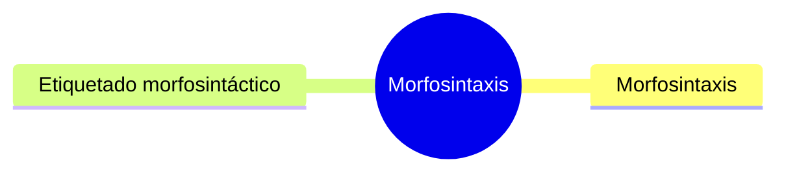
```mermaid
mindmap
  root((Morfosintaxis))
    Morfosintaxis
    Etiquetado morfosintáctico
```


### Morfosintaxis.1 Morfosintaxis

Interfaz entre morfología y sintaxis que estudia cómo las categorías morfológicas (género, número, caso, tiempo, persona) determinan la concordancia entre los constituyentes de la oración y condicionan la estructura sintáctica.

**Ejemplo:** En "Las casas grandes son caras", el morfema plural -s activa la concordancia morfosintáctica en artículo (las), sustantivo (casas), adjetivo (grandes) y predicado (son caras). Universal Dependencies captura estas relaciones en la columna FEATS del formato CoNLL-U.

### Morfosintaxis.2 Etiquetado morfosintáctico

Proceso de asignar a cada token una etiqueta que codifica simultáneamente su categoría léxica (POS) y sus rasgos morfológicos (género, número, tiempo, modo, caso, etc.). También llamado análisis morfosintáctico.

**Ejemplo:** Para "corrieron", el etiquetado morfosintáctico produce: VERB + Mood=Ind|Number=Plur|Person=3|Tense=Past. En UD, la columna FEATS del formato CoNLL-U recoge estos rasgos. Herramientas como Stanza, SpaCy o Trankit los generan automáticamente.

---

## 4 · Sintaxis

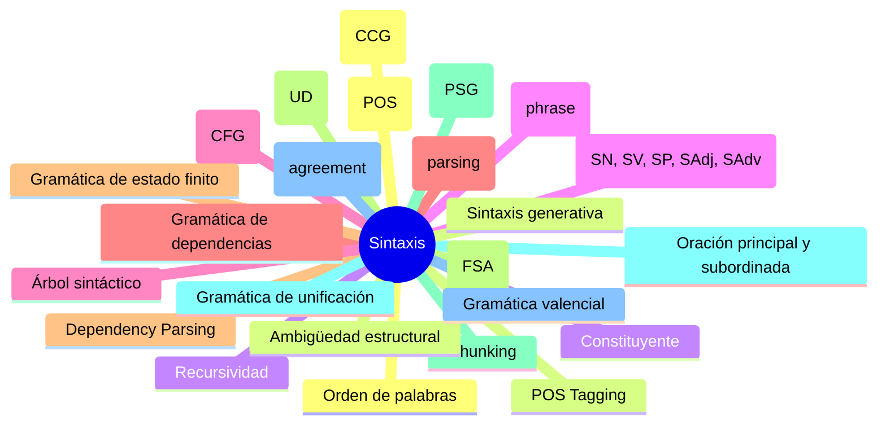
```mermaid
mindmap
  root((Sintaxis))
    Categoría gramatical (POS)
    POS Tagging
    Constituyente
    Sintagma (phrase)
    Gramática libre de contexto (CFG)
    Gramática de dependencias
    Dependency Parsing
    Universal Dependencies (UD)
    Chunking
    Oración principal y subordinada
    Concordancia (agreement)
    Orden de palabras
    Ambigüedad estructural
    Recursividad
    Tipos de sintagmas (SN, SV, SP, SAdj, SAdv)
    Árbol sintáctico
    Análisis sintáctico (parsing)
    Gramática de estado finito
    Máquina de estado finito (FSA)
    Gramática de estructura sintagmática (PSG)
    Gramática de unificación
    Gramática valencial
    Gramática con categorías complejas (CCG)
    Sintaxis generativa
```


### 4.1 Categoría gramatical / Parte del discurso (_Part of Speech, POS_)

Clasificación de las palabras según su función gramatical: sustantivo (NOUN), verbo (VERB), adjetivo (ADJ), adverbio (ADV), determinante (DET), pronombre (PRON), preposición (ADP), conjunción (CCONJ/SCONJ), interjección (INTJ), etc.

**Ejemplo:** En "El perro negro ladra fuerte":
| Token | POS |
|-------|-----|
| El | DET |
| perro | NOUN |
| negro | ADJ |
| ladra | VERB |
| fuerte | ADV |

### 4.2 POS Tagging (etiquetado POS)

Tarea de NLP que asigna automáticamente una categoría gramatical a cada token. Se resuelve con modelos de secuencia: HMM, CRF, BiLSTM-CRF o Transformers.

**Ejemplo:** El algoritmo de Viterbi sobre un HMM calcula la secuencia de etiquetas más probable para "Banco de la nación" → [NOUN, ADP, DET, NOUN].

### 4.3 Constituyente

Grupo de palabras que funciona como una unidad sintáctica. El **análisis de constituyentes** (_constituency parsing_) produce árboles jerárquicos.

**Ejemplo:**
```
[S [NP El gato] [VP duerme [PP en [NP la alfombra]]]]
```
Aquí, "El gato" es un constituyente NP (sintagma nominal) y "en la alfombra" es un PP (sintagma preposicional).

### 4.4 Sintagma (_phrase_)

Unidad sintáctica con un núcleo:
- **NP** (Noun Phrase / Sintagma nominal): "la vieja casa de madera"
- **VP** (Verb Phrase / Sintagma verbal): "ha estado corriendo"
- **PP** (Prepositional Phrase): "desde la montaña"
- **AP** (Adjective Phrase): "muy interesante"
- **AdvP** (Adverb Phrase): "bastante lejos"

**Ejemplo en NLP:** La extracción de sintagmas nominales (NP chunking) es clave para identificar entidades y conceptos en texto.

### 4.5 Gramática libre de contexto (_Context-Free Grammar, CFG_)

Formalismo que define la estructura sintáctica mediante reglas de reescritura. Base de los parsers de constituyentes.

**Ejemplo:**
```
S  → NP VP
NP → DET N
VP → V NP
DET → "el" | "la"
N  → "gato" | "rata"
V  → "persigue"
```
Esta gramática genera "el gato persigue la rata".

### 4.6 Gramática de dependencias (_Dependency Grammar_)

Formalismo donde la estructura se representa como relaciones binarias dirigidas entre un **núcleo** (_head_) y un **dependiente**. Es el formalismo dominante en NLP moderno (Universal Dependencies).

**Ejemplo:** "María come pizza"
```
come ─── nsubj ──→ María
come ─── obj ────→ pizza
```

### 4.7 Dependency Parsing (análisis de dependencias)

Tarea que construye el árbol de dependencias de una oración. Implementaciones: modelos de transición (arc-standard, arc-eager), modelos basados en grafos (Eisner, MST) y Transformers con decodificación biaffine.

**Ejemplo con SpaCy:**
```python
import spacy
nlp = spacy.load("es_core_news_sm")
doc = nlp("El niño come una manzana roja")
for token in doc:
    print(token.text, token.dep_, token.head.text)
# El       det    niño
# niño     nsubj  come
# come     ROOT   come
# una      det    manzana
# manzana  obj    come
# roja     amod   manzana
```

### 4.8 Universal Dependencies (UD)

Proyecto que proporciona anotaciones de dependencias sintácticas consistentes a través de más de 100 lenguas. Es el estándar de facto para entrenar y evaluar parsers multilingües.

**Ejemplo:** Las relaciones UD incluyen: `nsubj` (sujeto nominal), `obj` (objeto directo), `iobj` (objeto indirecto), `amod` (modificador adjetival), `nmod` (modificador nominal), `advmod` (modificador adverbial), `det` (determinante), etc.

### 4.9 Chunking (análisis superficial)

Análisis sintáctico parcial que identifica constituyentes no recursivos (chunks) sin construir un árbol completo.

**Ejemplo:** "El gato negro duerme en la alfombra"
→ [NP El gato negro] [VP duerme] [PP en] [NP la alfombra]

### 4.10 Oración principal y subordinada

La identificación de cláusulas principales y subordinadas es importante para tareas como la simplificación de texto y la extracción de relaciones.

**Ejemplo:** "Creo **que el proyecto terminará mañana**." La cláusula subordinada (en negritas) contiene la proposición factual que un sistema de extracción de información debe capturar.

### 4.11 Concordancia (_agreement_)

Fenómeno por el cual ciertos elementos de la oración deben compartir rasgos gramaticales (género, número, persona).

**Ejemplo:** "Las niñas contentas" requiere concordancia femenina plural en determinante, sustantivo y adjetivo. Un modelo de corrección gramatical debe detectar errores como \*"Las niñas contento".

### 4.12 Orden de palabras

La posición relativa de sujeto (S), verbo (V) y objeto (O). Influye en el diseño de modelos y la dificultad de parsing.

**Ejemplo:** El español es predominantemente SVO ("Juan come pan") pero permite variaciones pragmáticas ("Pan come Juan" con énfasis en el objeto). El japonés es SOV y el galés es VSO.

### 4.13 Ambigüedad estructural (_structural ambiguity_)

Una oración con más de un posible árbol de análisis sintáctico.

**Ejemplo:** "Vi al hombre con el telescopio." ¿Usé un telescopio para ver al hombre, o el hombre tenía un telescopio? Un parser debe elegir (o devolver ambos análisis).

### 4.14 Recursividad

Propiedad de las lenguas naturales que permite anidar estructuras dentro de sí mismas indefinidamente.

**Ejemplo:** "El gato que persiguió al ratón que comió el queso que compró María…" Las gramáticas CFG capturan esta propiedad; los modelos finitos (n-gramas) no.

### 4.15 Tipos de sintagmas: SN, SV, SP, SAdj, SAdv

Subtipos del sintagma clasificados por la categoría gramatical de su núcleo:

- **SN** (sintagma nominal): núcleo = sustantivo. Ej.: "el perro negro".
- **SV** (sintagma verbal): núcleo = verbo. Ej.: "corre muy rápido".
- **SP** (sintagma preposicional): núcleo = preposición. Ej.: "por el parque".
- **SAdj** (sintagma adjetival): núcleo = adjetivo. Ej.: "muy inteligente".
- **SAdv** (sintagma adverbial): núcleo = adverbio. Ej.: "bastante bien".

**Ejemplo:** El chunker de SpaCy sobre "El niño come manzanas en el jardín" identifica: [SN El niño] [SV come [SN manzanas] [SP en [SN el jardín]]].

### 4.16 Árbol sintáctico

Representación gráfica de la estructura jerárquica de una oración donde los nodos internos son constituyentes (sintagmas) y los nodos hoja son palabras. Puede ser de constituyentes (_constituency tree_) o de dependencias (_dependency tree_).

**Ejemplo:** Para "El gato duerme", el árbol de constituyentes tiene raíz O con dos hijos: [SN El gato] y [SV duerme]. El Stanford Parser y Stanza producen árboles de constituyentes; SpaCy produce árboles de dependencias.

### 4.17 Análisis sintáctico (_parsing_)

Tarea de NLP que determina la estructura sintáctica de una oración: identifica sus constituyentes y las relaciones entre ellos. Existen dos paradigmas: análisis de constituyentes (_constituency parsing_) y análisis de dependencias (_dependency parsing_).

**Ejemplo:** El dependency parser de SpaCy etiqueta cada token con su cabeza y tipo de relación: "El" (det → gato), "gato" (nsubj → duerme), "duerme" (ROOT). Los modelos modernos usan Transformers fine-tuned sobre treebanks UD.

### 4.18 Gramática de estado finito (_Finite-State Grammar_)

Gramática implementable mediante autómatas finitos (FSA) o transductores de estado finito (FST). Solo puede representar lenguajes regulares; es muy eficiente para morfología y tokenización, pero no para la recursividad sintáctica.

**Ejemplo:** La tokenización de contracciones ("del" → "de" + "el") puede modelarse con un FST en tiempo lineal. Xfst, Foma y OpenFST son herramientas estándar para compilar estas gramáticas.

### 4.19 Máquina de estado finito (_Finite-State Machine / Automaton, FSA_)

Modelo computacional con un conjunto de estados, transiciones etiquetadas y estados aceptadores. Base formal de los transductores y gramáticas de estado finito en lingüística computacional.

**Ejemplo:** Un reconocedor morfológico para verbos regulares en -ar puede diseñarse como una FSA que acepta "canto", "cantas", "cantamos", etc. Las implementaciones compiladas (FST) son órdenes de magnitud más rápidas que los parsers probabilísticos para reconocimiento morfológico.

### 4.20 Gramática de estructura sintagmática (_Phrase Structure Grammar, PSG_)

Gramática que describe la estructura de las oraciones en términos de constituyentes anidados mediante reglas de reescritura (X → Y Z). La gramática libre de contexto (CFG) es su caso más estudiado en NLP.

**Ejemplo:** Las reglas "O → SN SV" y "SN → Det N" definen una PSG mínima. El Penn Treebank anotó más de un millón de palabras del Wall Street Journal con árboles de estructura sintagmática, siendo el recurso de referencia para entrenar parsers de constituyentes.

### 4.21 Gramática de unificación (_Unification Grammar_)

Formalismo donde las restricciones gramaticales se expresan como estructuras de rasgos (_feature structures_) que se combinan mediante unificación. Permite representar concordancia y subcategorización de forma declarativa.

**Ejemplo:** En HPSG, la concordancia de género entre determinante y sustantivo se implementa con [GÉNERO: ?X] que debe unificarse en ambos. HPSG, LFG y FUG son los principales formalismos; el Stanford HPSG parser usa este enfoque.

### 4.22 Gramática valencial (_Valency Grammar_)

Teoría que caracteriza los predicados según el número y tipo de argumentos que requieren (su _valencia_). Deriva de la gramática de dependencias de Tesnière.

**Ejemplo:** "Dar" tiene valencia 3 (trivalente): sujeto (AGENTE), objeto directo (TEMA) y objeto indirecto (DESTINATARIO): "Juan dio el libro a María". PropBank y FrameNet codifican esta información valencial para los parsers semánticos.

### 4.23 Gramática con categorías complejas (_Combinatory Categorial Grammar, CCG_)

Formalismo altamente lexicalizado donde las categorías gramaticales especifican cómo cada palabra se combina con sus vecinos mediante combinadores. Permite derivaciones sintáctico-semánticas simultáneas.

**Ejemplo:** Un verbo transitivo tiene categoría (S\NP)/NP: combina con un SN a la derecha para dar S\NP, y luego con un SN a la izquierda para dar S. El CCGbank y parsers como EasyCCG y DepCCG implementan este formalismo.

### 4.24 Sintaxis generativa

Corriente teórica, iniciada por Chomsky, que postula una gramática universal subyacente a todas las lenguas y estudia las propiedades formales de las estructuras sintácticas mediante reglas y transformaciones abstractas.

**Ejemplo:** La teoría del movimiento Wh- explica "¿Qué libro leíste?" como derivado de "Leíste [qué libro]" mediante una transformación. Estos mecanismos inspiran formalismos como HPSG y LFG, más tractables computacionalmente que la gramática transformacional clásica.

---

## 5 · Semántica

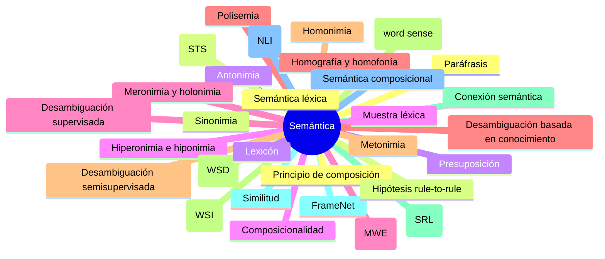
```mermaid
mindmap
  root((Semántica))
    Semántica léxica
    Sinonimia
    Antonimia
    Hiperonimia e hiponimia
    Meronimia y holonimia
    Polisemia
    Homonimia
    Word Sense Disambiguation (WSD)
    Semantic Role Labeling (SRL)
    FrameNet
    Implicación textual (NLI)
    Paráfrasis
    Semantic Textual Similarity (STS)
    Presuposición
    Composicionalidad
    Multi-Word Expressions (MWE)
    Homografía y homofonía
    Metonimia
    Sentido de la palabra (word sense)
    Conexión semántica
    Similitud
    Semántica composicional
    Principio de composición
    Hipótesis rule-to-rule
    Lexicón
    Muestra léxica
    Desambiguación supervisada
    Desambiguación basada en conocimiento
    Desambiguación semisupervisada
    Desambiguación no supervisada (WSI)
```


### 5.1 Semántica léxica

Estudio del significado de las palabras individuales. Es la base de los **word embeddings** y de los lexicones semánticos.

### 5.2 Sinonimia

Relación entre palabras con significado similar.

**Ejemplo:** "feliz" y "contento" son sinónimos aproximados. En NLP, los embeddings de sinónimos tienden a estar cercanos en el espacio vectorial: `cos(embed("feliz"), embed("contento"))` debería ser alto.

### 5.3 Antonimia

Relación entre palabras con significados opuestos. Es problemática para embeddings distribucionales porque los antónimos suelen aparecer en contextos similares.

**Ejemplo:** "frío" y "caliente" co-ocurren con "temperatura", "clima", "sensación", lo que puede hacer que sus vectores sean cercanos a pesar de ser antónimos.

### 5.4 Hiperonimia e hiponimia

- **Hiperónimo:** término más general.
- **Hipónimo:** término más específico.

**Ejemplo:** "animal" es hiperónimo de "perro"; "perro" es hipónimo de "animal". WordNet codifica estas relaciones jerárquicas y se usa para calcular similitud semántica (por ejemplo, la similitud de Wu-Palmer).

### 5.5 Meronimia y holonimia

- **Merónimo:** la parte.
- **Holónimo:** el todo.

**Ejemplo:** "rueda" es merónimo de "coche"; "coche" es holónimo de "rueda". Estas relaciones son útiles en knowledge graphs y en QA (Question Answering).

### 5.6 Polisemia

Una palabra con múltiples significados relacionados.

**Ejemplo:** "cabeza" puede referirse a la parte del cuerpo, al líder de un grupo o al extremo de un clavo. Los modelos contextuales (BERT, GPT) generan embeddings diferentes para cada uso.

### 5.7 Homonimia

Palabras con la misma forma pero significados no relacionados.

**Ejemplo:** "vela" (de un barco) y "vela" (cilindro de cera). A diferencia de la polisemia, aquí no hay relación semántica entre los significados.

### 5.8 Word Sense Disambiguation (WSD)

Tarea de determinar el sentido correcto de una palabra polisémica u homónima en contexto.

**Ejemplo:** En "Deposité dinero en el banco", WSD debe seleccionar el sentido financiero de "banco" y descartar el sentido de asiento.

### 5.9 Roles semánticos (_Semantic Role Labeling, SRL_)

Identificación de "quién hizo qué a quién, dónde, cuándo y cómo" en una oración. Asigna roles como Agente, Paciente, Instrumento, Lugar, Tiempo.

**Ejemplo:** "María cortó el pan con un cuchillo en la cocina."
- **Agente:** María
- **Paciente:** el pan
- **Instrumento:** un cuchillo
- **Lugar:** la cocina
- **Predicado:** cortó

### 5.10 Marco semántico (_FrameNet_)

Estructura conceptual que representa una situación prototípica con sus participantes y propiedades.

**Ejemplo:** El frame "Comercio" incluye roles como Comprador, Vendedor, Mercancía y Precio. La oración "Ana compró flores por $10 a Pedro" instancia este frame.

### 5.11 Implicación textual (_Textual Entailment / NLI_)

Relación entre dos textos donde la verdad del primero (premisa) garantiza la verdad del segundo (hipótesis).

**Ejemplo:**
- Premisa: "Todos los gatos son mamíferos."
- Hipótesis: "Mi gato es un mamífero."
- Relación: **Entailment** (implicación).

Datasets como SNLI y MultiNLI evalúan esta capacidad.

### 5.12 Paráfrasis

Dos expresiones con el mismo significado pero diferente forma.

**Ejemplo:** "El coche rojo es rápido" ↔ "El automóvil de color rojo tiene alta velocidad." La detección de paráfrasis es clave en detección de plagio, deduplicación y evaluación de generación de texto.

### 5.13 Similitud semántica textual (_Semantic Textual Similarity, STS_)

Medida del grado de equivalencia de significado entre dos textos, generalmente en una escala de 0 a 5.

**Ejemplo:**
- "El gato se sienta en la alfombra" vs. "Un felino está sobre el tapete" → STS ≈ 4.5
- "El gato se sienta en la alfombra" vs. "El mercado bursátil cayó hoy" → STS ≈ 0.1

### 5.14 Presuposición

Información que se da por sentada al emitir un enunciado.

**Ejemplo:** "Juan dejó de fumar" presupone que Juan fumaba. Un sistema de comprensión de lenguaje debe inferir esta información implícita.

### 5.15 Composicionalidad

Principio según el cual el significado de una expresión compleja se determina a partir del significado de sus partes y de las reglas de combinación.

**Ejemplo:** "perro grande" se entiende componiendo "perro" + "grande". Pero los modismos violan la composicionalidad: "estirar la pata" no significa literalmente extender una extremidad, sino morir.

### 5.16 Expresiones multipalabra (_Multi-Word Expressions, MWE_)

Combinaciones de palabras con significado no composicional o con propiedades estadísticas inusuales.

**Ejemplo:** "tomar el pelo" (engañar), "dar a luz" (parir), "a pesar de" (concesión). Los modelos deben tratar estas secuencias como unidades.

### 5.17 Homografía y homofonía

Subtipos de homonimia según el plano de coincidencia:

- **Homografía:** dos palabras con la misma grafía pero distinto significado y origen.
- **Homofonía:** dos palabras con la misma pronunciación pero distinta grafía y significado.

**Ejemplo:** "vino" (bebida / pretérito de venir) es homógrafa y homófona. "tubo" (cilindro) y "tuvo" (pretérito de tener) son homófonas pero no homógrafas. Los sistemas TTS deben conocer esta distinción para pronunciar correctamente según el contexto.

### 5.18 Metonimia

Fenómeno semántico en que una entidad es referida por el nombre de otra con la que tiene una relación de contigüidad (contenedor/contenido, parte/todo, lugar/institución, causa/efecto).

**Ejemplo:** "Bebí tres vasos" (el continente por el contenido), "el Kremlin declaró" (el lugar por la institución), "leer a Cervantes" (el autor por su obra). En NLP, la metonimia complica la resolución de correferencia y la extracción de información.

### 5.19 Sentido de la palabra (_word sense_)

Cada una de las acepciones diferenciadas de una palabra polisémica u homónima. Los recursos como WordNet organizan los sentidos en grupos de sinónimos (_synsets_) con definiciones (_glosses_) y ejemplos.

**Ejemplo:** "banco" tiene al menos tres sentidos en WordNet-es: _institución financiera_, _asiento largo_ y _banco de peces_. Los sistemas de WSD seleccionan el sentido correcto según el contexto: "fue al banco a pedir un préstamo" → sentido financiero.

### 5.20 Conexión semántica (_semantic relatedness_)

Medida del grado en que dos palabras están relacionadas semánticamente en cualquier forma: sinonimia, meronimia, co-hipónimos, asociación temática, etc. Más amplia que la similitud semántica.

**Ejemplo:** "doctor" y "hospital" tienen alta conexión semántica aunque no son sinónimos ni hiperónimos entre sí: co-ocurren en contextos similares. Datasets como WordSim-353 evalúan esta medida empíricamente.

### 5.21 Similitud (semántica)

Medida del grado en que dos palabras o textos comparten significado esencial, basada en relaciones de sinonimia o hiponimia. Distinta de conexión semántica, que abarca relaciones más generales.

**Ejemplo:** "coche" y "automóvil" tienen similitud alta (casi sinónimos); "coche" y "gasolinera" tienen alta conexión semántica pero baja similitud. SimLex-999 es el benchmark estándar para evaluar similitud léxica frente a asociación.

### 5.22 Semántica composicional

Rama de la semántica que estudia cómo el significado de una expresión compleja se construye sistemáticamente a partir del significado de sus partes y las reglas de combinación sintáctica. Sustentada en el principio de composición.

**Ejemplo:** El significado de "gato negro" se deriva composicionalmente como la intersección de las extensiones de "gato" y "negro". La lógica de primer orden y el lambda-cálculo proveen marcos formales para esta composición.

### 5.23 Principio de composición (_principio de Frege_)

Principio que establece que el significado de una expresión compleja está determinado únicamente por los significados de sus partes y la forma en que se combinan sintácticamente. Pilar formal de la semántica composicional.

**Ejemplo:** "Juan besa a María" → BESAR(JUAN, MARÍA). Cambiando "Juan" por "María" el significado cambia de forma predecible: BESAR(MARÍA, JUAN). Este principio permite que los modelos formales escalen a oraciones de longitud arbitraria.

### 5.24 Hipótesis _rule-to-rule_

Hipótesis de semántica composicional formal que postula una correspondencia biunívoca entre reglas sintácticas y reglas semánticas: a cada regla combinatoria sintáctica le corresponde exactamente una operación de composición semántica.

**Ejemplo:** Si la regla sintáctica es "SN → Det N", la regla semántica especifica cómo combinar las representaciones del determinante y el nombre. La Gramática de Montague implementa estrictamente esta hipótesis, haciendo explícito el puente entre sintaxis y semántica.

### 5.25 Lexicón

Componente de un sistema lingüístico o computacional que almacena información sobre las palabras: formas, categorías, significados, estructura argumental y restricciones de selección. Más completo que un diccionario porque incluye información formal procesable.

**Ejemplo:** El lexicón de un parser HPSG contiene para "dormir": categoría (VERB), valencia (intransitivo), rasgos morfológicos y restricción semántica (sujeto animado). WordNet, FrameNet y PropBank son lexicones computacionales de referencia.

### 5.26 Muestra léxica (_lexical sample_)

Subconjunto de palabras ambiguas seleccionadas para una tarea de evaluación de WSD. Contrasta con el escenario _all-words_ donde se desambiguan todas las palabras del texto.

**Ejemplo:** Senseval-2 y SemEval usaron muestras léxicas de ~40–100 palabras objetivo con múltiples instancias de cada una en contexto. Este enfoque permite evaluación controlada de sistemas de desambiguación.

### 5.27 Desambiguación supervisada

Enfoque de WSD que entrena un clasificador con ejemplos etiquetados (texto + sentido correcto) para predecir el sentido de palabras según el contexto.

**Ejemplo:** Un clasificador SVM entrenado en SemCor aprende que "banco" con "dinero" o "préstamo" corresponde al sentido financiero, y con "madera" o "sentarse" al de asiento. Es el enfoque de mayor rendimiento cuando hay datos etiquetados suficientes.

### 5.28 Desambiguación basada en conocimiento

Enfoque de WSD que utiliza recursos léxicos estructurados (WordNet, diccionarios, grafos de conocimiento) sin datos de entrenamiento anotados; aplica heurísticas o medidas de similitud sobre el grafo semántico.

**Ejemplo:** El algoritmo Lesk selecciona el sentido cuya definición en el diccionario comparte más palabras con el contexto: "banco" en "fue al banco a sacar dinero" → mayor solapamiento con la gloss de institución financiera. Babelfy extiende este enfoque a grafos multilingües.

### 5.29 Desambiguación semisupervisada

Enfoque de WSD que combina pocos ejemplos etiquetados con gran cantidad de texto no etiquetado mediante técnicas de _bootstrapping_ o propagación de etiquetas.

**Ejemplo:** El algoritmo Yarowsky parte de unas pocas instancias "semilla" con sentido conocido y propaga el etiquetado a instancias similares no etiquetadas usando reglas de colocación. Logra alta precisión con una fracción del coste de anotación del enfoque supervisado.

### 5.30 Desambiguación no supervisada (_Word Sense Induction, WSI_)

Enfoque que no usa ningún recurso etiquetado: induce sentidos mediante _clustering_ de representaciones contextuales, sin mapear a inventarios de sentidos predefinidos.

**Ejemplo:** Aplicando clustering sobre representaciones BERT de todas las instancias de "banco" en un corpus, el sistema descubre automáticamente dos grupos de usos: financiero y mueble. No produce etiquetas con nombre pero agrupa instancias semánticamente coherentes.

---

## 6 · Pragmática y discurso

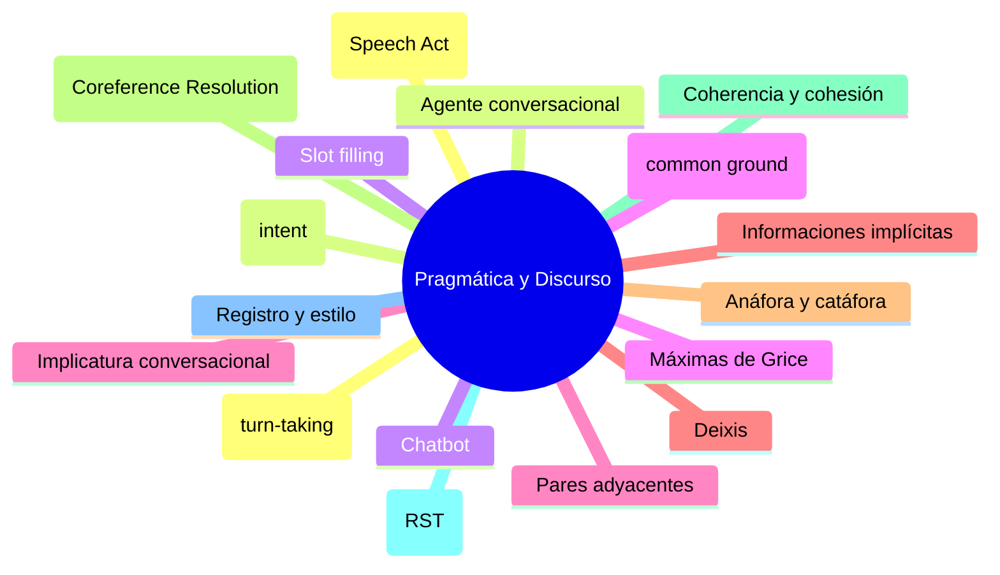
```mermaid
mindmap
  root((Pragmática y Discurso))
    Acto de habla (Speech Act)
    Intención del hablante (intent)
    Slot filling
    Máximas de Grice
    Implicatura conversacional
    Deixis
    Anáfora y catáfora
    Correferencia (Coreference Resolution)
    Coherencia y cohesión
    Relaciones discursivas (RST)
    Registro y estilo
    Turno de diálogo (turn-taking)
    Agente conversacional
    Chatbot
    Punto de coincidencia (common ground)
    Pares adyacentes
    Informaciones implícitas
```


### 6.1 Acto de habla (_Speech Act_)

Acción que se realiza al emitir un enunciado. La clasificación de Austin/Searle distingue:
- **Locutivo:** el acto de decir algo.
- **Ilocutivo:** la intención (pedir, prometer, declarar).
- **Perlocutivo:** el efecto en el oyente.

**Ejemplo:** "¿Puedes pasarme la sal?" es formalmente una pregunta (locutivo), pero funcionalmente una petición (ilocutivo). Un asistente virtual debe interpretar la intención, no responder literalmente "Sí, puedo".

### 6.2 Intención del hablante (_intent_)

En sistemas de diálogo (chatbots, asistentes), la intención es la categoría de acción que el usuario desea realizar.

**Ejemplo en un bot de aerolínea:**
- "Quiero reservar un vuelo a Lima" → intent: `book_flight`
- "¿Cuánto cuesta el equipaje extra?" → intent: `baggage_info`
- "Cancela mi reserva" → intent: `cancel_booking`

### 6.3 Slot filling (relleno de ranuras)

Extracción de los parámetros específicos asociados a una intención.

**Ejemplo:** Para la intención `book_flight`:
- "Quiero un vuelo de **México** a **Lima** el **15 de mayo**"
- Slots: `origin=México`, `destination=Lima`, `date=2026-05-15`

### 6.4 Máximas de Grice

Principios cooperativos de la comunicación:
1. **Cantidad:** da la información justa y necesaria.
2. **Calidad:** di solo lo que crees verdadero.
3. **Relación:** sé relevante.
4. **Manera:** sé claro, breve y ordenado.

**Ejemplo en NLP:** Un modelo que genera respuestas excesivamente largas o irrelevantes viola la máxima de cantidad y de relación. RLHF (Reinforcement Learning from Human Feedback) intenta alinear modelos con estas máximas.

### 6.5 Implicatura conversacional

Significado que se comunica indirectamente, más allá de lo que se dice literalmente.

**Ejemplo:** — "¿Vamos al cine?" — "Tengo examen mañana." La respuesta implica "no", aunque no lo dice explícitamente. Comprender implicaturas es un desafío abierto en NLU.

### 6.6 Deixis

Expresiones cuyo significado depende del contexto de enunciación.

**Ejemplo:** "Yo estaré aquí mañana" — "yo", "aquí" y "mañana" son deícticos: su referente cambia según quién habla, dónde y cuándo. Un asistente virtual debe resolver la deixis temporal para interpretar "mañana" como una fecha concreta.

### 6.7 Anáfora y catáfora

- **Anáfora:** expresión que refiere a algo mencionado antes.
- **Catáfora:** expresión que refiere a algo que se mencionará después.

**Ejemplo de anáfora:** "María llegó tarde. **Ella** estaba cansada." → "Ella" = María.
**Ejemplo de catáfora:** "Cuando **lo** vi, supe que **el paquete** había llegado." → "lo" anticipa "el paquete".

### 6.8 Correferencia (_Coreference Resolution_)

Tarea de identificar todas las expresiones en un texto que refieren a la misma entidad.

**Ejemplo:** "**Barack Obama** nació en Hawái. **El expresidente** estudió en Harvard. **Él** escribió dos libros." → Las tres expresiones en negritas refieren a la misma entidad.

Modelos: e2e-coref, Spanbert-coref, modelos neuronales de mención.

### 6.9 Coherencia y cohesión

- **Cohesión:** mecanismos formales que conectan oraciones (conjunciones, pronombres, repetición léxica).
- **Coherencia:** relación lógica y semántica entre las partes de un texto.

**Ejemplo de falta de coherencia:** "El sol salió. Los pingüinos pueden nadar. La economía creció un 3%." Cada oración es gramaticalmente correcta, pero el texto carece de coherencia global.

### 6.10 Relaciones discursivas (_Rhetorical Structure Theory, RST_)

Marco teórico que analiza cómo las partes de un texto se relacionan retóricamente: causa-efecto, contraste, elaboración, condición, etc.

**Ejemplo:**
- "Llovió mucho [causa], así que se inundó la calle [efecto]."
- "El producto es barato [concesión], pero la calidad es mala [contraste]."

### 6.11 Registro y estilo

Variación del lenguaje según el contexto social: formal, informal, técnico, coloquial.

**Ejemplo:** "Le informo que su solicitud ha sido procesada" (formal) vs. "Ya quedó tu trámite" (informal). La transferencia de estilo (_style transfer_) en NLP busca transformar texto de un registro a otro.

### 6.12 Turno de diálogo (_turn-taking_)

En sistemas conversacionales, la gestión de cuándo habla cada participante. Es central en el diseño de chatbots y asistentes de voz.

**Ejemplo:** Un sistema de diálogo debe detectar que el usuario ha terminado su turno (por silencio o señales lingüísticas como "¿no?") antes de generar una respuesta.

### 6.13 Agente conversacional

Sistema de software capaz de mantener una conversación en lenguaje natural gestionando el flujo del diálogo, la comprensión de intenciones y la generación de respuestas apropiadas al contexto.

**Ejemplo:** Alexa, Siri y Google Assistant son agentes conversacionales. Sus componentes típicos son: ASR (reconocimiento de voz), NLU (intent + slot filling), Dialogue Manager y TTS/NLG. Los LLM modernos habilitan agentes de propósito general sin pipelines modulares explícitos.

### 6.14 Chatbot

Tipo de agente conversacional generalmente orientado a texto y a un dominio específico, diseñado para simular conversación humana mediante respuestas basadas en reglas, recuperación de plantillas o generación neuronal.

**Ejemplo:** Los chatbots de atención al cliente de bancos y aerolíneas responden preguntas frecuentes con respuestas predefinidas. Los chatbots basados en LLM (construidos con LangChain sobre GPT o Claude) tienen capacidades generativas mucho más amplias que los basados en árboles de decisión.

### 6.15 Punto de coincidencia (_common ground_)

Conjunto de conocimientos, creencias y suposiciones que los participantes de una conversación comparten y asumen mutuamente como compartidos. Es fundamental para que el diálogo sea coherente y eficiente.

**Ejemplo:** En un diálogo médico, médico y paciente asumen que ambos saben qué es una "receta": el médico no necesita definirla. Los sistemas de _grounding_ en conversación verifican explícitamente que el interlocutor ha entendido la información aportada.

### 6.16 Pares adyacentes (_adjacency pairs_)

Unidades mínimas de la organización del diálogo formadas por dos turnos consecutivos de hablantes distintos, donde el primer turno (_first pair part_) condiciona el tipo esperado del segundo. Concepto del análisis conversacional (Sacks, Schegloff & Jefferson).

**Ejemplo:** Pregunta/respuesta, saludo/saludo y oferta/aceptación-o-rechazo son pares adyacentes. En sistemas de diálogo orientados a tareas, su detección ayuda al Dialogue Manager a anticipar el tipo de acto de habla que debe generar.

### 6.17 Informaciones implícitas

Contenidos no expresados literalmente en un enunciado que el interlocutor infiere a partir del contexto, el conocimiento compartido y los principios pragmáticos (presuposiciones, implicaturas, inferencias de sentido común).

**Ejemplo:** "¿Puedes pasarme la sal?" se interpreta como una petición, no como una pregunta sobre capacidades físicas. Un modelo de diálogo debe inferir el acto de habla real (_indirect speech act_) más allá del significado literal.

---

## 7 · Semántica distribucional y representaciones vectoriales

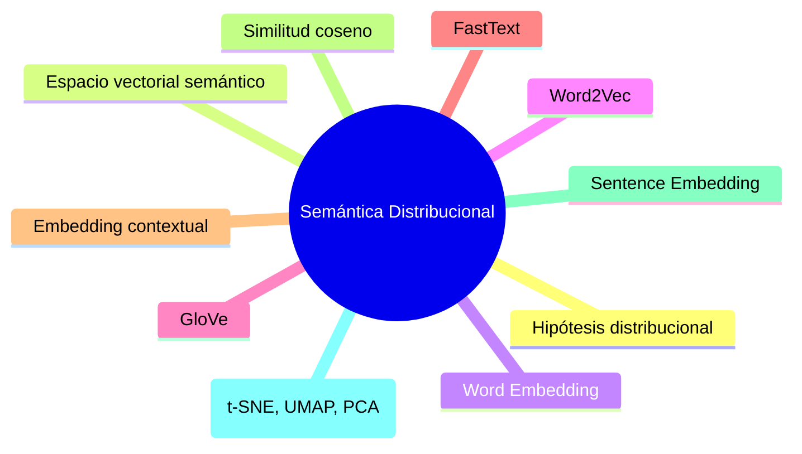
```mermaid
mindmap
  root((Semántica Distribucional))
    Hipótesis distribucional
    Espacio vectorial semántico
    Word Embedding
    Word2Vec
    GloVe
    FastText
    Embedding contextual
    Similitud coseno
    Sentence Embedding
    Reducción de dimensionalidad (t-SNE, UMAP, PCA)
```


### 7.1 Hipótesis distribucional

"Conocerás una palabra por la compañía que mantiene" (Firth, 1957). Las palabras que aparecen en contextos similares tienen significados similares.

**Ejemplo:** "gato" y "perro" aparecen frecuentemente con "mascota", "veterinario", "comida", "jugar"; por lo tanto, sus vectores son cercanos.

### 7.2 Espacio vectorial semántico

Representación del significado como vectores en un espacio de alta dimensionalidad. Cada dimensión captura un aspecto latente del significado.

**Ejemplo:** En un espacio de 300 dimensiones, las relaciones semánticas se reflejan como operaciones vectoriales: `vec("rey") - vec("hombre") + vec("mujer") ≈ vec("reina")`.

### 7.3 Word Embedding

Representación densa de palabras como vectores continuos de baja dimensionalidad. Métodos: Word2Vec, GloVe, FastText.

**Ejemplo con Word2Vec (Skip-gram):** Dado "El gato se sienta en la alfombra", con la palabra objetivo "sienta" y ventana de contexto 2, el modelo aprende a predecir ["gato", "se", "en", "la"] a partir de "sienta".

### 7.4 Word2Vec

Modelo de Mikolov et al. (2013) con dos arquitecturas:
- **CBOW** (Continuous Bag of Words): predice la palabra central dado el contexto.
- **Skip-gram:** predice el contexto dada la palabra central.

**Ejemplo de analogía aprendida:** `vec("Madrid") - vec("España") + vec("Francia") ≈ vec("París")`

### 7.5 GloVe (Global Vectors)

Modelo de Pennington et al. (2014) que combina factorización de la matriz de co-ocurrencia global con aprendizaje local tipo Word2Vec.

**Ejemplo:** GloVe entrena sobre la matriz de co-ocurrencia de todo el corpus, capturando estadísticas globales. La razón de co-ocurrencia de "hielo" con "sólido" vs. "vapor" con "sólido" codifica la relación termodinámica.

### 7.6 FastText

Extensión de Word2Vec que representa cada palabra como la suma de sus n-gramas de caracteres, permitiendo generar embeddings para palabras fuera de vocabulario.

**Ejemplo:** La palabra "desconocidísimo" (rara) se descompone en n-gramas como "des", "esc", "con", "oci", "noc", etc. FastText puede producir un vector razonable aunque nunca haya visto la palabra completa.

### 7.7 Embedding contextual

A diferencia de los word embeddings estáticos (un vector por palabra), los embeddings contextuales generan un vector diferente para cada ocurrencia de una palabra según su contexto.

**Ejemplo:** Con BERT, la palabra "banco" en "Me senté en el banco del parque" tiene un vector diferente al de "banco" en "Fui al banco a depositar dinero".

### 7.8 Similitud coseno

Medida de similitud entre dos vectores basada en el coseno del ángulo entre ellos. Rango: [-1, 1].

$$
\cos(\mathbf u, \mathbf v) = (\mathbf u \cdot \mathbf v) / (\lVert\mathbf u\rVert \, \lVert\mathbf v\rVert)
$$

**Ejemplo:** `cos(embed("perro"), embed("gato")) ≈ 0.82` (alta similitud), `cos(embed("perro"), embed("avión")) ≈ 0.15` (baja similitud).

### 7.9 Sentence Embedding

Representación vectorial de oraciones completas. Métodos: promedio de word embeddings, Doc2Vec, InferSent, Sentence-BERT, modelos de embeddings de propósito general.

**Ejemplo:** Sentence-BERT codifica "¿Cómo está el clima hoy?" y "¿Qué tiempo hace?" como vectores cercanos, permitiendo búsqueda semántica.

### 7.10 Reducción de dimensionalidad (t-SNE, UMAP, PCA)

Técnicas para visualizar embeddings de alta dimensionalidad en 2D o 3D.

**Ejemplo:** Aplicar t-SNE a los embeddings de 10,000 palabras permite visualizar clústeres de palabras por campo semántico: deportes, tecnología, gastronomía, etc.

---

## 8 · Modelos de lenguaje

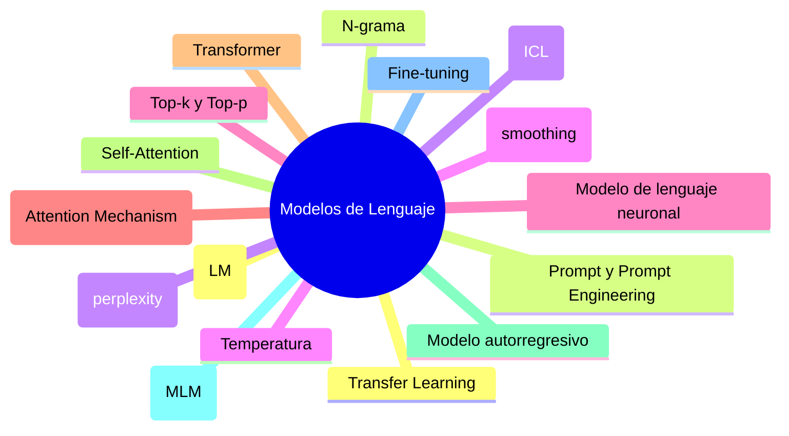
```mermaid
mindmap
  root((Modelos de Lenguaje))
    Language Model (LM)
    N-grama
    Perplejidad (perplexity)
    Suavizado (smoothing)
    Modelo de lenguaje neuronal
    Atención (Attention Mechanism)
    Transformer
    Self-Attention
    Modelo autorregresivo
    Masked Language Model (MLM)
    Fine-tuning
    Transfer Learning
    Prompt y Prompt Engineering
    In-Context Learning (ICL)
    Temperatura
    Top-k y Top-p
```


### 8.1 Modelo de lenguaje (_Language Model, LM_)

Modelo probabilístico que asigna una probabilidad a una secuencia de palabras. La idea central: $P(w_1, w_2, \ldots, w_n)$.

**Ejemplo:** Un LM debería asignar $P(\text{"El gato duerme"}) > P(\text{"El gato refrigerador"})$.

### 8.2 N-grama

Modelo que aproxima la probabilidad de una palabra usando las $n-1$ palabras anteriores (supuesto de Markov de orden $n-1$).

$$P(w_i \mid w_1, \ldots, w_{i-1}) \approx P(w_i \mid w_{i-n+1}, \ldots, w_{i-1})$$

**Ejemplo (bigrama):** $P(\text{duerme} \mid \text{gato}) = \operatorname{count}(\text{gato},\,\text{duerme}) / \operatorname{count}(\text{gato})$

### 8.3 Perplejidad (_perplexity_)

Métrica de evaluación de modelos de lenguaje. Mide cuán "sorprendido" está el modelo ante los datos de prueba. Menor perplejidad = mejor modelo.

$$\text{PPL} = 2^H, \quad H = -\frac{1}{N}\sum_{i=1}^{N} \log_2 P(w_i \mid \text{contexto})$$

**Ejemplo:** Un modelo con perplejidad 50 en un corpus en español es como si, en promedio, estuviera eligiendo uniformemente entre 50 palabras en cada paso. Un modelo con perplejidad 20 es significativamente mejor.

### 8.4 Suavizado (_smoothing_)

Técnicas para asignar probabilidad no nula a n-gramas no observados. Métodos: Laplace, Good-Turing, Kneser-Ney.

**Ejemplo (suavizado de Laplace/add-one):**
$$P_L(w_i \mid w_{i-1}) = (\operatorname{count}(w_{i-1}, w_i) + 1) / (\operatorname{count}(w_{i-1}) + |V|)$$
donde $|V|$ es el tamaño del vocabulario.

### 8.5 Modelo de lenguaje neuronal

LM que usa redes neuronales para aprender representaciones continuas del contexto. Generaciones: feedforward LM (Bengio, 2003), RNN-LM, LSTM-LM, Transformer-LM.

**Ejemplo:** El LSTM-LM de Zaremba et al. procesa la secuencia "El gato se" con estados ocultos que capturan contexto a largo plazo, y produce una distribución sobre la siguiente palabra donde "sienta" y "duerme" tienen alta probabilidad.

### 8.6 Atención (_Attention Mechanism_)

Mecanismo que permite al modelo ponderar dinámicamente la importancia de cada posición de la entrada al generar una salida.

$$\text{Attention}(Q, K, V) = \text{softmax}\left(QK^T / \sqrt{d_k}\right) V$$

**Ejemplo:** Al traducir "The cat sat on the mat" al español, cuando el modelo genera "alfombra", el mecanismo de atención asigna peso alto a "mat".

### 8.7 Transformer

Arquitectura basada exclusivamente en atención (Vaswani et al., 2017). Elimina la recurrencia y usa self-attention para capturar dependencias a cualquier distancia.

**Ejemplo:** BERT, GPT, T5, LLaMA y prácticamente todos los LLMs modernos son variantes del Transformer.

### 8.8 Self-Attention (autoatención)

Cada token en la secuencia atiende a todos los demás tokens, incluido él mismo, para construir una representación contextualizada.

**Ejemplo:** En "El banco emitió bonos porque necesitaba capital", la self-attention permite que "banco" asigne peso alto a "emitió", "bonos" y "capital", desambiguando hacia el sentido financiero.

### 8.9 Modelo autorregresivo (_Autoregressive LM_)

Genera texto de izquierda a derecha, prediciendo un token a la vez condicionado en los anteriores.

$$P(w_1, \ldots, w_n) = \prod_{i=1}^{n} P(w_i \mid w_1, \ldots, w_{i-1})$$

**Ejemplo:** GPT-4, Claude, LLaMA son modelos autorregresivos. Generan "El → gato → negro → duerme → ." secuencialmente.

### 8.10 Modelo de lenguaje enmascarado (_Masked Language Model, MLM_)

Predice tokens enmascarados aleatoriamente dado el contexto bidireccional. Método de pre-entrenamiento de BERT.

**Ejemplo:** "El gato [MASK] en la alfombra" → el modelo predice "duerme" o "está" con alta probabilidad.

### 8.11 Fine-tuning (ajuste fino)

Proceso de adaptar un modelo pre-entrenado a una tarea específica con datos etiquetados adicionales.

**Ejemplo:** Tomar BERT pre-entrenado y fine-tunearlo con 10,000 reseñas etiquetadas para clasificación de sentimiento en español.

### 8.12 Transfer Learning (aprendizaje por transferencia)

Paradigma donde el conocimiento aprendido en una tarea (pre-entrenamiento con texto masivo) se transfiere a otra tarea (clasificación, NER, QA, etc.).

**Ejemplo:** Un modelo pre-entrenado en Wikipedia + libros aprende representaciones del lenguaje generales; con fine-tuning se adapta a detectar spam en emails médicos.

### 8.13 Prompt y Prompt Engineering

Un prompt es la entrada textual que se proporciona a un LLM para guiar su generación. Prompt engineering es el diseño cuidadoso de estas entradas.

**Ejemplo:**
- Zero-shot: "Clasifica el sentimiento: 'La película fue aburrida' → "
- Few-shot: "Positivo: 'Me encantó'. Negativo: 'Fue terrible'. Clasifica: 'No estuvo mal' → "
- Chain-of-thought: "Piensa paso a paso antes de responder."

### 8.14 In-Context Learning (ICL)

Capacidad de los LLMs de realizar tareas a partir de ejemplos proporcionados en el prompt, sin actualizar pesos.

**Ejemplo:** Dar tres pares (pregunta, respuesta) sobre traducción al francés y luego pedir la traducción de una nueva frase. El modelo "aprende" el patrón del contexto.

### 8.15 Temperatura (en la generación de texto)

Hiperparámetro que controla la aleatoriedad de la distribución de salida.

$$P(w_i) = \exp(z_i / T) / \left(\sum_j \exp(z_j / T)\right)$$

- $T \to 0$: determinista (siempre el token más probable).
- $T = 1$: distribución original.
- $T > 1$: más aleatoria y creativa.

**Ejemplo:** Con temperatura 0.2, "El cielo es ___" casi siempre produce "azul". Con temperatura 1.5, puede producir "azul", "inmenso", "un lienzo" u otras opciones menos probables.

### 8.16 Top-k y Top-p (nucleus sampling)

Estrategias de muestreo para la generación de texto.
- **Top-k:** muestrea solo entre las $k$ palabras más probables.
- **Top-p (nucleus):** muestrea del conjunto mínimo de palabras cuya probabilidad acumulada supera $p$.

**Ejemplo:** Con top-p = 0.9, si las tres palabras más probables suman 92% de probabilidad, solo se muestrea de esas tres.

---

## 9 · Tareas clásicas de NLP

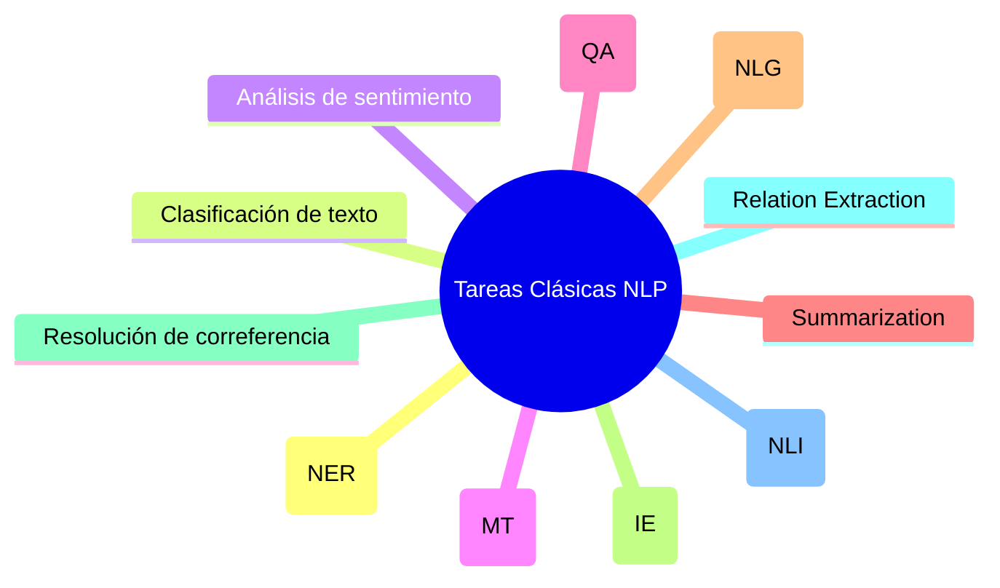
```mermaid
mindmap
  root((Tareas Clásicas NLP))
    Named Entity Recognition (NER)
    Clasificación de texto
    Análisis de sentimiento
    Machine Translation (MT)
    Question Answering (QA)
    Summarization
    Natural Language Generation (NLG)
    Information Extraction (IE)
    Resolución de correferencia
    Relation Extraction
    Natural Language Inference (NLI)
```


### 9.1 Reconocimiento de Entidades Nombradas (_Named Entity Recognition, NER_)

Identificación y clasificación de menciones de entidades (personas, organizaciones, lugares, fechas, cantidades, etc.) en texto.

**Ejemplo:**
- "[PER Juan García] trabaja en [ORG Google] desde [DATE enero de 2020] en [LOC Mountain View]."

Tagsets comunes: IOB2 (Inside-Outside-Beginning), BIOES. Modelos: BiLSTM-CRF, Flair, Transformers fine-tuneados.

### 9.2 Clasificación de texto

Asignar una o más categorías predefinidas a un documento.

**Ejemplo:**
- Detección de spam: "¡Has ganado un millón! Haz clic aquí" → SPAM
- Clasificación temática: artículo sobre fusiones empresariales → NEGOCIOS
- Detección de idioma: "Bonjour, comment ça va?" → FRANCÉS

### 9.3 Análisis de sentimiento (_Sentiment Analysis_)

Determinación de la polaridad emocional (positivo, negativo, neutro) o la emoción específica de un texto.

**Ejemplo:**
- "La comida estaba deliciosa y el servicio excelente" → Positivo (5/5)
- "Pésima atención, no vuelvo" → Negativo (1/5)
- Análisis de aspecto: "La pantalla es genial pero la batería es horrible" → pantalla: positivo, batería: negativo.

### 9.4 Traducción automática (_Machine Translation, MT_)

Traducción de texto de una lengua a otra. Paradigmas: basada en reglas, estadística (SMT), neuronal (NMT).

**Ejemplo (NMT con Transformer):** "The researchers published their findings" → "Los investigadores publicaron sus hallazgos." Los modelos seq2seq con atención (tipo encoder-decoder) son la arquitectura dominante.

### 9.5 Respuesta a preguntas (_Question Answering, QA_)

Generación o extracción de respuestas a preguntas en lenguaje natural.

- **QA extractivo:** la respuesta es un span del texto fuente.
- **QA generativo:** la respuesta se genera libremente.
- **QA de dominio abierto:** se busca en una base de conocimiento o corpus grande.

**Ejemplo extractivo:**
- Contexto: "Albert Einstein nació en Ulm, Alemania, en 1879."
- Pregunta: "¿Dónde nació Einstein?"
- Respuesta: "Ulm, Alemania"

### 9.6 Resumen automático (_Summarization_)

Generación de una versión condensada de un texto.

- **Extractivo:** selecciona oraciones del texto original.
- **Abstractivo:** genera nuevas oraciones que resumen el contenido.

**Ejemplo abstractivo:** Un artículo de 2,000 palabras sobre cambio climático resumido en: "Un estudio reciente indica que las emisiones globales de CO₂ deben reducirse un 45% antes de 2030 para limitar el calentamiento a 1.5°C."

### 9.7 Generación de lenguaje natural (_Natural Language Generation, NLG_)

Producción de texto coherente y fluido a partir de datos estructurados, intenciones comunicativas o prompts.

**Ejemplo:** Dato: `{temp: 32, city: "Puebla", condition: "soleado"}` → NLG: "Hoy en Puebla se esperan 32 grados con cielos despejados."

### 9.8 Extracción de información (_Information Extraction, IE_)

Identificación de hechos estructurados a partir de texto no estructurado. Incluye NER, extracción de relaciones y extracción de eventos.

**Ejemplo de extracción de relaciones:** "Marie Curie descubrió el polonio." → Triple: `(Marie Curie, descubrió, polonio)`.

### 9.9 Resolución de correferencia

(Ver sección 6.8). Tarea específica de IE que agrupa todas las menciones de una misma entidad.

### 9.10 Extracción de relaciones (_Relation Extraction_)

Identificación de la relación semántica entre dos entidades mencionadas en el texto.

**Ejemplo:** "**Elon Musk** es el CEO de **Tesla**." → Relación: `CEO_of(Elon Musk, Tesla)`.

### 9.11 Inferencia en lenguaje natural (_Natural Language Inference, NLI_)

Determinar si una hipótesis se implica, contradice o es neutral respecto a una premisa.

**Ejemplo:**
- Premisa: "Un hombre toca la guitarra en el escenario."
- Hipótesis: "Alguien está haciendo música." → **Entailment**
- Hipótesis: "Nadie está en el escenario." → **Contradiction**
- Hipótesis: "El hombre lleva sombrero." → **Neutral**

---

## 10 · Lingüística computacional y corpus

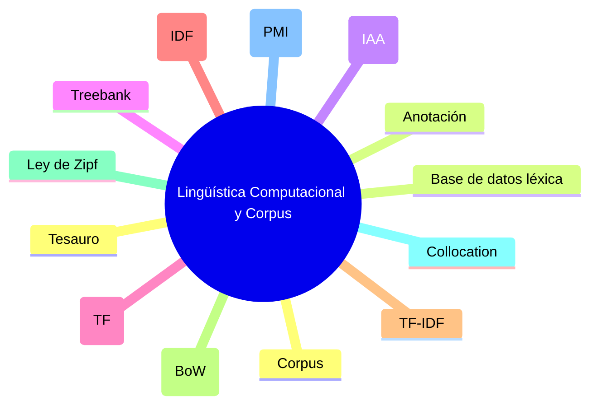
```mermaid
mindmap
  root((Lingüística Computacional y Corpus))
    Corpus
    Anotación
    Inter-Annotator Agreement (IAA)
    Treebank
    Term Frequency (TF)
    Inverse Document Frequency (IDF)
    TF-IDF
    Bag of Words (BoW)
    Ley de Zipf
    Collocation
    Pointwise Mutual Information (PMI)
    Tesauro
    Base de datos léxica
```


### 10.1 Corpus

Colección grande y estructurada de textos, generalmente anotada, usada para entrenar y evaluar modelos de NLP.

**Ejemplo:** El corpus AnCora para español contiene más de 500,000 tokens anotados con POS, constituyentes, dependencias, roles semánticos y correferencia.

### 10.2 Anotación

Proceso de agregar etiquetas lingüísticas a los datos de un corpus. Puede ser manual (gold standard) o automática.

**Ejemplo:** Anotar un corpus para NER implica que un anotador humano marque cada mención de persona, lugar u organización: "Ayer fui a [LOC Oaxaca] y vi a [PER María]".

### 10.3 Acuerdo entre anotadores (_Inter-Annotator Agreement, IAA_)

Medida de la consistencia entre anotadores humanos. Se usa el coeficiente kappa de Cohen ($\kappa$) o el alpha de Krippendorff.

**Ejemplo:** Si dos anotadores etiquetan 100 ejemplos de sentimiento y coinciden en 85, $\kappa \approx 0.75$ (acuerdo sustancial).

### 10.4 Treebank

Corpus anotado con árboles sintácticos (de constituyentes o de dependencias).

**Ejemplo:** El Penn Treebank (inglés) y el UD Spanish AnCora son treebanks ampliamente usados. Cada oración tiene un árbol de análisis manualmente verificado.

### 10.5 Frecuencia de término (_Term Frequency, TF_)

Número de veces que un término aparece en un documento.

$$TF(t, d) = \operatorname{count}(t, d) / |d|$$

**Ejemplo:** En un documento de 100 palabras donde "algoritmo" aparece 5 veces, $TF = 0.05$.

### 10.6 Frecuencia inversa de documento (_Inverse Document Frequency, IDF_)

Medida de cuán informativo es un término en un corpus.

$$IDF(t) = \log\frac{N}{df(t)}$$

donde $N$ es el total de documentos y $df(t)$ es el número de documentos que contienen $t$.

**Ejemplo:** La palabra "el" aparece en casi todos los documentos → IDF bajo. La palabra "mitocondria" aparece en pocos → IDF alto.

### 10.7 TF-IDF

Producto de TF e IDF. Pondera la importancia de un término en un documento relativo al corpus.

**Ejemplo:** En un corpus de artículos científicos, "análisis" tendrá TF-IDF moderado (frecuente pero común). "Cromatografía" tendrá TF-IDF alto en artículos de química (frecuente localmente, rara globalmente).

### 10.8 Bag of Words (BoW)

Representación de un documento como un vector de frecuencias de palabras, ignorando el orden.

**Ejemplo:** "El gato come y el perro come" → `{el: 2, gato: 1, come: 2, y: 1, perro: 1}`. Se pierde el orden pero se captura el contenido léxico.

### 10.9 Ley de Zipf

Principio empírico que establece que la frecuencia de una palabra es inversamente proporcional a su rango de frecuencia.

**Ejemplo:** En un corpus grande en español, "de" (rango 1) aparece millones de veces; la palabra en el rango 1000 aparece unas 1000 veces menos. Esta distribución afecta el diseño de vocabularios y la selección de stopwords.

### 10.10 Colocación (_collocation_)

Combinación de palabras que co-ocurren con frecuencia significativamente mayor a la esperada por azar.

**Ejemplo:** "fuerte lluvia" y "lluvia intensa" son colocaciones; "lluvia robusta" no lo es, aunque "robusta" es sinónimo parcial de "fuerte". Las métricas PMI (Pointwise Mutual Information) detectan colocaciones.

### 10.11 Pointwise Mutual Information (PMI)

Medida de asociación entre dos palabras basada en la comparación de su co-ocurrencia observada con la esperada por independencia.

$$PMI(w_1, w_2) = \log[P(w_1, w_2) / (P(w_1) \cdot P(w_2))]$$

**Ejemplo:** $PMI(\text{Nueva}, \text{York}) \gg 0$ porque co-ocurren mucho más de lo esperado. $PMI(\text{el}, \text{de}) \approx 0$ porque ambas son tan frecuentes que su co-ocurrencia no es informativa.

### 10.12 Tesauro

Recurso léxico que organiza palabras según relaciones de similitud semántica, sinonimia y antonimia, sin definiciones extensas: presenta redes de equivalencia y oposición. Herramienta clásica para expansión de consultas en recuperación de información.

**Ejemplo:** El Tesauro de Roget agrupa palabras por conceptos. En NLP, la estructura de synsets de WordNet funciona como tesauro computacional para expansión de consultas en IR y para WSD basada en conocimiento. Los tesauros distribucionales se construyen automáticamente a partir de matrices de co-ocurrencia.

### 10.13 Base de datos léxica

Recurso lingüístico computacional que organiza información sobre las palabras (significados, relaciones semánticas, rasgos morfosintácticos, marcos argumentales) de forma estructurada y consultable por máquinas.

**Ejemplo:** WordNet (relaciones semánticas), FrameNet (marcos semánticos y roles), PropBank (roles verbales) y VerbNet (clases verbales y subcategorización) son bases de datos léxicas de referencia. Muchos modelos de NLP se entrenan o evalúan con recursos derivados de estas bases.

---

## 11 · Semántica formal y lógica

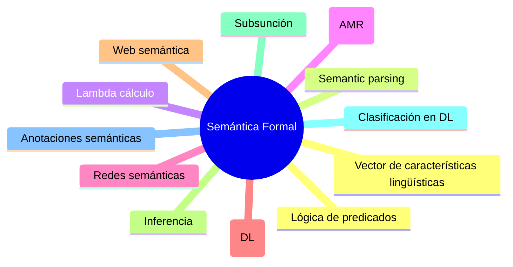
```mermaid
mindmap
  root((Semántica Formal))
    Lógica de predicados
    Semantic parsing
    Lambda cálculo
    Abstract Meaning Representation (AMR)
    Redes semánticas
    Lógica descriptiva (DL)
    Web semántica
    Inferencia
    Subsunción
    Clasificación en DL
    Anotaciones semánticas
    Vector de características lingüísticas
```


### 11.1 Lógica de predicados (primer orden)

Formalismo para representar el significado de oraciones con cuantificadores, predicados y variables.

**Ejemplo:** "Todo estudiante lee algún libro" →
$$\forall x (\text{estudiante}(x) \rightarrow \exists y (\text{libro}(y) \wedge \text{lee}(x, y)))$$

### 11.2 Representación semántica (_semantic parsing_)

Conversión de una oración en lenguaje natural a una representación formal ejecutable (lógica, SQL, API call, etc.).

**Ejemplo:**
- "¿Cuántos empleados hay en el departamento de ventas?"
- → `SELECT COUNT(*) FROM empleados WHERE departamento = 'ventas'`

### 11.3 Lambda cálculo (en semántica)

Formalismo para representar funciones semánticas composicionales.

**Ejemplo:** "ama" se representa como $\lambda y.\lambda x.\text{ama}(x, y)$. Aplicado a "María" y "Pedro": $(\lambda y.\lambda x.\text{ama}(x, y))(\text{Pedro})(\text{María}) = \text{ama}(\text{María}, \text{Pedro})$.

### 11.4 AMR (Abstract Meaning Representation)

Formalismo de grafos dirigidos acíclicos para representar el significado de oraciones, abstrayendo la variación sintáctica.

**Ejemplo:** "El niño desea ir" y "El deseo del niño de ir" comparten el mismo grafo AMR:
```
(d / desear-01
   :ARG0 (n / niño)
   :ARG1 (i / ir-01
            :ARG0 n))
```

### 11.5 Redes semánticas

Estructuras de representación del conocimiento formadas por nodos (conceptos, entidades) conectados por arcos etiquetados con relaciones semánticas (IS-A, PART-OF, HAS-PROPERTY, etc.). Precursoras de los grafos de conocimiento modernos.

**Ejemplo:** En una red semántica, "perro" →IS-A→ "animal", "animal" →HAS-PART→ "célula". ConceptNet es una red semántica contemporánea con millones de relaciones en más de 30 idiomas, usada en NLP para razonamiento de sentido común.

### 11.6 Lógica descriptiva (_Description Logic, DL_)

Familia de formalismos de representación del conocimiento, subconjunto decidible de la lógica de primer orden, diseñada para razonar sobre conceptos (clases), roles (relaciones) e individuos en ontologías. Base formal de OWL (Web Ontology Language).

**Ejemplo:** "Médico" puede definirse en DL como: Médico ≡ Persona ⊓ ∃ejerce.Medicina. Un razonador DL (HermiT, Pellet) deduce automáticamente que "Dr. García" es Médico si es Persona y ejerce Medicina. Protégé es el editor de ontologías OWL más usado.

### 11.7 Web semántica

Visión de extensión de la web donde los datos tienen significado formal, son interoperables y procesables por máquinas, sustentada en estándares del W3C: RDF (grafos de tripletas), OWL (ontologías) y SPARQL (consultas).

**Ejemplo:** DBpedia extrae datos de Wikipedia en RDF, permitiendo consultas SPARQL como "dame todos los presidentes de México nacidos antes de 1950". Wikidata es la realización más activa de la web semántica; sus datos se usan en sistemas de QA para enriquecer grafos de conocimiento.

### 11.8 Inferencia

Proceso de derivar conclusiones nuevas y válidas a partir de conocimiento existente mediante reglas lógicas o restricciones formales. En NLP abarca desde la inferencia en ontologías hasta la inferencia textual (NLI) y el razonamiento de sentido común.

**Ejemplo:** Dado que "todos los mamíferos respiran" y "el delfín es un mamífero", se infiere "el delfín respira" por modus ponens. En NLI, dado "Juan compró leche" se infiere "Juan fue a algún lugar a comprar" usando conocimiento de sentido común.

### 11.9 Subsunción

Relación entre conceptos en lógica descriptiva: el concepto A subsume a B si toda instancia de B es también instancia de A (A es más general). Relación transitiva y reflexiva que estructura jerarquías IS-A en ontologías.

**Ejemplo:** "Animal" subsume a "Perro" porque todo perro es un animal. Los razonadores DL calculan automáticamente las jerarquías de subsunción completas, lo que permite detectar inconsistencias y clasificar nuevos conceptos sin intervención manual.

### 11.10 Clasificación en lógica descriptiva

Tarea de razonamiento que determina la posición jerárquica correcta de un concepto en la taxonomía de una ontología, calculada automáticamente por un razonador DL a partir de las definiciones formales.

**Ejemplo:** Si se define "Cardiólogo" como Médico ⊓ ∃especialidad.Cardiología, el razonador clasifica automáticamente Cardiólogo como subclase de Médico. Esencial para mantener coherencia en ontologías biomédicas de gran escala como SNOMED CT o Gene Ontology.

### 11.11 Anotaciones semánticas

Etiquetas añadidas a unidades textuales (tokens, frases, oraciones) o a nodos de un recurso que especifican su significado, referencia o relación semántica: sentidos de palabra, roles semánticos, entidades nombradas, etc.

**Ejemplo:** En un corpus anotado semánticamente, "Juan vendió su coche a María" puede contener: "Juan" [AGENTE], "coche" [TEMA], "María" [DESTINATARIO], "vendió" → frame Commerce_sell (FrameNet). SemCor es el corpus de inglés más usado con anotaciones de sentidos de WordNet.

### 11.12 Vector de características de la información lingüística

Representación de un token o texto como un vector numérico construido a partir de características lingüísticas explícitas (POS, morfología, dependencias, sentidos de palabra, entidades, etc.), en contraste con los embeddings aprendidos _end-to-end_.

**Ejemplo:** Para WSD con un clasificador SVM, el vector puede incluir: POS en ventana ±3 (one-hot), bigrams de colocación, dependencia sintáctica del token objetivo y presencia de palabras del vecindario en listas semánticas. Los sistemas pre-transformer usaban estos vectores con CRF o SVM.

---

## 12 · Sociolingüística y variación

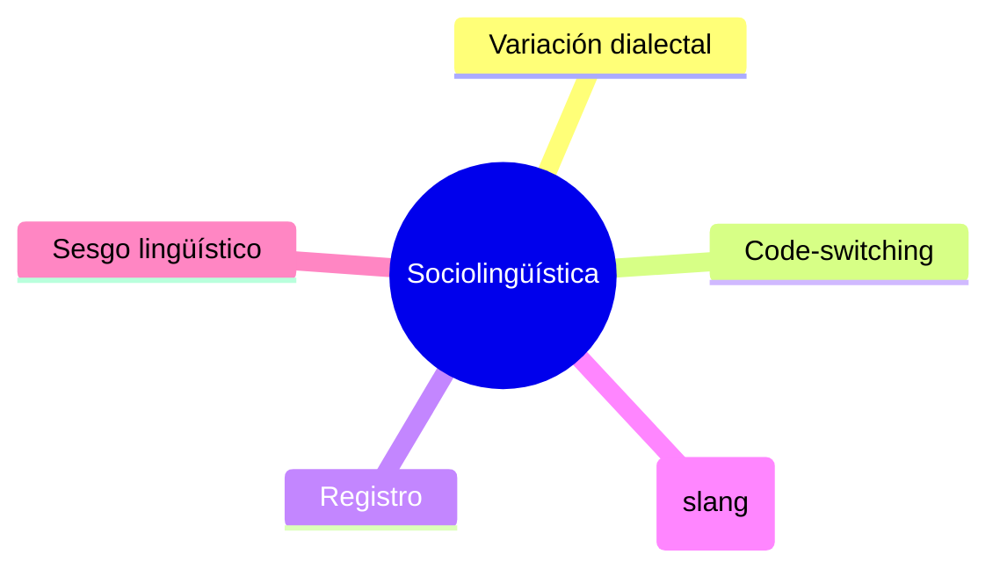
```mermaid
mindmap
  root((Sociolingüística))
    Variación dialectal
    Code-switching
    Registro
    Jerga y argot (slang)
    Sesgo lingüístico
```


### 12.1 Variación dialectal

Diferencias sistemáticas en el uso del lenguaje entre grupos geográficos o sociales.

**Ejemplo:** "Computadora" (México), "ordenador" (España), "computador" (Colombia). Un sistema NLP multiregional debe manejar estas variantes.

### 12.2 Code-switching (alternancia de código)

Alternancia entre dos o más lenguas o variedades dentro de un mismo discurso.

**Ejemplo:** "Vamos a hacer un quick meeting para revisar los deliverables." Un tokenizer y modelo multilingüe debe manejar texto bilingüe.

### 12.3 Registro

Variedad funcional de la lengua determinada por el contexto comunicativo. (Ver 6.11.)

**Ejemplo:** Un modelo de generación de texto debe producir un registro apropiado: formal para un informe legal, coloquial para un chatbot juvenil.

### 12.4 Jerga y argot (_slang_)

Vocabulario especializado de un grupo social o profesional.

**Ejemplo:** En jerga médica, "IAM" significa infarto agudo de miocardio. En argot juvenil mexicano, "neta" significa "verdad". Ambos requieren tratamiento especial en NLP.

### 12.5 Sesgo lingüístico (_linguistic bias_)

Los modelos entrenados en datos sesgados reproducen y amplifican estereotipos.

**Ejemplo:** El clásico hallazgo de Bolukbasi et al. (2016): `vec("programador") - vec("hombre") + vec("mujer") ≈ vec("ama de casa")` en embeddings de Word2Vec. Las técnicas de debiasing buscan mitigar estos sesgos.

---

## 13 · Tipología lingüística y NLP multilingüe

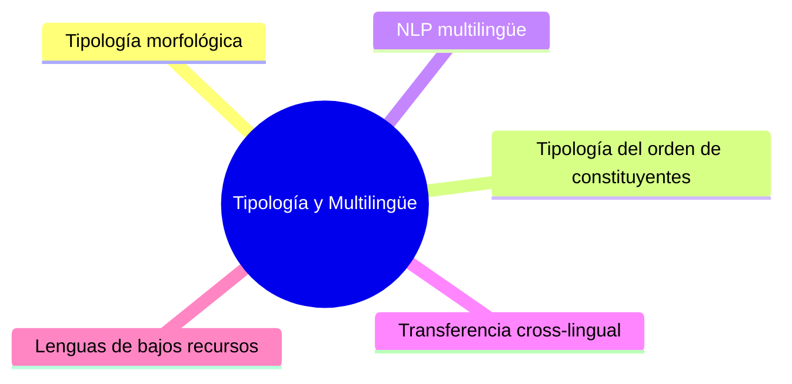
```mermaid
mindmap
  root((Tipología y Multilingüe))
    Tipología morfológica
    Tipología del orden de constituyentes
    NLP multilingüe
    Transferencia cross-lingual
    Lenguas de bajos recursos
```


### 13.1 Tipología morfológica

Clasificación de las lenguas según la complejidad de su morfología.

- **Aislantes:** las palabras no se flexionan (mandarín).
- **Aglutinantes:** los morfemas se apilan de manera regular (turco, finés).
- **Fusionales:** un solo morfema expresa múltiples categorías (español, ruso).
- **Polisintéticas:** una palabra puede contener lo que en otras lenguas sería una oración entera (inuktitut).

**Ejemplo:** En turco, "evlerinizden" = ev-ler-iniz-den (casa-PLURAL-POSESIVO.2PL-ABLATIVO) = "de sus casas de ustedes". Los tokenizers subword se diseñan pensando en esta diversidad.

### 13.2 Tipología del orden de constituyentes

Las lenguas varían en el orden básico de sujeto (S), verbo (V) y objeto (O). (Ver 4.12.)

### 13.3 NLP multilingüe

Desarrollo de modelos que funcionan en múltiples lenguas simultáneamente.

**Ejemplo:** mBERT (Multilingual BERT) se pre-entrena en 104 lenguas y logra transferencia zero-shot: fine-tuneado en NER en inglés, puede etiquetar entidades en español sin datos de entrenamiento en español.

### 13.4 Transferencia cross-lingual

Capacidad de transferir conocimiento de una lengua rica en recursos a una lengua de bajos recursos.

**Ejemplo:** XLM-RoBERTa, fine-tuneado para clasificación de sentimiento en inglés, obtiene resultados competitivos en suajili sin datos etiquetados en suajili.

### 13.5 Lenguas de bajos recursos (_low-resource languages_)

Lenguas con escasos datos digitales, herramientas NLP y corpus anotados.

**Ejemplo:** El mixteco, el zapoteco o el quechua tienen datos digitales limitados. Técnicas como data augmentation, few-shot learning y modelos multilingües son estrategias para mejorar NLP en estas lenguas.

---

## 14 · Evaluación en NLP

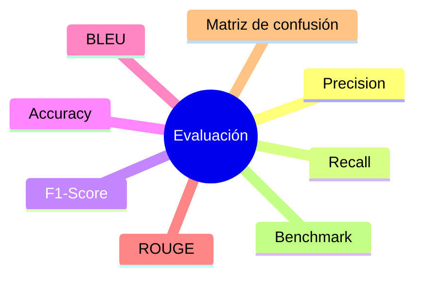
```mermaid
mindmap
  root((Evaluación))
    Precision
    Recall
    F1-Score
    Accuracy
    BLEU
    ROUGE
    Matriz de confusión
    Benchmark
```


### 14.1 Precisión (_Precision_)

Proporción de predicciones positivas que son correctas.

$$P = \frac{TP}{TP + FP}$$

**Ejemplo:** De 100 entidades que el modelo etiquetó como PERSONA, 85 realmente lo eran → Precisión = 0.85.

### 14.2 Exhaustividad (_Recall_)

Proporción de instancias positivas que el modelo identifica correctamente.

$$R = \frac{TP}{TP + FN}$$

**Ejemplo:** En el corpus hay 120 menciones de PERSONA; el modelo encontró 85 → Recall = 85/120 ≈ 0.71.

### 14.3 F1-Score

Media armónica de precisión y recall. Equilibra ambas métricas.

$$F_1 = 2 \cdot P \cdot R / (P + R)$$

**Ejemplo:** Con $P = 0.85$ y $R = 0.71$: $F_1 = 2 \times 0.85 \times 0.71 / (0.85 + 0.71) \approx 0.77$.

### 14.4 Exactitud (_Accuracy_)

Proporción de predicciones correctas sobre el total.

**Ejemplo:** En clasificación binaria de sentimiento con 500 positivos y 500 negativos, si el modelo acierta 420 positivos y 460 negativos: accuracy = 880/1000 = 0.88.

### 14.5 BLEU (Bilingual Evaluation Understudy)

Métrica automática para evaluación de traducción automática (y generación de texto). Mide la coincidencia de n-gramas entre la salida del modelo y una referencia humana.

**Ejemplo:** Si la traducción del modelo comparte el 70% de unigramas y 50% de bigramas con la referencia, el BLEU será moderado. Un BLEU de 40+ generalmente se considera buena calidad.

### 14.6 ROUGE

Métrica para evaluación de resúmenes. Variantes: ROUGE-N (n-gramas), ROUGE-L (subsecuencia común más larga).

**Ejemplo:** ROUGE-1 mide coincidencia de unigramas entre el resumen generado y el de referencia.

### 14.7 Matriz de confusión

Tabla que muestra las predicciones del modelo vs. las etiquetas reales para cada clase.

**Ejemplo (sentimiento binario):**

|                | Pred. Positivo | Pred. Negativo |
|----------------|:-:|:-:|
| Real Positivo  | 420 (TP) | 80 (FN) |
| Real Negativo  | 40 (FP) | 460 (TN) |

### 14.8 Benchmark

Conjunto de datos y métricas estandarizados para comparar modelos.

**Ejemplo:** GLUE y SuperGLUE son benchmarks que incluyen tareas como NLI, STS, QA y paráfrasis. En español, XNLI y MASSIVE son benchmarks multilingües relevantes.

---

## 15 · Procesamiento del habla

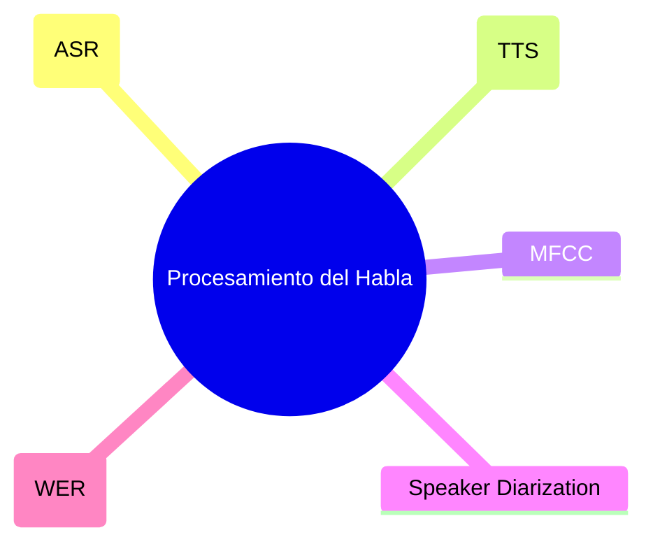
```mermaid
mindmap
  root((Procesamiento del Habla))
    Automatic Speech Recognition (ASR)
    Text-to-Speech (TTS)
    MFCC
    Speaker Diarization
    Word Error Rate (WER)
```


### 15.1 ASR (Automatic Speech Recognition)

Conversión de señal acústica a texto. Pipeline clásico: extracción de features (MFCC) → modelo acústico → modelo de lenguaje → decodificación. Modelos modernos: end-to-end (CTC, attention-based, Whisper).

**Ejemplo:** Un usuario dice "Ponme una alarma a las siete" y el ASR transcribe "ponme una alarma a las siete", que luego se pasa a un NLU para extraer la intención y los slots.

### 15.2 TTS (Text-to-Speech)

Conversión de texto a señal acústica. Modelos: concatenativo, paramétrico, neuronal (Tacotron, VITS, XTTS).

**Ejemplo:** Un asistente virtual convierte "Tienes una reunión a las 3" en audio con prosodia natural, pausas apropiadas y entonación afirmativa.

### 15.3 MFCC (Mel-Frequency Cepstral Coefficients)

Representación compacta del espectro de una señal de audio, basada en la escala de frecuencias mel (aproximación a la percepción auditiva humana). Feature clásico en ASR.

**Ejemplo:** De un segmento de 25 ms de audio se extraen 13 coeficientes MFCC que resumen la forma del tracto vocal del hablante en ese instante.

### 15.4 Diarización de hablantes (_Speaker Diarization_)

Segmentación de audio para determinar "quién habla cuándo".

**Ejemplo:** En una grabación de reunión con tres participantes, la diarización produce: [0:00-0:30 Hablante A] [0:30-1:15 Hablante B] [1:15-1:45 Hablante C]...

### 15.5 Word Error Rate (WER)

Métrica estándar de evaluación de ASR: proporción de palabras incorrectas (sustituciones + inserciones + eliminaciones) respecto al total de palabras de referencia.

$$WER = \frac{S + D + I}{N}$$

**Ejemplo:** Referencia: "El gato negro duerme" (4 palabras). Hipótesis: "El gato negro muere" → S=1 → WER = 1/4 = 25%.

---

## 16 · Generación y diálogo

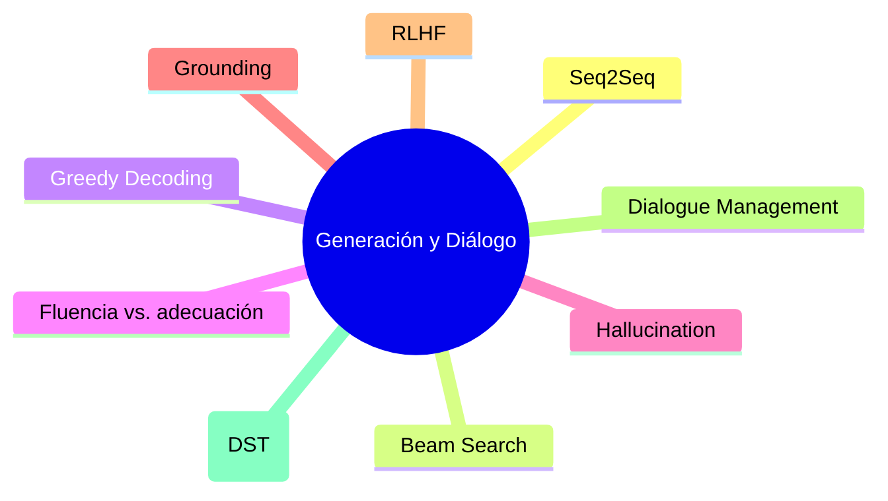
```mermaid
mindmap
  root((Generación y Diálogo))
    Seq2Seq
    Beam Search
    Greedy Decoding
    Fluencia vs. adecuación
    Hallucination
    Grounding
    RLHF
    Dialogue Management
    Dialogue State Tracking (DST)
```


### 16.1 Seq2Seq (Sequence-to-Sequence)

Arquitectura encoder-decoder que mapea una secuencia de entrada a una secuencia de salida.

**Ejemplo:** Traducción: encoder procesa "How are you?" y el decoder genera "¿Cómo estás?".

### 16.2 Beam Search

Estrategia de decodificación que mantiene $k$ hipótesis parciales en cada paso.

**Ejemplo:** Con beam size 3, al generar la traducción de "I love cats", el modelo mantiene las 3 secuencias parciales más probables en cada paso, explorando un espacio mayor que la decodificación greedy.

### 16.3 Greedy Decoding

Decodificación que selecciona el token más probable en cada paso. Rápida pero puede producir resultados subóptimos globalmente.

**Ejemplo:** Si en el paso 1 "El" tiene probabilidad 0.9 y "La" tiene 0.1, greedy elige "El", aunque "La casa..." podría haber sido mejor globalmente.

### 16.4 Fluencia vs. adecuación

- **Fluencia:** qué tan natural y gramatical suena el texto generado.
- **Adecuación:** qué tan bien transmite el significado correcto.

**Ejemplo:** "El can dormitaba sobre la estera" es fluido y adecuado (para "The dog slept on the mat"). "Dog sleeping mat on" tiene cierta adecuación pero nula fluencia.

### 16.5 Alucinación (_hallucination_)

Generación de contenido que suena plausible pero es factualmente incorrecto o inventado.

**Ejemplo:** Un LLM al que se le pregunta "¿Cuál es la capital de Wakanda?" podría responder con confianza nombrando una ciudad ficticia como si fuera real, mezclando ficción con hechos.

### 16.6 Grounding

Conexión de la generación de texto con fuentes de información verificables (bases de datos, documentos, conocimiento del mundo).

**Ejemplo:** Un chatbot con grounding busca en una base de conocimiento antes de responder y cita la fuente: "Según el artículo 3 de la Constitución, la educación es un derecho..."

### 16.7 RLHF (Reinforcement Learning from Human Feedback)

Técnica de alineación que usa preferencias humanas para entrenar un modelo de recompensa y luego optimiza el LLM con reinforcement learning (por ejemplo, PPO).

**Ejemplo:** Se presentan a anotadores humanos dos respuestas del modelo a la misma pregunta; eligen la mejor. Con miles de comparaciones se entrena el modelo de recompensa.

### 16.8 Gestión de diálogo (_Dialogue Management_)

Componente de un sistema de diálogo que decide la siguiente acción del sistema (qué decir, qué preguntar, qué acción ejecutar).

**Ejemplo:** En un bot de restaurante:
1. Usuario: "Quiero reservar una mesa"
2. Sistema (estado: faltan datos) → acción: preguntar fecha
3. Sistema: "¿Para qué fecha desea la reserva?"

### 16.9 Estado del diálogo (_Dialogue State Tracking, DST_)

Seguimiento de los valores de los slots a lo largo de la conversación.

**Ejemplo:** Tras tres turnos:
```
{intent: "reserve_table",
 slots: {date: "2026-04-25", time: "20:00", party_size: null}}
```
El sistema sabe que aún falta `party_size`.

---

## 17 · Recuperación de información y RAG

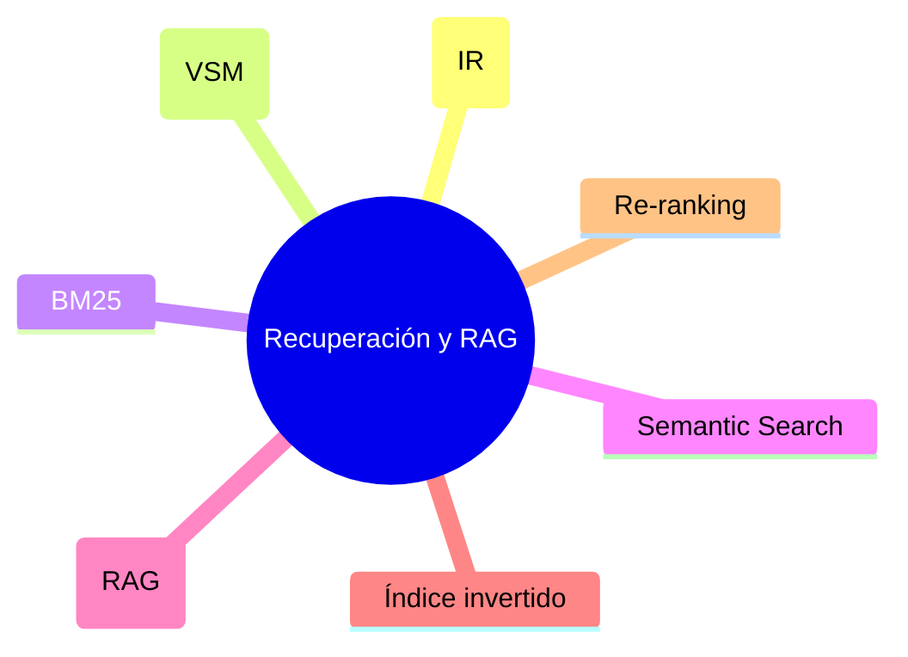
```mermaid
mindmap
  root((Recuperación y RAG))
    Information Retrieval (IR)
    Vector Space Model (VSM)
    BM25
    Semantic Search
    Retrieval-Augmented Generation (RAG)
    Índice invertido
    Re-ranking
```


### 17.1 Recuperación de información (_Information Retrieval, IR_)

Búsqueda de documentos relevantes en una colección dado un query.

**Ejemplo:** Google Search es un sistema IR. Dado el query "mejores tacos en Puebla", recupera documentos relevantes de su índice.

### 17.2 Modelo de espacio vectorial (VSM)

Representación de documentos y queries como vectores en un espacio de términos; la relevancia se mide con similitud coseno.

**Ejemplo:** Un query "inteligencia artificial ética" y un documento sobre "ética en IA" tendrán vectores TF-IDF cercanos.

### 17.3 BM25

Función de ranking que mejora TF-IDF con saturación de frecuencia y normalización por longitud de documento. Estándar en búsqueda léxica.

**Ejemplo:** BM25 asigna menor ganancia marginal a cada ocurrencia adicional de un término (saturación): un documento que menciona "Python" 50 veces no es necesariamente más relevante que uno que lo menciona 5 veces.

### 17.4 Búsqueda semántica (_Semantic Search_)

Búsqueda basada en significado, usando embeddings densos en lugar de coincidencia léxica.

**Ejemplo:** Query: "¿Cómo prevengo enfermedades cardíacas?" Búsqueda semántica encuentra un documento titulado "Estrategias para la salud cardiovascular" aunque no comparta palabras exactas con el query.

### 17.5 RAG (Retrieval-Augmented Generation)

Paradigma que combina recuperación de documentos con generación de texto: dado un query, se recuperan documentos relevantes y se proporcionan como contexto al LLM para generar una respuesta fundamentada.

**Ejemplo:**
1. Query: "¿Cuáles son los efectos secundarios del ibuprofeno?"
2. Retriever busca en base de datos médica → recupera 3 documentos relevantes.
3. LLM genera respuesta basada en esos documentos, citando fuentes.

### 17.6 Índice invertido

Estructura de datos que mapea cada término al conjunto de documentos que lo contienen. Base de los motores de búsqueda léxica.

**Ejemplo:**
```
"gato"  → [doc_3, doc_17, doc_42]
"perro" → [doc_3, doc_8, doc_17, doc_99]
```

### 17.7 Re-ranking

Etapa de refinamiento donde un modelo más sofisticado (por ejemplo, un cross-encoder) reordena los documentos recuperados por un retriever inicial.

**Ejemplo:** BM25 devuelve los top 100 documentos; un cross-encoder basado en BERT evalúa la relevancia de cada par (query, documento) y reordena los resultados.

---

## 18 · Grafos de conocimiento y representación del conocimiento

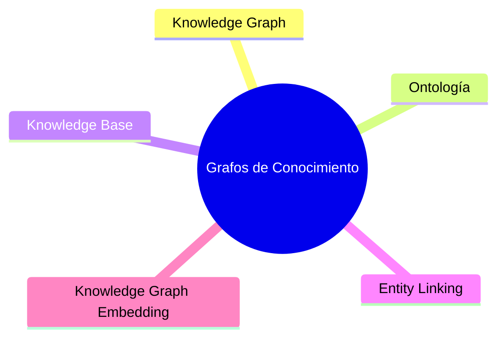
```mermaid
mindmap
  root((Grafos de Conocimiento))
    Knowledge Graph
    Ontología
    Knowledge Base
    Entity Linking
    Knowledge Graph Embedding
```


### 18.1 Knowledge Graph (grafo de conocimiento)

Estructura de datos que representa entidades como nodos y relaciones como aristas.

**Ejemplo:** Tripleta: `(Marie Curie, ganó, Premio Nobel de Física)`. Wikidata, DBpedia y Freebase son grafos de conocimiento usados en NLP.

### 18.2 Ontología

Representación formal de un dominio de conocimiento con clases, propiedades, relaciones y axiomas.

**Ejemplo:** En una ontología médica: `Ibuprofeno rdfs:subClassOf AINE. AINE rdfs:subClassOf Analgésico.` Esto permite razonamiento: si se busca un analgésico, el ibuprofeno es un resultado válido.

### 18.3 Knowledge Base (base de conocimiento)

Colección estructurada de hechos. Puede ser un grafo de conocimiento o una base de datos relacional.

**Ejemplo:** Wikidata contiene millones de tripletas como `(Q937, P19, Q1741)` que significa "(Albert Einstein, lugar de nacimiento, Ulm)".

### 18.4 Entity Linking

Tarea de conectar una mención textual con su entrada en una base de conocimiento.

**Ejemplo:** "Obama visitó París" → `Obama` se enlaza a la entidad `Q76` (Barack Obama) en Wikidata, no a otra persona llamada Obama.

### 18.5 Knowledge Graph Embedding

Representación de entidades y relaciones de un grafo de conocimiento como vectores continuos. Modelos: TransE, RotatE, ComplEx.

**Ejemplo (TransE):** Si `vec(Madrid) + vec(capital_de) ≈ vec(España)`, entonces para predecir la capital de Francia: `vec(?) + vec(capital_de) ≈ vec(Francia)` → `vec(?) ≈ vec(París)`.

---

## 19 · Ética, sesgo y seguridad en NLP

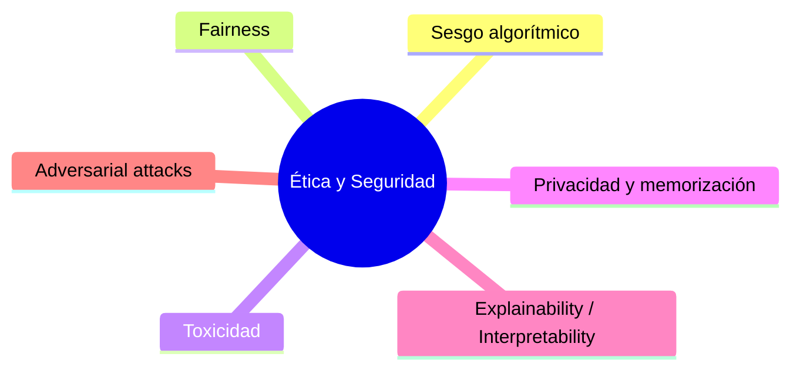
```mermaid
mindmap
  root((Ética y Seguridad))
    Sesgo algorítmico
    Fairness
    Toxicidad
    Privacidad y memorización
    Explainability / Interpretability
    Adversarial attacks
```


### 19.1 Sesgo algorítmico

Tendencias sistemáticas en los modelos que producen resultados injustos para ciertos grupos.

**Ejemplo:** Un modelo de filtrado de currículums entrenado con datos históricos puede penalizar candidatas mujeres porque los datos reflejan patrones de contratación sesgados del pasado.

### 19.2 Equidad (_Fairness_)

Propiedad deseada de un sistema que trata a diferentes grupos demográficos de manera justa.

**Ejemplo:** Un clasificador de toxicidad no debería tener una tasa de falsos positivos más alta para textos en AAVE (African American Vernacular English) que para inglés estándar.

### 19.3 Toxicidad

Contenido ofensivo, dañino o inapropiado generado por un modelo.

**Ejemplo:** Un LLM sin filtros podría generar insultos racistas si se le solicita. Herramientas como Perspective API o clasificadores de toxicidad se usan para detectar y filtrar este contenido.

### 19.4 Privacidad y memorización

Los LLMs pueden memorizar datos sensibles del corpus de entrenamiento (nombres, direcciones, información médica).

**Ejemplo:** Un LLM podría completar "El número de seguro social de Juan Pérez es..." con un número real si apareció en los datos de entrenamiento. Differential privacy y técnicas de desmemorización mitigan este riesgo.

### 19.5 Explicabilidad (_Explainability / Interpretability_)

Capacidad de entender por qué un modelo tomó una decisión particular.

**Ejemplo:** LIME (Local Interpretable Model-agnostic Explanations) puede mostrar que un clasificador de sentimiento predijo "negativo" para una reseña porque las palabras "terrible" y "decepcionante" tuvieron las contribuciones más altas.

### 19.6 Adversarial attacks en NLP

Manipulaciones deliberadas del input para engañar a un modelo.

**Ejemplo:** Cambiar "This movie is great" a "This m0vie is gr8" puede hacer que un clasificador de sentimiento falle si no es robusto a variaciones ortográficas.

---

## 20 · Términos transversales y avanzados

```mermaid
mindmap
  root((Términos Transversales))
    Alignment
    Chain-of-Thought (CoT)
    Tokenización Byte-level
    Positional Encoding
    Cross-Entropy Loss
    Softmax
    Normalización de texto
    Sentence Segmentation
    Disambiguation
    Machine Reading Comprehension (MRC)
    Few-shot / Zero-shot / One-shot
    Data Augmentation
    Active Learning
    Annotation Guidelines
    Label Smoothing
```


### 20.1 Alineación (_Alignment_)

Proceso de hacer que un modelo de IA se comporte de acuerdo con las intenciones y valores humanos.

**Ejemplo:** RLHF, Constitutional AI (CAI) y Direct Preference Optimization (DPO) son técnicas de alineación que buscan que los modelos sean útiles, honestos e inofensivos.

### 20.2 Cadena de pensamiento (_Chain-of-Thought, CoT_)

Técnica de prompting que induce al modelo a generar pasos de razonamiento intermedios antes de dar una respuesta final.

**Ejemplo:** En lugar de responder directamente "¿Cuánto es 17 × 23?", el modelo genera: "17 × 20 = 340. 17 × 3 = 51. 340 + 51 = 391. La respuesta es 391."

### 20.3 Tokenización Byte-level (UTF-8)

Tokenización que opera directamente sobre bytes, permitiendo manejar cualquier texto Unicode sin tokens desconocidos.

**Ejemplo:** GPT-4 usa un tokenizer byte-level BPE que puede procesar texto en cualquier script (latino, cirílico, árabe, CJK, emojis) sin OOV.

### 20.4 Positional Encoding

Mecanismo para inyectar información de posición en los Transformers, que carecen de noción inherente del orden secuencial.

**Ejemplo:** Los codificados sinusoidales de Vaswani (2017) usan funciones seno y coseno de diferentes frecuencias. RoPE (Rotary Position Embeddings) y ALiBi son alternativas modernas que permiten mejor generalización a secuencias largas.

### 20.5 Cross-Entropy Loss

Función de pérdida estándar para entrenamiento de modelos de lenguaje y clasificación.

$$\mathcal{L} = -\sum_{i} y_i \log(\hat{y}_i)$$

**Ejemplo:** Si la distribución real asigna probabilidad 1 a la palabra "gato" y el modelo predice 0.7 para "gato", la pérdida es $-\log(0.7) \approx 0.36$.

### 20.6 Softmax

Función que convierte un vector de logits en una distribución de probabilidad.

$$\text{softmax}(z_i) = e^{z_i} / \sum_j e^{z_j}$$

**Ejemplo:** Logits [2.0, 1.0, 0.5] → softmax → [0.59, 0.24, 0.13]. La suma siempre es 1.

### 20.7 Normalización de texto

Proceso de estandarización del texto antes del procesamiento: lowercasing, eliminación de acentos, expansión de contracciones, normalización Unicode, etc.

**Ejemplo:** "¿CÓMO ESTÁS?!!" → normalización → "cómo estás". "U.S.A." → "usa" o "united states" dependiendo de las reglas.

### 20.8 Segmentación de oraciones (_Sentence Segmentation_)

División del texto en oraciones individuales. No es trivial por la ambigüedad de los signos de puntuación.

**Ejemplo:** "El Dr. García llegó a las 3 p.m. Dijo que todo estaba bien." Tiene dos oraciones, pero un segmentador ingenuo podría cortar en "Dr." y "p.m."

### 20.9 Desambiguación (_Disambiguation_)

Proceso general de resolver ambigüedades en el lenguaje natural: léxicas (WSD), sintácticas, referenciales.

**Ejemplo:** "Vino de la Rioja" → ¿Es una persona que vino de la región de La Rioja, o es vino (bebida) producido en La Rioja? El contexto determina la interpretación.

### 20.10 Lectura automática de máquina (_Machine Reading Comprehension, MRC_)

Tarea donde el modelo lee un pasaje y responde preguntas sobre él.

**Ejemplo (SQuAD):**
- Pasaje: "La torre Eiffel se construyó en 1889 para la Exposición Universal de París."
- Pregunta: "¿En qué año se construyó la torre Eiffel?"
- Respuesta: "1889"

### 20.11 Few-shot, Zero-shot y One-shot Learning

Paradigmas de aprendizaje con pocos o ningún ejemplo:
- **Zero-shot:** sin ejemplos de la tarea objetivo.
- **One-shot:** un solo ejemplo.
- **Few-shot:** unos pocos ejemplos (típicamente 2-10).

**Ejemplo zero-shot:** "Clasifica el sentimiento del siguiente texto: 'Me encantó la película'. Sentimiento:" → El modelo responde "Positivo" sin haber visto ejemplos previos de la tarea.

### 20.12 Data Augmentation (aumento de datos)

Técnicas para generar datos de entrenamiento adicionales a partir de los existentes.

**Ejemplo:** Para NER en español, técnicas incluyen: reemplazo de entidades ("María" → "Pedro"), paráfrasis con back-translation (español → inglés → español), inserción de sinónimos, y generación con LLMs.

### 20.13 Active Learning

Estrategia donde el modelo selecciona los ejemplos más informativos para que sean anotados por un humano.

**Ejemplo:** Un clasificador de sentimiento con incertidumbre alta en 50 reseñas solicita que un anotador etiquete esas 50 (en lugar de 500 aleatorias), maximizando el aprendizaje por muestra anotada.

### 20.14 Annotation Guidelines (guías de anotación)

Documento que define criterios precisos para que los anotadores etiqueten datos de manera consistente.

**Ejemplo:** "Etiquetar como ORGANIZACIÓN: empresas, instituciones gubernamentales, universidades, ONG. NO etiquetar: nombres de productos, nombres de eventos."

### 20.15 Label Smoothing

Técnica de regularización que suaviza las etiquetas one-hot durante el entrenamiento.

**Ejemplo:** En lugar de asignar probabilidad 1.0 a la clase correcta y 0.0 al resto, se asigna 0.9 a la correcta y se distribuye 0.1 entre las demás. Esto previene sobreconfianza.

---

## 21 · Glosario rápido de acrónimos

| Acrónimo | Significado |
|----------|-------------|
| NLP | Natural Language Processing |
| NLU | Natural Language Understanding |
| NLG | Natural Language Generation |
| NER | Named Entity Recognition |
| POS | Part of Speech |
| SRL | Semantic Role Labeling |
| WSD | Word Sense Disambiguation |
| ASR | Automatic Speech Recognition |
| TTS | Text-to-Speech |
| MT | Machine Translation |
| QA | Question Answering |
| IR | Information Retrieval |
| IE | Information Extraction |
| NLI | Natural Language Inference |
| STS | Semantic Textual Similarity |
| LLM | Large Language Model |
| MLM | Masked Language Model |
| RAG | Retrieval-Augmented Generation |
| RLHF | Reinforcement Learning from Human Feedback |
| CoT | Chain-of-Thought |
| BPE | Byte Pair Encoding |
| CFG | Context-Free Grammar |
| UD | Universal Dependencies |
| AMR | Abstract Meaning Representation |
| RST | Rhetorical Structure Theory |
| OOV | Out of Vocabulary |
| WER | Word Error Rate |
| TF-IDF | Term Frequency–Inverse Document Frequency |
| PMI | Pointwise Mutual Information |
| ICL | In-Context Learning |
| DST | Dialogue State Tracking |
| MWE | Multi-Word Expression |
| G2P | Grapheme-to-Phoneme |
| MFCC | Mel-Frequency Cepstral Coefficients |
| PPL | Perplexity |

---

## 22 · Mapas mentales resumen

### 22.1 Estructura general del Glosario de Lingüística para NLP

```mermaid
mindmap
  root((Glosario Lingüística NLP))
    Fundamentos
      Langue vs Parole
      Competencia vs Performance
      Signo lingüístico
      Sincronía y Diacronía
    Fonética y Fonología
      Fonema y Alófono
      Prosodia
      IPA
      Grafema y Sílaba
      Acento léxico
    Morfología
      Morfema y Raíz
      Lema
      Flexión y Derivación
      Composición y Afijos
      Tokenización (Subword: BPE, WordPiece)
      Stemming y Lematización
      OOV
      Lexema y Gramema
      Morfema gramatical y cero
      Reconocimiento morfológico
    Morfosintaxis
      Morfosintaxis
      Etiquetado morfosintáctico
    Sintaxis
      POS y POS Tagging
      Constituyentes y Sintagmas
      CFG y Dependency Grammar
      Dependency Parsing
      Universal Dependencies
      Chunking
      Concordancia y Orden de palabras
      Ambigüedad estructural
      Recursividad
      Árbol sintáctico / Parsing
      Gramáticas formales (FSG, PSG, Unificación, Valencial, CCG)
      Sintaxis generativa
    Semántica
      Semántica léxica (Sinonimia, Antonimia, Hiperonimia)
      Polisemia y Homonimia
      WSD y SRL
      FrameNet
      NLI y STS
      Composicionalidad
      MWE
```

### 22.2 Morfología y Tokenización

```mermaid
mindmap
  root((Morfología))
    Unidad básica
      Morfema
      Raíz (Root)
      Lema
      Lexema
      Gramema
      Morfema gramatical
      Morfema cero
    Procesos
      Flexión
      Derivación
      Composición
      Afijos (Prefijo, Sufijo, Infijo, Circunfijo)
    NLP Tasks
      Tokenización
        Subword (BPE, WordPiece, Unigram)
      Stemming
      Lematización
      Análisis morfológico
    Reconocimiento
      Hechos morfotácticos
      Regla ortográfica
      Reconocimiento morfológico
    Problemas
      Palabra funcional vs Contenido
      Vocabulario abierto/cerrado (OOV)
```

### 22.3 Semántica y Semántica Distribucional

```mermaid
mindmap
  root((Semántica))
    Léxica
      Sinonimia
      Antonimia
      Hiperonimia / Hiponimia
      Meronimia / Holonimia
      Polisemia / Homonimia
      WSD
      Homografía / Homofonía
      Metonimia
      Sentido de la palabra
      Lexicón
      Muestra léxica
    Relaciones
      SRL (Semantic Role Labeling)
      FrameNet
      Composicionalidad
      MWE
      Semántica composicional
      Principio de composición
      Hipótesis rule-to-rule
    Inferencia y Similitud
      Textual Entailment (NLI)
      Paráfrasis
      Semantic Textual Similarity (STS)
    Distribucional
      Hipótesis distribucional
      Word Embedding (Word2Vec, GloVe, FastText)
      Embedding contextual
      Sentence Embedding
      Similitud coseno
    Desambiguación
      Supervisada
      Basada en conocimiento
      Semisupervisada
      No supervisada (WSI)
```

### 22.4 Modelos de Lenguaje y Transformers

```mermaid
mindmap
  root((Modelos de Lenguaje))
    Clásicos
      N-grama
      Perplejidad
      Suavizado
    Neuronales
      Atención (Self-Attention)
      Transformer
    Tipos
      Autorregresivo
      Masked LM (MLM)
    Técnicas
      Fine-tuning
      Transfer Learning
      Prompt Engineering
      In-Context Learning (ICL)
    Generación
      Temperatura
      Top-k / Top-p
      Beam Search
```

### 22.5 Tareas Clásicas de NLP

```mermaid
mindmap
  root((Tareas NLP))
    Básicas
      POS Tagging
      NER
      Tokenización / Segmentación
    Semánticas
      Sentiment Analysis
      WSD
      SRL
      NLI
    Aplicaciones
      Machine Translation (MT)
      Question Answering (QA)
      Summarization
      Information Extraction (IE)
      Relation Extraction
    Diálogo y Habla
      ASR / TTS
      Intent & Slot Filling
      Coreference Resolution
```

### 22.6 Áreas Avanzadas y Evaluación

```mermaid
mindmap
  root((Avanzado y Evaluación))
    Pragmática
      Speech Act
      Implicatura
      Anáfora / Coreference
      Coherencia y Cohesión
    Recuperación y RAG
      IR
      BM25
      Semantic Search
      RAG
    Conocimiento
      Knowledge Graph
      Ontología
      Entity Linking
    Evaluación
      Precision / Recall / F1
      BLEU / ROUGE
      Perplejidad
      WER
    Ética
      Sesgo
      Fairness
      Toxicidad
      RLHF
```

---

## Referencias recomendadas

1. **Jurafsky, D. & Martin, J. H.** _Speech and Language Processing_ (3ra ed., borrador en línea). El textbook de referencia en NLP.
2. **Manning, C. D. & Schütze, H.** _Foundations of Statistical Natural Language Processing_. Clásico de NLP estadístico.
3. **Goldberg, Y.** _Neural Network Methods for Natural Language Processing_. Introducción a NLP neuronal.
4. **Eisenstein, J.** _Introduction to Natural Language Processing_. Textbook moderno con cobertura amplia.
5. **Universal Dependencies** (universaldependencies.org). Estándar de anotación sintáctica multilingüe.
6. **Vaswani, A. et al. (2017).** "Attention Is All You Need." Paper fundacional del Transformer.
7. **Devlin, J. et al. (2019).** "BERT: Pre-training of Deep Bidirectional Transformers." Introducción de BERT.
8. **Mikolov, T. et al. (2013).** "Efficient Estimation of Word Representations in Vector Space." Paper de Word2Vec.
