## Introducción

<a href="https://mermaid.js.org/" class="_blank">Mermaid</a> es un lenguaje de
marcado que permite crear gráficos de forma declarativa, usando una
<a href="https://github.com/mermaid-js/mermaid" target="_blank">biblioteca</a> de
JavaScript para generar las gráficas.

Mermaid fue creado por Knut Sveidahl, quien se <a href="https://github.com/mermaid-js/mermaid/issues/1904">inspiró</a>
en sus hijos al ver la película La Sirenita (*The Little Mermaid*).  Inicialmente
fue desarrollado como una herramienta para generar diagramas a partir de texto con
una sintaxis similar a Markdown, y ha evolucionado hacia todo un ecosistema
ampliamente usado en la comunidad: actualmente, el proyecto cuenta con una
base de usuarios masiva, superando las 87500 estrellas en GitHub.

Mermaid se integra nativamente en sistemas como GitHub, GitLab, Visual Studio
Code o Notion, entre muchos otros. De manera similar, hay muchas integraciones
para prácticamente todas las librerías y frameworks de desarrollo de frontend.

Al usar un lenguaje sencillo como el de Mermaid, se pueden definir declarativamente
los gráficos sin tener que aprender a utilizar algún programa para generarlos
visualmente, que de por sí es más lento. Asimismo, resulta más fácil mantener
código que mantener una serie de archivos fuente de Gimp o
<a href="https://draw.elpato.dev/" target="_blank">El Pato</a>.

Yo lo descubrí (algo tarde) al momento de elaborar la guía de estudio de
[NLP](https://rodolfo.gg/es/posts/2026/04/glosario-linguistica-nlp/).

A continuación presento algunos ejemplos de integración y de gráficos
hechos con Mermaid, y posteriormente una guía para instalar lo necesario
para usarlo y personalizarlo en <a href="https://astro.build/" target="_blank">Astro</a>.

---

## Tabla de contenido

---

## Integraciones populares de Mermaid

Dependiendo del stack, se puede usar la librería oficial `mermaid` o *wrappers*
de la comunidad:

- **Svelte / SvelteKit:** `@friendofsvelte/mermaid`
- **React:** `mermaid` (oficial, render en cliente), `mdx-mermaid`
- **Vue.js:** `vue-mermaid-string`, `vue-mermaid-render`
- **Next.js:** `mermaid` + `dynamic import`, `mdx-mermaid`
- **Angular:** `mermaid` (oficial) o integración con `ngx-markdown` + Mermaid
- **Flutter / Dart:** `mermaid` (Dart JS interop), `flutter_smooth_markdown` (incluye `MermaidDiagram`)
- **Nuxt:** `@d0rich/nuxt-content-mermaid`
- **Docusaurus:** `@docusaurus/theme-mermaid`
- **VitePress:** `vitepress-plugin-mermaid`
- **Astro:** `astro-mermaid` o renderizado en cliente con `mermaid`

> Para elegir librería conviene revisar mantenimiento y compatibilidad con la
> versión de Mermaid y del framework que uses. También es necesario revisar
> cómo integrarlo sin causar conflictos con otras librerías de resaltado de
> sintaxis.

---

## Ejemplos

### Graph TD

Código fuente:

````md
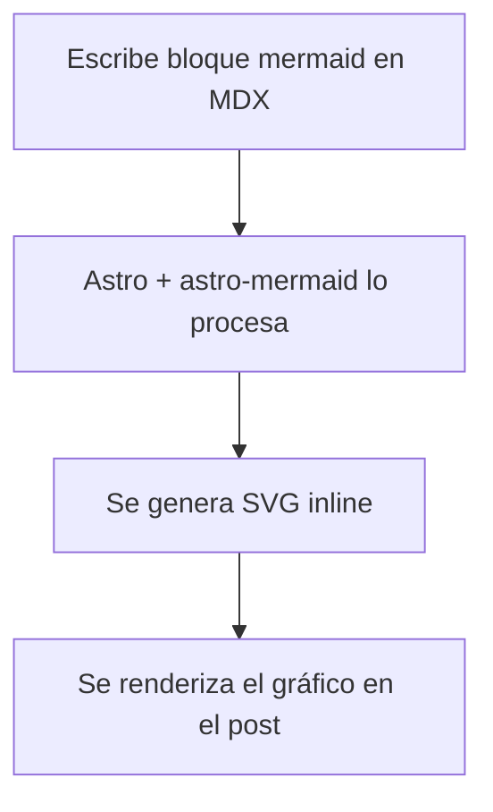
````

Gráfico renderizado:

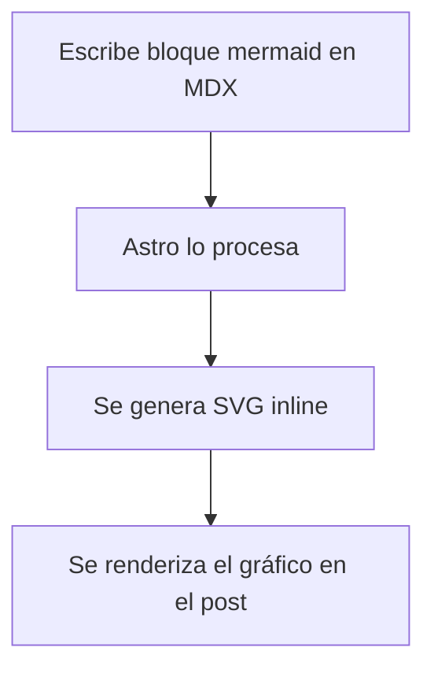

### Flowchart LR

Código fuente:

````md

````

Gráfico renderizado:

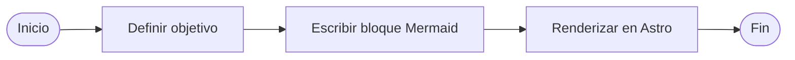

### Sequence Diagram

Código fuente:

````md
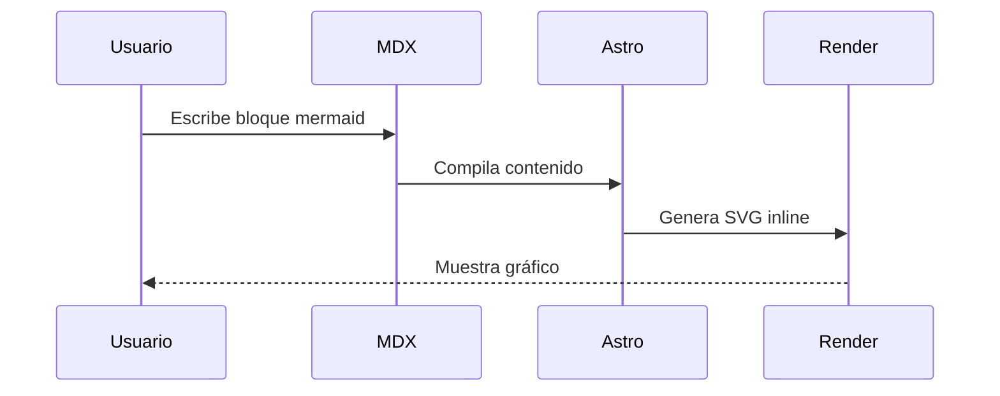
````

Gráfico renderizado:


### Mindmap

Código fuente:

````md
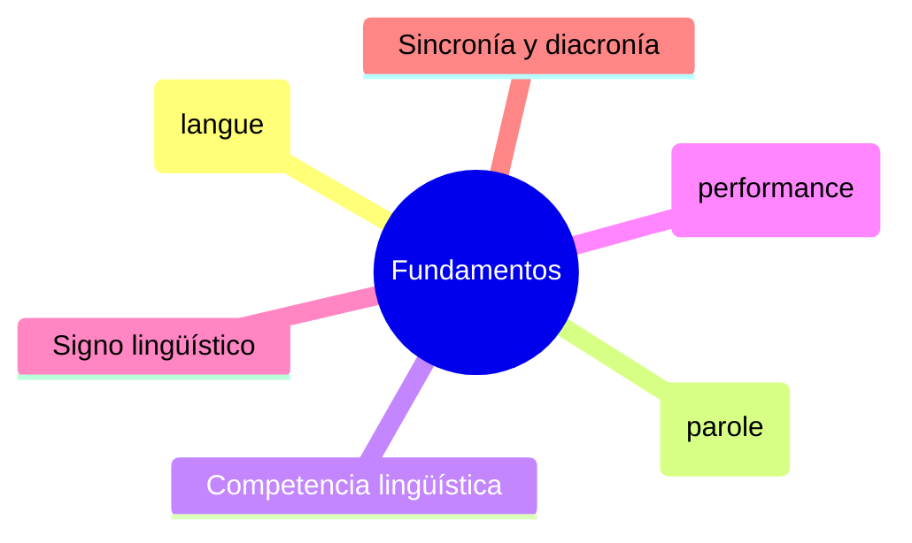
````

Gráfico renderizado:


### Class Diagram

Código fuente:

````md
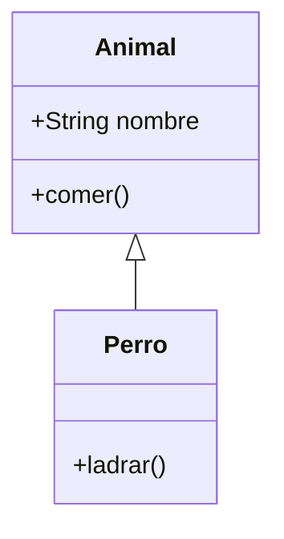
````

Gráfico renderizado:


### State Diagram

Código fuente:

````md
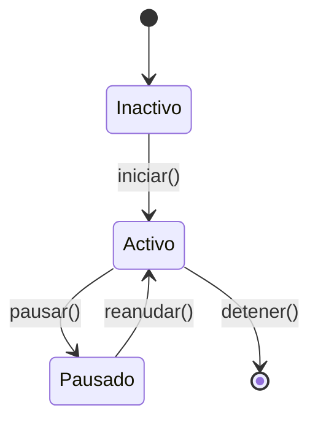
````

Gráfico renderizado:


### Entity Relationship (ER)

Código fuente:

````md
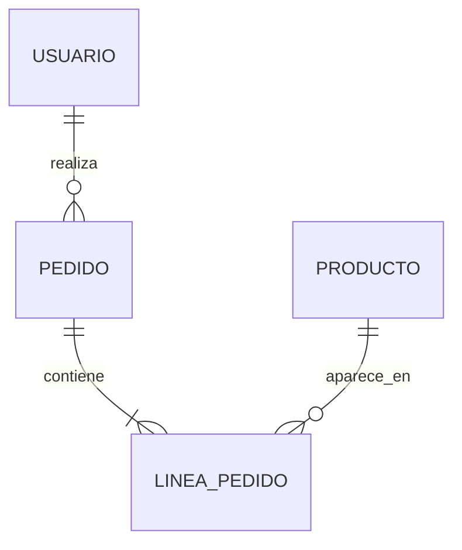
````

Gráfico renderizado:


### Gantt

Código fuente:

````md
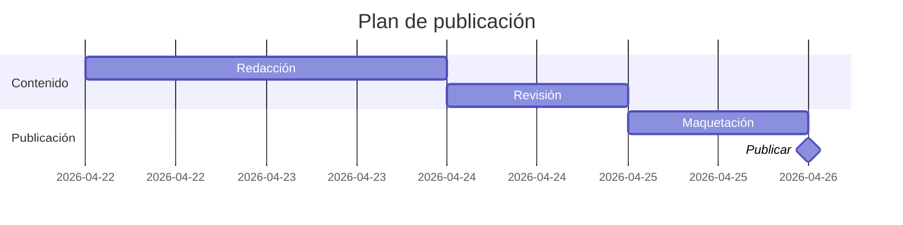
````

Gráfico renderizado:


### Pie Chart

Código fuente:

````md
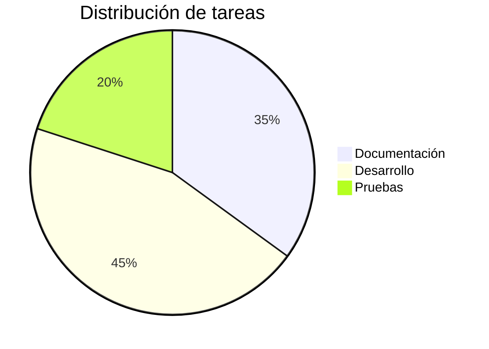
````

Gráfico renderizado:


### Git Graph

Código fuente:

````md
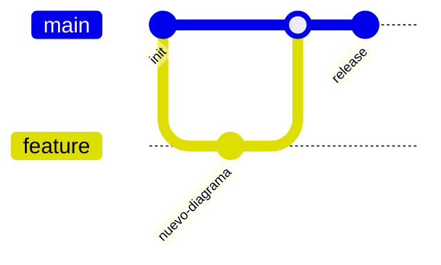
````

Gráfico renderizado:


---

## Procedimiento de instalación en Astro

### 1. Instalar mermaid

```bash
bun add mermaid
```

> Yo uso `bun`, pero funciona igual con `npm`, `yarn`, `pnpm`, etc.

### 2. Plugin remark en `astro.config.ts`

> Lo siguiente es **muy importante**. Cuando intenté la integración por primera
> vez usando `astro-mermaid`, los bloques de resaltado desaparecieron. Esto es
> por cómo funciona el flujo de los plugins de resaltado en Astro. Supongo que
> en otros sistemas como Svelte podría suceder algo similar.

El problema con soluciones de renderizado en tiempo de compilación (como `astro-mermaid`
o `rehype-mermaid`) es que crean conflictos con `astro-expressive-code`,
la librería que se encarga del *syntax highlighting*, rompiendo el resaltado
de código en todos los bloques ```` ```javascript ````, ```` ```bash ```` etc.

La solución es renderizar Mermaid en el cliente, pero hay que evitar que
`expressiveCode` intente procesar los bloques ` ```mermaid `. Para esto se
usa un plugin remark que convierte esos bloques a HTML raw `<pre class="mermaid">`
antes de que expressiveCode los vea:

```typescript
// astro.config.ts
import { visit } from 'unist-util-visit';

function remarkMermaidBypass() {
  return (tree: any) => {
    visit(tree, 'code', (node: any, index: number | undefined, parent: any) => {
      if (node.lang === 'mermaid' && parent && typeof index === 'number') {
        parent.children[index] = {
          type: 'html',
          value: `<pre class="mermaid">\n${node.value}\n</pre>`,
        };
      }
    });
  };
}
```

Se agrega al arreglo `markdown.remarkPlugins` (el orden importa: debe ir primero):

```typescript
// astro.config.ts
markdown: {
  remarkPlugins: [
    remarkMermaidBypass,  // primero
    remarkToc,
    remarkMath,
    remarkCollapse,
  ],
  // ...
},
```

También es importante que la integración MDX herede la configuración de
markdown en lugar de definir sus propios plugins:

```typescript
// astro.config.ts
mdx({
  extendMarkdownConfig: true,  // hereda remarkPlugins y rehypePlugins
}),
```

Si se pasan `rehypePlugins` o `remarkPlugins` directamente a `mdx()`, estos
*reemplazan* (no se fusionan con) los de `markdown.*`, lo que causa que
`rehypeExpressiveCode` desaparezca silenciosamente del pipeline de MDX.

### 3. Script de renderizado en el layout del post

> Yo uso gráficos Mermaid en las publicaciones del blog, pero aplicaría lo
> mismo para otros lugares. Por cierto, uso Astro Paper.

En el layout que renderiza los posts
(en <a href="https://astro-paper.pages.dev/" target="_blank">Astro Paper</a>: `PostDetails.astro`),
se agrega un `<script>` que importa `mermaid` y lo renderiza en el cliente.
El script usa el evento `astro:page-load` para ser compatible con View
Transitions, y un `MutationObserver` para re-renderizar cuando el usuario
cambia el tema (claro/oscuro):

```typescript
// PostDetails.astro
import mermaid from "mermaid";

let themeObserver: MutationObserver | null = null;

function getTheme() {
  return document.documentElement.dataset.theme === "dark" ? "dark" : "forest";
}

async function renderMermaid() {
  // Restaurar diagramas ya renderizados a pre.mermaid para re-renderizar
  // (necesario al cambiar de tema)
  document.querySelectorAll<HTMLElement>("[data-mermaid]").forEach(el => {
    const pre = document.createElement("pre");
    pre.className = "mermaid";
    pre.textContent = el.dataset.mermaid!;
    el.replaceWith(pre);
  });

  const blocks = Array.from(document.querySelectorAll<HTMLPreElement>("pre.mermaid"));
  if (!blocks.length) return;

  mermaid.initialize({ startOnLoad: false, theme: getTheme() });

  await Promise.all(blocks.map(async pre => {
    const source = (pre.textContent ?? "").trim();
    const id = `mermaid-${Math.random().toString(36).slice(2, 9)}`;
    try {
      const { svg } = await mermaid.render(id, source);
      const wrapper = document.createElement("div");
      wrapper.className = "my-6 flex justify-center overflow-x-auto";
      wrapper.dataset.mermaid = source;  // guarda source para re-render en cambio de tema
      wrapper.innerHTML = svg;
      pre.replaceWith(wrapper);
    } catch (err) {
      console.error("[mermaid]", err);
    }
  }));
}

document.addEventListener("astro:page-load", () => {
  renderMermaid();
  themeObserver?.disconnect();
  themeObserver = new MutationObserver(renderMermaid);
  themeObserver.observe(document.documentElement, {
    attributes: true,
    attributeFilter: ["data-theme"],
  });
});
```

> **Nota importante:** Si el *layout* también incluye botones *"Copy"* para bloques
> de código, asegurarse de excluir `pre.mermaid` del selector, ya que el texto
> del botón se concatena al código fuente y causa errores de *parseo*:

```javascript
// mal
const codeBlocks = Array.from(document.querySelectorAll("pre"));

// bien
const codeBlocks = Array.from(document.querySelectorAll("pre:not(.mermaid)"));
```

### 4. Detección del tema

El sitio usa el atributo `data-theme` en el `<html>` para indicar el tema
activo (`"light"` o `"dark"`). La función `getTheme()` lee ese atributo y
devuelve el nombre del tema Mermaid correspondiente. En este blog se usan
`"forest"` para claro y `"dark"` para oscuro.

## Personalización de colores con CSS

Mermaid renderiza SVG *inline*, y sus estilos internos usan selectores de alta
especificidad (`#id .clase`). Para sobreescribirlos con los colores del tema
del sitio, se necesita `!important` en el CSS global.

Existen algunas peculiaridades en Mermaid v11 respecto a versiones anteriores:

* Los **flowcharts** (`graph TD`, `flowchart LR`) usan `.node rect/circle/etc.`
  para los nodos y `.arrowheadPath` para las puntas de flecha
  (en v10 era `.arrowMarkerPath`).
* Los **diagramas de secuencia** usan `.actor` directamente en el `rect`
  (en v10 era `.actor rect`), `.messageLine0`/`.messageLine1` para las líneas
  de mensajes, y `[id$="-arrowhead"] path` para las puntas de flecha.
* Los **mindmaps** usan `span` dentro de `foreignObject` para el texto de
  las secciones. El color se controla con la propiedad CSS `color:` sobre
  el `span`, no con `fill:` sobre elementos SVG.
* `themeVariables` en la inicialización de Mermaid **no afecta** los colores
  de las secciones en mindmaps: esos se calculan algorítmicamente según el
  tema base seleccionado.

El CSS completo usado en este blog, en `global.css`:

```css
/* Mermaid: mindmap — secciones no-root usan color de texto del tema */
svg.mindmapDiagram [class*="section-"]:not(.section-root) span {
  color: var(--foreground) !important;
}

/* Mermaid: flowchart — nodos (graph TD, flowchart LR, etc.) */
[id^="mermaid-"] .node rect,
[id^="mermaid-"] .node circle,
[id^="mermaid-"] .node ellipse,
[id^="mermaid-"] .node polygon,
[id^="mermaid-"] .node path {
  fill: var(--muted) !important;
  stroke: var(--border) !important;
}

/* Mermaid: flowchart — aristas */
[id^="mermaid-"] .edgePath .path,
[id^="mermaid-"] .flowchart-link {
  stroke: var(--accent) !important;
}

/* Mermaid: flowchart — puntas de flecha (v11: .arrowheadPath) */
[id^="mermaid-"] .arrowheadPath {
  fill: var(--accent) !important;
  stroke: var(--accent) !important;
}

/* Mermaid: sequence — actores (v11: .actor directo en rect) */
[id^="mermaid-"] .actor {
  fill: var(--muted) !important;
  stroke: var(--border) !important;
}

/* Mermaid: sequence — líneas de mensajes */
[id^="mermaid-"] .messageLine0,
[id^="mermaid-"] .messageLine1 {
  stroke: var(--accent) !important;
}

/* Mermaid: sequence — puntas de flecha */
[id$="-arrowhead"] path {
  fill: var(--accent) !important;
  stroke: var(--accent) !important;
}

/* Mermaid: sequence — lifelines verticales */
[id^="mermaid-"] .actor-line {
  stroke: var(--border) !important;
}
```
