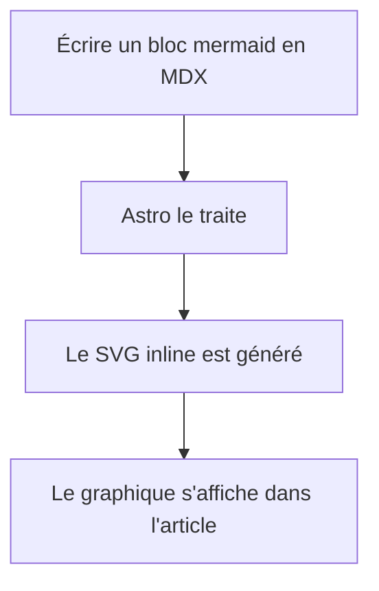
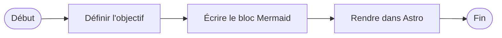
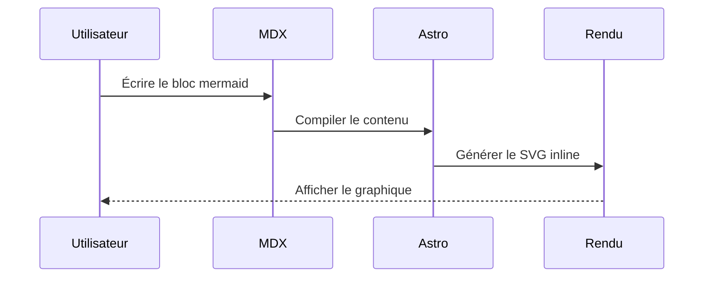
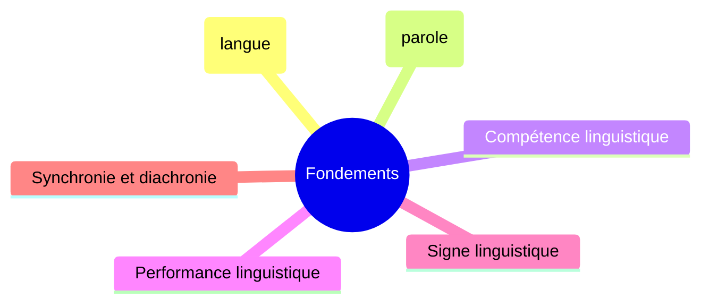
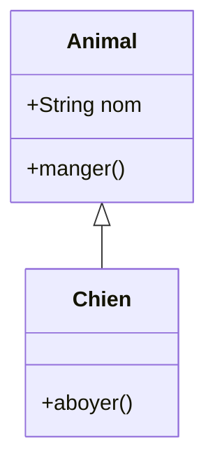
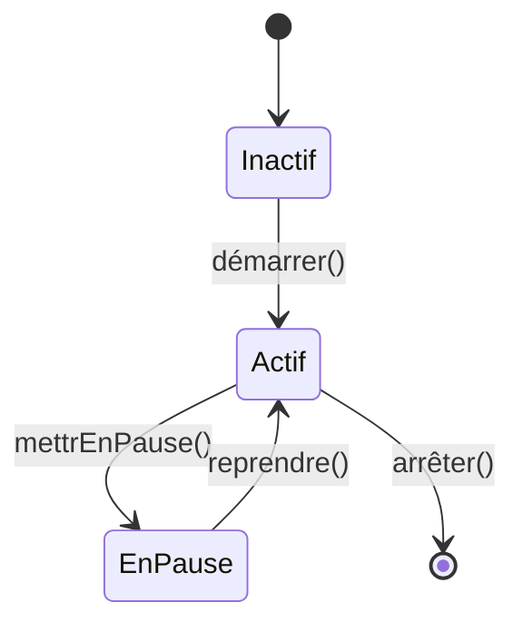
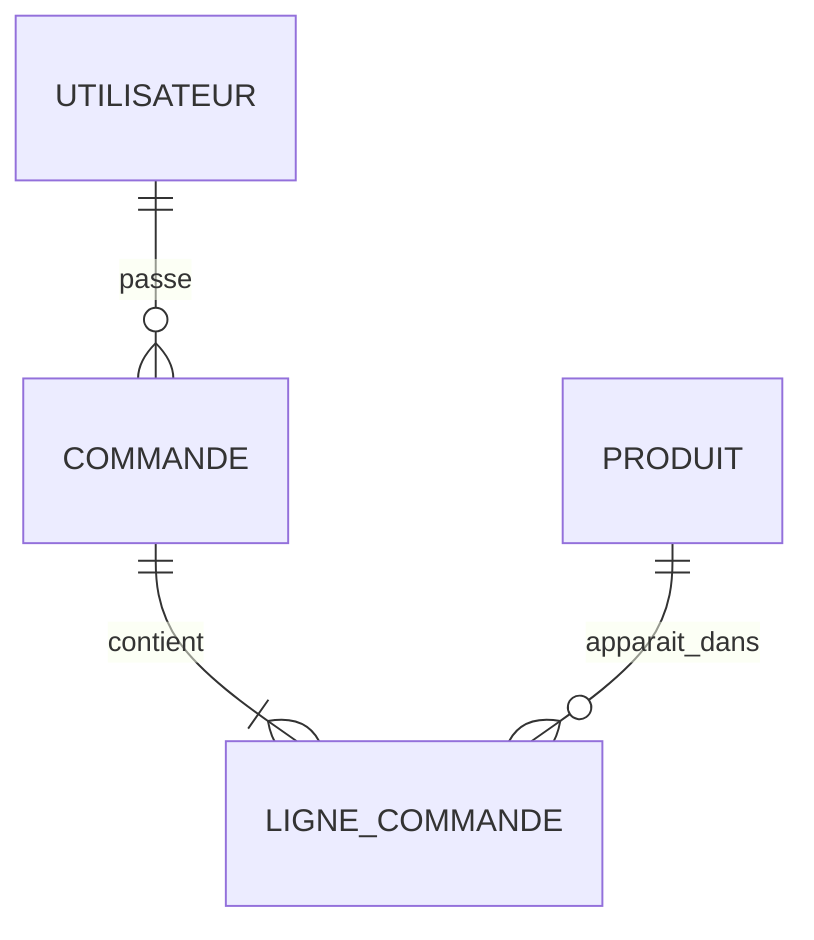
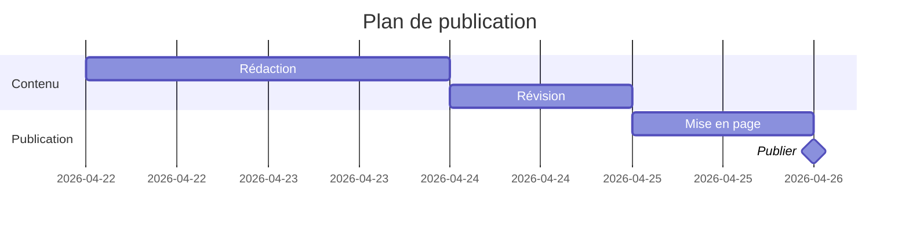
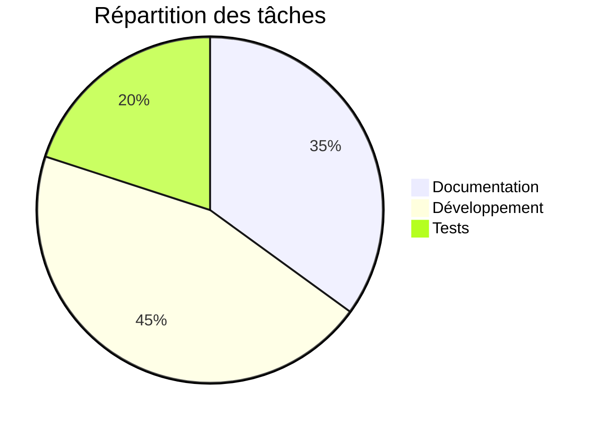
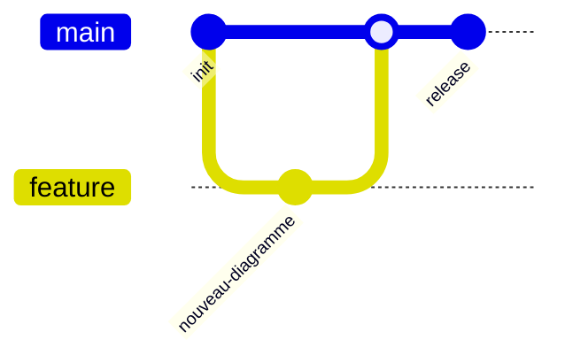

## Introduction

<a href="https://mermaid.js.org/" class="_blank">Mermaid</a> est un langage
de balisage qui permet de créer des graphiques de façon déclarative, en
utilisant une <a href="https://github.com/mermaid-js/mermaid" target="_blank">bibliothèque</a>
JavaScript pour les générer.

Mermaid a été créé par Knut Sveidahl, qui s'est <a href="https://github.com/mermaid-js/mermaid/issues/1904">inspiré</a>
de ses enfants en regardant *La Petite Sirène* (*The Little Mermaid*).
Initialement développé comme un outil pour générer des diagrammes à partir
de texte avec une syntaxe similaire à Markdown, il a évolué vers un
écosystème complet largement utilisé dans la communauté : le projet compte
actuellement une base d'utilisateurs massive, dépassant les 87 500 étoiles
sur GitHub.

Mermaid s'intègre nativement dans des systèmes comme GitHub, GitLab, Visual
Studio Code ou Notion, entre beaucoup d'autres. De même, il existe des
intégrations pour pratiquement toutes les bibliothèques et frameworks
frontend.

En utilisant un langage simple comme celui de Mermaid, on peut définir les
graphiques de façon déclarative sans avoir à apprendre un logiciel de
dessin visuel, qui est intrinsèquement plus lent. De plus, il est bien plus
facile de maintenir du code que des fichiers sources Gimp ou
<a href="https://draw.elpato.dev/" target="_blank">El Pato</a>.

Je l'ai découvert (un peu tardivement) en préparant le guide d'étude sur
[le TAL](https://rodolfo.gg/fr/posts/2026/04/glosario-linguistica-nlp/).

Voici quelques exemples d'intégration et de graphiques réalisés avec
Mermaid, suivis d'un guide pour l'installer et le personnaliser dans
<a href="https://astro.build/" target="_blank">Astro</a>.

---

## Table des matières

---

## Intégrations populaires de Mermaid

Selon le stack, on peut utiliser la bibliothèque officielle `mermaid` ou
des *wrappers* communautaires :

- **Svelte / SvelteKit :** `@friendofsvelte/mermaid`
- **React :** `mermaid` (officiel, rendu côté client), `mdx-mermaid`
- **Vue.js :** `vue-mermaid-string`, `vue-mermaid-render`
- **Next.js :** `mermaid` + `dynamic import`, `mdx-mermaid`
- **Angular :** `mermaid` (officiel) ou intégration avec `ngx-markdown` + Mermaid
- **Flutter / Dart :** `mermaid` (interop Dart JS), `flutter_smooth_markdown` (inclut `MermaidDiagram`)
- **Nuxt :** `@d0rich/nuxt-content-mermaid`
- **Docusaurus :** `@docusaurus/theme-mermaid`
- **VitePress :** `vitepress-plugin-mermaid`
- **Astro :** `astro-mermaid` ou rendu côté client avec `mermaid`

> Pour choisir une bibliothèque, il convient de vérifier la maintenance et la
> compatibilité avec la version de Mermaid et du framework utilisé. Il est
> également nécessaire de vérifier comment l'intégrer sans créer de conflits
> avec d'autres bibliothèques de coloration syntaxique.

---

## Exemples

### Graph TD

Code source :

````md

````

Graphique rendu :


### Flowchart LR

Code source :

````md

````

Graphique rendu :


### Sequence Diagram

Code source :

````md

````

Graphique rendu :


### Mindmap

Code source :

````md

````

Graphique rendu :


### Class Diagram

Code source :

````md

````

Graphique rendu :


### State Diagram

Code source :

````md

````

Graphique rendu :


### Entity Relationship (ER)

Code source :

````md

````

Graphique rendu :


### Gantt

Code source :

````md

````

Graphique rendu :


### Pie Chart

Code source :

````md

````

Graphique rendu :


### Git Graph

Code source :

````md

````

Graphique rendu :


---

## Procédure d'installation dans Astro

### 1. Installer mermaid

```bash
bun add mermaid
```

> J'utilise `bun`, mais cela fonctionne de la même façon avec `npm`, `yarn`, `pnpm`, etc.

### 2. Plugin remark dans `astro.config.ts`

> Ce qui suit est **très important**. Lors de ma première tentative
> d'intégration avec `astro-mermaid`, tous les blocs de coloration syntaxique
> ont disparu. C'est dû au fonctionnement du pipeline de plugins de coloration
> dans Astro. Quelque chose de similaire pourrait se produire avec d'autres
> frameworks comme Svelte.

Le problème avec les solutions de rendu en temps de compilation (comme
`astro-mermaid` ou `rehype-mermaid`) est qu'elles créent des conflits avec
`astro-expressive-code`, la bibliothèque responsable de la *coloration
syntaxique*, cassant la coloration dans tous les blocs ```` ```javascript ````,
```` ```bash ```` etc.

La solution est de rendre Mermaid côté client, mais il faut empêcher
`expressiveCode` d'essayer de traiter les blocs ` ```mermaid `. Pour cela,
un plugin remark convertit ces blocs en HTML brut `<pre class="mermaid">`
avant qu'expressiveCode ne les voie :

```typescript
// astro.config.ts
import { visit } from 'unist-util-visit';

function remarkMermaidBypass() {
  return (tree: any) => {
    visit(tree, 'code', (node: any, index: number | undefined, parent: any) => {
      if (node.lang === 'mermaid' && parent && typeof index === 'number') {
        parent.children[index] = {
          type: 'html',
          value: `<pre class="mermaid">\n${node.value}\n</pre>`,
        };
      }
    });
  };
}
```

À ajouter dans le tableau `markdown.remarkPlugins` (l'ordre est important : il doit être en premier) :

```typescript
// astro.config.ts
markdown: {
  remarkPlugins: [
    remarkMermaidBypass,  // en premier
    remarkToc,
    remarkMath,
    remarkCollapse,
  ],
  // ...
},
```

Il est également important que l'intégration MDX hérite de la configuration
markdown plutôt que de définir ses propres plugins :

```typescript
// astro.config.ts
mdx({
  extendMarkdownConfig: true,  // hérite de remarkPlugins et rehypePlugins
}),
```

Si l'on passe `rehypePlugins` ou `remarkPlugins` directement à `mdx()`,
ceux-ci *remplacent* (et ne fusionnent pas avec) ceux de `markdown.*`, ce
qui provoque la disparition silencieuse de `rehypeExpressiveCode` du
pipeline MDX.

### 3. Script de rendu dans le layout de l'article

> J'utilise des graphiques Mermaid dans les articles de blog, mais la même
> approche s'appliquerait ailleurs. J'utilise Astro Paper.

Dans le layout qui rend les articles
(dans <a href="https://astro-paper.pages.dev/" target="_blank">Astro Paper</a> : `PostDetails.astro`),
on ajoute un `<script>` qui importe `mermaid` et le rend côté client.
Le script utilise l'événement `astro:page-load` pour être compatible avec
les View Transitions, et un `MutationObserver` pour re-rendre quand
l'utilisateur change de thème (clair/sombre) :

```typescript
// PostDetails.astro
import mermaid from "mermaid";

let themeObserver: MutationObserver | null = null;

function getTheme() {
  return document.documentElement.dataset.theme === "dark" ? "dark" : "forest";
}

async function renderMermaid() {
  // Restaurer les diagrammes déjà rendus en pre.mermaid pour les re-rendre
  // (nécessaire lors d'un changement de thème)
  document.querySelectorAll<HTMLElement>("[data-mermaid]").forEach(el => {
    const pre = document.createElement("pre");
    pre.className = "mermaid";
    pre.textContent = el.dataset.mermaid!;
    el.replaceWith(pre);
  });

  const blocks = Array.from(document.querySelectorAll<HTMLPreElement>("pre.mermaid"));
  if (!blocks.length) return;

  mermaid.initialize({ startOnLoad: false, theme: getTheme() });

  await Promise.all(blocks.map(async pre => {
    const source = (pre.textContent ?? "").trim();
    const id = `mermaid-${Math.random().toString(36).slice(2, 9)}`;
    try {
      const { svg } = await mermaid.render(id, source);
      const wrapper = document.createElement("div");
      wrapper.className = "my-6 flex justify-center overflow-x-auto";
      wrapper.dataset.mermaid = source;  // stocke le source pour le re-rendu au changement de thème
      wrapper.innerHTML = svg;
      pre.replaceWith(wrapper);
    } catch (err) {
      console.error("[mermaid]", err);
    }
  }));
}

document.addEventListener("astro:page-load", () => {
  renderMermaid();
  themeObserver?.disconnect();
  themeObserver = new MutationObserver(renderMermaid);
  themeObserver.observe(document.documentElement, {
    attributes: true,
    attributeFilter: ["data-theme"],
  });
});
```

> **Note importante :** Si le *layout* inclut également des boutons *"Copy"*
> pour les blocs de code, s'assurer d'exclure `pre.mermaid` du sélecteur,
> car le texte du bouton se concatène au code source et provoque des erreurs
> d'analyse :

```javascript
// incorrect
const codeBlocks = Array.from(document.querySelectorAll("pre"));

// correct
const codeBlocks = Array.from(document.querySelectorAll("pre:not(.mermaid)"));
```

### 4. Détection du thème

Le site utilise l'attribut `data-theme` sur le `<html>` pour indiquer le
thème actif (`"light"` ou `"dark"`). La fonction `getTheme()` lit cet
attribut et retourne le nom du thème Mermaid correspondant. Ce blog utilise
`"forest"` pour le thème clair et `"dark"` pour le thème sombre.

## Personnalisation des couleurs avec CSS

Mermaid rend le SVG *inline*, et ses styles internes utilisent des sélecteurs
de haute spécificité (`#id .classe`). Pour les remplacer par les couleurs du
thème du site, `!important` est nécessaire dans le CSS global.

Il existe quelques particularités dans Mermaid v11 par rapport aux versions
précédentes :

* Les **flowcharts** (`graph TD`, `flowchart LR`) utilisent `.node rect/circle/etc.`
  pour les nœuds et `.arrowheadPath` pour les pointes de flèche
  (dans v10 c'était `.arrowMarkerPath`).
* Les **diagrammes de séquence** utilisent `.actor` directement sur le `rect`
  (dans v10 c'était `.actor rect`), `.messageLine0`/`.messageLine1` pour les
  lignes de messages, et `[id$="-arrowhead"] path` pour les pointes de flèche.
* Les **mindmaps** utilisent `span` dans `foreignObject` pour le texte des
  sections. La couleur est contrôlée par la propriété CSS `color:` sur le
  `span`, et non par `fill:` sur les éléments SVG.
* `themeVariables` dans l'initialisation de Mermaid **n'affecte pas** les
  couleurs des sections dans les mindmaps : celles-ci sont calculées
  algorithmiquement selon le thème de base sélectionné.

Le CSS complet utilisé dans ce blog, dans `global.css` :

```css
/* Mermaid: mindmap — les sections non-root utilisent la couleur de texte du thème */
svg.mindmapDiagram [class*="section-"]:not(.section-root) span {
  color: var(--foreground) !important;
}

/* Mermaid: flowchart — nœuds (graph TD, flowchart LR, etc.) */
[id^="mermaid-"] .node rect,
[id^="mermaid-"] .node circle,
[id^="mermaid-"] .node ellipse,
[id^="mermaid-"] .node polygon,
[id^="mermaid-"] .node path {
  fill: var(--muted) !important;
  stroke: var(--border) !important;
}

/* Mermaid: flowchart — arêtes */
[id^="mermaid-"] .edgePath .path,
[id^="mermaid-"] .flowchart-link {
  stroke: var(--accent) !important;
}

/* Mermaid: flowchart — pointes de flèche (v11 : .arrowheadPath) */
[id^="mermaid-"] .arrowheadPath {
  fill: var(--accent) !important;
  stroke: var(--accent) !important;
}

/* Mermaid: sequence — acteurs (v11 : .actor directement sur rect) */
[id^="mermaid-"] .actor {
  fill: var(--muted) !important;
  stroke: var(--border) !important;
}

/* Mermaid: sequence — lignes de messages */
[id^="mermaid-"] .messageLine0,
[id^="mermaid-"] .messageLine1 {
  stroke: var(--accent) !important;
}

/* Mermaid: sequence — pointes de flèche */
[id$="-arrowhead"] path {
  fill: var(--accent) !important;
  stroke: var(--accent) !important;
}

/* Mermaid: sequence — lifelines verticales */
[id^="mermaid-"] .actor-line {
  stroke: var(--border) !important;
}
```
