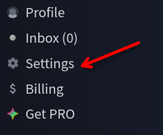
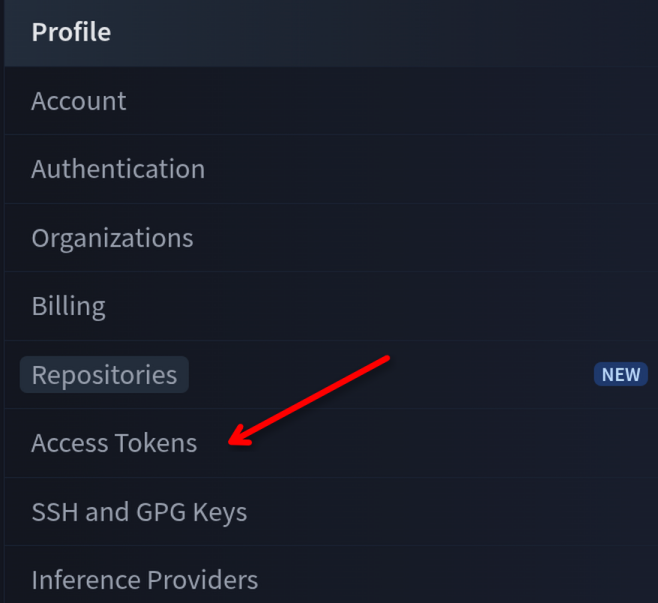

import Aside from "@/components/Aside.astro";

## Introduction

Selon Wikipedia :

> Hugging Face, Inc. est une entreprise franco-américaine qui développe des
> outils pour créer des applications utilisant l'apprentissage automatique.
> Elle est connue pour sa bibliothèque Transformers créée pour les
> applications de traitement du langage naturel, et sa plateforme permettant
> aux utilisateurs de partager des jeux de données et des modèles
> d'apprentissage automatique.

## Étape par étape

1. Allez sur <a href="https://huggingface.co" target="_blank">`huggingface.co`</a> et connectez-vous à votre compte. Si vous n'en avez pas, inscrivez-vous.
1. Allez dans *Settings* :
    
1. Dans le menu latéral, sélectionnez "*Access Tokens*" :
    
1. Cliquez sur "*Create new token*" :
    
1. Donnez-lui un nom, sélectionnez le type "`Write`" (nécessaire pour téléverser des datasets) ou "`Read`" (lecture seule). Vous pouvez aussi créer un token *Fine grained* avec des permissions spécifiques, mais dans la plupart des cas ce n'est pas nécessaire.
1. Cliquez sur "*Generate a token*" et copiez-le.

<Aside type="caution">

le token **n'est affiché qu'une seule fois**.

</Aside>

<Aside type="note">

la variable d'environnement `HF_TOKEN` peut être exportée avec la valeur du token généré. Si vous avez besoin d'utiliser un autre token, il suffit de modifier l'export :
```bash
export HF_TOKEN=my_token
```

</Aside>

## Commandes CLI utiles

* `hf auth login` se connecte à HuggingFace.
* `hf auth list` liste les tokens autorisés.
* `hf auth whoami` affiche quel utilisateur est connecté.

<Aside type="note">

certains guides en ligne indiquent que la commande CLI est `huggingface-cli`, ce qui semble être obsolète.

</Aside>

## Bonus

La variable `HF_DEBUG` avec la valeur `1` peut être utilisée pour déboguer les interactions avec HuggingFace.
