import Aside from "@rgglez/astro-aside";

## Introducción

Este glosario reúne términos usados en aprendizaje automático, ciencia de datos, estadística, optimización, aprendizaje profundo y áreas relacionadas. Está pensado como material de consulta rápida para estudiantes, desarrolladores y profesionales técnicos.

Las fórmulas se expresan en notación matemática usando LaTeX. Cuando aparece una ecuación, debajo se incluye una cita explicativa con el significado de sus símbolos principales.

---

## Tabla de contenido

---

## 1. Conceptos generales de inteligencia artificial y aprendizaje automático

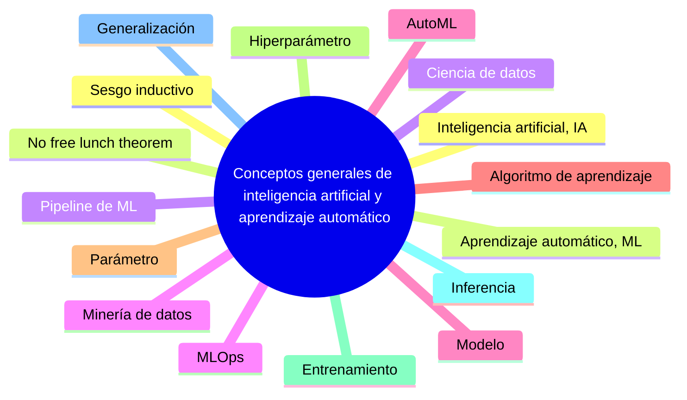
```mermaid
mindmap
  root(("Conceptos generales de inteligencia artificial y aprendizaje automático"))
    Inteligencia artificial, IA
    Aprendizaje automático, ML
    Ciencia de datos
    Minería de datos
    Modelo
    Algoritmo de aprendizaje
    Parámetro
    Hiperparámetro
    Entrenamiento
    Inferencia
    Generalización
    Sesgo inductivo
    No free lunch theorem
    Pipeline de ML
    MLOps
    AutoML
```

### Inteligencia artificial, IA

Área de la computación dedicada a construir sistemas capaces de realizar tareas que normalmente asociamos con inteligencia humana: razonamiento, percepción, aprendizaje, planificación, generación de lenguaje, toma de decisiones o resolución de problemas.

### Aprendizaje automático, ML

Subcampo de la inteligencia artificial que estudia algoritmos capaces de aprender patrones a partir de datos y mejorar su desempeño en una tarea sin ser programados explícitamente para cada caso.

Un modelo de ML suele aprender una función aproximada:

$$
f: X \rightarrow Y
$$

<Aside type="note">

En esta expresión, $f$ es la función aprendida por el modelo, $X$ es el espacio de entrada o conjunto de características, y $Y$ es el espacio de salida, por ejemplo clases, valores numéricos o decisiones.

</Aside>

### Ciencia de datos

Disciplina interdisciplinaria que combina estadística, programación, aprendizaje automático, visualización, ingeniería de datos y conocimiento del dominio para extraer información útil de los datos.

### Minería de datos

Proceso de descubrir patrones, relaciones, anomalías o estructuras interesantes en grandes conjuntos de datos. Es más amplia que el entrenamiento de modelos, porque incluye exploración, limpieza, transformación e interpretación.

### Modelo

Representación matemática, estadística o computacional que aprende una relación entre entradas y salidas. En ML, un modelo puede ser una regresión lineal, un árbol de decisión, una red neuronal, un clasificador bayesiano o un modelo generativo.

### Algoritmo de aprendizaje

Procedimiento que ajusta los parámetros de un modelo a partir de datos. Por ejemplo, descenso de gradiente, inducción de árboles, maximización de margen, boosting o backpropagation.

### Parámetro

Valor interno aprendido por el modelo durante el entrenamiento. En una regresión lineal, los pesos y el sesgo son parámetros.

### Hiperparámetro

Valor definido antes o durante el proceso de entrenamiento que controla el comportamiento del algoritmo, pero que no se aprende directamente de los datos. Ejemplos: tasa de aprendizaje, profundidad máxima de un árbol, número de vecinos en KNN, número de capas de una red neuronal.

### Entrenamiento

Proceso mediante el cual un algoritmo ajusta los parámetros del modelo usando datos de entrenamiento.

### Inferencia

Uso de un modelo ya entrenado para producir predicciones, clasificaciones, puntuaciones o decisiones sobre datos nuevos.

### Generalización

Capacidad de un modelo para desempeñarse bien en datos no vistos durante el entrenamiento. Es una propiedad central en aprendizaje automático.

### Sesgo inductivo

Conjunto de supuestos que permiten a un algoritmo aprender a partir de datos limitados. Por ejemplo, un modelo lineal asume que la relación entre variables puede aproximarse mediante una función lineal.

### No free lunch theorem

Teorema que, en términos generales, indica que ningún algoritmo de aprendizaje es universalmente superior para todos los problemas posibles. Un método funciona bien porque sus supuestos encajan con la estructura del problema.

### Pipeline de ML

Flujo de trabajo completo para construir un sistema de aprendizaje automático: adquisición de datos, limpieza, transformación, partición, entrenamiento, validación, evaluación, despliegue y monitoreo.

### MLOps

Conjunto de prácticas de ingeniería para desplegar, versionar, monitorear, mantener y automatizar sistemas de aprendizaje automático en producción.

### AutoML

Automatización parcial o total del proceso de construcción de modelos: selección de algoritmos, búsqueda de hiperparámetros, ingeniería de características, ensamblado y evaluación.

---

## 2. Tipos de aprendizaje automático

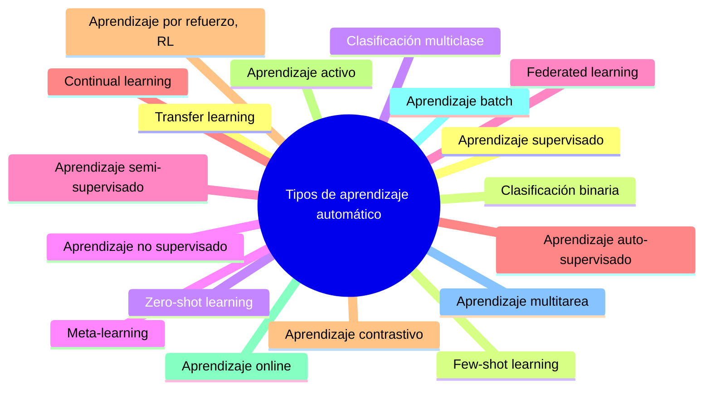
```mermaid
mindmap
  root(("Tipos de aprendizaje automático"))
    Aprendizaje supervisado
    Clasificación binaria
    Clasificación multiclase
    Aprendizaje no supervisado
    Aprendizaje semi-supervisado
    Aprendizaje auto-supervisado
    Aprendizaje por refuerzo, RL
    Aprendizaje activo
    Aprendizaje online
    Aprendizaje batch
    Aprendizaje multitarea
    Transfer learning
    Few-shot learning
    Zero-shot learning
    Meta-learning
    Federated learning
    Continual learning
    Aprendizaje contrastivo
```

### Aprendizaje supervisado

Paradigma en el que el modelo aprende a partir de ejemplos etiquetados. Cada observación incluye entradas y una salida esperada.

Ejemplo: predecir si un correo es spam usando correos previamente etiquetados como spam o no spam.

### Clasificación binaria

Problema de clasificación supervisada en el que la variable objetivo tiene exactamente dos clases posibles.

### Clasificación multiclase

Problema de clasificación supervisada en el que la salida pertenece a una entre tres o más clases mutuamente excluyentes.

### Aprendizaje no supervisado

Paradigma en el que el modelo trabaja con datos sin etiquetas. Busca estructuras internas como grupos, componentes latentes, patrones frecuentes o anomalías.

Ejemplo: segmentar clientes según patrones de compra sin conocer previamente los segmentos.

### Aprendizaje semi-supervisado

Uso combinado de una pequeña cantidad de datos etiquetados y una gran cantidad de datos no etiquetados. Es útil cuando etiquetar datos es caro.

### Aprendizaje auto-supervisado

Tipo de aprendizaje donde las etiquetas se generan automáticamente a partir de los propios datos. Es fundamental en modelos modernos de lenguaje, visión y representación.

Ejemplo: predecir palabras ocultas en una oración o predecir la siguiente palabra.

### Aprendizaje por refuerzo, RL

Paradigma en el que un agente aprende a tomar acciones en un entorno para maximizar una recompensa acumulada.

### Aprendizaje activo

Estrategia donde el modelo solicita etiquetas para los ejemplos más informativos, ambiguos o útiles, reduciendo el costo de anotación.

### Aprendizaje online

Entrenamiento incremental donde el modelo se actualiza conforme llegan nuevas observaciones, en lugar de entrenarse una sola vez sobre un conjunto fijo.

### Aprendizaje batch

Entrenamiento usando un conjunto de datos completo o grandes lotes previamente recolectados.

### Aprendizaje multitarea

Entrenamiento de un modelo para resolver varias tareas relacionadas, compartiendo representaciones internas.

### Transfer learning

Reutilización de conocimiento aprendido en una tarea fuente para mejorar el desempeño en una tarea objetivo.

Ejemplo: usar una red preentrenada en ImageNet como extractor de características para clasificar imágenes médicas.

### Few-shot learning

Capacidad de aprender o adaptarse a una tarea con muy pocos ejemplos etiquetados.

### Zero-shot learning

Capacidad de resolver una tarea sin ejemplos específicos de entrenamiento para esa tarea, usando conocimiento general, descripciones semánticas o instrucciones.

### Meta-learning

Aprendizaje orientado a que el modelo aprenda a aprender. Busca que un sistema se adapte rápidamente a nuevas tareas.

### Federated learning

Entrenamiento distribuido donde los datos permanecen en dispositivos o servidores locales, y sólo se comparten actualizaciones del modelo.

### Continual learning

Aprendizaje continuo a partir de nuevas tareas o distribuciones sin olvidar de manera catastrófica lo aprendido anteriormente.

### Aprendizaje contrastivo

Método que aprende representaciones acercando ejemplos similares y alejando ejemplos distintos en un espacio latente.

---

## 3. Datos, variables y representación

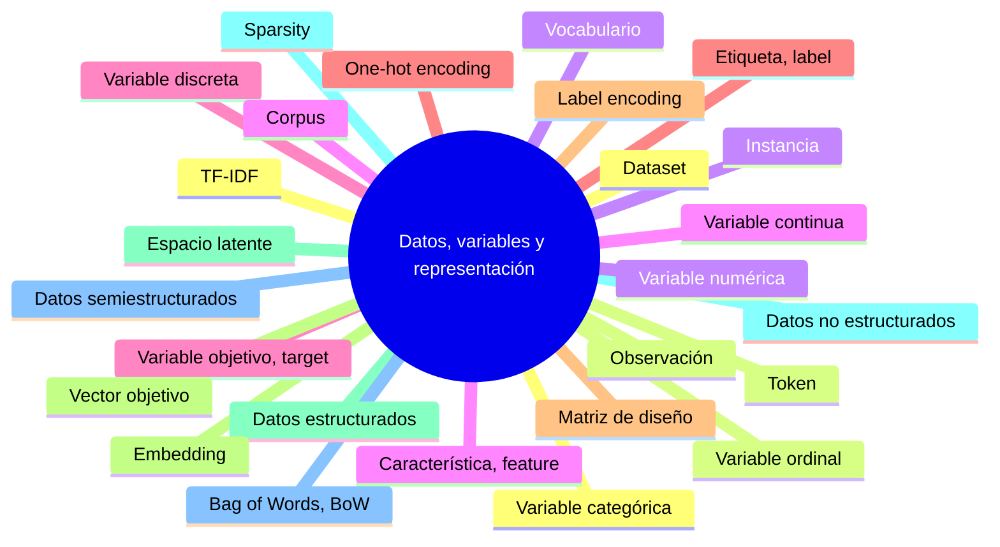
```mermaid
mindmap
  root(("Datos, variables y representación"))
    Dataset
    Observación
    Instancia
    Característica, feature
    Variable objetivo, target
    Etiqueta, label
    Matriz de diseño
    Vector objetivo
    Datos estructurados
    Datos no estructurados
    Datos semiestructurados
    Variable categórica
    Variable ordinal
    Variable numérica
    Variable continua
    Variable discreta
    One-hot encoding
    Label encoding
    Embedding
    Espacio latente
    Sparsity
    Bag of Words, BoW
    TF-IDF
    Token
    Vocabulario
    Corpus
```

### Dataset

Conjunto de datos usado para entrenar, validar o probar modelos. Puede contener filas, ejemplos, documentos, imágenes, señales, grafos, audio, texto o series temporales.

### Observación

Una unidad individual del dataset. En una tabla, suele corresponder a una fila.

### Instancia

Sinónimo de observación o ejemplo. En clasificación, una instancia es un caso que debe ser clasificado.

### Característica, feature

Variable de entrada usada por el modelo. Ejemplos: edad, salario, número de visitas, píxeles de una imagen, frecuencia de una palabra.

### Variable objetivo, target

Variable que se intenta predecir. En clasificación puede ser una clase; en regresión, un valor continuo.

### Etiqueta, label

Valor conocido de la salida esperada en aprendizaje supervisado.

### Matriz de diseño

Representación tabular de los datos de entrada:

$$
X \in \mathbb{R}^{n ^ p}
$$

<Aside type="note">

$X$ es la matriz de características; $n$ es el número de observaciones; $p$ es el número de características; el superíndice indica una matriz real de tamaño n por p (n filas y p columnas).

</Aside>

### Vector objetivo

Vector que contiene las etiquetas o valores objetivo:

$$
y \in \mathbb{R}^{n}
$$

<Aside type="note">

$y$ es el vector de salidas esperadas; $n$ es el número de observaciones; cada elemento $y_i$ corresponde a la salida asociada con la observación $x_i$.

</Aside>

### Datos estructurados

Datos organizados en tablas con columnas y tipos definidos, como datos transaccionales o registros de clientes.

### Datos no estructurados

Datos sin estructura tabular rígida, como texto libre, imágenes, audio, video o documentos.

### Datos semiestructurados

Datos con estructura flexible, como JSON, XML, logs o documentos con campos variables.

### Variable categórica

Variable que toma valores discretos que representan categorías. Ejemplos: país, color, tipo de producto.

### Variable ordinal

Variable categórica con orden natural. Ejemplo: bajo, medio, alto.

### Variable numérica

Variable expresada como número. Puede ser continua o discreta.

### Variable continua

Variable que puede tomar infinitos valores dentro de un intervalo. Ejemplo: temperatura, altura, peso.

### Variable discreta

Variable que toma valores contables. Ejemplo: número de compras, número de hijos, cantidad de errores.

### One-hot encoding

Codificación de variables categóricas mediante columnas binarias. Si la variable color puede ser rojo, verde o azul, se crean tres columnas indicadoras.

### Label encoding

Codificación de categorías como enteros. Debe usarse con cuidado porque puede introducir un orden artificial donde no existe.

### Embedding

Representación vectorial densa de entidades como palabras, usuarios, productos, nodos o imágenes. Los embeddings buscan capturar similitud semántica o estructural.

### Espacio latente

Espacio de representación interna donde un modelo codifica información relevante de los datos, normalmente con menor dimensión o mayor abstracción.

### Sparsity

Propiedad de una representación donde la mayoría de los valores son cero. Es común en texto representado mediante bolsa de palabras.

### Bag of Words, BoW

Representación textual que cuenta ocurrencias de palabras, ignorando orden gramatical.

### TF-IDF

Técnica de ponderación textual que combina frecuencia de término e importancia inversa del documento.

$$
\operatorname{tfidf}(t,d,D)=\operatorname{tf}(t,d)\cdot \log\left(\frac{|D|}{1+|\{d' \in D: t \in d'\}|}\right)
$$

<Aside type="note">

$t$ es el término; $d$ es el documento actual; $D$ es la colección de documentos; $\operatorname{tf}(t,d)$ mide la frecuencia del término $t$ en $d$; $|D|$ es el número total de documentos; $|\{d' \in D: t \in d'\}|$ es el número de documentos que contienen $t$; el $1$ evita divisiones por cero.

</Aside>

### Token

Unidad mínima de procesamiento en modelos de lenguaje. Puede ser una palabra, subpalabra, carácter o símbolo.

### Vocabulario

Conjunto de tokens conocidos por un modelo o corpus.

### Corpus

Colección de documentos o textos usados para análisis, entrenamiento o evaluación.

---

## 4. Preparación, limpieza y transformación de datos

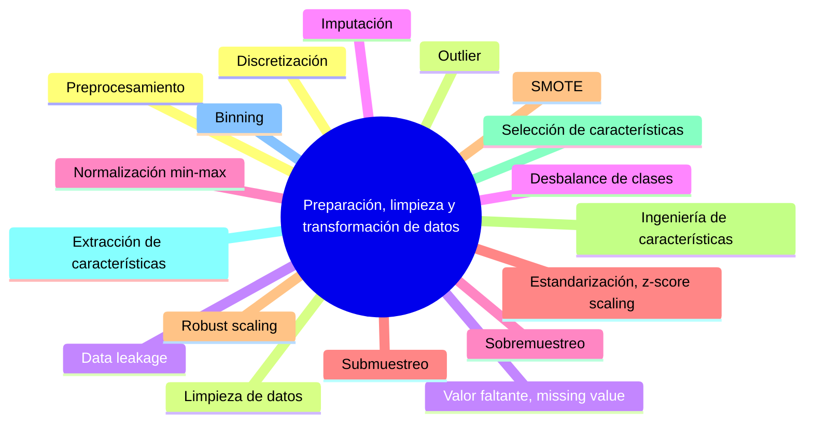
```mermaid
mindmap
  root(("Preparación, limpieza y transformación de datos"))
    Preprocesamiento
    Limpieza de datos
    Valor faltante, missing value
    Imputación
    Normalización min-max
    Estandarización, z-score scaling
    Robust scaling
    Ingeniería de características
    Selección de características
    Extracción de características
    Binning
    Discretización
    Outlier
    Data leakage
    Desbalance de clases
    Sobremuestreo
    Submuestreo
    SMOTE
```

### Preprocesamiento

Conjunto de operaciones realizadas antes del entrenamiento: limpieza, codificación, normalización, imputación, selección de variables y transformación.

### Limpieza de datos

Proceso de corregir, eliminar o manejar errores, duplicados, inconsistencias, formatos inválidos y valores faltantes.

### Valor faltante, missing value

Dato ausente en una observación. Puede deberse a errores de captura, pérdida de información o ausencia real del valor.

### Imputación

Técnica para sustituir valores faltantes. Puede hacerse usando media, mediana, moda, modelos predictivos o técnicas específicas del dominio.

### Normalización min-max

Escalamiento que transforma una variable a un rango, normalmente $[0,1]$:

$$
x' = \frac{x - x_{\min}}{x_{\max} - x_{\min}}
$$

<Aside type="note">

$x$ es el valor original; $x'$ es el valor escalado; $x_{\min}$ es el mínimo observado de la variable; $x_{\max}$ es el máximo observado de la variable.

</Aside>

### Estandarización, z-score scaling

Transformación que centra una variable en media cero y desviación estándar uno:

$$
z = \frac{x - \mu}{\sigma}
$$

<Aside type="note">

$z$ es el valor estandarizado; $x$ es el valor original; $\mu$ es la media de la variable; $\sigma$ es la desviación estándar.

</Aside>

### Robust scaling

Escalamiento robusto frente a valores extremos:

$$
x' = \frac{x - \operatorname{mediana}(x)}{\operatorname{IQR}(x)}
$$

<Aside type="note">

$x$ es el valor original; $x'$ es el valor transformado; $\operatorname{mediana}(x)$ es el valor central de la distribución; $\operatorname{IQR}(x)$ es el rango intercuartílico, normalmente $Q_3 - Q_1$.

</Aside>

### Ingeniería de características

Proceso de crear, transformar o seleccionar variables para mejorar el desempeño del modelo.

Ejemplo: crear una variable `edad_cliente_en_dias` a partir de una fecha de nacimiento.

### Selección de características

Proceso de escoger un subconjunto de variables relevantes para reducir ruido, mejorar interpretabilidad o disminuir complejidad.

### Extracción de características

Transformación de datos originales en representaciones más informativas. Ejemplos: PCA, embeddings, descriptores de imagen, frecuencias de palabras.

### Binning

Agrupación de valores continuos en intervalos. Por ejemplo, transformar edad en grupos: joven, adulto, mayor.

### Discretización

Conversión de variables continuas en categorías o intervalos discretos.

### Outlier

Observación inusual o extrema respecto al patrón general de los datos. Puede representar error, rareza legítima o evento de interés.

### Data leakage

Filtración de información del conjunto de prueba, validación o futuro hacia el entrenamiento. Produce evaluaciones artificialmente optimistas.

Ejemplo: usar una variable calculada después del evento que se intenta predecir.

### Desbalance de clases

Situación donde una clase aparece con mucha mayor frecuencia que otra. Es común en fraude, diagnóstico médico y detección de anomalías.

### Sobremuestreo

Técnica que aumenta ejemplos de la clase minoritaria, por duplicación o generación sintética.

### Submuestreo

Técnica que reduce ejemplos de la clase mayoritaria para balancear el dataset.

### SMOTE

Synthetic Minority Over-sampling Technique. Método que genera ejemplos sintéticos de la clase minoritaria interpolando entre vecinos cercanos.

---

## 5. Partición de datos y validación

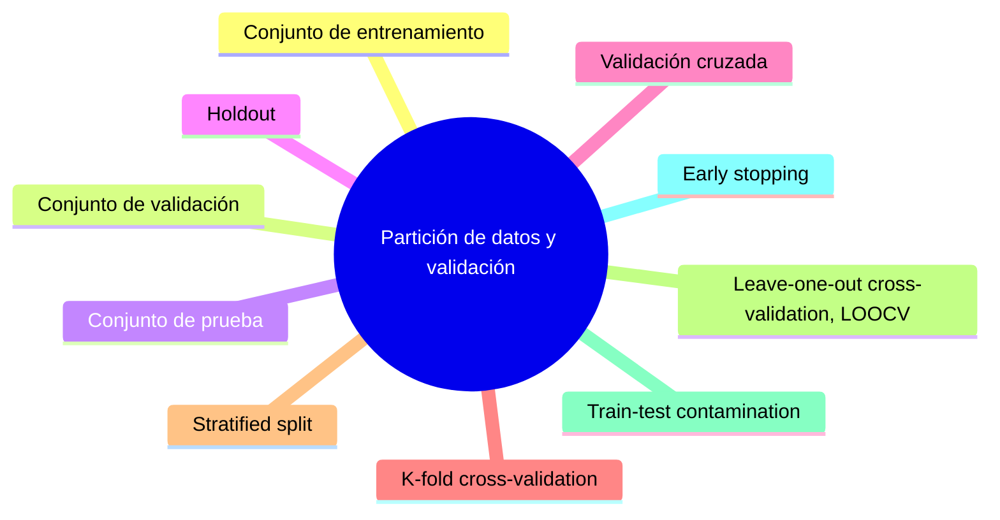
```mermaid
mindmap
  root(("Partición de datos y validación"))
    Conjunto de entrenamiento
    Conjunto de validación
    Conjunto de prueba
    Holdout
    Validación cruzada
    K-fold cross-validation
    Stratified split
    Leave-one-out cross-validation, LOOCV
    Train-test contamination
    Early stopping
```

### Conjunto de entrenamiento

Subconjunto usado para ajustar los parámetros del modelo.

### Conjunto de validación

Subconjunto usado para seleccionar hiperparámetros, comparar modelos o decidir cuándo detener el entrenamiento.

### Conjunto de prueba

Subconjunto reservado para estimar el desempeño final del modelo en datos no vistos.

### Holdout

Estrategia simple de partición de datos en entrenamiento y prueba, por ejemplo 80/20.

### Validación cruzada

Técnica que divide los datos en varias particiones o folds, entrenando y evaluando varias veces.

### K-fold cross-validation

Validación cruzada con $k$ particiones:

$$
\operatorname{CV}_k = \frac{1}{k}\sum_{i=1}^{k} M_i
$$

<Aside type="note">

$\operatorname{CV}_k$ es el desempeño promedio de la validación cruzada; $k$ es el número de folds; $M_i$ es la métrica obtenida en el fold $i$.

</Aside>

### Stratified split

Partición que conserva la proporción de clases en entrenamiento, validación y prueba.

### Leave-one-out cross-validation, LOOCV

Caso extremo de validación cruzada donde cada fold usa una sola observación como prueba y el resto como entrenamiento.

### Train-test contamination

Contaminación entre entrenamiento y prueba. Suele ocurrir cuando hay duplicados, transformaciones ajustadas antes de particionar o registros relacionados en ambos conjuntos.

### Early stopping

Técnica para detener el entrenamiento cuando el desempeño en validación deja de mejorar, reduciendo el sobreajuste.

---

## 6. Ajuste, error y capacidad del modelo

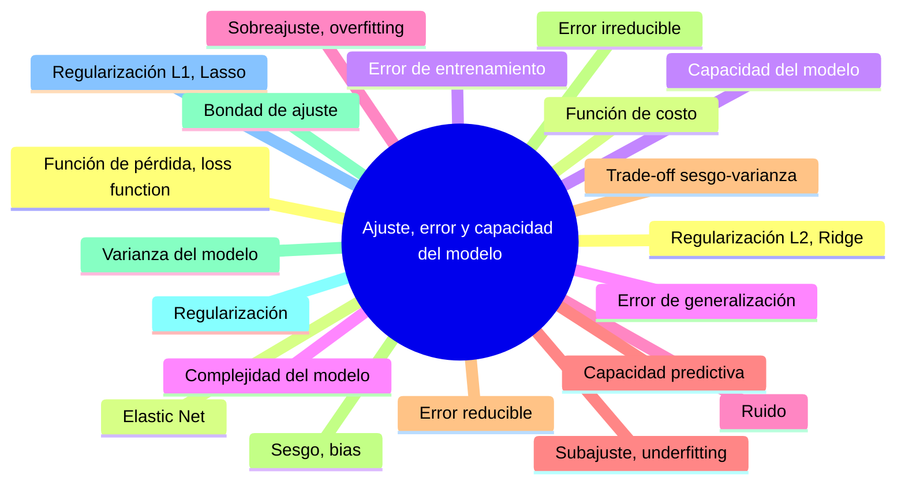
```mermaid
mindmap
  root(("Ajuste, error y capacidad del modelo"))
    Función de pérdida, loss function
    Función de costo
    Error de entrenamiento
    Error de generalización
    Sobreajuste, overfitting
    Subajuste, underfitting
    Trade-off sesgo-varianza
    Sesgo, bias
    Varianza del modelo
    Regularización
    Regularización L1, Lasso
    Regularización L2, Ridge
    Elastic Net
    Capacidad del modelo
    Complejidad del modelo
    Ruido
    Capacidad predictiva
    Error reducible
    Error irreducible
    Bondad de ajuste
```

### Función de pérdida, loss function

Función que mide qué tan mala es una predicción respecto al valor esperado. El entrenamiento intenta minimizarla.

### Función de costo

Promedio o agregación de la pérdida sobre el conjunto de entrenamiento.

$$
J(\theta)=\frac{1}{n}\sum_{i=1}^{n} L\left(y_i, \hat{y}_i\right)
$$

<Aside type="note">

$J(\theta)$ es la función de costo; $\theta$ representa los parámetros del modelo; $n$ es el número de ejemplos; $L$ es la función de pérdida; $y_i$ es el valor real; $\hat{y}_i$ es la predicción para el ejemplo $i$.

</Aside>

### Error de entrenamiento

Error medido sobre los datos usados para ajustar el modelo.

### Error de generalización

Error esperado sobre datos nuevos provenientes de la misma distribución.

### Sobreajuste, overfitting

Situación en la que un modelo aprende ruido o detalles específicos del entrenamiento y falla al generalizar.

### Subajuste, underfitting

Situación en la que un modelo es demasiado simple para capturar la estructura relevante de los datos.

### Trade-off sesgo-varianza

Relación entre error por supuestos demasiado rígidos y error por sensibilidad excesiva a los datos de entrenamiento.

### Sesgo, bias

Error debido a simplificaciones del modelo. Un modelo con alto sesgo puede subajustar.

### Varianza del modelo

Sensibilidad del modelo a cambios en los datos de entrenamiento. Un modelo con alta varianza puede sobreajustar.

### Regularización

Técnica que penaliza la complejidad del modelo para mejorar la generalización.

### Regularización L1, Lasso

Penalización basada en la suma de valores absolutos de los pesos:

$$
\lambda \sum_{j=1}^{p}|w_j|
$$

<Aside type="note">

$\lambda$ controla la fuerza de la regularización; $p$ es el número de características; $w_j$ es el peso asociado con la característica $j$; $|w_j|$ es su valor absoluto.

</Aside>

### Regularización L2, Ridge

Penalización basada en la suma de cuadrados de los pesos:

$$
\lambda \sum_{j=1}^{p}w_j^2
$$

<Aside type="note">

$\lambda$ controla la intensidad de la penalización; $p$ es el número de características; $w_j$ es el peso del modelo para la característica $j$.

</Aside>

### Elastic Net

Regularización que combina L1 y L2:

$$
\lambda_1 \sum_{j=1}^{p}|w_j| + \lambda_2 \sum_{j=1}^{p}w_j^2
$$

<Aside type="note">

$\lambda_1$ controla la penalización L1; $\lambda_2$ controla la penalización L2; $w_j$ son los pesos del modelo; $p$ es el número de características.

</Aside>

### Capacidad del modelo

Grado de flexibilidad de un modelo para representar funciones complejas. Modelos con alta capacidad pueden aprender patrones complejos, pero también sobreajustar.

### Complejidad del modelo

Cantidad de grados de libertad, parámetros, profundidad, reglas, interacciones o estructuras que puede usar el modelo.

### Ruido

Variación aleatoria o irrelevante en los datos que no corresponde a patrones generalizables.

### Capacidad predictiva

Capacidad de un modelo para anticipar correctamente resultados en datos no observados.

### Error reducible

Componente del error total atribuible al modelo o al entrenamiento, que puede disminuirse con mejores métodos o más información.

### Error irreducible

Componente del error causado por ruido inherente o variables no observadas, que no puede eliminarse completamente con el modelo.

### Bondad de ajuste

Grado en que las predicciones del modelo se ajustan a los datos observados, medido con métricas como R² o análisis de residuos.

---

## 7. Métricas de clasificación

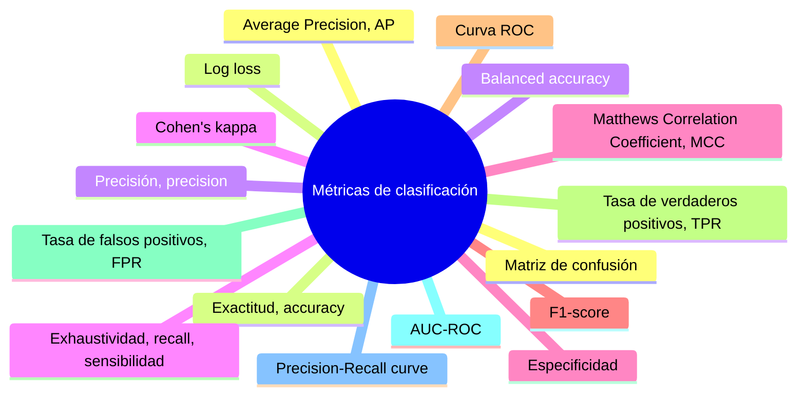
```mermaid
mindmap
  root(("Métricas de clasificación"))
    Matriz de confusión
    Exactitud, accuracy
    Precisión, precision
    Exhaustividad, recall, sensibilidad
    Especificidad
    F1-score
    Curva ROC
    Tasa de verdaderos positivos, TPR
    Tasa de falsos positivos, FPR
    AUC-ROC
    Precision-Recall curve
    Average Precision, AP
    Log loss
    Balanced accuracy
    Cohen's kappa
    Matthews Correlation Coefficient, MCC
```

### Matriz de confusión

Tabla que resume predicciones correctas e incorrectas por clase.

| | Predicho positivo | Predicho negativo |
|---|---:|---:|
| Real positivo | TP | FN |
| Real negativo | FP | TN |

<Aside type="note">

Mide cómo se distribuyen aciertos y errores por clase para entender en qué se equivoca el modelo.
Ejemplo: en detección de fraude, permite ver si hay demasiados fraudes no detectados ($FN$).
$TP$ son verdaderos positivos; $TN$ son verdaderos negativos; $FP$ son falsos positivos; $FN$ son falsos negativos.

</Aside>

### Exactitud, accuracy

Proporción de predicciones correctas:

$$
\operatorname{accuracy}=\frac{TP+TN}{TP+TN+FP+FN}
$$

<Aside type="note">

Mide la fracción total de aciertos del modelo y sirve como referencia global rápida.
Ejemplo: en clasificación de imágenes balanceadas (gato/perro), se usa como métrica principal inicial.
$TP$ son verdaderos positivos; $TN$ son verdaderos negativos; $FP$ son falsos positivos; $FN$ son falsos negativos.

</Aside>

### Precisión, precision

Proporción de predicciones positivas que realmente son positivas:

$$
\operatorname{precision}=\frac{TP}{TP+FP}
$$

<Aside type="note">

Mide qué porcentaje de predicciones positivas realmente eran positivas; prioriza evitar falsos positivos.
Ejemplo: en un filtro de spam, alta precisión evita mandar correos legítimos a spam.
$TP$ son verdaderos positivos; $FP$ son falsos positivos.

</Aside>

### Exhaustividad, recall, sensibilidad

Proporción de positivos reales detectados por el modelo:

$$
\operatorname{recall}=\frac{TP}{TP+FN}
$$

<Aside type="note">

Mide qué porcentaje de los positivos reales logra capturar el modelo; prioriza evitar falsos negativos.
Ejemplo: en tamizaje médico, se busca alto recall para no dejar casos enfermos sin detectar.
$TP$ son verdaderos positivos; $FN$ son falsos negativos.

</Aside>

### Especificidad

Proporción de negativos reales correctamente identificados:

$$
\operatorname{specificity}=\frac{TN}{TN+FP}
$$

<Aside type="note">

Mide qué tan bien el modelo identifica negativos reales.
Ejemplo: en detección de intrusiones, ayuda a estimar cuántas conexiones normales se marcan erróneamente como ataque.
$TN$ son verdaderos negativos; $FP$ son falsos positivos.

</Aside>

### F1-score

Media armónica entre precisión y recall:

$$
F_1 = 2\cdot \frac{\operatorname{precision}\cdot \operatorname{recall}}{\operatorname{precision}+\operatorname{recall}}
$$

<Aside type="note">

Mide el equilibrio entre precisión y recall en una sola cifra.
Ejemplo: en moderación de contenido, se usa cuando importa balancear publicaciones peligrosas omitidas y falsos reportes.
$\operatorname{precision}$ indica cuántos positivos predichos fueron correctos; $\operatorname{recall}$ indica cuántos positivos reales fueron detectados.

</Aside>

### Curva ROC

Curva que muestra la relación entre tasa de verdaderos positivos y tasa de falsos positivos al variar el umbral de decisión.

<Aside type="note">

Sirve para comparar clasificadores a distintos umbrales de decisión.
Ejemplo: en scoring crediticio, ayuda a elegir el umbral de aprobación según tolerancia al riesgo.

</Aside>

### Tasa de verdaderos positivos, TPR

Proporción de positivos reales correctamente identificados; equivale a recall o sensibilidad.

<Aside type="note">

Mide la capacidad de detectar la clase positiva.
Ejemplo: en detección de cáncer, un TPR alto indica que se detectan la mayoría de casos reales.
$TP$ son verdaderos positivos; $FN$ son falsos negativos; $\operatorname{TPR}=\frac{TP}{TP+FN}$.

</Aside>

### Tasa de falsos positivos, FPR

Proporción de negativos reales que el modelo clasifica incorrectamente como positivos.

<Aside type="note">

Mide la frecuencia con que se generan falsas alarmas sobre casos negativos.
Ejemplo: en autenticación biométrica, un FPR alto implica aceptar usuarios no autorizados.
$FP$ son falsos positivos; $TN$ son verdaderos negativos; $\operatorname{FPR}=\frac{FP}{FP+TN}$.

</Aside>

### AUC-ROC

Área bajo la curva ROC. Mide la capacidad del modelo para ordenar positivos por encima de negativos.

<Aside type="note">

Resume en un solo valor la calidad de separación entre clases, independiente del umbral específico.
Ejemplo: en selección de modelos para churn, se elige el de mayor AUC antes de fijar umbral.

</Aside>

### Precision-Recall curve

Curva que muestra el intercambio entre precisión y recall. Suele ser más informativa que ROC en problemas muy desbalanceados.

<Aside type="note">

Sirve para evaluar cómo cambia el balance entre falsos positivos y falsos negativos al mover el umbral.
Ejemplo: en detección de fraude (clase positiva rara), permite elegir umbrales operables para el equipo de revisión.

</Aside>

### Average Precision, AP

Resumen del área bajo la curva precision-recall.

<Aside type="note">

Mide el desempeño promedio del modelo en distintos niveles de recall dentro de la curva PR.
Ejemplo: en búsqueda de documentos relevantes, AP permite comparar ranking models de forma compacta.

</Aside>

### Log loss

Pérdida para clasificación probabilística:

$$
\operatorname{LogLoss}=-\frac{1}{n}\sum_{i=1}^{n}\left[y_i\log(\hat{p}_i)+(1-y_i)\log(1-\hat{p}_i)\right]
$$

<Aside type="note">

Mide qué tan bien calibradas y seguras son las probabilidades predichas; penaliza mucho la sobreconfianza incorrecta.
Ejemplo: en un sistema de aprobación automática, se usa para entrenar modelos probabilísticos confiables.
$n$ es el número de ejemplos; $y_i$ es la etiqueta real binaria; $\hat{p}_i$ es la probabilidad predicha para la clase positiva; $\log$ es el logaritmo natural.

</Aside>

### Balanced accuracy

Promedio del recall por clase. Es útil cuando las clases están desbalanceadas.

<Aside type="note">

Mide el desempeño promedio en cada clase sin dejar que la clase mayoritaria domine el resultado.
Ejemplo: en detección de fallas raras en manufactura, refleja mejor el rendimiento real que la accuracy.

</Aside>

### Cohen's kappa

Métrica de acuerdo entre predicciones y etiquetas que corrige el acuerdo esperado por azar.

<Aside type="note">

Mide cuánto mejor es el acuerdo del modelo frente al acuerdo que ocurriría por azar.
Ejemplo: en clasificación manual asistida (p. ej., tickets), ayuda a validar consistencia modelo-etiquetador.

</Aside>

### Matthews Correlation Coefficient, MCC

Métrica robusta para clasificación binaria, especialmente con clases desbalanceadas:

$$
\operatorname{MCC}=\frac{TP\cdot TN-FP\cdot FN}{\sqrt{(TP+FP)(TP+FN)(TN+FP)(TN+FN)}}
$$

<Aside type="note">

Mide la calidad global de clasificación binaria considerando todas las celdas de la matriz de confusión.
Ejemplo: en problemas médicos desbalanceados, MCC se usa para comparar modelos de forma más estable que accuracy.
$TP$, $TN$, $FP$ y $FN$ son los conteos de la matriz de confusión. MCC toma valores entre $-1$ y $1$; $1$ indica predicción perfecta, $0$ equivale a azar y $-1$ indica desacuerdo total.

</Aside>

---

## 8. Métricas de regresión

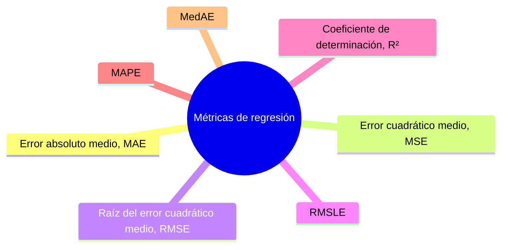
```mermaid
mindmap
  root(("Métricas de regresión"))
    Error absoluto medio, MAE
    Error cuadrático medio, MSE
    Raíz del error cuadrático medio, RMSE
    RMSLE
    Coeficiente de determinación, R²
    MAPE
    MedAE
```

### Error absoluto medio, MAE

Promedio de errores absolutos:

$$
\operatorname{MAE}=\frac{1}{n}\sum_{i=1}^{n}|y_i-\hat{y}_i|
$$

<Aside type="note">

Mide el error promedio en magnitud absoluta, fácil de interpretar en las unidades originales.
Ejemplo: en pronóstico de ventas, MAE indica en promedio cuántas unidades se falla por periodo.
$n$ es el número de observaciones; $y_i$ es el valor real; $\hat{y}_i$ es la predicción; $|\cdot|$ indica valor absoluto.

</Aside>

### Error cuadrático medio, MSE

Promedio de los errores al cuadrado:

$$
\operatorname{MSE}=\frac{1}{n}\sum_{i=1}^{n}(y_i-\hat{y}_i)^2
$$

<Aside type="note">

Mide el error cuadrático promedio y penaliza con más fuerza errores grandes.
Ejemplo: en estimación de demanda eléctrica, se usa cuando errores extremos son especialmente costosos.
$n$ es el número de observaciones; $y_i$ es el valor real; $\hat{y}_i$ es el valor predicho.

</Aside>

### Raíz del error cuadrático medio, RMSE

Raíz cuadrada del MSE:

$$
\operatorname{RMSE}=\sqrt{\frac{1}{n}\sum_{i=1}^{n}(y_i-\hat{y}_i)^2}
$$

<Aside type="note">

Mide el tamaño típico del error con mayor sensibilidad a errores grandes, pero en la misma unidad del objetivo.
Ejemplo: en predicción de temperatura, RMSE se reporta en °C para interpretación directa.
$n$ es el número de observaciones; $y_i$ es el valor real; $\hat{y}_i$ es la predicción.

</Aside>

### RMSLE

Root Mean Squared Logarithmic Error. Métrica de regresión que aplica logaritmos antes del error cuadrático para enfatizar diferencias relativas.

<Aside type="note">

Mide error relativo y reduce el impacto de escalas grandes, útil cuando importa el porcentaje de error más que el absoluto.
Ejemplo: en predicción de precios de e-commerce, RMSLE tolera mejor diferencias entre productos baratos y caros.

</Aside>

### Coeficiente de determinación, R²

Proporción de variabilidad explicada por el modelo:

$$
R^2=1-\frac{\sum_{i=1}^{n}(y_i-\hat{y}_i)^2}{\sum_{i=1}^{n}(y_i-\bar{y})^2}
$$

<Aside type="note">

Mide qué proporción de la variación de la variable objetivo explica el modelo frente a una línea base.
Ejemplo: en modelos inmobiliarios, permite comunicar cuánto de la variabilidad de precios se captura.
$y_i$ es el valor real; $\hat{y}_i$ es la predicción; $\bar{y}$ es la media de los valores reales; el numerador mide error residual y el denominador mide variabilidad total.

</Aside>

### MAPE

Mean Absolute Percentage Error. Error absoluto porcentual medio:

$$
\operatorname{MAPE}=\frac{100}{n}\sum_{i=1}^{n}\left|\frac{y_i-\hat{y}_i}{y_i}\right|
$$

<Aside type="note">

Mide el error promedio en porcentaje, útil para comparar desempeño entre series con distintas escalas.
Ejemplo: en forecast de inventario multi-producto, facilita comparar error relativo entre categorías.
$n$ es el número de observaciones; $y_i$ es el valor real; $\hat{y}_i$ es la predicción. MAPE puede ser problemático cuando $y_i$ es cero o cercano a cero.

</Aside>

### MedAE

Median Absolute Error. Mediana de los errores absolutos. Es más robusta a outliers que MAE.

<Aside type="note">

Mide el error absoluto típico del caso central y reduce la influencia de valores atípicos.
Ejemplo: en predicción de tiempos de entrega con retrasos extremos ocasionales, MedAE refleja mejor el comportamiento habitual.

</Aside>

---

## 9. Algoritmos supervisados clásicos

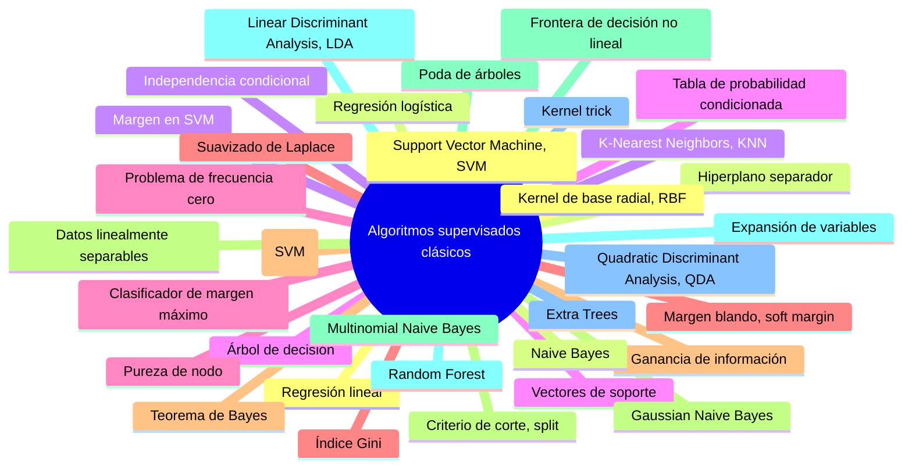
```mermaid
mindmap
  root(("Algoritmos supervisados clásicos"))
    Regresión lineal
    Regresión logística
    K-Nearest Neighbors, KNN
    Árbol de decisión
    Pureza de nodo
    Índice Gini
    Ganancia de información
    Criterio de corte, split
    Poda de árboles
    Random Forest
    Extra Trees
    Support Vector Machine, SVM
    Hiperplano separador
    Margen en SVM
    Vectores de soporte
    Clasificador de margen máximo
    Margen blando, soft margin
    Parámetro de costo C (SVM)
    Datos linealmente separables
    Frontera de decisión no lineal
    Expansión de variables
    Kernel trick
    Kernel de base radial, RBF
    Naive Bayes
    Independencia condicional
    Tabla de probabilidad condicionada
    Problema de frecuencia cero
    Suavizado de Laplace
    Teorema de Bayes
    Gaussian Naive Bayes
    Multinomial Naive Bayes
    Linear Discriminant Analysis, LDA
    Quadratic Discriminant Analysis, QDA
```

### Regresión lineal

Modelo que predice una variable continua como combinación lineal de características:

$$
\hat{y}=w_0+w_1x_1+w_2x_2+\cdots+w_px_p
$$

<Aside type="note">

$\hat{y}$ es la predicción; $w_0$ es el sesgo o intercepto; $w_j$ son los pesos aprendidos; $x_j$ son las características; $p$ es el número de características.

</Aside>

### Regresión logística

Modelo de clasificación que estima la probabilidad de una clase usando la función sigmoide:

$$
\hat{p}=\sigma(z)=\frac{1}{1+e^{-z}}, \quad z=w^Tx+b
$$

<Aside type="note">

$\hat{p}$ es la probabilidad predicha; $\sigma$ es la función sigmoide; $z$ es la combinación lineal; $w$ es el vector de pesos; $x$ es el vector de características; $b$ es el sesgo; $e$ es la constante de Euler.

</Aside>

### K-Nearest Neighbors, KNN

Algoritmo que predice la clase o valor de un punto según sus $k$ vecinos más cercanos en el espacio de características.

Ejemplo: si $k=5$ y tres vecinos son de clase A, KNN clasifica el punto como A.

### Árbol de decisión

Modelo que divide los datos mediante reglas jerárquicas sobre características. Cada nodo representa una condición y cada hoja una predicción.

### Pureza de nodo

Medida de homogeneidad de las clases dentro de un nodo de árbol; mayor pureza implica menor mezcla de clases.

### Índice Gini

Criterio de impureza usado en árboles de clasificación; un valor bajo indica nodos más puros.

### Ganancia de información

Reducción esperada de entropía al dividir un nodo por una variable; se usa para elegir particiones en árboles.

### Criterio de corte, split

Regla que divide observaciones en un nodo según un umbral o categoría de una característica.

### Poda de árboles

Proceso que simplifica un árbol de decisión eliminando ramas poco útiles para reducir sobreajuste.

### Random Forest

Ensamble de múltiples árboles de decisión entrenados sobre muestras y subconjuntos de variables aleatorios. Reduce varianza frente a un árbol individual.

### Extra Trees

Variante de ensamble de árboles que introduce mayor aleatoriedad al elegir puntos de corte, reduciendo varianza y acelerando entrenamiento en algunos casos.

### Support Vector Machine, SVM

Modelo que busca un hiperplano que separe clases maximizando el margen entre ellas.

### Hiperplano separador

Frontera lineal en el espacio de características que separa clases en SVM y otros clasificadores lineales.

### Margen en SVM

Distancia entre el hiperplano de separación y los puntos más cercanos de cada clase.

### Vectores de soporte

Observaciones más cercanas al margen en SVM que determinan la posición del hiperplano óptimo.

### Clasificador de margen máximo

Clasificador lineal que busca separar clases maximizando estrictamente el margen cuando los datos son separables.

### Margen blando, soft margin

Variante de SVM que permite violaciones controladas del margen mediante penalización para manejar datos no separables linealmente.

### Parámetro de costo C (SVM)

Hiperparámetro que controla el equilibrio entre maximizar el margen y penalizar errores de clasificación durante el entrenamiento.

### Datos linealmente separables

Conjunto de observaciones que puede dividirse correctamente con un hiperplano sin errores de clasificación.

### Frontera de decisión no lineal

Superficie de separación entre clases que no puede expresarse como una combinación lineal simple de las variables originales.

### Expansión de variables

Transformación que proyecta datos a un espacio de mayor dimensión para facilitar separaciones complejas entre clases.

### Kernel trick

Técnica que permite a SVM y otros métodos operar en espacios de mayor dimensión sin calcular explícitamente la transformación.

### Kernel de base radial, RBF

Función kernel común en SVM que modela similitud de forma no lineal y permite fronteras de decisión flexibles en espacios de alta dimensión.

### Naive Bayes

Familia de clasificadores probabilísticos basados en el teorema de Bayes y en el supuesto de independencia condicional entre características.

### Independencia condicional

Supuesto de que dos variables son independientes al condicionar sobre una tercera variable. Es clave en Naive Bayes.

### Tabla de probabilidad condicionada

Estructura tabular que representa probabilidades condicionales de eventos o clases dadas ciertas evidencias.

### Problema de frecuencia cero

Situación en Naive Bayes donde una combinación atributo-clase no aparece en entrenamiento y provoca probabilidad posterior nula.

### Suavizado de Laplace

Técnica que evita probabilidades cero añadiendo una constante positiva a los conteos de frecuencia.

### Teorema de Bayes

$$
P(A|B)=\frac{P(B|A)P(A)}{P(B)}
$$

<Aside type="note">

$P(A|B)$ es la probabilidad posterior de $A$ dado $B$; $P(B|A)$ es la verosimilitud de observar $B$ si $A$ es cierto; $P(A)$ es la probabilidad previa; $P(B)$ es la evidencia o probabilidad marginal de $B$.

</Aside>

### Gaussian Naive Bayes

Clasificador Naive Bayes que asume que las características continuas siguen una distribución normal dentro de cada clase.

### Multinomial Naive Bayes

Variante usada con conteos, especialmente en clasificación de texto.

### Linear Discriminant Analysis, LDA

Método de clasificación y reducción de dimensión que busca combinaciones lineales que separen clases.

### Quadratic Discriminant Analysis, QDA

Similar a LDA, pero permite matrices de covarianza diferentes para cada clase, generando fronteras cuadráticas.

---

## 10. Ensambles y boosting

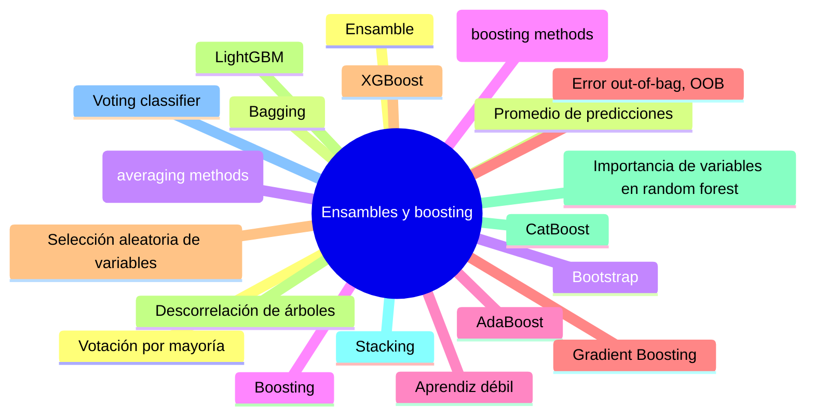
```mermaid
mindmap
  root(("Ensambles y boosting"))
    Ensamble
    Bagging
    Bootstrap
    Boosting
    AdaBoost
    Gradient Boosting
    XGBoost
    LightGBM
    CatBoost
    Stacking
    Voting classifier
    Votación por mayoría
    Promedio de predicciones
    Métodos de promediado (averaging methods)
    Métodos de refuerzo secuencial (boosting methods)
    Aprendiz débil
    Error out-of-bag, OOB
    Selección aleatoria de variables
    Descorrelación de árboles
    Importancia de variables en random forest
```

### Ensamble

Combinación de varios modelos para obtener una predicción más robusta que la de un modelo individual.

### Bagging

Bootstrap aggregating. Entrena modelos en muestras bootstrap y promedia o vota sus predicciones.

### Bootstrap

Muestreo con reemplazo a partir de un dataset. Algunas observaciones pueden repetirse y otras quedar fuera.

### Boosting

Familia de métodos que entrenan modelos secuencialmente, enfocándose en corregir errores de modelos previos.

### AdaBoost

Algoritmo de boosting que ajusta pesos de observaciones, aumentando la importancia de ejemplos mal clasificados.

### Gradient Boosting

Método que entrena modelos débiles para aproximar el gradiente negativo de la función de pérdida.

### XGBoost

Implementación eficiente y regularizada de gradient boosting sobre árboles. Es popular en datos tabulares.

### LightGBM

Implementación de gradient boosting optimizada para velocidad y memoria, con crecimiento de árboles por hojas.

### CatBoost

Algoritmo de boosting especialmente diseñado para manejar variables categóricas y reducir leakage en codificaciones.

### Stacking

Ensamble donde las predicciones de varios modelos base se usan como entradas para un metamodelo.

### Voting classifier

Ensamble que combina predicciones mediante voto duro o promedio de probabilidades.

### Votación por mayoría

Regla de agregación en ensembles de clasificación donde la clase final es la más votada entre los modelos base.

### Promedio de predicciones

Regla de agregación en ensembles de regresión donde la salida final es la media de las predicciones individuales.

### Métodos de promediado (averaging methods)

Familia de ensembles que entrena estimadores de forma independiente y combina sus salidas para reducir varianza.

### Métodos de refuerzo secuencial (boosting methods)

Familia de ensembles que entrena modelos de forma secuencial para corregir errores previos y reducir sesgo.

### Aprendiz débil

Modelo con desempeño apenas mejor que el azar de forma aislada, pero útil cuando se combina en esquemas de boosting.

### Error out-of-bag, OOB

Estimación del error en bagging o random forest usando observaciones no incluidas en cada muestra bootstrap.

### Selección aleatoria de variables

Estrategia de random forest que evalúa solo un subconjunto aleatorio de características en cada split para diversificar árboles.

### Descorrelación de árboles

Efecto buscado en random forests al introducir aleatoriedad para que los árboles cometan errores distintos y el promedio sea más robusto.

### Importancia de variables en random forest

Medida que estima la contribución de cada característica al desempeño predictivo del bosque.

---

## 11. Aprendizaje no supervisado y clustering

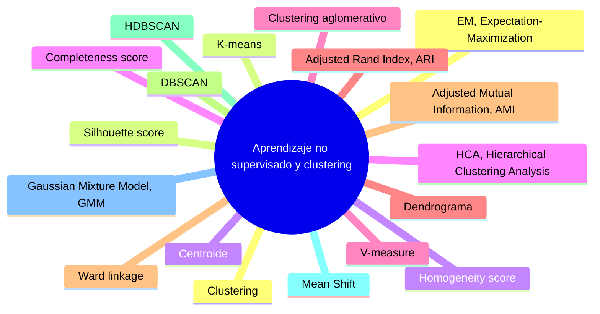
```mermaid
mindmap
  root(("Aprendizaje no supervisado y clustering"))
    Clustering
    K-means
    Centroide
    HCA, Hierarchical Clustering Analysis
    Clustering aglomerativo
    Dendrograma
    Ward linkage
    DBSCAN
    HDBSCAN
    Mean Shift
    Gaussian Mixture Model, GMM
    EM, Expectation-Maximization
    Silhouette score
    Homogeneity score
    Completeness score
    V-measure
    Adjusted Rand Index, ARI
    Adjusted Mutual Information, AMI
```

### Clustering

Agrupamiento de observaciones según similitud, sin usar etiquetas.

### K-means

Algoritmo que particiona los datos en $k$ grupos minimizando la suma de distancias cuadráticas a los centroides.

$$
\min_{C_1,\ldots,C_k}\sum_{j=1}^{k}\sum_{x_i\in C_j}\|x_i-\mu_j\|^2
$$

<Aside type="note">

$C_j$ es el cluster $j$; $k$ es el número de clusters; $x_i$ es una observación; $\mu_j$ es el centroide del cluster $j$; $\|x_i-\mu_j\|^2$ es la distancia euclidiana al cuadrado.

</Aside>

### Centroide

Punto promedio que representa el centro de un cluster en algoritmos como K-means.

### HCA, Hierarchical Clustering Analysis

Análisis de clustering jerárquico. Construye una jerarquía de grupos mediante fusiones sucesivas o divisiones sucesivas.

### Clustering aglomerativo

Método jerárquico que comienza con cada observación como un cluster individual y va fusionando clusters.

### Dendrograma

Diagrama en forma de árbol que muestra cómo se fusionan clusters en un clustering jerárquico.

### Ward linkage

Criterio de fusión jerárquica que minimiza el aumento de varianza dentro de clusters.

### DBSCAN

Density-Based Spatial Clustering of Applications with Noise. Agrupa puntos densamente conectados y marca puntos aislados como ruido.

### HDBSCAN

Extensión jerárquica de DBSCAN que maneja densidades variables y puede encontrar clusters de forma más flexible.

### Mean Shift

Algoritmo de clustering que busca modos de densidad desplazando puntos hacia regiones de mayor concentración.

### Gaussian Mixture Model, GMM

Modelo probabilístico que representa los datos como mezcla de distribuciones gaussianas.

$$
p(x)=\sum_{k=1}^{K}\pi_k\mathcal{N}(x|\mu_k,\Sigma_k)
$$

<Aside type="note">

$p(x)$ es la densidad de probabilidad del punto $x$; $K$ es el número de componentes; $\pi_k$ es el peso de mezcla del componente $k$; $\mathcal{N}$ es una distribución normal multivariada; $\mu_k$ es la media; $\Sigma_k$ es la matriz de covarianza.

</Aside>

### EM, Expectation-Maximization

Algoritmo iterativo para estimar parámetros en modelos con variables latentes, como GMM.

### Silhouette score

Métrica de calidad de clustering:

$$
s(i)=\frac{b(i)-a(i)}{\max(a(i),b(i))}
$$

<Aside type="note">

$s(i)$ es el valor silhouette para la observación $i$; $a(i)$ es la distancia media entre $i$ y los puntos de su mismo cluster; $b(i)$ es la menor distancia media entre $i$ y puntos de otro cluster.

</Aside>

### Homogeneity score

Métrica que mide si cada cluster contiene principalmente miembros de una sola clase real.

### Completeness score

Métrica que mide si todos los miembros de una clase real caen dentro del mismo cluster.

### V-measure

Media armónica entre homogeneity y completeness.

### Adjusted Rand Index, ARI

Métrica de similitud entre dos particiones, corregida por azar.

### Adjusted Mutual Information, AMI

Métrica basada en información mutua entre dos particiones, ajustada por azar.

---

## 12. Reducción de dimensionalidad

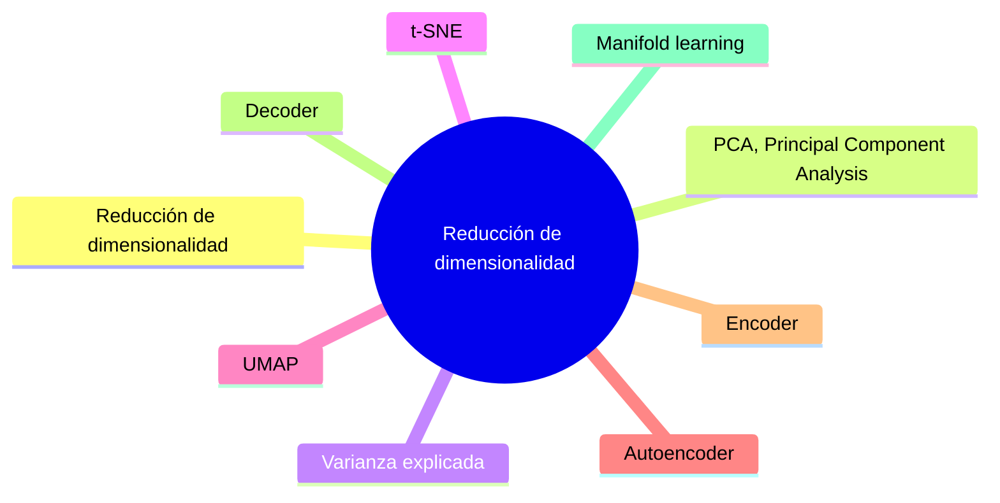
```mermaid
mindmap
  root(("Reducción de dimensionalidad"))
    Reducción de dimensionalidad
    PCA, Principal Component Analysis
    Varianza explicada
    t-SNE
    UMAP
    Autoencoder
    Encoder
    Decoder
    Manifold learning
```

### Reducción de dimensionalidad

Proceso de representar datos de alta dimensión en un espacio de menor dimensión conservando información relevante.

### PCA, Principal Component Analysis

Técnica lineal que transforma variables correlacionadas en componentes principales ortogonales que maximizan varianza.

$$
Z = XW
$$

<Aside type="note">

$Z$ es la representación transformada; $X$ es la matriz de datos; $W$ es la matriz de vectores propios o componentes principales.

</Aside>

### Varianza explicada

Proporción de la varianza total capturada por un componente principal.

$$
\operatorname{EVR}_j=\frac{\lambda_j}{\sum_{l=1}^{p}\lambda_l}
$$

<Aside type="note">

$\operatorname{EVR}_j$ es la razón de varianza explicada del componente $j$; $\lambda_j$ es el valor propio asociado con ese componente; $p$ es el número total de componentes.

</Aside>

### t-SNE

t-distributed Stochastic Neighbor Embedding. Técnica no lineal para visualizar datos de alta dimensión en 2D o 3D, preservando vecindades locales.

### UMAP

Uniform Manifold Approximation and Projection. Técnica no lineal de reducción de dimensión basada en geometría de variedades y grafos de vecinos.

### Autoencoder

Red neuronal entrenada para reconstruir su entrada, aprendiendo una representación comprimida en una capa latente.

### Encoder

Parte de un autoencoder o modelo secuencia-a-secuencia que transforma una entrada en una representación latente.

### Decoder

Parte del modelo que reconstruye o genera una salida a partir de una representación latente.

### Manifold learning

Familia de métodos que asume que los datos de alta dimensión se encuentran cerca de una variedad de menor dimensión.

---

## 13. Detección de anomalías

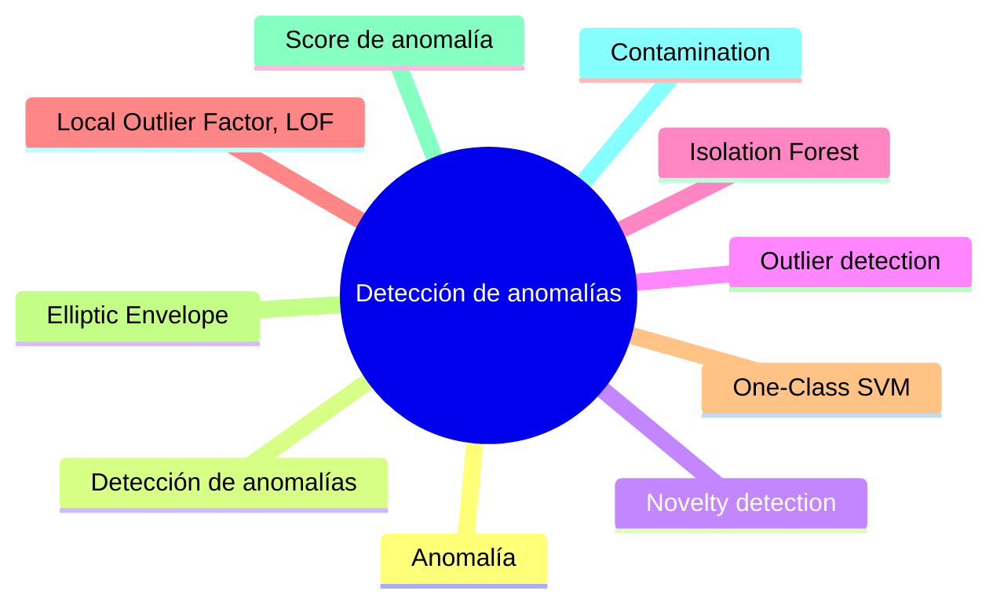
```mermaid
mindmap
  root(("Detección de anomalías"))
    Anomalía
    Detección de anomalías
    Novelty detection
    Outlier detection
    Isolation Forest
    Local Outlier Factor, LOF
    One-Class SVM
    Elliptic Envelope
    Score de anomalía
    Contamination
```

### Anomalía

Observación que se desvía significativamente del patrón esperado. Puede ser fraude, falla, ataque, error de medición o caso raro legítimo.

### Detección de anomalías

Tarea de identificar observaciones raras o inusuales. Puede ser supervisada, no supervisada o semi-supervisada.

### Novelty detection

Identificación de observaciones nuevas que no se parecen a los datos normales usados para entrenamiento.

### Outlier detection

Identificación de puntos extremos dentro del propio conjunto analizado.

### Isolation Forest

Algoritmo que detecta anomalías aislando observaciones mediante particiones aleatorias. Las anomalías suelen requerir menos particiones para ser aisladas.

### Local Outlier Factor, LOF

Método que compara la densidad local de una observación contra la densidad de sus vecinos.

### One-Class SVM

Modelo que aprende una frontera alrededor de los datos normales para detectar puntos fuera de esa región.

### Elliptic Envelope

Método que asume datos aproximadamente gaussianos y detecta puntos fuera de una elipse de alta densidad.

### Score de anomalía

Valor numérico que indica qué tan anómala es una observación. Usualmente, mayor score implica mayor rareza, aunque la convención depende del algoritmo.

### Contamination

Proporción esperada de anomalías en el dataset. Algunos algoritmos la usan para definir umbrales.

---

## 14. Optimización y entrenamiento

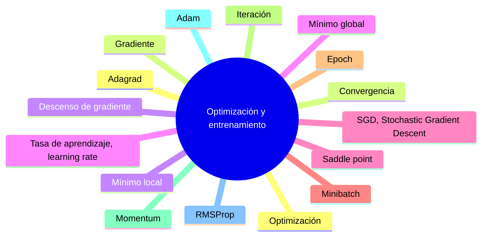
```mermaid
mindmap
  root(("Optimización y entrenamiento"))
    Optimización
    Gradiente
    Descenso de gradiente
    Tasa de aprendizaje, learning rate
    SGD, Stochastic Gradient Descent
    Minibatch
    Epoch
    Iteración
    Momentum
    Adam
    RMSProp
    Adagrad
    Convergencia
    Mínimo local
    Mínimo global
    Saddle point
```

### Optimización

Proceso de encontrar parámetros que minimicen una función de pérdida o maximicen una función objetivo.

### Gradiente

Vector de derivadas parciales que indica la dirección de mayor incremento de una función:

$$
\nabla J(\theta)=\left[\frac{\partial J}{\partial \theta_1},\frac{\partial J}{\partial \theta_2},\ldots,\frac{\partial J}{\partial \theta_p}\right]
$$

<Aside type="note">

$\nabla J(\theta)$ es el gradiente de la función de costo; $\theta_j$ es el parámetro $j$; $\frac{\partial J}{\partial \theta_j}$ es la derivada parcial de $J$ respecto a $\theta_j$.

</Aside>

### Descenso de gradiente

Algoritmo que actualiza parámetros moviéndose en dirección opuesta al gradiente:

$$
\theta := \theta - \alpha \nabla J(\theta)
$$

<Aside type="note">

$\theta$ representa los parámetros; $\alpha$ es la tasa de aprendizaje; $\nabla J(\theta)$ es el gradiente de la función de costo; $:=$ indica actualización del valor.

</Aside>

### Tasa de aprendizaje, learning rate

Hiperparámetro que controla el tamaño de los pasos durante la optimización.

### SGD, Stochastic Gradient Descent

Versión del descenso de gradiente que actualiza parámetros usando una observación o minibatch por iteración.

### Minibatch

Subconjunto pequeño de datos usado para calcular una actualización de parámetros.

### Epoch

Una pasada completa sobre el conjunto de entrenamiento.

### Iteración

Una actualización de parámetros. Una época puede contener muchas iteraciones si se usan minibatches.

### Momentum

Técnica que acumula dirección de actualizaciones pasadas para acelerar convergencia y reducir oscilaciones.

### Adam

Adaptive Moment Estimation. Optimizador que combina momentum y adaptación individual de tasas de aprendizaje por parámetro.

### RMSProp

Optimizador adaptativo que escala actualizaciones usando una media móvil de gradientes cuadrados.

### Adagrad

Optimizador que adapta la tasa de aprendizaje acumulando gradientes históricos por parámetro.

### Convergencia

Situación en la que el entrenamiento se estabiliza y la función de pérdida deja de mejorar significativamente.

### Mínimo local

Punto donde la función es menor que en su vecindad, aunque no necesariamente sea el menor valor global.

### Mínimo global

Punto con el menor valor posible de la función objetivo.

### Saddle point

Punto donde el gradiente puede ser cero, pero no corresponde a máximo ni mínimo local.

---

## 15. Redes neuronales y aprendizaje profundo

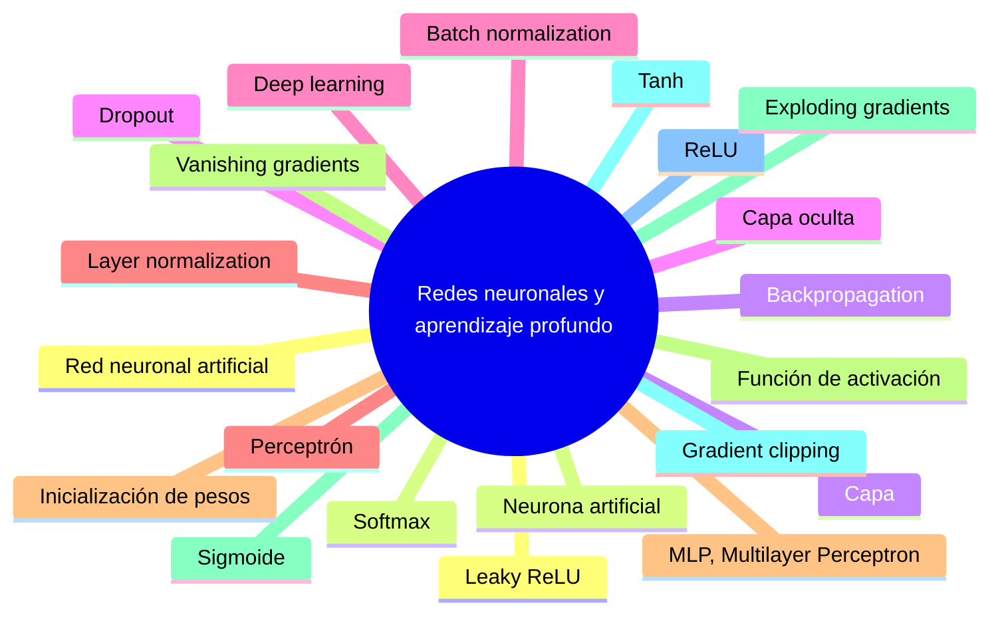
```mermaid
mindmap
  root(("Redes neuronales y aprendizaje profundo"))
    Red neuronal artificial
    Neurona artificial
    Capa
    Capa oculta
    Deep learning
    Perceptrón
    MLP, Multilayer Perceptron
    Función de activación
    Sigmoide
    Tanh
    ReLU
    Leaky ReLU
    Softmax
    Backpropagation
    Dropout
    Batch normalization
    Layer normalization
    Inicialización de pesos
    Vanishing gradients
    Exploding gradients
    Gradient clipping
```

### Red neuronal artificial

Modelo compuesto por capas de unidades llamadas neuronas artificiales, conectadas mediante pesos entrenables.

### Neurona artificial

Unidad que calcula una combinación de entradas y aplica una función de activación:

$$
a = \phi(w^Tx+b)
$$

<Aside type="note">

$a$ es la activación de la neurona; $\phi$ es la función de activación; $w$ es el vector de pesos; $x$ es el vector de entrada; $b$ es el sesgo.

</Aside>

### Capa

Conjunto de neuronas que procesan representaciones. Puede ser de entrada, oculta o salida.

### Capa oculta

Capa intermedia entre entrada y salida donde el modelo aprende representaciones internas.

### Deep learning

Aprendizaje automático basado en redes neuronales con múltiples capas capaces de aprender representaciones jerárquicas.

### Perceptrón

Modelo neuronal básico para clasificación lineal.

### MLP, Multilayer Perceptron

Red neuronal feedforward con una o más capas ocultas densamente conectadas.

### Función de activación

Función no lineal que permite a una red neuronal aprender relaciones complejas.

### Sigmoide

Función de activación que comprime valores al intervalo $(0,1)$:

$$
\sigma(x)=\frac{1}{1+e^{-x}}
$$

<Aside type="note">

$\sigma(x)$ es la salida sigmoide; $x$ es la entrada; $e$ es la constante de Euler.

</Aside>

### Tanh

Función hiperbólica que produce valores entre $-1$ y $1$.

### ReLU

Rectified Linear Unit:

$$
\operatorname{ReLU}(x)=\max(0,x)
$$

<Aside type="note">

$x$ es la entrada; la función devuelve $0$ si $x$ es negativo y $x$ si es positivo.

</Aside>

### Leaky ReLU

Variante de ReLU que permite una pequeña pendiente para valores negativos, reduciendo el problema de neuronas muertas.

### Softmax

Función que convierte logits en probabilidades multiclase:

$$
\operatorname{softmax}(z_i)=\frac{e^{z_i}}{\sum_{j=1}^{K}e^{z_j}}
$$

<Aside type="note">

$z_i$ es el logit de la clase $i$; $K$ es el número de clases; $e^{z_i}$ convierte el logit en valor positivo; el denominador normaliza para que las probabilidades sumen $1$.

</Aside>

### Backpropagation

Algoritmo para calcular gradientes en redes neuronales aplicando la regla de la cadena desde la salida hacia las capas anteriores.

### Dropout

Regularización que desactiva aleatoriamente neuronas durante el entrenamiento para reducir sobreajuste.

### Batch normalization

Técnica que normaliza activaciones dentro de minibatches para estabilizar y acelerar el entrenamiento.

### Layer normalization

Normalización aplicada sobre las características de una misma observación, común en transformers.

### Inicialización de pesos

Método para asignar valores iniciales a parámetros de una red. Buenas inicializaciones ayudan a evitar gradientes inestables.

### Vanishing gradients

Problema donde los gradientes se vuelven muy pequeños al propagarse hacia capas tempranas, dificultando el aprendizaje.

### Exploding gradients

Problema donde los gradientes crecen excesivamente, causando actualizaciones inestables.

### Gradient clipping

Técnica que limita el tamaño de los gradientes para evitar explosiones durante el entrenamiento.

---

## 16. Arquitecturas de aprendizaje profundo

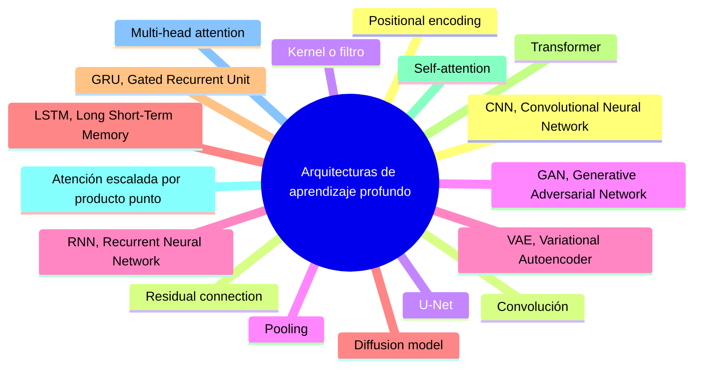
```mermaid
mindmap
  root(("Arquitecturas de aprendizaje profundo"))
    CNN, Convolutional Neural Network
    Convolución
    Kernel o filtro
    Pooling
    RNN, Recurrent Neural Network
    LSTM, Long Short-Term Memory
    GRU, Gated Recurrent Unit
    Transformer
    Self-attention
    Atención escalada por producto punto
    Multi-head attention
    Positional encoding
    Residual connection
    U-Net
    GAN, Generative Adversarial Network
    VAE, Variational Autoencoder
    Diffusion model
```

### CNN, Convolutional Neural Network

Red neuronal convolucional usada principalmente en imágenes, señales y datos con estructura espacial.

### Convolución

Operación que aplica filtros sobre una entrada para detectar patrones locales.

### Kernel o filtro

Matriz pequeña de pesos que se desliza sobre una entrada en una convolución.

### Pooling

Operación que reduce resolución espacial agregando valores locales, por ejemplo max pooling o average pooling.

### RNN, Recurrent Neural Network

Red diseñada para secuencias, con conexiones recurrentes que mantienen estado temporal.

### LSTM, Long Short-Term Memory

Tipo de RNN con compuertas que ayuda a modelar dependencias largas.

### GRU, Gated Recurrent Unit

Variante de RNN con compuertas más simple que LSTM.

### Transformer

Arquitectura basada en mecanismos de atención, altamente paralelizable, dominante en modelos modernos de lenguaje y visión.

### Self-attention

Mecanismo por el cual cada token atiende a otros tokens de la misma secuencia.

### Atención escalada por producto punto

$$
\operatorname{Attention}(Q,K,V)=\operatorname{softmax}\left(\frac{QK^T}{\sqrt{d_k}}\right)V
$$

<Aside type="note">

$Q$ es la matriz de consultas; $K$ es la matriz de claves; $V$ es la matriz de valores; $K^T$ es la transpuesta de $K$; $d_k$ es la dimensión de las claves; $\sqrt{d_k}$ escala el producto punto para estabilizar los gradientes.

</Aside>

### Multi-head attention

Mecanismo que ejecuta varias atenciones en paralelo para capturar distintos tipos de relaciones.

### Positional encoding

Información añadida a embeddings para representar el orden de tokens en modelos sin recurrencia, como transformers.

### Residual connection

Conexión que suma la entrada de una capa a su salida para facilitar entrenamiento de redes profundas.

### U-Net

Arquitectura encoder-decoder con conexiones laterales, popular en segmentación de imágenes.

### GAN, Generative Adversarial Network

Arquitectura generativa compuesta por un generador y un discriminador que compiten durante el entrenamiento.

### VAE, Variational Autoencoder

Autoencoder generativo que aprende una distribución latente regularizada.

### Diffusion model

Modelo generativo que aprende a revertir un proceso gradual de ruido, usado en generación de imágenes, audio y otros datos.

---

## 17. Modelos de lenguaje y NLP

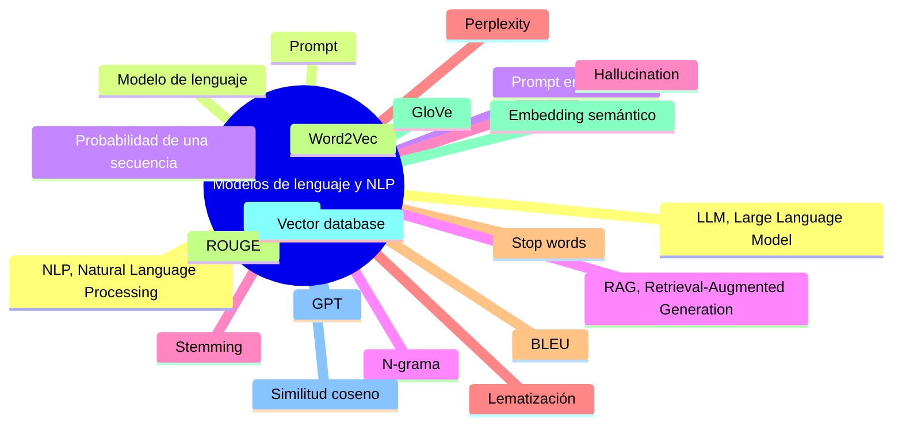
```mermaid
mindmap
  root(("Modelos de lenguaje y NLP"))
    NLP, Natural Language Processing
    Modelo de lenguaje
    Probabilidad de una secuencia
    N-grama
    Stemming
    Lematización
    Stop words
    Word2Vec
    GloVe
    BERT
    GPT
    LLM, Large Language Model
    Prompt
    Prompt engineering
    RAG, Retrieval-Augmented Generation
    Hallucination
    Perplexity
    BLEU
    ROUGE
    Embedding semántico
    Vector database
    Similitud coseno
```

### NLP, Natural Language Processing

Área que estudia el procesamiento computacional del lenguaje natural.

### Modelo de lenguaje

Modelo que asigna probabilidades a secuencias de tokens o genera texto token por token.

### Probabilidad de una secuencia

$$
P(w_1,\ldots,w_n)=\prod_{i=1}^{n}P(w_i|w_1,\ldots,w_{i-1})
$$

<Aside type="note">

$w_i$ es el token en la posición $i$; $n$ es la longitud de la secuencia; $P(w_i|w_1,\ldots,w_{i-1})$ es la probabilidad del token actual dado el contexto previo.

</Aside>

### N-grama

Secuencia contigua de $n$ tokens. Un bigrama tiene dos tokens; un trigrama tiene tres.

### Stemming

Reducción de palabras a una raíz aproximada, por ejemplo `corriendo` a `corr`.

### Lematización

Reducción de palabras a su forma canónica o lema, por ejemplo `corriendo` a `correr`.

### Stop words

Palabras frecuentes que a veces se eliminan en procesamiento textual, como artículos o preposiciones. En algunos modelos modernos no se eliminan porque también aportan contexto.

### Word2Vec

Familia de métodos para aprender embeddings de palabras mediante tareas predictivas como CBOW o Skip-gram.

### GloVe

Modelo de embeddings basado en estadísticas globales de coocurrencia de palabras.

### BERT

Bidirectional Encoder Representations from Transformers. Modelo basado en transformer encoder, entrenado con objetivos como masked language modeling.

### GPT

Generative Pre-trained Transformer. Familia de modelos autoregresivos que predicen el siguiente token.

### LLM, Large Language Model

Modelo de lenguaje de gran escala entrenado con grandes cantidades de texto y capacidad para generación, razonamiento aproximado, traducción, resumen, extracción y asistencia conversacional.

### Prompt

Instrucción o entrada textual dada a un modelo generativo para guiar su salida.

### Prompt engineering

Diseño de instrucciones, contexto, ejemplos y restricciones para obtener mejores respuestas de modelos generativos.

### RAG, Retrieval-Augmented Generation

Arquitectura que combina recuperación de documentos con generación de texto. El modelo responde usando contexto recuperado desde una base externa.

### Hallucination

Generación de información falsa, no sustentada o inventada por un modelo generativo.

### Perplexity

Métrica usada en modelos de lenguaje:

$$
\operatorname{PPL}=\exp\left(-\frac{1}{N}\sum_{i=1}^{N}\log P(w_i|w_{<i})\right)
$$

<Aside type="note">

$\operatorname{PPL}$ es la perplejidad; $N$ es el número de tokens; $w_i$ es el token actual; $w_{<i}$ representa los tokens anteriores; $P(w_i|w_{<i})$ es la probabilidad asignada por el modelo.

</Aside>

### BLEU

Métrica automática para evaluar traducción mediante coincidencia de n-gramas con referencias.

### ROUGE

Familia de métricas usadas principalmente para evaluar resúmenes comparándolos con referencias.

### Embedding semántico

Vector que representa significado de texto, documento, imagen u otra entidad para comparar similitud o hacer búsqueda semántica.

### Vector database

Base de datos optimizada para almacenar embeddings y realizar búsqueda por similitud.

### Similitud coseno

Métrica de similitud entre vectores:

$$
\cos(\theta)=\frac{a\cdot b}{\|a\|\|b\|}
$$

<Aside type="note">

$a$ y $b$ son vectores; $a\cdot b$ es su producto punto; $\|a\|$ y $\|b\|$ son sus normas; $\theta$ es el ángulo entre ambos vectores.

</Aside>

---

## 18. Aprendizaje por refuerzo

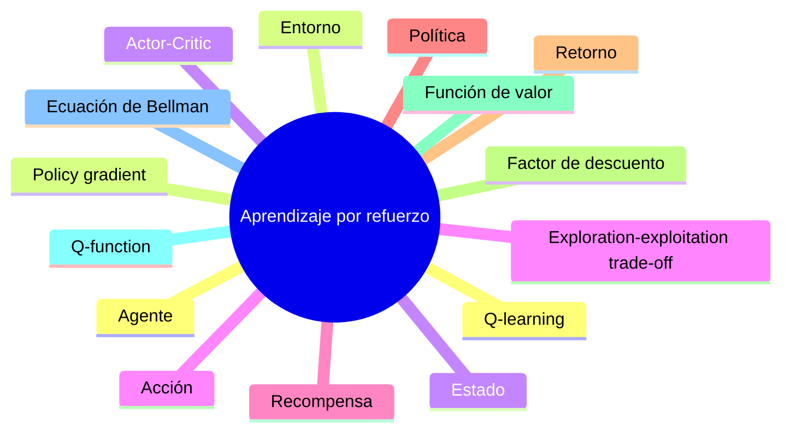
```mermaid
mindmap
  root(("Aprendizaje por refuerzo"))
    Agente
    Entorno
    Estado
    Acción
    Recompensa
    Política
    Retorno
    Factor de descuento
    Función de valor
    Q-function
    Ecuación de Bellman
    Q-learning
    Policy gradient
    Actor-Critic
    Exploration-exploitation trade-off
```

### Agente

Entidad que toma acciones en un entorno para maximizar recompensas.

### Entorno

Sistema con el que interactúa el agente. Recibe acciones y devuelve estados, recompensas y señales de terminación.

### Estado

Representación de la situación actual del entorno.

### Acción

Decisión tomada por el agente en un estado.

### Recompensa

Señal numérica que indica qué tan buena fue una acción o transición.

### Política

Función que define qué acción tomar en cada estado:

$$
\pi(a|s)=P(A=a|S=s)
$$

<Aside type="note">

$\pi(a|s)$ es la probabilidad de tomar la acción $a$ dado el estado $s$; $A$ es la variable aleatoria de acción; $S$ es la variable aleatoria de estado.

</Aside>

### Retorno

Suma descontada de recompensas futuras:

$$
G_t=\sum_{k=0}^{\infty}\gamma^k R_{t+k+1}
$$

<Aside type="note">

$G_t$ es el retorno desde el tiempo $t$; $\gamma$ es el factor de descuento; $R_{t+k+1}$ es la recompensa futura en el paso correspondiente; $k$ indexa pasos futuros.

</Aside>

### Factor de descuento

Valor $\gamma \in [0,1]$ que controla la importancia de recompensas futuras.

### Función de valor

Estimación del retorno esperado desde un estado bajo una política:

$$
V^{\pi}(s)=\mathbb{E}_{\pi}[G_t|S_t=s]
$$

<Aside type="note">

$V^{\pi}(s)$ es el valor del estado $s$ bajo la política $\pi$; $\mathbb{E}_{\pi}$ es la esperanza siguiendo la política; $G_t$ es el retorno; $S_t$ es el estado en el tiempo $t$.

</Aside>

### Q-function

Valor esperado de tomar una acción en un estado y luego seguir una política:

$$
Q^{\pi}(s,a)=\mathbb{E}_{\pi}[G_t|S_t=s,A_t=a]
$$

<Aside type="note">

$Q^{\pi}(s,a)$ es el valor de acción; $s$ es el estado; $a$ es la acción; $G_t$ es el retorno esperado; $\pi$ es la política seguida después de la acción inicial.

</Aside>

### Ecuación de Bellman

Relación recursiva para funciones de valor:

$$
V^{\pi}(s)=\mathbb{E}_{\pi}[R_{t+1}+\gamma V^{\pi}(S_{t+1})|S_t=s]
$$

<Aside type="note">

$V^{\pi}(s)$ es el valor actual; $R_{t+1}$ es la recompensa inmediata; $\gamma$ es el factor de descuento; $S_{t+1}$ es el siguiente estado; la esperanza se toma bajo la política $\pi$.

</Aside>

### Q-learning

Algoritmo off-policy que aprende valores de acción óptimos:

$$
Q(s,a) \leftarrow Q(s,a)+\alpha\left[r+\gamma\max_{a'}Q(s',a')-Q(s,a)\right]
$$

<Aside type="note">

$Q(s,a)$ es el valor actual de tomar acción $a$ en estado $s$; $\alpha$ es la tasa de aprendizaje; $r$ es la recompensa recibida; $\gamma$ es el factor de descuento; $s'$ es el nuevo estado; $a'$ recorre acciones posibles en $s'$.

</Aside>

### Policy gradient

Familia de métodos que optimizan directamente los parámetros de una política.

### Actor-Critic

Arquitectura de RL con un actor que aprende la política y un crítico que estima valores.

### Exploration-exploitation trade-off

Dilema entre explorar acciones nuevas para obtener información y explotar acciones conocidas que dan buena recompensa.

---

## 19. Probabilidad, estadística e inferencia

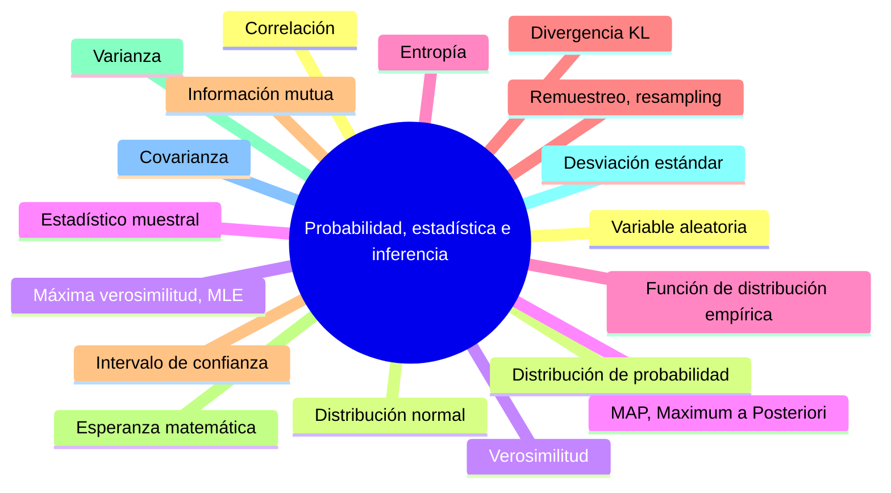
```mermaid
mindmap
  root(("Probabilidad, estadística e inferencia"))
    Variable aleatoria
    Distribución de probabilidad
    Verosimilitud
    Estadístico muestral
    Función de distribución empírica
    Remuestreo, resampling
    Intervalo de confianza
    Esperanza matemática
    Varianza
    Desviación estándar
    Covarianza
    Correlación
    Distribución normal
    Máxima verosimilitud, MLE
    MAP, Maximum a Posteriori
    Entropía
    Divergencia KL
    Información mutua
```

### Variable aleatoria

Variable cuyo valor depende de un resultado aleatorio.

### Distribución de probabilidad

Función que describe la probabilidad de posibles valores de una variable aleatoria.

### Verosimilitud

Función de los parámetros que mide qué tan compatibles son los datos observados con un modelo probabilístico dado.

### Estadístico muestral

Cantidad calculada a partir de una muestra, como la media, la varianza o la mediana, usada para inferir propiedades de la población.

### Función de distribución empírica

Estimación no paramétrica de la distribución acumulada construida directamente con los datos observados.

### Remuestreo, resampling

Conjunto de técnicas que generan nuevas muestras a partir de un dataset para estimar incertidumbre, error o estabilidad de un modelo.

### Intervalo de confianza

Rango de valores plausibles para un parámetro poblacional, asociado a un nivel de confianza especificado.

### Esperanza matemática

Valor promedio esperado de una variable aleatoria:

$$
\mathbb{E}[X]=\sum_x xP(X=x)
$$

<Aside type="note">

$\mathbb{E}[X]$ es la esperanza de $X$; $x$ son los valores posibles; $P(X=x)$ es la probabilidad de cada valor. Para variables continuas se usa una integral.

</Aside>

### Varianza

Medida de dispersión respecto a la media:

$$
\operatorname{Var}(X)=\mathbb{E}[(X-\mu)^2]
$$

<Aside type="note">

$\operatorname{Var}(X)$ es la varianza; $X$ es la variable aleatoria; $\mu$ es su media; $\mathbb{E}$ indica esperanza matemática.

</Aside>

### Desviación estándar

Raíz cuadrada de la varianza. Mide dispersión en la misma unidad que la variable.

### Covarianza

Medida de variación conjunta entre dos variables:

$$
\operatorname{Cov}(X,Y)=\mathbb{E}[(X-\mu_X)(Y-\mu_Y)]
$$

<Aside type="note">

$X$ y $Y$ son variables aleatorias; $\mu_X$ y $\mu_Y$ son sus medias; $\mathbb{E}$ es esperanza matemática.

</Aside>

### Correlación

Covarianza normalizada entre dos variables:

$$
\rho_{X,Y}=\frac{\operatorname{Cov}(X,Y)}{\sigma_X\sigma_Y}
$$

<Aside type="note">

$\rho_{X,Y}$ es la correlación; $\operatorname{Cov}(X,Y)$ es la covarianza; $\sigma_X$ y $\sigma_Y$ son las desviaciones estándar de $X$ e $Y$.

</Aside>

### Distribución normal

Distribución continua con forma de campana:

$$
f(x)=\frac{1}{\sigma\sqrt{2\pi}}e^{-\frac{1}{2}\left(\frac{x-\mu}{\sigma}\right)^2}
$$

<Aside type="note">

$f(x)$ es la densidad en $x$; $\mu$ es la media; $\sigma$ es la desviación estándar; $\pi$ es la constante pi; $e$ es la constante de Euler.

</Aside>

### Máxima verosimilitud, MLE

Método para estimar parámetros maximizando la probabilidad de observar los datos:

$$
\hat{\theta}=\arg\max_{\theta} \prod_{i=1}^{n}p(x_i|\theta)
$$

<Aside type="note">

$\hat{\theta}$ es el estimador de parámetros; $\theta$ son los parámetros posibles; $x_i$ son los datos observados; $p(x_i|\theta)$ es la probabilidad o densidad del dato $x_i$ dado $\theta$.

</Aside>

### MAP, Maximum a Posteriori

Estimación que maximiza la probabilidad posterior incorporando una distribución previa:

$$
\hat{\theta}=\arg\max_{\theta} p(\theta|D)
$$

<Aside type="note">

$\hat{\theta}$ es el estimador MAP; $\theta$ son los parámetros; $D$ son los datos; $p(\theta|D)$ es la distribución posterior de los parámetros dados los datos.

</Aside>

### Entropía

Medida de incertidumbre de una distribución:

$$
H(X)=-\sum_x P(x)\log P(x)
$$

<Aside type="note">

$H(X)$ es la entropía de la variable $X$; $P(x)$ es la probabilidad del valor $x$; $\log$ suele ser logaritmo base 2 o natural, según la convención.

</Aside>

### Divergencia KL

Mide diferencia entre dos distribuciones:

$$
D_{KL}(P\|Q)=\sum_x P(x)\log\frac{P(x)}{Q(x)}
$$

<Aside type="note">

$D_{KL}(P\|Q)$ es la divergencia de Kullback-Leibler de $Q$ respecto a $P$; $P(x)$ y $Q(x)$ son probabilidades asignadas al valor $x$ por dos distribuciones.

</Aside>

### Información mutua

Medida de dependencia entre variables:

$$
I(X;Y)=\sum_{x,y}p(x,y)\log\frac{p(x,y)}{p(x)p(y)}
$$

<Aside type="note">

$I(X;Y)$ es la información mutua; $p(x,y)$ es la probabilidad conjunta; $p(x)$ y $p(y)$ son probabilidades marginales.

</Aside>

---

## 20. Búsqueda de hiperparámetros y selección de modelos

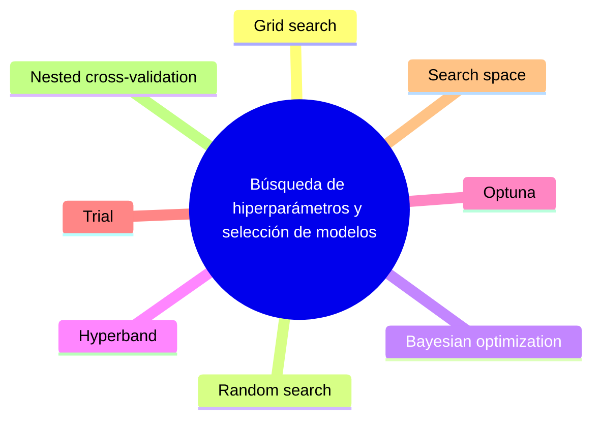
```mermaid
mindmap
  root(("Búsqueda de hiperparámetros y selección de modelos"))
    Grid search
    Random search
    Bayesian optimization
    Hyperband
    Optuna
    Trial
    Search space
    Nested cross-validation
```

### Grid search

Búsqueda exhaustiva sobre una cuadrícula de valores de hiperparámetros.

### Random search

Búsqueda aleatoria de combinaciones de hiperparámetros. Suele ser más eficiente que grid search cuando pocos hiperparámetros dominan el desempeño.

### Bayesian optimization

Búsqueda de hiperparámetros que construye un modelo probabilístico del desempeño y selecciona nuevas pruebas de forma informada.

### Hyperband

Método que asigna recursos adaptativamente a configuraciones prometedoras y descarta rápido las malas.

### Optuna

Framework de optimización de hiperparámetros basado en estudios, trials y estrategias como TPE.

### Trial

Una evaluación específica de una configuración de hiperparámetros.

### Search space

Conjunto de valores posibles para los hiperparámetros a explorar.

### Nested cross-validation

Validación cruzada anidada usada para estimar desempeño mientras se realiza selección de hiperparámetros sin sesgo excesivo.

---

## 21. Interpretabilidad, explicabilidad y diagnóstico

```mermaid
mindmap
  root(("Interpretabilidad, explicabilidad y diagnóstico"))
    Interpretabilidad
    Explicabilidad, XAI
    Importancia de características
    Permutation importance
    SHAP
    LIME
    PDP, Partial Dependence Plot
    ICE, Individual Conditional Expectation
    Calibración
    Reliability diagram
    Brier score
    Error analysis
```

### Interpretabilidad

Grado en que una persona puede entender cómo un modelo toma decisiones.

### Explicabilidad, XAI

Conjunto de métodos para explicar predicciones o comportamiento de modelos complejos.

### Importancia de características

Medida de cuánto contribuye una variable a las predicciones de un modelo.

### Permutation importance

Método que mide la caída en desempeño al permutar aleatoriamente una característica.

### SHAP

SHapley Additive exPlanations. Método basado en valores de Shapley para atribuir contribuciones de variables a predicciones.

### LIME

Local Interpretable Model-agnostic Explanations. Método que aproxima localmente un modelo complejo con un modelo interpretable.

### PDP, Partial Dependence Plot

Gráfico que muestra el efecto promedio de una característica sobre la predicción.

### ICE, Individual Conditional Expectation

Gráfico que muestra cómo cambia la predicción individual al variar una característica.

### Calibración

Propiedad de un clasificador probabilístico donde las probabilidades predichas corresponden a frecuencias observadas.

### Reliability diagram

Gráfico que compara probabilidades predichas con frecuencias reales observadas.

### Brier score

Métrica de calibración probabilística:

$$
\operatorname{Brier}=\frac{1}{n}\sum_{i=1}^{n}(\hat{p}_i-y_i)^2
$$

<Aside type="note">

$n$ es el número de observaciones; $\hat{p}_i$ es la probabilidad predicha; $y_i$ es la etiqueta real binaria.

</Aside>

### Error analysis

Análisis cualitativo y cuantitativo de errores para identificar patrones de fallo del modelo.

---

## 22. Ética, sesgo y confiabilidad

```mermaid
mindmap
  root(("Ética, sesgo y confiabilidad"))
    Fairness
    Sesgo algorítmico
    Variables sensibles
    Proxy variable
    Robustez
    Adversarial example
    Privacidad diferencial
    Model card
    Datasheet for datasets
    Drift
    Data drift
    Concept drift
    Monitoreo de modelo
```

### Fairness

Conjunto de criterios para evaluar si un modelo trata de manera equitativa a distintos grupos.

### Sesgo algorítmico

Patrón sistemático de error o discriminación producido por datos, diseño, supuestos o despliegue del modelo.

### Variables sensibles

Variables relacionadas con atributos protegidos o delicados, como origen étnico, género, religión, salud o situación socioeconómica, según el contexto legal y ético.

### Proxy variable

Variable aparentemente neutra que puede actuar como sustituto de una variable sensible.

### Robustez

Capacidad de un modelo para mantener desempeño ante ruido, perturbaciones, cambios de distribución o ataques.

### Adversarial example

Entrada modificada intencionalmente para inducir una predicción incorrecta.

### Privacidad diferencial

Marco matemático para limitar cuánto puede revelar una salida estadística sobre un individuo.

### Model card

Documento que describe el propósito, datos, limitaciones, evaluación, riesgos y uso recomendado de un modelo.

### Datasheet for datasets

Documento que describe origen, composición, recolección, anotación, usos y limitaciones de un dataset.

### Drift

Cambio en los datos, relaciones o contexto después del despliegue del modelo.

### Data drift

Cambio en la distribución de las variables de entrada.

### Concept drift

Cambio en la relación entre entradas y salida objetivo.

### Monitoreo de modelo

Seguimiento continuo de desempeño, drift, latencia, errores, distribución de datos y comportamiento del sistema en producción.

---

## 23. Sistemas de ML en producción

```mermaid
mindmap
  root(("Sistemas de ML en producción"))
    Feature store
    Model registry
    Serving
    Batch inference
    Online inference
    Latencia
    Throughput
    Canary deployment
    A/B testing
    Shadow deployment
    Reentrenamiento
    Reproducibilidad
    Versionado de datos
    Lineage
```

### Feature store

Sistema para almacenar, versionar y servir características consistentes para entrenamiento e inferencia.

### Model registry

Repositorio donde se versionan modelos, artefactos, métricas y metadatos.

### Serving

Exposición de un modelo para inferencia, mediante API, batch jobs, streaming o integración embebida.

### Batch inference

Generación de predicciones en lotes, por ejemplo cada noche o cada hora.

### Online inference

Predicción en tiempo real o casi real ante solicitudes individuales.

### Latencia

Tiempo que tarda el sistema en producir una predicción.

### Throughput

Cantidad de predicciones o solicitudes procesadas por unidad de tiempo.

### Canary deployment

Despliegue gradual donde una pequeña fracción del tráfico usa el nuevo modelo antes de expandirlo.

### A/B testing

Comparación experimental entre variantes de modelo o sistema usando grupos de usuarios o tráfico.

### Shadow deployment

Ejecución de un nuevo modelo en paralelo sin afectar decisiones reales, para observar su comportamiento.

### Reentrenamiento

Proceso de actualizar un modelo con datos nuevos.

### Reproducibilidad

Capacidad de volver a obtener resultados equivalentes usando mismos datos, código, versiones, semillas y configuración.

### Versionado de datos

Control de versiones aplicado a datasets para rastrear cambios y reproducir experimentos.

### Lineage

Trazabilidad del origen y transformación de datos, características, modelos y predicciones.

---

## 24. Acrónimos frecuentes

### AI

Artificial Intelligence. Inteligencia artificial.

### ML

Machine Learning. Aprendizaje automático.

### DL

Deep Learning. Aprendizaje profundo.

### NLP

Natural Language Processing. Procesamiento de lenguaje natural.

### CV

Computer Vision. Visión por computadora. También puede significar cross-validation según el contexto.

### RL

Reinforcement Learning. Aprendizaje por refuerzo.

### XAI

Explainable Artificial Intelligence. Inteligencia artificial explicable.

### MLOps

Machine Learning Operations. Prácticas operativas para sistemas de ML.

### AutoML

Automated Machine Learning. Automatización del desarrollo de modelos.

### KNN

K-Nearest Neighbors.

### SVM

Support Vector Machine.

### PCA

Principal Component Analysis.

### t-SNE

t-distributed Stochastic Neighbor Embedding.

### UMAP

Uniform Manifold Approximation and Projection.

### CNN

Convolutional Neural Network.

### RNN

Recurrent Neural Network.

### LSTM

Long Short-Term Memory.

### GRU

Gated Recurrent Unit.

### GAN

Generative Adversarial Network.

### VAE

Variational Autoencoder.

### LLM

Large Language Model.

### RAG

Retrieval-Augmented Generation.

### ROC

Receiver Operating Characteristic.

### AUC

Area Under the Curve.

### MAE

Mean Absolute Error.

### MSE

Mean Squared Error.

### RMSE

Root Mean Squared Error.

### MAPE

Mean Absolute Percentage Error.

### MCC

Matthews Correlation Coefficient.

### ARI

Adjusted Rand Index.

### AMI

Adjusted Mutual Information.

### SGD

Stochastic Gradient Descent.

### Adam

Adaptive Moment Estimation.

### EM

Expectation-Maximization.

---

## 25. Ejemplos rápidos de uso conceptual

### Ejemplo: clasificación supervisada

Un banco quiere predecir si una transacción es fraudulenta. Cada transacción tiene características como monto, país, hora, dispositivo y comercio. La etiqueta indica si fue fraude o no. El problema es de clasificación binaria supervisada.

### Ejemplo: regresión

Una inmobiliaria quiere predecir el precio de una casa usando metros cuadrados, ubicación, antigüedad y número de habitaciones. La salida es numérica continua, por lo que el problema es de regresión.

### Ejemplo: clustering

Una tienda quiere segmentar clientes sin etiquetas previas. Usa variables como frecuencia de compra, gasto promedio y categorías visitadas. K-means o clustering jerárquico pueden sugerir grupos de comportamiento.

### Ejemplo: detección de anomalías

Un sistema de monitoreo de servidores quiere identificar patrones raros de CPU, memoria y red. Isolation Forest o LOF pueden señalar observaciones inusuales.

### Ejemplo: aprendizaje por refuerzo

Un robot aprende a navegar una habitación. Recibe recompensa positiva al llegar al objetivo y penalización al chocar. El agente aprende una política de movimiento.

### Ejemplo: RAG

Un asistente técnico responde preguntas sobre documentación interna. Primero recupera fragmentos relevantes desde una base vectorial y luego genera una respuesta usando esos fragmentos como contexto.

---

## 26. Relación entre conceptos clave

- **Datos** alimentan al modelo.
- **Características** representan la información de entrada.
- **Etiquetas** permiten aprendizaje supervisado.
- **Algoritmos** ajustan parámetros.
- **Funciones de pérdida** definen qué significa equivocarse.
- **Optimizadores** minimizan la pérdida.
- **Métricas** evalúan desempeño.
- **Validación** estima generalización.
- **Regularización** reduce sobreajuste.
- **Interpretabilidad** ayuda a entender decisiones.
- **MLOps** permite llevar modelos a producción.

---

## 27. Recomendaciones de estudio

Para estudiar este glosario de forma práctica:

1. Comienza por los conceptos generales: modelo, entrenamiento, inferencia, generalización, pérdida y métrica.
2. Continúa con aprendizaje supervisado: regresión, clasificación y métricas.
3. Pasa a aprendizaje no supervisado: clustering, reducción de dimensionalidad y anomalías.
4. Estudia optimización antes de profundizar en redes neuronales.
5. Revisa NLP, transformers y RAG si tu interés está en modelos de lenguaje.
6. Revisa MLOps, drift, monitoreo y despliegue si tu objetivo es producción.

---

## 28. Resumen final

El aprendizaje automático combina estadística, optimización, programación, teoría de la información, álgebra lineal e ingeniería de software. Sus términos no deben memorizarse de forma aislada: conviene relacionarlos con el flujo completo de trabajo, desde datos crudos hasta modelos desplegados y monitoreados.

Un buen dominio conceptual implica entender:

- qué problema se quiere resolver;
- qué datos están disponibles;
- qué supuestos hace cada modelo;
- qué métrica representa mejor el objetivo real;
- qué errores son aceptables o críticos;
- qué riesgos éticos, operativos y técnicos aparecen al desplegar el sistema.

---

## 29. Bibliografía

### Fundamentos de ML y estadística

- Bishop, C. M. (2006). *Pattern recognition and machine learning*. Springer. https://link.springer.com/book/10.1007/978-0-387-45528-0
- Hastie, T., Tibshirani, R., & Friedman, J. (2009). *The elements of statistical learning* (2nd ed.). Springer. https://hastie.su.domains/ElemStatLearn/
- James, G., Witten, D., Hastie, T., & Tibshirani, R. (2023). *An introduction to statistical learning: With applications in Python* (2nd ed.). Springer. https://www.statlearning.com/
- Mitchell, T. M. (1997). *Machine learning*. McGraw-Hill. https://www.cs.cmu.edu/~tom/mlbook.html
- Vapnik, V. N. (1998). *Statistical learning theory*. Wiley. https://archive.org/details/statisticallearn0000vapn
- Kohavi, R. (1995). A study of cross-validation and bootstrap for accuracy estimation and model selection. *Proceedings of the 14th International Joint Conference on Artificial Intelligence (IJCAI)*, 1137-1143. https://www.ijcai.org/Proceedings/95-2/Papers/016.pdf

### Algoritmos clásicos y librerías

- Breiman, L. (2001). Random forests. *Machine Learning, 45*(1), 5-32. https://doi.org/10.1023/A:1010933404324
- Pedregosa, F., Varoquaux, G., Gramfort, A., Michel, V., Thirion, B., Grisel, O., Blondel, M., Prettenhofer, P., Weiss, R., Dubourg, V., Vanderplas, J., Passos, A., Cournapeau, D., Brucher, M., Perrot, M., & Duchesnay, E. (2011). Scikit-learn: Machine learning in Python. *Journal of Machine Learning Research, 12*, 2825-2830. https://jmlr.org/papers/v12/pedregosa11a.html

### Deep learning y optimización

- Cybenko, G. (1989). Approximation by superpositions of a sigmoidal function. *Mathematics of Control, Signals and Systems, 2*(4), 303-314. https://doi.org/10.1007/BF02551274
- Goodfellow, I., Bengio, Y., & Courville, A. (2016). *Deep learning*. MIT Press. https://www.deeplearningbook.org/
- Chollet, F. (2021). *Deep learning with Python* (2nd ed.). Manning. https://www.manning.com/books/deep-learning-with-python-second-edition
- Kingma, D. P., & Ba, J. (2015). Adam: A method for stochastic optimization. *International Conference on Learning Representations (ICLR)*. https://arxiv.org/abs/1412.6980

### NLP y modelos de lenguaje

- Vaswani, A., Shazeer, N., Parmar, N., Uszkoreit, J., Jones, L., Gomez, A. N., Kaiser, Ł., & Polosukhin, I. (2017). Attention is all you need. *Advances in Neural Information Processing Systems, 30*. https://arxiv.org/abs/1706.03762
- Devlin, J., Chang, M.-W., Lee, K., & Toutanova, K. (2019). BERT: Pre-training of deep bidirectional transformers for language understanding. *Proceedings of NAACL-HLT 2019*, 4171-4186. https://arxiv.org/abs/1810.04805

### Interpretabilidad y explicabilidad

- Molnar, C. (2024). *Interpretable machine learning* (3rd ed.). https://christophm.github.io/interpretable-ml-book/
- Lundberg, S. M., & Lee, S.-I. (2017). A unified approach to interpreting model predictions. *Advances in Neural Information Processing Systems, 30*. https://arxiv.org/abs/1705.07874
- Selvaraju, R. R., Cogswell, M., Das, A., Vedantam, R., Parikh, D., & Batra, D. (2017). Grad-CAM: Visual explanations from deep networks via gradient-based localization. *Proceedings of the IEEE International Conference on Computer Vision (ICCV)*, 618-626. https://arxiv.org/abs/1610.02391

### Aprendizaje por refuerzo e IA general

- Silver, D., Huang, A., Maddison, C. J., Guez, A., Sifre, L., van den Driessche, G., Schrittwieser, J., Antonoglou, I., Panneershelvam, V., Lanctot, M., Dieleman, S., Grewe, D., Nham, J., Kalchbrenner, N., Sutskever, I., Lillicrap, T., Leach, M., Kavukcuoglu, K., Graepel, T., & Hassabis, D. (2016). Mastering the game of Go with deep neural networks and tree search. *Nature, 529*(7587), 484-489. https://doi.org/10.1038/nature16961
- Russell, S., & Norvig, P. (2021). *Artificial intelligence: A modern approach* (4th ed.). Pearson. https://aima.cs.berkeley.edu/

---

## Apéndice

### Mapa integrador del flujo de ML

```mermaid
mindmap
  root(("Resumen final"))
    Problema y objetivo
      Tipo de tarea
        Clasificación
        Regresión
        Clustering
        Detección de anomalías
      Criterio de éxito
        Métricas de clasificación
        Métricas de regresión
    Datos
      Calidad de datos
        Limpieza
        Imputación
        Escalado
      Representación
        Features
        Embeddings
        Reducción de dimensionalidad
      Partición
        Train
        Validación
        Test
    Modelado
      Algoritmos clásicos
        Regresión lineal/logística
        Árboles y Random Forest
        SVM
        Naive Bayes
      Deep learning
        MLP
        CNN
        RNN/LSTM/GRU
        Transformer
      Ensambles
        Bagging
        Boosting
        Stacking
    Optimización
      Loss function
      Descenso de gradiente
      Regularización
      Búsqueda de hiperparámetros
    Evaluación y diagnóstico
      Generalización
      Sobreajuste/Subajuste
      Error analysis
      Interpretabilidad/XAI
    Producción
      Serving
      Monitoreo
      Drift
      Reentrenamiento
    Gobernanza
      Fairness
      Privacidad
      Robustez
      Reproducibilidad
```

### Mapa de relaciones y trade-offs

```mermaid
mindmap
  root(("Relaciones clave de decisión"))
    Datos limitados
      Transfer learning
      Few-shot
      Data augmentation
    Clases desbalanceadas
      Recall/Precision
      F1
      Balanced accuracy
      SMOTE
    Modelo complejo
      Mayor capacidad
      Riesgo de overfitting
      Regularización
      Early stopping
    Interpretabilidad vs desempeño
      Modelos lineales/árboles
      SHAP/LIME
      Ensambles/Deep learning
    Entrenamiento vs inferencia
      Batch vs online
      Latencia/throughput
      Costo computacional
    Cambios en producción
      Data drift
      Concept drift
      Monitoreo continuo
      Reentrenamiento
```
