## Introducción

Este documento es una guía de referencia para Razonamiento y Planificación
Automática. Las entradas están organizadas temáticamente, no alfabéticamente,
para facilitar la lectura secuencial. Cada término incluye una definición
formal y una explicación intuitiva con ejemplos.

La forma más eficiente de estudiar es leer secuencialmente las secciones 1-13
para construir un mapa conceptual técnico, complementarlo con la sección 14
para entender los fundamentos filosóficos del campo, y luego usar la sección 15
como referencia rápida durante ejercicios. Cuando aparezca un término que no
recuerdes, busca primero en la sección temática donde sea más natural y, si no,
en el índice alfabético final.

---

## Tabla de contenido

- [1. Fundamentos: toma de decisiones y agentes inteligentes](#1-fundamentos-toma-de-decisiones-y-agentes-inteligentes)
  - [Toma de decisiones](#toma-de-decisiones)
  - [Decisión de alto nivel vs. decisión de bajo nivel](#decision-de-alto-nivel-vs-decision-de-bajo-nivel)
  - [Decisiones programadas vs. no programadas](#decisiones-programadas-vs-no-programadas)
  - [Problema estructurado vs. no estructurado](#problema-estructurado-vs-no-estructurado)
  - [Agente inteligente](#agente-inteligente)
  - [Racionalidad](#racionalidad)
  - [Arquitectura deliberativa](#arquitectura-deliberativa)
  - [Arquitectura reactiva](#arquitectura-reactiva)
  - [Arquitectura híbrida](#arquitectura-hibrida)
  - [Modelo BDI (Belief–Desire–Intention)](#modelo-bdi)
- [2. Representación del conocimiento](#2-representacion-del-conocimiento)
  - [Representación simbólica](#representacion-simbolica)
  - [Marcos (Frames)](#marcos)
  - [Reglas de producción](#reglas-de-produccion)
  - [Restricciones (CSP)](#restricciones)
  - [Red bayesiana](#red-bayesiana)
  - [Ontología](#ontologia)
  - [Grafo de conocimiento (Knowledge Graph)](#grafo-de-conocimiento)
  - [Conocimiento declarativo vs. procedural](#conocimiento-declarativo-vs-procedural)
- [3. Tipos de razonamiento](#3-tipos-de-razonamiento)
  - [Razonamiento deductivo](#razonamiento-deductivo)
  - [Razonamiento inductivo](#razonamiento-inductivo)
  - [Razonamiento abductivo](#razonamiento-abductivo)
  - [Silogismo](#silogismo)
  - [Modus ponens](#modus-ponens)
  - [Modus tollens](#modus-tollens)
  - [Razonamiento por analogía](#razonamiento-por-analogia)
  - [Razonamiento monótono vs. no monótono](#razonamiento-monotono-vs-no-monotono)
  - [Razonamiento por defecto](#razonamiento-por-defecto)
- [4. Tipos de lógica](#4-tipos-de-logica)
  - [Lógica proposicional](#logica-proposicional)
  - [Lógica de predicados](#logica-de-predicados)
  - [Lógica de primer orden (FOL)](#logica-de-primer-orden)
  - [Lógica de orden superior (HOL)](#logica-de-orden-superior)
  - [Lógica modal](#logica-modal)
  - [Lógica temporal](#logica-temporal)
  - [Lógica multivaluada](#logica-multivaluada)
  - [Lógica difusa (Fuzzy Logic)](#logica-difusa)
  - [Lógica de descripción ALC](#logica-de-descripcion-alc)
  - [Lógica computacional](#logica-computacional)
  - [Sintaxis vs. semántica](#sintaxis-vs-semantica)
- [5. Búsqueda no informada](#5-busqueda-no-informada)
  - [Espacio de estados](#espacio-de-estados)
  - [Árbol de búsqueda](#arbol-de-busqueda)
  - [Frontera (lista de abiertos)](#frontera)
  - [Factor de ramificación](#factor-de-ramificacion)
  - [Búsqueda en amplitud (BFS)](#busqueda-en-amplitud)
  - [Búsqueda en profundidad (DFS)](#busqueda-en-profundidad)
  - [Búsqueda de coste uniforme (UCS)](#busqueda-de-coste-uniforme)
  - [Búsqueda en profundidad iterativa (IDS)](#busqueda-en-profundidad-iterativa)
  - [Búsqueda bidireccional](#busqueda-bidireccional)
  - [Algoritmo de Dijkstra](#algoritmo-de-dijkstra)
  - [Completitud y optimalidad](#completitud-y-optimalidad)
  - [Estados repetidos](#estados-repetidos)
- [6. Heurística y búsqueda informada](#6-heuristica-y-busqueda-informada)
  - [Función heurística](#funcion-heuristica)
  - [Heurística admisible](#heuristica-admisible)
  - [Heurística consistente (monótona)](#heuristica-consistente)
  - [Heurística dominante](#heuristica-dominante)
  - [Búsqueda voraz primero el mejor (Greedy Best-First)](#busqueda-voraz-primero-el-mejor)
  - [Búsqueda A*](#busqueda-a)
  - [IDA* (Iterative Deepening A*)](#ida)
  - [Búsqueda por subobjetivos (subgoaling)](#busqueda-por-subobjetivos)
  - [Búsqueda por ascenso de colinas (Hill Climbing)](#busqueda-por-ascenso-de-colinas)
  - [Búsqueda con horizonte](#busqueda-con-horizonte)
  - [Recocido simulado (Simulated Annealing)](#recocido-simulado)
  - [Búsqueda tabú](#busqueda-tabu)
  - [Búsqueda local iterada (ILS)](#busqueda-local-iterada)
  - [Búsqueda online](#busqueda-online)
  - [Algoritmos genéticos](#algoritmos-geneticos)
- [7. Búsqueda adversarial (teoría de juegos)](#7-busqueda-adversarial)
  - [Juego de suma cero](#juego-de-suma-cero)
  - [Información perfecta vs. imperfecta](#informacion-perfecta-vs-imperfecta)
  - [Determinista vs. estocástico](#determinista-vs-estocastico)
  - [Algoritmo Minimax](#algoritmo-minimax)
  - [Poda alfa-beta](#poda-alfa-beta)
  - [Función de evaluación](#funcion-de-evaluacion)
  - [Búsqueda expectiminimax](#busqueda-expectiminimax)
  - [Equilibrio de Nash](#equilibrio-de-nash)
  - [Monte Carlo Tree Search (MCTS)](#monte-carlo-tree-search)
- [8. Planificación clásica](#8-planificacion-clasica)
  - [Problema de planificación](#problema-de-planificacion)
  - [Plan](#plan)
  - [Estado](#estado)
  - [Acción / operador](#accion-operador)
  - [Precondiciones](#precondiciones)
  - [Efectos](#efectos)
  - [Hipótesis del mundo cerrado (CWA)](#hipotesis-del-mundo-cerrado)
  - [Mutex (mutual exclusion)](#mutex)
  - [Anomalía de Sussman](#anomalia-de-sussman)
  - [Planificación hacia adelante (forward / progression)](#planificacion-hacia-adelante)
  - [Planificación hacia atrás (backward / regression)](#planificacion-hacia-atras)
  - [Planificación de orden total](#planificacion-de-orden-total)
  - [Planificación de orden parcial (POP)](#planificacion-de-orden-parcial)
  - [Planificación deliberativa vs. reactiva](#planificacion-deliberativa-vs-reactiva)
  - [Planificación con incertidumbre](#planificacion-con-incertidumbre)
  - [Planificación generalizada](#planificacion-generalizada)
- [9. Lenguajes y planificadores](#9-lenguajes-y-planificadores)
  - [STRIPS](#strips)
  - [PDDL (Planning Domain Definition Language)](#pddl)
  - [ADL (Action Description Language)](#adl)
  - [Fluents](#fluents)
  - [GOAP (Goal-Oriented Action Planning)](#goap)
  - [FF (Fast-Forward)](#ff)
  - [LAMA](#lama)
  - [Fast Downward](#fast-downward)
  - [Graphplan](#graphplan)
  - [SHOP / SHOP2 / JSHOP](#shop-shop2-jshop)
  - [LPG](#lpg)
  - [VAL](#val)
  - [IPC (International Planning Competition)](#ipc)
  - [Prolog](#prolog)
  - [LLMs como planificadores (NL2PDDL)](#llms-como-planificadores)
- [10. Planificación jerárquica (HTN)](#10-planificacion-jerarquica)
  - [HTN (Hierarchical Task Networks)](#htn)
  - [Tarea primitiva](#tarea-primitiva)
  - [Tarea compuesta (no primitiva)](#tarea-compuesta)
  - [Método](#metodo)
  - [Red de tareas](#red-de-tareas)
  - [Descomposición jerárquica](#descomposicion-jerarquica)
  - [Conocimiento de dominio en HTN](#conocimiento-de-dominio-en-htn)
- [11. Planificación multi-agente](#11-planificacion-multi-agente)
  - [Sistema multi-agente (MAS)](#sistema-multi-agente)
  - [Escenarios cooperativo, parcialmente cooperativo y antagónico](#escenarios-cooperativo-parcialmente-cooperativo-y-antagonico)
  - [Planificación PARA múltiples agentes (PTMA)](#planificacion-para-multiples-agentes)
  - [Planificación POR múltiples agentes (PBMA)](#planificacion-por-multiples-agentes)
  - [Coordinación de planes (plan merging)](#coordinacion-de-planes)
  - [Asignación de tareas (task allocation)](#asignacion-de-tareas)
  - [Partial Global Planning (PGP)](#partial-global-planning)
  - [GRATE](#grate)
  - [FMAP (Forward Multi-Agent Planning)](#fmap)
  - [Enlace de orden y enlace causal](#enlace-de-orden-y-enlace-causal)
  - [Protocolos de coordinación](#protocolos-de-coordinacion)
- [12. Planificación bajo incertidumbre](#12-planificacion-bajo-incertidumbre)
  - [Entorno parcialmente observable](#entorno-parcialmente-observable)
  - [Entorno no determinista](#entorno-no-determinista)
  - [Entorno dinámico](#entorno-dinamico)
  - [Proceso de decisión de Markov (MDP)](#proceso-de-decision-de-markov)
  - [POMDP (Partially Observable MDP)](#pomdp)
  - [Modelo Oculto de Markov (HMM)](#modelo-oculto-de-markov)
  - [Aprendizaje por refuerzo (RL)](#aprendizaje-por-refuerzo)
  - [Planificación reactiva y replanificación](#planificacion-reactiva-y-replanificacion)
- [13. Conceptos transversales](#13-conceptos-transversales)
  - [Espacio de búsqueda](#espacio-de-busqueda)
  - [Backtracking](#backtracking)
  - [PSPACE-completitud](#pspace-completitud)
  - [Benchmark](#benchmark)
  - [Soundness y completeness](#soundness-y-completeness)
  - [Decidibilidad y semidecidibilidad](#decidibilidad-y-semidecidibilidad)
  - [Hipótesis del nombre único (UNA)](#hipotesis-del-nombre-unico)
  - [Heurística vs. metaheurística](#heuristica-vs-metaheuristica)
  - [Trade-off exploración/explotación](#trade-off-exploracionexplotacion)
- [14. Fundamentos filosóficos del razonamiento y la planificación](#14-fundamentos-filosoficos-del-razonamiento-y-la-planificacion)
  - [14.1 Epistemología (teoría del conocimiento)](#141-epistemologia)
  - [14.2 Filosofía de la lógica](#142-filosofia-de-la-logica)
  - [14.3 Filosofía de la mente y de la inteligencia artificial](#143-filosofia-de-la-mente-y-de-la-inteligencia-artificial)
  - [14.4 Ontología y metafísica](#144-ontologia-y-metafisica)
  - [14.5 Causalidad, modalidad y mundos posibles](#145-causalidad-modalidad-y-mundos-posibles)
  - [14.6 Filosofía de la acción](#146-filosofia-de-la-accion)
- [15. Glosario rápido alfabético](#15-glosario-rapido-alfabetico)
- [16. Referencias y lecturas recomendadas](#16-referencias-y-lecturas-recomendadas)

---

## 1. Fundamentos: toma de decisiones y agentes inteligentes

#### Mapa mental de la sección

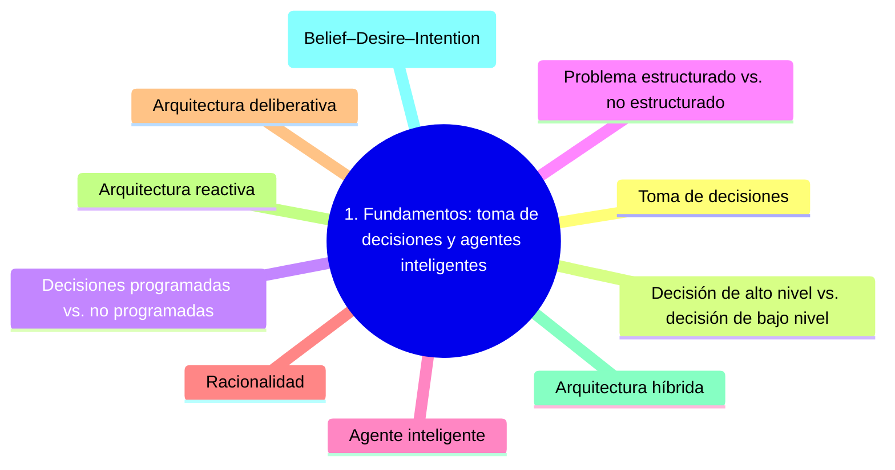


### Toma de decisiones

Proceso por el cual un agente —humano o artificial— elige una acción entre un
conjunto de alternativas para alcanzar un objetivo, evaluando consecuencias
bajo condiciones de información parcial, riesgo o incertidumbre. En IA, la
toma de decisiones se formaliza mediante funciones de utilidad, espacios de
acción y modelos del entorno.

### Decisión de alto nivel vs. decisión de bajo nivel

- **Alto nivel:** afectan al futuro, son difíciles de revertir, tienen
  impacto amplio y son excepcionales. En IA se asocian a *planificadores
  deliberativos* que pueden tomarse el tiempo necesario para razonar.
- **Bajo nivel:** rutinarias, fácilmente reversibles, frecuentes y de impacto
  localizado. Se asocian a *planificadores reactivos* que deben responder en
  tiempo muy corto.

### Decisiones programadas vs. no programadas

Las **programadas** son rutinarias, repetitivas y pueden manejarse mediante
reglas explícitas (SI…ENTONCES). Las **no programadas** corresponden a
situaciones nuevas donde no existen reglas establecidas; requieren más tiempo,
información incompleta y suelen producir soluciones únicas para esa situación.

### Problema estructurado vs. no estructurado

Un problema **estructurado** contiene en su enunciado toda la información
necesaria para resolverlo. Un problema **no estructurado** carece de
información completa, por lo que el agente debe buscarla, inferirla o
solicitarla. Buena parte del trabajo de modelado en IA consiste en
estructurar problemas que originalmente no lo están.

### Agente inteligente

Entidad que percibe su entorno mediante sensores, lo modela internamente y
actúa sobre él mediante actuadores con el fin de alcanzar metas. Formalmente,
un agente es una función que mapea historias de percepciones a acciones. Sus
componentes esenciales son: **percepción**, **representación interna**,
**razonamiento** y **actuación**.

### Racionalidad

Un agente es **racional** cuando, dadas sus percepciones y conocimiento previo,
selecciona acciones que maximizan su medida de rendimiento. La racionalidad no
exige omnisciencia: un agente racional puede equivocarse si su información es
incompleta, siempre que su elección sea la mejor *dado lo que sabía*.

### Arquitectura deliberativa

Diseño de agente que mantiene un modelo simbólico explícito del mundo y razona
sobre él antes de actuar. Es el enfoque clásico de la IA simbólica:
*percibir → planificar → actuar*. Es potente pero costoso: si el entorno
cambia rápido, el plan calculado puede quedar obsoleto antes de ejecutarse.

### Arquitectura reactiva

Diseño en el que el agente responde directamente a las percepciones mediante
asociaciones estímulo-respuesta, sin razonamiento deliberativo. Es rápida y
robusta en entornos dinámicos, pero limitada para tareas que requieren
planificación a largo plazo. Su exponente clásico es la *arquitectura de
subsunción* de Brooks.

### Arquitectura híbrida

Combinación de capas reactivas y deliberativas: las primeras gestionan
respuestas inmediatas (evitar obstáculos), las segundas planifican objetivos
de largo plazo. Habitualmente la capa reactiva tiene precedencia para
garantizar respuestas en tiempo real.

### Modelo BDI (Belief–Desire–Intention)

Arquitectura cognitiva basada en tres actitudes mentales: **creencias**
(estado del mundo según el agente), **deseos** (estados que el agente quisiera
alcanzar) e **intenciones** (deseos a los que se ha comprometido a actuar).
Es el fundamento conceptual de muchos sistemas multi-agente.

## 2. Representación del conocimiento

#### Mapa mental de la sección

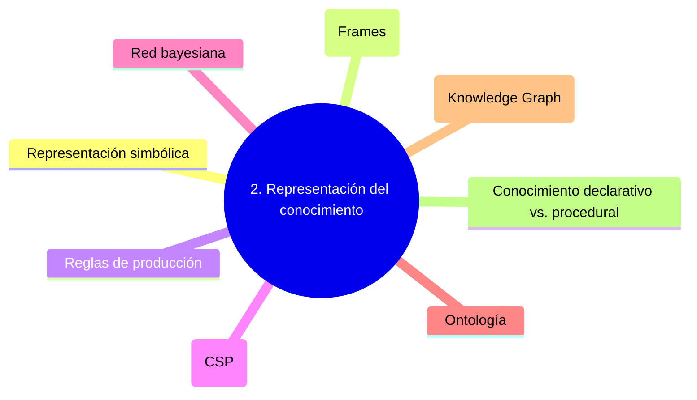


### Representación simbólica

Codificación explícita del conocimiento mediante símbolos, estructuras y
reglas formales. La premisa, conocida como *hipótesis del sistema de símbolos
físicos* (Newell y Simon), es que la inteligencia puede emerger de la
manipulación adecuada de símbolos. Una buena representación debe ser
**formal** (sin ambigüedades), **expresiva**, **natural** y **tratable**
computacionalmente.

### Marcos (Frames)

Estructuras estereotipadas que representan situaciones, conceptos u objetos
mediante atributos (slots) y valores. Los procesos de inferencia se realizan
por medio de jerarquías y herencia entre marcos. Son antecedentes directos de
la programación orientada a objetos.

### Reglas de producción

Sentencias condicionales del tipo `SI <antecedente> ENTONCES <consecuente>`.
La inferencia se ejecuta mediante **encadenamiento hacia adelante**
(*forward chaining*: desde los hechos a las conclusiones) o **hacia atrás**
(*backward chaining*: desde las metas a los hechos).

### Restricciones (CSP)

Un *Constraint Satisfaction Problem* representa el conocimiento como
variables, dominios y restricciones. La inferencia se realiza mediante
**propagación de restricciones**, **consistencia de arco** (AC-3) y
*backtracking*. Sudoku, coloreo de mapas y planificación de horarios son
CSPs clásicos.

### Red bayesiana

Grafo dirigido acíclico cuyos nodos son variables aleatorias y cuyos arcos
representan dependencias probabilísticas. Cada nodo tiene asociada una tabla
de probabilidad condicional. Permiten razonamiento bajo incertidumbre y son
la base de muchos sistemas de diagnóstico.

### Ontología

Especificación formal y compartida de los conceptos de un dominio y las
relaciones entre ellos. En IA moderna, ontologías como OWL (basado en lógicas
de descripción) permiten el razonamiento automatizado en la Web Semántica.

### Grafo de conocimiento (Knowledge Graph)

Estructura de datos que integra entidades, propiedades y relaciones a gran
escala. Wikidata, DBpedia y los grafos de conocimiento empresariales son
ejemplos. Combinan representación simbólica con técnicas modernas de
*embeddings* y *graph neural networks* para inferencia híbrida.

### Conocimiento declarativo vs. procedural

El **declarativo** describe *qué* es verdad sobre el mundo (hechos, reglas).
El **procedural** describe *cómo* hacer algo (procedimientos, recetas). Un
buen sistema inteligente combina ambos: declara los hechos y procedimentaliza
las inferencias.

## 3. Tipos de razonamiento

#### Mapa mental de la sección

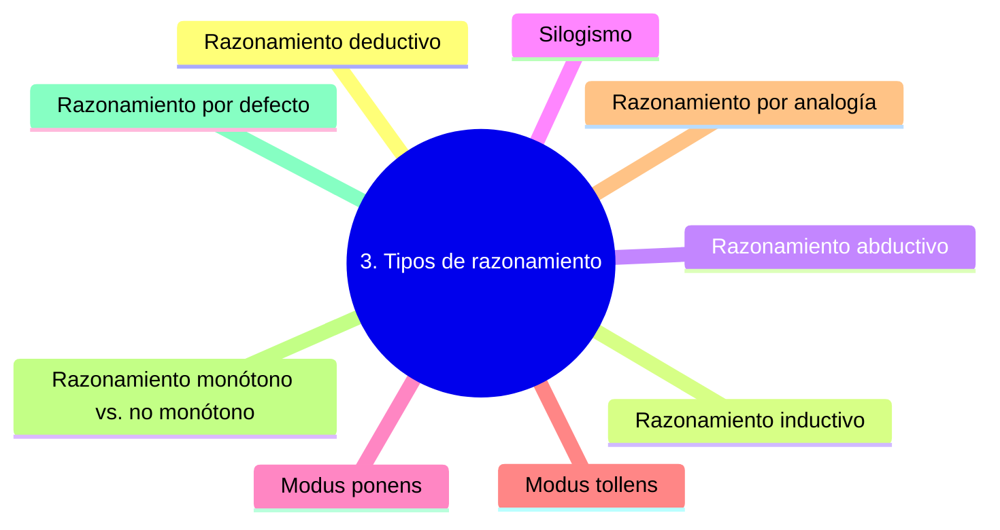


### Razonamiento deductivo

Inferencia en la que la conclusión se sigue *necesariamente* de las premisas:
si las premisas son verdaderas, la conclusión también lo es. Va de lo general
a lo particular. Es el fundamento del **método deductivo** que Euclides aplicó
a la geometría.

> *Ejemplo.* «Todos los humanos son mortales. Sócrates es humano. Por tanto,
> Sócrates es mortal.»

### Razonamiento inductivo

Genera conclusiones *probables* a partir de observaciones específicas;
generaliza de lo particular a lo general. La conclusión no se sigue
necesariamente de las premisas: añadir una nueva observación puede invalidarla.

> *Ejemplo.* «Todos los cisnes que he visto son blancos, luego todos los
> cisnes son blancos.» (Falsado por la existencia de cisnes negros.)

### Razonamiento abductivo

Inferencia hacia la **mejor explicación**: dado un efecto observado, se
postula la causa más plausible. Es no deductivo y se utiliza para diagnóstico
médico, depuración de sistemas y razonamiento causal.

> *Ejemplo.* «Si llueve, el suelo se moja. El suelo está mojado. *Tal vez* ha
> llovido.» (Pero también pudo regarse, romperse una tubería, etc.)

### Silogismo

Forma clásica del razonamiento deductivo aristotélico, compuesta por dos
premisas (mayor y menor) y una conclusión que se deduce lógicamente de ambas.

### Modus ponens

Regla de inferencia: dado $P \rightarrow Q$ y $P$, se concluye $Q$. Es el
ladrillo fundamental del encadenamiento hacia adelante.

### Modus tollens

Regla de inferencia: dado $P \rightarrow Q$ y $\neg Q$, se concluye $\neg P$.
Es la base lógica de la falsación científica.

### Razonamiento por analogía

Transferencia de conclusiones entre dominios estructuralmente similares.
Si dos situaciones comparten un conjunto de propiedades relevantes, se infiere
que pueden compartir otras. Es no deductivo y susceptible a errores cuando
la analogía es superficial.

### Razonamiento monótono vs. no monótono

En el **monótono**, añadir nuevas premisas nunca invalida conclusiones
previas. En el **no monótono**, las conclusiones pueden retractarse al
incorporar nueva información. La lógica clásica es monótona; el razonamiento
de sentido común suele ser no monótono.

### Razonamiento por defecto

Forma de razonamiento no monótono propuesta por Reiter, en la que se asumen
conclusiones plausibles *en ausencia de evidencia en contra*. Por ejemplo:
«los pájaros vuelan, salvo que se sepa lo contrario».

## 4. Tipos de lógica

#### Mapa mental de la sección

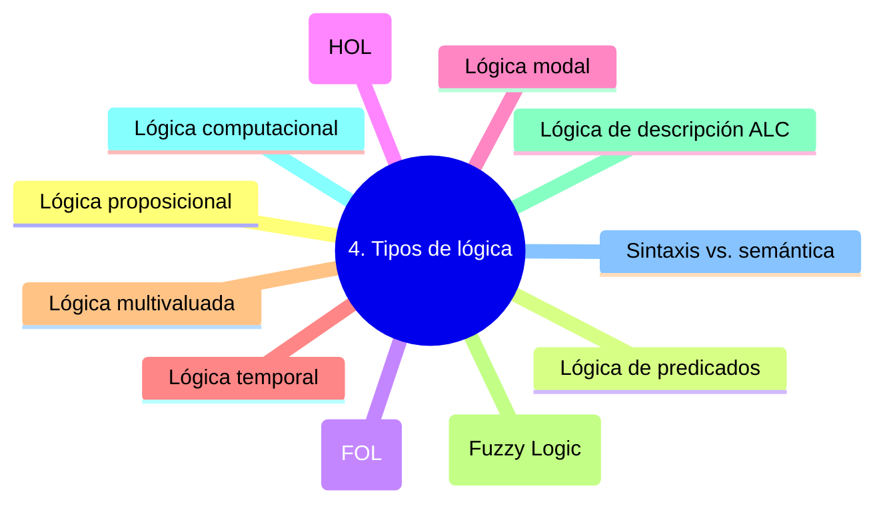


### Lógica proposicional

Sistema formal cuyas unidades básicas son **proposiciones** atómicas
combinadas con conectivas: $\wedge$ (conjunción), $\vee$ (disyunción),
$\neg$ (negación), $\rightarrow$ (implicación) y $\leftrightarrow$
(bicondicional). Es decidible, pero su poder expresivo es limitado: no
puede hablar de objetos individuales.

### Lógica de predicados

Extiende la proposicional permitiendo expresar propiedades y relaciones entre
objetos mediante **predicados** y **funciones**. La inferencia sigue usando
modus ponens y modus tollens.

### Lógica de primer orden (FOL)

Lógica de predicados enriquecida con **cuantificadores**: $\forall$ (para
todo) y $\exists$ (existe). Permite expresar enunciados como «toda madre
quiere a sus hijas». Es el lenguaje formal canónico de las matemáticas y de
la mayoría de la IA simbólica. Es semidecidible: el conjunto de teoremas es
recursivamente enumerable, pero su complemento no.

### Lógica de orden superior (HOL)

Permite cuantificar sobre **predicados y funciones**, no solo sobre
individuos. Es más expresiva pero menos tratable; se usa en demostradores de
teoremas como Isabelle/HOL y Coq.

### Lógica modal

Introduce operadores que califican la verdad de un enunciado: $\Box P$
(necesariamente $P$) y $\Diamond P$ (posiblemente $P$). Sus interpretaciones
incluyen la **lógica epistémica** (saber, creer), **deóntica** (obligación,
permiso) y **temporal** (siempre, alguna vez).

### Lógica temporal

Variante modal con operadores como $\mathbf{G}$ (globally),
$\mathbf{F}$ (finally), $\mathbf{X}$ (next) y $\mathbf{U}$ (until). LTL
(Linear Temporal Logic) y CTL (Computation Tree Logic) son fundamentales en
*model checking* y verificación de planes.

### Lógica multivaluada

Sistema lógico con más de dos valores de verdad, p. ej. `{verdadero, falso, desconocido}`
de Łukasiewicz. Útil cuando la información es incompleta o inconsistente.

### Lógica difusa (Fuzzy Logic)

Propuesta por Lotfi Zadeh (1965), asigna a cada proposición un grado de
pertenencia en el intervalo $[0, 1]$ en lugar de un valor binario. Emplea
**funciones de pertenencia** que modelan conjuntos borrosos como «alto»,
«rápido», «caliente». Se usa extensamente en control industrial y sistemas
expertos.

### Lógica de descripción ALC

Familia de lógicas formales para describir conceptos, roles e individuos en
ontologías. **ALC** ("Attributive Concept Language with Complements") es la
lógica de descripción base, e incluye conceptos atómicos, conjunción,
disyunción, negación, restricciones de rol existencial ($\exists R.C$) y
universal ($\forall R.C$). Es el núcleo lógico de OWL-DL.

### Lógica computacional

Aplicación de la lógica simbólica a las ciencias de la computación:
verificación formal, demostración de teoremas, semántica de lenguajes y
programación lógica. Su exponente más conocido es **Prolog**.

### Sintaxis vs. semántica

La **sintaxis** define qué cadenas son fórmulas bien formadas; la
**semántica** asigna significado (valores de verdad) a esas fórmulas mediante
*interpretaciones* y *modelos*. Una fórmula es **válida** si es verdadera en
todo modelo, **satisfacible** si lo es en al menos uno.

## 5. Búsqueda no informada

#### Mapa mental de la sección

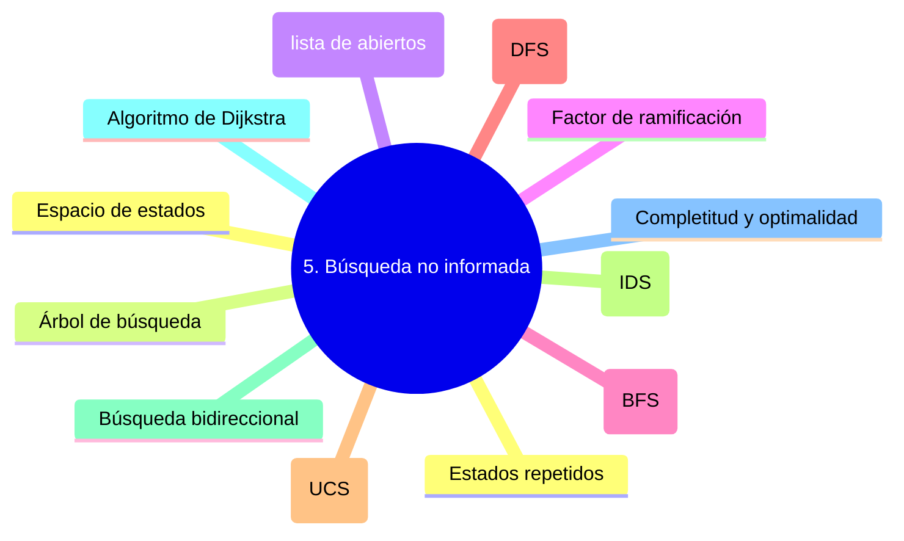


### Espacio de estados

Modelo del problema como un grafo cuyos nodos son **estados** del mundo y
cuyas aristas son **acciones** que llevan de un estado a otro. Resolver el
problema equivale a encontrar un camino del estado inicial a algún estado
meta.

### Árbol de búsqueda

Estructura que el algoritmo construye explorando el espacio de estados.
Cada nodo representa un estado alcanzado; los hijos son los estados producidos
por aplicar acciones aplicables. Distinto del espacio de estados: un mismo
estado puede aparecer en múltiples nodos.

### Frontera (lista de abiertos)

Conjunto de nodos generados pero no expandidos todavía. La estrategia de
búsqueda se define principalmente por *cómo se ordena la frontera*: cola (BFS),
pila (DFS), cola de prioridad (UCS, A*).

### Factor de ramificación

Número promedio de sucesores que genera un estado. Determina el crecimiento
exponencial del árbol de búsqueda y, por tanto, el coste computacional.

### Búsqueda en amplitud (BFS)

Expande nodos por niveles: primero todos los de profundidad 0, luego los de
profundidad 1, etcétera. Es **completa** y **óptima** cuando el coste por
acción es uniforme. Complejidad temporal y espacial $O(b^d)$, donde $b$ es
el factor de ramificación y $d$ la profundidad de la solución.

### Búsqueda en profundidad (DFS)

Expande siempre el nodo más profundo de la frontera. Memoria $O(bm)$ donde
$m$ es la profundidad máxima. **No** es completa en espacios infinitos ni
óptima, pero su consumo de memoria es muy inferior al de BFS.

### Búsqueda de coste uniforme (UCS)

Generalización de BFS que expande el nodo con menor coste acumulado $g(n)$.
Es **óptima** cuando los costes son no negativos. Equivale al algoritmo de
**Dijkstra** sobre el grafo implícito.

### Búsqueda en profundidad iterativa (IDS)

Combina la baja memoria de DFS con la completitud de BFS aplicando DFS con
profundidad límite creciente: 1, 2, 3… El coste adicional es modesto porque
los nodos profundos dominan la complejidad.

### Búsqueda bidireccional

Lanza dos búsquedas simultáneas: una desde el inicio hacia adelante y otra
desde la meta hacia atrás. Cuando se encuentran, se obtiene la solución. Su
complejidad puede reducirse a $O(b^{d/2})$, una mejora exponencial.

### Algoritmo de Dijkstra

Algoritmo de caminos mínimos en grafos con pesos no negativos. Equivalente a
UCS aplicado a un grafo conocido. Si el grafo es implícito y muy grande,
suele preferirse UCS o A*.

### Completitud y optimalidad

Un algoritmo es **completo** si garantiza encontrar una solución cuando
existe; **óptimo** si garantiza encontrar la solución de menor coste. No
todas las búsquedas son ambas: DFS no es completa en general; BFS es óptima
solo bajo costes uniformes.

### Estados repetidos

Misma configuración del mundo alcanzada por caminos distintos. Estrategias
para gestionarlos: ignorarlos, evitar ciclos simples (no añadir el padre),
evitar ciclos generales (no añadir antecesores) o evitar todos los repetidos
mediante una tabla *closed*.

## 6. Heurística y búsqueda informada

#### Mapa mental de la sección

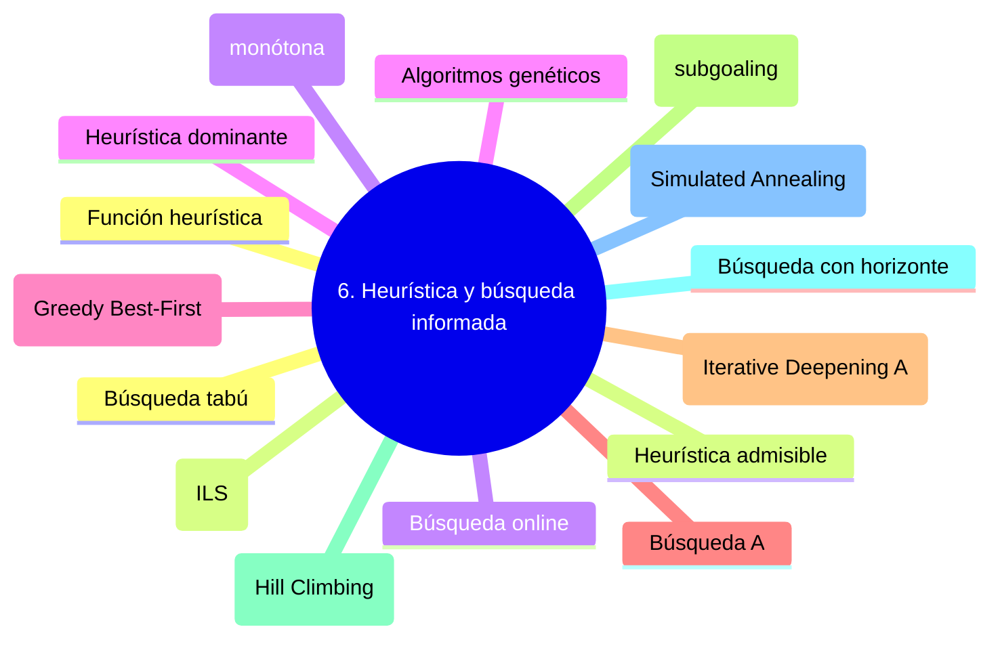


### Función heurística

Función $h(n)$ que estima el coste desde un nodo $n$ hasta la meta más
cercana. Es la pieza que convierte una búsqueda ciega en *informada*. Buenas
heurísticas son la diferencia entre resolver un problema en segundos o en
horas.

### Heurística admisible

$h$ es **admisible** si nunca sobrestima el coste real:
$h(n) \leq h^*(n)$ para todo nodo $n$, donde $h^*$ es el coste óptimo
verdadero. La admisibilidad es condición suficiente para que A* sea óptimo.

### Heurística consistente (monótona)

$h$ es **consistente** si para toda transición $n \rightarrow n'$ por
acción $a$:
$$h(n) \leq c(n, a, n') + h(n')$$
La consistencia implica admisibilidad. Con A* y heurística consistente,
ningún nodo necesita reabrirse.

### Heurística dominante

$h_2$ **domina** a $h_1$ si $h_2(n) \geq h_1(n)$ para todo $n$, siendo ambas
admisibles. La dominante explora menos nodos: «más informada».

### Búsqueda voraz primero el mejor (Greedy Best-First)

Expande el nodo con menor $h(n)$. Es rápida pero **no óptima** ni completa
en general; puede engancharse en mínimos locales o ramas infinitas.

### Búsqueda A*

Combina coste pasado y futuro estimado: $f(n) = g(n) + h(n)$. Si $h$ es
admisible, A* es óptima. Si $h$ es consistente, también es eficiente: ningún
nodo se expande más de una vez. Es probablemente el algoritmo de búsqueda más
influyente de la IA.

### IDA* (Iterative Deepening A*)

Variante de A* que limita la búsqueda por un umbral creciente de $f$ en lugar
de mantener la frontera en memoria. Conserva la optimalidad sacrificando
algo de tiempo a cambio de memoria $O(d)$.

### Búsqueda por subobjetivos (subgoaling)

Descomposición del objetivo global en submetas que se resuelven
secuencialmente. Reduce la complejidad cuando las submetas son
independientes; cuando no lo son, aparece la *anomalía de Sussman*.

### Búsqueda por ascenso de colinas (Hill Climbing)

Algoritmo de búsqueda local que en cada paso elige el sucesor con mejor
valor heurístico. Es rápido y de poca memoria, pero queda atrapado en
**óptimos locales**, **mesetas** y **crestas**.

### Búsqueda con horizonte

Generalización del ascenso de colinas que mira $k$ pasos por delante antes
de decidir. Si $h$ es exacta, es óptima y completa para horizonte
suficientemente grande.

### Recocido simulado (Simulated Annealing)

Búsqueda local probabilística inspirada en el recocido metalúrgico. Acepta
movimientos peores con probabilidad $\exp(-\Delta E / T)$ y reduce la
temperatura $T$ con el tiempo. Permite escapar de óptimos locales.

### Búsqueda tabú

Búsqueda local con memoria a corto plazo: mantiene una *lista tabú* de
movimientos recientes prohibidos para evitar ciclos. Útil en problemas de
optimización combinatoria.

### Búsqueda local iterada (ILS)

Aplica búsqueda local desde múltiples puntos iniciales generados perturbando
soluciones previas. Equilibra exploración y explotación.

### Búsqueda online

El agente alterna percepción y actuación: explora el entorno mientras lo
resuelve, sin disponer del modelo completo. Es esencial cuando los efectos
de las acciones son desconocidos a priori, como en navegación robótica.

### Algoritmos genéticos

Metaheurística basada en evolución biológica. Una población de soluciones
candidatas evoluciona mediante **selección**, **cruce** y **mutación** según
una función de aptitud. Apropiados para espacios de búsqueda enormes y poco
estructurados.

## 7. Búsqueda adversarial (teoría de juegos)

#### Mapa mental de la sección

```mermaid
mindmap
  root((7. Búsqueda adversarial (teoría de juegos)))
    Juego de suma cero
    Información perfecta vs. imperfecta
    Determinista vs. estocástico
    Algoritmo Minimax
    Poda alfa-beta
    Función de evaluación
    Búsqueda expectiminimax
    Equilibrio de Nash
    Monte Carlo Tree Search (MCTS)
```


### Juego de suma cero

Aquel en que la ganancia de un jugador es exactamente la pérdida del otro
(las utilidades suman cero o constante). Ajedrez, damas y tres en raya son
ejemplos clásicos.

### Información perfecta vs. imperfecta

Un juego es de **información perfecta** si todos los jugadores conocen el
estado completo (ajedrez, go); de **información imperfecta** si hay
información oculta (póker, blackjack).

### Determinista vs. estocástico

Un juego es **determinista** si las acciones tienen efectos predecibles
(damas); **estocástico** si interviene el azar (parchís, backgammon).

### Algoritmo Minimax

Demostrado por Von Neumann (1928), explora el árbol de juego suponiendo que
**MAX** maximiza la utilidad y **MIN** la minimiza. La utilidad de un nodo
interno se define recursivamente:

$$
\text{minimax}(n) = \begin{cases}
U(n) & \text{si}~n~\text{es}~\text{terminal} \\
\max_s \text{minimax}(s) & \text{si}~\text{turno}~\text{de}~\text{MAX},~s \in \text{suc}(n) \\
\min_s \text{minimax}(s) & \text{si}~\text{turno}~\text{de}~\text{MIN},~s \in \text{suc}(n)
\end{cases}
$$

### Poda alfa-beta

Optimización del minimax que descarta ramas que no pueden afectar a la
decisión final, manteniendo dos cotas $\alpha$ (mejor para MAX hasta el
momento) y $\beta$ (mejor para MIN). En el mejor caso reduce la complejidad
de $O(b^d)$ a $O(b^{d/2})$, duplicando la profundidad alcanzable en el mismo
tiempo.

### Función de evaluación

Aproximación heurística de la utilidad de un estado no terminal,
necesaria cuando el árbol es demasiado profundo para alcanzar las hojas. En
ajedrez, p. ej., suma material, movilidad y seguridad del rey.

### Búsqueda expectiminimax

Generalización del minimax para juegos con azar. Introduce **nodos de
azar** cuya utilidad es la *esperanza matemática* sobre los resultados
posibles, ponderada por sus probabilidades.

### Equilibrio de Nash

Configuración de estrategias en la que ningún jugador puede mejorar
unilateralmente cambiando la suya. Generaliza la teoría del minimax a juegos
no necesariamente de suma cero.

### Monte Carlo Tree Search (MCTS)

Algoritmo que estima la utilidad mediante simulaciones aleatorias
(*rollouts*) en lugar de evaluación heurística. Combina cuatro fases —
selección, expansión, simulación y *backpropagation* — y usa políticas como
**UCT** para equilibrar exploración y explotación. Es la base de los éxitos
de **AlphaGo** y **AlphaZero**.

## 8. Planificación clásica

#### Mapa mental de la sección

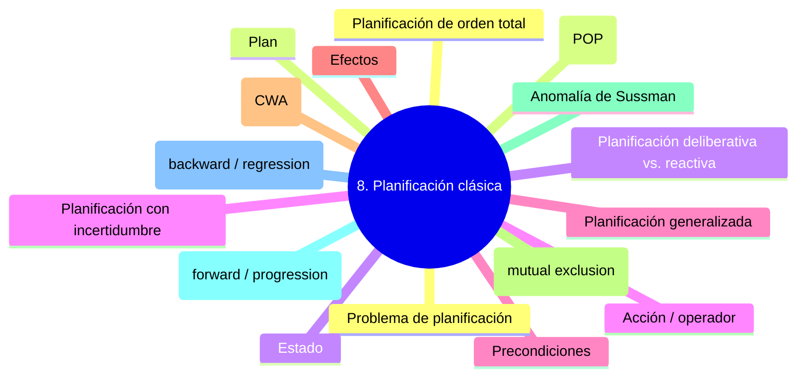


### Problema de planificación

Dado un estado inicial, un conjunto de acciones (con precondiciones y
efectos) y una meta, encontrar una secuencia de acciones que lleve del
estado inicial a un estado meta. Formalmente, decidir un plan de planificación
clásica proposicional es **PSPACE-completo**.

### Plan

Secuencia (orden total) o conjunto parcialmente ordenado (orden parcial) de
acciones cuya ejecución produce un estado que satisface la meta.

### Estado

Descripción completa del mundo en un momento dado. En planificación clásica,
los estados se representan típicamente como *conjuntos de proposiciones* o
*asignaciones a variables de estado*.

### Acción / operador

Transición entre estados, definida por su **firma** `nombre(parámetros)`,
sus **precondiciones** (qué debe ser cierto para aplicarla) y sus **efectos**
(qué cambia al aplicarla).

### Precondiciones

Conjunto de proposiciones que deben estar presentes en el estado actual para
que la acción sea aplicable. Si $\text{Pre}(a) \not\subseteq S$, la acción
no puede ejecutarse.

### Efectos

Cambios que la acción produce en el estado. En STRIPS se descomponen en
**lista de añadir** ($A$) y **lista de eliminar** ($E$). El nuevo estado es:

$$S' \leftarrow (S \setminus E) \cup A$$

### Hipótesis del mundo cerrado (CWA)

Asunción de que toda proposición no presente en el estado es **falsa**. Es la
asunción estándar en STRIPS y PDDL clásico, y simplifica enormemente la
representación a costa de expresividad.

### Mutex (mutual exclusion)

Pares de proposiciones o acciones que **no pueden ser verdaderas
simultáneamente**. Por ejemplo `on(C, B)` y `on(B, C)`. Detectar mutex
acelera la búsqueda al podar estados inconsistentes.

### Anomalía de Sussman

Problema clásico del mundo de los bloques en que un planificador
ingenuo —que resuelve cada submeta de forma independiente— entra en bucles
porque alcanzar una submeta deshace otra ya conseguida. Demostró la
necesidad de planificadores de orden parcial.

### Planificación hacia adelante (forward / progression)

Búsqueda desde el estado inicial aplicando acciones aplicables hasta alcanzar
la meta. Sufre de un **factor de ramificación elevado** porque el estado
inicial está completamente especificado.

### Planificación hacia atrás (backward / regression)

Búsqueda desde la meta, aplicando acciones en sentido inverso para encontrar
qué estados podrían producir la meta. Reduce la ramificación porque la meta
suele ser parcial, pero requiere garantizar la consistencia de los estados
regresados.

### Planificación de orden total

Produce planes como secuencias linealmente ordenadas de acciones. Sencillo
pero rígido: cualquier subobjetivo se compromete con un orden específico,
lo que puede provocar la anomalía de Sussman.

### Planificación de orden parcial (POP)

Construye planes como conjuntos parcialmente ordenados de acciones, añadiendo
restricciones de orden sólo cuando son necesarias para resolver conflictos.
Sus elementos son:

- **Acciones**: pasos del plan, incluyendo dos ficticias $\alpha_i$ (inicio)
  y $\alpha_f$ (fin).
- **Enlaces de orden** $A \prec B$: «A debe ejecutarse antes que B».
- **Enlaces causales** $A \xrightarrow{P} B$: «A produce el fluent $P$ que
  $B$ necesita».
- **Precondiciones abiertas**: precondiciones aún no soportadas.

### Planificación deliberativa vs. reactiva

La **deliberativa** construye un plan completo *antes* de ejecutarlo (offline).
La **reactiva** alterna planificación parcial y ejecución, idónea para
entornos dinámicos. Es la diferencia entre «pensar todo y luego actuar» y
«pensar mientras se actúa».

### Planificación con incertidumbre

Relaja las asunciones de la planificación clásica: el entorno puede ser
**parcialmente observable**, **no determinista** o **dinámico**. Requiere
representar probabilidades y diseñar políticas en lugar de planes
secuenciales rígidos.

### Planificación generalizada

Búsqueda de un plan único que resuelva *toda una familia* de problemas con
estructura común, en lugar de un problema individual. Suele expresarse como
política o programa con bucles y condicionales.

## 9. Lenguajes y planificadores

#### Mapa mental de la sección

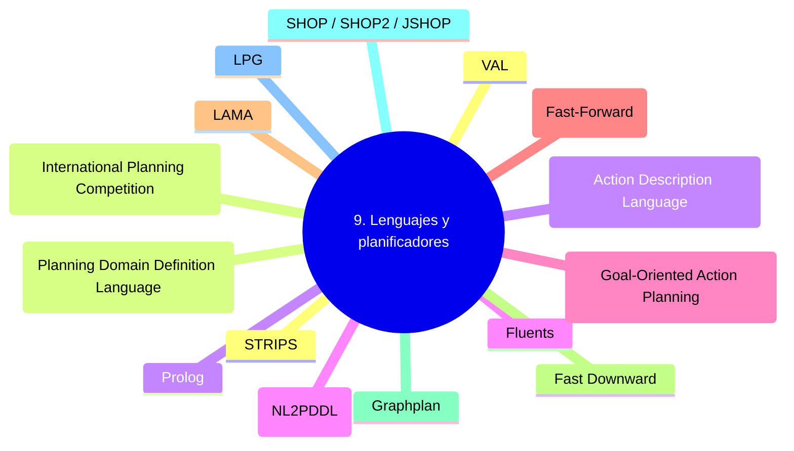


### STRIPS

*Stanford Research Institute Problem Solver*, propuesto por Fikes y Nilsson
en 1971. Es el lenguaje de planificación seminal: representa los estados
como conjuntos de proposiciones booleanas y los operadores como tripletas
`<precondiciones, lista_añadir, lista_eliminar>`. Su simplicidad lo hizo
omnipresente, y su modelo persiste como núcleo de PDDL.

### PDDL (Planning Domain Definition Language)

Lenguaje estándar definido por McDermott et al. (1998) para la
**International Planning Competition (IPC)**. Separa la **definición del
dominio** (predicados, acciones) de la **definición del problema** (objetos,
estado inicial, meta). Existe en versiones 1.0 a 3.1, cada una añadiendo
expresividad: ADL, fluentes numéricos, costes, restricciones temporales,
preferencias.

```pddl
(define (domain blocksworld)
  (:requirements :strips)
  (:predicates (on ?x ?y) (clear ?x) (ontable ?x) (handempty))
  (:action stack
    :parameters (?x ?y)
    :precondition (and (clear ?y) (holding ?x))
    :effect (and (not (holding ?x)) (not (clear ?y))
                 (clear ?x) (handempty) (on ?x ?y))))
```

### ADL (Action Description Language)

Extensión de STRIPS propuesta por Pednault que admite **disyunciones**,
**cuantificadores**, **efectos condicionales** y predicados con igualdad.
PDDL incorpora las construcciones de ADL.

### Fluents

Predicados (o funciones numéricas en PDDL2.1+) instanciados con objetos
concretos del mundo, p. ej. `on(B, A)`. Son los átomos que componen los
estados.

### GOAP (Goal-Oriented Action Planning)

Adaptación de STRIPS para entornos dinámicos como videojuegos, ideada por
**Jeff Orkin** (2004) e implementada por primera vez en *F.E.A.R.* (Monolith,
2005). Sus diferencias clave con STRIPS:

1. **Costes** asociados a cada acción para priorizar entre alternativas.
2. **Lista única de modificaciones** en lugar de añadir/eliminar separadas.
3. **Precondiciones procedurales**: funciones arbitrarias en lugar de
   predicados booleanos.
4. **Efectos procedurales**: código que modifica el entorno con flexibilidad.

GOAP usa típicamente A* sobre el espacio de acciones para encontrar
secuencias de coste mínimo.

### FF (Fast-Forward)

Planificador de **Hoffmann y Nebel** (2001), ganador del IPC 2000. Realiza
**búsqueda hacia adelante en el espacio de estados** guiada por una
heurística que ignora las listas de eliminar. Combina *Enforced Hill
Climbing* con búsqueda *Best-First* como respaldo.

### LAMA

Planificador de **Richter y Westphal**, ganador del IPC 2008. Usa una
heurística basada en **landmarks** (proposiciones que deben ser verdaderas en
toda solución) combinada con la heurística FF, búsqueda **A* ponderado**
*anytime* y costes de acción no uniformes.

### Fast Downward

Plataforma de planificación de **Malte Helmert** (2006). Convierte PDDL a
una representación interna basada en **variables de estado de dominio
finito** (SAS+) en lugar de proposicional. Es la base de muchos planificadores
modernos, incluido LAMA.

### Graphplan

Algoritmo de **Blum y Furst** (1995) que construye un *grafo de
planificación* alternando capas de proposiciones y acciones, y extrae el
plan mediante búsqueda hacia atrás sobre el grafo. Introdujo conceptos
fundamentales como mutex y heurísticas de relajación.

### SHOP / SHOP2 / JSHOP

Familia de planificadores HTN de **Dana Nau et al.** SHOP2 fue ganador del
IPC 2002 en su track. Procesan tareas en orden de ejecución y aceptan
conocimiento de dominio rico, lo que les da gran rendimiento práctico.

### LPG

Planificador estocástico basado en **Local Search for Planning Graphs**.
Trabaja con PDDL temporal y numérico mediante búsqueda local sobre grafos de
planificación.

### VAL

Validador estándar de planes para PDDL: dado un dominio, un problema y un
plan, verifica si el plan es válido y reporta errores. Esencial para
benchmarking y pipelines automatizados.

### IPC (International Planning Competition)

Competición bianual celebrada en el marco de **ICAPS** desde 1998.
Estandariza benchmarks, promueve PDDL y dirige buena parte del progreso
empírico del campo.

### Prolog

Lenguaje de programación lógica basado en lógica de primer orden con
cláusulas de Horn. Su intérprete realiza **resolución SLD** y *backtracking*
automáticamente. Pionero en aplicaciones de IA simbólica y razonamiento
automatizado.

### LLMs como planificadores (NL2PDDL)

Línea de investigación reciente (2023-2026) que evalúa la capacidad de los
**Large Language Models** —Claude, GPT-5, Gemini, DeepSeek-R1— para generar
planes a partir de descripciones PDDL o lenguaje natural. Los modelos de
frontera de 2025 ya rivalizan con planificadores clásicos como LAMA en
varios dominios estándar, aunque su rendimiento se degrada cuando los
predicados se ofuscan, indicando que combinan razonamiento genuino con
reconocimiento de patrones de entrenamiento. Estrategias híbridas como
**LLM+P** y **PDDL-GenAI** usan al LLM como *formalizador* (traduce lenguaje
natural a PDDL) y delegan la búsqueda a planificadores clásicos.

## 10. Planificación jerárquica (HTN)

#### Mapa mental de la sección

```mermaid
mindmap
  root((10. Planificación jerárquica (HTN)))
    HTN (Hierarchical Task Networks)
    Tarea primitiva
    Tarea compuesta (no primitiva)
    Método
    Red de tareas
    Descomposición jerárquica
    Conocimiento de dominio en HTN
```


### HTN (Hierarchical Task Networks)

Paradigma de planificación basado en la **descomposición jerárquica** de
tareas, en lugar de la composición de acciones primitivas. Aprovecha el
hecho de que muchos problemas reales tienen estructura jerárquica natural
(construir una casa, ejecutar una misión militar, organizar un viaje).

### Tarea primitiva

Tarea ejecutable directamente por el agente; equivale a un operador STRIPS.
Es el caso base de la descomposición.

### Tarea compuesta (no primitiva)

Tarea que debe descomponerse en subtareas mediante uno o más **métodos**.
Ejemplo: «construir casa» se descompone en «obtener permisos», «contratar
constructor», «edificar», «pagar».

### Método

Receta para descomponer una tarea compuesta en una red de subtareas, con
sus precondiciones y orden parcial. Una misma tarea puede tener varios
métodos alternativos: «edificar» se puede hacer contratando o
autoconstruyendo.

### Red de tareas

Conjunto parcialmente ordenado de tareas (primitivas y compuestas) con
restricciones de orden y enlaces causales. La meta inicial es una red de
tareas que se va refinando.

### Descomposición jerárquica

Proceso recursivo de sustituir tareas compuestas por las redes definidas por
sus métodos, hasta obtener un plan compuesto exclusivamente por tareas
primitivas.

### Conocimiento de dominio en HTN

A diferencia de la planificación clásica, HTN requiere un conocimiento de
dominio rico y estructurado: la biblioteca de métodos. Esto se considera
ventaja (escalabilidad y eficiencia) y crítica (codificar la solución dentro
del dominio reduce la generalidad).

## 11. Planificación multi-agente

#### Mapa mental de la sección

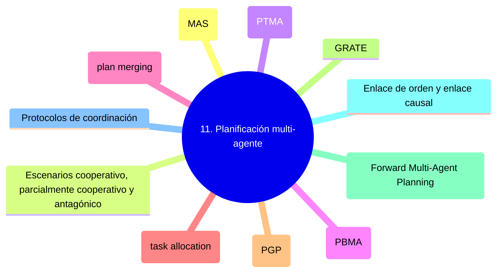


### Sistema multi-agente (MAS)

Conjunto de agentes que interactúan en un entorno compartido, cada uno con
sus propias percepciones, capacidades y objetivos. Pueden ser cooperativos,
parcialmente cooperativos o competitivos.

### Escenarios cooperativo, parcialmente cooperativo y antagónico

- **Cooperativo:** todos los agentes comparten metas; las acciones de uno
  facilitan las de los demás.
- **Parcialmente cooperativo:** algunas metas se comparten, otras divergen.
- **Antagónico (competitivo):** las metas son opuestas; lo que gana uno lo
  pierde otro.

### Planificación PARA múltiples agentes (PTMA)

Un planificador **centralizado** genera un plan global y asigna acciones a
cada agente de ejecución (*task allocation*). Garantiza optimalidad y
ausencia de conflictos, pero exige visión global y comunicación abundante.

### Planificación POR múltiples agentes (PBMA)

Cada agente planifica de forma **independiente y distribuida**, coordinándose
mediante protocolos para evitar conflictos. Permite preservar privacidad y
autonomía, a costa de subóptimalidad.

### Coordinación de planes (plan merging)

Construcción de un plan conjunto a partir de subplanes individuales,
detectando conflictos y redundancias. Aproximaciones clásicas: Georgeff
(1983), Rosenschein (1994).

### Asignación de tareas (task allocation)

Problema de decidir qué agente ejecuta cada acción del plan global. Puede
formularse como problema de optimización (MILP), subasta o negociación.

### Partial Global Planning (PGP)

Framework de **Durfee y Lesser** (1987) en el que cada agente mantiene una
visión parcial del plan global y la actualiza al recibir información de
otros. Usado en problemas como la programación de pacientes.

### GRATE

Framework de **Jennings** (1993) basado en BDI: los agentes coordinan su
planificación razonando sobre creencias, deseos, intenciones y compromisos
conjuntos.

### FMAP (Forward Multi-Agent Planning)

Planificador multi-agente de **Torreno et al.** que combina planificación de
**orden parcial** con búsqueda **A* multi-agente** hacia adelante. Sus tres
fases son:

1. **Intercambio inicial** de información declarada como compartida en el
   dominio (extensión `:shared-data` de PDDL).
2. **Refinamiento individual**: cada agente añade acciones para satisfacer
   precondiciones abiertas del plan parcial actual.
3. **Coordinación**: liderazgo democrático rotatorio donde un agente actúa
   como coordinador en cada iteración.

### Enlace de orden y enlace causal

- **Enlace de orden** $A \prec B$: la acción $A$ debe ejecutarse antes que
  $B$ en cualquier linealización del plan.
- **Enlace causal** $A \xrightarrow{P} B$: la acción $A$ produce el fluent
  $P$ que $B$ requiere; ninguna otra acción puede borrarlo entre ambas.

### Protocolos de coordinación

Reglas que estructuran la comunicación entre agentes durante la
planificación distribuida: turnos, *contract net*, subastas, votación. Un
buen protocolo equilibra eficiencia, justicia y robustez ante fallos.

## 12. Planificación bajo incertidumbre

#### Mapa mental de la sección

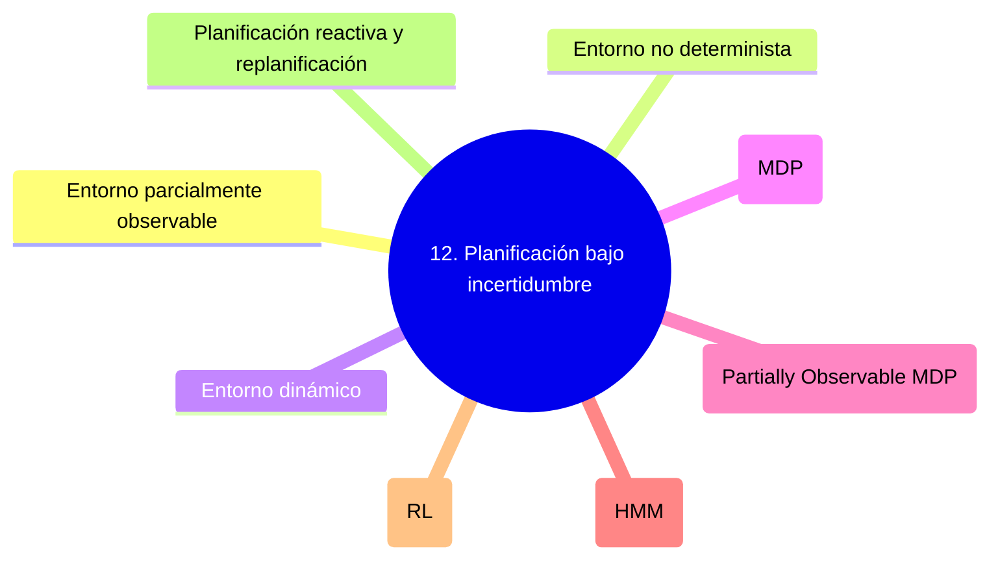


### Entorno parcialmente observable

El agente solo percibe parte del estado del mundo. Requiere mantener una
**creencia** (distribución de probabilidad sobre estados) y razonar sobre
ella.

### Entorno no determinista

Las acciones tienen múltiples resultados posibles. Puede modelarse de forma
**no determinista clásica** (conjunto de resultados sin probabilidades) o
**probabilística** (distribución sobre resultados).

### Entorno dinámico

El estado del mundo cambia por causas externas mientras el agente delibera o
actúa. Exige replanificación frecuente o estrategias reactivas.

### Proceso de decisión de Markov (MDP)

Modelo matemático para decisión secuencial bajo incertidumbre. Consta de:

- Conjunto de estados $S$
- Conjunto de acciones $A$
- Función de transición $P(s' \mid s, a)$
- Función de recompensa $R(s, a)$
- Factor de descuento $\gamma \in [0, 1]$

La solución óptima es una **política** $\pi^*: S \rightarrow A$. Se calcula
mediante **iteración de valores** o **iteración de políticas**, basadas en
la ecuación de Bellman:

$$V^*(s) = \max_a \left[ R(s, a) + \gamma \sum_t P(t \mid s, a) V^*(t) \right]$$

### POMDP (Partially Observable MDP)

Generalización de MDP en que el agente no observa el estado directamente,
sino observaciones $o \in O$ con probabilidad $P(o \mid s, a)$. La política
óptima opera sobre **estados de creencia** (distribuciones sobre $S$).
Su resolución es PSPACE-hard, por lo que en la práctica se usan
aproximaciones.

### Modelo Oculto de Markov (HMM)

Caso particular de POMDP sin acciones, en el que el estado evoluciona
según una cadena de Markov y solo se observa una variable dependiente del
estado. Usado en reconocimiento de voz, *POS tagging* y bioinformática.
Algoritmos clave: **forward-backward** (probabilidades), **Viterbi**
(secuencia más probable), **Baum-Welch** (aprendizaje de parámetros).

### Aprendizaje por refuerzo (RL)

Paradigma en que el agente aprende una política óptima mediante interacción
con el entorno, sin conocer a priori las funciones de transición o
recompensa. Combina muestreo, estimación de valor y exploración. Métodos
clásicos: **Q-learning**, **SARSA**, **policy gradients**, **actor-critic**.

### Planificación reactiva y replanificación

Cuando un plan falla por cambios inesperados en el entorno, hay dos
estrategias: **replanificar desde cero** (costoso pero óptimo) o **reparar
localmente** el plan existente (rápido pero subóptimo). Sistemas como FF-Replan
y reparación reactiva multi-agente exploran este equilibrio.

## 13. Conceptos transversales

#### Mapa mental de la sección

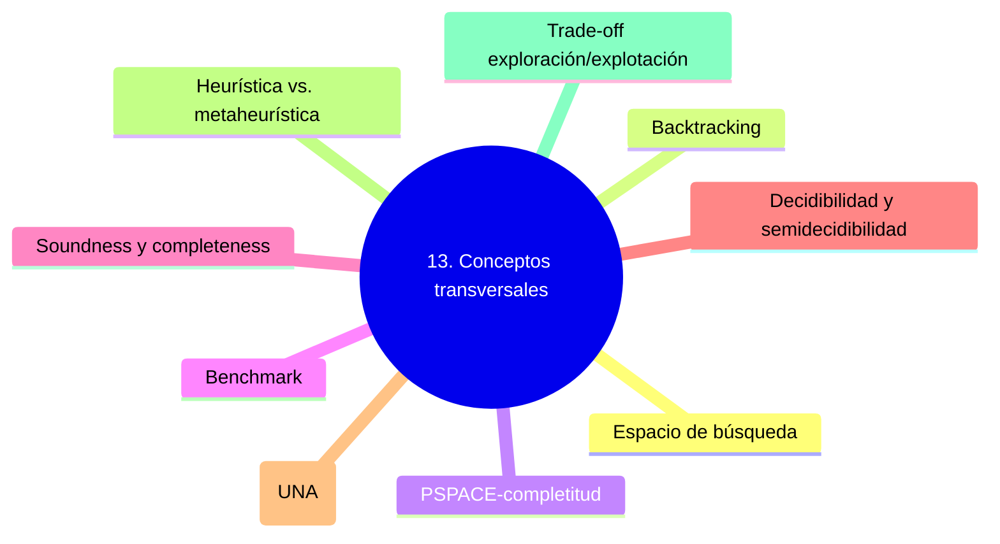


### Espacio de búsqueda

Conjunto total de estados o configuraciones que un algoritmo podría
explorar. Su tamaño determina la viabilidad computacional del problema.

### Backtracking

Estrategia de exploración que retrocede al último punto de decisión cuando
la rama actual no conduce a solución. Subyace a casi todos los algoritmos
de búsqueda y a Prolog.

### PSPACE-completitud

Clase de complejidad a la que pertenece la planificación clásica
proposicional: los problemas resolubles en espacio polinómico. Significa
que, incluso bajo asunciones simplificadoras (mundo cerrado, determinismo,
observabilidad total), planificar es difícil en general.

### Benchmark

Conjunto estandarizado de problemas usado para comparar planificadores. Los
benchmarks de IPC (Blocksworld, Logistics, Rovers, Satellite, Floortile…)
son referencia obligada del campo.

### Soundness y completeness

Un sistema de razonamiento es **correcto** (*sound*) si todo lo que deduce
es verdadero; es **completo** (*complete*) si puede deducir todo lo que es
verdadero. La lógica de primer orden tiene sistemas de demostración sound y
complete (gracias a Gödel); HOL no.

### Decidibilidad y semidecidibilidad

Un problema es **decidible** si existe un algoritmo que, dado cualquier
input, termina con respuesta correcta. Es **semidecidible** si termina
correctamente cuando la respuesta es «sí» pero puede no terminar cuando es
«no». La lógica proposicional es decidible (NP-completa para satisfacción);
FOL es semidecidible.

### Hipótesis del nombre único (UNA)

Asunción de que constantes distintas denotan objetos distintos. Combinada
con la CWA, simplifica la representación pero limita el modelado de
identidad y referencia.

### Heurística vs. metaheurística

Una **heurística** es una regla específica de un dominio que guía la
búsqueda hacia buenas soluciones. Una **metaheurística** (recocido simulado,
algoritmos genéticos, búsqueda tabú) es una estrategia general aplicable a
familias de problemas.

### Trade-off exploración/explotación

Dilema fundamental en RL, MCTS y búsqueda local: **explorar** opciones poco
conocidas para descubrir mejores soluciones vs. **explotar** las mejores
conocidas para maximizar resultados inmediatos. Estrategias clásicas:
$\varepsilon$-greedy, UCB, softmax.

## 14. Fundamentos filosóficos del razonamiento y la planificación

#### Mapa mental de la sección

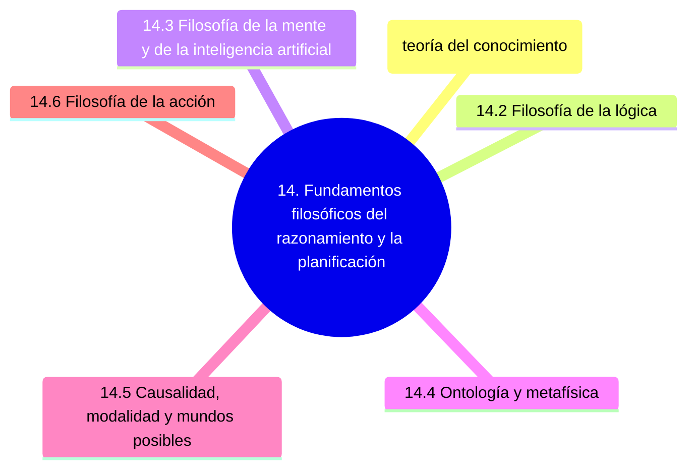


La IA simbólica nació en diálogo con la filosofía: con la lógica de
Aristóteles, la *characteristica universalis* de Leibniz, el debate
empirismo–racionalismo y la teoría del conocimiento. Esta sección recoge
los conceptos filosóficos que más iluminan el campo, organizados por
área. No es filosofía de adorno: cada término aquí tiene una
contraparte directa en cómo modelamos agentes, conocimiento y acción.

### 14.1 Epistemología (teoría del conocimiento)

#### A priori / a posteriori

Distinción introducida por la filosofía escolástica y refinada por Kant.
**A priori** es lo que se conoce con independencia de la experiencia
(las verdades matemáticas, los axiomas); **a posteriori**, lo que se
conoce *a partir* de la experiencia. En IA, el conocimiento *a priori*
del agente equivale a lo programado o aprendido previamente —su modelo
del dominio, sus heurísticas— mientras que las percepciones del entorno
proveen el conocimiento *a posteriori*.

#### Empirismo

Corriente filosófica (Locke, Hume, Berkeley) que sostiene que **todo
conocimiento procede de la experiencia sensible**. Su análogo
contemporáneo es el aprendizaje automático puro: un modelo que aprende
solo de datos, sin estructura previa, encarna una posición empirista
radical.

#### Racionalismo

Posición opuesta (Descartes, Leibniz, Spinoza): existen verdades y
estructuras del conocimiento que la razón puede establecer **con
independencia de la experiencia**. La IA simbólica clásica —Prolog,
sistemas expertos, lógica formal— es heredera del racionalismo:
asume estructuras innatas (lógica, ontologías, reglas) sobre las que se
opera deductivamente. El debate empirismo/racionalismo reaparece hoy
como **conexionismo vs. simbolismo** y motiva la búsqueda de sistemas
**neuro-simbólicos**.

#### Conocimiento como creencia verdadera justificada (JTB)

Definición clásica desde Platón (*Teeteto*): un sujeto $S$ *sabe* que
$p$ si y solo si (1) $S$ cree que $p$, (2) $p$ es verdadero, y (3) $S$
está justificado en creer $p$. Es la base implícita del modelo BDI:
los *beliefs* del agente son su intento de reconstruir esta tríada con
información incompleta.

#### Problema de Gettier

Edmund Gettier (1963) mostró con contraejemplos que la JTB es
insuficiente: hay casos de creencia verdadera y justificada que no
contamos como conocimiento (porque la justificación es accidental).
Es relevante en IA al diseñar agentes que distinguen *coincidencia*
de *causa*.

#### Falibilismo

Tesis epistemológica (Peirce, Popper) según la cual **todo
conocimiento empírico es revisable**: ninguna creencia justificada es
inmune al error. Justifica la lógica no monótona, la replanificación
y los sistemas que mantienen creencias con grados de confianza.

#### Problema de la inducción (Hume)

David Hume (*An Enquiry Concerning Human Understanding*, 1748): no hay
justificación lógica para inferir leyes generales de observaciones
particulares —que el sol haya salido cada día no garantiza que saldrá
mañana. Es el problema fundacional del aprendizaje supervisado: por
qué un modelo entrenado en datos pasados generalizaría a datos
futuros. Las cotas PAC y la teoría VC son intentos formales de
domarlo.

#### Navaja de Ockham (*Lex parsimoniae*)

Principio atribuido a Guillermo de Ockham (siglo XIV): *entia non sunt
multiplicanda praeter necessitatem* —«no hay que multiplicar las
entidades sin necesidad». Ante explicaciones equivalentes, prefiere
la más simple. Es el sesgo inductivo central de casi toda IA:
modelos más simples generalizan mejor (regularización), planes con
menos pasos suelen preferirse, ontologías mínimas son más
mantenibles.

#### Falsacionismo

Karl Popper (*La lógica de la investigación científica*, 1934)
propuso que una teoría científica no se valida acumulando
confirmaciones, sino exponiéndola a **intentos de refutación**. Solo
las teorías falsables son científicas. Tiene contraparte directa en
testing de software, validación de planes (VAL) y verificación
formal: probamos un plan tratando de romperlo.

#### Subdeterminación

Tesis (Quine, Duhem) de que para cualquier conjunto finito de datos
existen múltiples teorías compatibles con ellos. Justifica la
necesidad de sesgos inductivos: sin ellos, el aprendizaje sería
imposible porque infinitas hipótesis ajustan los datos.

### 14.2 Filosofía de la lógica

#### Principios lógicos clásicos

Tres principios desde Aristóteles:

- **Identidad**: $A = A$.
- **No contradicción**: no puede ser $A$ y $\neg A$ al mismo tiempo y
  en el mismo sentido.
- **Tercio excluso** (*tertium non datur*): $A \vee \neg A$ es siempre
  cierto.

La lógica difusa, la multivaluada y la intuicionista relajan algunos
de estos principios para modelar incertidumbre, vaguedad o
constructividad.

#### Teorías de la verdad

- **Correspondencia** (Aristóteles, Tarski): una proposición es
  verdadera si se corresponde con los hechos.
- **Coherencia**: es verdadera si encaja consistentemente con un
  sistema de creencias.
- **Pragmatista** (Peirce, James): es verdadera si funciona
  útilmente en la práctica.

Diferentes paradigmas de IA privilegian distintas teorías: la lógica
formal asume correspondencia, las redes bayesianas se ajustan al
pragmatismo, los grafos de conocimiento mezclan ambas.

#### Tautología y contradicción

Una **tautología** es una fórmula verdadera bajo toda interpretación
($p \vee \neg p$); una **contradicción** lo es bajo ninguna
($p \wedge \neg p$). Son los extremos triviales de la satisfacibilidad
y orientan la simplificación de fórmulas en SAT solvers y
demostradores.

#### Characteristica universalis y calculus ratiocinator

Proyecto de Leibniz (siglo XVII) de un **lenguaje universal de
símbolos** que representara con precisión todo concepto, junto con un
**cálculo del razonamiento** que resolviera disputas mecánicamente:
*calculemus*, «calculemos». Es el antepasado intelectual directo de
la lógica formal de Frege, de la programación lógica y, en cierto
modo, de toda la IA simbólica.

#### Teoremas de incompletitud de Gödel

Kurt Gödel (1931) demostró que todo sistema formal consistente
suficientemente expresivo (que contenga aritmética) contiene
proposiciones verdaderas pero **indemostrables dentro del sistema**, y
no puede demostrar su propia consistencia. Marca un límite
fundamental al programa de mecanizar el razonamiento: ninguna IA
basada en un sistema formal cerrado puede ser completa.

#### Tesis de Church-Turing

Alonzo Church y Alan Turing (1936): toda función *efectivamente
calculable* es computable por una máquina de Turing. Establece la
equivalencia entre nociones intuitivas y formales de computación; es
el supuesto que permite hablar de «el» algoritmo de un problema con
independencia del lenguaje o máquina concretos.

### 14.3 Filosofía de la mente y de la inteligencia artificial

#### Hipótesis del sistema de símbolos físicos

Allen Newell y Herbert Simon (1976): **un sistema físico de símbolos
posee los medios necesarios y suficientes para la acción inteligente
general**. Es la tesis fundacional de la IA simbólica: la inteligencia
emerge de la manipulación de símbolos según reglas, sea el sustrato
neuronas, transistores o lo que sea.

#### Computacionalismo

Tesis filosófica de que **la mente es un sistema computacional**: los
estados mentales son estados computacionales y los procesos mentales
son procesos computacionales. Posiciones afines son el
**funcionalismo** (Putnam) y la **teoría representacional de la
mente** (Fodor). Son los compromisos metafísicos implícitos en el
proyecto de la IA fuerte.

#### Funcionalismo

Posición filosófica según la cual los estados mentales se definen por
su **rol funcional** —sus relaciones causales con entradas, otros
estados y salidas— no por su realización física. Implica que un
agente artificial podría tener estados mentales si replica los roles
funcionales adecuados.

#### Test de Turing

Alan Turing (*Computing Machinery and Intelligence*, 1950) propuso el
**juego de la imitación**: un evaluador humano conversa por texto con
una máquina y otro humano; si no puede distinguirlos, la máquina pasa
el test. Turing lo planteó como sustituto operacional de la pregunta
metafísica «¿pueden las máquinas pensar?». Es el primer benchmark
conductual de inteligencia.

#### Habitación China

Argumento de John Searle (1980) contra la IA fuerte: imagina una
persona en una habitación que recibe textos en chino y responde
manipulando símbolos según un manual de reglas, sin entender chino.
Para Searle, lo mismo le pasa a un computador: manipula símbolos
sintácticamente sin **comprender** semánticamente. Cuestiona si la
sintaxis basta para la semántica —cuestión central al evaluar lo que
realmente «entienden» los LLMs.

#### IA fuerte vs. IA débil

Distinción de Searle:

- **IA débil**: las máquinas son herramientas útiles para *simular*
  procesos mentales y estudiarlos.
- **IA fuerte**: una máquina adecuadamente programada *literalmente
  tiene* mente, comprende y conoce.

Casi toda la IA aplicada de hoy es IA débil; el debate sobre IA
fuerte es filosófico.

#### Intencionalidad

Concepto recuperado por Franz Brentano (1874): los estados mentales
están **dirigidos hacia objetos** (cuando creo, creo *algo*; cuando
deseo, deseo *algo*). Es la marca de lo mental para Brentano. El
modelo BDI hereda este vocabulario: *beliefs about*, *desires for*,
*intentions toward*. Searle argumenta que la sintaxis no produce
intencionalidad genuina, solo derivada.

#### Postura intencional (intentional stance)

Daniel Dennett: estrategia de predecir el comportamiento de un
sistema **tratándolo como si fuera un agente racional con creencias
y deseos**, independientemente de cómo esté implementado. Justifica
hablar de «creencias» en agentes artificiales sin comprometerse con
la IA fuerte.

#### Cualia

Las propiedades subjetivas y cualitativas de la experiencia
consciente —el rojo *visto*, el dolor *sentido*. Argumentos como el
**cuarto de Mary** (Frank Jackson) cuestionan si los cualia pueden
reducirse a información funcional. Son lo que la IA actual *no*
intenta replicar.

#### Conexionismo vs. simbolismo

El **simbolismo** sostiene que la cognición es manipulación
estructurada de símbolos discretos; el **conexionismo**, que es
propagación de activaciones en redes distribuidas. Históricamente
opuestos, hoy convergen en arquitecturas **neuro-simbólicas** que
combinan razonamiento lógico con redes neuronales y LLMs.

### 14.4 Ontología y metafísica

#### Ontología (filosófica)

Rama de la metafísica que estudia **qué entidades existen y cómo se
clasifican**. La ontología informática (Sección 2) hereda el nombre y
buena parte del aparato conceptual: categorías, propiedades,
relaciones, jerarquías. Cuando un ingeniero diseña una ontología OWL,
hace ontología en sentido filosófico.

#### Universales y particulares

¿Existen propiedades como «rojez» o «humanidad» de forma autónoma, o
solo existen los individuos rojos y humanos concretos? Tres posturas
clásicas:

- **Realismo** (Platón, Frege): los universales existen
  *independientemente* de las cosas (*ante rem*) o *en* ellas
  (*in re*).
- **Nominalismo** (Ockham): solo existen particulares; los
  universales son meros nombres.
- **Conceptualismo** (Abelardo, Locke): los universales existen como
  *conceptos en la mente*.

Las lógicas de descripción y los grafos de conocimiento toman
decisiones de diseño que reflejan posiciones implícitas en este
debate.

#### Esencia y accidente

Distinción aristotélica: **propiedades esenciales** son aquellas sin
las cuales el objeto no sería lo que es; **accidentales** son las
contingentes. En modelado: las precondiciones rígidas de un operador
STRIPS capturan condiciones esenciales para la acción.

#### Compromiso ontológico

Willard Van Orman Quine: «**ser es ser el valor de una variable
cuantificada**». Comprometerse con una teoría es comprometerse con la
existencia de las entidades sobre las que cuantifica. Cuando elegimos
un esquema PDDL, estamos haciendo un compromiso ontológico: decimos
qué tipos de objetos hay en nuestro dominio.

#### Categorías de Aristóteles

Diez categorías fundamentales bajo las que cae cualquier ente:
sustancia, cantidad, cualidad, relación, lugar, tiempo, posición,
estado, acción y pasión. Son el primer intento sistemático de
ontología y antepasado conceptual de las jerarquías de tipos en
representación del conocimiento.

#### A parte rei / a parte mentis

Expresiones escolásticas: lo que existe ***a parte rei*** está «por
parte de la cosa» (en la realidad, independiente del pensamiento);
lo que es **a parte mentis** existe solo en la mente. Capturan la
distinción ontología real vs. ontología informática del modelador.

### 14.5 Causalidad, modalidad y mundos posibles

#### Las cuatro causas de Aristóteles

Para Aristóteles, explicar algo es responder por sus cuatro causas:

- **Material**: aquello de lo que está hecho.
- **Formal**: la estructura o forma que lo configura.
- **Eficiente**: el agente que lo produce.
- **Final**: el fin o propósito (*telos*) por el que existe.

Es un esquema clásico para analizar acciones e intervenciones en
planificación: precondiciones, efectos, agentes y metas se mapean
naturalmente sobre causas formal, material, eficiente y final.

#### Causalidad (Hume)

Hume argumentó que la *causalidad* no es observable directamente:
solo vemos sucesiones regulares y proyectamos una conexión necesaria.
Su análisis empuja a la IA moderna a distinguir **correlación de
causación**, problema que Judea Pearl ha formalizado con grafos
causales y lógica del *do-calculus*.

#### Necesidad y contingencia

Una proposición es **necesaria** si es verdadera en todo mundo
posible; **contingente** si es verdadera en algunos pero no en otros.
La lógica modal formaliza esta distinción con $\Box$ (necesario) y
$\Diamond$ (posible).

#### Mundos posibles

Semántica desarrollada por Saul Kripke para la lógica modal: un
enunciado es necesario si es verdadero en todos los mundos posibles
accesibles, posible si lo es en alguno. David Lewis defendió un
**realismo modal** según el cual los mundos posibles existen
literalmente. La idea reaparece en planificación contingente: un
plan robusto debe funcionar en todos los mundos posibles
compatibles con la observación parcial.

#### Contrafácticos

Enunciados condicionales del tipo «si hubiera ocurrido $A$, habría
ocurrido $B$», con antecedente falso. Lewis los analiza con mundos
posibles: $A \square\!\!\!\rightarrow B$ es verdadero si en el mundo
posible más cercano donde $A$, también ocurre $B$. Son la base del
razonamiento causal contrafáctico (*counterfactual reasoning*) en
ML moderno y del análisis de explicabilidad.

#### Determinismo

Tesis de que dado el estado del universo en un instante, el futuro
está unívocamente determinado por las leyes físicas. La planificación
clásica asume determinismo en sus acciones; las relajaciones
estocásticas (MDP, POMDP) abandonan esta asunción y la sustituyen
por probabilidades de transición.

### 14.6 Filosofía de la acción

#### Filosofía de la acción

Subdisciplina que estudia qué es una acción, cómo se distingue de
un mero suceso, qué la causa y cómo se explica. Donald Davidson y
G. E. M. Anscombe son referencias clave. La planificación automática
hereda de aquí la estructura *intención → razón → acción → efecto*.

#### Intención

Estado mental que **dirige y compromete** al agente con un curso de
acción futura. Anscombe (*Intention*, 1957) distingue entre intentar
hacer algo, hacerlo intencionalmente y la intención con la que se
hace. En el modelo BDI, las intenciones son deseos *seleccionados*
sobre los que el agente se compromete a actuar.

#### Razón práctica vs. razón teórica

Distinción kantiana:

- **Razón teórica**: se ocupa de qué es el caso (conocer,
  describir).
- **Razón práctica**: se ocupa de qué hacer (deliberar, decidir).

La planificación es razón práctica computacionalizada: dado un
estado del mundo (razón teórica) y una meta, deliberar la acción
(razón práctica).

#### Deliberación

Proceso de sopesar razones a favor y en contra de cursos de acción
alternativos antes de decidirse por uno. Aristóteles ya distinguía
deliberación (sobre los medios) de elección (del curso final).
**Agente deliberativo** en IA es heredero directo del concepto.

#### Agencia

Capacidad de un sistema para **iniciar acciones por sí mismo** según
sus propios estados internos (creencias, deseos, intenciones), no
como mero ejecutor de instrucciones externas. Es lo que distingue a
un agente de un programa.

#### Razón pública y ética de la acción

Cuando un agente artificial actúa en un entorno compartido, sus
acciones deben poder justificarse ante otros agentes (humanos o
artificiales). Es el puente entre filosofía de la acción y ética de
la IA: alineamiento, explicabilidad, responsabilidad. Conecta con
los frameworks GRATE y BDI distribuido en sistemas multi-agente.

## 15. Glosario rápido alfabético

#### Mapa mental de la sección

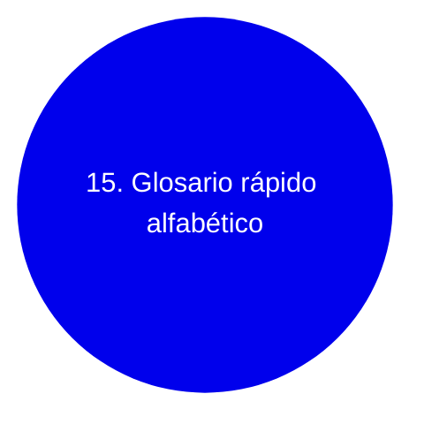


Para consulta rápida, los términos más usados en orden alfabético:

- **A\***: búsqueda informada óptima con $f(n) = g(n) + h(n)$.
- **ADL**: extensión expresiva de STRIPS.
- **ALC**: lógica de descripción base.
- **BDI**: Belief-Desire-Intention.
- **BFS**: Breadth-First Search.
- **CSP**: Constraint Satisfaction Problem.
- **CWA**: Closed World Assumption.
- **DFS**: Depth-First Search.
- **FF**: Fast-Forward planner.
- **FMAP**: Forward Multi-Agent Planning.
- **FOL**: First-Order Logic.
- **GOAP**: Goal-Oriented Action Planning.
- **HMM**: Hidden Markov Model.
- **HTN**: Hierarchical Task Network.
- **IDA\***: Iterative Deepening A\*.
- **IDS**: Iterative Deepening Search.
- **IPC**: International Planning Competition.
- **LAMA**: planificador basado en landmarks.
- **MAS**: Multi-Agent System.
- **MCTS**: Monte Carlo Tree Search.
- **MDP**: Markov Decision Process.
- **PBMA**: Planificación POR Múltiples Agentes.
- **PDDL**: Planning Domain Definition Language.
- **PGP**: Partial Global Planning.
- **POMDP**: Partially Observable MDP.
- **POP**: Partial-Order Planning.
- **PTMA**: Planificación PARA Múltiples Agentes.
- **SHOP**: Simple Hierarchical Ordered Planner.
- **STRIPS**: Stanford Research Institute Problem Solver.
- **UCS**: Uniform Cost Search.
- **VAL**: validador de planes PDDL.

## 16. Referencias y lecturas recomendadas

#### Mapa mental de la sección

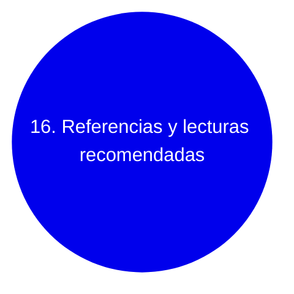


**Textos canónicos:**

- Russell, S. y Norvig, P. *Artificial Intelligence: A Modern Approach*
  (4.ª ed., 2020). Capítulos 3-11 (búsqueda y planificación) y 17 (decisión
  bajo incertidumbre).
- Ghallab, M., Nau, D. y Traverso, P. *Automated Planning: Theory and
  Practice* (2004). Texto de referencia específico.
- Ghallab, M., Nau, D. y Traverso, P. *Automated Planning and Acting*
  (2016). Continuación que integra ejecución y reactividad.

**Artículos seminales:**

- Fikes, R. y Nilsson, N. (1971). *STRIPS: A New Approach to the Application
  of Theorem Proving to Problem Solving*. Artificial Intelligence, 2(3-4).
- Hoffmann, J. y Nebel, B. (2001). *The FF Planning System*. JAIR.
- Helmert, M. (2006). *The Fast Downward Planning System*. JAIR.
- Richter, S. y Westphal, M. (2010). *The LAMA Planner*. JAIR.
- Orkin, J. (2006). *Three States and a Plan: The AI of F.E.A.R.* GDC.
- Erol, K., Hendler, J. y Nau, D. (1994). *HTN Planning: Complexity and
  Expressivity*. AAAI.

**Avances recientes (LLMs y planificación, 2023-2026):**

- Valmeekam, K. et al. (2023). *PlanBench: An Extensible Benchmark for
  Evaluating Large Language Models on Planning and Reasoning about Change*.
  NeurIPS.
- Liu, B. et al. (2023). *LLM+P: Empowering Large Language Models with
  Optimal Planning Proficiency*.
- Corrêa, A. B., Pereira, A. G. y Seipp, J. (2025). *The 2025 Planning
  Performance of Frontier Large Language Models*. arXiv:2511.09378.

**Recursos online:**

- [planning.wiki](https://planning.wiki/) — Documentación comunitaria.
- [editor.planning.domains](https://editor.planning.domains/) — Editor PDDL
  online con planificadores integrados.
- [ICAPS](https://www.icaps-conference.org/) — Conferencia principal del
  campo.
- [Fast Downward](https://www.fast-downward.org/) — Plataforma open-source.

**Filosofía relevante a la IA:**

- Turing, A. (1950). *Computing Machinery and Intelligence*. Mind, 59(236).
- Newell, A. y Simon, H. (1976). *Computer Science as Empirical Inquiry:
  Symbols and Search*. Communications of the ACM, 19(3).
- Searle, J. (1980). *Minds, Brains, and Programs*. Behavioral and Brain
  Sciences, 3(3).
- Dennett, D. (1987). *The Intentional Stance*. MIT Press.
- Pearl, J. y Mackenzie, D. (2018). *The Book of Why: The New Science of
  Cause and Effect*. Basic Books.
- [Webdianoia](https://www.webdianoia.com/glosario/) — Glosario filosófico
  general en español, útil como referencia complementaria.


## Apéndice: mapas mentales integradores

### Mapa global del glosario

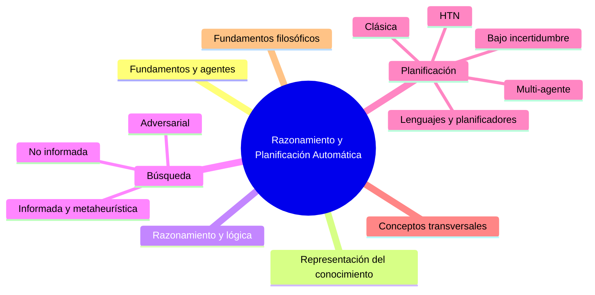

### Mapa de flujo conceptual (de teoría a práctica)

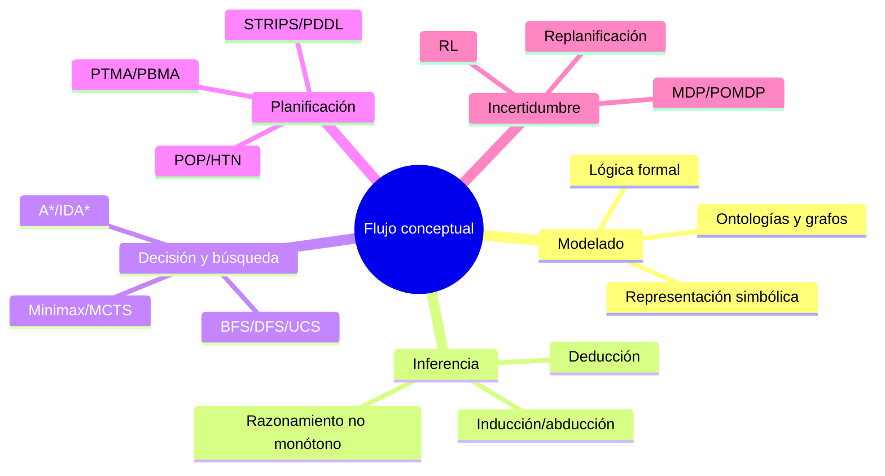

### Mapa de conexiones críticas

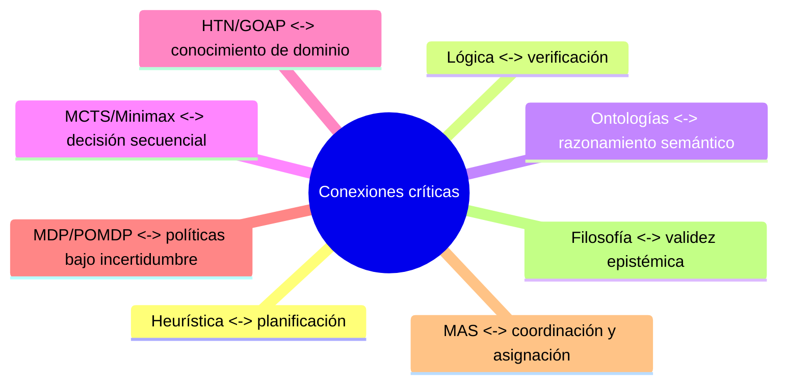
