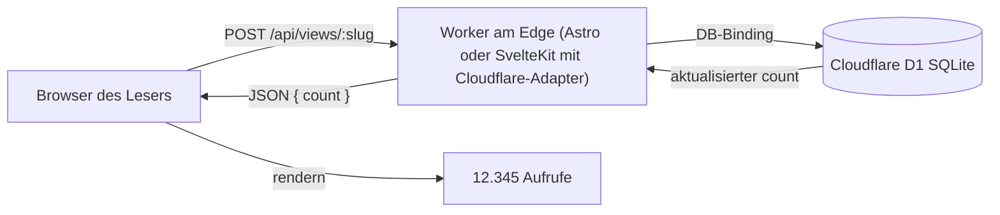

import Aside from "@rgglez/astro-aside";
import DownloadChecklist from "@rgglez/astro-downloadchecklist";

## Einführung

Es gab eine Zeit, vor Google Analytics und vor Produkt-Dashboards, in der fast jede Website stolz einen kleinen Zähler am Seitenende zeigte: _„Du bist Besucher Nummer 12.345“_. Diese **Old-School**-Zähler verfolgten keine Personen, erstellten keine Zielgruppenprofile und sendeten keine Daten an Dritte. Sie zählten nur Impressionen und zeigten eine ehrliche Zahl.

Diese Anleitung beschreibt, wie du diese Idee für einen modernen Blog auf **Cloudflare** nachbauen kannst: einen **Impressions**- oder **Aufrufzähler** pro Artikel, persistent in einer Datenbank gespeichert, ohne separaten Server, praktisch ohne Kosten und ohne die Privatsphäre der Leser zu opfern.

Als Speicher dient <a href="https://developers.cloudflare.com/d1/" target="_blank">**Cloudflare D1**</a>, eine verwaltete **SQLite**-Datenbank, die am Edge läuft und über ein _Binding_ mit deinem Worker verbunden wird. D1 wurde statt <a href="https://developers.cloudflare.com/kv/" target="_blank">**KV**</a> gewählt, weil KV keinen atomaren Inkrementbefehl hat und bei gleichzeitigem Traffic Zählungen verlieren würde. D1 führt `count = count + 1` atomar in einer einzigen SQL-Anweisung aus.

Die Anleitung behandelt **zwei Implementierungen** desselben Musters:

- **Astro** (konkret ein Blog im Stil von **AstroPaper**) mit dem Adapter `@astrojs/cloudflare` und `output: 'server'`.
- **SvelteKit** mit dem Adapter `@sveltejs/adapter-cloudflare`, ebenfalls in SSR.

In beiden Fällen hat das Ergebnis diese Eigenschaften:

- Der Zähler lebt in einem eigenen Endpoint desselben Projekts; es gibt keinen separaten Server und kein separates Deployment.
- Die Website braucht kein zusätzliches SSR: Wenn du bereits mit einem Cloudflare-Adapter arbeitest, verwendet der Endpoint denselben Worker.
- Der Nutzer wird nicht getrackt, es gibt keine Third-Party-Cookies und keine persistenten IDs; es wird nur eine Impression gezählt.
- Das Inkrement ist atomar, sodass der Zähler bei Nebenläufigkeit nicht beschädigt wird.
- Für einen persönlichen Blog sind die Kosten effektiv null.

<Aside type="note" title="Was zählt dieser Zähler genau?">

Er zählt **Seitenimpressionen**, keine eindeutigen Nutzer. Das ist Absicht: Es geht darum, den klassischen, einfachen und ehrlichen Zähler nachzubauen. Weiter unten gibt es eine optionale Variante mit Deduplizierung per `localStorage`, damit Reloads desselben Besuchers nicht gezählt werden, sowie einen Hinweis zum Filtern von Bots. Wenn du Zielgruppenanalytik brauchst, ist das nicht die richtige Komponente; nutze ein datenschutzfreundliches Analytics-Werkzeug.

</Aside>

---

## Inhaltsverzeichnis

---

## Allgemeine Architektur

Das Muster ist in beiden Frameworks identisch. Es ändert sich nur, wie das Framework das D1-_Binding_ dem Endpoint-Code bereitstellt.



Der Ablauf bei jedem Laden eines Artikels:

1. Die Seite wird normal gerendert (statisch oder SSR, das spielt keine Rolle).
2. Ein kleines clientseitiges Script sendet beim Laden `POST /api/views/<slug>`.
3. Der Endpoint, innerhalb desselben Workers, führt ein atomares `UPSERT` in D1 aus und gibt die neue Summe zurück.
4. Das Script schreibt die Zahl in den DOM.

<Aside type="tip" title="Du musst SSR nicht nur dafür aktivieren">

Wenn deine Website vollständig statisch ist, funktioniert der Zähler trotzdem: Die **Seiten** können statisch sein, und nur der **Endpoint** des Zählers wird dynamisch bedient. In Astro geschieht das mit `export const prerender = false` in der Endpoint-Route. In SvelteKit ist eine `+server.ts`-Route von Natur aus dynamisch. Diese Anleitung setzt nur voraus, dass du mit einem der Adapter auf Cloudflare deployest; globales `output: 'server'` ist praktisch, aber nicht zwingend.

</Aside>

---

## Voraussetzungen

Verwende diese Checkliste vor der Implementierung:

<DownloadChecklist filename="checkliste-besucherzaehler-cloudflare-d1.csv">
  - [ ] Du hast einen Blog auf **Cloudflare Workers** (oder Pages) mit Astro +
  `@astrojs/cloudflare` oder mit SvelteKit + `@sveltejs/adapter-cloudflare`
  bereitgestellt. - [ ] Du hast **Wrangler** installiert und authentifiziert
  (`npx wrangler login`). - [ ] Dein Projekt deployt bereits korrekt, bevor du
  den Zähler hinzufügst. - [ ] Du kennst den **slug** oder eindeutigen
  Bezeichner jedes Artikels, der zur Renderzeit verfügbar ist (Frontmatter,
  Routenparameter usw.). - [ ] Du akzeptierst, dass der Anfangszähler bei null
  beginnt; es gibt keine historischen Daten zu importieren (falls doch, kannst
  du sie mit einem `INSERT` vorladen). - [ ] Du bist damit einverstanden,
  **Impressionen** zu zählen, keine eindeutigen Nutzer, es sei denn, du
  verwendest die unten beschriebene optionale Deduplizierung.
</DownloadChecklist>

<Aside type="caution" title="Der slug muss stabil und eindeutig sein">

Der `slug` ist der Primärschlüssel in D1. Wenn du den Slug eines Artikels umbenennst, beginnt der Zähler für diesen Artikel wieder bei null (die alte Zeile bleibt mit dem vorherigen Slug verwaist). Nutze einen Bezeichner, der sich nicht ändert: Der kanonische Post-Slug ist normalerweise geeignet.

</Aside>

<Aside type="tip" title="Nutzt du Bun? Ersetze npx durch bunx">

Die Befehle in dieser Anleitung verwenden `npx` (den Node-Runner). Wenn deine Umgebung <a href="https://bun.sh/" target="_blank">**Bun**</a> nutzt, kannst du `npx` in allen Befehlen ohne weitere Änderungen durch `bunx` ersetzen: zum Beispiel `bunx wrangler d1 create views` statt `npx wrangler d1 create views`. Beide laden das Wrangler-Binary herunter und führen es aus; `bunx` löst das Paket oft schneller auf.

</Aside>

---

## Kostet das etwas?

Für einen persönlichen Blog: **nein**. Die Limits des kostenlosen Cloudflare-Plans liegen weit über dem, was ein Besucherzähler verbraucht:

| Ressource             | Limit des kostenlosen Plans     | Verbrauch des Zählers          |
| --------------------- | ------------------------------- | ------------------------------ |
| Workers / Aufrufe     | 100.000 Requests/Tag            | 1 POST pro Artikelladung       |
| D1-Zeilenlesungen     | 5.000.000 gelesene Zeilen/Tag   | 1 Zeile pro Impression         |
| D1-Zeilenschreibungen | 100.000 geschriebene Zeilen/Tag | 1 Zeile pro Impression         |
| D1-Speicher           | 5 GB                            | eine winzige Zeile pro Artikel |

Eine einzige Zeile pro Artikel (Slug + Integer) wiegt nur wenige Bytes. Selbst ein Blog mit Zehntausenden täglichen Besuchen bleibt komfortabel im kostenlosen Plan. Wenn du ihn irgendwann überschreitest, berechnet der D1-Bezahlplan gelesene/geschriebene Zeilen und GB-Monate; für diesen Anwendungsfall sind das Cent-Beträge.

<Aside type="note" title="Ein Schreibvorgang pro Impression">

Das Basisdesign schreibt bei **jeder** Impression nach D1. Genau das hält den Zähler echtzeitnah und einfach. Wenn dein Traffic so hoch wäre, dass Schreibvorgänge relevant werden, wäre die richtige Gegenmaßnahme clientseitige Deduplizierung (weniger Schreibvorgänge) oder Batch-Aggregation; beides wird am Ende erwähnt. Ein typischer Blog braucht das nicht.

</Aside>

---

## D1-Datenbank erstellen

Dieser Schritt ist für Astro und SvelteKit **identisch**. Die Tabelle ist dieselbe.

Erstelle die Datenbank:

```bash
npx wrangler d1 create views
```

Wrangler gibt einen Block mit der `database_id` aus. Bewahre sie auf; du brauchst sie in `wrangler.jsonc`.

Erstelle die Tabelle. Es ist sinnvoll, sie in einer versionierten Schema-Datei zu speichern:

```sql title="schema.sql"
CREATE TABLE IF NOT EXISTS views (
  slug  TEXT PRIMARY KEY,
  count INTEGER NOT NULL DEFAULT 0
);
```

Wende sie zuerst remote an (die echte Datenbank, die dein deployed Worker nutzt):

```bash
npx wrangler d1 execute views --remote --file=./schema.sql
```

Und, falls du lokal mit `wrangler dev` entwickelst, auch auf die lokale Kopie:

```bash
npx wrangler d1 execute views --local --file=./schema.sql
```

<Aside type="tip" title="Hast du historische Zählstände zu migrieren?">

Wenn du von einem anderen Zähler kommst und die Zahlen erhalten möchtest, lade die Zeilen vor:

```sql
INSERT INTO views (slug, count) VALUES
  ('mein-erster-artikel', 4821),
  ('anderer-artikel', 1290)
ON CONFLICT(slug) DO UPDATE SET count = excluded.count;
```

</Aside>

---

## Teil 1: Astro (AstroPaper) in SSR mit dem Cloudflare-Adapter

Dieser Teil setzt einen Blog im Stil von **AstroPaper** mit `output: 'server'` und `adapter: cloudflare()` voraus.

### D1-Binding in wrangler deklarieren

Füge das Binding `DB` zu deinem `wrangler.jsonc` hinzu (neben `assets`, `compatibility_date` usw.):

```jsonc title="wrangler.jsonc"
{
  "name": "mein-blog",
  "compatibility_date": "2026-03-06",
  "compatibility_flags": ["nodejs_compat"],
  "assets": {
    "binding": "ASSETS",
    "directory": "./dist",
  },
  // [!code ++]
  "d1_databases": [
    // [!code ++]
    {
      // [!code ++]
      "binding": "DB",
      // [!code ++]
      "database_name": "views",
      // [!code ++]
      "database_id": "HIER-DIE-DATABASE-ID-EINFUEGEN",
      // [!code ++]
    },
    // [!code ++]
  ],
}
```

### Binding für TypeScript typisieren

In **Astro 6** (Adapter `@astrojs/cloudflare` 13.x) generierst du die Typen aus den in `wrangler.jsonc` deklarierten Bindings:

```bash
npx wrangler types
```

Das erzeugt eine Datei `worker-configuration.d.ts` mit dem globalen Interface `Env` (das dein `DB` bereits enthält) sowie den Definitionen des Moduls `cloudflare:workers`. Deine `tsconfig.json` nimmt die Datei über das übliche `include`-Muster auf.

<Aside type="tip" title="Typen bei Binding-Änderungen neu generieren">

Führe `npx wrangler types` jedes Mal erneut aus, wenn du Bindings in `wrangler.jsonc` änderst (D1-Datenbank, KV, Secret usw. hinzufügen). Sonst ist `worker-configuration.d.ts` veraltet, und TypeScript meldet Fehler oder sieht die neuen Bindings nicht.

</Aside>

<Aside type="caution" title="Breaking Change in Astro 6: Schluss mit Astro.locals.runtime.env">

Wenn du aus älteren Anleitungen oder Projekten kommst, kennst du vielleicht das Muster `Astro.locals.runtime.env.DB` mit einer `env.d.ts`, die `interface Locals extends Runtime<Env>` deklarierte. **In Astro 6 wurde das entfernt**: `Astro.locals.runtime.env` existiert nicht mehr und wirft zur Laufzeit einen Fehler. Der Zugriff auf Bindings erfolgt jetzt durch Import von `env` aus dem Modul `cloudflare:workers`, wie der Endpoint unten zeigt. Weitere Entsprechungen: `Astro.request.cf` (früher `runtime.cf`), das globale `caches` (früher `runtime.caches`) und `Astro.locals.cfContext` (früher `runtime.ctx`).

</Aside>

### Der Zähler-Endpoint

Erstelle `src/pages/api/views/[slug].ts`. Ein einziger `POST` inkrementiert und gibt die Summe zurück:

```ts title="src/pages/api/views/[slug].ts"
import type { APIRoute } from "astro";
import { env } from "cloudflare:workers";

// Die Website kann statisch sein; dieser Endpoint muss dynamisch sein.
export const prerender = false;

export const POST: APIRoute = async ({ params }) => {
  const slug = params.slug;
  if (!slug) {
    return new Response("Slug fehlt", { status: 400 });
  }

  const db = env.DB;

  // Atomarer UPSERT: mit 1 einfügen oder 1 addieren, wenn die Zeile schon existiert.
  await db
    .prepare(
      "INSERT INTO views (slug, count) VALUES (?, 1) " +
        "ON CONFLICT(slug) DO UPDATE SET count = count + 1"
    )
    .bind(slug)
    .run();

  const row = await db
    .prepare("SELECT count FROM views WHERE slug = ?")
    .bind(slug)
    .first<{ count: number }>();

  return Response.json({ count: row?.count ?? 0 });
};

// Optional: lesen ohne zu inkrementieren (z. B. für eine Statistikseite).
export const GET: APIRoute = async ({ params }) => {
  const slug = params.slug;
  if (!slug) return new Response("Slug fehlt", { status: 400 });

  const row = await env.DB.prepare("SELECT count FROM views WHERE slug = ?")
    .bind(slug)
    .first<{ count: number }>();

  return Response.json({ count: row?.count ?? 0 });
};
```

### Die visuelle Komponente

Erstelle eine wiederverwendbare Komponente `src/components/ViewCounter.astro`, die den Slug entgegennimmt und die Zahl rendert:

```astro title="src/components/ViewCounter.astro"
---
interface Props {
  slug: string;
}
const { slug } = Astro.props;
---

<span class="view-counter" aria-live="polite">
  <span id="view-count" data-slug={slug}>…</span> Aufrufe
</span>

<script>
  function loadViewCount() {
    const el = document.getElementById("view-count");
    if (!el) return;
    const slug = el.dataset.slug;
    fetch(`/api/views/${slug}`, { method: "POST" })
      .then(r => r.json() as Promise<{ count: number }>)
      .then(d => {
        el.textContent = new Intl.NumberFormat().format(d.count);
      })
      .catch(() => {
        el.textContent = "—";
      });
  }
  // astro:page-load läuft beim ersten Laden und nach jeder ClientRouter-Navigation.
  document.addEventListener("astro:page-load", loadViewCount);
</script>
```

<Aside type="caution" title="Wenn du View Transitions (ClientRouter) nutzt, höre auf astro:page-load">

Astro-Modul-`<script>`-Blöcke laufen **nur einmal** beim vollständigen Laden der Seite. Wenn deine Website den <a href="https://docs.astro.build/en/guides/view-transitions/" target="_blank">`ClientRouter`</a> (View Transitions) nutzt, wird beim Navigieren zwischen Artikeln der DOM ohne Reload ersetzt, und das Script **läuft nicht erneut**: Der Zähler bleibt bei `…`, bis du manuell neu lädst (F5). Die Lösung ist, die Logik in eine Funktion zu kapseln und sie über das Event `astro:page-load` auszulösen, das sowohl beim ersten Laden als auch nach jeder Navigation emittiert wird. Suche das Element innerhalb der Funktion erneut, weil der vorherige Knoten nach dem _swap_ nicht mehr existiert. Wenn deine Website **keine** View Transitions nutzt, reicht ein direkter Aufruf von `loadViewCount()`.

</Aside>

Verwende sie im Artikel-Layout (in AstroPaper typischerweise `src/layouts/PostDetails.astro` oder ähnlich) und übergib den Slug des Posts:

```astro
---
import ViewCounter from "@/components/ViewCounter.astro";
// `post` ist der Artikel-Eintrag in deinem Layout.
---

<ViewCounter slug={post.id} />
```

<Aside type="caution" title="Was in AstroPaper als slug übergeben wird">

Je nach AstroPaper-Version und Astro-Collections-API kann der Post-Bezeichner in `post.id`, `post.slug` liegen oder aus der Route abgeleitet werden. Verwende denselben Wert, den du bereits zum Erzeugen der Artikel-URL nutzt, damit der Slug zwischen öffentlicher URL und D1-Schlüssel konsistent bleibt.

</Aside>

---

## Teil 2: SvelteKit mit dem Cloudflare-Adapter in SSR

Das Muster ist dasselbe; die Framework-Mechanik ändert sich. SvelteKit stellt Cloudflare-Bindings über `event.platform.env` bereit.

### Adapter und Binding

Stelle sicher, dass du `@sveltejs/adapter-cloudflare` in `svelte.config.js` verwendest:

```js title="svelte.config.js"
import adapter from "@sveltejs/adapter-cloudflare";
import { vitePreprocess } from "@sveltejs/vite-plugin-svelte";

export default {
  preprocess: vitePreprocess(),
  kit: {
    adapter: adapter(),
  },
};
```

Deklariere das Binding `DB` wie zuvor in `wrangler.jsonc`:

```jsonc title="wrangler.jsonc"
{
  "name": "mein-sveltekit-blog",
  "compatibility_date": "2026-03-06",
  "compatibility_flags": ["nodejs_compat"],
  "d1_databases": [
    {
      "binding": "DB",
      "database_name": "views",
      "database_id": "HIER-DIE-DATABASE-ID-EINFUEGEN",
    },
  ],
}
```

### Plattform typisieren

In SvelteKit leben Bindings in `App.Platform`. Deklariere sie in `src/app.d.ts`:

```ts title="src/app.d.ts"
declare global {
  namespace App {
    interface Platform {
      env: {
        DB: D1Database;
      };
    }
  }
}

export {};
```

<Aside type="note" title="platform ist in manchen Kontexten undefined">

`event.platform` ist nur verfügbar, wenn der Code in der Cloudflare-Runtime läuft (Deployment oder `wrangler dev` / `vite dev` mit konfiguriertem Adapter). Deshalb prüft der Endpoint seine Existenz, bevor er es verwendet. In reinem `vite dev` ohne Plattform-Emulation kann `platform` `undefined` sein.

</Aside>

### Der Zähler-Endpoint

Erstelle `src/routes/api/views/[slug]/+server.ts`:

```ts title="src/routes/api/views/[slug]/+server.ts"
import { json, error } from "@sveltejs/kit";
import type { RequestHandler } from "./$types";

export const POST: RequestHandler = async ({ params, platform }) => {
  const db = platform?.env.DB;
  if (!db) throw error(500, "D1-Binding nicht verfügbar");

  const slug = params.slug;

  await db
    .prepare(
      "INSERT INTO views (slug, count) VALUES (?, 1) " +
        "ON CONFLICT(slug) DO UPDATE SET count = count + 1"
    )
    .bind(slug)
    .run();

  const row = await db
    .prepare("SELECT count FROM views WHERE slug = ?")
    .bind(slug)
    .first<{ count: number }>();

  return json({ count: row?.count ?? 0 });
};

export const GET: RequestHandler = async ({ params, platform }) => {
  const db = platform?.env.DB;
  if (!db) throw error(500, "D1-Binding nicht verfügbar");

  const row = await db
    .prepare("SELECT count FROM views WHERE slug = ?")
    .bind(params.slug)
    .first<{ count: number }>();

  return json({ count: row?.count ?? 0 });
};
```

### Die visuelle Komponente

Erstelle `src/lib/components/ViewCounter.svelte`:

```svelte title="src/lib/components/ViewCounter.svelte"
<script lang="ts">
  import { onMount } from "svelte";

  export let slug: string;

  let count: number | null = null;

  onMount(async () => {
    try {
      const r = await fetch(`/api/views/${slug}`, { method: "POST" });
      const d = (await r.json()) as { count: number };
      count = d.count;
    } catch {
      count = null;
    }
  });
</script>

<span aria-live="polite">
  {count === null ? "—" : new Intl.NumberFormat().format(count)} Aufrufe
</span>
```

Verwende sie auf der Artikelseite (`src/routes/blog/[slug]/+page.svelte` oder dort, wo du den Post renderst):

```svelte
<script lang="ts">
  import ViewCounter from "$lib/components/ViewCounter.svelte";
  export let data; // kommt aus deinem +page.ts / load
</script>

<ViewCounter slug={data.post.slug} />
```

<Aside type="tip" title="Svelte 5 mit Runes">

Die Komponente nutzt aus Kompatibilitätsgründen die klassische Syntax `export let` / `onMount`. Wenn du Svelte 5 mit Runes verwendest, kannst du sie mit `$props()` und `$state()` umschreiben; die Fetch-Logik bleibt identisch.

</Aside>

---

## Optionale visuelle Anpassung

Die ehrliche Zahl reicht bereits aus, aber ein Teil des Charmes alter Besucherzähler war ihr Aussehen: weiße Ziffern auf schwarzem Grund, LED-Display-Stil oder mechanische Zählwerk-Optik. Es gibt zwei Wege dahin.

<Aside type="tip" title="Empfehlung: CSS verwenden, keine Bilder">

Für fast jeden Fall ist **CSS die beste Option**. Die Zahl bleibt echter Text, skaliert also auf jedem Bildschirm scharf, ist für Screenreader zugänglich, kann markiert und kopiert werden, fügt keine HTTP-Requests hinzu und erfordert keine Sprites zum Vorladen oder Pflegen. Verwende Ziffernbilder nur, wenn du einen sehr spezifischen Pixel-Art-Stil möchtest, den CSS nicht reproduzieren kann.

</Aside>

### Option A (empfohlen): LED-Stil mit CSS

Gib dem Zähler mit einer Monospace-Schrift, dunklem Hintergrund und leichtem Leuchten ein digitales Display-Aussehen. Die Komponente ändert sich nicht: Du fügst nur Styles hinzu. Für das `<span class="view-counter">` der Astro-Komponente (oder das `<span>` der Svelte-Komponente) ergänzt du:

```css title="Zähler-Styles (LED)"
.view-counter {
  display: inline-flex;
  align-items: center;
  gap: 0.35em;
  font-family: "Courier New", ui-monospace, monospace;
  font-weight: 700;
  letter-spacing: 0.08em;
  padding: 0.15em 0.5em;
  border-radius: 0.25em;
  background: #000;
  color: #00ff6a; /* klassisches Phosphorgrün */
  text-shadow: 0 0 6px #00ff6a; /* LED-Leuchten */
}
```

Für das klassische **Weiß auf Schwarz** aus dem Anhang änderst du `color: #fff` und entfernst oder passt `text-shadow` an.

### Option A+: jede Ziffer in einem eigenen „Feld“

Die mechanische Zählwerk-Optik (jede Ziffer in einem eigenen schwarzen Feld) erfordert, jede Ziffer in ein eigenes Element einzuwickeln. Ändere das Rendering so, dass pro Ziffer ein `<span>` erzeugt wird, statt die rohe Zahl zu schreiben. In der Astro-Komponente:

```ts title="Komponenten-Script, Rendering pro Ziffer"
fetch(`/api/views/${slug}`, { method: "POST" })
  .then(r => r.json() as Promise<{ count: number }>)
  .then(d => {
    const digits = new Intl.NumberFormat().format(d.count);
    el.textContent = "";
    for (const ch of digits) {
      const span = document.createElement("span");
      span.className = /\d/.test(ch) ? "digit" : "sep";
      span.textContent = ch;
      el.appendChild(span);
    }
  });
```

Mit dem passenden CSS:

```css title="Felder pro Ziffer"
.view-counter :global(.digit) {
  display: inline-block;
  min-width: 1ch;
  padding: 0.1em 0.25em;
  margin: 0 1px;
  text-align: center;
  background: #111;
  color: #fff;
  border-radius: 3px;
  box-shadow: inset 0 0 0 1px #333;
}
.view-counter :global(.sep) {
  /* Tausendertrennzeichen */
  padding: 0 0.1em;
  color: #888;
}
```

<Aside type="caution" title="In Astro sind Styles scoped: nutze :global für die Ziffern">

`<style>`-Blöcke einer Astro-Komponente sind standardmäßig **scoped**: Astro fügt nur den Elementen im _Template_ ein Hash-Attribut hinzu. Da die Felder `.digit` und `.sep` per JavaScript mit `document.createElement` erzeugt werden, erhalten sie dieses Hash **nicht**, und scoped CSS greift nicht (du würdest die Zahl sehen, aber ohne Felder). Deshalb werden Selektoren für dynamisch erzeugte Kinder in `:global(...)` eingeschlossen, während der Container `.view-counter` —der im Template steht— scoped bleibt. Dasselbe gilt für `.digit-img` in Option B. Wenn du stattdessen globales CSS nutzt (ein Site-Stylesheet, kein Komponenten-`<style>`), betrifft dich das nicht.

</Aside>

<Aside type="note" title="Hinweis zur Barrierefreiheit">

Auch wenn du die Zahl in Felder aufteilst, bleibt sie Text: Ein Screenreader liest sie als Ganzes, wenn du `aria-live="polite"` der Komponente beibehältst. Damit er die Zahl nicht Ziffer für Ziffer buchstabiert, kannst du die Gruppe einwickeln und den vollständigen Wert per `aria-label` am Container bereitstellen.

</Aside>

### Option B: Bilder für die Ziffern (die Retro-Methode)

Das ist die ursprüngliche Methode der Neunziger: ein Bild pro Ziffer (`0.gif` … `9.gif`) oder ein einzelnes _Sprite_ mit allen zehn Ziffern, und die Zahl wird zusammengesetzt, indem für jede Ziffer das passende Bild platziert wird. Das reproduziert exakte Pixel-Art, die CSS nicht immer nachahmen kann, hat aber Nachteile:

- Jede Ziffer ist ein Bild: Auf hochauflösenden Displays skaliert es nicht scharf, sofern du keine @2x-Versionen vorbereitest.
- Die Zahl ist kein auswählbarer Text mehr; du musst einen `alt`/`aria-label`-Wert setzen, damit die Zugänglichkeit erhalten bleibt.
- Es fügt HTTP-Requests und Sprites hinzu, die gepflegt und vorgeladen werden müssen.

Wenn du es aus ästhetischen Gründen trotzdem möchtest, platziert das Rendering ein `` pro Ziffer:

```ts title="Komponenten-Script, Ziffern als Bilder"
fetch(`/api/views/${slug}`, { method: "POST" })
  .then(r => r.json() as Promise<{ count: number }>)
  .then(d => {
    const n = String(d.count); // ohne Trennzeichen, einfacher
    el.textContent = "";
    el.setAttribute("aria-label", `${n} Aufrufe`);
    for (const ch of n) {
      const img = document.createElement("img");
      img.src = `/counter/${ch}.gif`; // 0.gif … 9.gif in /public/counter/
      img.alt = ""; // dekorativ; aria-label trägt den Wert
      img.className = "digit-img";
      el.appendChild(img);
    }
  });
```

```css title="Ziffernbilder"
.view-counter :global(.digit-img) {
  height: 1.2em;
  width: auto;
  image-rendering: pixelated; /* erhält scharfe Pixel-Art-Kanten beim Skalieren */
  vertical-align: middle;
}
```

Lege deine Dateien `0.gif`…`9.gif` in `public/counter/` (Astro) oder `static/counter/` (SvelteKit), damit sie als statische Assets ausgeliefert werden.

<Aside type="caution" title="Scharfe Kanten vs. Gewicht">

`image-rendering: pixelated` verhindert Unschärfe beim Skalieren von Pixel-Art, macht aus einem kleinen Bild aber keine echte hohe Auflösung. Wenn Schärfe auf Retina-Displays wichtig ist, exportiere die Ziffern doppelt so groß und zeige sie halb so groß an. An diesem Punkt liefert CSS meist bessere Ergebnisse mit weniger Arbeit.

</Aside>

---

## Optionale Variante: Reloads desselben Besuchers nicht zählen

Das Basisdesign zählt **jede** Impression, einschließlich Reloads. Um näher an „Aufrufe“ heranzukommen, ohne den Nutzer zu tracken, markierst du in `localStorage`, dass dieser Browser diesen Artikel bereits gezählt hat. Das ist rein lokale Deduplizierung: keine Cookies, keine IDs, keine Daten an Dritte.

Ersetze den `fetch`-Aufruf durch:

```js
const key = `viewed:${slug}`;
if (!localStorage.getItem(key)) {
  localStorage.setItem(key, "1");
  fetch(`/api/views/${slug}`, { method: "POST" })
    .then(r => r.json())
    .then(d => {
      /* d.count rendern */
    });
} else {
  // Wurde schon gezählt: nur die Summe lesen, ohne zu inkrementieren.
  fetch(`/api/views/${slug}`)
    .then(r => r.json())
    .then(d => {
      /* d.count rendern */
    });
}
```

<Aside type="caution" title="localStorage ist nicht narrensicher">

`localStorage` wird mit den Browserdaten gelöscht, wird nicht zwischen Geräten geteilt und existiert für manche Bots nicht. Das ist keine strenge Zählung eindeutiger Nutzer; es ist eine günstige Verbesserung, um die Zahl nicht durch Reloads aufzublähen. Für den „Old-School“-Geist reicht das völlig aus.

</Aside>

---

## Grundlegende Härtung

Einige optionale Maßnahmen, geordnet nach tatsächlichem Nutzen für einen Blog:

- **Offensichtliche Bots filtern.** Da die Zählung durch clientseitiges JavaScript ausgelöst wird, aktivieren die meisten einfachen Crawler sie bereits nicht (sie führen das Script nicht aus). Für solche, die es doch tun, kannst du im Endpoint den `User-Agent` prüfen und das Inkrement für bekannte Bot-Muster auslassen. Perfektion ist nicht zu erwarten.
- **Slug validieren.** Akzeptiere nur Slugs, die wirklich existieren, damit niemand mit `POST /api/views/irgendwas` Müllzeilen aufbläht. Wenn du eine Liste veröffentlichter Slugs hast, lehne alles ab, was nicht darin steht; oder beschränke das Format mit einem einfachen regulären Ausdruck.
- **Rate Limiting.** Für absichtlichen Missbrauch bietet Cloudflare <a href="https://developers.cloudflare.com/waf/rate-limiting-rules/" target="_blank">Rate-Limiting-Regeln</a> am Edge für die Route `/api/views/*`, ohne deinen Code anzufassen.
- **Schreibvorgänge bei Skalierung reduzieren.** Falls das Volumen es irgendwann rechtfertigt, dedupliziere pro Client (vorheriger Abschnitt) oder sammle Inkremente in Speicher/KV und schreibe sie in Batches nach D1. Für fast jeden Blog ist das voreilige Optimierung; tue es erst, wenn Messungen zeigen, dass es nötig ist.

---

## Troubleshooting

**Die Zahl erscheint als „—“ oder ändert sich nicht.**
Öffne die Browser-Konsole und den Netzwerk-Tab. Prüfe, ob `POST /api/views/<slug>` mit `200` und `{ "count": N }` antwortet. Ein `500` bedeutet meistens, dass das Binding `DB` den Endpoint nicht erreicht hat.

**`env.DB is undefined` (Astro) oder `platform is undefined` (SvelteKit).**
Das Binding ist nicht verbunden. Prüfe, ob `d1_databases` mit der richtigen `database_id` in `wrangler.jsonc` steht, ob der Name des `binding` mit dem im Code verwendeten Namen (`DB`) übereinstimmt, ob du neu deployed hast und —in der Entwicklung— ob du mit dem Cloudflare-Adapter läufst (nicht mit einem `dev` ohne Plattform-Emulation).

**`Property 'runtime' does not exist on type 'Locals'` (Astro).**
Du verwendest das alte Muster `Astro.locals.runtime.env`, das in Astro 6 entfernt wurde. Importiere `env` aus `cloudflare:workers` (siehe Endpoint) und generiere die Typen mit `npx wrangler types`.

**`no such table: views`.**
Du hast das Schema nicht in der Umgebung angewendet, die du gerade triffst. Denke daran, dass `--local` und `--remote` verschiedene Datenbanken sind: Führe `schema.sql` je nach Bedarf in beiden aus.

**Es funktioniert lokal, aber nicht in Produktion (oder umgekehrt).**
Fast immer ist es dasselbe `--local`-vs.-`--remote`-Problem. Die lokale Datenbank von `wrangler dev` ist nicht die Datenbank, die dein deployed Worker verwendet.

**Der Zähler steigt in Zweierschritten.**
In der Entwicklung können React _Strict Mode_ (falls du ihn in Astro-Islands nutzt) oder ein doppeltes Mounting zwei `fetch`-Aufrufe auslösen. In Produktion passiert das nicht; wenn es dich in dev stört, nutze die Variante mit `localStorage`.

---

## Fazit

Den Old-School-Besucherzähler auf Cloudflare nachzubauen ist überraschend direkt: eine D1-Tabelle mit einer Zeile pro Artikel, ein Endpoint mit atomarem `UPSERT` und ein clientseitiges Script von etwa zehn Zeilen. Es braucht keinen separaten Server, SSR muss nicht nur dafür aktiviert werden, und die Kosten sind in der Praxis null.

Dasselbe Muster funktioniert für **Astro** und **SvelteKit**; nur die Art ändert sich, wie das Framework dir das D1-Binding bereitstellt: `import { env } from "cloudflare:workers"` in Astro 6, `platform.env` in SvelteKit. Die Datenbanklogik —SQL-Anweisung, atomares Inkrement, Lesen der Summe— ist in beiden Fällen exakt gleich.

Und dem ursprünglichen Geist treu zählt der Zähler Impressionen ehrlich und ohne irgendwen zu tracken: eine einfache Zahl am Ende des Artikels, wie früher.

## Anhang: Berechtigungen des Cloudflare-API-Tokens

Die Operationen in **dieser** Anleitung —D1-Datenbank erstellen und das Schema mit Wrangler anwenden— berühren nur **D1**. Sie benötigen keine Berechtigungen für Workers, DNS oder andere Teile des Kontos.

Wenn du `wrangler login` verwendest (interaktiver OAuth-Flow), holt Wrangler die Berechtigungen für dich ein, und du **musst kein Token erstellen**. Dieser Anhang gilt, wenn du lieber ein explizites **API-Token** verwendest, zum Beispiel um Wrangler in einer nicht interaktiven Umgebung oder mit eingeschränkten Zugangsdaten auszuführen.

### Minimal notwendige Berechtigung

Die Operation ähnelt der in <a href="https://rodolfo.gg/de/posts/2026/04/sveltekit-cloudflare-workers-deployen/" target="_blank">diesem Beitrag</a> über das Deployment von SvelteKit auf Cloudflare beschriebenen.

Für D1 ist die minimale Berechtigung:

| Operation der Anleitung           | Befehl                                                   | Erforderliche Berechtigung |
| --------------------------------- | -------------------------------------------------------- | -------------------------- |
| Datenbank erstellen               | `wrangler d1 create views`                               | **Account → D1 → Edit**    |
| Schema anwenden (remote)          | `wrangler d1 execute views --remote --file=./schema.sql` | **Account → D1 → Edit**    |
| Zeilen vorladen/abfragen (remote) | `wrangler d1 execute ... --command "..."`                | **Account → D1 → Edit**    |

Das reicht. `Edit` umfasst Lesen und Schreiben in D1; du brauchst keine separate Leseberechtigung. `--local`-Operationen berühren die Cloudflare-API nicht (sie laufen gegen eine lokale Kopie auf der Festplatte) und verbrauchen daher keine Token-Berechtigungen.


### Token erstellen

1. Gehe zu <a href="https://dash.cloudflare.com/profile/api-tokens" target="_blank">**My Profile → API Tokens**</a> und wähle **Create Token → Create Custom Token**.
2. Füge unter **Permissions** eine Zeile hinzu: `Account` · `D1` · `Edit`.
3. Wähle unter **Account Resources** **Include → dein Konto** (nicht „All accounts“).
4. Optional, aber empfohlen: Setze eine **TTL** (Ablaufdatum) und beschränke das Token, falls dein Netzwerk fest ist, über **Client IP Address Filtering**.
5. Erstelle das Token und **kopiere es genau einmal**; Cloudflare zeigt es nicht erneut an.

### Token mit Wrangler verwenden

Wrangler liest das Token aus der Umgebungsvariable `CLOUDFLARE_API_TOKEN`. Für D1-Befehle ist es außerdem sinnvoll, `CLOUDFLARE_ACCOUNT_ID` zu setzen (sichtbar im Dashboard deines Kontos):

```bash
export CLOUDFLARE_API_TOKEN="dein-auf-D1-Edit-beschraenktes-token"
export CLOUDFLARE_ACCOUNT_ID="deine-account-id"

npx wrangler d1 create views
npx wrangler d1 execute views --remote --file=./schema.sql
```

<Aside type="caution" title="Minimale Rechte und Umgang mit dem Token">

Gib dem Token nur `D1 → Edit` und beschränke es auf dein Konto; selbst wenn es durchsickert, kann es dann weder Workers noch DNS noch andere Ressourcen ändern. Schreibe es nicht ins Repository und nicht in `wrangler.jsonc`: Übergib es per Umgebungsvariable oder über den _Secret Store_ deiner Umgebung (in CI als Pipeline-_Secret_). Wenn du eine Offenlegung vermutest, **widerrufe es** im selben API-Tokens-Panel und erzeuge ein neues.

</Aside>

<Aside type="note" title="Das Deployment-Token ist ein anderes Thema">

Das Token (oder die Integration), das den Blog aus GitHub deployed, braucht andere Berechtigungen (typischerweise Workers/Pages) und wird hier nicht behandelt. Sie **getrennt** zu halten —ein Token für D1, ein anderes für das Deployment— ist genau der Vorteil des Prinzips minimaler Rechte.

</Aside>

---

## Referenzen

- Cloudflare. (2026). _D1: Cloudflare's native serverless SQL database_. Cloudflare Docs. <a href="https://developers.cloudflare.com/d1/" target="_blank" rel="noopener noreferrer">https://developers.cloudflare.com/d1/</a>
- Cloudflare. (2026). _D1 Workers Binding API (prepare, bind, run, first)_. Cloudflare Docs. <a href="https://developers.cloudflare.com/d1/worker-api/" target="_blank" rel="noopener noreferrer">https://developers.cloudflare.com/d1/worker-api/</a>
- Cloudflare. (2026). _Wrangler commands: d1 create / d1 execute_. Cloudflare Docs. <a href="https://developers.cloudflare.com/workers/wrangler/commands/#d1" target="_blank" rel="noopener noreferrer">https://developers.cloudflare.com/workers/wrangler/commands/#d1</a>
- Cloudflare. (2026). _Create API token and token permissions_. Cloudflare Docs. <a href="https://developers.cloudflare.com/fundamentals/api/get-started/create-token/" target="_blank" rel="noopener noreferrer">https://developers.cloudflare.com/fundamentals/api/get-started/create-token/</a>
- Cloudflare. (2026). _Pricing: Workers & D1 free tier limits_. Cloudflare Docs. <a href="https://developers.cloudflare.com/d1/platform/pricing/" target="_blank" rel="noopener noreferrer">https://developers.cloudflare.com/d1/platform/pricing/</a>
- Astro. (2026). _Cloudflare adapter (@astrojs/cloudflare): accessing the runtime_. Astro Docs. <a href="https://docs.astro.build/en/guides/integrations-guide/cloudflare/" target="_blank" rel="noopener noreferrer">https://docs.astro.build/en/guides/integrations-guide/cloudflare/</a>
- Astro. (2026). _Endpoints and on-demand rendering (prerender)_. Astro Docs. <a href="https://docs.astro.build/en/guides/endpoints/" target="_blank" rel="noopener noreferrer">https://docs.astro.build/en/guides/endpoints/</a>
- SvelteKit. (2026). _adapter-cloudflare and platform.env bindings_. Svelte Docs. <a href="https://svelte.dev/docs/kit/adapter-cloudflare" target="_blank" rel="noopener noreferrer">https://svelte.dev/docs/kit/adapter-cloudflare</a>
- SvelteKit. (2026). _Server routes (+server.js)_. Svelte Docs. <a href="https://svelte.dev/docs/kit/routing#server" target="_blank" rel="noopener noreferrer">https://svelte.dev/docs/kit/routing#server</a>
- SQLite. (2026). _UPSERT (ON CONFLICT ... DO UPDATE)_. SQLite Documentation. <a href="https://www.sqlite.org/lang_upsert.html" target="_blank" rel="noopener noreferrer">https://www.sqlite.org/lang_upsert.html</a>
