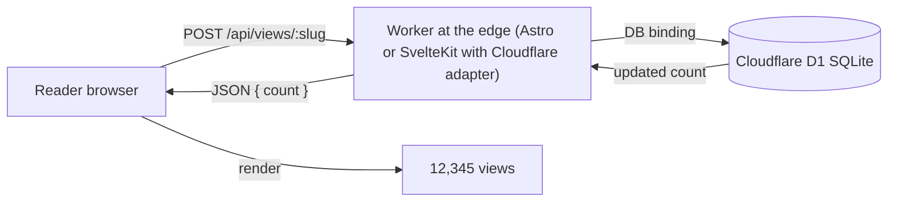

import Aside from "@rgglez/astro-aside";
import DownloadChecklist from "@rgglez/astro-downloadchecklist";

## Introduction

There was a time, before Google Analytics and before product dashboards, when almost every website proudly displayed a small counter at the bottom of the page: _"You are visitor number 12,345"_. Those **old-school** counters did not track people, did not profile audiences, and did not send data to third parties. They only counted impressions and displayed an honest number.

This guide explains how to recreate that idea for a modern blog deployed on **Cloudflare**: a per-article **impression** or **view** counter, persisted in a database, without a separate server, effectively at no cost and without sacrificing reader privacy.

Storage will be <a href="https://developers.cloudflare.com/d1/" target="_blank">**Cloudflare D1**</a>, a managed **SQLite** database that runs at the edge and connects to your Worker through a _binding_. D1 was chosen instead of <a href="https://developers.cloudflare.com/kv/" target="_blank">**KV**</a> because KV has no atomic increment, so under concurrent traffic it would lose counts. D1 performs `count = count + 1` atomically in a single SQL statement.

The guide covers **two implementations** of the same pattern:

- **Astro** (specifically an **AstroPaper**-style blog) with the `@astrojs/cloudflare` adapter and `output: 'server'`.
- **SvelteKit** with the `@sveltejs/adapter-cloudflare` adapter, also running in SSR.

In both cases, the result has these properties:

- The counter lives in a project-owned endpoint; there is no separate server or deployment.
- The site does not need additional SSR: if you already run with a Cloudflare adapter, the endpoint reuses that same Worker.
- The user is not tracked, and there are no third-party cookies or persistent IDs; only one impression is counted.
- The increment is atomic, so the count is not corrupted under concurrency.
- For a personal blog, the cost is effectively zero.

<Aside type="note" title="What exactly does this counter count?">

It counts **page impressions**, not unique users. That is deliberate: it recreates the classic, simple, honest counter. An optional `localStorage` deduplication variant appears below to avoid counting reloads by the same visitor, plus a note about filtering bots. If what you need is audience analytics, this is not the right component; use a privacy-respecting analytics tool.

</Aside>

---

## Table of contents

---

## General architecture

The pattern is identical in both frameworks. Only the way the framework exposes the D1 _binding_ to the endpoint code changes.



The flow on each article load:

1. The page renders normally (static or SSR, it does not matter).
2. A small client-side script sends `POST /api/views/<slug>` on load.
3. The endpoint, inside the same Worker, runs an atomic `UPSERT` in D1 and returns the new total.
4. The script writes the number into the DOM.

<Aside type="tip" title="You do not need to enable SSR just for this">

If your site is fully static, the counter still works: the **pages** can be static and only the counter **endpoint** is served dynamically. In Astro, that is done with `export const prerender = false` in the endpoint route. In SvelteKit, a `+server.ts` route is dynamic by nature. The only thing this guide assumes is that you deploy to Cloudflare with one of the adapters; global `output: 'server'` is convenient but not mandatory.

</Aside>

---

## Prerequisites

Use this checklist before implementing:

<DownloadChecklist filename="cloudflare-d1-visit-counter-checklist.csv">
  - [ ] You have a blog deployed on **Cloudflare Workers** (or Pages) with Astro
  + `@astrojs/cloudflare`, or with SvelteKit + `@sveltejs/adapter-cloudflare`. -
  [ ] You have **Wrangler** installed and authenticated (`npx wrangler login`).
  - [ ] Your project already deploys correctly before adding the counter. - [ ]
  You know the **slug** or unique identifier of each article, available at
  render time (frontmatter, route parameter, etc.). - [ ] You accept that the
  initial count starts at zero; there is no historical data to import (if you
  have any, you can preload it with an `INSERT`). - [ ] You agree to count
  **impressions**, not unique users, unless you apply the optional deduplication
  described below.
</DownloadChecklist>

<Aside type="caution" title="The slug must be stable and unique">

The `slug` is the primary key in D1. If you rename an article slug, the counter starts from zero for that article (the old row remains orphaned with the previous slug). Use an identifier that does not change: the canonical post slug usually works.

</Aside>

<Aside type="tip" title="Using Bun? Replace npx with bunx">

The commands in this guide use `npx` (the Node runner). If your environment uses <a href="https://bun.sh/" target="_blank">**Bun**</a>, you can replace `npx` with `bunx` in any of them without further changes: for example, `bunx wrangler d1 create views` instead of `npx wrangler d1 create views`. Both download and run the Wrangler binary; `bunx` is usually faster at resolving the package.

</Aside>

---

## Does it cost anything?

For a personal blog, **no**. Cloudflare's free-plan limits are far above what a visit counter consumes:

| Resource              | Free-plan limit          | What the counter consumes |
| --------------------- | ------------------------ | ------------------------- |
| Workers / invocations | 100,000 requests/day     | 1 POST per article load   |
| D1 row reads          | 5,000,000 rows read/day  | 1 row per impression      |
| D1 row writes         | 100,000 rows written/day | 1 row per impression      |
| D1 storage            | 5 GB                     | one tiny row per article  |

A single row per article (slug + integer) weighs bytes. Even a blog with tens of thousands of daily visits remains comfortably within the free plan. If you ever exceed it, D1's paid plan charges for rows read/written and GB-months, in cent-level amounts for this use case.

<Aside type="note" title="One write per impression">

The base design writes to D1 on **every** impression. That is what keeps the counter real-time and simple. If your traffic were high enough for writes to matter, the right mitigation would be client-side deduplication (fewer writes) or batched aggregation; both are mentioned at the end. A typical blog does not need it.

</Aside>

---

## Create the D1 database

This step is **identical** for Astro and SvelteKit. The table is the same.

Create the database:

```bash
npx wrangler d1 create views
```

Wrangler prints a block containing the `database_id`. Save it; you will need it in `wrangler.jsonc`.

Create the table. It is best to keep it in a versioned schema file:

```sql title="schema.sql"
CREATE TABLE IF NOT EXISTS views (
  slug  TEXT PRIMARY KEY,
  count INTEGER NOT NULL DEFAULT 0
);
```

Apply it first remotely (the real database used by your deployed Worker):

```bash
npx wrangler d1 execute views --remote --file=./schema.sql
```

And, if you develop locally with `wrangler dev`, also apply it to the local copy:

```bash
npx wrangler d1 execute views --local --file=./schema.sql
```

<Aside type="tip" title="Have historical counts to migrate?">

If you are coming from another counter and want to preserve the numbers, preload the rows:

```sql
INSERT INTO views (slug, count) VALUES
  ('my-first-article', 4821),
  ('another-article', 1290)
ON CONFLICT(slug) DO UPDATE SET count = excluded.count;
```

</Aside>

---

## Part 1: Astro (AstroPaper) in SSR with the Cloudflare adapter

This part assumes an **AstroPaper**-style blog with `output: 'server'` and `adapter: cloudflare()`.

### Declare the D1 binding in wrangler

Add the `DB` binding to your `wrangler.jsonc` (alongside `assets`, `compatibility_date`, etc.):

```jsonc title="wrangler.jsonc"
{
  "name": "my-blog",
  "compatibility_date": "2026-03-06",
  "compatibility_flags": ["nodejs_compat"],
  "assets": {
    "binding": "ASSETS",
    "directory": "./dist",
  },
  // [!code ++]
  "d1_databases": [
    // [!code ++]
    {
      // [!code ++]
      "binding": "DB",
      // [!code ++]
      "database_name": "views",
      // [!code ++]
      "database_id": "PASTE-THE-DATABASE-ID-HERE",
      // [!code ++]
    },
    // [!code ++]
  ],
}
```

### Type the binding for TypeScript

In **Astro 6** (`@astrojs/cloudflare` adapter 13.x), generate the types from the bindings declared in `wrangler.jsonc`:

```bash
npx wrangler types
```

This creates a `worker-configuration.d.ts` file with the global `Env` interface (which already includes your `DB`) and the definitions for the `cloudflare:workers` module. Your `tsconfig.json` picks up the file through the usual `include` pattern.

<Aside type="tip" title="Regenerate types when bindings change">

Run `npx wrangler types` again every time you change bindings in `wrangler.jsonc` (adding a D1 database, a KV namespace, a secret, etc.). If you do not, `worker-configuration.d.ts` becomes stale and TypeScript will report errors or fail to see the new bindings.

</Aside>

<Aside type="caution" title="Breaking change in Astro 6: goodbye to Astro.locals.runtime.env">

If you come from older guides or projects, you may remember the `Astro.locals.runtime.env.DB` pattern with an `env.d.ts` that declared `interface Locals extends Runtime<Env>`. **In Astro 6 that was removed**: `Astro.locals.runtime.env` no longer exists and throws a runtime error. Bindings are now accessed by importing `env` from the `cloudflare:workers` module, as shown in the endpoint below. Other equivalents: `Astro.request.cf` (previously `runtime.cf`), the global `caches` object (previously `runtime.caches`), and `Astro.locals.cfContext` (previously `runtime.ctx`).

</Aside>

### The counter endpoint

Create `src/pages/api/views/[slug].ts`. A single `POST` increments and returns the total:

```ts title="src/pages/api/views/[slug].ts"
import type { APIRoute } from "astro";
import { env } from "cloudflare:workers";

// The site can be static; this endpoint must be dynamic.
export const prerender = false;

export const POST: APIRoute = async ({ params }) => {
  const slug = params.slug;
  if (!slug) {
    return new Response("Missing slug", { status: 400 });
  }

  const db = env.DB;

  // Atomic UPSERT: insert with 1, or add 1 if it already exists.
  await db
    .prepare(
      "INSERT INTO views (slug, count) VALUES (?, 1) " +
        "ON CONFLICT(slug) DO UPDATE SET count = count + 1"
    )
    .bind(slug)
    .run();

  const row = await db
    .prepare("SELECT count FROM views WHERE slug = ?")
    .bind(slug)
    .first<{ count: number }>();

  return Response.json({ count: row?.count ?? 0 });
};

// Optional: read without incrementing (e.g. for a stats page).
export const GET: APIRoute = async ({ params }) => {
  const slug = params.slug;
  if (!slug) return new Response("Missing slug", { status: 400 });

  const row = await env.DB.prepare("SELECT count FROM views WHERE slug = ?")
    .bind(slug)
    .first<{ count: number }>();

  return Response.json({ count: row?.count ?? 0 });
};
```

### The visual component

Create a reusable `src/components/ViewCounter.astro` component that receives the slug and renders the number:

```astro title="src/components/ViewCounter.astro"
---
interface Props {
  slug: string;
}
const { slug } = Astro.props;
---

<span class="view-counter" aria-live="polite">
  <span id="view-count" data-slug={slug}>…</span> views
</span>

<script>
  function loadViewCount() {
    const el = document.getElementById("view-count");
    if (!el) return;
    const slug = el.dataset.slug;
    fetch(`/api/views/${slug}`, { method: "POST" })
      .then(r => r.json() as Promise<{ count: number }>)
      .then(d => {
        el.textContent = new Intl.NumberFormat().format(d.count);
      })
      .catch(() => {
        el.textContent = "—";
      });
  }
  // astro:page-load runs on the initial load and after every ClientRouter navigation.
  document.addEventListener("astro:page-load", loadViewCount);
</script>
```

<Aside type="caution" title="If you use View Transitions (ClientRouter), listen for astro:page-load">

Astro module `<script>` blocks run **only once** on a full page load. If your site uses the <a href="https://docs.astro.build/en/guides/view-transitions/" target="_blank">`ClientRouter`</a> (View Transitions), navigating between articles replaces the DOM without reloading and the script **does not run again**: the counter stays at `…` until you manually reload (F5). The solution is to wrap the logic in a function and trigger it with the `astro:page-load` event, which is emitted both on the initial load and after every navigation. Query the element again inside the function, because the previous node no longer exists after the _swap_. If your site **does not** use View Transitions, calling `loadViewCount()` directly is enough.

</Aside>

Use it in the article layout (in AstroPaper, typically `src/layouts/PostDetails.astro` or equivalent), passing the post slug:

```astro
---
import ViewCounter from "@/components/ViewCounter.astro";
// `post` is the article entry in your layout.
---

<ViewCounter slug={post.id} />
```

<Aside type="caution" title="What to pass as the slug in AstroPaper">

Depending on your AstroPaper version and Astro collections API, the post identifier may be in `post.id`, `post.slug`, or derived from the route. Use the same value you already use to build the article URL, so the slug remains consistent between the public URL and the D1 key.

</Aside>

---

## Part 2: SvelteKit with the Cloudflare adapter in SSR

The pattern is the same; the framework mechanics change. SvelteKit exposes Cloudflare bindings through `event.platform.env`.

### Adapter and binding

Make sure you use `@sveltejs/adapter-cloudflare` in `svelte.config.js`:

```js title="svelte.config.js"
import adapter from "@sveltejs/adapter-cloudflare";
import { vitePreprocess } from "@sveltejs/vite-plugin-svelte";

export default {
  preprocess: vitePreprocess(),
  kit: {
    adapter: adapter(),
  },
};
```

Declare the `DB` binding as before, in `wrangler.jsonc`:

```jsonc title="wrangler.jsonc"
{
  "name": "my-sveltekit-blog",
  "compatibility_date": "2026-03-06",
  "compatibility_flags": ["nodejs_compat"],
  "d1_databases": [
    {
      "binding": "DB",
      "database_name": "views",
      "database_id": "PASTE-THE-DATABASE-ID-HERE",
    },
  ],
}
```

### Type the platform

In SvelteKit, bindings live in `App.Platform`. Declare them in `src/app.d.ts`:

```ts title="src/app.d.ts"
declare global {
  namespace App {
    interface Platform {
      env: {
        DB: D1Database;
      };
    }
  }
}

export {};
```

<Aside type="note" title="platform is undefined in some contexts">

`event.platform` is only available when the code runs in the Cloudflare runtime (deployment or `wrangler dev` / `vite dev` with the adapter configured). That is why the endpoint validates its existence before using it. In plain `vite dev` without platform emulation, `platform` may be `undefined`.

</Aside>

### The counter endpoint

Create `src/routes/api/views/[slug]/+server.ts`:

```ts title="src/routes/api/views/[slug]/+server.ts"
import { json, error } from "@sveltejs/kit";
import type { RequestHandler } from "./$types";

export const POST: RequestHandler = async ({ params, platform }) => {
  const db = platform?.env.DB;
  if (!db) throw error(500, "D1 binding not available");

  const slug = params.slug;

  await db
    .prepare(
      "INSERT INTO views (slug, count) VALUES (?, 1) " +
        "ON CONFLICT(slug) DO UPDATE SET count = count + 1"
    )
    .bind(slug)
    .run();

  const row = await db
    .prepare("SELECT count FROM views WHERE slug = ?")
    .bind(slug)
    .first<{ count: number }>();

  return json({ count: row?.count ?? 0 });
};

export const GET: RequestHandler = async ({ params, platform }) => {
  const db = platform?.env.DB;
  if (!db) throw error(500, "D1 binding not available");

  const row = await db
    .prepare("SELECT count FROM views WHERE slug = ?")
    .bind(params.slug)
    .first<{ count: number }>();

  return json({ count: row?.count ?? 0 });
};
```

### The visual component

Create `src/lib/components/ViewCounter.svelte`:

```svelte title="src/lib/components/ViewCounter.svelte"
<script lang="ts">
  import { onMount } from "svelte";

  export let slug: string;

  let count: number | null = null;

  onMount(async () => {
    try {
      const r = await fetch(`/api/views/${slug}`, { method: "POST" });
      const d = (await r.json()) as { count: number };
      count = d.count;
    } catch {
      count = null;
    }
  });
</script>

<span aria-live="polite">
  {count === null ? "—" : new Intl.NumberFormat().format(count)} views
</span>
```

Use it in the article page (`src/routes/blog/[slug]/+page.svelte` or wherever you render the post):

```svelte
<script lang="ts">
  import ViewCounter from "$lib/components/ViewCounter.svelte";
  export let data; // comes from your +page.ts / load
</script>

<ViewCounter slug={data.post.slug} />
```

<Aside type="tip" title="Svelte 5 with runes">

The component uses classic `export let` / `onMount` syntax for broad compatibility. If you use Svelte 5 with runes, you can rewrite it with `$props()` and `$state()`, but the fetch logic is identical.

</Aside>

---

## Optional visual customization

The honest number is already enough, but part of the charm of old-school counters was their look: white digits on a black background, LED display style, or a mechanical tally-board style. There are two ways to get there.

<Aside type="tip" title="Recommendation: use CSS, not images">

For almost every case, **CSS is the best option**. The number remains real text, so it scales crisply on any screen, is accessible to screen readers, can be selected and copied, adds no HTTP requests, and requires no sprites to preload or maintain. Reserve digit images only if you want a very specific pixel-art style that CSS cannot reproduce.

</Aside>

### Option A (recommended): LED style with CSS

Give the counter a digital-display look with a monospace font, dark background, and a subtle glow. The component does not change: only add styles. On the `<span class="view-counter">` from the Astro component (or the `<span>` from the Svelte component), add:

```css title="counter styles (LED)"
.view-counter {
  display: inline-flex;
  align-items: center;
  gap: 0.35em;
  font-family: "Courier New", ui-monospace, monospace;
  font-weight: 700;
  letter-spacing: 0.08em;
  padding: 0.15em 0.5em;
  border-radius: 0.25em;
  background: #000;
  color: #00ff6a; /* classic phosphor green */
  text-shadow: 0 0 6px #00ff6a; /* LED glow */
}
```

For the classic **white on black** look from the appendix, change `color: #fff` and remove or adjust the `text-shadow`.

### Option A+: each digit in its own "slot"

The mechanical counter look (each digit in its own black box) requires wrapping each digit in its own element. Modify rendering to build a `<span>` per digit instead of writing the plain number. In the Astro component:

```ts title="component script, digit rendering"
fetch(`/api/views/${slug}`, { method: "POST" })
  .then(r => r.json() as Promise<{ count: number }>)
  .then(d => {
    const digits = new Intl.NumberFormat().format(d.count);
    el.textContent = "";
    for (const ch of digits) {
      const span = document.createElement("span");
      span.className = /\d/.test(ch) ? "digit" : "sep";
      span.textContent = ch;
      el.appendChild(span);
    }
  });
```

With its CSS:

```css title="digit slots"
.view-counter :global(.digit) {
  display: inline-block;
  min-width: 1ch;
  padding: 0.1em 0.25em;
  margin: 0 1px;
  text-align: center;
  background: #111;
  color: #fff;
  border-radius: 3px;
  box-shadow: inset 0 0 0 1px #333;
}
.view-counter :global(.sep) {
  /* thousands comma */
  padding: 0 0.1em;
  color: #888;
}
```

<Aside type="caution" title="In Astro, styles are scoped: use :global for digits">

Astro component `<style>` blocks are **scoped** by default: Astro adds a hash attribute only to elements present in the _template_. Because the `.digit` and `.sep` slots are created by JavaScript with `document.createElement`, they **do not** receive that hash and scoped CSS will not apply to them (you would see the number, but without the boxes). That is why selectors for dynamically generated children are wrapped in `:global(...)`, while the `.view-counter` container —which is present in the template— remains scoped. The same applies to `.digit-img` in Option B. If you use global CSS instead (a site stylesheet, not a component `<style>`), this does not affect you.

</Aside>

<Aside type="note" title="Accessibility detail">

Even if you split the number into boxes, it remains text: a screen reader will read it as a whole if you keep the component's `aria-live="polite"`. To prevent it from spelling the value digit by digit, you can wrap the group and expose the full value with an `aria-label` on the container.

</Aside>

### Option B: images for the digits (the retro method)

This is the original nineties method: one image per digit (`0.gif` … `9.gif`), or a single _sprite_ with all ten digits, with the number composed by placing the correct image for each digit. It reproduces exact pixel art that CSS cannot always imitate, but at a cost:

- Each digit is an image: it does not scale crisply on high-density screens unless you prepare @2x versions.
- The number stops being selectable text; you must provide an `alt`/`aria-label` value to preserve accessibility.
- It adds HTTP requests and sprites to maintain and preload.

If you still want it for aesthetic reasons, rendering places one `` per digit:

```ts title="component script, digits as images"
fetch(`/api/views/${slug}`, { method: "POST" })
  .then(r => r.json() as Promise<{ count: number }>)
  .then(d => {
    const n = String(d.count); // no separators, simpler
    el.textContent = "";
    el.setAttribute("aria-label", `${n} views`);
    for (const ch of n) {
      const img = document.createElement("img");
      img.src = `/counter/${ch}.gif`; // 0.gif … 9.gif in /public/counter/
      img.alt = ""; // decorative; aria-label carries the value
      img.className = "digit-img";
      el.appendChild(img);
    }
  });
```

```css title="digit images"
.view-counter :global(.digit-img) {
  height: 1.2em;
  width: auto;
  image-rendering: pixelated; /* keeps pixel-art edges crisp when scaled */
  vertical-align: middle;
}
```

Place your `0.gif`…`9.gif` files in `public/counter/` (Astro) or `static/counter/` (SvelteKit) so they are served as static assets.

<Aside type="caution" title="Sharp edges vs. weight">

`image-rendering: pixelated` prevents blur when scaling pixel art, but it does not turn a small image into real high resolution. If crispness on retina screens matters, export the digits at twice the size and display them at half size. At that point, CSS usually gives better results with less work.

</Aside>

---

## Optional variant: do not count reloads from the same visitor

The base design counts **every** impression, including reloads. To get closer to "views" without tracking the user, mark in `localStorage` that this browser has already counted this article. It is purely local deduplication: no cookies, no IDs, and no data sent to third parties.

Replace the `fetch` call with:

```js
const key = `viewed:${slug}`;
if (!localStorage.getItem(key)) {
  localStorage.setItem(key, "1");
  fetch(`/api/views/${slug}`, { method: "POST" })
    .then(r => r.json())
    .then(d => {
      /* render d.count */
    });
} else {
  // Already counted before: only read the total without incrementing.
  fetch(`/api/views/${slug}`)
    .then(r => r.json())
    .then(d => {
      /* render d.count */
    });
}
```

<Aside type="caution" title="localStorage is not foolproof">

`localStorage` is cleared with browser data, is not shared across devices, and does not exist for some bots. It is not a rigorous unique-user count; it is a cheap improvement to avoid inflating the number with reloads. For the "old-school" spirit, it is more than enough.

</Aside>

---

## Basic hardening

Some optional measures, ordered by real usefulness for a blog:

- **Filter obvious bots.** Because the count is triggered by client-side JavaScript, most simple crawlers already do not activate it (they do not execute the script). For those that do, you can inspect `User-Agent` in the endpoint and skip increments for known bot patterns. Do not expect perfection.
- **Validate the slug.** Accept only slugs that really exist, so nobody can inflate junk rows with `POST /api/views/whatever`. If you have a list of published slugs, reject requests not in it; or restrict the format with a simple regular expression.
- **Rate limiting.** For deliberate abuse, Cloudflare offers <a href="https://developers.cloudflare.com/waf/rate-limiting-rules/" target="_blank">rate limiting rules</a> at the edge on the `/api/views/*` route, without touching your code.
- **Reduce writes at scale.** If the volume ever justifies it, deduplicate per client (previous section) or accumulate increments in memory/KV and flush them to D1 in batches. This is premature optimization for almost any blog; do not do it until measurements show it is needed.

---

## Troubleshooting

**The number appears as "—" or does not change.**
Open the browser console and the network tab. Verify that `POST /api/views/<slug>` responds `200` with `{ "count": N }`. A `500` usually means the `DB` binding did not reach the endpoint.

**`env.DB is undefined` (Astro) or `platform is undefined` (SvelteKit).**
The binding is not connected. Check that `d1_databases` is in `wrangler.jsonc` with the correct `database_id`, that the `binding` name matches what your code uses (`DB`), that you redeployed, and —in development— that you are running with the Cloudflare adapter (not a `dev` command without platform emulation).

**`Property 'runtime' does not exist on type 'Locals'` (Astro).**
You are using the old `Astro.locals.runtime.env` pattern, removed in Astro 6. Import `env` from `cloudflare:workers` (see the endpoint) and generate the types with `npx wrangler types`.

**`no such table: views`.**
You did not apply the schema in the environment you are hitting. Remember that `--local` and `--remote` are different databases: run `schema.sql` in both as appropriate.

**It works locally but not in production (or vice versa).**
It is almost always the same `--local` vs `--remote` problem. The local database used by `wrangler dev` is not the database used by your deployed Worker.

**The count increases by two.**
In development, React _Strict Mode_ (if you use it in Astro islands) or a double mount may trigger two `fetch` calls. It does not happen in production; if it bothers you in dev, use the `localStorage` variant.

---

## Conclusion

Recreating the old-school visit counter on Cloudflare is surprisingly direct: one D1 table with one row per article, an endpoint that performs an atomic `UPSERT`, and a ten-line client script. No separate server is needed, you do not need to enable SSR just for this, and the cost is effectively zero.

The same pattern works for **Astro** and **SvelteKit**; the only thing that changes is how each framework gives you the D1 binding: `import { env } from "cloudflare:workers"` in Astro 6, `platform.env` in SvelteKit. The database logic —the SQL statement, the atomic increment, the total read— is exactly the same in both.

And, faithful to the original spirit, the counter counts impressions honestly without tracking anyone: a simple number at the bottom of the article, like in the old days.

## Appendix: Cloudflare API token permissions

The operations in **this** guide —creating the D1 database and applying the schema with Wrangler— only touch **D1**. They do not need Workers, DNS, or any other account permissions.

If you use `wrangler login` (interactive OAuth flow), Wrangler obtains the permissions for you and you **do not need to create a token**. This appendix applies when you prefer an explicit **API token**, for example to run Wrangler in a non-interactive environment or with scoped credentials.

### Minimum required permission

The operation is similar to the one described in <a href="https://rodolfo.gg/en/posts/2026/04/deploy-sveltekit-cloudflare-workers/" target="_blank">this post</a> about deploying SvelteKit on Cloudflare.

For D1, the minimum permission is:

| Guide operation             | Command                                                  | Required permission     |
| --------------------------- | -------------------------------------------------------- | ----------------------- |
| Create the database         | `wrangler d1 create views`                               | **Account → D1 → Edit** |
| Apply the schema (remote)   | `wrangler d1 execute views --remote --file=./schema.sql` | **Account → D1 → Edit** |
| Preload/query rows (remote) | `wrangler d1 execute ... --command "..."`                | **Account → D1 → Edit** |

That is enough. `Edit` includes reading and writing D1; you do not need a separate read permission. `--local` operations do not touch the Cloudflare API (they run against a local on-disk copy), so they do not consume token permissions.


### Create the token

1. Go to <a href="https://dash.cloudflare.com/profile/api-tokens" target="_blank">**My Profile → API Tokens**</a> and choose **Create Token → Create Custom Token**.
2. Under **Permissions**, add one row: `Account` · `D1` · `Edit`.
3. Under **Account Resources**, select **Include → your account** (not "All accounts").
4. Optional but recommended: set a **TTL** (expiration date) and, if your network is fixed, restrict it with **Client IP Address Filtering**.
5. Create the token and **copy it once**; Cloudflare will not show it again.

### Use the token with Wrangler

Wrangler reads the token from the `CLOUDFLARE_API_TOKEN` environment variable. For D1 commands, it is also useful to set `CLOUDFLARE_ACCOUNT_ID` (visible in your account dashboard):

```bash
export CLOUDFLARE_API_TOKEN="your-token-scoped-to-D1-Edit"
export CLOUDFLARE_ACCOUNT_ID="your-account-id"

npx wrangler d1 create views
npx wrangler d1 execute views --remote --file=./schema.sql
```

<Aside type="caution" title="Least privilege and token handling">

Give the token only `D1 → Edit` and scope it to your account; that way, even if it leaks, it cannot touch Workers, DNS, or other resources. Do not write it into the repository or `wrangler.jsonc`: pass it through an environment variable or your environment's _secret store_ (in CI, as a pipeline _secret_). If you suspect exposure, **revoke it** from the same API Tokens panel and generate a new one.

</Aside>

<Aside type="note" title="The deployment token is a different matter">

The token (or integration) that deploys the blog from GitHub needs different permissions (typically Workers/Pages) and is not covered here. Keeping them **separate** —one token for D1, another for deployment— is precisely the benefit of least privilege.

</Aside>

---

## References

- Cloudflare. (2026). _D1: Cloudflare's native serverless SQL database_. Cloudflare Docs. <a href="https://developers.cloudflare.com/d1/" target="_blank" rel="noopener noreferrer">https://developers.cloudflare.com/d1/</a>
- Cloudflare. (2026). _D1 Workers Binding API (prepare, bind, run, first)_. Cloudflare Docs. <a href="https://developers.cloudflare.com/d1/worker-api/" target="_blank" rel="noopener noreferrer">https://developers.cloudflare.com/d1/worker-api/</a>
- Cloudflare. (2026). _Wrangler commands: d1 create / d1 execute_. Cloudflare Docs. <a href="https://developers.cloudflare.com/workers/wrangler/commands/#d1" target="_blank" rel="noopener noreferrer">https://developers.cloudflare.com/workers/wrangler/commands/#d1</a>
- Cloudflare. (2026). _Create API token and token permissions_. Cloudflare Docs. <a href="https://developers.cloudflare.com/fundamentals/api/get-started/create-token/" target="_blank" rel="noopener noreferrer">https://developers.cloudflare.com/fundamentals/api/get-started/create-token/</a>
- Cloudflare. (2026). _Pricing: Workers & D1 free tier limits_. Cloudflare Docs. <a href="https://developers.cloudflare.com/d1/platform/pricing/" target="_blank" rel="noopener noreferrer">https://developers.cloudflare.com/d1/platform/pricing/</a>
- Astro. (2026). _Cloudflare adapter (@astrojs/cloudflare): accessing the runtime_. Astro Docs. <a href="https://docs.astro.build/en/guides/integrations-guide/cloudflare/" target="_blank" rel="noopener noreferrer">https://docs.astro.build/en/guides/integrations-guide/cloudflare/</a>
- Astro. (2026). _Endpoints and on-demand rendering (prerender)_. Astro Docs. <a href="https://docs.astro.build/en/guides/endpoints/" target="_blank" rel="noopener noreferrer">https://docs.astro.build/en/guides/endpoints/</a>
- SvelteKit. (2026). _adapter-cloudflare and platform.env bindings_. Svelte Docs. <a href="https://svelte.dev/docs/kit/adapter-cloudflare" target="_blank" rel="noopener noreferrer">https://svelte.dev/docs/kit/adapter-cloudflare</a>
- SvelteKit. (2026). _Server routes (+server.js)_. Svelte Docs. <a href="https://svelte.dev/docs/kit/routing#server" target="_blank" rel="noopener noreferrer">https://svelte.dev/docs/kit/routing#server</a>
- SQLite. (2026). _UPSERT (ON CONFLICT ... DO UPDATE)_. SQLite Documentation. <a href="https://www.sqlite.org/lang_upsert.html" target="_blank" rel="noopener noreferrer">https://www.sqlite.org/lang_upsert.html</a>
