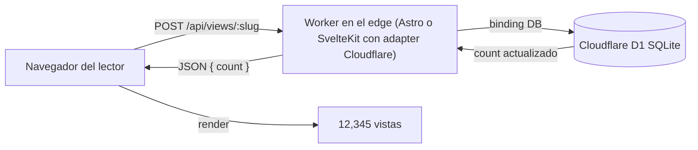
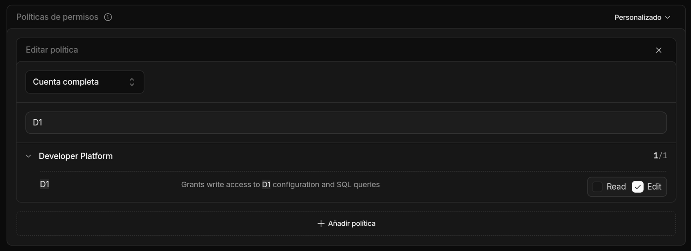

import Aside from "@rgglez/astro-aside";
import DownloadChecklist from "@rgglez/astro-downloadchecklist";

## Introducción

Hubo una época, antes de Google Analytics y antes de los dashboards de producto, en la que casi cualquier sitio web mostraba con orgullo un pequeño contador al pie de la página: _"Eres la visita número 12,345"_. Aquellos contadores de la **vieja guardia** no rastreaban personas, no perfilaban audiencias y no enviaban datos a terceros. Solo contaban impresiones y mostraban un número honesto.

Esta guía describe cómo recrear esa idea para un blog moderno desplegado en **Cloudflare**: un contador de **impresiones** o **vistas** por artículo, persistido en una base de datos, sin servidor aparte, sin costo en la práctica y sin sacrificar la privacidad del lector.

El almacenamiento será <a href="https://developers.cloudflare.com/d1/" target="_blank">**Cloudflare D1**</a>, una base de datos **SQLite** administrada que corre en el edge y se conecta a tu Worker mediante un _binding_. Se eligió D1 en lugar de <a href="https://developers.cloudflare.com/kv/" target="_blank">**KV**</a> debido a que KV no tiene incremento atómico, así que bajo tráfico concurrente perdería cuentas. D1 hace `count = count + 1` de forma atómica en una sola sentencia SQL.

La guía cubre **dos implementaciones** del mismo patrón:

- **Astro** (concretamente un blog tipo **AstroPaper**) con el adapter `@astrojs/cloudflare` y `output: 'server'`.
- **SvelteKit** con el adapter `@sveltejs/adapter-cloudflare`, corriendo también en SSR.

En ambos casos el resultado tiene estas propiedades:

- El contador vive en un endpoint propio del mismo proyecto; no hay servidor ni despliegue aparte.
- El sitio no necesita SSR adicional: si ya corres con un adapter de Cloudflare, el endpoint reutiliza ese mismo Worker.
- No se rastrea al usuario, no hay cookies de terceros ni IDs persistentes; solo se cuenta una impresión.
- El incremento es atómico, así que la cuenta no se corrompe bajo concurrencia.
- El costo, para un blog personal, es efectivamente cero.

<Aside type="note" title="¿Qué cuenta exactamente este contador?">

Cuenta **impresiones de página**, no usuarios únicos. Es deliberado: replicar el contador clásico, simple y honesto. Más abajo se incluye una variante opcional con deduplicación por `localStorage` para no contar recargas del mismo visitante, y una nota sobre filtrar bots. Si lo que necesitas es analítica de audiencia, este no es el componente correcto; usa una herramienta de analítica respetuosa con la privacidad.

</Aside>

---

## Tabla de contenido

---

## Arquitectura general

El patrón es idéntico en ambos frameworks. Cambia solo cómo el framework expone el _binding_ de D1 al código del endpoint.



El flujo en cada carga de artículo:

1. La página se renderiza normalmente (estática o SSR, no importa).
2. Un pequeño script del lado cliente hace `POST /api/views/<slug>` al cargar.
3. El endpoint, dentro del mismo Worker, ejecuta un `UPSERT` atómico en D1 y devuelve el nuevo total.
4. El script escribe el número en el DOM.

<Aside type="tip" title="No necesitas activar SSR solo para esto">

Si tu sitio es totalmente estático, el contador sigue funcionando: las **páginas** pueden ser estáticas y solo el **endpoint** del contador se sirve dinámicamente. En Astro eso se logra con `export const prerender = false` en la ruta del endpoint. En SvelteKit, una ruta `+server.ts` ya es dinámica por naturaleza. Lo único que esta guía asume es que despliegas en Cloudflare con uno de los adapters; el `output: 'server'` global es conveniente pero no obligatorio.

</Aside>

---

## Supuestos previos

Usa esta checklist antes de implementar:

<DownloadChecklist filename="checklist-contador-visitas-cloudflare-d1.csv">
  - [ ] Tienes un blog desplegado en **Cloudflare Workers** (o Pages) con
  Astro + `@astrojs/cloudflare`, o con SvelteKit + `@sveltejs/adapter-cloudflare`.
  - [ ] Tienes instalado y autenticado **Wrangler** (`npx wrangler login`).
  - [ ] Tu proyecto ya despliega correctamente antes de agregar el contador.
  - [ ] Conoces el **slug** o identificador único de cada artículo, disponible
  en tiempo de render (frontmatter, parámetro de ruta, etc.).
  - [ ] Aceptas que la cuenta inicial empieza en cero; no hay datos históricos
  que importar (si los tienes, puedes precargarlos con un `INSERT`).
  - [ ] Estás de acuerdo con contar **impresiones**, no usuarios únicos, salvo
  que apliques la deduplicación opcional descrita más abajo.
</DownloadChecklist>

<Aside type="caution" title="El slug debe ser estable y único">

El `slug` es la clave primaria en D1. Si renombras el slug de un artículo, el contador empieza de cero para ese artículo (la fila vieja queda huérfana con el slug anterior). Usa un identificador que no cambie: el slug canónico del post suele servir.

</Aside>

<Aside type="tip" title="¿Usas Bun? Sustituye npx por bunx">

Los comandos de esta guía usan `npx` (el ejecutor de Node). Si tu entorno usa <a href="https://bun.sh/" target="_blank">**Bun**</a>, puedes reemplazar `npx` por `bunx` en cualquiera de ellos sin más cambios: por ejemplo, `bunx wrangler d1 create views` en lugar de `npx wrangler d1 create views`. Ambos descargan y ejecutan el binario de Wrangler; `bunx` suele ser más rápido al resolver el paquete.

</Aside>

---

## ¿Tiene costo?

Para un blog personal, **no**. Los límites del plan gratuito de Cloudflare están muy por encima de lo que un contador de visitas consume:

| Recurso | Límite plan gratuito | Lo que consume el contador |
| --- | --- | --- |
| Workers / invocaciones | 100,000 solicitudes/día | 1 POST por carga de artículo |
| D1 lecturas de filas | 5,000,000 filas leídas/día | 1 fila por impresión |
| D1 escrituras de filas | 100,000 filas escritas/día | 1 fila por impresión |
| D1 almacenamiento | 5 GB | una fila diminuta por artículo |

Una sola fila por artículo (slug + entero) pesa bytes. Incluso un blog con decenas de miles de visitas diarias se queda holgadamente dentro del plan gratuito. Si algún día lo superas, el plan de pago de D1 cobra por filas leídas/escritas y por GB-mes, en montos centavos para este caso de uso.

<Aside type="note" title="Una escritura por impresión">

El diseño base escribe en D1 en **cada** impresión. Es lo que mantiene el contador en tiempo real y simple. Si tu tráfico fuera tan alto que las escrituras importaran, la mitigación correcta es la deduplicación por cliente (menos escrituras) o agregar en batches; ambas se mencionan al final. Para un blog típico no hace falta.

</Aside>

---

## Crear la base de datos D1

Este paso es **idéntico** para Astro y para SvelteKit. La tabla es la misma.

Crea la base de datos:

```bash
npx wrangler d1 create views
```

Wrangler imprime un bloque con el `database_id`. Guárdalo; lo necesitarás en el `wrangler.jsonc`.

Crea la tabla. Conviene tenerla en un archivo de esquema versionado:

```sql title="schema.sql"
CREATE TABLE IF NOT EXISTS views (
  slug  TEXT PRIMARY KEY,
  count INTEGER NOT NULL DEFAULT 0
);
```

Aplícala, primero en remoto (la base real que usa tu Worker desplegado):

```bash
npx wrangler d1 execute views --remote --file=./schema.sql
```

Y, si desarrollas en local con `wrangler dev`, también en la copia local:

```bash
npx wrangler d1 execute views --local --file=./schema.sql
```

<Aside type="tip" title="¿Tienes cuentas históricas que migrar?">

Si vienes de otro contador y quieres conservar los números, precarga las filas:

```sql
INSERT INTO views (slug, count) VALUES
  ('mi-primer-articulo', 4821),
  ('otro-articulo', 1290)
ON CONFLICT(slug) DO UPDATE SET count = excluded.count;
```

</Aside>

---

## Parte 1: Astro (AstroPaper) en SSR con el adapter de Cloudflare

Esta parte asume un blog tipo **AstroPaper** con `output: 'server'` y `adapter: cloudflare()`.

### Declarar el binding de D1 en wrangler

Agrega el binding `DB` a tu `wrangler.jsonc` (junto a tu `assets`, `compatibility_date`, etc.):

```jsonc title="wrangler.jsonc"
{
  "name": "mi-blog",
  "compatibility_date": "2026-03-06",
  "compatibility_flags": ["nodejs_compat"],
  "assets": {
    "binding": "ASSETS",
    "directory": "./dist"
  },
  // [!code ++]
  "d1_databases": [
    // [!code ++]
    {
      // [!code ++]
      "binding": "DB",
      // [!code ++]
      "database_name": "views",
      // [!code ++]
      "database_id": "PEGA-AQUI-EL-DATABASE-ID"
      // [!code ++]
    }
    // [!code ++]
  ]
}
```

### Tipar el binding para TypeScript

En **Astro 6** (adapter `@astrojs/cloudflare` 13.x), genera los tipos a partir de los bindings declarados en `wrangler.jsonc`:

```bash
npx wrangler types
```

Esto crea un `worker-configuration.d.ts` con la interfaz global `Env` (que ya incluye tu `DB`) y las definiciones del módulo `cloudflare:workers`. El archivo lo recoge tu `tsconfig.json` por el patrón `include` habitual.

<Aside type="tip" title="Re-genera los tipos al cambiar bindings">

Re-ejecuta `npx wrangler types` cada vez que cambies los bindings en `wrangler.jsonc` (añadir una base D1, un KV, un secreto, etc.). Si no lo haces, `worker-configuration.d.ts` queda desactualizado y TypeScript marcará errores o no verá los bindings nuevos.

</Aside>

<Aside type="caution" title="Cambio rompedor en Astro 6: adiós a Astro.locals.runtime.env">

Si vienes de guías o proyectos anteriores, recordarás el patrón `Astro.locals.runtime.env.DB` con un `env.d.ts` que hacía `interface Locals extends Runtime<Env>`. **En Astro 6 eso fue eliminado**: `Astro.locals.runtime.env` ya no existe y lanza un error en tiempo de ejecución. El acceso a los bindings ahora se hace importando `env` del módulo `cloudflare:workers`, como muestra el endpoint de abajo. Otros equivalentes: `Astro.request.cf` (antes `runtime.cf`), el `caches` global (antes `runtime.caches`) y `Astro.locals.cfContext` (antes `runtime.ctx`).

</Aside>

### El endpoint del contador

Crea `src/pages/api/views/[slug].ts`. Un solo `POST` incrementa y devuelve el total:

```ts title="src/pages/api/views/[slug].ts"
import type { APIRoute } from "astro";
import { env } from "cloudflare:workers";

// El sitio puede ser estático; este endpoint debe ser dinámico.
export const prerender = false;

export const POST: APIRoute = async ({ params }) => {
  const slug = params.slug;
  if (!slug) {
    return new Response("Missing slug", { status: 400 });
  }

  const db = env.DB;

  // UPSERT atómico: inserta con 1, o suma 1 si ya existe.
  await db
    .prepare(
      "INSERT INTO views (slug, count) VALUES (?, 1) " +
        "ON CONFLICT(slug) DO UPDATE SET count = count + 1"
    )
    .bind(slug)
    .run();

  const row = await db
    .prepare("SELECT count FROM views WHERE slug = ?")
    .bind(slug)
    .first<{ count: number }>();

  return Response.json({ count: row?.count ?? 0 });
};

// Opcional: leer sin incrementar (p. ej. para una página de estadísticas).
export const GET: APIRoute = async ({ params }) => {
  const slug = params.slug;
  if (!slug) return new Response("Missing slug", { status: 400 });

  const row = await env.DB
    .prepare("SELECT count FROM views WHERE slug = ?")
    .bind(slug)
    .first<{ count: number }>();

  return Response.json({ count: row?.count ?? 0 });
};
```

### El componente visual

Crea un componente reutilizable `src/components/ViewCounter.astro` que reciba el slug y pinte el número:

```astro title="src/components/ViewCounter.astro"
---
interface Props {
  slug: string;
}
const { slug } = Astro.props;
---

<span class="view-counter" aria-live="polite">
  <span id="view-count" data-slug={slug}>…</span> vistas
</span>

<script>
  function loadViewCount() {
    const el = document.getElementById("view-count");
    if (!el) return;
    const slug = el.dataset.slug;
    fetch(`/api/views/${slug}`, { method: "POST" })
      .then((r) => r.json() as Promise<{ count: number }>)
      .then((d) => {
        el.textContent = new Intl.NumberFormat().format(d.count);
      })
      .catch(() => {
        el.textContent = "—";
      });
  }
  // astro:page-load corre en la carga inicial y tras cada navegación con ClientRouter.
  document.addEventListener("astro:page-load", loadViewCount);
</script>
```

<Aside type="caution" title="Si usas View Transitions (ClientRouter), escucha astro:page-load">

Los `<script>` de módulo de Astro corren **una sola vez** en la carga completa de la página. Si tu sitio usa el <a href="https://docs.astro.build/en/guides/view-transitions/" target="_blank">`ClientRouter`</a> (View Transitions), al navegar entre artículos el DOM se reemplaza sin recargar y el script **no vuelve a ejecutarse**: el contador se queda en `…` hasta que recargas a mano (F5). La solución es envolver la lógica en una función y dispararla con el evento `astro:page-load`, que se emite tanto en la carga inicial como tras cada navegación. Vuelve a buscar el elemento dentro de la función, porque el nodo anterior ya no existe tras el _swap_. Si tu sitio **no** usa View Transitions, basta con llamar a `loadViewCount()` directamente.

</Aside>

Úsalo en el layout del artículo (en AstroPaper, típicamente `src/layouts/PostDetails.astro` o equivalente), pasándole el slug del post:

```astro
---
import ViewCounter from "@/components/ViewCounter.astro";
// `post` es la entrada del artículo en tu layout.
---

<ViewCounter slug={post.id} />
```

<Aside type="caution" title="Qué pasar como slug en AstroPaper">

Según la versión de AstroPaper y de la API de colecciones de Astro, el identificador del post puede estar en `post.id`, `post.slug` o derivarse de la ruta. Usa el mismo valor que ya empleas para construir la URL del artículo, para que el slug sea consistente entre la URL pública y la clave en D1.

</Aside>

---

## Parte 2: SvelteKit con el adapter de Cloudflare en SSR

El patrón es el mismo; cambia la mecánica del framework. SvelteKit expone los bindings de Cloudflare a través de `event.platform.env`.

### Adapter y binding

Asegúrate de usar `@sveltejs/adapter-cloudflare` en `svelte.config.js`:

```js title="svelte.config.js"
import adapter from "@sveltejs/adapter-cloudflare";
import { vitePreprocess } from "@sveltejs/vite-plugin-svelte";

export default {
  preprocess: vitePreprocess(),
  kit: {
    adapter: adapter(),
  },
};
```

Declara el binding `DB` igual que antes, en `wrangler.jsonc`:

```jsonc title="wrangler.jsonc"
{
  "name": "mi-blog-sveltekit",
  "compatibility_date": "2026-03-06",
  "compatibility_flags": ["nodejs_compat"],
  "d1_databases": [
    {
      "binding": "DB",
      "database_name": "views",
      "database_id": "PEGA-AQUI-EL-DATABASE-ID"
    }
  ]
}
```

### Tipar la plataforma

En SvelteKit los bindings viven en `App.Platform`. Decláralos en `src/app.d.ts`:

```ts title="src/app.d.ts"
declare global {
  namespace App {
    interface Platform {
      env: {
        DB: D1Database;
      };
    }
  }
}

export {};
```

<Aside type="note" title="platform es undefined en algunos contextos">

`event.platform` solo está disponible cuando el código corre en el runtime de Cloudflare (despliegue o `wrangler dev` / `vite dev` con el adapter configurado). Por eso el endpoint valida su existencia antes de usarlo. En `vite dev` puro sin emulación de plataforma, `platform` puede ser `undefined`.

</Aside>

### El endpoint del contador

Crea `src/routes/api/views/[slug]/+server.ts`:

```ts title="src/routes/api/views/[slug]/+server.ts"
import { json, error } from "@sveltejs/kit";
import type { RequestHandler } from "./$types";

export const POST: RequestHandler = async ({ params, platform }) => {
  const db = platform?.env.DB;
  if (!db) throw error(500, "D1 binding no disponible");

  const slug = params.slug;

  await db
    .prepare(
      "INSERT INTO views (slug, count) VALUES (?, 1) " +
        "ON CONFLICT(slug) DO UPDATE SET count = count + 1"
    )
    .bind(slug)
    .run();

  const row = await db
    .prepare("SELECT count FROM views WHERE slug = ?")
    .bind(slug)
    .first<{ count: number }>();

  return json({ count: row?.count ?? 0 });
};

export const GET: RequestHandler = async ({ params, platform }) => {
  const db = platform?.env.DB;
  if (!db) throw error(500, "D1 binding no disponible");

  const row = await db
    .prepare("SELECT count FROM views WHERE slug = ?")
    .bind(params.slug)
    .first<{ count: number }>();

  return json({ count: row?.count ?? 0 });
};
```

### El componente visual

Crea `src/lib/components/ViewCounter.svelte`:

```svelte title="src/lib/components/ViewCounter.svelte"
<script lang="ts">
  import { onMount } from "svelte";

  export let slug: string;

  let count: number | null = null;

  onMount(async () => {
    try {
      const r = await fetch(`/api/views/${slug}`, { method: "POST" });
      const d = (await r.json()) as { count: number };
      count = d.count;
    } catch {
      count = null;
    }
  });
</script>

<span aria-live="polite">
  {count === null ? "—" : new Intl.NumberFormat().format(count)} vistas
</span>
```

Úsalo en la página del artículo (`src/routes/blog/[slug]/+page.svelte` o donde renderices el post):

```svelte
<script lang="ts">
  import ViewCounter from "$lib/components/ViewCounter.svelte";
  export let data; // viene de tu +page.ts / load
</script>

<ViewCounter slug={data.post.slug} />
```

<Aside type="tip" title="Svelte 5 con runes">

El componente usa la sintaxis clásica `export let` / `onMount` por compatibilidad amplia. Si usas Svelte 5 con runes, puedes reescribirlo con `$props()` y `$state()`, pero la lógica del fetch es idéntica.

</Aside>

---

## Personalización gráfica opcional

El número honesto ya cumple, pero parte del encanto de los contadores de la vieja guardia era su aspecto: dígitos blancos sobre fondo negro, estilo display LED o marcador mecánico. Hay dos caminos para lograrlo.

<Aside type="tip" title="Recomendación: usa CSS, no imágenes">

Para casi cualquier caso, **CSS es la mejor opción**. El número sigue siendo texto real, así que escala nítido en cualquier pantalla, es accesible para lectores de pantalla, se puede seleccionar y copiar, no añade peticiones HTTP y no hay sprites que precargar ni mantener. Reserva las imágenes de dígitos solo si buscas un estilo pixel-art muy específico que CSS no puede reproducir.

</Aside>

### Opción A (recomendada): estilo LED con CSS

Da al contador un aspecto de display digital con una fuente monoespaciada, fondo oscuro y un leve resplandor. No cambia el componente: solo añade estilos. Sobre el `<span class="view-counter">` del componente Astro (o el `<span>` del componente Svelte), agrega:

```css title="estilos del contador (LED)"
.view-counter {
  display: inline-flex;
  align-items: center;
  gap: 0.35em;
  font-family: "Courier New", ui-monospace, monospace;
  font-weight: 700;
  letter-spacing: 0.08em;
  padding: 0.15em 0.5em;
  border-radius: 0.25em;
  background: #000;
  color: #00ff6a;                 /* verde fósforo clásico */
  text-shadow: 0 0 6px #00ff6a;   /* resplandor LED */
}
```

Para el clásico **blanco sobre negro** del anexo, cambia `color: #fff` y elimina o ajusta el `text-shadow`.

### Opción A+: cada dígito en su propia "casilla"

El look de marcador mecánico (cada cifra en su recuadro negro) requiere envolver cada dígito en su propio elemento. Modifica el render para construir un `<span>` por dígito en lugar de escribir el número plano. En el componente Astro:

```ts title="script del componente, render por dígitos"
fetch(`/api/views/${slug}`, { method: "POST" })
  .then((r) => r.json() as Promise<{ count: number }>)
  .then((d) => {
    const digits = new Intl.NumberFormat().format(d.count);
    el.textContent = "";
    for (const ch of digits) {
      const span = document.createElement("span");
      span.className = /\d/.test(ch) ? "digit" : "sep";
      span.textContent = ch;
      el.appendChild(span);
    }
  });
```

Con su CSS:

```css title="casillas por dígito"
.view-counter :global(.digit) {
  display: inline-block;
  min-width: 1ch;
  padding: 0.1em 0.25em;
  margin: 0 1px;
  text-align: center;
  background: #111;
  color: #fff;
  border-radius: 3px;
  box-shadow: inset 0 0 0 1px #333;
}
.view-counter :global(.sep) { /* la coma de los miles */
  padding: 0 0.1em;
  color: #888;
}
```

<Aside type="caution" title="En Astro, los estilos van scopeados: usa :global para los dígitos">

Los `<style>` de un componente Astro están **scopeados** por defecto: Astro añade un atributo hash solo a los elementos presentes en el _template_. Como las casillas `.digit` y `.sep` las crea el JavaScript con `document.createElement`, **no** reciben ese hash y el CSS scopeado no les aplica (verías el número, pero sin las casillas). Por eso los selectores de los hijos generados dinámicamente van envueltos en `:global(...)`, mientras el contenedor `.view-counter` —que sí está en el template— permanece scopeado. Lo mismo aplica a `.digit-img` en la Opción B. Si en cambio usas CSS global (una hoja de estilos del sitio, no un `<style>` de componente), esto no te afecta.

</Aside>

<Aside type="note" title="Detalle de accesibilidad">

Aunque dividas el número en casillas, sigue siendo texto: un lector de pantalla lo leerá como un todo si conservas el `aria-live="polite"` del componente. Para evitar que deletree cifra por cifra, puedes envolver el grupo y exponer el valor completo con un `aria-label` en el contenedor.

</Aside>

### Opción B: imágenes con los dígitos (el método retro)

Es el método original de los noventa: una imagen por cifra (`0.gif` … `9.gif`), o un único _sprite_ con los diez dígitos, y se compone el número colocando la imagen correcta para cada cifra. Reproduce un pixel-art exacto que CSS no siempre puede imitar, pero a cambio:

- Cada dígito es una imagen: no escala nítido en pantallas de alta densidad salvo que prepares versiones @2x.
- El número deja de ser texto seleccionable; debes poner un `alt`/`aria-label` con el valor para no perder accesibilidad.
- Añade peticiones HTTP y sprites que mantener y precargar.

Si aun así lo quieres por estética, el render coloca una `` por dígito:

```ts title="script del componente, dígitos como imágenes"
fetch(`/api/views/${slug}`, { method: "POST" })
  .then((r) => r.json() as Promise<{ count: number }>)
  .then((d) => {
    const n = String(d.count);          // sin separadores, más simple
    el.textContent = "";
    el.setAttribute("aria-label", `${n} vistas`);
    for (const ch of n) {
      const img = document.createElement("img");
      img.src = `/counter/${ch}.gif`;    // 0.gif … 9.gif en /public/counter/
      img.alt = "";                       // decorativo; el aria-label lleva el valor
      img.className = "digit-img";
      el.appendChild(img);
    }
  });
```

```css title="imágenes de dígitos"
.view-counter :global(.digit-img) {
  height: 1.2em;
  width: auto;
  image-rendering: pixelated; /* conserva el filo pixel-art al escalar */
  vertical-align: middle;
}
```

Coloca tus `0.gif`…`9.gif` en `public/counter/` (Astro) o `static/counter/` (SvelteKit) para que se sirvan como assets estáticos.

<Aside type="caution" title="Bordes nítidos vs. peso">

`image-rendering: pixelated` evita el desenfoque al escalar pixel-art, pero no convierte una imagen pequeña en alta resolución real. Si te importa la nitidez en pantallas retina, exporta los dígitos al doble de tamaño y muéstralos a la mitad. Llegados a este punto, CSS suele dar mejor resultado con menos trabajo.

</Aside>

---

## Variante opcional: no contar recargas del mismo visitante

El diseño base cuenta **cada** impresión, incluidas recargas. Para acercarte más a "vistas" sin rastrear al usuario, marca en `localStorage` que este navegador ya contó este artículo. Es deduplicación puramente local: no hay cookies, ni IDs, ni datos enviados a terceros.

Reemplaza la llamada `fetch` por:

```js
const key = `viewed:${slug}`;
if (!localStorage.getItem(key)) {
  localStorage.setItem(key, "1");
  fetch(`/api/views/${slug}`, { method: "POST" })
    .then((r) => r.json())
    .then((d) => { /* pintar d.count */ });
} else {
  // Ya contó antes: solo leer el total sin incrementar.
  fetch(`/api/views/${slug}`)
    .then((r) => r.json())
    .then((d) => { /* pintar d.count */ });
}
```

<Aside type="caution" title="localStorage no es infalible">

`localStorage` se borra con los datos del navegador, no se comparte entre dispositivos y no existe para algunos bots. No es un conteo de únicos riguroso; es una mejora barata para no inflar el número con recargas. Para el espíritu "vieja guardia" es más que suficiente.

</Aside>

---

## Endurecimiento básico

Algunas medidas opcionales, en orden de utilidad real para un blog:

- **Filtrar bots evidentes.** Como la cuenta la dispara JavaScript del cliente, la mayoría de los crawlers simples ya no la activan (no ejecutan el script). Para los que sí, puedes revisar `User-Agent` en el endpoint y omitir el incremento de patrones conocidos de bots. No esperes perfección.
- **Validar el slug.** Acepta solo slugs que existan realmente, para que nadie infle filas basura con `POST /api/views/lo-que-sea`. Si tienes una lista de slugs publicados, recházalos si no están en ella; o restringe el formato con una expresión regular sencilla.
- **Rate limiting.** Para abuso deliberado, Cloudflare ofrece <a href="https://developers.cloudflare.com/waf/rate-limiting-rules/" target="_blank">reglas de rate limiting</a> en el edge sobre la ruta `/api/views/*`, sin tocar tu código.
- **Reducir escrituras a escala.** Si algún día el volumen lo amerita, deduplica por cliente (sección anterior) o acumula incrementos en memoria/KV y vuelca a D1 por lotes. Es optimización prematura para casi cualquier blog; no la hagas hasta medir que hace falta.

---

## Troubleshooting

**El número aparece como "—" o no cambia.**
Abre la consola del navegador y la pestaña de red. Verifica que `POST /api/views/<slug>` responde `200` con `{ "count": N }`. Un `500` suele significar que el binding `DB` no llegó al endpoint.

**`env.DB is undefined` (Astro) o `platform is undefined` (SvelteKit).**
El binding no está conectado. Revisa que `d1_databases` esté en `wrangler.jsonc` con el `database_id` correcto, que el nombre del `binding` coincida con el que usas en el código (`DB`), que hayas redeployado, y —en desarrollo— que estés corriendo con el adapter de Cloudflare (no un `dev` sin emulación de plataforma).

**`La propiedad 'runtime' no existe en el tipo 'Locals'` (Astro).**
Estás usando el patrón viejo `Astro.locals.runtime.env`, eliminado en Astro 6. Importa `env` de `cloudflare:workers` (ver el endpoint) y genera los tipos con `npx wrangler types`.

**`no such table: views`.**
No aplicaste el esquema en el entorno que estás golpeando. Recuerda que `--local` y `--remote` son bases distintas: ejecuta el `schema.sql` en ambas según corresponda.

**Funciona en local pero no en producción (o viceversa).**
Casi siempre es el mismo problema de `--local` vs `--remote`. La base local de `wrangler dev` no es la base que usa tu Worker desplegado.

**El conteo sube de dos en dos.**
En desarrollo, el _Strict Mode_ de React (si lo usas en islas Astro) o un doble montaje pueden disparar dos `fetch`. En producción no ocurre; si te molesta en dev, usa la variante con `localStorage`.

---

## Conclusión

Recrear el contador de visitas de la vieja guardia sobre Cloudflare es sorprendentemente directo: una tabla D1 con una fila por artículo, un endpoint que hace un `UPSERT` atómico y un script de cliente de diez líneas. No hace falta un servidor aparte, no hace falta activar SSR solo para esto, y el costo es cero en la práctica.

El mismo patrón sirve para **Astro** y para **SvelteKit**; lo único que cambia es cómo cada framework te entrega el binding de D1: `import { env } from "cloudflare:workers"` en Astro 6, `platform.env` en SvelteKit. La lógica de base de datos —la sentencia SQL, el incremento atómico, la lectura del total— es exactamente la misma en ambos.

Y, fiel al espíritu original, el contador cuenta impresiones de forma honesta y sin rastrear a nadie: un número simple al pie del artículo, como en los viejos tiempos.

## Apéndice: Permisos del API token de Cloudflare

Las operaciones de **esta** guía —crear la base de datos D1 y aplicar el esquema con Wrangler— solo tocan **D1**. No necesitan permisos de Workers, DNS ni del resto de la cuenta.

Si usas `wrangler login` (flujo OAuth interactivo), Wrangler obtiene los permisos por ti y **no necesitas crear un token**. Este apéndice aplica cuando prefieres un **API token explícito**, por ejemplo para correr Wrangler en un entorno no interactivo o con credenciales acotadas.

### Permiso mínimo necesario

La operación es similar a la descrita en <a href="/es/posts/2026/04/desplegar-sveltekit-cloudflare-workers/">este post</a> sobre despliegue de SvelteKit en Cloudflare.

Para D1, el permiso mínimo es:

| Operación de la guía | Comando | Permiso requerido |
| --- | --- | --- |
| Crear la base de datos | `wrangler d1 create views` | **Account → D1 → Edit** |
| Aplicar el esquema (remoto) | `wrangler d1 execute views --remote --file=./schema.sql` | **Account → D1 → Edit** |
| Precargar/consultar filas (remoto) | `wrangler d1 execute ... --command "..."` | **Account → D1 → Edit** |

Con eso basta. `Edit` incluye lectura y escritura sobre D1; no requieres un permiso de lectura aparte. Las operaciones `--local` no tocan la API de Cloudflare (corren contra una copia local en disco), así que no consumen permisos del token.



### Crear el token

1. Entra a <a href="https://dash.cloudflare.com/profile/api-tokens" target="_blank">**My Profile → API Tokens**</a> y elige **Create Token → Create Custom Token**.
2. En **Permissions**, añade una fila: `Account` · `D1` · `Edit`.
3. En **Account Resources**, selecciona **Include → tu cuenta** (no «All accounts»).
4. Opcional pero recomendado: define una **TTL** (fecha de expiración) y, si tu red es fija, restringe por **Client IP Address Filtering**.
5. Crea el token y **cópialo una sola vez**; Cloudflare no lo vuelve a mostrar.

### Usar el token con Wrangler

Wrangler lee el token de la variable de entorno `CLOUDFLARE_API_TOKEN`. Para los comandos de D1 conviene además fijar el `CLOUDFLARE_ACCOUNT_ID` (lo ves en el panel de tu cuenta):

```bash
export CLOUDFLARE_API_TOKEN="tu-token-acotado-a-D1-Edit"
export CLOUDFLARE_ACCOUNT_ID="tu-account-id"

npx wrangler d1 create views
npx wrangler d1 execute views --remote --file=./schema.sql
```

<Aside type="caution" title="Mínimo privilegio y manejo del token">

Da al token solo `D1 → Edit` y acótalo a tu cuenta; así, aunque se filtre, no permite tocar Workers, DNS ni otros recursos. No lo escribas en el repositorio ni en el `wrangler.jsonc`: pásalo por variable de entorno o por el _secret store_ de tu entorno (en CI, como _secret_ del pipeline). Si sospechas exposición, **revócalo** desde el mismo panel de API Tokens y genera uno nuevo.

</Aside>

<Aside type="note" title="El token de despliegue es otro asunto">

El token (o la integración) que despliega el blog desde GitHub necesita permisos distintos (típicamente Workers/Pages) y no se cubre aquí. Mantenerlos **separados** —un token para D1, otro para el despliegue— es justamente la ventaja del mínimo privilegio.

</Aside>

---

## Referencias

- Cloudflare. (2026). _D1: Cloudflare's native serverless SQL database_. Cloudflare Docs. <a href="https://developers.cloudflare.com/d1/" target="_blank" rel="noopener noreferrer">https://developers.cloudflare.com/d1/</a>
- Cloudflare. (2026). _D1 Workers Binding API (prepare, bind, run, first)_. Cloudflare Docs. <a href="https://developers.cloudflare.com/d1/worker-api/" target="_blank" rel="noopener noreferrer">https://developers.cloudflare.com/d1/worker-api/</a>
- Cloudflare. (2026). _Wrangler commands: d1 create / d1 execute_. Cloudflare Docs. <a href="https://developers.cloudflare.com/workers/wrangler/commands/#d1" target="_blank" rel="noopener noreferrer">https://developers.cloudflare.com/workers/wrangler/commands/#d1</a>
- Cloudflare. (2026). _Create API token and token permissions_. Cloudflare Docs. <a href="https://developers.cloudflare.com/fundamentals/api/get-started/create-token/" target="_blank" rel="noopener noreferrer">https://developers.cloudflare.com/fundamentals/api/get-started/create-token/</a>
- Cloudflare. (2026). _Pricing: Workers & D1 free tier limits_. Cloudflare Docs. <a href="https://developers.cloudflare.com/d1/platform/pricing/" target="_blank" rel="noopener noreferrer">https://developers.cloudflare.com/d1/platform/pricing/</a>
- Astro. (2026). _Cloudflare adapter (@astrojs/cloudflare): accessing the runtime_. Astro Docs. <a href="https://docs.astro.build/en/guides/integrations-guide/cloudflare/" target="_blank" rel="noopener noreferrer">https://docs.astro.build/en/guides/integrations-guide/cloudflare/</a>
- Astro. (2026). _Endpoints and on-demand rendering (prerender)_. Astro Docs. <a href="https://docs.astro.build/en/guides/endpoints/" target="_blank" rel="noopener noreferrer">https://docs.astro.build/en/guides/endpoints/</a>
- SvelteKit. (2026). _adapter-cloudflare and platform.env bindings_. Svelte Docs. <a href="https://svelte.dev/docs/kit/adapter-cloudflare" target="_blank" rel="noopener noreferrer">https://svelte.dev/docs/kit/adapter-cloudflare</a>
- SvelteKit. (2026). _Server routes (+server.js)_. Svelte Docs. <a href="https://svelte.dev/docs/kit/routing#server" target="_blank" rel="noopener noreferrer">https://svelte.dev/docs/kit/routing#server</a>
- SQLite. (2026). _UPSERT (ON CONFLICT ... DO UPDATE)_. SQLite Documentation. <a href="https://www.sqlite.org/lang_upsert.html" target="_blank" rel="noopener noreferrer">https://www.sqlite.org/lang_upsert.html</a>
