import Aside from "@rgglez/astro-aside";

## Introducción

Este glosario organiza términos de investigación científica con énfasis en proyectos de inteligencia artificial. La estructura parte del material base **Investigación en Inteligencia Artificial** y se enriquece con términos actuales usados en investigación, documentación, evaluación, despliegue, gobernanza y comunicación científica de sistemas de IA.

El objetivo no es producir un diccionario mínimo, sino un glosario de trabajo: cada término incluye definición, contexto de uso en investigación de IA y, cuando conviene, un ejemplo o advertencia práctica.

## Cómo leer este glosario

- **Definición:** explicación conceptual del término.
- **En investigación de IA:** por qué importa en un proyecto, tesis, artículo o prototipo científico.
- **Ejemplo:** caso breve que ilustra el uso correcto del término.
- **Precaución:** errores comunes o matices importantes.
- **Fuente complementaria:** referencia adicional en APA 7 cuando el término fue incorporado o ampliado más allá del PDF base.

---

## Tabla de contenido

---

## Fundamentos epistemológicos y método científico

La investigación en IA no empieza con un algoritmo, sino con una pregunta científica o técnica suficientemente clara. En este nivel se ubican los conceptos que permiten distinguir conocimiento de creencia, justificar la relevancia de un problema y construir un proceso verificable.

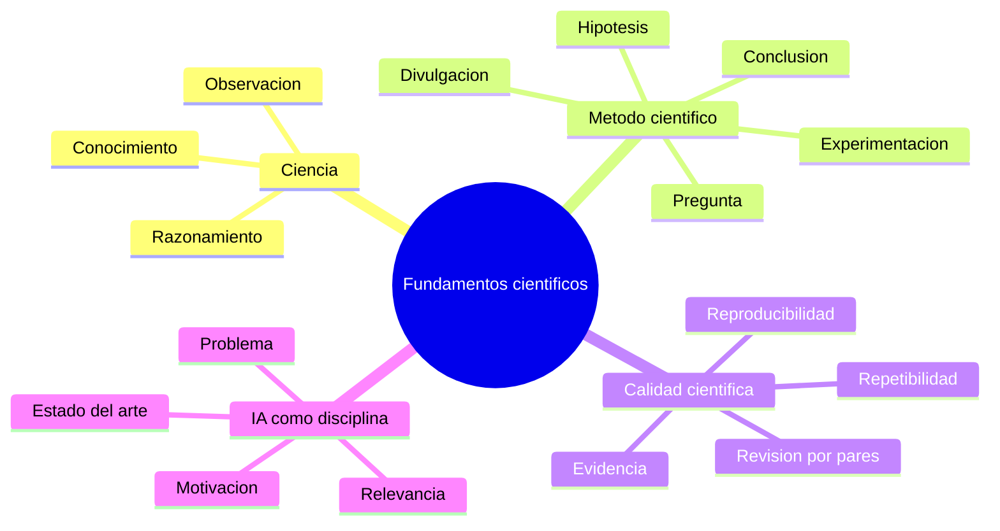

### Ciencia

**Definición.** La ciencia es una actividad sistemática orientada a obtener conocimiento verificable mediante observación, razonamiento, contrastación y organización de resultados. No se limita a acumular datos: transforma observaciones en explicaciones, modelos, teorías o métodos que pueden ponerse a prueba.

**En investigación de IA.** Un proyecto de IA es científico cuando no solo produce un sistema que “funciona”, sino cuando permite responder una pregunta verificable: por ejemplo, si una arquitectura mejora una métrica frente a una línea base, si una técnica reduce sesgo, si una representación mejora la generalización o si un sistema es aceptado por usuarios en condiciones reales.

**Ejemplo.** “Entrené una red neuronal y obtuvo 94 % de exactitud” es un resultado técnico. Se vuelve científico cuando se documenta el problema, el conjunto de datos, las condiciones de entrenamiento, la métrica, el comparador, la incertidumbre y la interpretación del resultado.

### Conocimiento

**Definición.** Conocimiento es información justificada, contrastada y contextualizada. Se diferencia de la opinión o la creencia porque exige evidencia, método y posibilidad de revisión.

**En investigación de IA.** Un modelo puede descubrir patrones estadísticos, pero el investigador debe evaluar si esos patrones son conocimiento útil o solo correlaciones accidentales. En IA aplicada, esta diferencia es crítica: un clasificador médico puede aprender artefactos del hospital de origen, no rasgos clínicos generalizables.

**Precaución.** Un modelo con buen rendimiento aparente no equivale automáticamente a conocimiento científico. Puede haber fuga de datos, sesgo de selección, sobreajuste o métricas mal elegidas.

### Creencia

**Definición.** Una creencia es una afirmación aceptada sin necesidad de demostración empírica o lógica suficiente. Puede ser razonable, intuitiva o culturalmente compartida, pero no tiene el mismo estatus que el conocimiento científico.

**En investigación de IA.** Creer que “los modelos más grandes siempre son mejores” no basta. La afirmación debe traducirse en una hipótesis contrastable: mejor en qué métrica, con qué datos, bajo qué costo, en qué dominio y frente a qué alternativa.

<Aside type="caution" title="Creencia técnica frecuente">
En IA aplicada se confunde con facilidad experiencia de ingeniería con evidencia científica. Que una técnica haya funcionado en un proyecto previo no demuestra que sea la mejor opción para otro dominio, otro conjunto de datos o una población diferente.
</Aside>

### Observación

**Definición.** La observación es la identificación sistemática de un fenómeno, patrón, comportamiento o problema. Puede surgir de datos, literatura, comportamiento de usuarios, errores de sistemas, métricas de producción o fenómenos sociales asociados a una tecnología.

**En investigación de IA.** Una observación puede ser: “el sistema de recomendación funciona peor con usuarios nuevos”, “el detector de fraude marca más falsos positivos en una región”, o “el modelo de lenguaje genera respuestas incorrectas cuando se le pide citar fuentes”.

**Ejemplo.** En un estudio de sesgo, la observación inicial podría ser una diferencia de error entre grupos. Esa observación no prueba discriminación por sí sola, pero motiva una pregunta de investigación.

### Pregunta de investigación

**Definición.** Es la formulación precisa de lo que se desea descubrir, explicar, comparar o validar. Una buena pregunta delimita objeto, población, método, variable de interés y criterio de éxito.

**En investigación de IA.** La pregunta debe anteceder a la herramienta. No se investiga “usar transformers”, sino “evaluar si una arquitectura basada en transformers mejora la clasificación de documentos legales en español frente a un modelo clásico bajo métricas de precisión, exhaustividad y costo computacional”.

**Ejemplo.** Pregunta débil: “¿Puedo usar IA para detectar enfermedades?”. Pregunta más útil: “¿Un modelo de visión por computador entrenado con radiografías etiquetadas mejora la sensibilidad diagnóstica de fracturas de fémur frente a un modelo baseline, manteniendo una tasa aceptable de falsos positivos?”.

### Problema de investigación

**Definición.** Es la situación concreta que motiva la investigación y que aún no está resuelta satisfactoriamente. Debe ser relevante, delimitado y susceptible de abordaje metodológico.

**En investigación de IA.** Un problema puede ser técnico, como reducir el sobreajuste; metodológico, como comparar formas de validación; social, como mitigar sesgos; o de ingeniería, como desplegar modelos robustos ante deriva de datos.

**Precaución.** Un problema demasiado amplio impide diseñar experimentos útiles. “Mejorar la IA en medicina” no es operativo; “reducir falsos negativos en un detector de lesiones con datos de baja prevalencia” sí lo es.

### Motivación o justificación

**Definición.** Es la explicación de por qué vale la pena investigar un problema. Incluye relevancia científica, técnica, social, económica, ética o educativa.

**En investigación de IA.** La motivación puede consistir en mejorar resultados previos, proponer un enfoque nuevo, reducir costos, aumentar interpretabilidad, extender un método a otro idioma, o atender una necesidad social no resuelta.

**Ejemplo.** Un trabajo sobre detección de noticias falsas en español puede justificarse porque muchos modelos se evalúan principalmente en inglés y su transferencia lingüística no siempre es confiable.

### Hipótesis

**Definición.** Una hipótesis es una respuesta tentativa y contrastable a una pregunta de investigación. Debe formular una relación esperada entre variables, condiciones o fenómenos.

**En investigación de IA.** Una hipótesis típica sería: “El ajuste fino de un modelo preentrenado en documentos jurídicos mexicanos incrementará la puntuación F1 respecto a un modelo generalista, sin aumentar significativamente la latencia de inferencia”.

**Ejemplo.** Si la pregunta es si un método de balanceo mejora la detección de clases minoritarias, la hipótesis puede establecer que SMOTE o ponderación de clases aumentará la sensibilidad de la clase minoritaria frente al entrenamiento sin balanceo.

### Evidencia

**Definición.** La evidencia es el conjunto de datos, resultados, argumentos y observaciones que apoyan o refutan una hipótesis. Debe ser trazable, revisable y proporcional a la afirmación realizada.

**En investigación de IA.** La evidencia puede incluir métricas, intervalos de confianza, curvas de aprendizaje, análisis de errores, pruebas de robustez, auditorías de sesgo, resultados cualitativos de usuarios o comparaciones con trabajos previos.

**Precaución.** Una tabla de métricas aislada no siempre es evidencia suficiente. En IA, la evidencia debe acompañarse de condiciones experimentales y una discusión de amenazas a la validez.

### Método científico

**Definición.** Es un proceso general para obtener conocimiento: observar, formular preguntas, proponer hipótesis, experimentar, analizar, concluir y comunicar. No es una receta rígida, sino un marco de control intelectual.

**En investigación de IA.** El método científico ayuda a no confundir experimentación informal con validación. Entrenar cinco modelos y escoger el mejor sin diseño experimental puede servir como exploración, pero no como prueba sólida de una hipótesis.

**Ejemplo.** Para evaluar un nuevo algoritmo de clustering, se define un problema, se seleccionan datasets, se eligen métricas, se comparan baselines, se repiten experimentos con semillas controladas y se reportan resultados.

### Repetibilidad

**Definición.** La repetibilidad es la capacidad de obtener el mismo resultado cuando el mismo equipo repite el experimento bajo las mismas condiciones, con los mismos datos, código, configuración y entorno.

**En investigación de IA.** Se logra registrando versiones de librerías, semillas aleatorias, particiones de datos, hiperparámetros, hardware relevante y scripts de ejecución.

**Ejemplo.** Si un notebook produce métricas distintas cada vez que se ejecuta porque no se fija la semilla ni la partición entrenamiento-prueba, la repetibilidad es débil.

### Reproducibilidad

**Definición.** La reproducibilidad es la capacidad de que un equipo independiente obtenga resultados equivalentes siguiendo la descripción del método, usando el mismo material o material comparable.

**En investigación de IA.** Exige reportar más que el código. También requiere procedencia de datos, preprocesamiento, criterios de exclusión, métricas, configuración de evaluación, dependencias y limitaciones.

**Ejemplo.** Un artículo que publica repositorio, datos anonimizados, contenedor, instrucciones y logs facilita que otros investigadores verifiquen si el resultado se sostiene.

**Fuente complementaria.** ACM (2020) y Wilkinson et al. (2016) son referencias útiles para prácticas de artefactos, disponibilidad y datos FAIR.

### Revisión por pares

**Definición.** La revisión por pares es el proceso mediante el cual especialistas evalúan la calidad, originalidad, claridad y solidez metodológica de un trabajo antes de su publicación o aceptación.

**En investigación de IA.** Los revisores suelen examinar si la comparación es justa, si los baselines son adecuados, si los datos están bien descritos, si las métricas son pertinentes y si las conclusiones no exceden la evidencia.

**Precaución.** La revisión por pares mejora el control de calidad, pero no garantiza verdad absoluta. Un trabajo revisado puede contener errores, y un preprint puede ser valioso aun antes de revisión formal.

---

## Metodologías y diseño de investigación

Esta sección reúne conceptos que permiten transformar una pregunta en un estudio. En IA, el diseño metodológico es crucial porque muchos resultados dependen de decisiones aparentemente pequeñas: particiones de datos, normalización, control de variables, elección de métricas o contexto de evaluación.

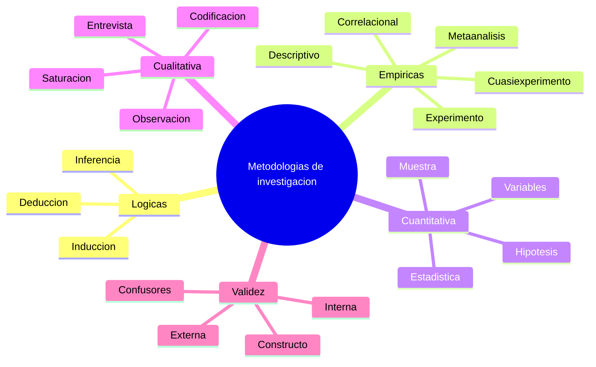

### Metodología

**Definición.** La metodología es el conjunto de procedimientos, criterios y decisiones que orientan cómo se investigará un problema. Incluye el tipo de estudio, los datos, las variables, los instrumentos, el análisis y el criterio para aceptar o rechazar una hipótesis.

**En investigación de IA.** Una metodología puede describir cómo se recolectan datos, cómo se limpian, cómo se separan conjuntos de entrenamiento y prueba, cómo se seleccionan modelos, cómo se evalúan resultados y cómo se interpretan limitaciones.

### Método lógico-deductivo

**Definición.** Es un método que parte de premisas, axiomas o conocimientos aceptados para derivar conclusiones mediante razonamiento lógico.

**En investigación de IA.** Aparece en sistemas basados en reglas, demostradores automáticos, planificación simbólica, verificación formal y razonamiento sobre propiedades de algoritmos.

**Ejemplo.** Si un sistema experto sabe que todo paciente con determinados síntomas y resultados de laboratorio cumple una regla diagnóstica, puede inferir una recomendación. La validez depende de la corrección de las reglas y de las premisas.

### Deducción

**Definición.** La deducción obtiene conclusiones particulares a partir de principios generales. Si las premisas son verdaderas y el razonamiento es válido, la conclusión se sostiene lógicamente.

**En investigación de IA.** Es central en IA simbólica, ontologías, lógica de primer orden, sistemas expertos y razonamiento automatizado.

**Ejemplo.** Regla: “si un correo contiene enlaces maliciosos confirmados, debe marcarse como riesgoso”. Caso: “este correo contiene un enlace malicioso confirmado”. Conclusión: “este correo debe marcarse como riesgoso”.

### Inducción

**Definición.** La inducción infiere regularidades generales a partir de casos particulares. Es la base de gran parte del aprendizaje automático.

**En investigación de IA.** Un modelo aprende a generalizar desde ejemplos. Si observa muchos casos de imágenes etiquetadas como “gato”, induce patrones visuales que usará para clasificar imágenes nuevas.

**Precaución.** La inducción siempre tiene riesgo de generalización incorrecta. Que un patrón aparezca en datos de entrenamiento no garantiza que sea estable en producción.

### Inferencia

**Definición.** La inferencia es el proceso de obtener una conclusión a partir de premisas, evidencia o datos. Puede ser lógica, estadística, causal o computacional.

**En investigación de IA.** La palabra tiene varios usos. En sistemas simbólicos, inferir significa derivar conclusiones con reglas. En machine learning, “hacer inferencia” suele significar aplicar un modelo entrenado a nuevos datos para obtener predicciones.

**Ejemplo.** Un motor de reglas infiere que una solicitud debe revisarse manualmente. Un clasificador infiere que una imagen pertenece a la clase “tumor benigno”.

### Método empírico

**Definición.** Es un método que obtiene conocimiento mediante experiencia, observación y experimentación. No basta con razonar; se contrasta el fenómeno con datos.

**En investigación de IA.** Es el enfoque dominante cuando se evalúan algoritmos sobre datasets, usuarios, entornos simulados o sistemas desplegados.

**Ejemplo.** Comparar tres modelos de detección de spam con el mismo conjunto de prueba es un estudio empírico.

### Experimento

**Definición.** Un experimento manipula una o más variables independientes y observa sus efectos sobre variables dependientes bajo condiciones controladas.

**En investigación de IA.** Puede consistir en modificar arquitectura, tamaño del conjunto de datos, estrategia de regularización, método de preprocesamiento o esquema de entrenamiento, manteniendo constante el resto.

**Ejemplo.** Para saber si el aumento de datos mejora la robustez de un clasificador de imágenes, se entrena el mismo modelo con y sin aumento de datos y se compara el rendimiento en un conjunto de prueba perturbado.

### Cuasiexperimento

**Definición.** Es un diseño que busca inferir relaciones causales, pero no logra control experimental completo, especialmente cuando no es posible asignar sujetos o unidades de forma aleatoria.

**En investigación de IA.** Es común en sistemas reales. Por ejemplo, evaluar un recomendador en una plataforma donde los usuarios no pueden asignarse perfectamente a grupos aleatorios por restricciones operativas.

**Precaución.** Los cuasiexperimentos requieren más cuidado en la interpretación causal. Deben analizarse variables de confusión y sesgos de selección.

### Método descriptivo

**Definición.** Describe características de un objeto, fenómeno, población o sistema sin manipular variables.

**En investigación de IA.** Puede usarse para caracterizar un dataset, analizar tipos de errores de un modelo, describir patrones de uso de un sistema o mapear literatura existente.

**Ejemplo.** Un análisis descriptivo de un dataset de radiografías puede reportar número de imágenes, distribución por edad, equipos de adquisición, clases y calidad de anotaciones.

### Método correlacional

**Definición.** Estudia relaciones entre variables tal como se presentan, sin manipulación experimental. Permite detectar asociaciones, pero no prueba causalidad por sí mismo.

**En investigación de IA.** Se usa para explorar relaciones entre variables de entrada y salidas, entre métricas de modelo y características de los datos, o entre confianza del modelo y probabilidad de error.

**Precaución.** Correlación no implica causalidad. Si un modelo usa el código postal para predecir riesgo crediticio, la correlación puede estar capturando desigualdades socioeconómicas, no una causa legítima.

### Metaanálisis

**Definición.** Es una síntesis cuantitativa de resultados de estudios previos. Busca integrar evidencia y estimar efectos generales.

**En investigación de IA.** Puede utilizarse para comparar familias de técnicas en un dominio, por ejemplo, desempeño de modelos de deep learning en diagnóstico de retinopatía diabética reportado en múltiples estudios.

**Precaución.** Un metaanálisis requiere criterios de inclusión, evaluación de calidad y tratamiento de heterogeneidad. Combinar estudios incompatibles puede generar conclusiones engañosas.

### Investigación cuantitativa

**Definición.** Es una metodología que trabaja con variables medibles, datos numéricos y análisis estadístico. Busca estimar relaciones, probar hipótesis o comparar resultados.

**En investigación de IA.** La mayoría de evaluaciones de modelos son cuantitativas: exactitud, F1, AUC, RMSE, latencia, consumo energético, costo por inferencia o tasa de error por grupo.

**Ejemplo.** Medir si un modelo B tiene una mejora estadísticamente significativa de F1 respecto a un modelo A en diez particiones de validación cruzada.

### Investigación cualitativa

**Definición.** Es una metodología orientada a comprender significados, experiencias, percepciones, prácticas y contextos. Usa entrevistas, observación, grupos focales, análisis documental o codificación temática.

**En investigación de IA.** Es esencial para evaluar interacción humano-IA, confianza, aceptación, explicaciones, experiencia de usuarios, impacto organizacional y prácticas de anotadores.

**Ejemplo.** Entrevistar a médicos que usan un sistema de apoyo diagnóstico para entender cuándo confían en sus recomendaciones y cuándo las ignoran.

### Variable independiente

**Definición.** Es la variable que el investigador manipula o selecciona para observar su efecto.

**En investigación de IA.** Puede ser el algoritmo, arquitectura, tamaño de entrenamiento, técnica de regularización, estrategia de tokenización, método de explicación o tipo de interfaz.

**Ejemplo.** En un experimento sobre modelos de texto, la variable independiente podría ser el tipo de embedding: TF-IDF, Word2Vec o transformer.

### Variable dependiente

**Definición.** Es la variable que se mide como resultado o efecto de la variable independiente.

**En investigación de IA.** Suele ser una métrica de desempeño, robustez, equidad, latencia, satisfacción de usuario o reducción de error.

**Ejemplo.** Si se compara el efecto de tres algoritmos sobre clasificación de documentos, la variable dependiente puede ser la F1 macro.

### Variable de confusión

**Definición.** Es una variable no controlada que influye tanto en la supuesta causa como en el efecto, produciendo una relación engañosa.

**En investigación de IA.** Si se compara rendimiento de modelos usando datasets recolectados en hospitales distintos, el hospital puede actuar como confusor si se asocia tanto con calidad de imagen como con diagnóstico.

**Fuente complementaria.** Pearl (2009) es referencia fundamental para razonamiento causal.

### Muestra

**Definición.** Es el subconjunto de casos, sujetos, registros o documentos usado para estudiar una población mayor.

**En investigación de IA.** Puede ser un conjunto de imágenes, textos, usuarios, transacciones o señales. Su representatividad condiciona la validez externa del resultado.

**Precaución.** Una muestra grande no corrige automáticamente un sesgo de muestreo. Un millón de ejemplos mal representados pueden producir un modelo sistemáticamente injusto.

### Muestreo

**Definición.** Es el procedimiento para seleccionar una muestra. Puede ser aleatorio, estratificado, por conveniencia, intencional, temporal o basado en criterios.

**En investigación de IA.** El muestreo define qué aprende el modelo y qué se evalúa. En problemas desbalanceados, conviene documentar la proporción de clases y el criterio de selección.

**Ejemplo.** En fraude, la clase positiva puede ser rara. Un muestreo estratificado asegura que entrenamiento y prueba contengan casos positivos suficientes para evaluar sensibilidad.

### Grupo de control

**Definición.** Es el grupo o condición que no recibe la intervención experimental y sirve como referencia para comparar efectos.

**En investigación de IA.** Puede ser un baseline, un sistema anterior, una interfaz sin explicación, un modelo sin ajuste fino o un conjunto de usuarios que no recibe una recomendación automática.

**Ejemplo.** Para evaluar un asistente de escritura, un grupo usa el asistente y otro grupo realiza la tarea sin él. Se comparan calidad, tiempo y satisfacción.

### Validez interna

**Definición.** Es el grado en que un estudio permite atribuir el efecto observado a la variable estudiada, y no a factores externos.

**En investigación de IA.** Un experimento tiene baja validez interna si cambia simultáneamente arquitectura, datos, preprocesamiento y métrica, porque no se puede saber qué causó la mejora.

### Validez externa

**Definición.** Es el grado en que los resultados pueden generalizarse a otros contextos, poblaciones, datos, entornos o momentos.

**En investigación de IA.** Un modelo evaluado solo en datos de un país, idioma o institución puede tener validez externa limitada.

**Ejemplo.** Un detector de toxicidad entrenado en inglés estadounidense puede fallar al aplicarse a español mexicano o a comunidades con usos lingüísticos distintos.

### Validez de constructo

**Definición.** Es el grado en que una medición representa realmente el concepto que dice medir.

**En investigación de IA.** Si se mide “inteligencia” de un chatbot solo con número de respuestas gramaticalmente correctas, la validez de constructo es pobre. Fluidez no equivale a razonamiento, factualidad ni utilidad.

### Tamaño del efecto

**Definición.** Es una medida de magnitud práctica de una diferencia o relación, más allá de si es estadísticamente significativa.

**En investigación de IA.** Una mejora de 0.1 puntos de exactitud puede ser estadísticamente significativa en un dataset enorme, pero irrelevante en la práctica si aumenta costo o latencia.

**Fuente complementaria.** Cohen (1988) es referencia clásica sobre análisis de potencia y tamaño del efecto.

### Intervalo de confianza

**Definición.** Es un rango de valores plausibles para una estimación, bajo un nivel de confianza dado. Permite expresar incertidumbre.

**En investigación de IA.** Reportar F1 sin intervalo puede ocultar variabilidad. En datasets pequeños, dos modelos con puntuaciones cercanas pueden no ser distinguibles estadísticamente.

### Valor p

**Definición.** El valor p expresa qué tan compatible es un resultado con una hipótesis nula bajo supuestos estadísticos específicos. No mide la probabilidad de que la hipótesis sea verdadera.

**En investigación de IA.** Puede usarse para comparar modelos, pero debe interpretarse con cautela y acompañarse de tamaño del efecto, intervalos de confianza y relevancia práctica.

<Aside type="caution" title="No confundas significancia con importancia">
Un resultado puede ser estadísticamente significativo y, aun así, no justificar cambiar un sistema de IA en producción. También puede ser no significativo por falta de potencia estadística, aunque la diferencia sea relevante.
</Aside>

---

## Búsqueda bibliográfica, fuentes y comunicación científica

Investigar en IA requiere situar cada contribución dentro del conocimiento existente. Esta sección cubre términos relacionados con estado del arte, publicaciones, fuentes, citas, derechos y comunicación académica.

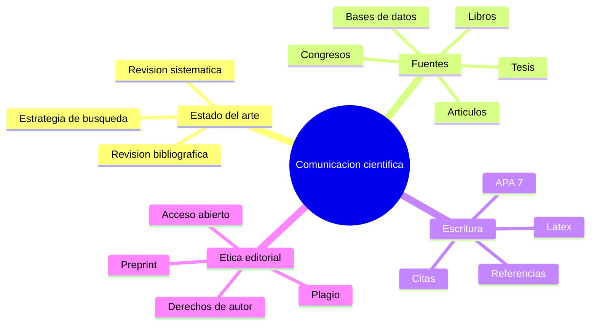

### Estado del arte

**Definición.** Es la revisión organizada de lo que se sabe, se ha probado, se discute y permanece abierto en un campo de investigación.

**En investigación de IA.** Permite identificar baselines, datasets, métricas, limitaciones, contradicciones y oportunidades de contribución.

**Ejemplo.** Antes de proponer un nuevo método de detección de anomalías, se revisan métodos clásicos, enfoques recientes, datasets públicos y criterios de evaluación usados por otros autores.

### Revisión bibliográfica

**Definición.** Es la búsqueda, selección, lectura y síntesis de fuentes relevantes sobre un tema.

**En investigación de IA.** Sirve para conocer algoritmos existentes, limitaciones técnicas, metodologías de evaluación y aplicaciones previas.

**Precaución.** Una revisión bibliográfica no debe ser una lista de resúmenes. Debe comparar, clasificar, sintetizar y detectar vacíos de investigación.

### Revisión sistemática

**Definición.** Es una revisión bibliográfica con protocolo explícito: pregunta, criterios de inclusión y exclusión, bases consultadas, cadena de búsqueda, proceso de selección y síntesis.

**En investigación de IA.** Es útil para evaluar evidencia acumulada, por ejemplo, sobre uso de redes neuronales en diagnóstico médico o sobre técnicas de explicabilidad en modelos clínicos.

**Fuente complementaria.** Page et al. (2021) proponen PRISMA 2020 como guía ampliamente usada para reportar revisiones sistemáticas.

### Estrategia de búsqueda

**Definición.** Es el plan que define dónde, cómo y con qué términos se buscará información.

**En investigación de IA.** Incluye bases como Google Scholar, IEEE Xplore, ACM Digital Library, PubMed, Scopus, arXiv, Semantic Scholar o repositorios de tesis, según el dominio.

**Ejemplo.** Para buscar sobre RAG en medicina: `retrieval augmented generation AND clinical question answering AND evaluation`.

### Fuente primaria

**Definición.** Es una fuente que reporta resultados originales: artículo científico, tesis, dataset, código de investigación o reporte técnico.

**En investigación de IA.** Un paper que presenta un algoritmo, un benchmark o una evaluación original es fuente primaria.

### Fuente secundaria

**Definición.** Es una fuente que analiza, sintetiza o interpreta fuentes primarias, como revisiones, libros, metaanálisis o surveys.

**En investigación de IA.** Un survey sobre transformers o sobre fairness en machine learning ayuda a orientarse, pero conviene consultar también los trabajos originales.

### Base de datos bibliográfica

**Definición.** Es una plataforma para localizar literatura académica, por ejemplo, Dialnet, Google Scholar, IEEE Xplore, ACM Digital Library, PubMed o Scopus.

**En investigación de IA.** La elección depende del área: salud suele requerir PubMed; ingeniería, IEEE y ACM; informática teórica, arXiv y bases especializadas.

### Gestor bibliográfico

**Definición.** Es una herramienta para organizar referencias, PDFs, citas y bibliografía. Ejemplos: Zotero, Mendeley, JabRef, EndNote.

**En investigación de IA.** Ayuda a mantener trazabilidad entre afirmaciones, fuentes y bibliografía. También evita errores de formato en tesis, artículos y reportes.

**Ejemplo.** Un proyecto en LaTeX puede usar BibTeX o BibLaTeX con un archivo `.bib` exportado desde Zotero.

### Artículo científico

**Definición.** Es un documento académico que comunica una contribución original o una revisión de conocimiento, normalmente con introducción, método, resultados, discusión y referencias.

**En investigación de IA.** Puede presentar un algoritmo, un dataset, una evaluación, una arquitectura, un sistema aplicado o una discusión ética.

**Precaución.** En IA, algunos artículos tienen resultados difíciles de reproducir si no reportan hiperparámetros, datos o código. La lectura crítica es obligatoria.

### Congreso

**Definición.** Es un evento académico donde se presentan trabajos, ponencias, pósteres, talleres o demostraciones.

**En investigación de IA.** En informática e IA, los congresos de alto nivel tienen un peso comparable o superior a muchas revistas. NeurIPS, ICML, ICLR, ACL, CVPR, AAAI e IJCAI son ejemplos reconocidos.

### Revista científica

**Definición.** Es una publicación periódica que difunde trabajos académicos sometidos a revisión editorial o por pares.

**En investigación de IA.** Las revistas suelen permitir artículos más extensos y revisiones más detalladas que muchos congresos.

### Ponencia

**Definición.** Es una presentación oral o escrita de una idea, avance, resultado o reflexión en un evento académico.

**En investigación de IA.** Una ponencia puede servir para recibir retroalimentación temprana, comunicar avances parciales o sistematizar una experiencia de investigación.

### Preprint

**Definición.** Es una versión de un trabajo científico disponible públicamente antes de revisión formal por pares o antes de publicación definitiva.

**En investigación de IA.** arXiv es muy usado para preprints. Permite difusión rápida, pero exige cautela crítica porque el contenido puede cambiar y no siempre ha sido revisado.

### Acceso abierto

**Definición.** Es un modelo de publicación que permite consultar trabajos académicos sin barreras económicas para el lector.

**En investigación de IA.** Facilita reproducibilidad, educación y transferencia de conocimiento, especialmente cuando se combina con datos y código abiertos.

### Cita

**Definición.** Es la mención dentro del texto a una fuente usada para respaldar una afirmación, método, dato o idea.

**En investigación de IA.** Una cita permite reconocer antecedentes, ubicar una contribución y evitar plagio. También permite al lector verificar la procedencia de una definición o técnica.

### Referencia bibliográfica

**Definición.** Es la entrada completa que permite identificar y localizar una fuente citada.

**En investigación de IA.** Debe incluir autores, año, título, publicación, volumen, páginas, DOI o URL cuando aplique.

### APA 7

**Definición.** Es la séptima edición del estilo de citación de la American Psychological Association. Define cómo presentar citas y referencias.

**En investigación de IA.** Aunque muchas conferencias de IA usan estilos propios, APA 7 es común en tesis, trabajos universitarios y áreas interdisciplinarias.

### Plagio

**Definición.** Es presentar ideas, texto, datos, código, figuras o resultados ajenos como propios, sin atribución adecuada.

**En investigación de IA.** El plagio puede incluir copiar código de repositorios, reutilizar datasets sin licencia, parafrasear papers sin cita o presentar resultados generados por terceros como propios.

<Aside type="danger" title="Plagio con IA generativa">
Usar un modelo generativo para redactar no elimina la obligación de citar fuentes ni de verificar afirmaciones. Si el texto generado incorpora ideas, datos o citas inexistentes, la responsabilidad sigue siendo del autor.
</Aside>

### Derechos de autor

**Definición.** Son derechos legales sobre obras intelectuales como textos, figuras, software, bases de datos, imágenes y materiales docentes.

**En investigación de IA.** Importan al reutilizar datasets, scraping web, entrenar modelos, publicar código, reproducir figuras o distribuir material derivado.

### Licencia

**Definición.** Es el conjunto de condiciones bajo las cuales puede usarse, modificarse o redistribuirse una obra.

**En investigación de IA.** Las licencias de datos y código condicionan si un modelo puede entrenarse, publicarse o usarse comercialmente.

**Ejemplo.** Un dataset con licencia no comercial puede servir para investigación académica, pero no para entrenar un producto comercial sin autorización.

---

## Gestión de proyectos de investigación en IA

La IA aplicada rara vez es solo un experimento aislado. Suele requerir planificación, financiación, gestión económica, perfiles interdisciplinarios, cronograma, entregables y criterios de éxito.

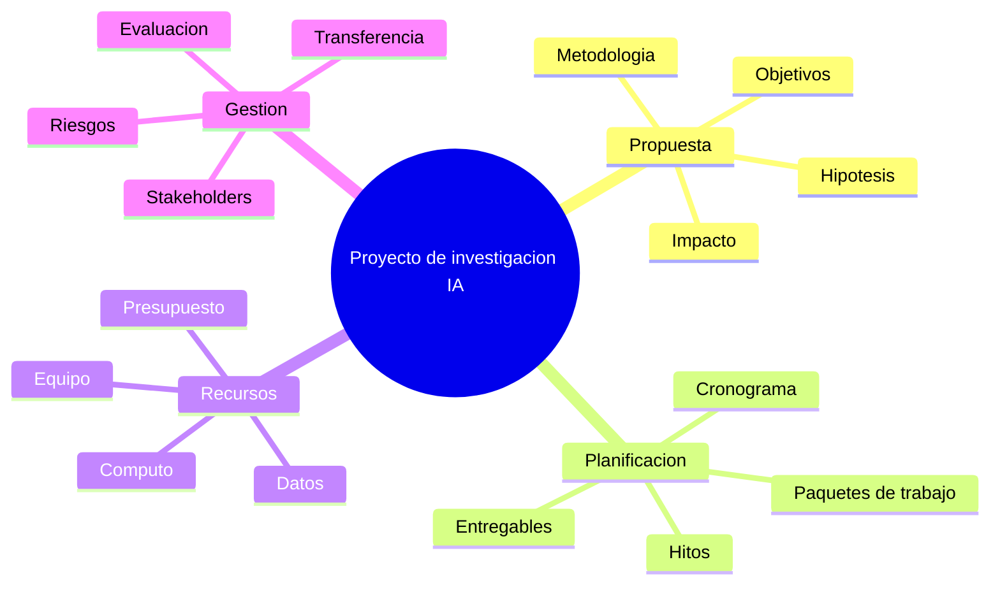

### Proyecto de investigación

**Definición.** Es una iniciativa planificada para responder una pregunta, resolver un problema o producir conocimiento nuevo mediante actividades coordinadas.

**En investigación de IA.** Un proyecto puede incluir obtención de datos, diseño metodológico, entrenamiento, evaluación, publicación, despliegue piloto y análisis ético.

### Ciencia basada en proyectos

**Definición.** Es una forma de organizar investigación en torno a objetivos, recursos, responsables, etapas y resultados esperados.

**En investigación de IA.** Es útil porque los proyectos de IA combinan investigación, ingeniería, infraestructura, datos y validación con usuarios o dominios especializados.

### Convocatoria de financiación

**Definición.** Es un llamado institucional para presentar propuestas que compitan por recursos económicos o materiales.

**En investigación de IA.** La convocatoria suele definir líneas prioritarias, criterios de elegibilidad, duración, presupuesto, entregables, impacto esperado y obligaciones de reporte.

### Propuesta de investigación

**Definición.** Es el documento que plantea problema, objetivos, hipótesis, metodología, antecedentes, equipo, presupuesto, cronograma e impacto esperado.

**En investigación de IA.** Una buena propuesta no promete “usar IA” de forma genérica. Define por qué IA es apropiada, qué datos existen, cómo se evaluará, cuáles son los riesgos y qué se entregará.

### Objetivo general

**Definición.** Es la meta central del proyecto.

**En investigación de IA.** Debe formularse con precisión: “Diseñar y evaluar un modelo para clasificar reportes de soporte técnico en español” es mejor que “aplicar IA al soporte técnico”.

### Objetivos específicos

**Definición.** Son metas parciales que descomponen el objetivo general en actividades verificables.

**En investigación de IA.** Pueden incluir construir corpus, definir taxonomía, entrenar baselines, evaluar modelos, analizar errores y publicar resultados.

### Paquete de trabajo

**Definición.** Es un bloque de actividades relacionadas dentro de un proyecto, con responsable, duración y entregables.

**En investigación de IA.** Ejemplos: adquisición de datos, anotación, modelado, evaluación, despliegue piloto, análisis ético y difusión.

### Entregable

**Definición.** Es un producto verificable del proyecto: reporte, dataset, modelo, prototipo, artículo, documentación, código o manual.

**En investigación de IA.** Un entregable debe tener criterios de aceptación. “Modelo entrenado” es ambiguo; “modelo serializado con métricas, model card, script de inferencia y pruebas reproducibles” es verificable.

### Hito

**Definición.** Es un punto importante del cronograma que marca avance o decisión.

**En investigación de IA.** Un hito puede ser la validación del dataset, la aprobación del protocolo ético, la obtención de un baseline o la finalización de una prueba piloto.

### Cronograma

**Definición.** Es la planificación temporal de actividades.

**En investigación de IA.** Debe contemplar riesgos frecuentes: retrasos en datos, anotación, limpieza, permisos, cómputo, entrenamiento, evaluación y revisión con expertos.

### Presupuesto

**Definición.** Es la estimación de costos y recursos necesarios.

**En investigación de IA.** Puede incluir personal, infraestructura, GPU, almacenamiento, licencias, adquisición de datos, anotación, auditorías, publicación y mantenimiento.

### Riesgo de proyecto

**Definición.** Es un evento incierto que puede afectar alcance, costo, tiempo, calidad o impacto.

**En investigación de IA.** Riesgos típicos: datos insuficientes, sesgo, baja calidad de etiquetas, restricciones legales, costo computacional, falta de adopción por usuarios o desempeño insuficiente.

### Stakeholder

**Definición.** Es una persona, grupo u organización afectada por el proyecto o capaz de influir en él.

**En investigación de IA.** Incluye usuarios finales, responsables legales, expertos de dominio, sujetos de datos, equipo técnico, directivos y comunidades impactadas.

### Transferencia tecnológica

**Definición.** Es el proceso de llevar conocimiento, prototipos o resultados de investigación hacia uso práctico, comercial, social o institucional.

**En investigación de IA.** Requiere documentación, evaluación en contexto real, licenciamiento, mantenimiento, gestión de riesgos y adaptación organizacional.

### TRL o nivel de madurez tecnológica

**Definición.** TRL significa Technology Readiness Level. Es una escala usada para estimar la madurez de una tecnología, desde idea básica hasta sistema probado en entorno operativo.

**En investigación de IA.** Un modelo con buen resultado en notebook puede tener TRL bajo si no se ha probado en producción, con usuarios reales, datos cambiantes y restricciones legales.

---

## Fundamentos de inteligencia artificial

La investigación en IA se apoya en conceptos históricos, escuelas técnicas y paradigmas que conviene distinguir. Esta sección recoge términos base del campo.

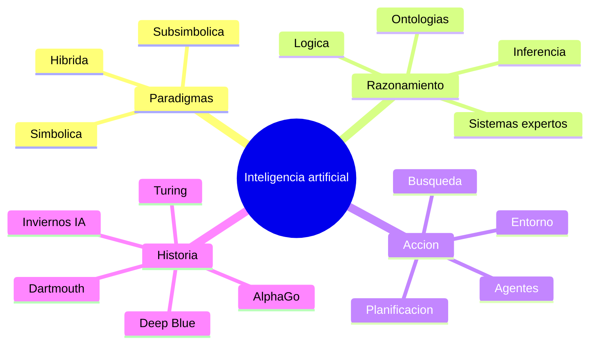

### Inteligencia artificial

**Definición.** La inteligencia artificial es una disciplina científica y técnica orientada a construir sistemas capaces de realizar tareas que asociamos con capacidades inteligentes, como aprender, razonar, percibir, decidir, planificar, comunicarse o resolver problemas.

**En investigación de IA.** El término es amplio. Puede incluir desde sistemas expertos basados en reglas hasta redes neuronales profundas, agentes autónomos, robótica, planificación, NLP o sistemas generativos.

**Precaución.** No toda automatización es IA. Un script con reglas fijas puede automatizar una tarea, pero no necesariamente aprende, razona o se adapta.

### Inteligencia

**Definición.** Capacidad de comprender, resolver problemas, adaptarse al entorno y usar conocimiento para actuar. En investigación, su definición depende del marco teórico adoptado.

**En investigación de IA.** La ambigüedad del concepto obliga a operacionalizarlo: no se mide “inteligencia” en abstracto, sino desempeño en tareas concretas.

### IA simbólica

**Definición.** Paradigma que representa conocimiento mediante símbolos, reglas, lógica, grafos, ontologías o estructuras explícitas manipulables por razonamiento.

**En investigación de IA.** Es útil cuando se requiere explicabilidad, reglas formales, trazabilidad o conocimiento experto explícito.

**Ejemplo.** Un sistema experto para diagnóstico basado en reglas clínicas es IA simbólica.

### IA subsimbólica

**Definición.** Paradigma que aprende representaciones distribuidas a partir de datos, normalmente sin reglas explícitas interpretables por humanos.

**En investigación de IA.** Incluye redes neuronales, deep learning y muchos métodos estadísticos. Suele destacar en percepción, lenguaje e imágenes.

**Precaución.** Su potencia predictiva puede acompañarse de baja interpretabilidad.

### IA híbrida

**Definición.** Enfoque que combina componentes simbólicos y subsimbólicos.

**En investigación de IA.** Busca integrar aprendizaje estadístico con conocimiento explícito, razonamiento, restricciones o explicaciones.

**Ejemplo.** Un sistema médico que usa una red neuronal para detectar patrones en imágenes y una ontología clínica para validar relaciones diagnósticas.

### Agente inteligente

**Definición.** Sistema que percibe un entorno mediante sensores o entradas, procesa información y actúa mediante acciones orientadas a objetivos.

**En investigación de IA.** Los agentes permiten estudiar autonomía, toma de decisiones, aprendizaje por refuerzo, planificación y comportamiento en entornos dinámicos.

**Ejemplo.** Un robot aspirador, un bot de trading, un agente de videojuegos o un sistema de control de tráfico.

### Racionalidad

**Definición.** Capacidad de seleccionar acciones que maximizan el logro de objetivos dados, considerando información disponible y restricciones.

**En investigación de IA.** La racionalidad de un agente no exige omnisciencia. Se evalúa según lo que puede percibir, calcular y ejecutar.

### Entorno

**Definición.** Es el contexto donde opera un agente. Puede ser observable o parcialmente observable, determinista o estocástico, estático o dinámico, discreto o continuo.

**En investigación de IA.** Definir el entorno evita evaluar un agente con supuestos irreales.

**Ejemplo.** Un tablero de ajedrez es discreto y completamente observable; conducir en ciudad es continuo, dinámico y parcialmente observable.

### Máquina de Turing

**Definición.** Modelo abstracto de computación propuesto por Alan Turing para formalizar qué significa que un procedimiento sea computable.

**En investigación de IA.** Es parte de la base teórica de la computación y, por extensión, de la posibilidad de implementar procesos de razonamiento o cálculo en máquinas.

### Test de Turing

**Definición.** Prueba conceptual propuesta por Turing para explorar si una máquina puede exhibir comportamiento conversacional indistinguible del humano ante un juez.

**En investigación de IA.** Históricamente influyó en la discusión sobre inteligencia artificial, aunque hoy se considera insuficiente para evaluar inteligencia general, seguridad, factualidad o utilidad.

### Búsqueda heurística

**Definición.** Técnica de exploración de espacios de estados guiada por una función heurística que estima qué caminos son más prometedores.

**En investigación de IA.** Aparece en planificación, juegos, optimización, robótica y resolución de problemas.

**Ejemplo.** A* usa una función que combina costo acumulado y estimación del costo restante para encontrar rutas eficientes.

### Planificación automática

**Definición.** Área de IA que busca generar secuencias de acciones para alcanzar objetivos desde un estado inicial, considerando restricciones y efectos de acciones.

**En investigación de IA.** Se usa en robótica, logística, videojuegos, agentes autónomos y automatización de procesos.

### Lógica proposicional

**Definición.** Sistema formal que trabaja con proposiciones que pueden ser verdaderas o falsas y conectores como AND, OR y NOT.

**En investigación de IA.** Sirve como base para representación simple de conocimiento, reglas y razonamiento automático.

### Lógica de primer orden

**Definición.** Extiende la lógica proposicional con objetos, relaciones, predicados y cuantificadores.

**En investigación de IA.** Permite representar conocimiento más rico: entidades, propiedades y relaciones.

**Ejemplo.** “Todo medicamento contraindicado para pacientes alérgicos a penicilina debe evitarse” requiere cuantificar sobre pacientes y medicamentos.

### Lógica difusa

**Definición.** Marco lógico que permite grados de pertenencia entre 0 y 1, en lugar de verdad binaria estricta.

**En investigación de IA.** Es útil cuando los conceptos son graduales: “temperatura alta”, “riesgo moderado”, “similitud elevada”.

### Ontología

**Definición.** Representación formal de conceptos, propiedades y relaciones de un dominio.

**En investigación de IA.** Facilita interoperabilidad, razonamiento, validación semántica y documentación del conocimiento.

**Ejemplo.** Una ontología médica puede relacionar síntomas, enfermedades, tratamientos y contraindicaciones.

### Sistema experto

**Definición.** Sistema que captura conocimiento de expertos de un dominio y lo aplica mediante reglas o inferencias para apoyar decisiones.

**En investigación de IA.** Es importante para dominios donde el conocimiento explícito y la trazabilidad son prioritarios.

**Precaución.** Los sistemas expertos pueden volverse difíciles de mantener si el conocimiento cambia o si las reglas crecen sin arquitectura clara.

---

## Aprendizaje automático y evaluación experimental

El aprendizaje automático ocupa un lugar central en la investigación contemporánea de IA. Esta sección cubre términos necesarios para diseñar, ejecutar y evaluar experimentos con modelos.

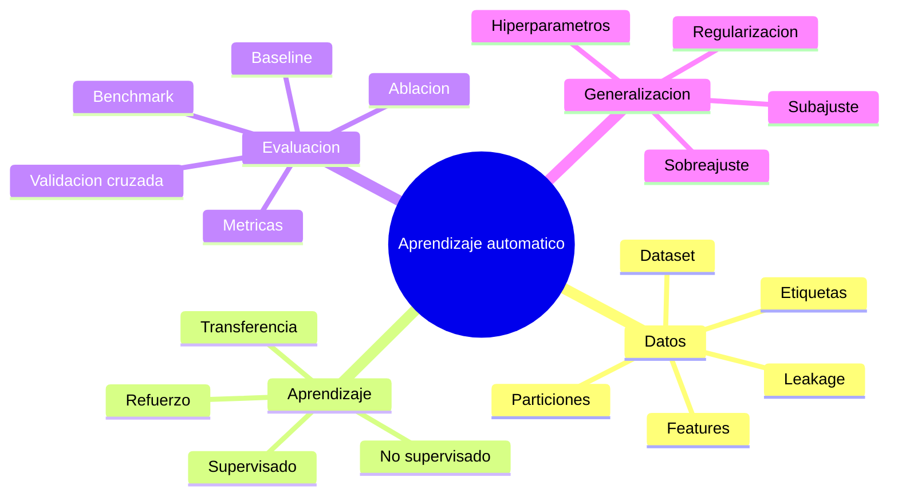

### Aprendizaje automático

**Definición.** Rama de la IA que estudia algoritmos capaces de mejorar su desempeño en una tarea a partir de datos o experiencia.

**En investigación de IA.** Permite construir modelos predictivos o descriptivos cuando no se conocen reglas explícitas suficientes para resolver el problema.

**Fuente complementaria.** Mitchell (1997) es una referencia clásica para la definición formal de aprendizaje automático.

### Dataset

**Definición.** Conjunto organizado de datos usado para análisis, entrenamiento, validación o evaluación.

**En investigación de IA.** Un dataset debe documentarse: origen, variables, etiquetas, criterios de inclusión, sesgos conocidos, licencias, particiones y limitaciones.

**Precaución.** El dataset no es una realidad neutral. Es una construcción condicionada por procesos de recolección, anotación y filtrado.

### Característica o feature

**Definición.** Variable de entrada usada por un modelo para aprender patrones o hacer predicciones.

**En investigación de IA.** Puede ser una columna tabular, un pixel, un token, un embedding, una señal temporal o una variable derivada.

**Ejemplo.** En predicción de abandono de clientes, features pueden ser antigüedad, frecuencia de compra, reclamos y uso reciente.

### Etiqueta o target

**Definición.** Valor objetivo que el modelo intenta predecir en aprendizaje supervisado.

**En investigación de IA.** Puede ser una clase, un valor numérico, una máscara de segmentación, una puntuación o una respuesta esperada.

**Precaución.** Etiquetas ruidosas o subjetivas limitan la calidad del modelo. En tareas humanas complejas, la etiqueta puede reflejar desacuerdo entre anotadores.

### Conjunto de entrenamiento

**Definición.** Parte de los datos usada para ajustar parámetros del modelo.

**En investigación de IA.** Debe separarse cuidadosamente de los datos de evaluación para evitar estimaciones optimistas.

### Conjunto de validación

**Definición.** Parte de los datos usada para seleccionar hiperparámetros, arquitectura o criterios de parada.

**En investigación de IA.** Permite tomar decisiones de modelado sin contaminar el conjunto de prueba.

### Conjunto de prueba

**Definición.** Parte de los datos reservada para estimar el desempeño final del modelo.

**En investigación de IA.** Debe usarse lo menos posible durante el desarrollo. Si se consulta repetidamente para ajustar decisiones, deja de ser una prueba honesta.

### Aprendizaje supervisado

**Definición.** Tipo de aprendizaje donde el modelo entrena con ejemplos etiquetados.

**En investigación de IA.** Incluye clasificación, regresión, segmentación y otras tareas con respuesta conocida.

**Ejemplo.** Clasificar correos como spam o no spam usando ejemplos previamente etiquetados.

### Aprendizaje no supervisado

**Definición.** Tipo de aprendizaje donde el modelo busca estructura en datos sin etiquetas objetivo.

**En investigación de IA.** Incluye clustering, reducción de dimensionalidad, detección de anomalías y modelado de representaciones.

**Ejemplo.** Agrupar clientes según comportamiento de compra sin conocer previamente sus segmentos.

### Aprendizaje por refuerzo

**Definición.** Paradigma donde un agente aprende a actuar en un entorno mediante recompensas y penalizaciones.

**En investigación de IA.** Se usa en juegos, robótica, control, optimización secuencial y sistemas autónomos.

**Fuente complementaria.** Sutton y Barto (2018) son referencia central del área.

### Clasificación

**Definición.** Tarea supervisada que asigna una entrada a una clase discreta.

**En investigación de IA.** Ejemplos: detectar spam, clasificar imágenes, predecir diagnóstico o identificar intención de usuario.

### Regresión

**Definición.** Tarea supervisada que predice un valor continuo.

**En investigación de IA.** Ejemplos: estimar precio, demanda, temperatura, tiempo de falla o riesgo numérico.

### Clustering o agrupamiento

**Definición.** Tarea no supervisada que organiza datos en grupos según similitud.

**En investigación de IA.** Sirve para segmentación, exploración de datos, compresión, descubrimiento de patrones y análisis de poblaciones.

### Baseline

**Definición.** Modelo, método o resultado de referencia contra el cual se compara una propuesta.

**En investigación de IA.** Un baseline puede ser una heurística simple, un modelo clásico, un sistema existente o el estado del arte.

**Precaución.** Una contribución parece fuerte si se compara contra baselines débiles. Una evaluación honesta usa baselines razonables y bien ajustados.

### Benchmark

**Definición.** Conjunto estandarizado de tareas, datos y métricas usado para comparar métodos.

**En investigación de IA.** Facilita comparabilidad, pero puede inducir sobreajuste al benchmark si la comunidad optimiza excesivamente para una prueba específica.

**Fuente complementaria.** Papers with Code y plataformas de benchmarks han popularizado rankings, aunque deben interpretarse con cautela.

### Validación cruzada

**Definición.** Técnica para estimar desempeño dividiendo los datos en varias particiones, entrenando y evaluando repetidamente.

**En investigación de IA.** Es útil cuando el dataset es pequeño o se desea estimar variabilidad del rendimiento.

**Fuente complementaria.** Kohavi (1995) es una referencia clásica sobre validación cruzada y bootstrap para estimación de exactitud y selección de modelos.

### Fuga de datos o data leakage

**Definición.** Ocurre cuando información que no estaría disponible en el momento de predicción entra directa o indirectamente al entrenamiento o evaluación.

**En investigación de IA.** Es una de las causas más comunes de resultados inflados.

**Ejemplo.** Normalizar todo el dataset antes de separar entrenamiento y prueba puede filtrar información estadística del conjunto de prueba.

<Aside type="danger" title="Data leakage puede invalidar un artículo">
Si el conjunto de prueba influye en el entrenamiento, selección de variables, normalización, imputación, ajuste de hiperparámetros o selección de modelo, la estimación final puede ser demasiado optimista.
</Aside>

### Sobreajuste u overfitting

**Definición.** Ocurre cuando un modelo aprende patrones específicos del entrenamiento que no generalizan a datos nuevos.

**En investigación de IA.** Se detecta cuando el rendimiento de entrenamiento es alto y el de validación o prueba es bajo.

**Ejemplo.** Una red neuronal memoriza imágenes de entrenamiento y falla con imágenes tomadas por otra cámara.

### Subajuste o underfitting

**Definición.** Ocurre cuando el modelo es demasiado simple, está mal entrenado o no captura la estructura del problema.

**En investigación de IA.** Se observa cuando tanto entrenamiento como validación tienen bajo rendimiento.

### Regularización

**Definición.** Conjunto de técnicas para reducir sobreajuste penalizando complejidad o introduciendo restricciones.

**En investigación de IA.** Incluye L1, L2, dropout, early stopping, aumento de datos y restricciones arquitectónicas.

### Hiperparámetro

**Definición.** Configuración externa al aprendizaje de parámetros del modelo. No se aprende directamente con gradiente o ajuste estándar, sino que se define antes o durante el proceso de búsqueda.

**En investigación de IA.** Ejemplos: tasa de aprendizaje, profundidad del árbol, número de capas, tamaño de batch, valor de regularización.

### Ablation study o estudio de ablación

**Definición.** Experimento que elimina o modifica componentes de un sistema para estimar su contribución al resultado.

**En investigación de IA.** Es fundamental para demostrar qué parte de una arquitectura realmente aporta valor.

**Ejemplo.** En un modelo con atención, embeddings especiales y preprocesamiento, se entrena una variante sin cada componente para medir la pérdida de desempeño.

### Métrica

**Definición.** Medida cuantitativa usada para evaluar un modelo o sistema.

**En investigación de IA.** Debe alinearse con el objetivo. En clases desbalanceadas, exactitud puede ser engañosa y conviene usar F1, recall, precisión, AUC, balanced accuracy o métricas por grupo.

### Exactitud o accuracy

**Definición.** Proporción de predicciones correctas sobre el total.

**En investigación de IA.** Es intuitiva, pero puede ser mala métrica en datos desbalanceados.

**Ejemplo.** Si 99 % de transacciones no son fraude, un modelo que siempre predice “no fraude” tendrá 99 % de exactitud y será inútil para detectar fraude.

### Precisión

**Definición.** Proporción de predicciones positivas que realmente son positivas.

**En investigación de IA.** Es importante cuando los falsos positivos son costosos.

### Exhaustividad o recall

**Definición.** Proporción de positivos reales que el modelo detecta.

**En investigación de IA.** Es crucial cuando los falsos negativos son costosos, por ejemplo, en diagnóstico o seguridad.

### F1

**Definición.** Media armónica de precisión y recall.

**En investigación de IA.** Es útil cuando se busca balancear falsos positivos y falsos negativos.

### AUC-ROC

**Definición.** Área bajo la curva ROC, que relaciona tasa de verdaderos positivos y falsos positivos a distintos umbrales.

**En investigación de IA.** Sirve para comparar capacidad discriminativa, pero puede ser optimista en problemas muy desbalanceados; en esos casos puede convenir AUC-PR.

---

## Deep learning, PLN, sistemas cognitivos y modelos fundacionales

Esta sección reúne conceptos actuales de IA basada en redes profundas, lenguaje, percepción, modelos fundacionales y sistemas cognitivos. Muchos de estos términos enriquecen el material base porque son esenciales en investigación contemporánea.

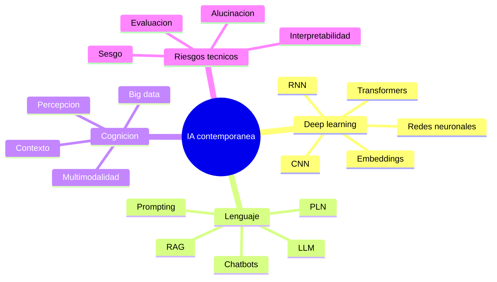

### Red neuronal artificial

**Definición.** Modelo computacional inspirado de forma abstracta en redes de neuronas, formado por unidades conectadas que transforman entradas en salidas mediante pesos y funciones de activación.

**En investigación de IA.** Es la base de deep learning y se aplica a imágenes, texto, audio, series temporales, recomendación y control.

### Perceptrón

**Definición.** Modelo lineal de clasificación binaria que combina entradas ponderadas y aplica una función de decisión.

**En investigación de IA.** Es importante históricamente porque conecta la idea de neurona artificial con aprendizaje supervisado.

### Perceptrón multicapa o MLP

**Definición.** Red neuronal feedforward con una o más capas ocultas.

**En investigación de IA.** Puede aproximar funciones complejas y se usa como modelo base en datos tabulares, embeddings o tareas donde no se requiere estructura espacial o secuencial explícita.

### Deep learning

**Definición.** Familia de métodos de aprendizaje automático basados en redes neuronales con múltiples capas que aprenden representaciones jerárquicas.

**En investigación de IA.** Es dominante en visión, lenguaje, audio, traducción, reconocimiento de voz y modelos generativos.

**Fuente complementaria.** Goodfellow, Bengio y Courville (2016) ofrecen una referencia amplia sobre fundamentos de deep learning.

### CNN o red neuronal convolucional

**Definición.** Arquitectura especializada en procesar datos con estructura espacial, como imágenes, mediante filtros convolucionales.

**En investigación de IA.** Ha sido fundamental en visión por computador, segmentación médica, detección de objetos y análisis de imágenes satelitales.

### RNN o red neuronal recurrente

**Definición.** Arquitectura diseñada para secuencias, donde el estado interno permite procesar información temporal o contextual.

**En investigación de IA.** Fue central en lenguaje y series temporales antes del predominio de transformers.

### Transformer

**Definición.** Arquitectura basada en mecanismos de atención que procesa secuencias permitiendo modelar dependencias entre elementos sin recurrencia clásica.

**En investigación de IA.** Es la base de muchos modelos modernos de lenguaje, traducción, visión y sistemas multimodales.

**Fuente complementaria.** Vaswani et al. (2017) introdujeron la arquitectura transformer.

### Atención

**Definición.** Mecanismo que permite ponderar qué partes de una entrada son más relevantes para producir una salida.

**En investigación de IA.** Facilita modelar relaciones entre tokens, regiones de imagen o elementos de una secuencia.

### Embedding

**Definición.** Representación vectorial densa de un objeto, como palabra, documento, imagen, usuario o producto, en un espacio numérico donde la cercanía suele reflejar similitud aprendida.

**En investigación de IA.** Los embeddings permiten búsqueda semántica, recomendación, clasificación, clustering y transferencia de conocimiento.

### Procesamiento del lenguaje natural

**Definición.** Área de IA que estudia la interacción entre computadoras y lenguaje humano, incluyendo análisis, generación, traducción, resumen, clasificación y diálogo.

**En investigación de IA.** Es clave para chatbots, motores de búsqueda, análisis de sentimiento, extracción de información y asistentes conversacionales.

### Chatbot

**Definición.** Sistema de software diseñado para interactuar con usuarios mediante lenguaje natural.

**En investigación de IA.** Puede evaluarse por comprensión de intención, pertinencia, seguridad, satisfacción del usuario, factualidad y capacidad de mantener contexto.

### Computación cognitiva

**Definición.** Enfoque amplio que busca construir sistemas capaces de procesar información contextual, multimodal y no estructurada de manera similar a ciertos procesos cognitivos humanos.

**En investigación de IA.** Combina lenguaje, percepción, razonamiento, aprendizaje, contexto y datos heterogéneos.

**Precaución.** El término puede usarse de forma mercadológica. Conviene exigir definiciones operativas y métricas claras.

### Big data

**Definición.** Conjunto de prácticas y tecnologías para manejar datos caracterizados por volumen, velocidad, variedad, veracidad y valor.

**En investigación de IA.** Permite entrenar modelos con grandes volúmenes de datos, pero también introduce retos de calidad, sesgo, gobernanza y costo.

### Percepción computacional

**Definición.** Área que permite a sistemas computacionales interpretar señales sensoriales como imágenes, audio, video o datos de sensores.

**En investigación de IA.** Incluye visión por computador, reconocimiento de voz, detección de objetos, análisis biométrico y percepción robótica.

### Modelo fundacional

**Definición.** Modelo entrenado con datos amplios y a gran escala, adaptable a múltiples tareas posteriores mediante prompting, fine-tuning u otras técnicas.

**En investigación de IA.** Cambia la lógica experimental porque una misma base puede transferirse a muchas aplicaciones, pero también hereda sesgos, riesgos y limitaciones del entrenamiento original.

**Fuente complementaria.** Bommasani et al. (2021) popularizan el término y discuten oportunidades y riesgos.

### LLM o modelo grande de lenguaje

**Definición.** Modelo de lenguaje de gran escala entrenado para predecir, generar o transformar texto, normalmente basado en transformers.

**En investigación de IA.** Se evalúa en tareas de generación, razonamiento, extracción, programación, resumen, traducción, diálogo, factualidad y seguridad.

**Precaución.** Fluidez no equivale a verdad. La evaluación de LLM requiere pruebas de factualidad, robustez, sesgo, seguridad y alineación con la tarea.

### Prompt

**Definición.** Entrada o instrucción dada a un modelo generativo para condicionar su salida.

**En investigación de IA.** El prompt funciona como parte del diseño experimental. Debe documentarse porque cambios menores pueden alterar resultados.

### Prompt engineering

**Definición.** Diseño sistemático de instrucciones, ejemplos, formato y contexto para guiar la salida de un modelo generativo.

**En investigación de IA.** Puede ser objeto de comparación experimental: cero ejemplos, pocos ejemplos, cadena de pensamiento, plantillas o instrucciones de formato.

### Fine-tuning

**Definición.** Ajuste adicional de un modelo preentrenado usando datos específicos de una tarea o dominio.

**En investigación de IA.** Permite adaptar modelos a dominios especializados, idiomas, estilos o formatos, aunque puede requerir datos limpios y control de sobreajuste.

### RAG o generación aumentada por recuperación

**Definición.** Arquitectura que combina un modelo generativo con un componente de recuperación de documentos o pasajes para responder usando conocimiento externo.

**En investigación de IA.** Es relevante cuando se requiere actualizar conocimiento, citar fuentes, reducir alucinaciones o trabajar con corpus privado.

**Fuente complementaria.** Lewis et al. (2020) introdujeron un marco influyente de retrieval-augmented generation para tareas intensivas en conocimiento.

### Alucinación

**Definición.** Salida generada por un modelo que parece plausible pero es falsa, no respaldada o inventada.

**En investigación de IA.** Es un riesgo central en LLMs, especialmente en medicina, derecho, educación, periodismo y soporte técnico.

**Precaución.** RAG puede reducir alucinaciones, pero no las elimina. Se requiere evaluación de citas, verificación y manejo de incertidumbre.

### Multimodalidad

**Definición.** Capacidad de procesar o generar información en varios modos: texto, imagen, audio, video, señales o acciones.

**En investigación de IA.** Permite sistemas que entienden documentos escaneados, describen imágenes, responden sobre videos o integran sensores robóticos.

---

## Computación bioinspirada, robótica y sistemas emergentes

La computación bioinspirada toma inspiración de procesos naturales: evolución, enjambres, cooperación, adaptación y emergencia. En investigación de IA, estos métodos se usan para optimización, búsqueda, control y simulación.

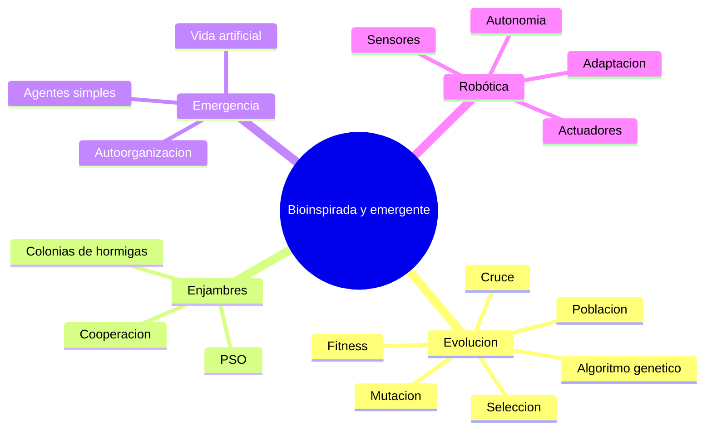

### Computación bioinspirada

**Definición.** Área que diseña métodos computacionales inspirados en fenómenos biológicos o naturales.

**En investigación de IA.** Se usa en optimización, planificación, diseño automático, aprendizaje, búsqueda y simulación de sistemas complejos.

### Algoritmo genético

**Definición.** Método de optimización inspirado en evolución biológica. Opera sobre una población de soluciones candidatas que se seleccionan, cruzan y mutan según una función de aptitud.

**En investigación de IA.** Puede optimizar hiperparámetros, arquitecturas, reglas, rutas, estrategias o soluciones en espacios de búsqueda complejos.

**Ejemplo.** Para maximizar `f(x, y) = x^2 + 5y^3`, cada individuo puede codificar valores de `x` e `y`, y la función fitness evalúa qué tan buena es la solución.

### Población

**Definición.** Conjunto de soluciones candidatas en un algoritmo evolutivo.

**En investigación de IA.** La diversidad de la población ayuda a explorar el espacio de búsqueda y evitar convergencia prematura.

### Gen

**Definición.** Unidad de información que codifica parte de una solución.

**En investigación de IA.** En optimización de hiperparámetros, un gen podría representar tasa de aprendizaje, número de capas o tipo de activación.

### Cromosoma o individuo

**Definición.** Representación completa de una solución candidata.

**En investigación de IA.** Un individuo puede codificar una arquitectura de red, un conjunto de reglas, una ruta o una configuración de modelo.

### Fitness o función de aptitud

**Definición.** Función que evalúa qué tan buena es una solución candidata respecto al objetivo.

**En investigación de IA.** Debe reflejar el objetivo real. Si solo mide accuracy, puede ignorar latencia, costo, interpretabilidad o equidad.

### Selección

**Definición.** Proceso que elige individuos para reproducirse o pasar a la siguiente generación.

**En investigación de IA.** Métodos de selección mal diseñados pueden perder diversidad o atascarse en soluciones locales.

### Cruce o crossover

**Definición.** Operación que combina partes de dos o más individuos para producir descendencia.

**En investigación de IA.** Permite mezclar soluciones prometedoras.

### Mutación

**Definición.** Cambio aleatorio en uno o más genes de un individuo.

**En investigación de IA.** Introduce exploración y ayuda a escapar de óptimos locales.

### Programación genética

**Definición.** Técnica evolutiva donde los individuos suelen representar programas, expresiones o árboles computacionales que evolucionan.

**En investigación de IA.** Se usa para descubrir reglas, fórmulas, estrategias o pequeños programas que resuelven tareas.

### Inteligencia de enjambre

**Definición.** Enfoque inspirado en comportamiento colectivo de agentes simples, como hormigas, abejas, peces o aves.

**En investigación de IA.** Permite resolver problemas de optimización distribuida, rutas, asignación de recursos y coordinación.

### Optimización por colonia de hormigas

**Definición.** Algoritmo inspirado en el depósito de feromonas de hormigas para encontrar caminos eficientes.

**En investigación de IA.** Se aplica en problemas de rutas, calendarización, redes y combinatoria.

### PSO u optimización por enjambre de partículas

**Definición.** Método donde partículas exploran el espacio de soluciones ajustando su movimiento según su experiencia y la del grupo.

**En investigación de IA.** Puede usarse para optimización continua de parámetros o hiperparámetros.

### Sistema emergente

**Definición.** Sistema cuyo comportamiento global surge de interacciones locales entre componentes, sin control central explícito.

**En investigación de IA.** Importa en multiagentes, enjambres, mercados simulados, tráfico, redes sociales y aprendizaje colectivo.

### Vida artificial

**Definición.** Campo que simula o construye sistemas con propiedades asociadas a la vida, como adaptación, evolución, reproducción o autoorganización.

**En investigación de IA.** Permite estudiar agentes, evolución de estrategias y comportamiento colectivo.

### Robótica

**Definición.** Ciencia y técnica del diseño, construcción y control de máquinas capaces de ejecutar acciones físicas, a menudo con autonomía y adaptación al entorno.

**En investigación de IA.** Integra percepción, planificación, control, aprendizaje, sensores, actuadores y seguridad.

---

## Ingeniería, datos y despliegue en investigación de IA

Un resultado de IA no termina en el entrenamiento. Los proyectos modernos requieren pipelines, trazabilidad, documentación, despliegue, monitoreo y reproducibilidad técnica.

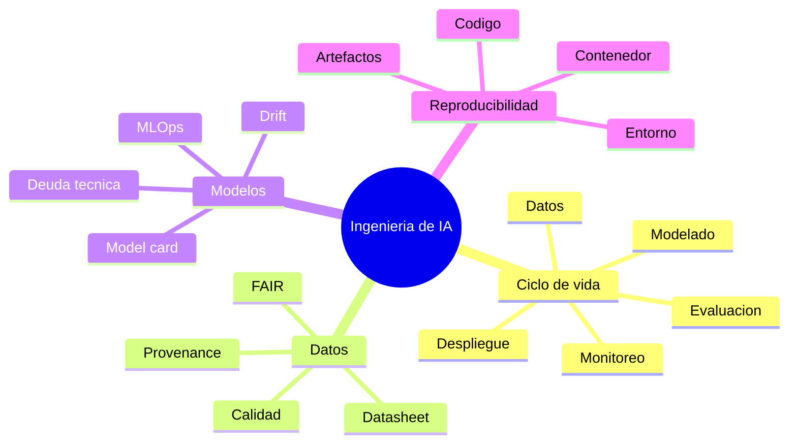

### Ingeniería de software

**Definición.** Disciplina que aplica principios sistemáticos para desarrollar, mantener y evolucionar software de calidad.

**En investigación de IA.** Es esencial porque muchos sistemas de IA son software más modelos, datos, pipelines, APIs, interfaces y monitoreo.

### Ciclo de vida de un proyecto de IA

**Definición.** Secuencia de etapas desde comprensión del problema hasta despliegue, monitoreo y mejora.

**En investigación de IA.** Incluye comprensión del negocio o problema, datos, preparación, modelado, evaluación, despliegue, monitoreo y comunicación de resultados.

**Fuente complementaria.** Chapman et al. (2000) describen CRISP-DM, un proceso ampliamente usado en minería de datos y proyectos analíticos.

### Pipeline de datos

**Definición.** Flujo automatizado o semiautomatizado para recolectar, limpiar, transformar, validar y entregar datos.

**En investigación de IA.** Un pipeline documentado evita errores manuales y facilita repetibilidad.

**Ejemplo.** Descargar datos, validar esquema, imputar valores, dividir conjuntos, normalizar variables y generar features.

### Calidad de datos

**Definición.** Grado en que los datos son adecuados para su propósito: completos, consistentes, exactos, actuales, representativos y trazables.

**En investigación de IA.** La calidad de datos condiciona más el resultado que muchos cambios de algoritmo.

### Procedencia de datos o provenance

**Definición.** Información sobre origen, transformación, agentes, versiones y procesos que produjeron un dato o artefacto.

**En investigación de IA.** Permite auditar cómo se construyó un dataset, qué scripts lo modificaron y qué versión entrenó un modelo.

**Fuente complementaria.** W3C (2013) define la familia PROV para representar procedencia.

### Datos FAIR

**Definición.** Principios para que datos sean encontrables, accesibles, interoperables y reutilizables.

**En investigación de IA.** Facilitan compartir datasets, reproducir experimentos y reutilizar recursos de forma ética y controlada.

**Fuente complementaria.** Wilkinson et al. (2016) formulan los principios FAIR.

### Datasheet for datasets

**Definición.** Documento estructurado que describe motivación, composición, recolección, procesamiento, usos recomendados, limitaciones y distribución de un dataset.

**En investigación de IA.** Ayuda a prevenir uso indebido, detectar sesgos y mejorar transparencia.

**Fuente complementaria.** Gebru et al. (2021) proponen datasheets para datasets.

### Model card

**Definición.** Documento breve que acompaña un modelo y reporta propósito, datos, métricas, limitaciones, usos previstos, grupos evaluados y consideraciones éticas.

**En investigación de IA.** Facilita comunicación responsable entre desarrolladores, investigadores, usuarios y tomadores de decisión.

**Fuente complementaria.** Mitchell et al. (2019) proponen model cards para reporte de modelos.

### MLOps

**Definición.** Conjunto de prácticas para gestionar el ciclo de vida de modelos de machine learning en producción: versionado, entrenamiento, pruebas, despliegue, monitoreo y gobernanza.

**En investigación de IA.** Permite convertir un experimento reproducible en un sistema mantenible y auditable.

### Versionado

**Definición.** Registro controlado de cambios en código, datos, configuraciones, modelos y resultados.

**En investigación de IA.** Un experimento debe poder responder: qué versión de datos, código, modelo e hiperparámetros produjo una métrica.

### Artefacto de investigación

**Definición.** Objeto digital que permite inspeccionar o reproducir un resultado: código, dataset, modelo, contenedor, notebook, logs, scripts o documentación.

**En investigación de IA.** Compartir artefactos incrementa transparencia y acelera revisión.

### Contenedor

**Definición.** Paquete ejecutable que encapsula aplicación, dependencias y entorno.

**En investigación de IA.** Docker, Singularity o Apptainer facilitan reproducibilidad, especialmente cuando versiones de CUDA, Python o librerías son críticas.

### Deuda técnica en ML

**Definición.** Costos futuros acumulados por decisiones rápidas, acoplamientos ocultos, pipelines frágiles, dependencias de datos y falta de documentación en sistemas de ML.

**En investigación de IA.** Un modelo exitoso en laboratorio puede volverse difícil de mantener si no hay pruebas, versionado, monitoreo y separación clara de componentes.

**Fuente complementaria.** Sculley et al. (2015) describen la deuda técnica oculta en sistemas de machine learning.

### Drift o deriva de datos

**Definición.** Cambio en la distribución de datos de entrada o en la relación entre entradas y salida con el paso del tiempo.

**En investigación de IA.** Puede degradar modelos desplegados. Se monitorea comparando datos recientes con datos de entrenamiento y evaluando errores.

### Monitorización de modelos

**Definición.** Seguimiento sistemático de desempeño, datos, errores, latencia, uso, deriva y alertas de un modelo desplegado.

**En investigación de IA.** Permite cerrar el ciclo entre investigación y operación, detectando cuándo un modelo deja de ser válido.

### Auditoría de modelo

**Definición.** Evaluación independiente o estructurada de un modelo respecto a desempeño, riesgos, sesgos, seguridad, cumplimiento y documentación.

**En investigación de IA.** Es cada vez más importante en dominios regulados y de alto impacto.

---

## Ética, legalidad, seguridad y explicabilidad

Los proyectos de IA pueden afectar personas, instituciones y derechos. La investigación responsable exige identificar sesgos, riesgos, obligaciones legales, privacidad, seguridad y límites de interpretación.

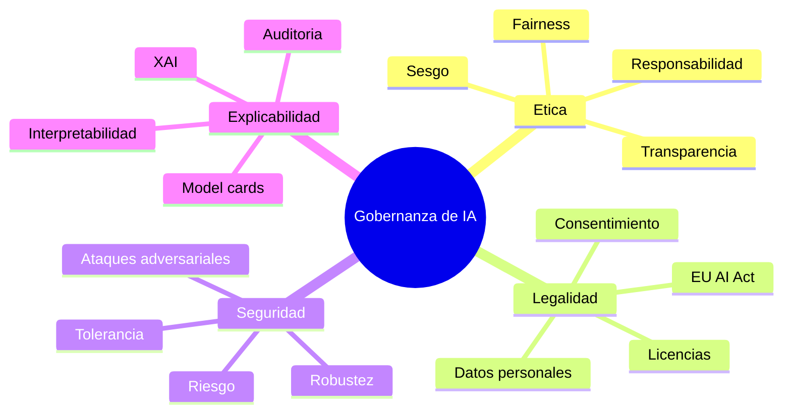

### Ética de la IA

**Definición.** Campo que analiza impactos morales, sociales y políticos de diseñar, entrenar, desplegar y usar sistemas de IA.

**En investigación de IA.** Incluye justicia, transparencia, responsabilidad, privacidad, seguridad, autonomía humana, daño potencial y distribución de beneficios.

### Sesgo

**Definición.** Desviación sistemática que produce resultados injustos, inexactos o no representativos. Puede surgir en datos, etiquetas, diseño, métricas, interpretación o despliegue.

**En investigación de IA.** Un modelo puede tener buen promedio global y fallar sistemáticamente en grupos específicos.

**Ejemplo.** Un sistema de reconocimiento facial entrenado con datos poco diversos puede tener mayor error en ciertos tonos de piel o grupos demográficos.

### Fairness o equidad algorítmica

**Definición.** Conjunto de criterios para evaluar y mitigar desigualdades de desempeño o impacto entre grupos.

**En investigación de IA.** Puede medirse con métricas como paridad demográfica, igualdad de oportunidades o igualdad de odds, pero cada métrica expresa una noción distinta de justicia.

**Precaución.** No existe una métrica universal de fairness. La elección depende del dominio, daño potencial, marco legal y valores sociales.

### Privacidad

**Definición.** Protección de datos personales, identidad, comportamiento y contexto de las personas.

**En investigación de IA.** Importa al recolectar datos, entrenar modelos, publicar datasets, generar embeddings, registrar prompts o analizar usuarios.

### Dato personal

**Definición.** Información que identifica o puede identificar a una persona directa o indirectamente.

**En investigación de IA.** Imágenes faciales, historiales clínicos, direcciones IP, ubicaciones, voz, textos personales y combinaciones de atributos pueden ser datos personales.

### Consentimiento informado

**Definición.** Autorización libre, específica e informada de una persona para participar en un estudio o permitir uso de sus datos.

**En investigación de IA.** Es indispensable en muchos estudios con humanos, datos sensibles o recolección directa.

### Anonimización

**Definición.** Proceso para modificar datos de modo que no pueda identificarse a personas con medios razonables.

**En investigación de IA.** No basta con quitar nombres. Combinaciones de atributos pueden reidentificar individuos.

### Transparencia

**Definición.** Capacidad de informar de manera clara cómo se usa un sistema de IA, qué datos emplea, qué limitaciones tiene y qué decisiones apoya.

**En investigación de IA.** Se operacionaliza mediante documentación, model cards, datasheets, reportes de evaluación, trazabilidad y explicaciones.

### Explicabilidad

**Definición.** Capacidad de un sistema para proporcionar razones comprensibles sobre su comportamiento o decisiones.

**En investigación de IA.** Es crucial en dominios de alto impacto, como salud, crédito, justicia, empleo y educación.

**Fuente complementaria.** Lipton (2018) discute ambigüedades del concepto de interpretabilidad.

### Interpretabilidad

**Definición.** Grado en que un humano puede comprender el funcionamiento interno o la relación entre entradas y salidas de un modelo.

**En investigación de IA.** Algunos modelos son interpretables por diseño; otros requieren explicaciones post hoc.

**Precaución.** Una explicación visual o textual puede ser persuasiva sin ser fiel al comportamiento real del modelo.

### XAI o inteligencia artificial explicable

**Definición.** Conjunto de métodos para hacer más comprensibles los modelos y sus decisiones.

**En investigación de IA.** Incluye explicaciones locales, globales, importancia de variables, contrafactuales, reglas aproximadas y visualizaciones.

### Robustez

**Definición.** Capacidad de un modelo para mantener desempeño ante perturbaciones, ruido, cambios de distribución o condiciones adversas.

**En investigación de IA.** Se evalúa con datos externos, perturbaciones, ataques adversariales, estrés de entrada y escenarios fuera de distribución.

### Seguridad adversarial

**Definición.** Área que estudia ataques y defensas contra modelos de IA, como ejemplos adversariales, extracción de modelo, inversión de datos o envenenamiento de entrenamiento.

**En investigación de IA.** Es esencial en sistemas expuestos a adversarios: biometría, seguridad, finanzas, moderación, malware y LLMs.

### Ataque adversarial

**Definición.** Manipulación intencional de entradas, datos o entorno para inducir errores en un sistema de IA.

**En investigación de IA.** Puede consistir en pequeñas perturbaciones de imagen, prompts maliciosos, datos envenenados o intentos de extraer información del modelo.

### Evaluación de riesgos

**Definición.** Proceso para identificar, estimar y priorizar riesgos de un sistema, incluyendo probabilidad, impacto y medidas de mitigación.

**En investigación de IA.** Debe considerar errores, sesgos, privacidad, seguridad, dependencia humana, uso indebido y efectos sociales.

**Fuente complementaria.** NIST (2023) propone un marco de gestión de riesgos de IA.

### NIST AI RMF

**Definición.** Marco de gestión de riesgos de IA del National Institute of Standards and Technology. Organiza prácticas para gobernar, mapear, medir y gestionar riesgos.

**En investigación de IA.** Es útil para estructurar auditorías, documentación y mitigación de riesgos en proyectos aplicados.

**Fuente complementaria.** NIST (2023).

### EU AI Act

**Definición.** Reglamento de la Unión Europea que establece reglas armonizadas para sistemas de IA, con enfoque basado en riesgos.

**En investigación de IA.** Importa si el sistema se desarrolla, comercializa o usa en la Unión Europea, o si afecta a personas dentro de ese marco regulatorio.

**Fuente complementaria.** Parlamento Europeo y Consejo de la Unión Europea (2024).

### Responsabilidad

**Definición.** Obligación de responder por decisiones, daños, omisiones, documentación y controles asociados a un sistema.

**En investigación de IA.** No puede delegarse en el modelo. Investigadores, instituciones y operadores deben definir roles y mecanismos de supervisión.

---

## Apéndice: mapas mentales globales

### Mapa global del proceso de investigación en IA

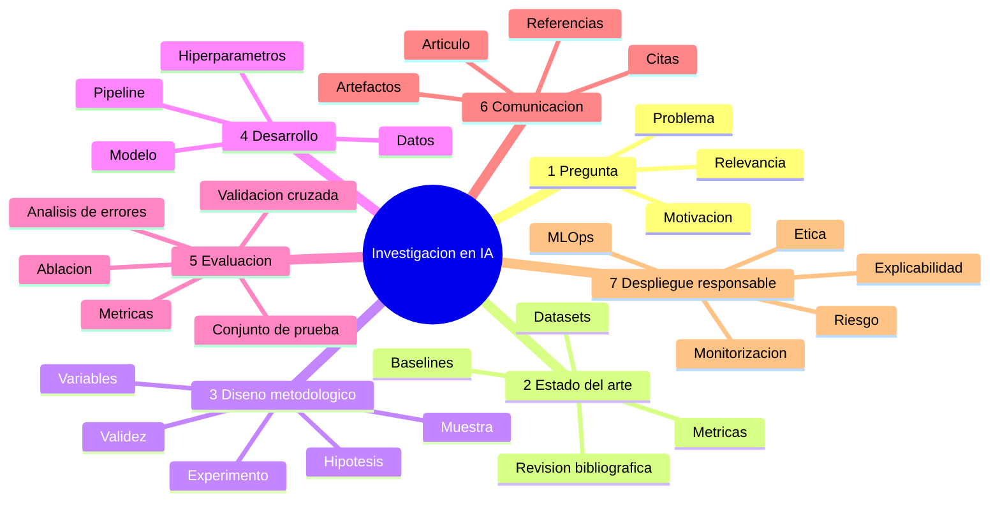

### Mapa de relación entre métodos científicos y paradigmas de IA

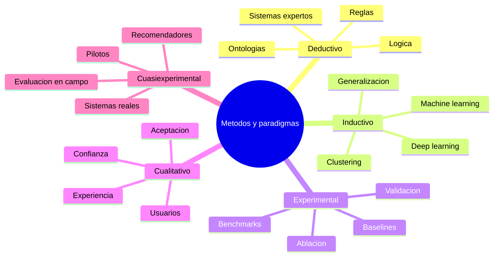

### Mapa de evaluación de modelos

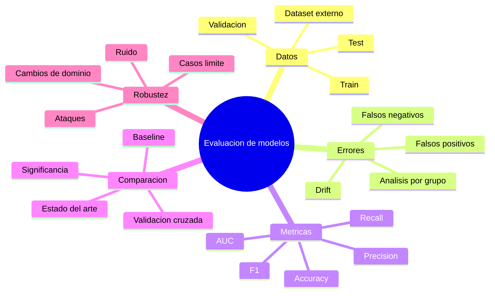

### Mapa de documentación y trazabilidad

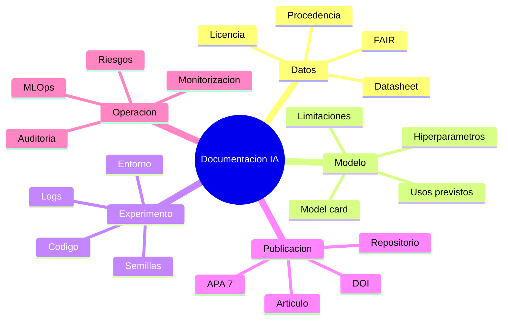

### Mapa de gobernanza de IA

```mermaid
mindmap
  root((Gobernanza IA))
    Etica
      Sesgo
      Fairness
      Transparencia
      Responsabilidad
    Legalidad
      Datos personales
      Consentimiento
      Derechos de autor
      EU AI Act
    Riesgo
      NIST AI RMF
      Seguridad
      Robustez
      Impacto
    Explicabilidad
      Interpretabilidad
      XAI
      Trazabilidad
      Model cards
```

---

## Referencias complementarias

Association for Computing Machinery. (2020). *Artifact review and badging*. https://www.acm.org/publications/policies/artifact-review-and-badging-current

Bender, E. M., Gebru, T., McMillan-Major, A., & Shmitchell, S. (2021). On the dangers of stochastic parrots: Can language models be too big? In *Proceedings of the 2021 ACM Conference on Fairness, Accountability, and Transparency* (pp. 610-623). Association for Computing Machinery. https://doi.org/10.1145/3442188.3445922

Bishop, C. M. (2006). *Pattern recognition and machine learning*. Springer.

Bommasani, R., Hudson, D. A., Adeli, E., Altman, R., Arora, S., von Arx, S., Bernstein, M. S., Bohg, J., Bosselut, A., Brunskill, E., Brynjolfsson, E., Buch, S., Card, D., Castellon, R., Chatterji, N., Chen, A., Creel, K., Davis, J. Q., Demszky, D., ... Liang, P. (2021). *On the opportunities and risks of foundation models*. arXiv. https://doi.org/10.48550/arXiv.2108.07258

Chapman, P., Clinton, J., Kerber, R., Khabaza, T., Reinartz, T., Shearer, C., & Wirth, R. (2000). *CRISP-DM 1.0: Step-by-step data mining guide*. SPSS.

Cohen, J. (1988). *Statistical power analysis for the behavioral sciences* (2nd ed.). Lawrence Erlbaum Associates.

Gebru, T., Morgenstern, J., Vecchione, B., Vaughan, J. W., Wallach, H., Daumé III, H., & Crawford, K. (2021). Datasheets for datasets. *Communications of the ACM, 64*(12), 86-92. https://doi.org/10.1145/3458723

Goodfellow, I., Bengio, Y., & Courville, A. (2016). *Deep learning*. MIT Press.

Kohavi, R. (1995). A study of cross-validation and bootstrap for accuracy estimation and model selection. In *Proceedings of the 14th International Joint Conference on Artificial Intelligence* (Vol. 2, pp. 1137-1143). Morgan Kaufmann.

Lewis, P., Perez, E., Piktus, A., Petroni, F., Karpukhin, V., Goyal, N., Küttler, H., Lewis, M., Yih, W. T., Rocktäschel, T., Riedel, S., & Kiela, D. (2020). Retrieval-augmented generation for knowledge-intensive NLP tasks. In *Advances in Neural Information Processing Systems, 33* (pp. 9459-9474).

Lipton, Z. C. (2018). The mythos of model interpretability. *Queue, 16*(3), 31-57. https://doi.org/10.1145/3236386.3241340

Mitchell, M. (1997). *An introduction to genetic algorithms*. MIT Press.

Mitchell, M., Wu, S., Zaldivar, A., Barnes, P., Vasserman, L., Hutchinson, B., Spitzer, E., Raji, I. D., & Gebru, T. (2019). Model cards for model reporting. In *Proceedings of the Conference on Fairness, Accountability, and Transparency* (pp. 220-229). Association for Computing Machinery. https://doi.org/10.1145/3287560.3287596

Mitchell, T. M. (1997). *Machine learning*. McGraw-Hill.

National Institute of Standards and Technology. (2023). *Artificial intelligence risk management framework (AI RMF 1.0)* (NIST AI 100-1). U.S. Department of Commerce. https://doi.org/10.6028/NIST.AI.100-1

Organisation for Economic Co-operation and Development. (2024). *Explanatory memorandum on the updated OECD definition of an AI system*. OECD Publishing. https://doi.org/10.1787/623da898-en

Page, M. J., McKenzie, J. E., Bossuyt, P. M., Boutron, I., Hoffmann, T. C., Mulrow, C. D., Shamseer, L., Tetzlaff, J. M., Akl, E. A., Brennan, S. E., Chou, R., Glanville, J., Grimshaw, J. M., Hróbjartsson, A., Lalu, M. M., Li, T., Loder, E. W., Mayo-Wilson, E., McDonald, S., ... Moher, D. (2021). The PRISMA 2020 statement: An updated guideline for reporting systematic reviews. *BMJ, 372*, Article n71. https://doi.org/10.1136/bmj.n71

Parlamento Europeo y Consejo de la Unión Europea. (2024). *Reglamento (UE) 2024/1689 por el que se establecen normas armonizadas en materia de inteligencia artificial*. Diario Oficial de la Unión Europea.

Pearl, J. (2009). *Causality: Models, reasoning, and inference* (2nd ed.). Cambridge University Press.

Sculley, D., Holt, G., Golovin, D., Davydov, E., Phillips, T., Ebner, D., Chaudhary, V., Young, M., Crespo, J. F., & Dennison, D. (2015). Hidden technical debt in machine learning systems. In *Advances in Neural Information Processing Systems, 28* (pp. 2503-2511).

Sutton, R. S., & Barto, A. G. (2018). *Reinforcement learning: An introduction* (2nd ed.). MIT Press.

Universidad Internacional de La Rioja. (2021). *Investigación en inteligencia artificial* [Material docente de maestría]. UNIR.

Vaswani, A., Shazeer, N., Parmar, N., Uszkoreit, J., Jones, L., Gomez, A. N., Kaiser, Ł., & Polosukhin, I. (2017). Attention is all you need. In *Advances in Neural Information Processing Systems, 30*.

Wilkinson, M. D., Dumontier, M., Aalbersberg, I. J. J., Appleton, G., Axton, M., Baak, A., Blomberg, N., Boiten, J. W., da Silva Santos, L. B., Bourne, P. E., Bouwman, J., Brookes, A. J., Clark, T., Crosas, M., Dillo, I., Dumon, O., Edmunds, S., Evelo, C. T., Finkers, R., ... Mons, B. (2016). The FAIR Guiding Principles for scientific data management and stewardship. *Scientific Data, 3*, Article 160018. https://doi.org/10.1038/sdata.2016.18

World Wide Web Consortium. (2013). *PROV-overview: An overview of the PROV family of documents*. https://www.w3.org/TR/prov-overview/

