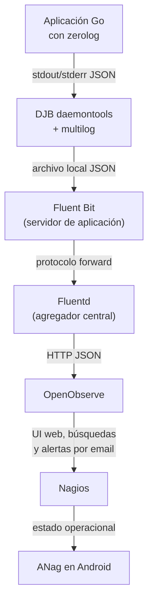

import Aside from '@rgglez/astro-aside';

## Introducción

Esta guía muestra cómo construir una tubería de centralización de logs para una granja de servidores que ejecutan servicios desarrollados en Go. La aplicación genera logs estructurados con [`github.com/rs/zerolog`](https://github.com/rs/zerolog), el proceso está supervisado por **DJB daemontools**, el log local se escribe con **multilog**, los agentes de cada servidor son **Fluent Bit**, el agregador central es **Fluentd**, y la interfaz web de consulta, visualización y alertas será **OpenObserve**.

La arquitectura final será:



La guía está escrita para **Ubuntu Server 24.04 LTS** tanto en los servidores de aplicación como en el servidor central de logs.

<Aside type="note">
Aunque esta guía usa Ubuntu 24.04, la arquitectura aplica casi igual a Debian, Rocky Linux, AlmaLinux u otras distribuciones. Lo que cambia principalmente es la instalación de paquetes, rutas de servicio y nombres de usuarios del sistema.
</Aside>

## Objetivo operacional

El objetivo no es solamente guardar logs. El objetivo es tener una plataforma mínima de observabilidad para servicios propios escritos en Go:

- conservar logs estructurados en JSON;
- etiquetar cada evento con `host`, `service`, `env` y origen;
- enviar logs desde muchos servidores a un agregador central;
- ingerirlos en OpenObserve;
- buscar eventos desde una UI web;
- disparar alertas por email cuando aparezcan patrones como `error` o `panic`;
- exponer el estado de esas condiciones en Nagios;
- usar ANag en Android para recibir o consultar alertas desde el móvil.

## Componentes usados

| Componente | Rol |
|---|---|
| `zerolog` | Genera logs JSON desde Go. |
| `daemontools` | Supervisa el proceso de la aplicación. |
| `multilog` | Rota y conserva logs locales. |
| `Fluent Bit` | Agente ligero que lee archivos locales y reenvía eventos. |
| `Fluentd` | Agregador central, buffer, normalizador y puente HTTP. |
| `OpenObserve` | Backend de logs, UI web, búsquedas y alertas. |
| `Nagios` | Motor de monitoreo clásico para estado operacional. |
| `ANag` | Cliente Android para visualizar alertas de Nagios/Nagios-compatible. |

<Aside type="note">
Esta separación permite que OpenObserve esté protegido detrás del servidor agregador. Los servidores de aplicación no necesitan hablar directamente con OpenObserve; sólo hablan con Fluentd.
</Aside>

## Supuestos de red y nombres usados

Para hacer la guía concreta se usarán estos nombres de ejemplo:

| Elemento | Valor de ejemplo |
|---|---|
| Servidor central de logs | `logs-01.example.com` |
| IP del servidor central | `10.10.0.10` |
| Red de servidores de aplicación | `10.10.1.0/24` |
| Red administrativa interna | `10.10.2.0/24` |
| Servicio Go | `miapp-api` |
| Ambiente | `prod` |
| Stream en OpenObserve | `goapp` |
| Organización en OpenObserve | `default` |
| Puerto Fluentd forward | `24224/tcp` |
| Puerto OpenObserve | `5080/tcp` |
| Puerto Nagios Web | `80/tcp` o `443/tcp` mediante Apache/Nginx |

Cada vez que aparezca `example.com`, `CAMBIAR_*`, `10.10.*` o una contraseña de ejemplo, sustitúyelo por valores reales.

<Aside type="warning">
No publiques OpenObserve ni Nagios directamente a Internet sin TLS, autenticación fuerte y restricciones de acceso. ANag puede consultar Nagios por HTTPS; lo recomendable es exponerlo mediante VPN, WireGuard, Tailscale, Cloudflare Access, un reverse proxy autenticado o una red administrativa privada.
</Aside>

## Preparación común de Ubuntu 24.04

Ejecuta esta sección en todos los servidores involucrados: servidores de aplicación, servidor central de logs y servidor Nagios si está separado.

El siguiente comando actualiza el índice local de paquetes. `sudo` ejecuta el comando con privilegios administrativos. `apt update` no actualiza paquetes instalados; sólo descarga metadatos de repositorios.

```bash
sudo apt update
```

El siguiente comando aplica actualizaciones disponibles. `apt upgrade` actualiza paquetes ya instalados. La opción `-y` responde automáticamente “yes” a las preguntas de confirmación de `apt`.

```bash
sudo apt upgrade -y
```

El siguiente comando instala herramientas base. `curl` se usará para descargar scripts y consultar APIs HTTP. `ca-certificates` permite validar certificados TLS. `gnupg` permite manejar llaves GPG de repositorios. `jq` permite procesar JSON en scripts. `vim` es un editor de texto; puedes reemplazarlo por `nano` si prefieres.

```bash
sudo apt install -y curl ca-certificates gnupg jq vim
```

## Parte 1: generar logs JSON correctos desde Go con zerolog

La tubería completa depende de una condición importante: cada evento debe ser **una línea JSON válida**. Fluent Bit puede parsear líneas JSON sin complicarse si cada línea contiene exactamente un objeto JSON.

Ejemplo mínimo de logging con `zerolog`:

```go
package main

import (
    "errors"
    "os"
    "time"

    "github.com/rs/zerolog"
    "github.com/rs/zerolog/log"
)

func main() {
    zerolog.TimeFieldFormat = time.RFC3339Nano
    log.Logger = log.Output(os.Stdout)

    log.Info().
        Str("service", "miapp-api").
        Str("component", "bootstrap").
        Msg("servicio iniciado")

    err := errors.New("falló una operación de ejemplo")
    log.Error().
        Err(err).
        Str("service", "miapp-api").
        Str("operation", "create_order").
        Msg("error procesando solicitud")

    log.Panic().
        Str("service", "miapp-api").
        Str("component", "worker").
        Msg("panic de ejemplo")
}
```

En este ejemplo `zerolog.TimeFieldFormat = time.RFC3339Nano` hace que el campo de tiempo tenga formato RFC3339 con nanosegundos, por ejemplo `2026-06-03T21:10:00.123456789-06:00`.

`log.Output(os.Stdout)` envía los eventos a la salida estándar. Eso es importante porque daemontools capturará `stdout` y lo entregará a `multilog`.

`log.Info()`, `log.Error()` y `log.Panic()` producen niveles distintos. En esta guía usaremos `error`, `panic` y también búsquedas textuales sobre `message` para disparar alertas.

<Aside type="warning">
Evita que la aplicación escriba logs multilínea. Los stack traces de panic pueden ser multilínea si se imprimen sin control. Para logging centralizado conviene capturar el stack trace como campo JSON, no como texto partido en muchas líneas.
</Aside>

## Parte 2: daemontools y multilog en el servidor de aplicación

Instala daemontools en cada servidor donde corre la aplicación Go.

El comando siguiente instala `daemontools` y `daemontools-run`. El paquete `daemontools` contiene herramientas como `supervise`, `svc` y `svstat`. El paquete `daemontools-run` integra el arranque con el sistema init de Ubuntu.

```bash
sudo apt install -y daemontools daemontools-run
```

Crea el directorio del servicio. `install -d` crea directorios. `-m 0755` asigna permisos de lectura/ejecución para todos y escritura sólo para el propietario. `/service/miapp-api` será el directorio que daemontools observará para levantar el servicio.

```bash
sudo install -d -m 0755 /service/miapp-api
```

Crea el archivo `run` del servicio. Este script es ejecutado por daemontools para arrancar la aplicación. `cat` escribe el contenido, `sudo tee` lo guarda con privilegios de root, y `> /dev/null` evita duplicar el contenido en pantalla.

```bash
cat <<'EOF_RUN' | sudo tee /service/miapp-api/run > /dev/null
#!/bin/sh

# exec reemplaza el shell por el proceso de la aplicación.
# Eso permite que daemontools supervise directamente el proceso real.
exec /opt/miapp/bin/miapp-api
EOF_RUN
```

Da permisos de ejecución al script. `chmod` cambia permisos. `0755` permite ejecución por cualquier usuario y escritura sólo por el propietario.

```bash
sudo chmod 0755 /service/miapp-api/run
```

Crea la estructura de logging del servicio. En daemontools, si existe un subdirectorio `log` con su propio `run`, la salida del servicio principal se conecta al proceso de logging.

`install -d` crea el directorio. `-m 0755` define permisos. `/service/miapp-api/log/main` será el directorio donde `multilog` guardará los archivos rotados.

```bash
sudo install -d -m 0755 /service/miapp-api/log/main
```

Crea el script de logging. Este script ejecuta `multilog`.

```bash
cat <<'EOF_LOG' | sudo tee /service/miapp-api/log/run > /dev/null
#!/bin/sh

# cd cambia al directorio donde multilog guardará los archivos.
# Usamos ./main como destino relativo para mantener limpia la estructura del servicio.
cd /service/miapp-api/log || exit 111

# exec reemplaza el shell por multilog.
# multilog recibe por stdin los eventos emitidos por la aplicación.
# s10000000 limita cada archivo de log a unos 10 MB.
# n20 conserva hasta 20 archivos rotados.
# ./main indica el directorio donde se escribirá el archivo current y sus rotaciones.
# No usamos la opción t porque agregaría timestamp TAI64N antes del JSON y rompería el parseo JSON directo.
exec multilog s10000000 n20 ./main
EOF_LOG
```

Da permisos de ejecución al script de logging.

```bash
sudo chmod 0755 /service/miapp-api/log/run
```

Asegura permisos sobre el directorio de logs. `chown -R` cambia propietario y grupo de manera recursiva. En Ubuntu el usuario `root` puede escribir ahí porque `multilog` será ejecutado por daemontools. Si usas un usuario no privilegiado para el log, ajusta este punto.

```bash
sudo chown -R root:root /service/miapp-api
```

Verifica el estado del servicio. `svstat` consulta el estado de supervisión de daemontools.

```bash
sudo svstat /service/miapp-api
```

Verifica que el archivo de log exista. `tail -n 5` muestra las últimas 5 líneas del archivo `current`.

```bash
sudo tail -n 5 /service/miapp-api/log/main/current
```

Cada línea debería verse como JSON válido:

```json
{"level":"info","service":"miapp-api","component":"bootstrap","time":"2026-06-03T21:10:00.123456789-06:00","message":"servicio iniciado"}
```

<Aside type="warning">
No actives `multilog t` si quieres parsear JSON directamente con Fluent Bit. Esa opción antepone un timestamp TAI64N al principio de cada línea. El resultado deja de ser JSON puro, aunque siga siendo útil para lectura humana.
</Aside>

## Parte 3: instalar Fluent Bit en cada servidor de aplicación

Fluent Bit será el agente local. Leerá el archivo `current` de `multilog`, parseará cada línea como JSON, agregará metadatos y enviará eventos al Fluentd central usando el protocolo `forward`.

El siguiente comando descarga la llave GPG del repositorio oficial de Fluent Bit, la convierte a formato de keyring con `gpg --dearmor` y la guarda en `/usr/share/keyrings/fluentbit-keyring.gpg`.

`curl -sSL` descarga de forma silenciosa, sigue redirecciones y muestra errores relevantes. `sudo sh -c` permite que la redirección `>` se ejecute con privilegios administrativos.

```bash
sudo sh -c 'curl -sSL https://packages.fluentbit.io/fluentbit.key | gpg --dearmor > /usr/share/keyrings/fluentbit-keyring.gpg'
```

El siguiente comando obtiene el codename de Ubuntu desde `/etc/os-release`. En Ubuntu 24.04 debería devolver `noble`.

```bash
codename="$(. /etc/os-release && echo "$VERSION_CODENAME")"
```

Este comando agrega el repositorio APT de Fluent Bit. `signed-by=/usr/share/keyrings/fluentbit-keyring.gpg` le indica a APT qué llave debe usarse para verificar ese repositorio específico. `tee` escribe el archivo de repositorio.

```bash
echo "deb [signed-by=/usr/share/keyrings/fluentbit-keyring.gpg] https://packages.fluentbit.io/ubuntu/${codename} ${codename} main" | sudo tee /etc/apt/sources.list.d/fluent-bit.list
```

Actualiza el índice de paquetes para incluir el nuevo repositorio.

```bash
sudo apt update
```

Instala Fluent Bit. El paquete instala el binario, archivos de configuración base y unidad systemd.

```bash
sudo apt install -y fluent-bit
```

Crea directorios de estado y buffer. `/var/lib/fluent-bit/state` guardará offsets de lectura de archivos. `/var/lib/fluent-bit/storage` guardará buffers persistentes cuando el destino no esté disponible.

```bash
sudo install -d -m 0755 /var/lib/fluent-bit/state /var/lib/fluent-bit/storage
```

### Parser JSON para zerolog

Crea o reemplaza `/etc/fluent-bit/parsers.conf` con un parser para JSON de zerolog.

```ini
# Esta sección declara un parser nuevo.
[PARSER]
    # Name asigna el nombre lógico del parser.
    # Fluent Bit lo referenciará desde la entrada tail con Parser zerolog_json.
    Name        zerolog_json

    # Format indica el formato de entrada.
    # json significa que Fluent Bit esperará una línea JSON por evento.
    Format      json

    # Time_Key indica qué campo del JSON contiene el timestamp del evento.
    # zerolog usa time por defecto.
    Time_Key    time

    # Time_Format describe cómo interpretar el campo time.
    # %Y es año, %m mes, %d día, %H hora, %M minuto, %S segundo.
    # %L representa fracción de segundo y %z representa zona horaria numérica.
    Time_Format %Y-%m-%dT%H:%M:%S.%L%z

    # Time_Keep On conserva el campo time original en el evento enviado.
    # Esto permite consultar el timestamp original además del timestamp interno.
    Time_Keep   On
```

Escribe ese archivo con privilegios administrativos:

```bash
cat <<'EOF_PARSERS' | sudo tee /etc/fluent-bit/parsers.conf > /dev/null
# Esta sección declara un parser nuevo.
[PARSER]
    # Name asigna el nombre lógico del parser.
    # Fluent Bit lo referenciará desde la entrada tail con Parser zerolog_json.
    Name        zerolog_json

    # Format indica el formato de entrada.
    # json significa que Fluent Bit esperará una línea JSON por evento.
    Format      json

    # Time_Key indica qué campo del JSON contiene el timestamp del evento.
    # zerolog usa time por defecto.
    Time_Key    time

    # Time_Format describe cómo interpretar el campo time.
    # %Y es año, %m mes, %d día, %H hora, %M minuto, %S segundo.
    # %L representa fracción de segundo y %z representa zona horaria numérica.
    Time_Format %Y-%m-%dT%H:%M:%S.%L%z

    # Time_Keep On conserva el campo time original en el evento enviado.
    # Esto permite consultar el timestamp original además del timestamp interno.
    Time_Keep   On
EOF_PARSERS
```

### Configuración principal de Fluent Bit

La siguiente configuración lee el archivo de `multilog`, parsea JSON, agrega metadatos y envía los eventos al Fluentd central.

```ini
# SERVICE configura el comportamiento global del proceso fluent-bit.
[SERVICE]
    # Flush define cada cuántos segundos se intentan despachar lotes de eventos.
    Flush        5

    # Daemon Off mantiene Fluent Bit en primer plano bajo systemd.
    Daemon       Off

    # Log_Level info registra mensajes informativos sin generar demasiado ruido.
    Log_Level    info

    # Parsers_File carga el archivo donde definimos zerolog_json.
    Parsers_File /etc/fluent-bit/parsers.conf

    # storage.path define el directorio de buffering persistente en disco.
    storage.path              /var/lib/fluent-bit/storage

    # storage.sync normal balancea seguridad y rendimiento al sincronizar buffers.
    storage.sync              normal

    # storage.checksum off evita checksum por chunk para reducir costo de CPU.
    storage.checksum          off

    # storage.backlog.mem_limit limita la memoria usada al reintentar buffers pendientes.
    storage.backlog.mem_limit 128M

# INPUT define una fuente de eventos.
[INPUT]
    # Name tail indica que se leerán archivos como tail -f.
    Name              tail

    # Tag etiqueta los eventos para routing posterior.
    # app.go.miapp se usará en Fluentd para hacer match.
    Tag               app.go.miapp

    # Path apunta al archivo actual de multilog.
    Path              /service/miapp-api/log/main/current

    # Parser indica cómo interpretar cada línea leída.
    Parser            zerolog_json

    # DB guarda offsets por archivo para evitar releer desde cero tras reinicios.
    DB                /var/lib/fluent-bit/state/miapp-api.db

    # Read_from_Head Off evita ingerir logs históricos enormes al arrancar por primera vez.
    Read_from_Head    Off

    # Skip_Long_Lines On descarta líneas demasiado largas en lugar de detener el input.
    Skip_Long_Lines   On

    # Mem_Buf_Limit limita memoria por entrada antes de presionar buffering en disco.
    Mem_Buf_Limit     64MB

    # storage.type filesystem permite usar buffer en disco para este input.
    storage.type      filesystem

# FILTER permite enriquecer o modificar eventos.
[FILTER]
    # record_modifier agrega campos estáticos a cada evento que coincida.
    Name   record_modifier

    # Match selecciona eventos por tag.
    Match  app.go.miapp

    # service identifica la aplicación o unidad lógica.
    Record service miapp-api

    # env identifica el ambiente operacional.
    Record env prod

    # host identifica el servidor de origen.
    Record host ${HOSTNAME}

    # source indica que el archivo fue producido por daemontools/multilog.
    Record source daemontools-multilog

# OUTPUT define el destino de salida.
[OUTPUT]
    # Name forward usa el protocolo forward compatible con Fluentd.
    Name                 forward

    # Match envía sólo los eventos etiquetados como app.go.miapp.
    Match                app.go.miapp

    # Host es el FQDN o IP del Fluentd agregador.
    Host                 logs-01.example.com

    # Port es el puerto TCP de entrada forward en Fluentd.
    Port                 24224

    # Shared_Key debe coincidir con la clave definida en Fluentd.
    # Cambia este valor por una cadena larga y secreta.
    Shared_Key           CAMBIAR_CLAVE_COMPARTIDA_LARGA

    # Self_Hostname identifica este forwarder ante Fluentd.
    Self_Hostname        ${HOSTNAME}

    # Require_ack_response On pide confirmación de recepción al agregador.
    Require_ack_response On

    # Retry_Limit False reintenta indefinidamente mientras haya buffer disponible.
    Retry_Limit          False

    # storage.total_limit_size limita cuánto disco puede consumir esta salida.
    storage.total_limit_size 5G
```

Escribe la configuración real:

```bash
cat <<'EOF_FLUENT_BIT' | sudo tee /etc/fluent-bit/fluent-bit.conf > /dev/null
# SERVICE configura el comportamiento global del proceso fluent-bit.
[SERVICE]
    # Flush define cada cuántos segundos se intentan despachar lotes de eventos.
    Flush        5

    # Daemon Off mantiene Fluent Bit en primer plano bajo systemd.
    Daemon       Off

    # Log_Level info registra mensajes informativos sin generar demasiado ruido.
    Log_Level    info

    # Parsers_File carga el archivo donde definimos zerolog_json.
    Parsers_File /etc/fluent-bit/parsers.conf

    # storage.path define el directorio de buffering persistente en disco.
    storage.path              /var/lib/fluent-bit/storage

    # storage.sync normal balancea seguridad y rendimiento al sincronizar buffers.
    storage.sync              normal

    # storage.checksum off evita checksum por chunk para reducir costo de CPU.
    storage.checksum          off

    # storage.backlog.mem_limit limita la memoria usada al reintentar buffers pendientes.
    storage.backlog.mem_limit 128M

# INPUT define una fuente de eventos.
[INPUT]
    # Name tail indica que se leerán archivos como tail -f.
    Name              tail

    # Tag etiqueta los eventos para routing posterior.
    # app.go.miapp se usará en Fluentd para hacer match.
    Tag               app.go.miapp

    # Path apunta al archivo actual de multilog.
    Path              /service/miapp-api/log/main/current

    # Parser indica cómo interpretar cada línea leída.
    Parser            zerolog_json

    # DB guarda offsets por archivo para evitar releer desde cero tras reinicios.
    DB                /var/lib/fluent-bit/state/miapp-api.db

    # Read_from_Head Off evita ingerir logs históricos enormes al arrancar por primera vez.
    Read_from_Head    Off

    # Skip_Long_Lines On descarta líneas demasiado largas en lugar de detener el input.
    Skip_Long_Lines   On

    # Mem_Buf_Limit limita memoria por entrada antes de presionar buffering en disco.
    Mem_Buf_Limit     64MB

    # storage.type filesystem permite usar buffer en disco para este input.
    storage.type      filesystem

# FILTER permite enriquecer o modificar eventos.
[FILTER]
    # record_modifier agrega campos estáticos a cada evento que coincida.
    Name   record_modifier

    # Match selecciona eventos por tag.
    Match  app.go.miapp

    # service identifica la aplicación o unidad lógica.
    Record service miapp-api

    # env identifica el ambiente operacional.
    Record env prod

    # host identifica el servidor de origen.
    Record host ${HOSTNAME}

    # source indica que el archivo fue producido por daemontools/multilog.
    Record source daemontools-multilog

# OUTPUT define el destino de salida.
[OUTPUT]
    # Name forward usa el protocolo forward compatible con Fluentd.
    Name                 forward

    # Match envía sólo los eventos etiquetados como app.go.miapp.
    Match                app.go.miapp

    # Host es el FQDN o IP del Fluentd agregador.
    Host                 logs-01.example.com

    # Port es el puerto TCP de entrada forward en Fluentd.
    Port                 24224

    # Shared_Key debe coincidir con la clave definida en Fluentd.
    # Cambia este valor por una cadena larga y secreta.
    Shared_Key           CAMBIAR_CLAVE_COMPARTIDA_LARGA

    # Self_Hostname identifica este forwarder ante Fluentd.
    Self_Hostname        ${HOSTNAME}

    # Require_ack_response On pide confirmación de recepción al agregador.
    Require_ack_response On

    # Retry_Limit False reintenta indefinidamente mientras haya buffer disponible.
    Retry_Limit          False

    # storage.total_limit_size limita cuánto disco puede consumir esta salida.
    storage.total_limit_size 5G
EOF_FLUENT_BIT
```

### Pasar el hostname a Fluent Bit

Crea un drop-in de systemd para que `${HOSTNAME}` esté disponible.

`install -d` crea el directorio de override de la unidad. `-m 0755` define permisos apropiados para archivos de configuración del sistema.

```bash
sudo install -d -m 0755 /etc/systemd/system/fluent-bit.service.d
```

El archivo siguiente agrega una variable de entorno. `%H` es expandido por systemd al hostname del equipo.

```ini
# Service modifica la sección de servicio de la unidad fluent-bit.
[Service]
    # Environment define variables visibles para el proceso.
    # HOSTNAME=%H usa el hostname conocido por systemd.
    Environment="HOSTNAME=%H"
```

Escribe el override:

```bash
cat <<'EOF_HOSTNAME' | sudo tee /etc/systemd/system/fluent-bit.service.d/10-hostname.conf > /dev/null
# Service modifica la sección de servicio de la unidad fluent-bit.
[Service]
    # Environment define variables visibles para el proceso.
    # HOSTNAME=%H usa el hostname conocido por systemd.
    Environment="HOSTNAME=%H"
EOF_HOSTNAME
```

Recarga unidades systemd. `daemon-reload` hace que systemd relea los archivos de unidad y overrides.

```bash
sudo systemctl daemon-reload
```

Activa e inicia Fluent Bit. `enable` lo deja configurado para arrancar con el sistema. `--now` inicia el servicio inmediatamente.

```bash
sudo systemctl enable --now fluent-bit
```

Reinicia Fluent Bit si ya estaba corriendo.

```bash
sudo systemctl restart fluent-bit
```

Consulta su estado. `--no-pager` evita abrir un paginador interactivo como `less`.

```bash
sudo systemctl status fluent-bit --no-pager
```

Consulta logs de Fluent Bit. `-u fluent-bit` filtra por unidad. `-f` sigue la salida en tiempo real.

```bash
sudo journalctl -u fluent-bit -f
```

## Parte 4: instalar Fluentd en el servidor central

Esta sección va en `logs-01.example.com`.

Fluentd recibirá eventos por el protocolo `forward` desde los Fluent Bit de cada servidor. Luego enviará lotes JSON a OpenObserve por HTTP.

El siguiente comando descarga y ejecuta el script oficial de instalación del paquete Fluentd para Ubuntu 24.04. `curl -fsSL` falla ante errores HTTP, trabaja en modo silencioso, muestra errores y sigue redirecciones. El pipe `| sh` ejecuta el script con el shell.

<Aside type="warning">
Antes de ejecutar cualquier script descargado con `curl | sh`, en entornos de producción conviene descargarlo, inspeccionarlo y ejecutarlo después. Aquí se muestra la forma directa por brevedad operativa, pero puedes separar los pasos.
</Aside>

```bash
curl -fsSL https://fluentd.cdn.cncf.io/sh/install-ubuntu-noble-fluent-package6-lts.sh | sh
```

Activa e inicia el servicio. En paquetes recientes el servicio puede llamarse `fluentd` o `fluent-package` según la generación del paquete. Verifica cuál existe.

El siguiente comando lista unidades que contienen la palabra `fluent`.

```bash
systemctl list-unit-files | grep -i fluent
```

Si la unidad se llama `fluentd`, usa:

```bash
sudo systemctl enable --now fluentd
```

Si la unidad se llama `fluent-package`, usa:

```bash
sudo systemctl enable --now fluent-package
```

Para el resto de la guía asumiremos que la unidad es `fluentd`. Si en tu instalación se llama `fluent-package`, reemplaza `fluentd` por `fluent-package` en los comandos systemd.

## Parte 5: instalar OpenObserve en el servidor central

OpenObserve será instalado en el mismo servidor `logs-01.example.com` para simplificar. Fluentd enviará datos a `127.0.0.1:5080`, y sólo la UI/API de OpenObserve se expondrá hacia la red administrativa.

Crea un usuario de sistema para ejecutar OpenObserve. `--system` crea un usuario para servicios, no para login interactivo. `--home /var/lib/openobserve` define su directorio base. `--group` crea un grupo con el mismo nombre.

```bash
sudo adduser --system --home /var/lib/openobserve --group openobserve
```

Crea directorios para datos y configuración. `/var/lib/openobserve` guardará datos locales. `/etc/openobserve` guardará variables de entorno.

```bash
sudo install -d -o openobserve -g openobserve -m 0750 /var/lib/openobserve
sudo install -d -o root -g root -m 0755 /etc/openobserve
```

Descarga el instalador de OpenObserve. `-o /tmp/openobserve-download.sh` guarda el script en un archivo para poder inspeccionarlo.

```bash
curl -fsSL https://raw.githubusercontent.com/openobserve/openobserve/main/download.sh -o /tmp/openobserve-download.sh
```

Inspecciona el script antes de ejecutarlo.

```bash
less /tmp/openobserve-download.sh
```

Ejecuta el script. `bash` interpreta el script descargado.

```bash
bash /tmp/openobserve-download.sh
```

Localiza el binario descargado. Según la versión, puede quedar en el directorio actual o en una ruta indicada por el script.

```bash
find . /tmp -maxdepth 3 -type f -name 'openobserve*' 2>/dev/null
```

Instala el binario en `/usr/local/bin`. Ajusta la ruta de origen si el comando anterior mostró otra ubicación.

```bash
sudo install -o root -g root -m 0755 ./openobserve /usr/local/bin/openobserve
```

### Variables de entorno de OpenObserve

Crea `/etc/openobserve/openobserve.env`. Este archivo define usuario inicial, modo local, almacenamiento y SMTP para alertas por email.

```ini
# ZO_ROOT_USER_EMAIL define el usuario administrador inicial.
# Cambia este correo por una cuenta real de administración.
ZO_ROOT_USER_EMAIL=root@example.com

# ZO_ROOT_USER_PASSWORD define la contraseña inicial del administrador.
# Usa una contraseña larga y única.
ZO_ROOT_USER_PASSWORD=CAMBIAR_PASSWORD_OPENOBSERVE

# ZO_LOCAL_MODE=true ejecuta OpenObserve sin dependencia externa de metastore distribuido.
# Es adecuado para una instalación inicial o mediana en un solo nodo.
ZO_LOCAL_MODE=true

# ZO_LOCAL_MODE_STORAGE=disk usa disco local para almacenamiento en modo local.
ZO_LOCAL_MODE_STORAGE=disk

# ZO_DATA_DIR indica dónde se guardarán los datos de OpenObserve.
ZO_DATA_DIR=/var/lib/openobserve

# ZO_HTTP_ADDR limita la escucha HTTP al loopback.
# Fluentd hablará por 127.0.0.1 y un reverse proxy podrá publicar la UI.
ZO_HTTP_ADDR=127.0.0.1

# ZO_HTTP_PORT define el puerto HTTP de OpenObserve.
ZO_HTTP_PORT=5080

# ZO_SMTP_ENABLED=true activa envío de correos para alertas.
ZO_SMTP_ENABLED=true

# ZO_SMTP_HOST define el servidor SMTP saliente.
ZO_SMTP_HOST=smtp.example.com

# ZO_SMTP_PORT define el puerto SMTP.
# 587 suele usarse con STARTTLS.
ZO_SMTP_PORT=587

# ZO_SMTP_USER_NAME define el usuario SMTP.
ZO_SMTP_USER_NAME=alerts@example.com

# ZO_SMTP_PASSWORD define la contraseña o token SMTP.
ZO_SMTP_PASSWORD=CAMBIAR_PASSWORD_SMTP

# ZO_SMTP_FROM_EMAIL define el remitente visible de las alertas.
ZO_SMTP_FROM_EMAIL=alerts@example.com

# ZO_SMTP_ENCRYPTION=starttls solicita STARTTLS hacia el servidor SMTP.
ZO_SMTP_ENCRYPTION=starttls
```

Escribe el archivo real:

```bash
cat <<'EOF_O2_ENV' | sudo tee /etc/openobserve/openobserve.env > /dev/null
# ZO_ROOT_USER_EMAIL define el usuario administrador inicial.
# Cambia este correo por una cuenta real de administración.
ZO_ROOT_USER_EMAIL=root@example.com

# ZO_ROOT_USER_PASSWORD define la contraseña inicial del administrador.
# Usa una contraseña larga y única.
ZO_ROOT_USER_PASSWORD=CAMBIAR_PASSWORD_OPENOBSERVE

# ZO_LOCAL_MODE=true ejecuta OpenObserve sin dependencia externa de metastore distribuido.
# Es adecuado para una instalación inicial o mediana en un solo nodo.
ZO_LOCAL_MODE=true

# ZO_LOCAL_MODE_STORAGE=disk usa disco local para almacenamiento en modo local.
ZO_LOCAL_MODE_STORAGE=disk

# ZO_DATA_DIR indica dónde se guardarán los datos de OpenObserve.
ZO_DATA_DIR=/var/lib/openobserve

# ZO_HTTP_ADDR limita la escucha HTTP al loopback.
# Fluentd hablará por 127.0.0.1 y un reverse proxy podrá publicar la UI.
ZO_HTTP_ADDR=127.0.0.1

# ZO_HTTP_PORT define el puerto HTTP de OpenObserve.
ZO_HTTP_PORT=5080

# ZO_SMTP_ENABLED=true activa envío de correos para alertas.
ZO_SMTP_ENABLED=true

# ZO_SMTP_HOST define el servidor SMTP saliente.
ZO_SMTP_HOST=smtp.example.com

# ZO_SMTP_PORT define el puerto SMTP.
# 587 suele usarse con STARTTLS.
ZO_SMTP_PORT=587

# ZO_SMTP_USER_NAME define el usuario SMTP.
ZO_SMTP_USER_NAME=alerts@example.com

# ZO_SMTP_PASSWORD define la contraseña o token SMTP.
ZO_SMTP_PASSWORD=CAMBIAR_PASSWORD_SMTP

# ZO_SMTP_FROM_EMAIL define el remitente visible de las alertas.
ZO_SMTP_FROM_EMAIL=alerts@example.com

# ZO_SMTP_ENCRYPTION=starttls solicita STARTTLS hacia el servidor SMTP.
ZO_SMTP_ENCRYPTION=starttls
EOF_O2_ENV
```

Protege el archivo porque contiene contraseñas. `chmod 0640` permite lectura al propietario y grupo, pero no a otros usuarios. `chown root:openobserve` permite que el grupo `openobserve` lea el archivo.

```bash
sudo chown root:openobserve /etc/openobserve/openobserve.env
sudo chmod 0640 /etc/openobserve/openobserve.env
```

### Unidad systemd para OpenObserve

Crea la unidad `/etc/systemd/system/openobserve.service`.

```ini
# Unit describe el servicio y sus dependencias básicas.
[Unit]
# Description es el texto visible en systemctl status.
Description=OpenObserve log analytics service

# After indica que OpenObserve debe iniciar después de la red básica.
After=network-online.target

# Wants solicita que network-online.target se active si es posible.
Wants=network-online.target

# Service define cómo ejecutar el proceso.
[Service]
# Type simple indica que el proceso principal queda en primer plano.
Type=simple

# User ejecuta el proceso como usuario no privilegiado.
User=openobserve

# Group ejecuta el proceso con el grupo openobserve.
Group=openobserve

# EnvironmentFile carga variables desde el archivo configurado arriba.
EnvironmentFile=/etc/openobserve/openobserve.env

# WorkingDirectory define el directorio de trabajo del proceso.
WorkingDirectory=/var/lib/openobserve

# ExecStart arranca el binario principal.
ExecStart=/usr/local/bin/openobserve

# Restart on-failure reinicia el proceso si termina con error.
Restart=on-failure

# RestartSec espera 5 segundos antes de reintentar.
RestartSec=5s

# NoNewPrivileges impide ganar privilegios adicionales después del arranque.
NoNewPrivileges=true

# Install define cómo se habilita con systemctl enable.
[Install]
# WantedBy multi-user.target inicia el servicio en modo multiusuario normal.
WantedBy=multi-user.target
```

Escribe la unidad:

```bash
cat <<'EOF_O2_SERVICE' | sudo tee /etc/systemd/system/openobserve.service > /dev/null
# Unit describe el servicio y sus dependencias básicas.
[Unit]
# Description es el texto visible en systemctl status.
Description=OpenObserve log analytics service

# After indica que OpenObserve debe iniciar después de la red básica.
After=network-online.target

# Wants solicita que network-online.target se active si es posible.
Wants=network-online.target

# Service define cómo ejecutar el proceso.
[Service]
# Type simple indica que el proceso principal queda en primer plano.
Type=simple

# User ejecuta el proceso como usuario no privilegiado.
User=openobserve

# Group ejecuta el proceso con el grupo openobserve.
Group=openobserve

# EnvironmentFile carga variables desde el archivo configurado arriba.
EnvironmentFile=/etc/openobserve/openobserve.env

# WorkingDirectory define el directorio de trabajo del proceso.
WorkingDirectory=/var/lib/openobserve

# ExecStart arranca el binario principal.
ExecStart=/usr/local/bin/openobserve

# Restart on-failure reinicia el proceso si termina con error.
Restart=on-failure

# RestartSec espera 5 segundos antes de reintentar.
RestartSec=5s

# NoNewPrivileges impide ganar privilegios adicionales después del arranque.
NoNewPrivileges=true

# Install define cómo se habilita con systemctl enable.
[Install]
# WantedBy multi-user.target inicia el servicio en modo multiusuario normal.
WantedBy=multi-user.target
EOF_O2_SERVICE
```

Recarga systemd, activa e inicia OpenObserve.

```bash
sudo systemctl daemon-reload
sudo systemctl enable --now openobserve
```

Verifica el estado.

```bash
sudo systemctl status openobserve --no-pager
```

Verifica que el puerto local responda. `curl -I` solicita sólo headers HTTP.

```bash
curl -I http://127.0.0.1:5080/
```

## Parte 6: configurar Fluentd como agregador central

Instala el plugin HTTP si tu paquete no lo incluye. `fluent-gem` instala gemas para el runtime Ruby usado por Fluentd.

```bash
sudo fluent-gem install fluent-plugin-out-http
```

Crea el directorio de buffer para la salida hacia OpenObserve. `-o fluentd -g fluentd` asigna propiedad al usuario y grupo `fluentd`. Si tu paquete usa otro usuario, ajusta con `id fluentd` o revisa la unidad systemd.

```bash
sudo install -d -o fluentd -g fluentd -m 0750 /var/log/fluent/buffer/openobserve
```

Si el usuario del servicio no se llama `fluentd`, identifícalo con:

```bash
systemctl cat fluentd | grep -E '^(User|Group)='
```

### Archivo `/etc/fluent/fluentd.conf`

La configuración siguiente recibe eventos por `forward` en el puerto `24224`, exige una clave compartida y envía eventos a OpenObserve usando el endpoint JSON `_json`.

```apache
# system contiene opciones globales del proceso Fluentd.
<system>
  # log_level info registra mensajes operativos útiles sin activar debug excesivo.
  log_level info
</system>

# source define una entrada de datos.
<source>
  # @type forward habilita el protocolo forward usado por Fluent Bit.
  @type forward

  # port 24224 abre el puerto TCP estándar del protocolo forward.
  port 24224

  # bind 0.0.0.0 escucha en todas las interfaces del servidor.
  # En producción debe combinarse con firewall para aceptar sólo redes autorizadas.
  bind 0.0.0.0

  # security agrupa opciones de autenticación del protocolo forward.
  <security>
    # self_hostname identifica al agregador ante los clientes.
    self_hostname logs-01.example.com

    # shared_key debe coincidir con Shared_Key en Fluent Bit.
    shared_key CAMBIAR_CLAVE_COMPARTIDA_LARGA
  </security>
</source>

# source adicional para monitoreo local del propio Fluentd.
<source>
  # @type monitor_agent expone métricas internas de Fluentd por HTTP.
  @type monitor_agent

  # bind 127.0.0.1 restringe el endpoint de monitoreo a localhost.
  bind 127.0.0.1

  # port 24220 define el puerto local para consultar métricas de Fluentd.
  port 24220
</source>

# match decide qué hacer con eventos cuyo tag coincida con app.go.**.
<match app.go.**>
  # @type http envía eventos por HTTP.
  @type http

  # endpoint es la URL de ingestión JSON de OpenObserve.
  # default es la organización y goapp es el stream.
  endpoint http://127.0.0.1:5080/api/default/goapp/_json

  # http_method post envía los eventos en el cuerpo de la petición.
  http_method post

  # content_type json declara que el cuerpo es JSON.
  content_type json

  # json_array true envía lotes como arreglo JSON.
  json_array true

  # open_timeout limita a 5 segundos la apertura de conexión.
  open_timeout 5

  # read_timeout limita a 30 segundos la espera de respuesta.
  read_timeout 30

  # auth configura autenticación HTTP básica hacia OpenObserve.
  <auth>
    # method basic usa Basic Auth.
    method basic

    # username debe coincidir con el usuario de OpenObserve.
    username root@example.com

    # password debe coincidir con la contraseña de OpenObserve.
    password CAMBIAR_PASSWORD_OPENOBSERVE
  </auth>

  # format define cómo serializar cada evento.
  <format>
    # @type json serializa cada registro como JSON.
    @type json
  </format>

  # buffer define la cola persistente antes de enviar a OpenObserve.
  <buffer tag,time>
    # @type file usa archivos en disco para buffer.
    @type file

    # path define la ruta de archivos de buffer.
    path /var/log/fluent/buffer/openobserve

    # timekey agrupa eventos en chunks de 60 segundos.
    timekey 60

    # timekey_wait espera 10 segundos adicionales antes de cerrar un chunk temporal.
    timekey_wait 10s

    # chunk_limit_size limita cada chunk a 8 MB.
    chunk_limit_size 8m

    # total_limit_size limita el buffer total a 10 GB.
    total_limit_size 10g

    # flush_interval intenta enviar chunks cada 5 segundos.
    flush_interval 5s

    # retry_type exponential_backoff aumenta gradualmente el tiempo entre reintentos.
    retry_type exponential_backoff

    # retry_forever true evita descartar eventos por fallos temporales del backend.
    retry_forever true

    # overflow_action block aplica backpressure cuando el buffer llega al límite.
    overflow_action block
  </buffer>
</match>
```

Escribe el archivo real:

```bash
cat <<'EOF_FLUENTD' | sudo tee /etc/fluent/fluentd.conf > /dev/null
# system contiene opciones globales del proceso Fluentd.
<system>
  # log_level info registra mensajes operativos útiles sin activar debug excesivo.
  log_level info
</system>

# source define una entrada de datos.
<source>
  # @type forward habilita el protocolo forward usado por Fluent Bit.
  @type forward

  # port 24224 abre el puerto TCP estándar del protocolo forward.
  port 24224

  # bind 0.0.0.0 escucha en todas las interfaces del servidor.
  # En producción debe combinarse con firewall para aceptar sólo redes autorizadas.
  bind 0.0.0.0

  # security agrupa opciones de autenticación del protocolo forward.
  <security>
    # self_hostname identifica al agregador ante los clientes.
    self_hostname logs-01.example.com

    # shared_key debe coincidir con Shared_Key en Fluent Bit.
    shared_key CAMBIAR_CLAVE_COMPARTIDA_LARGA
  </security>
</source>

# source adicional para monitoreo local del propio Fluentd.
<source>
  # @type monitor_agent expone métricas internas de Fluentd por HTTP.
  @type monitor_agent

  # bind 127.0.0.1 restringe el endpoint de monitoreo a localhost.
  bind 127.0.0.1

  # port 24220 define el puerto local para consultar métricas de Fluentd.
  port 24220
</source>

# match decide qué hacer con eventos cuyo tag coincida con app.go.**.
<match app.go.**>
  # @type http envía eventos por HTTP.
  @type http

  # endpoint es la URL de ingestión JSON de OpenObserve.
  # default es la organización y goapp es el stream.
  endpoint http://127.0.0.1:5080/api/default/goapp/_json

  # http_method post envía los eventos en el cuerpo de la petición.
  http_method post

  # content_type json declara que el cuerpo es JSON.
  content_type json

  # json_array true envía lotes como arreglo JSON.
  json_array true

  # open_timeout limita a 5 segundos la apertura de conexión.
  open_timeout 5

  # read_timeout limita a 30 segundos la espera de respuesta.
  read_timeout 30

  # auth configura autenticación HTTP básica hacia OpenObserve.
  <auth>
    # method basic usa Basic Auth.
    method basic

    # username debe coincidir con el usuario de OpenObserve.
    username root@example.com

    # password debe coincidir con la contraseña de OpenObserve.
    password CAMBIAR_PASSWORD_OPENOBSERVE
  </auth>

  # format define cómo serializar cada evento.
  <format>
    # @type json serializa cada registro como JSON.
    @type json
  </format>

  # buffer define la cola persistente antes de enviar a OpenObserve.
  <buffer tag,time>
    # @type file usa archivos en disco para buffer.
    @type file

    # path define la ruta de archivos de buffer.
    path /var/log/fluent/buffer/openobserve

    # timekey agrupa eventos en chunks de 60 segundos.
    timekey 60

    # timekey_wait espera 10 segundos adicionales antes de cerrar un chunk temporal.
    timekey_wait 10s

    # chunk_limit_size limita cada chunk a 8 MB.
    chunk_limit_size 8m

    # total_limit_size limita el buffer total a 10 GB.
    total_limit_size 10g

    # flush_interval intenta enviar chunks cada 5 segundos.
    flush_interval 5s

    # retry_type exponential_backoff aumenta gradualmente el tiempo entre reintentos.
    retry_type exponential_backoff

    # retry_forever true evita descartar eventos por fallos temporales del backend.
    retry_forever true

    # overflow_action block aplica backpressure cuando el buffer llega al límite.
    overflow_action block
  </buffer>
</match>
EOF_FLUENTD
```

Valida la configuración antes de reiniciar. `--dry-run` carga el archivo y reporta errores sin iniciar el daemon en modo permanente. `-c` indica el archivo de configuración.

```bash
sudo fluentd --dry-run -c /etc/fluent/fluentd.conf
```

Reinicia Fluentd.

```bash
sudo systemctl restart fluentd
```

Verifica el estado.

```bash
sudo systemctl status fluentd --no-pager
```

Verifica que escuche en el puerto `24224`. `ss -ltnp` lista sockets TCP en escucha e intenta mostrar procesos.

```bash
sudo ss -ltnp | grep 24224
```

## Parte 7: firewall del servidor central

Si usas UFW, permite que los servidores de aplicación lleguen al puerto `24224` de Fluentd.

`ufw allow from 10.10.1.0/24` restringe el origen a la red de servidores de aplicación. `to any port 24224` limita el destino al puerto de Fluentd. `proto tcp` limita la regla a TCP. `comment` agrega una descripción visible en UFW.

```bash
sudo ufw allow from 10.10.1.0/24 to any port 24224 proto tcp comment 'Fluent Bit hacia Fluentd'
```

Permite OpenObserve sólo desde la red administrativa. Si publicas OpenObserve por reverse proxy, abre el puerto del reverse proxy en lugar de `5080`.

```bash
sudo ufw allow from 10.10.2.0/24 to any port 5080 proto tcp comment 'OpenObserve UI/API interna'
```

Activa UFW si todavía no está activo.

```bash
sudo ufw enable
```

Muestra el estado numerado. `status numbered` permite ver reglas con índice para borrarlas si es necesario.

```bash
sudo ufw status numbered
```

<Aside type="warning">
Antes de activar UFW en un servidor remoto, confirma que SSH está permitido desde tu IP o red administrativa. De lo contrario podrías bloquear tu propio acceso.
</Aside>

## Parte 8: prueba de ingestión directa en OpenObserve

Antes de probar toda la cadena, conviene validar OpenObserve.

Crea un archivo JSON con un evento de prueba. `cat <<'EOF'` permite escribir varias líneas hasta encontrar el delimitador final.

```bash
cat <<'EOF_TEST_JSON' > /tmp/o2-test.json
[
  {
    "level": "error",
    "service": "miapp-api",
    "env": "prod",
    "host": "test-host",
    "message": "error de prueba generado manualmente",
    "time": "2026-06-03T21:30:00-06:00"
  }
]
EOF_TEST_JSON
```

Envía el evento a OpenObserve. `-u` configura Basic Auth. `-H 'Content-Type: application/json'` declara que el cuerpo es JSON. `-X POST` usa método HTTP POST. `--data-binary @archivo` envía el contenido del archivo sin alterarlo.

```bash
curl -u 'root@example.com:CAMBIAR_PASSWORD_OPENOBSERVE' \
  -H 'Content-Type: application/json' \
  -X POST \
  --data-binary @/tmp/o2-test.json \
  http://127.0.0.1:5080/api/default/goapp/_json
```

Busca el evento desde la API. La consulta usa SQL sobre el stream `goapp`.

```bash
curl -u 'root@example.com:CAMBIAR_PASSWORD_OPENOBSERVE' \
  -H 'Content-Type: application/json' \
  -X POST \
  -d '{"query":{"sql":"SELECT * FROM goapp WHERE match_all(\"error\") ORDER BY _timestamp DESC LIMIT 10","from":0,"size":10},"search_type":"ui","timeout":30}' \
  http://127.0.0.1:5080/api/default/_search | jq
```

## Parte 9: prueba de extremo a extremo

Genera un evento desde el servidor de aplicación. Si tu servicio real no puede generar eventos bajo demanda, puedes escribir una línea JSON temporal en el archivo de `multilog` sólo para probar lectura.

El comando siguiente agrega un evento JSON al archivo actual. `date --iso-8601=ns` genera un timestamp con nanosegundos. En producción no escribas manualmente en el archivo; esto es sólo una prueba de laboratorio.

```bash
printf '{"level":"error","service":"miapp-api","env":"prod","message":"error de prueba desde fluent-bit","time":"%s"}\n' "$(date --iso-8601=ns)" | sudo tee -a /service/miapp-api/log/main/current
```

En el servidor de aplicación, observa Fluent Bit.

```bash
sudo journalctl -u fluent-bit -f
```

En el servidor central, observa Fluentd.

```bash
sudo journalctl -u fluentd -f
```

En el servidor central, busca el evento en OpenObserve.

```bash
curl -u 'root@example.com:CAMBIAR_PASSWORD_OPENOBSERVE' \
  -H 'Content-Type: application/json' \
  -X POST \
  -d '{"query":{"sql":"SELECT host, service, level, message FROM goapp WHERE match_all(\"error\") ORDER BY _timestamp DESC LIMIT 20","from":0,"size":20},"search_type":"ui","timeout":30}' \
  http://127.0.0.1:5080/api/default/_search | jq
```

## Parte 10: alertas por email en OpenObserve para `error` y `panic`

OpenObserve puede enviar alertas por email si SMTP está configurado. En esta guía ya activamos las variables `ZO_SMTP_*`.

La alerta recomendada consulta los últimos minutos del stream `goapp` y dispara si encuentra al menos un evento con nivel `error`, `panic` o `fatal`, o si el texto del evento contiene `error` o `panic`.

Consulta SQL base:

```sql
SELECT count(*) AS hits
FROM goapp
WHERE level IN ('error', 'panic', 'fatal')
   OR match_all('error')
   OR match_all('panic')
```

Configuración sugerida desde la UI de OpenObserve:

1. Entra a OpenObserve con el usuario administrador.
2. Abre el stream `goapp`.
3. Crea una alerta nueva.
4. Usa una alerta programada cada 1 minuto o una alerta en tiempo real si tu versión y volumen lo permiten.
5. Usa la consulta SQL anterior.
6. Configura condición: `hits >= 1`.
7. Configura cooldown de 5 a 15 minutos para evitar tormentas de correos.
8. Crea un destino de email hacia el grupo de operaciones.
9. Guarda y prueba la alerta.

<Aside type="note">
Si tus aplicaciones siempre usan `level=error` para errores y `level=panic` para pánicos, conviene alertar principalmente por campos estructurados. Las búsquedas textuales `match_all('error')` y `match_all('panic')` son útiles como red de seguridad, pero pueden generar falsos positivos.
</Aside>

Plantilla de email sugerida:

```text
Asunto: [OpenObserve][{{env}}] patrón crítico en logs Go

Se detectó al menos un evento con patrón error/panic/fatal.

Stream: goapp
Ambiente: prod
Consulta: level IN ('error', 'panic', 'fatal') OR match_all('error') OR match_all('panic')

Revisar OpenObserve inmediatamente.
```

## Parte 11: integración con Nagios y ANag

La integración con Nagios se puede hacer de dos formas:

1. **Alertar desde OpenObserve por email** y usar Nagios sólo para salud de componentes.
2. **Crear un plugin Nagios que consulte OpenObserve** y marque `OK`, `WARNING` o `CRITICAL` según patrones recientes.

Para ANag en Android conviene la segunda opción porque ANag consulta el estado de Nagios y muestra servicios problemáticos en el móvil.

<Aside type="note">
ANag no necesita modificar el servidor Nagios. Funciona como cliente Android que consulta la interfaz de Nagios o sistemas compatibles. Aun así, debes proteger el acceso web con HTTPS y autenticación.
</Aside>

## Parte 12: instalar Nagios en Ubuntu 24.04

Esta sección puede estar en el mismo servidor central o en un servidor de monitoreo aparte. En una infraestructura mediana conviene separar Nagios de OpenObserve.

Instala Nagios, plugins comunes, Apache y utilidades de correo. `nagios4` instala el núcleo de Nagios. `monitoring-plugins` instala checks estándar. `nagios-plugins-contrib` agrega checks adicionales. `apache2` publica la interfaz web. `mailutils` permite probar envío de correo local.

```bash
sudo apt install -y nagios4 monitoring-plugins nagios-plugins-contrib apache2 mailutils jq curl
```

Activa Apache.

```bash
sudo systemctl enable --now apache2
```

Activa Nagios.

```bash
sudo systemctl enable --now nagios4
```

Verifica el estado de Nagios.

```bash
sudo systemctl status nagios4 --no-pager
```

Cambia o crea la contraseña del usuario web `nagiosadmin`. `htpasswd` edita el archivo de usuarios HTTP Basic. `-c` crea el archivo; úsalo sólo la primera vez porque sobrescribe el archivo existente.

```bash
sudo htpasswd /etc/nagios4/htdigest.users nagiosadmin
```

Si tu instalación usa archivo htpasswd clásico en lugar de htdigest, localízalo con:

```bash
grep -R "AuthUserFile" /etc/apache2/conf-enabled /etc/nagios4 /etc/apache2/sites-enabled 2>/dev/null
```

Verifica la configuración de Nagios. `-v` valida sintaxis y dependencias.

```bash
sudo nagios4 -v /etc/nagios4/nagios.cfg
```

Reinicia Nagios si no hay errores.

```bash
sudo systemctl restart nagios4
```

## Parte 13: plugin Nagios para consultar patrones en OpenObserve

El siguiente plugin consulta la API de búsqueda de OpenObserve y devuelve:

- `OK` si no encuentra eventos recientes;
- `WARNING` si encuentra al menos `warning` eventos;
- `CRITICAL` si encuentra al menos `critical` eventos;
- `UNKNOWN` si no puede consultar OpenObserve o parsear la respuesta.

### Archivo de credenciales del plugin

Crea `/etc/nagios4/openobserve.env`.

```ini
# O2_URL define la URL base de OpenObserve.
# Si Nagios corre en el mismo servidor, puede usar localhost.
O2_URL=http://127.0.0.1:5080

# O2_ORG define la organización de OpenObserve.
O2_ORG=default

# O2_STREAM define el stream donde están los logs de Go.
O2_STREAM=goapp

# O2_USER define el usuario usado por el plugin.
# En producción conviene crear un usuario limitado si OpenObserve lo permite en tu versión.
O2_USER=root@example.com

# O2_PASS define la contraseña o token del usuario.
O2_PASS=CAMBIAR_PASSWORD_OPENOBSERVE
```

Escribe el archivo:

```bash
cat <<'EOF_NAGIOS_O2_ENV' | sudo tee /etc/nagios4/openobserve.env > /dev/null
# O2_URL define la URL base de OpenObserve.
# Si Nagios corre en el mismo servidor, puede usar localhost.
O2_URL=http://127.0.0.1:5080

# O2_ORG define la organización de OpenObserve.
O2_ORG=default

# O2_STREAM define el stream donde están los logs de Go.
O2_STREAM=goapp

# O2_USER define el usuario usado por el plugin.
# En producción conviene crear un usuario limitado si OpenObserve lo permite en tu versión.
O2_USER=root@example.com

# O2_PASS define la contraseña o token del usuario.
O2_PASS=CAMBIAR_PASSWORD_OPENOBSERVE
EOF_NAGIOS_O2_ENV
```

Protege el archivo. `nagios:www-data` permite que Nagios y, según configuración, componentes web relacionados puedan leerlo. Si quieres restringir más, usa sólo el usuario efectivo de Nagios.

```bash
sudo chown nagios:www-data /etc/nagios4/openobserve.env
sudo chmod 0640 /etc/nagios4/openobserve.env
```

### Script `/usr/lib/nagios/plugins/check_openobserve_patterns`

Crea el plugin. Está escrito en Bash para facilitar auditoría.

```bash
cat <<'EOF_PLUGIN' | sudo tee /usr/lib/nagios/plugins/check_openobserve_patterns > /dev/null
#!/usr/bin/env bash

# set -u trata variables no definidas como error.
set -u

# ENV_FILE define dónde están las credenciales de OpenObserve.
ENV_FILE="/etc/nagios4/openobserve.env"

# WINDOW_SECONDS define la ventana temporal consultada, por defecto 300 segundos.
WINDOW_SECONDS="300"

# WARNING define el umbral de eventos para estado WARNING.
WARNING="1"

# CRITICAL define el umbral de eventos para estado CRITICAL.
CRITICAL="1"

# PATTERN define el patrón textual adicional a buscar.
PATTERN="error|panic"

# parseo de argumentos de línea de comandos.
while [ "$#" -gt 0 ]; do
  case "$1" in
    --window)
      WINDOW_SECONDS="$2"
      shift 2
      ;;
    --warning)
      WARNING="$2"
      shift 2
      ;;
    --critical)
      CRITICAL="$2"
      shift 2
      ;;
    --pattern)
      PATTERN="$2"
      shift 2
      ;;
    *)
      echo "UNKNOWN - argumento no reconocido: $1"
      exit 3
      ;;
  esac
done

# Verifica que exista el archivo de entorno.
if [ ! -r "$ENV_FILE" ]; then
  echo "UNKNOWN - no se puede leer $ENV_FILE"
  exit 3
fi

# Carga variables O2_URL, O2_ORG, O2_STREAM, O2_USER y O2_PASS.
# shellcheck disable=SC1090
. "$ENV_FILE"

# Verifica que jq esté disponible.
if ! command -v jq >/dev/null 2>&1; then
  echo "UNKNOWN - jq no está instalado"
  exit 3
fi

# Verifica que curl esté disponible.
if ! command -v curl >/dev/null 2>&1; then
  echo "UNKNOWN - curl no está instalado"
  exit 3
fi

# Calcula el fin de ventana en microsegundos desde Epoch.
END_US="$(( $(date +%s) * 1000000 ))"

# Calcula el inicio de ventana restando WINDOW_SECONDS y convirtiendo a microsegundos.
START_US="$(( ( $(date +%s) - WINDOW_SECONDS ) * 1000000 ))"

# SQL cuenta eventos críticos por campos estructurados y por búsqueda textual.
SQL="SELECT count(*) AS hits FROM ${O2_STREAM} WHERE level IN ('error','panic','fatal') OR match_all('error') OR match_all('panic')"

# PAYLOAD construye el cuerpo JSON requerido por la API de búsqueda de OpenObserve.
PAYLOAD="$(jq -n --arg sql "$SQL" --argjson start "$START_US" --argjson end "$END_US" '{query:{sql:$sql,start_time:$start,end_time:$end,from:0,size:1},search_type:"ui",timeout:30}')"

# RESPONSE ejecuta la consulta HTTP contra OpenObserve usando Basic Auth.
RESPONSE="$(curl -fsS -u "${O2_USER}:${O2_PASS}" -H 'Content-Type: application/json' -X POST -d "$PAYLOAD" "${O2_URL}/api/${O2_ORG}/_search" 2>/tmp/check_openobserve_patterns.err)"

# Si curl falló, devuelve UNKNOWN con el error capturado.
if [ "$?" -ne 0 ]; then
  ERR="$(cat /tmp/check_openobserve_patterns.err 2>/dev/null)"
  echo "UNKNOWN - fallo consultando OpenObserve: ${ERR}"
  exit 3
fi

# HITS extrae el conteo devuelto por OpenObserve.
HITS="$(echo "$RESPONSE" | jq -r '.hits[0].hits // .hits[0].count // .hits[0]."count(*)" // .total // 0' 2>/dev/null)"

# Si HITS no es numérico, devuelve UNKNOWN.
case "$HITS" in
  ''|*[!0-9]*)
    echo "UNKNOWN - respuesta no parseable de OpenObserve: $RESPONSE"
    exit 3
    ;;
esac

# CRITICAL se devuelve cuando el conteo supera o iguala el umbral crítico.
if [ "$HITS" -ge "$CRITICAL" ]; then
  echo "CRITICAL - ${HITS} eventos error/panic/fatal en los últimos ${WINDOW_SECONDS}s | hits=${HITS};${WARNING};${CRITICAL};0;"
  exit 2
fi

# WARNING se devuelve cuando el conteo supera o iguala el umbral warning.
if [ "$HITS" -ge "$WARNING" ]; then
  echo "WARNING - ${HITS} eventos error/panic/fatal en los últimos ${WINDOW_SECONDS}s | hits=${HITS};${WARNING};${CRITICAL};0;"
  exit 1
fi

# OK se devuelve cuando no se superó ningún umbral.
echo "OK - ${HITS} eventos error/panic/fatal en los últimos ${WINDOW_SECONDS}s | hits=${HITS};${WARNING};${CRITICAL};0;"
exit 0
EOF_PLUGIN
```

Da permisos de ejecución. `0755` permite que Nagios ejecute el plugin.

```bash
sudo chmod 0755 /usr/lib/nagios/plugins/check_openobserve_patterns
```

Prueba el plugin como usuario Nagios. `sudo -u nagios` ejecuta el comando con el usuario de servicio para comprobar permisos reales.

```bash
sudo -u nagios /usr/lib/nagios/plugins/check_openobserve_patterns --window 300 --warning 1 --critical 1
```

## Parte 14: registrar el plugin en Nagios

Crea un archivo de comandos Nagios. Este comando lógico se llamará `check_openobserve_patterns`.

```ini
# define command crea un comando reutilizable en Nagios.
define command {
    # command_name es el nombre lógico invocado desde servicios.
    command_name    check_openobserve_patterns

    # command_line indica el ejecutable real y sus argumentos.
    # $ARG1$ será la ventana en segundos.
    # $ARG2$ será el umbral warning.
    # $ARG3$ será el umbral critical.
    command_line    /usr/lib/nagios/plugins/check_openobserve_patterns --window $ARG1$ --warning $ARG2$ --critical $ARG3$
}
```

Escribe el archivo:

```bash
cat <<'EOF_NAGIOS_CMD' | sudo tee /etc/nagios4/conf.d/openobserve-commands.cfg > /dev/null
# define command crea un comando reutilizable en Nagios.
define command {
    # command_name es el nombre lógico invocado desde servicios.
    command_name    check_openobserve_patterns

    # command_line indica el ejecutable real y sus argumentos.
    # $ARG1$ será la ventana en segundos.
    # $ARG2$ será el umbral warning.
    # $ARG3$ será el umbral critical.
    command_line    /usr/lib/nagios/plugins/check_openobserve_patterns --window $ARG1$ --warning $ARG2$ --critical $ARG3$
}
EOF_NAGIOS_CMD
```

Crea el host lógico para OpenObserve y el servicio que consulta patrones críticos.

```ini
# define host crea un objeto host en Nagios.
define host {
    # use hereda valores de la plantilla generic-host.
    use                     generic-host

    # host_name es el identificador interno del host.
    host_name               logs-01

    # alias es una descripción legible.
    alias                   Servidor central de logs

    # address es la IP o FQDN que Nagios usará para checks de host.
    address                 10.10.0.10
}

# define service crea un check asociado al host.
define service {
    # use hereda valores de la plantilla generic-service.
    use                             generic-service

    # host_name vincula este servicio al host definido arriba.
    host_name                       logs-01

    # service_description es el nombre visible en Nagios y ANag.
    service_description             OpenObserve Go error/panic patterns

    # check_command invoca el comando con argumentos.
    # 300 significa ventana de 300 segundos.
    # 1 warning y 1 critical significan que cualquier evento disparará critical.
    check_command                   check_openobserve_patterns!300!1!1

    # check_interval define cada cuántos minutos ejecutar el check en estado OK.
    check_interval                  1

    # retry_interval define cada cuántos minutos reintentar cuando hay problema.
    retry_interval                  1

    # max_check_attempts exige 1 intento antes de declarar estado duro.
    max_check_attempts              1

    # notification_interval define cada cuántos minutos repetir notificaciones.
    notification_interval           15

    # notification_options indica qué estados notifican.
    # w=warning, u=unknown, c=critical, r=recovery.
    notification_options            w,u,c,r
}
```

Escribe el archivo:

```bash
cat <<'EOF_NAGIOS_SERVICE' | sudo tee /etc/nagios4/conf.d/openobserve-services.cfg > /dev/null
# define host crea un objeto host en Nagios.
define host {
    # use hereda valores de la plantilla generic-host.
    use                     generic-host

    # host_name es el identificador interno del host.
    host_name               logs-01

    # alias es una descripción legible.
    alias                   Servidor central de logs

    # address es la IP o FQDN que Nagios usará para checks de host.
    address                 10.10.0.10
}

# define service crea un check asociado al host.
define service {
    # use hereda valores de la plantilla generic-service.
    use                             generic-service

    # host_name vincula este servicio al host definido arriba.
    host_name                       logs-01

    # service_description es el nombre visible en Nagios y ANag.
    service_description             OpenObserve Go error/panic patterns

    # check_command invoca el comando con argumentos.
    # 300 significa ventana de 300 segundos.
    # 1 warning y 1 critical significan que cualquier evento disparará critical.
    check_command                   check_openobserve_patterns!300!1!1

    # check_interval define cada cuántos minutos ejecutar el check en estado OK.
    check_interval                  1

    # retry_interval define cada cuántos minutos reintentar cuando hay problema.
    retry_interval                  1

    # max_check_attempts exige 1 intento antes de declarar estado duro.
    max_check_attempts              1

    # notification_interval define cada cuántos minutos repetir notificaciones.
    notification_interval           15

    # notification_options indica qué estados notifican.
    # w=warning, u=unknown, c=critical, r=recovery.
    notification_options            w,u,c,r
}
EOF_NAGIOS_SERVICE
```

Valida configuración.

```bash
sudo nagios4 -v /etc/nagios4/nagios.cfg
```

Reinicia Nagios.

```bash
sudo systemctl restart nagios4
```

## Parte 15: correo desde Nagios

OpenObserve ya enviará alertas por email. Nagios también puede enviar correos si tienes un MTA local como Postfix, msmtp o un relay SMTP configurado.

Instala Postfix si quieres envío local vía relay. Durante el asistente puedes elegir “Satellite system” si enviarás todo a un relay externo.

```bash
sudo apt install -y postfix mailutils
```

Prueba correo local. `echo` produce el cuerpo del mensaje. `mail` envía el correo. `-s` define el asunto.

```bash
echo 'Prueba de correo desde Nagios' | mail -s 'Nagios test' admin@example.com
```

Edita el contacto Nagios principal. En Ubuntu suele estar en `/etc/nagios4/objects/contacts.cfg` o bajo `/etc/nagios4/conf.d/`.

Busca el archivo que contiene `nagiosadmin`:

```bash
grep -R "contact_name.*nagiosadmin" /etc/nagios4
```

Ejemplo de contacto comentado:

```ini
# define contact declara un receptor de notificaciones.
define contact {
    # contact_name es el identificador interno.
    contact_name                    nagiosadmin

    # use hereda opciones de generic-contact.
    use                             generic-contact

    # alias es el nombre legible.
    alias                           Administrador Nagios

    # email es el destinatario de notificaciones.
    email                           admin@example.com
}
```

Después de modificar contactos, valida y reinicia Nagios.

```bash
sudo nagios4 -v /etc/nagios4/nagios.cfg
sudo systemctl restart nagios4
```

<Aside type="note">
Puedes usar simultáneamente alertas por email de OpenObserve y notificaciones de Nagios. OpenObserve alerta sobre eventos de logs; Nagios alerta sobre el estado consolidado que también verá ANag.
</Aside>

## Parte 16: configurar ANag en Android

En ANag agrega una conexión hacia tu servidor Nagios:

1. Instala ANag desde Google Play o F-Droid si está disponible en tu región.
2. Crea una nueva instancia.
3. Define la URL base de Nagios, por ejemplo `https://nagios.example.com/nagios4/`.
4. Configura usuario y contraseña HTTP Basic.
5. Activa refresco periódico.
6. Verifica que aparezca el host `logs-01`.
7. Verifica que aparezca el servicio `OpenObserve Go error/panic patterns`.
8. Genera un evento `error` de prueba y confirma que ANag lo muestra como problema.

<Aside type="caution">
ANag es útil para visualización móvil de estados Nagios, pero la notificación push dependerá de la configuración del teléfono, ahorro de batería, refresco en segundo plano y conectividad. Para alertas críticas, conserva email/SMS/Telegram/otro canal fuera del móvil principal.
</Aside>

## Parte 17: endurecimiento recomendado

### TLS entre Fluent Bit y Fluentd

La configuración anterior usa `Shared_Key`, pero no cifra el tráfico por sí sola. En una red privada puede ser aceptable para una primera fase, pero para producción es mejor cifrar.

Opciones:

- ejecutar Fluent Bit y Fluentd dentro de una red privada confiable;
- usar WireGuard entre servidores;
- usar TLS nativo del protocolo forward;
- encapsular el puerto `24224` detrás de stunnel o un mesh privado;
- aplicar firewall estricto por red e IP.

### Usuarios separados

Crea usuarios o credenciales separadas para:

- administración humana de OpenObserve;
- ingestión desde Fluentd;
- consulta desde Nagios;
- SMTP de alertas.

### Retención

Define política de retención por stream. Los logs de aplicaciones Go pueden crecer rápido si se guardan payloads grandes. Evita registrar cuerpos completos de requests/responses salvo que sea imprescindible.

### Datos sensibles

No registres:

- contraseñas;
- tokens JWT;
- cookies de sesión;
- API keys;
- números de tarjetas;
- datos personales innecesarios.

<Aside type="danger">
La centralización de logs multiplica el impacto de un dato sensible mal registrado. Si una aplicación imprime tokens o contraseñas, esos secretos pasarán de un servidor a una plataforma central consultable.
</Aside>

## Parte 18: troubleshooting

### Fluent Bit no lee el archivo

Verifica que el archivo exista:

```bash
sudo ls -l /service/miapp-api/log/main/current
```

Verifica que Fluent Bit pueda leerlo. Si corre como usuario `fluent-bit`, ese usuario necesita permisos de lectura sobre el archivo y directorios padre.

```bash
ps aux | grep fluent-bit
```

### Fluent Bit muestra errores de parser

Verifica que cada línea sea JSON puro:

```bash
sudo tail -n 1 /service/miapp-api/log/main/current | jq
```

Si `jq` falla, el problema está antes de Fluent Bit: probablemente `multilog` agregó prefijos o la aplicación emitió texto no JSON.

### Fluentd no recibe eventos

Verifica conectividad desde un servidor de aplicación hacia el agregador.

`nc -vz` intenta abrir una conexión TCP. `-v` muestra salida verbosa. `-z` sólo escanea, no envía datos.

```bash
nc -vz logs-01.example.com 24224
```

Verifica que Fluentd escuche.

```bash
sudo ss -ltnp | grep 24224
```

### Fluentd recibe pero no envía a OpenObserve

Revisa logs de Fluentd.

```bash
sudo journalctl -u fluentd -n 200 --no-pager
```

Prueba OpenObserve localmente desde el mismo servidor.

```bash
curl -I http://127.0.0.1:5080/
```

### OpenObserve no envía email

Verifica variables SMTP:

```bash
sudo systemctl cat openobserve
sudo grep '^ZO_SMTP' /etc/openobserve/openobserve.env
```

Revisa logs de OpenObserve:

```bash
sudo journalctl -u openobserve -n 200 --no-pager
```

### Nagios no muestra el servicio

Valida configuración:

```bash
sudo nagios4 -v /etc/nagios4/nagios.cfg
```

Revisa si los archivos en `/etc/nagios4/conf.d/` son incluidos por `nagios.cfg`.

```bash
grep -R "cfg_dir=.*conf.d" /etc/nagios4/nagios.cfg
```

### El plugin Nagios devuelve UNKNOWN

Ejecuta el plugin manualmente como usuario Nagios.

```bash
sudo -u nagios /usr/lib/nagios/plugins/check_openobserve_patterns --window 300 --warning 1 --critical 1
```

Si falla por permisos, revisa:

```bash
sudo ls -l /etc/nagios4/openobserve.env /usr/lib/nagios/plugins/check_openobserve_patterns
```

## Parte 19: checklist de producción

Antes de considerar terminado el despliegue:

- [ ] Las aplicaciones Go emiten una línea JSON por evento.
- [ ] `multilog` no antepone timestamps TAI64N al JSON.
- [ ] Fluent Bit tiene buffer persistente en disco.
- [ ] Fluent Bit reintenta indefinidamente, con límite de disco definido.
- [ ] Fluentd tiene buffer en disco hacia OpenObserve.
- [ ] El puerto `24224` sólo acepta tráfico desde servidores de aplicación.
- [ ] OpenObserve está detrás de una red privada o reverse proxy con TLS.
- [ ] SMTP de OpenObserve funciona.
- [ ] Existe una alerta por `error`, `panic` y `fatal`.
- [ ] Nagios consulta OpenObserve correctamente.
- [ ] ANag muestra el servicio de patrones críticos.
- [ ] Hay retención definida para logs.
- [ ] Los logs no contienen secretos.

## Parte 20: variantes de arquitectura

### Sin Fluentd

Para una instalación pequeña, Fluent Bit puede enviar directamente a OpenObserve. Es más simple, pero pierdes una capa central de buffer y normalización.

### Con Kafka o Redpanda

Para alto volumen o retención intermedia, puede insertarse Kafka/Redpanda entre Fluent Bit y los consumidores.

```text
Fluent Bit → Kafka/Redpanda → Fluentd/OpenObserve
```

Esto aumenta resiliencia pero también complejidad operacional.

### Con OpenTelemetry Collector

Si más adelante agregas trazas y métricas, puedes evaluar OpenTelemetry Collector como capa adicional o alternativa.

## Conclusión

La arquitectura `zerolog → multilog → Fluent Bit → Fluentd → OpenObserve` es una base sólida para una granja de servidores con servicios propios en Go. Mantiene los logs estructurados, agrega buffering en dos niveles, conserva una interfaz web moderna y permite alertas por email.

La integración con Nagios no reemplaza a OpenObserve; la complementa. OpenObserve analiza y alerta sobre contenido de logs, mientras Nagios ofrece un estado operacional clásico que ANag puede mostrar en Android.

Para producción, las prioridades son claras: JSON puro desde el origen, buffers persistentes, firewall estricto, TLS o red privada, credenciales separadas y control de datos sensibles.

## Referencias

- OpenObserve: documentación de ingestión con Fluentd: <a href="https://openobserve.ai/docs/ingestion/logs/fluentd/" target="_blank" rel="noopener noreferrer">https://openobserve.ai/docs/ingestion/logs/fluentd/</a>
- OpenObserve: documentación de ingestión con Fluent Bit: <a href="https://openobserve.ai/docs/ingestion/logs/fluentbit/" target="_blank" rel="noopener noreferrer">https://openobserve.ai/docs/ingestion/logs/fluentbit/</a>
- OpenObserve: configuración y variables de entorno: <a href="https://openobserve.ai/docs/environment-variables/" target="_blank" rel="noopener noreferrer">https://openobserve.ai/docs/environment-variables/</a>
- OpenObserve: alertas: <a href="https://openobserve.ai/docs/alerts/" target="_blank" rel="noopener noreferrer">https://openobserve.ai/docs/alerts/</a>
- OpenObserve: Search API: <a href="https://openobserve.ai/docs/api/search/" target="_blank" rel="noopener noreferrer">https://openobserve.ai/docs/api/search/</a>
- Fluent Bit: instalación en Ubuntu: <a href="https://docs.fluentbit.io/manual/installation/linux/ubuntu" target="_blank" rel="noopener noreferrer">https://docs.fluentbit.io/manual/installation/linux/ubuntu</a>
- Fluent Bit: output forward: <a href="https://docs.fluentbit.io/manual/pipeline/outputs/forward" target="_blank" rel="noopener noreferrer">https://docs.fluentbit.io/manual/pipeline/outputs/forward</a>
- Fluentd: instalación con fluent-package: <a href="https://docs.fluentd.org/installation/install-by-deb" target="_blank" rel="noopener noreferrer">https://docs.fluentd.org/installation/install-by-deb</a>
- Fluentd: alta disponibilidad con forwarders y agregadores: <a href="https://docs.fluentd.org/deployment/high-availability" target="_blank" rel="noopener noreferrer">https://docs.fluentd.org/deployment/high-availability</a>
- Nagios Core: guía de instalación en Ubuntu: <a href="https://support.nagios.com/kb/article/nagios-core-installing-nagios-core-from-source-96.html" target="_blank" rel="noopener noreferrer">https://support.nagios.com/kb/article/nagios-core-installing-nagios-core-from-source-96.html</a>
- ANag: sitio oficial del cliente Android: <a href="https://www.andrewnet.net/anag/" target="_blank" rel="noopener noreferrer">https://www.andrewnet.net/anag/</a>
