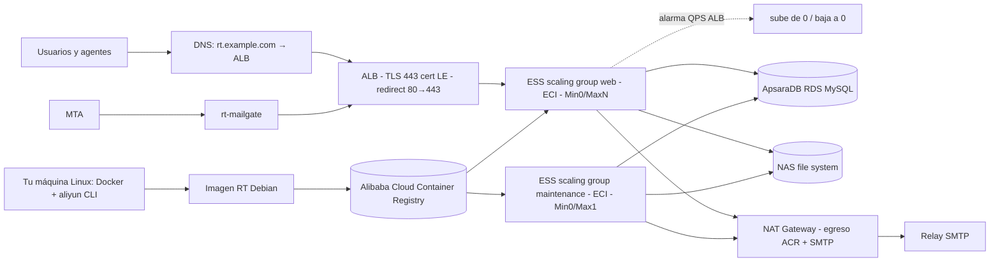
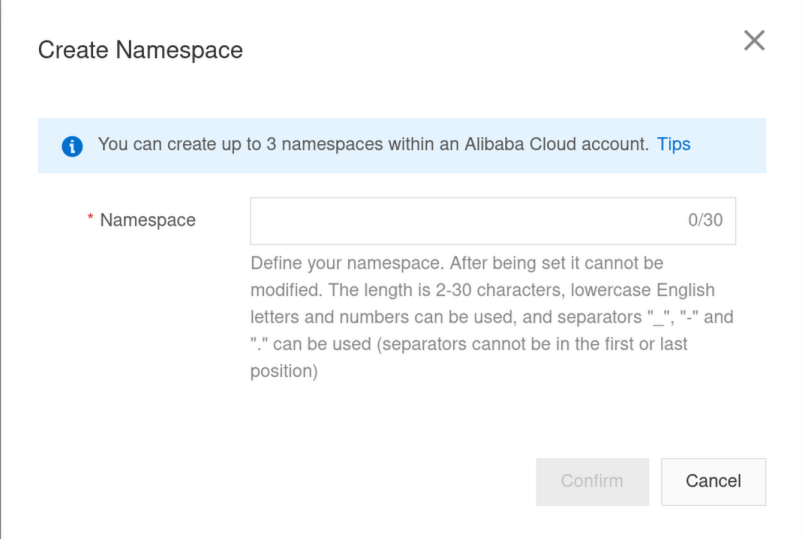
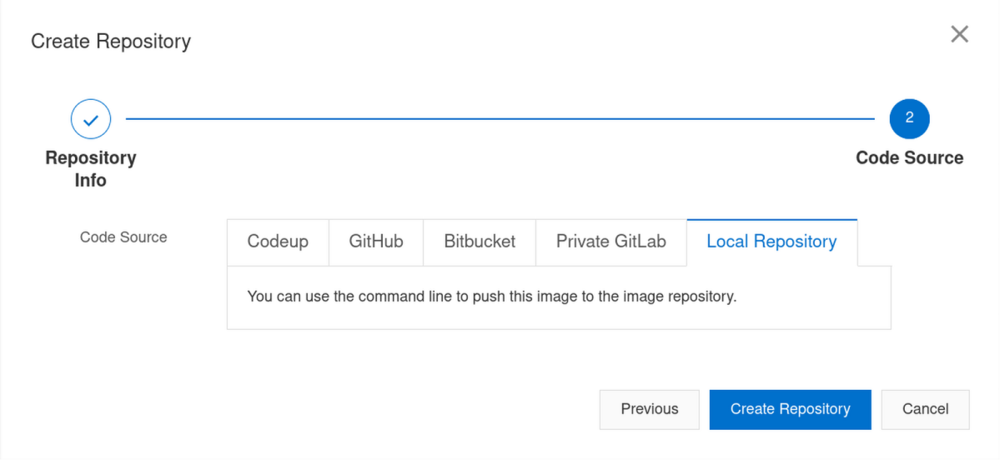
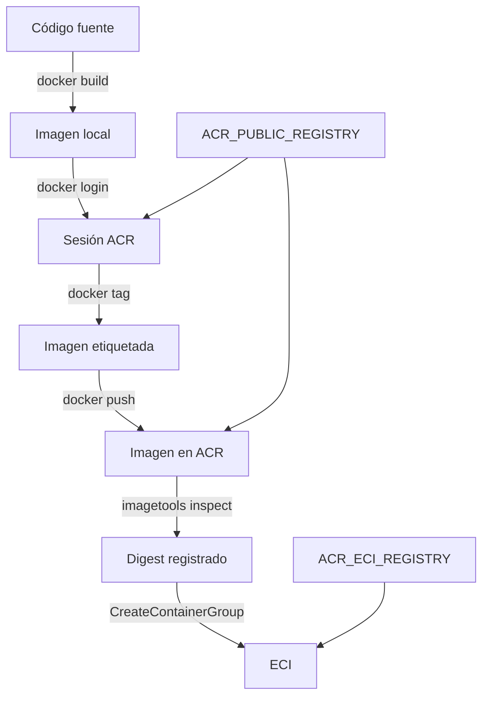
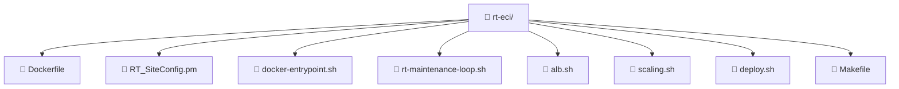

import Aside from "@rgglez/astro-aside";
import DownloadChecklist from "@rgglez/astro-downloadchecklist";

## Introducción

<a href="https://www.bestpractical.com/request-tracker/" target="_blank">**Request Tracker**</a>, conocido como **RT**, es una mesa de ayuda de código abierto desarrollada en Perl y ampliamente usada en empresas, organizaciones sin fines de lucro y proyectos de software libre.

Esta guía describe una instalación de RT, normalmente abreviado como **RT**, en **Alibaba Cloud Elastic Container Instance** (**ECI**) usando una imagen Docker propia basada en **Debian trixie-slim**. La imagen se construye en una máquina local, se publica en **Alibaba Cloud Container Registry** (**ACR**), y ECI la descarga desde el registry. La base de datos **MySQL** se asume preexistente en **ApsaraDB RDS**, y los archivos adjuntos se externalizan hacia **Alibaba Cloud NAS** montado como volumen persistente dentro del contenedor.

El resultado esperado es una arquitectura con estas propiedades:

- RT corre como contenedor sin servidor administrado por ECI.
- La imagen Docker se construye localmente y se sube a Alibaba Cloud Container Registry antes del despliegue.
- La base de datos vive fuera del contenedor, en RDS MySQL.
- Los adjuntos no crecen indefinidamente dentro de la base de datos ni en el filesystem efímero del contenedor.
- La imagen Docker no contiene secretos.
- La inicialización de la base de datos se ejecuta como tarea controlada, no como parte normal del arranque de la aplicación.
- Las tareas periódicas de RT corren en un contenedor de mantenimiento o en una tarea programada separada.

<Aside type="note" title="Versión usada en esta guía">

La guía usa **RT 6.0.3** porque, al momento de preparar este documento, Best Practical lo lista como versión actual junto con RT 5.0.10. Si necesitas máxima prudencia operativa y ya tienes una instalación RT 5.x, evalúa RT 5.0.10. Para una instalación nueva, RT 6.0.3 es una opción razonable siempre que revises las notas de versión y pruebes tus extensiones.

</Aside>

<Aside type="warning" title="Cambio rompedor en RT 6">

Best Practical hizo cambios significativos en RT 6, incluyendo un nuevo backend de almacenamiento de adjuntos, soporte nativo para Starman como servidor web y requisitos de MySQL 8.0.31+. Si migras desde RT 5.x, revisa cuidadosamente la documentación de migración oficial y prueba en un entorno de staging antes de actualizar producción. Best Practical no recomienda actualizar a RT 6 sin pruebas previas, especialmente si usas extensiones personalizadas o dependes de características específicas de RT 5.x. Al contrario, recomienda realizar una
instalación limpia de RT 6 y migrar datos desde RT 5.x usando herramientas de exportación/importación, en lugar de intentar un upgrade in-place.

</Aside>

<Aside type="note" title="No hay una imagen Docker oficial única para producción">

Best Practical ha explicado que no mantiene una sola imagen Docker recomendada para todos los casos porque RT puede desplegarse con distintas bases de datos, servidores web, sistemas operativos y combinaciones de dependencias. Por eso esta guía construye una imagen propia, reproducible y auditable.

</Aside>

---

## Tabla de contenido

---

## Arquitectura general



La arquitectura separa claramente tres tipos de estado:

1. **Estado transaccional**: tickets, usuarios, permisos, colas, transacciones y metadatos en RDS MySQL.
2. **Estado binario pesado**: adjuntos y archivos externalizados en NAS.
3. **Estado efímero**: cachés, logs temporales, archivos de PID y sockets dentro del contenedor.

<Aside type="tip" title="Principio de diseño">

En contenedores de ECI, se trata al sistema de archivos local como desechable. Todo dato que deba sobrevivir a recreaciones del contenedor debe vivir en RDS, NAS o en otro servicio persistente.

</Aside>

El objetivo de esta variante es **escalar a cero**: cuando no hay tráfico, el Auto Scaling Group baja a 0 instancias y no se paga cómputo. Un ALB termina TLS y reparte a los ECI que el scaling group registra como backends. El mantenimiento corre en su propio scaling group `Min0/Max1`, de modo que es singleton y también se apaga con la web.

<Aside type="caution" title="Cold-start al despertar de cero">

Subir desde 0 no es instantáneo. La alarma de QPS a nivel ALB dispara la regla de escalado, pero la **primera petición tras la inactividad puede recibir 503 o tardar ~1-2 minutos** mientras arranca un ECI (boot + pull de imagen + arranque de Starman/RT). No es comparable a una función serverless. Si ese cold-start no es aceptable, deja `MinSize=1` o usa escalado programado por horario.

</Aside>

## Estrategia para almacenar archivos en NAS

RT guarda adjuntos en la base de datos por defecto. En instalaciones reales esto suele aumentar el tamaño de la base de datos y complica respaldos, migraciones y restauraciones. RT incluye **ExternalStorage**, que mueve adjuntos fuera de la base de datos hacia otros backends de almacenamiento.

Para esta arquitectura, la opción práctica es usar `RT::ExternalStorage::Disk` y apuntarlo a un directorio respaldado por NAS. ECI monta el sistema de archivos NAS en `/opt/rt6/var/attachments`; RT sólo ve un directorio local, pero los datos sobreviven a recreaciones del contenedor.

| Elemento     | Decisión                     | Motivo                                                         |
| ------------ | ---------------------------- | -------------------------------------------------------------- |
| Backend RT   | `RT::ExternalStorage::Disk`  | Usa semántica de filesystem y encaja naturalmente con NAS.     |
| Volumen ECI  | NAS montado en el contenedor | Mantiene adjuntos fuera del filesystem efímero del contenedor. |
| Ruta interna | `/opt/rt6/var/attachments`   | Coincide con un directorio modificable por el usuario `rt`.    |

<Aside type="note" title="Recomendación operativa">

Usa un directorio dedicado en NAS, por ejemplo `/rt6/attachments`, y móntalo sólo en los contenedores que necesitan leer o externalizar adjuntos. No compartas ese mismo directorio con otros procesos que puedan modificar o borrar archivos fuera de RT.

</Aside>

<Aside type="note" title="Consideraciones sobre migración de adjuntos">

Si migras de una instalación que usaba adjuntos en la base de datos, exporta esos adjuntos a archivos en NAS y luego ejecuta el proceso de externalización de RT para que los registre correctamente. No copies archivos manualmente a NAS sin que RT lo sepa, porque podrías dejar tickets con adjuntos irrecuperables.

Sin embargo, los adjuntos en la base de datos pueden quedarse ahí, y RT seguirá funcionando para tickets viejos, mientras que los nuevos serán almacenados en NAS. La externalización es una mejora operativa, no un requisito técnico absoluto. Si decides externalizar, hazlo con cuidado y prueba el proceso en staging antes de producción.

</Aside>

## Supuestos previos

La guía asume lo siguiente. Usa esta checklist antes de ejecutar comandos de despliegue:

<DownloadChecklist filename="checklist-supuestos-previos-rt-eci-acr-rds-nas.csv">
  - [ ] Ya existe una instancia ApsaraDB RDS for MySQL accesible desde el mismo
  VPC o desde una red conectada al ECI.
  - [ ] La versión de MySQL es compatible
  con RT 6; RT 6 requiere MySQL 8.0.31 o superior si se usa
  `--with-db-type=mysql`.
  - [ ] Ya tienes o vas a crear un sistema de archivos
  Alibaba Cloud NAS accesible desde el mismo VPC/VSwitch donde correrá ECI.
  - [ ] Tienes (o vas a crear) un VPC con **vSwitches distintos para ECI y para el
  ALB, cada uno en dos zonas** de la región (4 en total); el ALB exige al menos dos
  zonas y no debe compartir vSwitch con los ECI.
  - [ ] Vas a crear un **NAT Gateway** con una EIP y una regla SNAT en el vSwitch
  de los ECI: al no tener IP pública, los ECI necesitan el NAT para hacer pull de
  la imagen desde ACR y para el relay SMTP externo.
  - [ ] Vas a crear un **Application Load Balancer (ALB)** internet-facing que
  termina TLS y reparte a los ECI.
  - [ ] Tienes un **certificado TLS** para el hostname de RT (en esta guía, Let's
  Encrypt) **subido a Aliyun SSL Certificates**; anota su ID.
  - [ ] El DNS de `RT_PUBLIC_HOST` apuntará (CNAME) al nombre DNS del ALB.
  - [ ] El contenedor web escuchará en el puerto `8080`; el ALB termina TLS en 443
  y reenvía HTTP al backend.
  - [ ] Ya existe un Security Group para los ECI que permite entrada al puerto
  `8080` sólo desde el ALB, y salida hacia RDS, NAS y el NAT.
  - [ ] Vas a usar **Auto Scaling (ESS)** con dos scaling groups de tipo ECI:
  `web` (Min0/MaxN, detrás del ALB) y `maintenance` (Min0/Max1, singleton).
  - [ ] Usarás Alibaba Cloud Container
  Registry, Personal Edition o Enterprise Edition, con un namespace y un
  repositorio privados para la imagen.
  - [ ] Construirás la imagen en tu máquina
  local y la subirás al registry con `docker login`, `docker tag` y `docker
  push`.
  - [ ] Crearás el ECI desde tu máquina local con `aliyun` CLI; no se
  usará almacenamiento de objetos como canal de despliegue de la imagen.
  - [ ] Los comandos se ejecutan desde una estación Linux con `docker`, `mysql`,
  `aliyun` CLI y credenciales adecuadas.
</DownloadChecklist>

<Aside type="danger" title="No uses SQLite en producción">

RT soporta SQLite para pruebas, pero no debe usarse para este escenario. En ECI, el sistema de archivos local es efímero y SQLite no tiene las características operativas que necesitas para una mesa de ayuda real.

</Aside>

## Variables de ejemplo

Ajusta estos valores a tus regiones, red y dominio.

```bash
#variables.sh

# Región Alibaba Cloud donde se crearán los recursos de ejecución: ECI, RDS y NAS.
REGION_ID="cn-hangzhou"

# Región Alibaba Cloud donde vive ACR. Puede ser distinta a REGION_ID.
ACR_REGION_ID="cn-hangzhou"

# Dominio público desde el cual los usuarios accederán a RT.
RT_PUBLIC_HOST="rt.example.com"

# URL pública completa. RT la usa para enlaces, redirecciones y cookies.
# El ALB termina TLS para los usuarios.
RT_WEB_URL="https://rt.example.com"

# Dominio web que RT usará para cookies y enlaces, sin esquema.
RT_WEB_DOMAIN="${RT_PUBLIC_HOST}"

# Puerto HTTP donde escuchará el contenedor RT (backend del ALB).
# 8080 (>1024) permite que rt corra sin privilegios; el ALB termina TLS en 443.
RT_WEB_PORT="8080"

# Protocolo del puerto publicado por el ECI. ECI requiere este campo.
RT_CONTAINER_PORT_PROTOCOL="TCP"

# --- Red: VPC + vSwitches. ECI y ALB usan vSwitches DISTINTOS, cada uno en 2 zonas ---
# El ALB exige >=2 zonas; los ECI van en su propia subred. No compartas vSwitch.
VPC_ID="vpc-xxxxxxxxxxxxxxxxx"
# vSwitches de los ECI (backends), 2 zonas.
ECI_VSWITCH_ID_A="vsw-xxxxxxxxxxxxxxxxx"
ECI_VSWITCH_ZONE_A="cn-hangzhou-i"
ECI_VSWITCH_ID_B="vsw-yyyyyyyyyyyyyyyyy"
ECI_VSWITCH_ZONE_B="cn-hangzhou-j"
# vSwitches del ALB, 2 zonas, distintos de los de ECI.
ALB_VSWITCH_ID_A="vsw-zzzzzzzzzzzzzzzzz"
ALB_VSWITCH_ZONE_A="cn-hangzhou-i"
ALB_VSWITCH_ID_B="vsw-wwwwwwwwwwwwwwwww"
ALB_VSWITCH_ZONE_B="cn-hangzhou-j"

# Security Group de los ECI backend: entrada al RT_WEB_PORT sólo desde el ALB,
# salida hacia RDS, NAS y el NAT Gateway (ACR/SMTP).
SECURITY_GROUP_ID="sg-xxxxxxxxxxxxxxxxx"

# --- NAT Gateway: salida a internet para los ECI sin IP pública ---
# Los ECI no tienen IP pública. El NAT (con EIP y SNAT en el vSwitch) les da
# egreso para el pull de la imagen desde ACR y para el relay SMTP externo.
NAT_GATEWAY_ID="ngw-xxxxxxxxxxxxxxxxx"

# --- ALB: termina TLS y reparte a los ECI ---
ALB_NAME="rt-alb"
ALB_SERVER_GROUP_NAME="rt-web"
# Health check HTTP que el ALB hace a cada ECI. RT responde en "/".
RT_HEALTHCHECK_PATH="/"
# ID del certificado (p. ej. Let's Encrypt) subido a Aliyun SSL Certificates.
ALB_CERT_ID="CAMBIA_ME"
# ALB hecho a mano: pon aquí su ID y el de su server group, NO corras alb.sh ni
# deploy.sh (crearían un ALB duplicado); corre `make scaling`. Si dejas que alb.sh
# cree el ALB, él los escribe en eci/variables.local y sobreescriben estos.
#   aliyun alb ListLoadBalancers --RegionId "$REGION_ID" | jq -r '.LoadBalancers[]|"\(.LoadBalancerName)\t\(.LoadBalancerId)"'
#   aliyun alb ListServerGroups  --RegionId "$REGION_ID" | jq -r '.ServerGroups[]|"\(.ServerGroupName)\t\(.ServerGroupId)"'
ALB_ID="CAMBIA_ME"
SERVER_GROUP_ID="CAMBIA_ME"

# --- Auto Scaling (ESS): dos scaling groups ECI ---
SG_WEB_NAME="rt-web"
SG_MAINT_NAME="rt-maintenance"
SCALING_MIN="0"
SCALING_MAX="3"
# Umbral de QPS (nivel ALB) para subir desde 0, y minutos a QPS=0 para bajar a 0.
QPS_SCALE_OUT="1"
QPS_SCALE_IN_IDLE_MIN="10"
# Recursos por ECI (web y mantenimiento).
ECI_CPU="2"
ECI_MEMORY="4"
ECI_CPU_MAINT="0.5"
ECI_MEMORY_MAINT="1"

# Namespace creado en Alibaba Cloud Container Registry.
ACR_NAMESPACE="mi-namespace"

# Repositorio creado en ACR para la imagen de RT.
ACR_REPOSITORY="rt-debian"

# Tag inmutable para la imagen.
RT_IMAGE_TAG="6.0.3-20260608"

# Endpoint público del registry, usado desde tu máquina local para docker login/push.
# Debe corresponder a ACR_REGION_ID, no necesariamente a REGION_ID.
# Personal Edition nuevo suele usar un dominio tipo crpi-xxxx.cn-hangzhou.personal.cr.aliyuncs.com.
# Enterprise Edition usa un dominio tipo miinstancia-registry.cn-hangzhou.cr.aliyuncs.com.
ACR_PUBLIC_REGISTRY="registry.${ACR_REGION_ID}.aliyuncs.com"

# Endpoint VPC del registry, usado por ECI sólo si ACR y ECI están en la misma región
# y el acceso VPC del registry está habilitado.
# En Personal Edition clásica suele ser registry-vpc.cn-hangzhou.aliyuncs.com.
# En Enterprise Edition suele ser miinstancia-registry-vpc.cn-hangzhou.cr.aliyuncs.com.
ACR_VPC_REGISTRY="registry-vpc.${ACR_REGION_ID}.aliyuncs.com"

# Registry que ECI usará para descargar la imagen.
# Si ACR_REGION_ID == REGION_ID, usa normalmente ACR_VPC_REGISTRY.
# Si ACR_REGION_ID != REGION_ID, usa ACR_PUBLIC_REGISTRY o replica la imagen a un ACR
# en REGION_ID para evitar egreso interregional.
# No incluyas https:// en este valor.
ACR_ECI_REGISTRY="${ACR_VPC_REGISTRY}"

# Usuario de acceso al registry. En RAM suele ser la parte anterior a .onaliyun.com.
ACR_USERNAME="mi-usuario-acr"

# Password de Docker login del registry. No lo dejes en un archivo versionado.
ACR_PASSWORD="CAMBIA_ESTA_PASSWORD_ACR"

# Imagen usada para construir, etiquetar y subir desde tu máquina local con docker push.
RT_IMAGE_PUBLIC="${ACR_PUBLIC_REGISTRY}/${ACR_NAMESPACE}/${ACR_REPOSITORY}:${RT_IMAGE_TAG}"

# Imagen usada por ECI para descargar la imagen desde ACR_ECI_REGISTRY.
RT_IMAGE_ECI="${ACR_ECI_REGISTRY}/${ACR_NAMESPACE}/${ACR_REPOSITORY}:${RT_IMAGE_TAG}"

# Endpoint interno o privado de RDS MySQL, idealmente accesible desde el VPC de ECI.
RT_DB_HOST="rm-xxxxxxxx.mysql.rds.aliyuncs.com"

# Puerto estándar de MySQL.
RT_DB_PORT="3306"

# Nombre de la base de datos RT.
RT_DB_NAME="rt6"

# Usuario aplicativo de RT.
RT_DB_USER="rt_app"

# Password aplicativo de RT. No lo dejes en un archivo versionado.
RT_DB_PASSWORD="CAMBIA_ESTA_PASSWORD_LARGA"

# Conexión TLS hacia RDS. Usa 1 si tu RDS soporta SSL; usa 0 si el endpoint
# rechaza SSL forzado (p. ej. algunos endpoints rwlb/compartidos de Aliyun RDS,
# que devuelven "Enforcing SSL encryption is not supported").
RT_DB_SSL="1"

# Password inicial del usuario root de RT durante init-db.
RT_ROOT_PASSWORD="CAMBIA_ESTA_PASSWORD_ROOT_RT"

# ID del sistema de archivos NAS donde vivirán adjuntos externalizados.
NAS_FILE_SYSTEM_ID="xxxxxxxxxxxxxxxx"

# Punto de montaje NAS que debe resolver y ser accesible desde el VPC/VSwitch de ECI.
NAS_MOUNT_TARGET_DOMAIN="xxxxxxxxxxxxxxxx.cn-hangzhou.nas.aliyuncs.com"

# Directorio dentro de NAS reservado para RT.
NAS_PATH="/rt6/attachments"

# Ruta donde ECI montará NAS dentro del contenedor.
# Debe coincidir con el MountPath usado por rt-web y rt-maintenance.
RT_ATTACHMENT_PATH="/opt/rt6/var/attachments"

# Relay SMTP saliente. Estas credenciales no son credenciales de Alibaba Cloud.
RT_SMTP_HOST="smtp.example.com"
RT_SMTP_USER="rt@example.com"
RT_SMTP_PASSWORD="CAMBIA_ESTA_PASSWORD_SMTP"

# Búsqueda full-text. Déjala en 0 hasta que la tabla índice exista.
# Pon RT_FTS_ENABLE=1 tras crear AttachmentsIndex (rt-setup-fulltext-index o su DDL).
RT_FTS_ENABLE="0"
RT_FTS_INDEXED="1"
RT_FTS_TABLE="AttachmentsIndex"
```

Luego, usa estas variables para construir tus comandos de despliegue, por ejemplo:

```bash
set -u
source ./variables.sh
```

<Aside type="caution" title="No ejecutes variables.sh sin source">

No ejecutes `./variables.sh` ni `sh variables.sh` esperando que las variables queden disponibles en tu shell actual. Eso corre el archivo en otro proceso. Usa `source ./variables.sh` o `. ./variables.sh`.

</Aside>

## Preparar VPC (NAT), ALB, certificado TLS y Auto Scaling

Esta variante no usa EIP ni Cloudflare. La infraestructura de red y publicación se compone de cuatro piezas que debes preparar antes de desplegar.

### vSwitches separados para ECI y ALB

El ALB exige al menos **dos zonas**, y **no debe compartir vSwitch con los ECI**: cada uno vive en su propia subred. Crea cuatro vSwitches del mismo VPC, dos para los ECI y dos para el ALB, cada par en zonas distintas de `REGION_ID`:

- ECI: `ECI_VSWITCH_ID_A`/`ECI_VSWITCH_ZONE_A` y `ECI_VSWITCH_ID_B`/`ECI_VSWITCH_ZONE_B`.
- ALB: `ALB_VSWITCH_ID_A`/`ALB_VSWITCH_ZONE_A` y `ALB_VSWITCH_ID_B`/`ALB_VSWITCH_ZONE_B`.

Separarlos mantiene la regla del Security Group limpia (entrada 8080 a los ECI sólo desde la subred del ALB) y evita que el ALB consuma IPs de la subred de cómputo.

### NAT Gateway para egreso

Los ECI del scaling group **no tienen IP pública** (son backends del ALB). Sin embargo necesitan salida a internet para dos cosas: hacer **pull de la imagen** desde el ACR público (si está en otra región) y enviar correo por el **relay SMTP** externo. Crea un **NAT Gateway** en el VPC, asóciale una EIP y añade una regla **SNAT** para el vSwitch de los ECI. Anota el ID en `NAT_GATEWAY_ID`.

<Aside type="tip" title="Alternativa para el pull de imagen">

Si replicas la imagen a un ACR en la misma región que los ECI y habilitas el pull por VPC (`ACR_ECI_REGISTRY` = endpoint `registry-vpc...`), eliminas el egreso de ACR. Aun así necesitarás el NAT para el SMTP saliente, salvo que uses un relay accesible por red privada.

</Aside>

### Certificado TLS en Aliyun SSL Certificates

El ALB termina TLS. Sube tu certificado para `RT_PUBLIC_HOST` (en esta guía, emitido por **Let's Encrypt**) a **Aliyun SSL Certificates** y copia su ID en `ALB_CERT_ID`. El listener HTTPS lo referenciará.

### ALB y Auto Scaling

El despliegue (`make deploy`) crea el **ALB** (listeners 443/80 y server group) y los dos **scaling groups ECI** (web y maintenance) conectados a él. Sólo necesitas tener listos VPC/vSwitches, NAT y el certificado, y haber apuntado el DNS de `RT_PUBLIC_HOST` (CNAME) al nombre DNS del ALB una vez creado.

Patrón recomendado para `deploy.sh`:

```bash
#!/usr/bin/env bash
set -euo pipefail

SCRIPT_DIR="$(cd "$(dirname "${BASH_SOURCE[0]}")" && pwd)"
source "${SCRIPT_DIR}/variables.sh"

: "${REGION_ID:?REGION_ID no está definido}"

aliyun eci CreateContainerGroup \
  --RegionId "${REGION_ID}" \
  ...
```

Alternativa si no quieres que `deploy.sh` cargue el archivo:

```bash
set -a
source ./variables.sh
set +a

./deploy.sh
```

Para confirmar el problema:

```bash
set | grep '^REGION_ID='
env | grep '^REGION_ID='
```

`set` muestra variables locales del shell. `env` muestra sólo variables exportadas, que son las que verá `./deploy.sh`.

## Preparar Alibaba Cloud Container Registry para la imagen

Alibaba Cloud documenta el servicio de registro de contenedores como **Container Registry** o **ACR**. Existen dos versiones, **ACR Enterprise Edition**, que suele ser muy cara, y **ACR Personal Edition**, económica, pero de la cuál sólo puede existir una instancia global por cuenta, por lo que, si está en una región distinta a la del despliegue de ECI, podría generar un costo de egreso de datos. Ambas versiones permiten alojar imágenes Docker y empujarlas desde un entorno local hacia un repositorio.

En Personal Edition debes crear primeramente un namespace:



<Aside type="caution" title="Límites de Personal Edition">

Personal Edition sólo permite tres namespaces. Si requieres más, considera usar Enterprise Edition. Como se dijo antes, sólo puede existir una instancia global por cuenta.

</Aside>

Luego se debe crear un repositorio, antes de subir la imagen. Selecciona **Local Repository** para poder subir la imagen desde tu máquina local con `docker push`:



En Enterprise Edition, además, debes crear la instancia, configurar credenciales y, si quieres pull privado desde VPC, habilitar el acceso correspondiente. Dado que no uso esa versión, no incluyo capturas de pantalla, pero el proceso es similar al de Personal Edition.

<Aside type="note" title="Repositorio en Container Registry">

Procura usar un nombre de repositorio claro, por ejemplo `rt-debian`, y un tag específico para la imagen, por ejemplo `6.0.3-20260608`. Evita usar tags genéricos como `latest` o `stable` en producción, porque pueden apuntar a versiones distintas sin aviso previo.

</Aside>

<Aside type="caution" title="No compartas repositorios públicamente">

El repositorio debe ser **privado** para evitar que otros usuarios de Alibaba Cloud puedan descargar tu imagen. Personal Edition no tiene repositorios públicos, pero Enterprise Edition sí, así que asegúrate de configurar el repositorio como privado.

</Aside>

El flujo general para publicar la imagen de RT en ACR es el siguiente:



<Aside type="note" title="ACR - Container Registry de Alibaba Cloud">

Los comandos Docker son los mismos en lo esencial: `docker login`, `docker tag` y `docker push`; lo que cambia es el formato del endpoint.

</Aside>

### Formatos típicos de endpoint

En la tabla, `REGION` se refiere a la región de ACR (`ACR_REGION_ID`), no necesariamente a la región donde crearás ECI (`REGION_ID`).

| Edición                | Desde tu máquina local                      | Desde ECI por VPC                               | Ejemplo de imagen                                                                      |
| ---------------------- | ------------------------------------------- | ----------------------------------------------- | -------------------------------------------------------------------------------------- |
| ACR Personal clásico   | `registry.REGION.aliyuncs.com`              | `registry-vpc.REGION.aliyuncs.com`              | `registry.cn-hangzhou.aliyuncs.com/mi-namespace/rt-debian:6.0.3-20260608`              |
| ACR Personal nuevo     | `crpi-xxxx.REGION.personal.cr.aliyuncs.com` | verifica el endpoint VPC en consola             | `crpi-xxxx.cn-hangzhou.personal.cr.aliyuncs.com/mi-namespace/rt-debian:6.0.3-20260608` |
| ACR Enterprise Edition | `INSTANCIA-registry.REGION.cr.aliyuncs.com` | `INSTANCIA-registry-vpc.REGION.cr.aliyuncs.com` | `miacr-registry.cn-hangzhou.cr.aliyuncs.com/mi-namespace/rt-debian:6.0.3-20260608`     |

<Aside type="caution" title="No inventes el endpoint">

Copia el endpoint exacto desde la consola de Container Registry. Alibaba Cloud cambió el formato de endpoints para nuevas instancias Personal Edition, así que `registry.REGION.aliyuncs.com` no siempre será el formato correcto en cuentas nuevas.

</Aside>

### Configurar `aliyun` CLI en tu máquina local

Para obtener el **AccessKey ID** y el **AccessKey Secret**, entra a la consola de Alibaba Cloud, abre **RAM (Resource Access Management)**, crea o selecciona un usuario RAM dedicado para despliegues y genera un AccessKey desde la pestaña de credenciales del usuario. Copia el Secret en ese momento: Alibaba Cloud sólo lo muestra una vez. Evita usar las claves de la cuenta root y asigna permisos mínimos para ECI, VPC/NAS/RDS de lectura según necesites, y ACR si automatizarás operaciones del registry desde la CLI.

Ejecuta la configuración base de la CLI con un perfil nombrado. Esto es más seguro que depender del perfil implícito si administras varias cuentas, varias regiones o ambientes separados:

```bash
aliyun configure --mode AK --profile rt-eci-prod
```

`aliyun configure` crea o actualiza un perfil local de Alibaba Cloud CLI. `--mode AK` indica que el perfil usa AccessKey ID y AccessKey Secret. `--profile rt-eci-prod` da un nombre explícito a esta configuración; cámbialo si prefieres nombres como `cliente-a-prod`, `rt-staging` o `cuenta-operaciones`.

Durante la configuración, indica el **AccessKey ID**, el **AccessKey Secret**, la región predeterminada y el formato de salida. Para esta guía, usa como región predeterminada `REGION_ID`, es decir, la región donde se encuentran ECI, RDS y NAS. ACR puede vivir en `ACR_REGION_ID` si tu registry está en otra región.

En Linux y macOS, la CLI guarda los perfiles en:

```text
~/.aliyun/config.json
```

Ese archivo está en formato JSON y contiene credenciales. No lo subas a Git, no lo copies a imágenes Docker y no lo compartas en tickets o documentación. Si necesitas revisarlo, hazlo sólo para validar nombres de perfiles, región o modo de autenticación, no para copiar secretos.

Puedes consultar los perfiles configurados:

```bash
aliyun configure list
```

`aliyun configure list` muestra un resumen de perfiles. El perfil activo aparece marcado con `*`.

Puedes inspeccionar un perfil concreto:

```bash
aliyun configure get --profile rt-eci-prod
```

`aliyun configure get` muestra los campos del perfil indicado. Úsalo para confirmar que `region_id` coincide con `REGION_ID`.

Si quieres que todos los comandos usen ese perfil por defecto en tu shell actual, cambia el perfil activo:

```bash
aliyun configure switch --profile rt-eci-prod
```

En equipos donde administras varias cuentas, evita depender del perfil activo global. Es mejor pasar `--profile` en cada comando sensible, especialmente en comandos que crean, modifican o eliminan recursos.

Verifica que la CLI puede llamar servicios de Alibaba Cloud:

```bash
aliyun eci DescribeContainerGroups \
  --profile rt-eci-prod \
  --RegionId "${REGION_ID}" \
  --Limit 1
```

`aliyun eci DescribeContainerGroups` consulta grupos ECI existentes. No crea recursos; sirve como prueba de autenticación, permisos y región.

`--profile rt-eci-prod` fuerza el perfil de credenciales para este comando. Esta opción evita que una terminal con otro perfil activo cree o consulte recursos en la cuenta equivocada.

`--RegionId` fuerza la región de la consulta, evitando que el perfil local apunte por error a otra región.

`--Limit 1` limita la respuesta a un elemento, suficiente para validar conectividad.

Otra opción práctica para sesiones largas es fijar el perfil con una variable de entorno:

```bash
export ALIBABA_CLOUD_PROFILE="rt-eci-prod"
```

Con esa variable, los comandos de esa terminal usarán el perfil indicado mientras no pases otro `--profile`. Para scripts de despliegue, aun así conviene declarar `--profile` explícitamente o definir una variable propia:

```bash
ALIYUN_PROFILE="rt-eci-prod"

aliyun eci DescribeContainerGroups \
  --profile "${ALIYUN_PROFILE}" \
  --RegionId "${REGION_ID}" \
  --Limit 1
```

<Aside type="caution" title="Confirma cuenta y región antes de crear ECI">

Si manejas varias cuentas, usa perfiles separados y nombres explícitos. Antes de ejecutar comandos como `CreateContainerGroup`, `DeleteContainerGroup` o cambios en ACR, verifica `aliyun configure list`, el `--profile` usado y `--RegionId`. La CLI puede tener un perfil activo distinto al que esperas si trabajaste antes con otra cuenta.

</Aside>

<Aside type="tip" title="Permisos RAM mínimos">

El usuario RAM local necesita permisos para crear ECI, consultar VPC/VSwitch/Security Group si automatizas validaciones, y leer credenciales o metadatos de ACR según tu flujo. Para `docker push`, además de la CLI, necesitas credenciales de Docker del registry, que no son necesariamente el mismo AccessKey de la CLI.

</Aside>

## Preparar RDS MySQL

RT puede crear la base de datos y el usuario si se le dan credenciales de DBA, pero en RDS conviene separar responsabilidades: crea la base y el usuario desde la consola, desde una cuenta administrativa o desde un pipeline controlado, y luego ejecuta la acción de RT que corresponda sin darle credenciales administrativas al contenedor.

Antes de tocar RDS, decide cuál de estos tres escenarios estás resolviendo:

| Escenario                | Base de datos objetivo                                                      | Acción RT correcta                                                              | Riesgo principal                                                                          |
| ------------------------ | --------------------------------------------------------------------------- | ------------------------------------------------------------------------------- | ----------------------------------------------------------------------------------------- |
| Instalación nueva        | Base vacía, por ejemplo `rt6`                                               | `rt-setup-database --action init --skip-create`                                 | Ejecutar `init` dos veces sobre datos reales.                                             |
| Upgrade dentro de RT 6.x | Copia de una base RT 6 existente                                            | `rt-setup-database --action upgrade` o el flujo indicado por la versión destino | Cambios de esquema pendientes o parciales.                                                |
| Migración de RT 5 a RT 6 | Copia restaurada de la base RT 5, conservando nombre o importada como `rt6` | Fresh install de código RT 6 y upgrade de DB desde copia                        | Tratar RT 6 como reemplazo directo de `/opt/rt5` o ignorar extensiones/personalizaciones. |

RT 6 con `--with-db-type=mysql` está pensado para MySQL 8. Verifica que tu RDS use una versión compatible, idealmente MySQL 8.0.31 o superior, y que las tablas usen `utf8mb4` para soportar Unicode completo.

<Aside type="tip" title="Instancia ECS temporal para administración de RDS">

Puedes crear una instancia ECS temporal con MySQL cliente, e incluso con el árbol de RT, para ejecutar comandos de administración de MySQL. Evita ejecutar comandos administrativos desde el contenedor de RT, porque eso mezcla responsabilidades y puede complicar la seguridad y el mantenimiento.

</Aside>

### Caso 1: instalación nueva

Para una instalación nueva, crea una base vacía y un usuario aplicativo. Después, más adelante en esta guía, ejecutarás `init-db`, que invoca `rt-setup-database --action init --skip-create`.

Conéctate a RDS desde una máquina con acceso de red permitido:

```bash
mysql \
  --host="rm-xxxxxxxx.mysql.rds.aliyuncs.com" \
  --port=3306 \
  --user="admin_rds" \
  --password \
  --default-character-set=utf8mb4
```

`mysql` inicia el cliente de línea de comandos de MySQL.

`--host` indica el endpoint de RDS. Usa el endpoint interno cuando sea posible.

`--port` define el puerto TCP. MySQL usa `3306` por convención.

`--user` indica la cuenta administrativa o suficientemente privilegiada.

`--password` pide la contraseña de forma interactiva para evitar que quede en el historial del shell.

`--default-character-set=utf8mb4` fuerza una codificación apta para Unicode completo.

Dentro del cliente MySQL, ejecuta:

```sql
-- Crea la base de datos principal de RT.
-- utf8mb4 permite almacenar caracteres Unicode completos.
-- utf8mb4_unicode_ci ofrece comparación/collation razonable para texto multilingüe.
CREATE DATABASE rt6
  CHARACTER SET utf8mb4
  COLLATE utf8mb4_unicode_ci;

-- Crea el usuario aplicativo que RT usará en tiempo de ejecución.
-- Cambia la contraseña por una generada con un gestor de secretos.
-- En RDS puedes restringir el host de origen si conoces el rango privado de ECI.
CREATE USER 'rt_app'@'%'
  IDENTIFIED BY 'CAMBIA_ESTA_PASSWORD_LARGA';

-- Concede privilegios sobre la base de RT.
-- SELECT/INSERT/UPDATE/DELETE son necesarios para operación normal.
-- CREATE/DROP/ALTER/INDEX son necesarios durante inicialización, upgrades e índices.
-- CREATE TEMPORARY TABLES y LOCK TABLES evitan fallos en operaciones administrativas.
GRANT SELECT, INSERT, UPDATE, DELETE,
      CREATE, DROP, ALTER, INDEX,
      CREATE TEMPORARY TABLES, LOCK TABLES
ON rt6.*
TO 'rt_app'@'%';

-- Fuerza a MySQL a recargar privilegios.
FLUSH PRIVILEGES;
```

<Aside type="caution" title="Privilegios después de inicializar">

Puedes reducir privilegios después de la instalación inicial, pero recuerda que upgrades de RT y creación de índices pueden requerir `ALTER`, `CREATE`, `DROP` e `INDEX`. Si reduces privilegios, documenta un procedimiento temporal para elevarlos durante mantenimiento.

</Aside>

### Caso 2: upgrade dentro de la serie RT 6.x

Si ya tienes RT 6 en producción y sólo vas a pasar a otra versión de la serie 6.x, no crees una base nueva desde cero. Trabaja con una copia de la base existente, prueba el upgrade completo en staging y sólo después repite el procedimiento en producción.

Procedimiento recomendado:

1. Detén o pausa tráfico hacia RT.
2. Detén contenedores de mantenimiento, indexadores y tareas de externalización.
3. Toma snapshot de RDS o respaldo lógico con `mysqldump --default-character-set=utf8mb4`.
4. Restaura ese respaldo en una instancia o base de staging.
5. Arranca la nueva imagen RT 6.x contra staging.
6. Ejecuta `rt-setup-database --action upgrade`.
7. Ejecuta `rt-validator` y pruebas funcionales.
8. Repite en producción durante una ventana de mantenimiento.

Ejemplo conceptual dentro del contenedor:

```bash
docker run --rm \
  --env-file <(set -a; source ../variables.sh; set +a; env | grep -E '^RT_') \
  "${RT_IMAGE_PUBLIC}" \
  /opt/rt6/sbin/rt-setup-database \
    --action upgrade \
    --upgrade-from 6.0.0 \
    --upgrade-to 6.0.3
```

`--action upgrade` aplica cambios de esquema, ACL y contenido que RT necesite para la versión destino.

`--upgrade-from` y `--upgrade-to` evitan prompts interactivos si la versión indicada es válida. Ajusta los valores a tu versión real.

<Aside type="warning" title="No confundas rebuild con upgrade">

Cambiar la imagen de `rt:6.0.0` a `rt:6.0.3` no garantiza que la base quede actualizada. La imagen y el esquema de RDS son piezas distintas; el upgrade de base debe ejecutarse explícitamente cuando la versión lo requiera.

</Aside>

### Caso 3: migración de RT 5 a RT 6

La migración desde RT 5 a RT 6 es un upgrade mayor, no una actualización menor. Best Practical advierte que RT 6 contiene cambios incompatibles y recomienda una instalación fresca del código en `/opt/rt6` o en una ruta equivalente. No instales RT 6 encima de una instalación RT 5 existente en `/opt/rt5`.

Para esta guía basada en contenedores, eso significa:

- Construye una imagen nueva de RT 6, separada de cualquier imagen o filesystem usado por RT 5.
- No reutilices archivos locales modificados de `/opt/rt5` copiándolos en bloque a `/opt/rt6`.
- Exporta o clona la base RT 5 y restaúrala como base de staging antes de tocar producción.
- Decide si conservarás el nombre anterior de la base, por ejemplo `rt5`, o si importarás el respaldo como `rt6`. RT 6 usa `rt6` como default, pero no es obligatorio si configuras `RT_DB_NAME`.
- Ejecuta el upgrade de base sobre la copia restaurada, no sobre la base productiva original.
- Revisa extensiones, callbacks, overlays, CSS local y configuración antes de declarar la migración lista.

Ejemplo de respaldo lógico desde la base RT 5:

```bash
mysqldump \
  --host="rm-xxxxxxxx.mysql.rds.aliyuncs.com" \
  --port=3306 \
  --user="admin_rds" \
  --password \
  --default-character-set=utf8mb4 \
  --single-transaction \
  rt5 \
  | gzip > rt5-pre-rt6-$(date +%Y%m%d).sql.gz
```

Ejemplo de restauración hacia una base de staging llamada `rt6_staging`:

```bash
mysql \
  --host="rm-xxxxxxxx.mysql.rds.aliyuncs.com" \
  --port=3306 \
  --user="admin_rds" \
  --password \
  --default-character-set=utf8mb4 \
  -e "CREATE DATABASE rt6_staging CHARACTER SET utf8mb4 COLLATE utf8mb4_unicode_ci;"

gunzip -c rt5-pre-rt6-YYYYMMDD.sql.gz | mysql \
  --host="rm-xxxxxxxx.mysql.rds.aliyuncs.com" \
  --port=3306 \
  --user="admin_rds" \
  --password \
  --default-character-set=utf8mb4 \
  rt6_staging
```

Después apunta `RT_DB_NAME=rt6_staging` en el ambiente de staging y ejecuta el upgrade:

**Flujo A: contenedor de esta guía, con RT ya instalado en `/opt/rt6`**

```bash
docker run --rm \
  --env-file <(set -a; source ../variables.sh; set +a; env | grep -E '^RT_') \
  -e RT_DB_NAME=rt6_staging \
  "${RT_IMAGE_PUBLIC}" \
  /opt/rt6/sbin/rt-setup-database \
    --action upgrade \
    --upgrade-from 5.0.10 \
    --upgrade-to 6.0.3
```

Este es el flujo normal para la imagen de esta guía: el build ya ejecutó `make install`, por lo que el contenedor tiene los binarios de RT en `/opt/rt6/sbin`.

**Flujo B: árbol fuente de RT en una ECS temporal**

Si prefieres usar una ECS administrativa con acceso a RDS, el objetivo es descargar el tarball de RT 6, configurarlo con los mismos parámetros principales, instalar dependencias y llegar al target oficial `make upgrade-database`:

```bash
RT_VERSION="6.0.3"

sudo mkdir -p /usr/local/src
cd /usr/local/src

curl -fsSL "https://download.bestpractical.com/pub/rt/release/rt-${RT_VERSION}.tar.gz" \
  -o "rt-${RT_VERSION}.tar.gz"

tar -xzf "rt-${RT_VERSION}.tar.gz"
cd "rt-${RT_VERSION}"

./configure \
  --prefix=/opt/rt6 \
  --with-db-type=mysql \
  --with-web-handler=standalone \
  --with-web-user=rt \
  --with-web-group=rt \
  --with-rt-group=rt \
  --enable-graphviz

make fixdeps
make testdeps

sudo make upgrade
sudo make upgrade-database
```

Antes de ejecutar `make upgrade-database`, la configuración de RT que use ese árbol fuente debe apuntar a la base restaurada de staging, por ejemplo `rt6_staging`, no a producción. Ajusta `RT_SiteConfig.pm` o las variables que uses en esa ECS para que `DatabaseHost`, `DatabaseName`, `DatabaseUser` y `DatabasePassword` apunten al RDS correcto.

<Aside type="danger" title="RT 5 a RT 6 requiere revisar personalizaciones">

No limites la migración a que `rt-setup-database` termine sin error. RT 6 cambia sesiones, carga componentes con `htmx`, reestructura layouts de páginas y mueve o cambia callbacks usados por extensiones y overlays. Si tienes código local que escribe en `$session`, callbacks en pantallas de tickets/assets, cambios en menús, CSS contra `body#comp-*` o extensiones integradas ahora en RT 6, pruébalo en staging y revisa logs de deprecación antes de producción.

</Aside>

<Aside type="tip" title="mydumper para migraciones grandes">

Si tu base RT es muy grande (por ejemplo, si tiene muchos adjuntos almacenados), el proceso de exportación e importación con `mysqldump` puede ser lento. Considera usar herramientas como <a href="https://github.com/mydumper/mydumper" target="_blank">`mydumper`</a> para exportar en paralelo y acelerar la migración. Sin embargo, asegúrate de que la herramienta respete las opciones de codificación y transacciones necesarias para una migración limpia.

</Aside>

## Preparar Alibaba Cloud NAS

Crea un sistema de archivos NAS en la misma región y VPC donde correrá ECI. Después crea un mount target y asígnale un grupo de permisos que permita acceso desde el VSwitch o CIDR privado usado por ECI.

Para esta guía, reserva un directorio exclusivo para RT:

```text
/rt6/attachments
```

Ese directorio debe existir antes de usarlo con `NFSVolume`. Si declaras `Volume.1.NFSVolume.Path="${NAS_PATH}"` y `${NAS_PATH}` no existe dentro del sistema de archivos NAS, ECI puede fallar con `MountVolume.SetUp failed ... file does not exist`.

Una forma práctica de prepararlo es montar temporalmente la raíz del NAS desde una ECS o desde una máquina con acceso al VPC y crear el directorio:

```bash
sudo mkdir -p /mnt/rt-nas

sudo mount -t nfs \
  -o vers=3,nolock,tcp,noresvport \
  "${NAS_MOUNT_TARGET_DOMAIN}:/" \
  /mnt/rt-nas

sudo mkdir -p "/mnt/rt-nas${NAS_PATH}"
sudo chmod 0770 "/mnt/rt-nas${NAS_PATH}"

sudo umount /mnt/rt-nas
```

Si no quieres precrear subdirectorios, usa `FlexVolume` con `alicloud/nas`; en esa modalidad el parámetro `path` puede apuntar a un subdirectorio y ECI puede crearlo automáticamente. También permite fijar opciones como `vers=3` si necesitas evitar negociación NFSv4.

Puedes usar `NFSVolume` en ECI cuando sólo necesitas un montaje NAS directo con lectura/escritura. Usa `FlexVolume` con `alicloud/nas` sólo si necesitas opciones NFS personalizadas, una versión concreta de NFS o un montaje más específico.

<Aside type="caution" title="Permisos NAS">

NAS no usa AccessKey dentro del contenedor para leer y escribir archivos. El control práctico está en el mount target, el grupo de permisos NAS, la red VPC/VSwitch y los permisos Unix del directorio. Valida que el usuario `rt` pueda escribir en el directorio montado antes de mover adjuntos reales.

</Aside>

<Aside type="danger" title="No modifiques adjuntos fuera de RT">

RT calcula rutas basadas en contenido y puede deduplicar adjuntos. Si eliminas, mueves o modificas archivos en NAS sin que RT lo sepa, puedes dejar tickets con adjuntos irrecuperables.

</Aside>

## Estructura del proyecto Docker

Crea un directorio local:

```bash
mkdir -p rt-eci
cd rt-eci
```

`mkdir -p rt-eci` crea el directorio del proyecto sin fallar si ya existe.

`cd rt-eci` cambia tu shell al directorio donde guardarás el Dockerfile y los archivos de configuración.

La estructura final será:



## Dockerfile multi-stage basado en Debian trixie-slim

Crea `Dockerfile`:

```dockerfile
# syntax=docker/dockerfile:1.7

# Etapa builder: compila RT y módulos Perl nativos.
FROM debian:trixie-slim AS builder

# Versión de RT a compilar.
# Puede sobrescribirse con: docker build --build-arg RT_VERSION=6.0.3 ...
ARG RT_VERSION=6.0.3

# Directorio de instalación estándar de RT 6.
ENV RT_HOME=/opt/rt6

# Evita prompts interactivos de apt y algunas herramientas Perl/CPAN.
ENV DEBIAN_FRONTEND=noninteractive \
    PERL_MM_USE_DEFAULT=1

# Instala dependencias de compilación.
# bash: scripts operativos y depuración.
# ca-certificates: validación TLS hacia RDS/SMTP.
# curl/tar/gzip: descarga y extracción del código fuente de RT.
# build-essential/libperl-dev/default-libmysqlclient-dev/etc.: compilación de módulos CPAN nativos.
# graphviz: gráficas de relaciones de tickets si se habilita soporte.
# gnupg: soporte opcional para GPG/SMIME si decides habilitarlo.
RUN apt-get update \
    && apt-get install -y --no-install-recommends \
      bash \
      ca-certificates \
      curl \
      tar \
      gzip \
      make \
      build-essential \
      perl \
      perl-doc \
      libperl-dev \
      cpanminus \
      liblwp-protocol-https-perl \
      libdbd-mysql-perl \
      default-libmysqlclient-dev \
      libssl-dev \
      zlib1g-dev \
      libexpat1-dev \
      libxml2-dev \
      libxslt1-dev \
      libgd-dev \
      libgmp-dev \
      libicu-dev \
      pkg-config \
      graphviz \
      gnupg \
    && rm -rf /var/lib/apt/lists/*

# Usa bash con pipefail para que comandos con tee fallen correctamente.
SHELL ["/bin/bash", "-o", "pipefail", "-c"]

# make fixdeps usa CPAN.pm. En contenedores, configura CPAN de forma no interactiva
# antes de ejecutar make fixdeps para evitar el error "CPAN shell not configured".
RUN mkdir -p /root/.cpan/CPAN /root/.cpan/build /root/.cpan/sources /root/.cpan/prefs \
    && printf '%s\n' \
      '$CPAN::Config = {' \
      "  'auto_commit' => q[1]," \
      "  'build_dir' => q[/root/.cpan/build]," \
      "  'build_requires_install_policy' => q[yes]," \
      "  'connect_to_internet_ok' => q[1]," \
      "  'cpan_home' => q[/root/.cpan]," \
      "  'keep_source_where' => q[/root/.cpan/sources]," \
      "  'make' => q[/usr/bin/make]," \
      "  'make_install_make_command' => q[/usr/bin/make]," \
      "  'mbuild_install_build_command' => q[./Build]," \
      "  'prefs_dir' => q[/root/.cpan/prefs]," \
      "  'prerequisites_policy' => q[follow]," \
      "  'urllist' => [q[https://cpan.metacpan.org/]]," \
      '};' \
      '1;' \
      > /root/.cpan/CPAN/MyConfig.pm

# Crea un usuario no privilegiado para ejecutar RT.
# --system crea usuario/grupo de sistema.
# --home-dir fija el home para evitar escritura en /root.
RUN mkdir -p /opt/rt6 \
    && groupadd --system rt \
    && useradd --system \
      --gid rt \
      --home-dir /opt/rt6 \
      --shell /usr/sbin/nologin \
      rt

# Descarga, compila e instala RT.
# --prefix=/opt/rt6 instala RT en la ruta estándar de RT 6.
# --with-db-type=mysql selecciona el driver moderno de MySQL 8+.
# --with-web-handler=standalone instala soporte para rt-server/PSGI.
# --enable-graphviz agrega soporte para diagramas de relaciones.
# make fixdeps instala dependencias Perl faltantes desde CPAN.
# make testdeps valida que las dependencias obligatorias quedaron instaladas.
RUN mkdir -p /usr/local/src \
    && cd /usr/local/src \
    && curl -fsSL "https://download.bestpractical.com/pub/rt/release/rt-${RT_VERSION}.tar.gz" -o rt.tar.gz \
    && tar -xzf rt.tar.gz \
    && cd "rt-${RT_VERSION}"

RUN cd "/usr/local/src/rt-${RT_VERSION}" \
    && ./configure \
         --prefix=/opt/rt6 \
         --with-db-type=mysql \
         --with-web-handler=standalone \
         --with-web-user=rt \
         --with-web-group=rt \
         --with-rt-group=rt \
         --enable-graphviz

RUN cd "/usr/local/src/rt-${RT_VERSION}" \
    && make fixdeps 2>&1 | tee /tmp/rt-make-fixdeps.log

RUN cd "/usr/local/src/rt-${RT_VERSION}" \
    && make testdeps 2>&1 | tee /tmp/rt-make-testdeps.log

RUN cd "/usr/local/src/rt-${RT_VERSION}" \
    && make install \
    && cpanm --notest Starman Starlet \
    && rm -rf /root/.cpanm /usr/local/src/rt.tar.gz /usr/local/src/rt-${RT_VERSION}

# Etapa final: sólo runtime y artefactos instalados.
FROM debian:trixie-slim AS runtime

# Directorio de instalación estándar de RT 6.
ENV RT_HOME=/opt/rt6

# Puerto interno donde escuchará Starman.
ENV RT_WEB_PORT=8080

# Evita prompts interactivos de apt.
ENV DEBIAN_FRONTEND=noninteractive

# Instala sólo dependencias necesarias en ejecución.
# No instala build-essential, libperl-dev ni paquetes -dev de compilación.
RUN apt-get update \
    && apt-get install -y --no-install-recommends \
      bash \
      ca-certificates \
      perl \
      perl-doc \
      liblwp-protocol-https-perl \
      libdbd-mysql-perl \
      default-mysql-client \
      libmariadb3 \
      libssl3t64 \
      zlib1g \
      libexpat1 \
      libxml2 \
      libxslt1.1 \
      libgd3 \
      libgmp10 \
      libicu76 \
      graphviz \
      gnupg \
      tzdata \
      msmtp \
      w3m \
    && rm -rf /var/lib/apt/lists/*

# Copia RT y módulos Perl instalados desde builder.
# /usr/local contiene binarios como starman y módulos Perl instalados por CPAN/cpanm.
COPY --from=builder /opt/rt6 /opt/rt6
COPY --from=builder /usr/local /usr/local

# Crea el usuario runtime no privilegiado.
RUN groupadd --system rt \
    && useradd --system \
      --gid rt \
      --home-dir /opt/rt6 \
      --shell /usr/sbin/nologin \
      rt

# Copia la configuración de sitio.
# RT_Config.pm contiene defaults; RT_SiteConfig.pm contiene sólo overrides locales.
COPY RT_SiteConfig.pm /opt/rt6/etc/RT_SiteConfig.pm

# Copia scripts de arranque y mantenimiento.
COPY docker-entrypoint.sh /usr/local/bin/docker-entrypoint.sh
COPY rt-maintenance-loop.sh /usr/local/bin/rt-maintenance-loop.sh

# Prepara directorios modificables por RT.
# var almacena cachés, logs, sesiones y adjuntos si usas backend Disk.
RUN mkdir -p /opt/rt6/var/log \
             /opt/rt6/var/run \
             /opt/rt6/var/attachments \
    && chown -R rt:rt /opt/rt6/var /opt/rt6/etc/RT_SiteConfig.pm \
    && chmod 0755 /usr/local/bin/docker-entrypoint.sh \
                  /usr/local/bin/rt-maintenance-loop.sh

# El acceso de red lo controlan el ALB y el Security Group; no hay firewall en
# el contenedor, así que corre como usuario no privilegiado (sin root).
# RT enlaza el puerto 8080 (>1024) sin privilegios.
USER rt

# Puerto HTTP del backend. El ALB termina TLS en 443.
EXPOSE 8080

# Entrypoint común para web, init-db, maintenance y comandos ad-hoc.
ENTRYPOINT ["/usr/local/bin/docker-entrypoint.sh"]

# Modo por defecto: servidor web RT.
CMD ["web"]
```

<Aside type="note" title="Debian slim y build multi-stage">

El Dockerfile usa dos etapas: `builder` instala compiladores y paquetes `-dev`; `runtime` conserva sólo RT, módulos Perl instalados y dependencias de ejecución. La etapa `runtime` debe declarar todas las librerías compartidas necesarias, no descubrirlas después en producción. Si haces el build localmente, valida la imagen local antes de subirla a ACR con pruebas que no dependan todavía de RDS ni NAS.

</Aside>

## Configuración de RT

Crea `RT_SiteConfig.pm`:

```perl
# /opt/rt6/etc/RT_SiteConfig.pm
#
# Este archivo contiene los overrides locales de RT.
# No edites RT_Config.pm directamente: se reemplaza durante upgrades.

# NO uses 'use strict'/'use warnings' aquí: el idioma Set($Var, ...) de RT usa
# variables de paquete sin declarar y strict 'vars' las rechaza al cargar el config.

# Nombre corto de la instancia.
# Aparece en asuntos de correo, encabezados y referencias internas.
Set($rtname, $ENV{'RT_NAME'} || 'rt.example.com');

# Nombre organizacional lógico.
# Suele coincidir con tu dominio o con el nombre interno de la empresa.
Set($Organization, $ENV{'RT_ORGANIZATION'} || 'Example Helpdesk');

# Zona horaria por defecto.
# RT guarda timestamps en UTC y los presenta según preferencias del usuario.
Set($Timezone, $ENV{'RT_TIMEZONE'} || 'America/Mexico_City');

# Dominio web público sin esquema.
# Ejemplo: rt.example.com
Set($WebDomain, $ENV{'RT_WEB_DOMAIN'} || 'rt.example.com');

# Puerto público lógico.
# Aunque el contenedor escuche en HTTP 8080, el usuario entra por HTTPS 443 en el ALB.
Set($WebPort, int($ENV{'RT_WEB_PUBLIC_PORT'} || 443));

# Path público donde vive RT.
# Usa cadena vacía si RT vive en la raíz del dominio: https://rt.example.com/
# Usa /rt si se publica en https://example.com/rt
Set($WebPath, $ENV{'RT_WEB_PATH'} || '');

# URL pública completa.
# Es importante porque TLS termina en el ALB y RT debe generar enlaces HTTPS.
Set($WebBaseURL, $ENV{'RT_WEB_URL'} || 'https://rt.example.com');

# URL final que RT usará para generar enlaces absolutos.
# Debe terminar con slash.
Set($WebURL, ($ENV{'RT_WEB_URL'} || 'https://rt.example.com') . (($ENV{'RT_WEB_PATH'} || '') eq '' ? '/' : ($ENV{'RT_WEB_PATH'} . '/')));

# Canonicaliza redirecciones hacia la URL pública configurada.
# Ayuda cuando RT ve tráfico HTTP desde el ALB pero el usuario usa HTTPS.
Set($CanonicalizeRedirectURLs, 1);

# Cookies seguras porque el acceso público debe ser HTTPS.
# Si haces pruebas locales sin TLS, pon RT_WEB_SECURE_COOKIES=0 temporalmente.
Set($WebSecureCookies, ($ENV{'RT_WEB_SECURE_COOKIES'} // '1') eq '1' ? 1 : 0);

# Driver de base de datos.
# Para MySQL 8.0.31+ se usa mysql. Para MySQL 5.7 antiguo sería mysql5.
Set($DatabaseType, $ENV{'RT_DB_TYPE'} || 'mysql');

# Host RDS.
# Usa endpoint interno cuando ECI y RDS viven en la misma red/región.
Set($DatabaseHost, $ENV{'RT_DB_HOST'} || 'rm-xxxxxxxx.mysql.rds.aliyuncs.com');

# Puerto RDS MySQL.
Set($DatabasePort, int($ENV{'RT_DB_PORT'} || 3306));

# Nombre de la base de datos.
Set($DatabaseName, $ENV{'RT_DB_NAME'} || 'rt6');

# Usuario aplicativo.
Set($DatabaseUser, $ENV{'RT_DB_USER'} || 'rt_app');

# Password del usuario aplicativo.
# Debe inyectarse como variable de entorno o secreto, nunca hornearse en la imagen.
Set($DatabasePassword, $ENV{'RT_DB_PASSWORD'} || 'CAMBIA_ESTA_PASSWORD');

# Habilita TLS hacia MySQL si RDS lo soporta y lo tienes activado.
# mysql_ssl => 1 pide a DBD::mysql usar SSL.
# Usa // (defined-or), no ||: en Perl "0" es falso y "0" || '1' daría '1',
# dejando SSL activo aunque pases RT_DB_SSL=0.
if (($ENV{'RT_DB_SSL'} // '1') eq '1') {
    Set(%DatabaseExtraDSN, mysql_ssl => 1);
}

# Dirección de correspondencia pública de RT.
# Debe coincidir con la cola o alias de correo que entregarás a rt-mailgate.
Set($CorrespondAddress, $ENV{'RT_CORRESPOND_ADDRESS'} || 'rt@example.com');

# Dirección para comentarios internos.
Set($CommentAddress, $ENV{'RT_COMMENT_ADDRESS'} || 'rt-comment@example.com');

# Método de correo saliente.
# RT habla con un binario estilo sendmail; msmtp provee esa interfaz en Debian.
Set($MailCommand, 'sendmailpipe');

# Ruta del binario msmtp instalado en la imagen.
Set($SendmailPath, '/usr/bin/msmtp');

# -t indica a msmtp que lea destinatarios desde To/Cc/Bcc del mensaje.
Set($SendmailArguments, '-t');

# ExternalStorage de adjuntos.
# El directorio debe estar respaldado por un volumen NAS montado por ECI.
Set(%ExternalStorage,
    Type => 'Disk',
    Path => $ENV{'RT_ATTACHMENT_PATH'} || '/opt/rt6/var/attachments',
);

# Tamaño mínimo para externalizar objetos.
# El default de RT es 10 MiB; aquí permitimos parametrizarlo.
# Usa 1048576 para 1 MiB si quieres sacar adjuntos medianos de la DB pronto.
if (defined $ENV{'RT_EXTERNAL_STORAGE_CUTOFF'}) {
    Set($ExternalStorageCutoffSize, int($ENV{'RT_EXTERNAL_STORAGE_CUTOFF'}));
}

# Seguridad adicional: evita que usuarios con derechos elevados ejecuten código Perl arbitrario desde scrips.
# Evalúa antes si tu instalación depende de scrips con código personalizado.
Set($DisallowExecuteCode, ($ENV{'RT_DISALLOW_EXECUTE_CODE'} // '1') eq '1' ? 1 : 0);

# Habilita REST2. Es útil para integraciones modernas.
# Puedes desactivarlo con RT_ENABLE_REST2=0 si no lo necesitas.
Set($EnableREST2, ($ENV{'RT_ENABLE_REST2'} // '1') eq '1' ? 1 : 0);

# Búsqueda full-text.
# Por defecto desactivada (RT_FTS_ENABLE=0) porque el modo indexado requiere que
# la tabla índice ya exista (creada por rt-setup-fulltext-index o su DDL equivalente).
# Indexado (RT_FTS_INDEXED=1, default): rápido, usa la tabla FULLTEXT RT_FTS_TABLE.
# No indexado (RT_FTS_INDEXED=0): LIKE contra Attachments, sin tabla, pero lento.
if (($ENV{'RT_FTS_ENABLE'} // '0') eq '1') {
    Set(%FullTextSearch,
        Enable  => 1,
        Indexed => ($ENV{'RT_FTS_INDEXED'} // '1') eq '1' ? 1 : 0,
        Table   => $ENV{'RT_FTS_TABLE'} || 'AttachmentsIndex',
    );
}

# Señal obligatoria de fin de configuración para RT.
1;
```

<Aside type="note" title="Por qué usar variables de entorno en Perl">

`RT_SiteConfig.pm` es código Perl. Leer `$ENV{...}` permite usar la misma imagen en desarrollo, staging y producción sin reconstruirla. Cambian los secretos y endpoints, no la imagen.

</Aside>

## Entrypoint del contenedor

Crea `docker-entrypoint.sh`:

```sh
#!/bin/sh
# Entrypoint común para la imagen RT.
# Permite ejecutar el servidor web, inicializar la base, correr mantenimiento
# o invocar comandos arbitrarios dentro del entorno RT.
#
# El contenedor corre como el usuario rt (sin root). El acceso de red lo
# controlan el ALB y el Security Group; no hay firewall dentro del contenedor.

set -eu

# Define valores por defecto si el entorno no los trae.
: "${RT_HOME:=/opt/rt6}"
: "${RT_WEB_PORT:=8080}"
: "${RT_STARMAN_WORKERS:=4}"

# Umask restrictiva: archivos nuevos no quedan legibles para todo el mundo.
umask 027

# Asegura directorios modificables por RT (ya creados y con dueño rt en la imagen).
mkdir -p "${RT_HOME}/var/log" \
         "${RT_HOME}/var/run" \
         "${RT_HOME}/var/attachments"

# Si se inyecta RT_ROOT_PASSWORD, la escribimos a un archivo temporal.
# rt-setup-database acepta --root-password-file, lo cual evita poner la contraseña
# directamente en la línea de comandos visible por ps.
if [ -n "${RT_ROOT_PASSWORD:-}" ]; then
  ROOT_PASSWORD_FILE="/tmp/rt-root-password"
  printf '%s' "${RT_ROOT_PASSWORD}" > "${ROOT_PASSWORD_FILE}"
  chmod 0600 "${ROOT_PASSWORD_FILE}"
else
  ROOT_PASSWORD_FILE=""
fi

# Genera configuración de msmtp si se definió un relay SMTP.
# RT llama a /usr/bin/msmtp como si fuera sendmail.
if [ -n "${RT_SMTP_HOST:-}" ]; then
  MSMTPRC="/tmp/msmtprc"
  cat > "${MSMTPRC}" <<MSMTP
# Archivo generado al arrancar el contenedor.
# No lo incluyas en la imagen porque puede contener secretos.
defaults
# Usa TLS para proteger credenciales y contenido en tránsito hacia el relay.
tls ${RT_SMTP_TLS:-on}
# Usa el almacén CA del contenedor Debian.
tls_trust_file /etc/ssl/certs/ca-certificates.crt
# Registra errores en stderr para que ECI los capture en logs.
logfile -

account default
# Hostname o endpoint del relay SMTP.
host ${RT_SMTP_HOST}
# Puerto del relay. 587 suele ser submission con STARTTLS.
port ${RT_SMTP_PORT:-587}
# Dirección From/envelope predeterminada.
from ${RT_SMTP_FROM:-${RT_CORRESPOND_ADDRESS:-rt@example.com}}
# Activa autenticación si se definen usuario y password.
auth ${RT_SMTP_AUTH:-on}
# Usuario SMTP.
user ${RT_SMTP_USER:-}
# Password SMTP.
password ${RT_SMTP_PASSWORD:-}
MSMTP
  chmod 0600 "${MSMTPRC}"
  export MSMTP_CONFIG="${MSMTPRC}"
fi

# Selecciona el modo de ejecución.
case "${1:-web}" in
  web)
    # Ejecuta RT usando Starman, un servidor PSGI prefork.
    # --port selecciona el puerto interno donde escuchará RT.
    # --workers controla procesos hijos; ajusta según CPU y memoria.
    # RT_WEB_PORT=8080 (>1024): rt enlaza sin privilegios. TLS lo hace el ALB.
    exec "${RT_HOME}/sbin/rt-server" \
      --server Starman \
      --port "${RT_WEB_PORT}" \
      --workers "${RT_STARMAN_WORKERS}"
    ;;

  init-db)
    # Inicializa una base ya creada.
    # --skip-create evita crear DB/usuario, útil cuando RDS ya está preparado.
    # --root-password-file fija la contraseña inicial del usuario root de RT.
    if [ -n "${ROOT_PASSWORD_FILE}" ]; then
      exec "${RT_HOME}/sbin/rt-setup-database" \
        --action init \
        --skip-create \
        --root-password-file "${ROOT_PASSWORD_FILE}"
    else
      exec "${RT_HOME}/sbin/rt-setup-database" \
        --action init \
        --skip-create
    fi
    ;;

  externalize)
    # Externaliza adjuntos hacia NAS mediante ExternalStorage::Disk.
    # Si RT_EXTERNALIZE_BATCHSIZE está vacío, RT procesa todo.
    if [ -n "${RT_EXTERNALIZE_BATCHSIZE:-}" ]; then
      exec "${RT_HOME}/sbin/rt-externalize-attachments" \
        --batchsize "${RT_EXTERNALIZE_BATCHSIZE}"
    else
      exec "${RT_HOME}/sbin/rt-externalize-attachments"
    fi
    ;;

  maintenance)
    # Ejecuta bucle de mantenimiento periódico.
    exec /usr/local/bin/rt-maintenance-loop.sh
    ;;

  *)
    # Permite ejecutar comandos ad-hoc, por ejemplo:
    # docker run --rm IMAGE /opt/rt6/sbin/rt-validator --check
    exec "$@"
    ;;
esac
```

## Bucle de mantenimiento

En esta variante el mantenimiento corre en su **propio scaling group ECI** con `Min0/Max1`, disparado por la misma alarma que la web. Así es **singleton** (un solo indexer/`rt-run-scheduled-processes` a la vez, sin riesgo de acciones o correos duplicados) y se **apaga con la web** cuando no hay tráfico.

Crea `rt-maintenance-loop.sh`:

```sh
#!/bin/sh
# Ejecuta tareas periódicas de RT dentro de un contenedor sidecar.
# En ECI puedes correr este script como segundo contenedor en el mismo grupo.

set -eu

: "${RT_HOME:=/opt/rt6}"
: "${RT_MAINTENANCE_INTERVAL_SECONDS:=900}"
: "${RT_EXTERNALIZE_BATCHSIZE:=500}"
: "${RT_FULLTEXT_LIMIT:=200}"

LAST_DAILY_RUN=""

while true; do
  NOW_UTC="$(date -u '+%Y-%m-%dT%H:%M:%SZ')"
  TODAY_UTC="$(date -u '+%Y-%m-%d')"

  echo "[${NOW_UTC}] iniciando ciclo de mantenimiento RT"

  # Mueve adjuntos desde la base de datos hacia ExternalStorage.
  # --batchsize limita trabajo por ciclo para evitar picos de CPU, memoria o red.
  "${RT_HOME}/sbin/rt-externalize-attachments" \
    --batchsize "${RT_EXTERNALIZE_BATCHSIZE}" || true

  # Ejecuta procesos programados de RT, por ejemplo acciones automáticas.
  "${RT_HOME}/bin/rt-run-scheduled-processes" || true

  # Actualiza índice full-text si ya fue configurado.
  # --quiet reduce ruido si otro indexer ya está corriendo.
  "${RT_HOME}/sbin/rt-fulltext-indexer" \
    --quiet \
    --limit "${RT_FULLTEXT_LIMIT}" || true

  # Tareas diarias: sesiones y shorteners.
  if [ "${LAST_DAILY_RUN}" != "${TODAY_UTC}" ]; then
    echo "[${NOW_UTC}] ejecutando tareas diarias RT"

    # Limpia sesiones expiradas.
    "${RT_HOME}/sbin/rt-clean-sessions" || true

    # Limpia URLs cortas temporales generadas por RT.
    "${RT_HOME}/sbin/rt-clean-shorteners" || true

    # Envía digest diario si tu configuración lo usa.
    "${RT_HOME}/sbin/rt-email-digest" -m daily || true

    LAST_DAILY_RUN="${TODAY_UTC}"
  fi

  echo "[${NOW_UTC}] ciclo terminado; durmiendo ${RT_MAINTENANCE_INTERVAL_SECONDS}s"
  sleep "${RT_MAINTENANCE_INTERVAL_SECONDS}"
done
```

<Aside type="tip" title="Sidecar vs cron">

En ECI no conviene depender de `cron` dentro del mismo proceso del servidor web. Usa un segundo contenedor de mantenimiento, una tarea ECI separada, ACK CronJob o un scheduler externo. La idea importante es que `rt-externalize-attachments`, `rt-fulltext-indexer` y `rt-run-scheduled-processes` no se olviden.

</Aside>

## Tareas locales con `docker run`

Las tareas que esta guía corre localmente con Docker (inicializar la base, externalizar, validar la imagen) **no necesitan un archivo de secretos**: toman sus valores de `variables.sh` y pasan al contenedor sólo las variables `RT_*`. Cualquier `RT_*` que definas en `variables.sh` se inyecta; lo que no definas usa el default de `RT_SiteConfig.pm`.

Las tareas frecuentes están envueltas como targets de `make`:

| Target             | Qué hace                                                  |
| ------------------ | --------------------------------------------------------- |
| `make init-db`     | inicializa la base RDS ya creada (sólo instalación nueva).|
| `make externalize` | externaliza adjuntos a NAS en seco (`--dry-run`).         |
| `make validate`    | valida la imagen local (deps Perl), sin tocar RDS ni NAS. |

Cada target carga `variables.sh` y pasa las `RT_*` por *process substitution*, sin escribir un archivo de entorno:

```makefile
RUN = set -a; source ../variables.sh; set +a; \
      docker run --rm --env-file <(env | grep -E '^RT_')
```

Para cualquier otro `docker run` puntual de esta guía, usa el mismo patrón:

```bash
docker run --rm \
  --env-file <(set -a; source ../variables.sh; set +a; env | grep -E '^RT_') \
  "${RT_IMAGE_PUBLIC}" <comando>
```

Así `variables.sh` queda como única fuente de verdad y no hay secretos en disco. Necesita `bash` (por `<(...)`); el `Makefile` ya usa `SHELL := /bin/bash`.

## Construir la imagen localmente

Desde el directorio `rt-eci` ejecuta:

```bash
docker build \
  --progress=plain \
  --build-arg RT_VERSION=6.0.3 \
  --tag "${ACR_REPOSITORY}:${RT_IMAGE_TAG}" \
  . 2>&1 | tee build-rt.log

test "${PIPESTATUS[0]}" -eq 0
```

<Aside type="caution" title="Tiempo de build">

El build puede tardar arriba de 30 o 40 minutos, especialmente la etapa de `make fixdeps` que instala módulos Perl desde CPAN. Si el build falla, revisa `build-rt.log` para identificar qué dependencia o prueba causó el error.

</Aside>

`ACR_REPOSITORY="${ACR_REPOSITORY:-rt-debian}"` evita hardcodear el nombre local de la imagen y mantiene el build alineado con el repositorio ACR definido en las variables de ejemplo.

`RT_IMAGE_TAG="${RT_IMAGE_TAG:-6.0.3-20260608}"` evita que el tag quede vacío si no cargaste antes las variables de ejemplo en esa terminal.

`docker build` construye la imagen a partir del Dockerfile local. `2>&1 | tee build-rt.log` guarda una copia completa del build para diagnosticar errores de CPAN, compilación o pruebas.

`--progress=plain` imprime la salida completa de `./configure`, `make fixdeps`, `make testdeps` y `make install`. Si el build falla, esa salida es la que identifica qué dependencia falta o qué prueba falló.

`--build-arg RT_VERSION=6.0.3` fija la versión de RT descargada durante el build.

`--tag "${ACR_REPOSITORY}:${RT_IMAGE_TAG}"` asigna un nombre local a la imagen. El tag incluye versión y fecha para evitar desplegar accidentalmente `latest`.

`.` indica que el contexto de build es el directorio actual.

### Validación de la imagen

Después de construir la imagen localmente y antes de subirla a ACR, valida que el contenedor arranca, que el entrypoint puede ejecutar comandos ad-hoc y que las dependencias Perl principales están disponibles. Estas pruebas no se conectan a RDS ni montan NAS.

- Verifica que el contenedor arranca y puede ejecutar un comando simple mediante el entrypoint:

```bash
docker run --rm \
  "${ACR_REPOSITORY}:${RT_IMAGE_TAG}" \
  /bin/sh -lc 'id && test -d /opt/rt6 && test -x /usr/local/bin/docker-entrypoint.sh'
```

Salida esperada:

```text
uid=999(rt) gid=999(rt) groups=999(rt)
```

El UID/GID exacto puede variar, pero debe mostrar el usuario `rt` y el comando debe terminar con código `0`.

- Valida que los binarios principales de RT existen y pueden cargar sus dependencias:

```bash
docker run --rm \
  "${ACR_REPOSITORY}:${RT_IMAGE_TAG}" \
  /opt/rt6/sbin/rt-server --help

docker run --rm \
  "${ACR_REPOSITORY}:${RT_IMAGE_TAG}" \
  /opt/rt6/sbin/rt-setup-database --help
```

Salida esperada:

```text
# rt-server debe imprimir ayuda de uso y opciones del servidor.
# rt-setup-database debe imprimir ayuda de uso y opciones de inicialización/upgrade.
```

Ninguno de estos comandos debe intentar conectarse a RDS. Si alguno falla con errores `Can't locate ...`, falta un módulo Perl en la imagen.

- Verifica explícitamente los módulos Perl que suelen faltar si el build no instaló dependencias completas:

```bash
make validate
```

Salida esperada:

```text
perl-deps-ok
```

Si estas pruebas pasan, la imagen puede arrancar y ejecutar herramientas RT dentro del contenedor. La conexión real a RDS, el montaje NAS y el arranque web completo se validan después, con variables y red de staging.

## Subir la imagen a Alibaba Cloud Container Registry

Autentícate desde tu máquina local contra el endpoint público de ACR:

```bash
printf '%s' "${ACR_PASSWORD}" | docker login "${ACR_PUBLIC_REGISTRY}" \
  --username "${ACR_USERNAME}" \
  --password-stdin
```

`printf '%s' "${ACR_PASSWORD}"` envía la contraseña al proceso de login sin imprimirla en pantalla.

`docker login "${ACR_PUBLIC_REGISTRY}"` autentica tu cliente Docker local contra el registry público de ACR.

`--username "${ACR_USERNAME}"` indica el usuario de acceso al registry. En cuentas RAM suele ser la parte previa a `.onaliyun.com`.

`--password-stdin` evita pasar la contraseña como argumento visible en la lista de procesos.

Etiqueta la imagen local con el nombre completamente calificado del repositorio ACR:

```bash
docker tag \
  "${ACR_REPOSITORY}:${RT_IMAGE_TAG}" \
  "${RT_IMAGE_PUBLIC}"
```

`docker tag` no copia capas ni reconstruye la imagen. Sólo crea una nueva referencia local que apunta al mismo image ID.

`"${RT_IMAGE_PUBLIC}"` debe tener la forma `registry/namespace/repository:tag`.

Sube la imagen:

```bash
docker push "${RT_IMAGE_PUBLIC}"
```

`docker push` publica las capas y el manifiesto de la imagen en ACR para que ECI pueda descargarla.

<Aside type="note" title="Endpoint público para push, endpoint de ECI para pull">

Desde tu máquina local normalmente usas el endpoint público del registry. En el despliegue ECI conviene usar el endpoint VPC si existe, está habilitado y ACR está en la misma región que ECI. Si ACR está en otra región, usa el endpoint público para `ACR_ECI_REGISTRY` o replica la imagen a un registry regional. Por eso la guía mantiene dos variables: `RT_IMAGE_PUBLIC` para `docker push` y `RT_IMAGE_ECI` para `CreateContainerGroup`.

</Aside>

### Trazabilidad: SBOM, digest y firma de la imagen

Para producción, no basta con saber que el `docker push` terminó. Conviene conservar tres evidencias:

1. **SBOM**: inventario de paquetes y librerías presentes en la imagen.
2. **Digest SHA256**: identificador inmutable del manifiesto publicado.
3. **Firma**: prueba de que esa imagen fue aprobada por tu proceso de publicación.

Instala en tu estación local herramientas como `syft` para generar SBOM y `cosign` para firmar imágenes. No las metas dentro del contenedor de RT; son herramientas de publicación.

```bash
# Instalación de syft para generar SBOM.
sudo curl -sSfL https://raw.githubusercontent.com/anchore/syft/main/install.sh | sudo sh -s -- -b /usr/local/bin
```

```bash
# Instalación de cosign para firma de imágenes, en Debian y derivados.
sudo apt update && sudo apt install -y cosign
```

Genera un SBOM desde la imagen local ya validada:

```bash
SBOM_FILE="sbom-${ACR_REPOSITORY}-${RT_IMAGE_TAG}.spdx.json"

syft \
  "${ACR_REPOSITORY}:${RT_IMAGE_TAG}" \
  -o spdx-json="${SBOM_FILE}"
```

`syft` inspecciona la imagen local y produce un SBOM en formato SPDX JSON.

`SBOM_FILE` deja un nombre versionado que puedes guardar junto con el release.

Después del `docker push`, registra el digest remoto de ACR:

```bash
RT_IMAGE_DIGEST="$(
  docker buildx imagetools inspect "${RT_IMAGE_PUBLIC}" \
    | awk '/^Digest:/ {print $2; exit}'
)"

RT_IMAGE_BY_DIGEST="${ACR_PUBLIC_REGISTRY}/${ACR_NAMESPACE}/${ACR_REPOSITORY}@${RT_IMAGE_DIGEST}"

printf '%s\n' "${RT_IMAGE_BY_DIGEST}" > "image-${RT_IMAGE_TAG}.digest.txt"
```

`RT_IMAGE_DIGEST` queda con un valor tipo `sha256:...`.

`RT_IMAGE_BY_DIGEST` es la referencia inmutable que debes registrar en notas de despliegue y, si tu flujo lo permite, usar en lugar de un tag mutable.

`image-${RT_IMAGE_TAG}.digest.txt` es un artefacto simple para auditoría.

Firma la imagen publicada por digest:

```bash
# Ejecuta esto una sola vez si todavía no tienes llave local de firma.
cosign generate-key-pair

cosign sign \
  --key cosign.key \
  "${RT_IMAGE_BY_DIGEST}"
```

`cosign generate-key-pair` crea `cosign.key` y `cosign.pub`. Protege `cosign.key` como un secreto operativo; no la subas a Git.

`cosign sign` firma exactamente el digest publicado, no sólo el tag. Esto evita aprobar accidentalmente otra imagen si alguien reutiliza el mismo tag.

Verifica la firma antes de declarar la imagen lista:

```bash
cosign verify \
  --key cosign.pub \
  "${RT_IMAGE_BY_DIGEST}"
```

Si también quieres atestar el SBOM contra la imagen firmada:

```bash
cosign attest \
  --key cosign.key \
  --predicate "${SBOM_FILE}" \
  --type spdxjson \
  "${RT_IMAGE_BY_DIGEST}"
```

Como mínimo, guarda estos artefactos por release: `Dockerfile`, `RT_VERSION`, `RT_IMAGE_TAG`, `image-${RT_IMAGE_TAG}.digest.txt`, `${SBOM_FILE}`, `cosign.pub` y la salida de `cosign verify`.

### Pull de prueba desde tu máquina local

Verifica que la imagen quedó accesible en ACR:

```bash
docker pull "${RT_IMAGE_PUBLIC}"
```

`docker pull` descarga la imagen desde ACR. Si falla aquí, no sigas con ECI: corrige primero credenciales, namespace, repositorio, endpoint o permisos.

### Credenciales de ACR para ECI

Si el repositorio es privado, ECI necesita credenciales para descargar la imagen. En los comandos `CreateContainerGroup` de esta guía se añaden estos parámetros:

```bash
--ImageRegistryCredential.1.Server "${ACR_ECI_REGISTRY}" \
--ImageRegistryCredential.1.UserName "${ACR_USERNAME}" \
--ImageRegistryCredential.1.Password "${ACR_PASSWORD}"
```

`--ImageRegistryCredential.1.Server` debe coincidir con el host usado en la imagen que ECI descargará. Si `Container.1.Image` usa `registry-vpc.cn-hangzhou.aliyuncs.com`, el server también debe ser `registry-vpc.cn-hangzhou.aliyuncs.com`. Si ACR está en otra región y usas el endpoint público, el `Server` debe ser ese endpoint público.

`--ImageRegistryCredential.1.UserName` es el usuario del registry.

`--ImageRegistryCredential.1.Password` es la contraseña de acceso al registry.

<Aside type="caution" title="ACR Enterprise Edition sin secreto explícito">

Para ACR Enterprise Edition, ECI también soporta `AcrRegistryInfo` para pull sin secret explícito cuando la instancia y permisos están configurados para ello. Esta guía mantiene `ImageRegistryCredential` porque es más directo y funciona tanto para escenarios Personal Edition privados como para muchos escenarios Enterprise. Si usas `AcrRegistryInfo`, reemplaza los parámetros de credencial por la configuración específica de tu instancia.

</Aside>

## Inicializar la base de datos RT

Esta sección aplica sólo al **Caso 1: instalación nueva**. Antes de arrancar RT web por primera vez, ejecuta una sola vez la inicialización.

Si estás haciendo un upgrade dentro de RT 6.x o una migración de RT 5 a RT 6, no uses `init-db`; usa el flujo de upgrade descrito en la sección de RDS.

### Opción A: inicializar desde Docker local con acceso a RDS

```bash
make init-db
```

`make init-db` carga `variables.sh` y corre el contenedor con el argumento `init-db`, que invoca `rt-setup-database --action init --skip-create` dentro del entrypoint.

`--skip-create` es importante porque ya creaste la base y el usuario en RDS.

`RT_ROOT_PASSWORD` define la contraseña inicial del usuario `root` de RT mediante archivo temporal, no como argumento visible.

### Opción B: inicializar con un ECI temporal

Si RDS sólo es accesible dentro del VPC, crea un ECI temporal que ejecute `init-db` y termine. El patrón es el mismo que el despliegue web, pero con comando/argumento `init-db` y `RestartPolicy=Never`.

```bash
aliyun eci CreateContainerGroup \
  --RegionId "${REGION_ID}" \
  --ContainerGroupName "rt6-init-db" \
  --RestartPolicy Never \
  --SecurityGroupId "${SECURITY_GROUP_ID}" \
  --VSwitchId "${ECI_VSWITCH_ID_A}" \
  --ImageRegistryCredential.1.Server "${ACR_ECI_REGISTRY}" \
  --ImageRegistryCredential.1.UserName "${ACR_USERNAME}" \
  --ImageRegistryCredential.1.Password "${ACR_PASSWORD}" \
  --Cpu 1 \
  --Memory 2 \
  --Container.1.Name "rt-init-db" \
  --Container.1.Image "${RT_IMAGE_ECI}" \
  --Container.1.Command.1 "/usr/local/bin/docker-entrypoint.sh" \
  --Container.1.Arg.1 "init-db" \
  --Container.1.EnvironmentVar.1.Key "RT_DB_HOST" \
  --Container.1.EnvironmentVar.1.Value "${RT_DB_HOST}" \
  --Container.1.EnvironmentVar.2.Key "RT_DB_PORT" \
  --Container.1.EnvironmentVar.2.Value "${RT_DB_PORT}" \
  --Container.1.EnvironmentVar.3.Key "RT_DB_NAME" \
  --Container.1.EnvironmentVar.3.Value "${RT_DB_NAME}" \
  --Container.1.EnvironmentVar.4.Key "RT_DB_USER" \
  --Container.1.EnvironmentVar.4.Value "${RT_DB_USER}" \
  --Container.1.EnvironmentVar.5.Key "RT_DB_PASSWORD" \
  --Container.1.EnvironmentVar.5.Value "${RT_DB_PASSWORD}" \
  --Container.1.EnvironmentVar.6.Key "RT_ROOT_PASSWORD" \
  --Container.1.EnvironmentVar.6.Value "${RT_ROOT_PASSWORD}" \
  --Container.1.EnvironmentVar.7.Key "RT_WEB_URL" \
  --Container.1.EnvironmentVar.7.Value "${RT_WEB_URL}" \
  --Container.1.EnvironmentVar.8.Key "RT_WEB_DOMAIN" \
  --Container.1.EnvironmentVar.8.Value "${RT_WEB_DOMAIN}"
```

`CreateContainerGroup` crea un grupo ECI.

`--RestartPolicy Never` evita que Alibaba Cloud reinicie indefinidamente el contenedor si la inicialización termina.

`--ImageRegistryCredential.1.*` entrega a ECI las credenciales para descargar la imagen privada desde ACR. El `Server` debe coincidir con el host de `RT_IMAGE_ECI`.

Si este ECI temporal descarga desde un endpoint público de ACR en otra región, necesita salida a internet. En esta arquitectura esa salida la da el **NAT Gateway** del VPC (con SNAT en el vSwitch del ECI). Si no quieres depender del NAT para esta tarea puntual, usa un ACR accesible por VPC en la misma región. Recuerda que en este despliegue la base ya está migrada, por lo que normalmente **no** se ejecuta `init-db`.

`--Cpu` y `--Memory` asignan recursos. Para inicialización, 1 vCPU y 2 GiB suelen ser suficientes en instalaciones pequeñas.

`--Container.1.Command.1` fuerza el entrypoint. `--Container.1.Arg.1 init-db` selecciona el modo de inicialización.

Las variables `RT_DB_*` apuntan a RDS. `RT_ROOT_PASSWORD` sólo se usa durante la carga inicial de datos.

<Aside type="danger" title="No reinicialices una base existente">

`rt-setup-database --action init` es para instalaciones nuevas. Si lo ejecutas sobre una base con datos reales puedes romper tu instalación. Para upgrades usa el flujo de upgrade de RT, no `init`.

</Aside>

## Configurar índice full-text opcional

RT puede usar full-text search nativo de MySQL/MariaDB. En una instalación nueva, configúralo después de `init-db`.

```bash
docker run --rm \
  --env-file <(set -a; source ../variables.sh; set +a; env | grep -E '^RT_') \
  "${RT_IMAGE_PUBLIC}" \
  /opt/rt6/sbin/rt-setup-fulltext-index --dry-run
```

`rt-setup-fulltext-index` crea estructuras necesarias para búsqueda full-text según el tipo de base de datos.

`--dry-run` muestra qué haría sin aplicar cambios. Úsalo primero para validar permisos.

Cuando estés listo:

```bash
docker run --rm \
  --env-file <(set -a; source ../variables.sh; set +a; env | grep -E '^RT_') \
  "${RT_IMAGE_PUBLIC}" \
  /opt/rt6/sbin/rt-setup-fulltext-index
```

Después de ejecutarlo, revisa la salida: RT suele imprimir una configuración `%FullTextSearch` que puedes incorporar a `RT_SiteConfig.pm` si aplica.

<Aside type="note" title="Limitaciones de full-text">

La búsqueda full-text nativa de MySQL/MariaDB es útil, pero no es equivalente a un motor de búsqueda semántico. RT documenta limitaciones importantes con normalización Unicode y lenguas donde las palabras no se separan por espacios.

</Aside>

## Despliegue: ALB + Auto Scaling

El despliegue se hace en dos scripts orquestados por `deploy.sh` (o `make deploy`): `alb.sh` crea el balanceador y `scaling.sh` crea los scaling groups ECI conectados a él. Ambos contenedores (web y mantenimiento) montan NAS: `rt-web` lee adjuntos al servir tickets y `rt-maintenance` los escribe al externalizar.

Antes de desplegar deben existir: VPC con vSwitches separados para ECI y para el ALB (dos zonas cada uno), NAT Gateway con SNAT, y el certificado subido a Aliyun SSL Certificates (ver la sección de preparación).

<Aside type="tip" title="¿Ya tienes un ALB hecho a mano?">

Si creaste el ALB y su server group por consola, **sáltate `alb.sh`** (y `deploy.sh`, que lo invoca y crearía un ALB duplicado). Pon `ALB_ID` y `SERVER_GROUP_ID` en `variables.sh` y corre sólo `make scaling`. Tu ALB manual debe cumplir lo mismo que crea `alb.sh`: server group HTTP tipo Instance con health check a `/` (2xx/3xx), listener 443 reenviando a ese server group, ECIs en el puerto `RT_WEB_PORT` (8080) y el ALB en dos zonas. Si el puerto o el health check no coinciden, las ECIs saldrán *unhealthy* y el ALB dará 503 aunque ESS sí las levante.

</Aside>

### Crear el ALB

Crea `alb.sh`:

```bash
#!/usr/bin/env bash
# Crea el ALB que termina TLS y reparte tráfico a los ECI del scaling group:
#   - ALB internet-facing en 2 zonas (requisito de Aliyun ALB).
#   - Server group HTTP con health check a RT (los ECI se registran vía ESS).
#   - Listener HTTPS 443 con el certificado Let's Encrypt subido a Aliyun SSL.
#   - Listener HTTP 80 que redirige a 443.
#
# Exporta ALB_ID y SERVER_GROUP_ID para scaling.sh (escríbelos a variables.local
# o expórtalos en el entorno; aquí los imprime al final).
#
# NOTA: algunos nombres de parámetro de `aliyun alb` pueden variar según versión
# de la CLI/API. Confirma con `aliyun alb CreateLoadBalancer --help` etc.
set -euo pipefail

source ../variables.sh

: "${REGION_ID:?}"
: "${VPC_ID:?VPC_ID no está definido}"
: "${ALB_VSWITCH_ID_A:?}"
: "${ALB_VSWITCH_ID_B:?ALB_VSWITCH_ID_B (2ª zona del ALB) no está definido}"
: "${ALB_CERT_ID:?ALB_CERT_ID (cert LE en Aliyun SSL) no está definido}"

command -v jq >/dev/null || { echo "jq es necesario para capturar IDs" >&2; exit 1; }

# 1. ALB internet-facing en dos zonas.
echo "Creando ALB ${ALB_NAME}..."
ALB_ID="$(aliyun alb CreateLoadBalancer \
  --RegionId "${REGION_ID}" \
  --LoadBalancerName "${ALB_NAME}" \
  --VpcId "${VPC_ID}" \
  --AddressType Internet \
  --LoadBalancerEdition Standard \
  --LoadBalancerBillingConfig.PayType PostPay \
  --ZoneMappings.1.ZoneId "${ALB_VSWITCH_ZONE_A}" --ZoneMappings.1.VSwitchId "${ALB_VSWITCH_ID_A}" \
  --ZoneMappings.2.ZoneId "${ALB_VSWITCH_ZONE_B}" --ZoneMappings.2.VSwitchId "${ALB_VSWITCH_ID_B}" \
  | jq -r '.LoadBalancerId')"
echo "ALB_ID=${ALB_ID}"

# Espera a que el ALB quede activo antes de crear listeners.
echo "Esperando a que el ALB esté Active..."
until [ "$(aliyun alb GetLoadBalancerAttribute --LoadBalancerId "${ALB_ID}" \
            | jq -r '.LoadBalancerStatus')" = "Active" ]; do
  sleep 15
done

# 2. Server group HTTP con health check a RT. Los ECI se añaden vía ESS.
echo "Creando server group ${ALB_SERVER_GROUP_NAME}..."
SERVER_GROUP_ID="$(aliyun alb CreateServerGroup \
  --RegionId "${REGION_ID}" \
  --ServerGroupName "${ALB_SERVER_GROUP_NAME}" \
  --VpcId "${VPC_ID}" \
  --Protocol HTTP \
  --ServerGroupType Instance \
  --HealthCheckConfig.HealthCheckEnabled true \
  --HealthCheckConfig.HealthCheckProtocol HTTP \
  --HealthCheckConfig.HealthCheckPath "${RT_HEALTHCHECK_PATH}" \
  --HealthCheckConfig.HealthCheckHttpCodes.1 http_2xx \
  --HealthCheckConfig.HealthCheckHttpCodes.2 http_3xx \
  | jq -r '.ServerGroupId')"
echo "SERVER_GROUP_ID=${SERVER_GROUP_ID}"

# 3. Listener HTTPS 443 con el certificado, reenviando al server group.
echo "Creando listener HTTPS 443..."
aliyun alb CreateListener \
  --LoadBalancerId "${ALB_ID}" \
  --ListenerProtocol HTTPS \
  --ListenerPort 443 \
  --Certificates.1.CertificateId "${ALB_CERT_ID}" \
  --DefaultActions.1.Type ForwardGroup \
  --DefaultActions.1.ForwardGroupConfig.ServerGroupTuples.1.ServerGroupId "${SERVER_GROUP_ID}"

# 4. Listener HTTP 80 → redirect 301 a HTTPS 443.
echo "Creando listener HTTP 80 (redirect a 443)..."
aliyun alb CreateListener \
  --LoadBalancerId "${ALB_ID}" \
  --ListenerProtocol HTTP \
  --ListenerPort 80 \
  --DefaultActions.1.Type Redirect \
  --DefaultActions.1.RedirectConfig.Protocol HTTPS \
  --DefaultActions.1.RedirectConfig.Port 443 \
  --DefaultActions.1.RedirectConfig.HttpCode 301

# Persiste los IDs para scaling.sh (archivo local, ignorado por git).
{
  echo "export ALB_ID=${ALB_ID}"
  echo "export SERVER_GROUP_ID=${SERVER_GROUP_ID}"
} > variables.local

cat <<EOF

ALB listo. IDs guardados en eci/variables.local
  ALB_ID=${ALB_ID}
  SERVER_GROUP_ID=${SERVER_GROUP_ID}

Apunta el DNS de rt.enthous.com (CNAME) al DNS del ALB:
  aliyun alb GetLoadBalancerAttribute --LoadBalancerId ${ALB_ID} | jq -r '.DNSName'
EOF
```

`CreateLoadBalancer` con dos `ZoneMappings` cumple el requisito de dos zonas. `CreateServerGroup` define el health check HTTP que el ALB hace a cada ECI (`RT_HEALTHCHECK_PATH`, aceptando 2xx/3xx). El listener HTTPS 443 referencia `ALB_CERT_ID` y reenvía al server group; el listener HTTP 80 redirige a 443. Los IDs quedan en `eci/variables.local` para `scaling.sh`.

### Crear los scaling groups

Crea `scaling.sh`:

```bash
#!/usr/bin/env bash
# Crea los dos Auto Scaling Groups (ESS) de tipo ECI y los conecta al ALB:
#   - web:         Min0/MaxN, detrás del ALB (server group), escala por QPS.
#   - maintenance: Min0/Max1 (singleton), misma alarma, sin ALB.
# Más las scaling configurations ECI, las reglas (scale-out/in) y las alarmas.
#
# Requiere ALB_ID y SERVER_GROUP_ID (exportados por alb.sh).
#
# NOTA: los nombres exactos de parámetro de `aliyun ess CreateEciScalingConfiguration`
# (Containers.*, Volumes.*, ImageRegistryCredentials.*) y de la métrica de la alarma
# deben confirmarse con `--help` de la CLI. Marcados con CONFIRM abajo.
set -euo pipefail

source ../variables.sh
# IDs del ALB. Dos orígenes posibles:
#   - ALB hecho a mano: define ALB_ID y SERVER_GROUP_ID en variables.sh (no corras alb.sh).
#   - ALB creado por alb.sh: él los escribe en variables.local, que aquí sobreescribe variables.sh.
[ -f ./variables.local ] && source ./variables.local

: "${REGION_ID:?}"
: "${ECI_VSWITCH_ID_A:?}"; : "${ECI_VSWITCH_ID_B:?}"
: "${SERVER_GROUP_ID:?define SERVER_GROUP_ID en variables.sh (ALB manual) o corre alb.sh}"
: "${ALB_ID:?define ALB_ID en variables.sh (ALB manual) o corre alb.sh; lo usa la alarma wake-from-zero}"
: "${RT_IMAGE_ECI:?}"

command -v jq >/dev/null || { echo "jq es necesario" >&2; exit 1; }

# Helper: emite flags --<prefix>.N.Key K --<prefix>.N.Value V para pares K V.
emit_envs() {
  local prefix="$1"; shift
  local i=1
  while [ "$#" -gt 0 ]; do
    printf -- '--%s.%d.Key\n%s\n--%s.%d.Value\n%s\n' "$prefix" "$i" "$1" "$prefix" "$i" "$2"
    shift 2; i=$((i+1))
  done
}

# Envs comunes (DB + FTS). El indexer de mantenimiento también los necesita.
common_envs=(
  RT_DB_HOST "${RT_DB_HOST}"
  RT_DB_PORT "${RT_DB_PORT}"
  RT_DB_NAME "${RT_DB_NAME}"
  RT_DB_USER "${RT_DB_USER}"
  RT_DB_PASSWORD "${RT_DB_PASSWORD}"
  RT_DB_SSL "${RT_DB_SSL}"
  RT_ATTACHMENT_PATH "${RT_ATTACHMENT_PATH}"
  RT_FTS_ENABLE "${RT_FTS_ENABLE}"
  RT_FTS_INDEXED "${RT_FTS_INDEXED}"
  RT_FTS_TABLE "${RT_FTS_TABLE}"
)
# Envs sólo-web (URL pública, SMTP, puerto).
web_only_envs=(
  RT_WEB_URL "${RT_WEB_URL}"
  RT_WEB_DOMAIN "${RT_WEB_DOMAIN}"
  RT_WEB_PORT "${RT_WEB_PORT}"
  RT_SMTP_HOST "${RT_SMTP_HOST}"
  RT_SMTP_USER "${RT_SMTP_USER}"
  RT_SMTP_PASSWORD "${RT_SMTP_PASSWORD}"
)

# --- crea un scaling group + su Eci scaling configuration ---
# args: nombre, min, max, cpu, mem, arg-del-entrypoint, [attach-alb=yes|no], envs...
create_group() {
  local name="$1" min="$2" max="$3" cpu="$4" mem="$5" mode="$6" attach="$7"; shift 7

  echo "Creando scaling group ${name} (Min${min}/Max${max})..."
  local sg_args=(
    --RegionId "${REGION_ID}"
    --ScalingGroupName "${name}"
    --GroupType ECI
    --MinSize "${min}" --MaxSize "${max}"
    --MultiAZPolicy COMPOSITE
    --VSwitchIds.1 "${ECI_VSWITCH_ID_A}" --VSwitchIds.2 "${ECI_VSWITCH_ID_B}"
  )
  if [ "${attach}" = "yes" ]; then
    # CONFIRM: forma de adjuntar el ALB server group al scaling group.
    sg_args+=(
      --ServerGroups.1.Type ALB
      --ServerGroups.1.ServerGroupId "${SERVER_GROUP_ID}"
      --ServerGroups.1.Port "${RT_WEB_PORT}"
      --ServerGroups.1.Weight 100
    )
  fi
  local sgid
  sgid="$(aliyun ess CreateScalingGroup "${sg_args[@]}" | jq -r '.ScalingGroupId')"
  echo "  ScalingGroupId=${sgid}"

  echo "Creando EciScalingConfiguration para ${name}..."
  # CONFIRM: Containers.*, Volumes.* (NFS) e ImageRegistryCredentials.* exactos.
  local cfg_args=(
    --RegionId "${REGION_ID}"
    --ScalingGroupId "${sgid}"
    --ScalingConfigurationName "${name}-cfg"
    --SecurityGroupId "${SECURITY_GROUP_ID}"
    --Cpu "${cpu}" --Memory "${mem}"
    --Containers.1.Name "rt-${mode}"
    --Containers.1.Image "${RT_IMAGE_ECI}"
    --Containers.1.Commands.1 "/usr/local/bin/docker-entrypoint.sh"
    --Containers.1.Args.1 "${mode}"
    --Containers.1.VolumeMounts.1.Name "rt-attachments"
    --Containers.1.VolumeMounts.1.MountPath "${RT_ATTACHMENT_PATH}"
    --Volumes.1.Name "rt-attachments"
    --Volumes.1.Type "NFSVolume"
    --Volumes.1.NFSVolume.Server "${NAS_MOUNT_TARGET_DOMAIN}"
    --Volumes.1.NFSVolume.Path "${NAS_PATH}"
    --Volumes.1.NFSVolume.ReadOnly false
    --ImageRegistryCredentials.1.Server "${ACR_ECI_REGISTRY}"
    --ImageRegistryCredentials.1.UserName "${ACR_USERNAME}"
    --ImageRegistryCredentials.1.Password "${ACR_PASSWORD}"
  )
  # Envs del contenedor (prefijo Containers.1.EnvironmentVars).
  local env_flags
  mapfile -t env_flags < <(emit_envs "Containers.1.EnvironmentVars" "$@")
  cfg_args+=("${env_flags[@]}")

  aliyun ess CreateEciScalingConfiguration "${cfg_args[@]}" >/dev/null

  aliyun ess EnableScalingGroup --ScalingGroupId "${sgid}" >/dev/null
  echo "  ${name} habilitado."
  printf '%s' "${sgid}"
}

# --- crea reglas scale-out (+1) y scale-in (a 0) y devuelve sus ARIs ---
create_rules() {
  local sgid="$1"
  local out_ari in_ari
  out_ari="$(aliyun ess CreateScalingRule \
    --ScalingGroupId "${sgid}" --ScalingRuleName "out" \
    --AdjustmentType TotalCapacity --AdjustmentValue 1 | jq -r '.ScalingRuleAri')"
  in_ari="$(aliyun ess CreateScalingRule \
    --ScalingGroupId "${sgid}" --ScalingRuleName "in" \
    --AdjustmentType TotalCapacity --AdjustmentValue 0 | jq -r '.ScalingRuleAri')"
  printf '%s %s' "${out_ari}" "${in_ari}"
}

# --- alarmas que disparan las reglas de escalado ---
# WAKE-FROM-ZERO: la alarma de scale-out NO puede usar la métrica "por backend"
# de ESS (`ess CreateAlarm --MetricType system`): con 0 instancias no hay backend
# que la reporte, así que nunca dispararía y el grupo se quedaría clavado en 0.
# Por eso ambas alarmas se crean en CloudMonitor (CMS) sobre el QPS del propio
# ALB (dimensión LoadBalancerId=ALB_ID), que SÍ tiene datos con 0 backends, y su
# target es la regla ESS (su ScalingRuleAri).
#
# CONFIRM con `aliyun cms PutResourceMetricRule --help` y `... PutMetricRuleTargets --help`:
#   - Namespace/MetricName exactos del QPS a nivel ALB (p.ej. acs_alb / LoadBalancerQps o LcuValue).
#   - Que Targets.1.Arn acepte el ScalingRuleAri de ESS como acción.
# Alternativa 100% fiable sin métrica: tarea PROGRAMADA (ess CreateScheduledTask)
# que ponga MinSize=1 en horario laboral y 0 fuera de él.
cms_alarm() {
  # $1 ruleid  $2 operador  $3 evaluationCount  $4 scaling-rule-ari
  aliyun cms PutResourceMetricRule \
    --RuleId "$1" --RuleName "$1" \
    --Namespace acs_alb --MetricName LoadBalancerQps \
    --Resources "[{\"LoadBalancerId\":\"${ALB_ID}\"}]" \
    --ComparisonOperator "$2" --Threshold "${QPS_SCALE_OUT}" \
    --Statistics Average --Period 60 --EvaluationCount "$3" >/dev/null
  aliyun cms PutMetricRuleTargets \
    --RuleId "$1" \
    --Targets.1.Id 1 \
    --Targets.1.Arn "$4" >/dev/null
}

create_alarms() {
  local sgid="$1" out_ari="$2" in_ari="$3"
  # sube: QPS del ALB >= umbral durante 1 periodo de 60s.
  cms_alarm "${sgid}-scale-out" GreaterThanOrEqualToThreshold 1 "${out_ari}"
  # baja a 0: QPS del ALB < umbral durante QPS_SCALE_IN_IDLE_MIN periodos.
  cms_alarm "${sgid}-scale-in" LessThanThreshold "${QPS_SCALE_IN_IDLE_MIN}" "${in_ari}"
}

# === web ===
WEB_SGID="$(create_group "${SG_WEB_NAME}" "${SCALING_MIN}" "${SCALING_MAX}" \
  "${ECI_CPU}" "${ECI_MEMORY}" web yes \
  "${common_envs[@]}" "${web_only_envs[@]}")"
read -r WEB_OUT WEB_IN < <(create_rules "${WEB_SGID}")
create_alarms "${WEB_SGID}" "${WEB_OUT}" "${WEB_IN}"

# === maintenance (singleton, Max1, sin ALB) ===
MAINT_SGID="$(create_group "${SG_MAINT_NAME}" "${SCALING_MIN}" 1 \
  "${ECI_CPU_MAINT}" "${ECI_MEMORY_MAINT}" maintenance no \
  "${common_envs[@]}")"
read -r MAINT_OUT MAINT_IN < <(create_rules "${MAINT_SGID}")
create_alarms "${MAINT_SGID}" "${MAINT_OUT}" "${MAINT_IN}"

echo "Scaling groups web=${WEB_SGID} maintenance=${MAINT_SGID} listos."
```

Hay dos scaling groups de tipo ECI. El de **web** es `Min0/MaxN` y se adjunta al server group del ALB, que registra cada ECI como backend. El de **maintenance** es `Min0/Max1`: garantiza un único worker de mantenimiento y se apaga con la web. Cada grupo tiene una regla de scale-out (a 1) y otra de scale-in (a 0), disparadas por alarmas de QPS a nivel del ALB.

<Aside type="caution" title="Despertar desde cero: métrica de la alarma">

La métrica "QPS por backend" no puede medir con 0 backends: con 0 instancias nunca habría dato que disparara el scale-out y el grupo se quedaría clavado en 0. Por eso `create_alarms` **no** usa `ess CreateAlarm --MetricType system`, sino **CloudMonitor (CMS)** sobre el QPS del propio **ALB** (dimensión `LoadBalancerId`), que sí reporta con 0 backends, y enlaza la regla de escalado ESS como target (`PutMetricRuleTargets`).

Los puntos marcados con `CONFIRM` (namespace/`MetricName` del QPS ALB y la forma del `Arn` que apunta a la regla ESS) deben validarse contra `aliyun cms PutResourceMetricRule --help` y `aliyun cms PutMetricRuleTargets --help` antes del primer despliegue. Si prefieres evitar la métrica por completo, usa una **tarea programada** (`ess CreateScheduledTask`) que ponga `MinSize=1` en horario laboral y `0` fuera de él. Recuerda el cold-start de la primera petición.

</Aside>

### Orquestar el despliegue

Crea `deploy.sh`:

```bash
#!/usr/bin/env bash
# Despliegue de la variante Auto Scaling + ALB.
# Crea el ALB (alb.sh) y luego los scaling groups ECI conectados a él (scaling.sh).
#
# Prerequisitos (infra que NO crea este script; deben existir y estar en variables.sh):
#   - VPC con vSwitches en 2 zonas para ECI (ECI_VSWITCH_ID_A/B) y otros 2 para
#     el ALB (ALB_VSWITCH_ID_A/B), distintos entre sí.
#   - NAT Gateway con SNAT en el vSwitch de los ECI (salida a ACR Hong Kong y SMTP).
#   - Certificado Let's Encrypt subido a Aliyun SSL Certificates (ALB_CERT_ID).
#   - RDS MySQL y NAS accesibles desde el VPC (ya existentes).
set -euo pipefail

cd "$(dirname "$0")"

./alb.sh
./scaling.sh

echo "Despliegue completo. Apunta el DNS de rt.enthous.com al ALB y prueba:"
echo "  curl -I https://rt.enthous.com"
```

Con el `Makefile` de la variante, `make deploy` corre `alb.sh` y luego `scaling.sh`. `make all` hace además `build` y `push`.

## Publicar RT con el ALB

El ALB es el punto público de entrada y termina TLS con tu certificado. Los ECI son backends privados sin IP pública; su egreso a internet (ACR/SMTP) pasa por el NAT Gateway.

Apunta el DNS de tu hostname al nombre DNS del ALB:

```bash
aliyun alb GetLoadBalancerAttribute --LoadBalancerId "${ALB_ID}" | jq -r '.DNSName'
# Crea un CNAME: rt.example.com -> <DNSName del ALB>
```

Configuración recomendada:

| Elemento           | Valor recomendado                                                          |
| ------------------ | -------------------------------------------------------------------------- |
| DNS público        | `CNAME` para `rt.example.com` apuntando al `DNSName` del ALB.              |
| TLS público        | El ALB termina HTTPS (cert de Aliyun SSL Certificates) en el listener 443. |
| HTTP 80            | Redirige (301) a HTTPS 443.                                                |
| Backend            | HTTP 8080 desde el ALB hacia los ECI del scaling group.                    |
| Security Group ECI | Entrada TCP 8080 sólo desde el ALB; salida a RDS, NAS y NAT.               |
| RDS / NAS          | Accesibles sólo desde el VPC/Security Group, no desde internet.            |

<Aside type="tip" title="Cookies y redirecciones">

Si ves loops de login, cookies que no se guardan o enlaces `http://` en vez de `https://`, revisa `RT_WEB_URL`, `RT_WEB_DOMAIN`, `$WebBaseURL`, `$WebURL` y `$WebSecureCookies`. El ALB termina TLS, así que RT debe saber que la URL pública es HTTPS.

</Aside>

## Validar externalización de adjuntos

Sube un adjunto de prueba en un ticket y luego ejecuta:

```bash
make externalize
```

`make externalize` corre `rt-externalize-attachments --dry-run --verbose`.

`--dry-run` simula la operación sin modificar datos.

`--verbose` imprime información por adjunto procesado.

Si el dry-run es correcto, ejecuta:

```bash
docker run --rm \
  --env-file <(set -a; source ../variables.sh; set +a; env | grep -E '^RT_') \
  "${RT_IMAGE_PUBLIC}" \
  externalize
```

Después verifica en NAS desde un contenedor que monte el mismo volumen. Si tienes NAS montado localmente en `/mnt/rt-nas`, puedes usar:

```bash
docker run --rm \
  --env-file <(set -a; source ../variables.sh; set +a; env | grep -E '^RT_') \
  --mount type=bind,src=/mnt/rt-nas,dst=/opt/rt6/var/attachments \
  "${RT_IMAGE_PUBLIC}" \
  find /opt/rt6/var/attachments -type f | head
```

`find /opt/rt6/var/attachments -type f` lista archivos externalizados en el directorio que RT usa como backend `Disk`.

`head` limita la salida para no recorrer visualmente todo el árbol si ya hay muchos adjuntos.

Si validas dentro de ECI, ejecuta un contenedor temporal o comando de diagnóstico que monte el mismo volumen NAS y revise `/opt/rt6/var/attachments`.

## Correo entrante con rt-mailgate

RT suele recibir correo mediante `rt-mailgate`. Puedes ejecutarlo desde un MTA separado, una VM pequeña, un contenedor dedicado o una función. Lo importante es que el mail gateway pueda llamar a la URL pública o privada de RT.

Ejemplo de alias en un servidor Postfix externo:

```text
# /etc/aliases
#
# Crea tickets o agrega correspondencia pública a la cola General.
rt: "|/opt/rt6/bin/rt-mailgate --queue General --action correspond --url https://rt.example.com/"

# Agrega comentarios internos a tickets existentes.
rt-comment: "|/opt/rt6/bin/rt-mailgate --queue General --action comment --url https://rt.example.com/"
```

Después de editar `/etc/aliases`, en servidores con Postfix normalmente ejecutas:

```bash
newaliases
```

`newaliases` recompila la base de aliases que usa Postfix o el MTA compatible.

<Aside type="caution" title="No expongas mail-gateway sin control">

RT usa un endpoint REST para recibir mensajes desde `rt-mailgate`. Si el MTA está separado, limita el endpoint a IPs confiables mediante una ACL en el ALB o reglas en el Security Group cuando sea posible.

</Aside>

## Backups y restauración

Una instalación con ExternalStorage tiene dos fuentes de verdad:

1. **RDS MySQL**, que contiene tickets, transacciones, metadatos, usuarios y referencias a adjuntos.
2. **NAS**, que contiene los archivos externalizados.

No basta con respaldar RDS si los adjuntos ya fueron externalizados. Tampoco basta con respaldar NAS si pierdes las referencias internas de RT.

Recomendaciones:

- Habilita backups automáticos de RDS con retención suficiente.
- Habilita snapshots, backups o políticas de protección en NAS si tu política de costos lo permite.
- Evita procesos externos que compacten, muevan o borren archivos del directorio NAS usado por RT.
- Antes de una migración o upgrade mayor, detén `rt-maintenance`, espera a que no haya externalizaciones corriendo, toma snapshot/backup de RDS y registra el estado del directorio NAS.
- Documenta el `RT_VERSION`, digest de imagen Docker, variables críticas y versión de esquema de RT.

<Aside type="danger" title="No borres objetos externalizados manualmente">

RT calcula rutas basadas en contenido y deduplica adjuntos. Si eliminas o modificas archivos en NAS sin que RT lo sepa, puedes dejar tickets con adjuntos irrecuperables.

</Aside>

## Hardening básico

### Red

- Los ECI deben estar en vSwitches privados, sin IP pública; su egreso pasa por el NAT Gateway.
- El puerto 8080 de los ECI debe aceptar tráfico sólo desde el ALB (por Security Group). El acceso público se concentra en el ALB; restríngelo si aplica con una ACL del ALB.
- RDS debe aceptar conexiones sólo desde el Security Group o rangos privados necesarios.
- Usa NAS y ECI en la misma VPC; restringe el mount target a los CIDR o vSwitch necesarios.

### Identidad y secretos

- No guardes AccessKey en la imagen.
- No guardes credenciales NAS en la imagen; el montaje se controla por VPC, mount target, grupo de permisos y permisos Unix.
- Rota credenciales periódicamente.
- Usa KMS/Secrets Manager o variables protegidas en tu pipeline.

### Aplicación

- Cambia inmediatamente la contraseña inicial del usuario `root` de RT.
- Crea usuarios privilegiados nominales; no compartas `root`.
- Deshabilita `ExecuteCode` salvo que realmente uses scrips con código Perl personalizado.
- Mantén RT actualizado, especialmente ante releases de seguridad.
- Revisa extensiones antes de actualizar de RT 5 a RT 6.

## Troubleshooting

### El contenedor arranca, pero no puedo iniciar sesión

Revisa:

- `RT_WEB_URL` debe ser `https://rt.example.com` si el usuario entra por HTTPS.
- `RT_WEB_DOMAIN` debe coincidir con el host real.
- `RT_WEB_SECURE_COOKIES=1` requiere HTTPS real desde el navegador.
- Si pruebas por HTTP local, usa `RT_WEB_SECURE_COOKIES=0` sólo en esa prueba.

### Error al escribir en NAS

Posibles causas:

- El mount target NAS no está en la misma VPC o no es accesible desde el VSwitch de ECI.
- El grupo de permisos NAS no permite el CIDR privado del ECI.
- El directorio NAS no existe o tiene permisos Unix incompatibles con el usuario `rt`.
- El volumen no se montó en `/opt/rt6/var/attachments` en uno de los contenedores.

Prueba primero con `rt-externalize-attachments --dry-run --verbose`. Si el error es de escritura, valida con un comando mínimo dentro del contenedor, por ejemplo `touch /opt/rt6/var/attachments/.write-test`.

### El montaje NAS no aparece en el contenedor

Revisa:

- Que `Volume.1.Type` sea `NFSVolume`.
- Que `Volume.1.NFSVolume.Server` use el dominio del mount target NAS.
- Que `Volume.1.NFSVolume.Path` apunte al directorio correcto.
- Que `Container.N.VolumeMount.1.Name` coincida con `Volume.1.Name`.
- Que `Container.N.VolumeMount.1.MountPath` coincida con `RT_ATTACHMENT_PATH`.

Si el evento muestra `MountVolume.SetUp failed for volume "rt-attachments" : file does not exist`, casi siempre significa que `NAS_PATH` no existe dentro del sistema de archivos NAS. Crea el directorio primero o cambia temporalmente a `FlexVolume` con `alicloud/nas`.

Si además aparece `NFS: state manager: bind conn to session failed on NFSv4 server`, valida conectividad y versión NFS. Con `NFSVolume` no puedes pasar opciones NFS personalizadas; si necesitas forzar NFSv3, usa `FlexVolume` y configura opciones como `vers=3,nolock,tcp,noresvport`.

### ECI no puede descargar la imagen

Si el evento del pod dice `trying and failing to pull image`, revisa primero la referencia exacta que le pasaste a ECI:

```bash
printf 'RT_IMAGE_ECI=%s\n' "${RT_IMAGE_ECI}"
printf 'ACR_ECI_REGISTRY=%s\n' "${ACR_ECI_REGISTRY}"
```

`RT_IMAGE_ECI` debe tener la forma `registry/namespace/repository:tag`.

`ACR_ECI_REGISTRY` debe coincidir exactamente con el host de `RT_IMAGE_ECI` y con `--ImageRegistryCredential.1.Server`.

Verifica que el tag existe en ACR desde tu máquina local:

```bash
docker pull "${RT_IMAGE_PUBLIC}"
docker manifest inspect "${RT_IMAGE_PUBLIC}" >/dev/null
```

Si `docker pull` falla localmente, corrige primero namespace, repositorio, tag, endpoint público o credenciales.

Si ACR y ECI están en regiones distintas, no uses el endpoint VPC. Define:

```bash
ACR_ECI_REGISTRY="${ACR_PUBLIC_REGISTRY}"
RT_IMAGE_ECI="${ACR_ECI_REGISTRY}/${ACR_NAMESPACE}/${ACR_REPOSITORY}:${RT_IMAGE_TAG}"
```

Puedes detectar este error con una validación simple:

```bash
if [ "${ACR_REGION_ID}" != "${REGION_ID}" ] && printf '%s' "${ACR_ECI_REGISTRY}" | grep -q -- '-vpc'; then
  echo "ERROR: ACR_ECI_REGISTRY usa endpoint VPC, pero ACR_REGION_ID != REGION_ID" >&2
  echo "Usa ACR_ECI_REGISTRY=\"${ACR_PUBLIC_REGISTRY}\" o replica la imagen a ${REGION_ID}." >&2
  exit 1
fi
```

Si ACR y ECI están en la misma región y quieres pull privado por VPC, confirma en la consola de ACR que el endpoint VPC existe y está habilitado. En Personal Edition nueva, el host VPC puede no ser `registry-vpc.REGION.aliyuncs.com`; copia el endpoint exacto desde la consola.

Si usas el endpoint público de ACR, por ejemplo `registry-intl.cn-hongkong.aliyuncs.com`, los ECI necesitan salida a internet. En esta arquitectura esa salida la da el **NAT Gateway** (con SNAT en el vSwitch del ECI), porque los ECI del scaling group no tienen IP pública. Si ves errores como `dial tcp ...:443: i/o timeout` o `please ensure that the ECI instance or VPC network has public network access capabilities`, el nombre de imagen ya es válido: falta conectividad saliente; revisa el NAT y la regla SNAT.

Opciones correctas:

- **Arquitectura de esta guía:** crea un NAT Gateway con EIP y una regla SNAT para el vSwitch de los ECI. El mismo NAT da salida para el pull de imagen desde ACR público y para el relay SMTP.
- **Arquitectura sin salida pública:** publica o replica la imagen en un ACR de la misma región que ECI y usa el endpoint VPC de esa región. Así ECI puede descargar la imagen sin depender del NAT (pero el SMTP externo sí lo seguirá necesitando).
- **Diagnóstico:** confirma que el SNAT cubre el vSwitch del ECI y que el Security Group permite salida TCP `443` hacia el registry público cuando uses `ACR_PUBLIC_REGISTRY`.

Para repositorios privados, valida que estos tres valores estén presentes en la scaling configuration ECI (o en el `CreateContainerGroup` del ECI temporal de init-db):

```bash
--ImageRegistryCredential.1.Server "${ACR_ECI_REGISTRY}" \
--ImageRegistryCredential.1.UserName "${ACR_USERNAME}" \
--ImageRegistryCredential.1.Password "${ACR_PASSWORD}"
```

El valor de `Server` no lleva esquema `https://`, sólo el host del registry.

### El build falla durante `configure`, `fixdeps`, `testdeps` o `install`

Ejecuta el build con salida completa:

```bash
ACR_REPOSITORY="${ACR_REPOSITORY:-rt-debian}"
RT_IMAGE_TAG="${RT_IMAGE_TAG:-6.0.3-20260608}"

docker build \
  --progress=plain \
  --build-arg RT_VERSION=6.0.3 \
  --tag "${ACR_REPOSITORY}:${RT_IMAGE_TAG}" \
  . 2>&1 | tee build-rt.log

test "${PIPESTATUS[0]}" -eq 0
```

El mensaje genérico de Docker `did not complete successfully: exit code: 2` no basta para diagnosticar el problema. La línea importante aparece unas decenas de líneas antes y normalmente indica si falló `./configure`, `make fixdeps`, `make testdeps` o `make install`. Para aislar el bloque relevante:

```bash
grep -n -B 40 -A 80 "make fixdeps\\|Error 1\\|Error 2\\|not found\\|Can't locate\\|failed" build-rt.log
```

Si falla `make fixdeps`, busca el último módulo CPAN que intentó instalar antes del error:

```bash
grep -n -A 120 -B 40 "rt-make-fixdeps.log\\|make fixdeps\\|Install module\\|Result: FAIL\\|not ok\\|Can't locate\\|Error" build-rt.log
```

Si ves `You haven't configured the CPAN shell yet`, falta la configuración no interactiva de CPAN antes de `make fixdeps`. Usa el Dockerfile de esta guía con el bloque que crea `/root/.cpan/CPAN/MyConfig.pm`.

El Dockerfile de esta guía separa esos pasos en varios `RUN` para que Docker muestre exactamente cuál etapa falló. En Debian slim, un módulo CPAN puede requerir cabeceras no instaladas. Lee el error concreto y agrega el paquete `apt` correspondiente. Paquetes comunes: `libssl-dev`, `zlib1g-dev`, `libexpat1-dev`, `libxml2-dev`, `libxslt1-dev`, `libgd-dev`, `default-libmysqlclient-dev`, `libgmp-dev`, `libicu-dev`. Si `make testdeps` reporta `LWP::Protocol::https` o `DBD::mysql` como faltantes, instala `liblwp-protocol-https-perl` y `libdbd-mysql-perl`. Si aparece `You need to install the perl-doc package to use this program`, instala `perl-doc`.

### Los adjuntos siguen en la base de datos

Revisa:

- Que `rt-maintenance` esté corriendo.
- Que `RT_ATTACHMENT_PATH` apunte al directorio NAS montado.
- Que `RT_EXTERNAL_STORAGE_CUTOFF` no sea demasiado alto para tus adjuntos.
- Que `rt-externalize-attachments --dry-run --verbose` no reporte errores.
- Que el sidecar monte el mismo volumen NAS que `rt-web`.

### La búsqueda de contenido no encuentra tickets recientes

Revisa:

- Que `rt-setup-fulltext-index` se haya ejecutado.
- Que la configuración `%FullTextSearch` esté aplicada si RT la imprimió.
- Que `rt-fulltext-indexer` esté corriendo periódicamente. Recuerda que en esta variante el indexer vive en el scaling group de mantenimiento (`Min0/Max1`); si está escalado a 0 por inactividad, el índice se pone al día cuando vuelve a levantar.
- Que no estés buscando patrones fuera de las limitaciones del full-text nativo de MySQL/MariaDB.

### La primera petición tras inactividad da 503 o tarda mucho

Es el **cold-start del scale-from-zero**. Con `MinSize=0`, cuando el scaling group estuvo en 0 instancias, la primera petición que reactiva el grupo no tiene backend listo: el ALB responde 503 o la petición tarda mientras arranca un ECI (boot + pull de imagen + arranque de Starman/RT, ~1-2 min). Es esperado. Si no es aceptable:

- Sube `SCALING_MIN` a 1 para mantener siempre una instancia caliente.
- O usa escalado **programado** (encender en horario laboral, apagar fuera de él) en vez de por QPS.
- Asegúrate de que la imagen esté en un ACR de pull rápido (VPC misma región) para acortar el arranque.

## Procedimiento de actualización

Para actualizar RT:

1. Lee notas de versión y archivos `UPGRADING-*` correspondientes.
2. Construye una nueva imagen con la versión objetivo.
3. Prueba la imagen contra un clon de RDS y un directorio NAS de staging.
4. Detén o pausa tráfico hacia RT.
5. Detén el contenedor de mantenimiento.
6. Toma backup de RDS y registra estado de NAS.
7. Ejecuta `make upgrade` durante build si aplica, y `rt-setup-database --action upgrade` o el flujo recomendado por la versión objetivo.
8. Arranca la nueva imagen.
9. Ejecuta `rt-validator` y pruebas funcionales.
10. Reactiva mantenimiento y tráfico.

<Aside type="caution" title="Upgrades no son rebuilds simples">

Actualizar la imagen no siempre actualiza el esquema de base de datos. RT tiene pasos específicos de upgrade. Nunca sustituyas la imagen en producción sin leer las notas de upgrade de la versión destino.

</Aside>

---

## Apéndice: Regiones de Aliyun

La siguiente tabla resume identificadores de región de Alibaba Cloud. La disponibilidad concreta puede variar por servicio; antes de desplegar, confirma que ECI, RDS, NAS y ACR están disponibles en las regiones que vas a usar.

| Identificador de región | Ubicación                                 |
| ----------------------- | ----------------------------------------- |
| `cn-qingdao`            | China (Qingdao)                           |
| `cn-beijing`            | China (Beijing)                           |
| `cn-zhangjiakou`        | China (Zhangjiakou)                       |
| `cn-huhehaote`          | China (Hohhot)                            |
| `cn-wulanchabu`         | China (Ulanqab)                           |
| `cn-hangzhou`           | China (Hangzhou)                          |
| `cn-shanghai`           | China (Shanghai)                          |
| `cn-nanjing`            | China (Nanjing - Local Region, en cierre) |
| `cn-fuzhou`             | China (Fuzhou - Local Region, en cierre)  |
| `cn-wuhan-lr`           | China (Wuhan - Local Region)              |
| `cn-shenzhen`           | China (Shenzhen)                          |
| `cn-heyuan`             | China (Heyuan)                            |
| `cn-guangzhou`          | China (Guangzhou)                         |
| `cn-chengdu`            | China (Chengdu)                           |
| `cn-hongkong`           | China (Hong Kong)                         |
| `ap-southeast-1`        | Singapur                                  |
| `ap-southeast-3`        | Malasia (Kuala Lumpur)                    |
| `ap-southeast-5`        | Indonesia (Yakarta)                       |
| `ap-southeast-6`        | Filipinas (Manila)                        |
| `ap-southeast-7`        | Tailandia (Bangkok)                       |
| `ap-northeast-1`        | Japón (Tokio)                             |
| `ap-northeast-2`        | Corea del Sur (Seúl)                      |
| `us-west-1`             | Estados Unidos (Silicon Valley)           |
| `us-east-1`             | Estados Unidos (Virginia)                 |
| `eu-central-1`          | Alemania (Fráncfort)                      |
| `eu-west-1`             | Reino Unido (Londres)                     |
| `me-east-1`             | Emiratos Árabes Unidos (Dubái)            |
| `me-central-1`          | Arabia Saudita (Riad - región partner)    |
| `na-south-1`            | México                                    |

---

## Referencias

Alibaba Cloud. (2026). _Elastic Compute Service: Regions and zones_. Alibaba Cloud Documentation. https://www.alibabacloud.com/help/en/ecs/user-guide/regions-and-zones

Alibaba Cloud. (2026). _Push images to and pull images from an image repository of a Container Registry Personal Edition instance_. Alibaba Cloud Documentation. https://www.alibabacloud.com/help/en/acr/user-guide/use-a-container-registry-personal-edition-instance-to-push-and-pull-images

Alibaba Cloud. (2026). _Configure access credentials_. Alibaba Cloud Documentation. https://www.alibabacloud.com/help/en/acr/user-guide/configure-access-credentials

Alibaba Cloud. (2026). _What is Container Registry?_ Alibaba Cloud Documentation. https://www.alibabacloud.com/help/en/acr/product-overview/what-is-container-registry

Alibaba Cloud. (2025). _Use a Container Registry Enterprise Edition instance to push and pull images_. Alibaba Cloud Documentation. https://www.alibabacloud.com/help/en/acr/getting-started/use-a-container-registry-enterprise-edition-instance-to-push-and-pull-images

Alibaba Cloud. (2025). _CreateContainerGroup_. Alibaba Cloud Documentation. https://www.alibabacloud.com/help/en/eci/developer-reference/api-eci-2018-08-08-createcontainergroup

Alibaba Cloud. (2024). _Configure a container image_. Alibaba Cloud Documentation. https://www.alibabacloud.com/help/en/eci/user-guide/configure-a-container-image

Alibaba Cloud. (2026). _Elastic Container Instance: Overview of data volumes_. Alibaba Cloud Documentation. https://www.alibabacloud.com/help/en/eci/user-guide/overview-of-volumes

Alibaba Cloud. (2026). _Mount a NAS volume to an elastic container instance_. Alibaba Cloud Documentation. https://www.alibabacloud.com/help/en/eci/user-guide/mount-a-nas-volume

Alibaba Cloud. (2026). _Create an ECI scaling group_. Auto Scaling Documentation. https://www.alibabacloud.com/help/en/auto-scaling/user-guide/create-an-eci-scaling-group

Alibaba Cloud. (2026). _Create a scaling configuration of the Elastic Container Instance type_. Auto Scaling Documentation. https://www.alibabacloud.com/help/en/auto-scaling/user-guide/create-a-scaling-configuration-of-the-eci-type/

Alibaba Cloud. (2026). _Use Auto Scaling to scale an ALB server group_. Server Load Balancer Documentation. https://www.alibabacloud.com/help/en/slb/application-load-balancer/use-cases/use-a-scaling-group-to-scale-an-alb-instance

Alibaba Cloud. (2026). _CreateAlarm_. Auto Scaling Documentation. https://www.alibabacloud.com/help/en/auto-scaling/developer-reference/api-createalarm

Best Practical Solutions. (2026). _RT 6.0.3 Documentation_. https://docs.bestpractical.com/rt/6.0.3/

Best Practical Solutions. (2026). _RT::ExternalStorage_. RT 6.0.3 Documentation. https://docs.bestpractical.com/rt/6.0.3/RT/ExternalStorage.html

Best Practical Solutions. (2026). _RT::ExternalStorage::Disk_. RT 6.0.3 Documentation. https://docs.bestpractical.com/rt/6.0.3/RT/ExternalStorage/Disk.html

Best Practical Solutions. (2026). _rt-setup-database_. RT 6.0.3 Documentation. https://docs.bestpractical.com/rt/6.0.3/rt-setup-database.html

Best Practical Solutions. (2026). _Full text indexing_. RT 6.0.3 Documentation. https://docs.bestpractical.com/rt/6.0.3/full_text_indexing.html

Best Practical Solutions. (2026). _UPGRADING-6.0_. RT 6.0.3 Documentation. https://docs.bestpractical.com/rt/6.0.3/UPGRADING-6.0.html

Best Practical Solutions. (2026). _Developer-UPGRADING-6.0_. RT 6.0 Documentation. https://docs.bestpractical.com/rt/6.0.3/Developer-UPGRADING-6.0.html

Best Practical Solutions. (2026, May 28). _RT and RTIR 6.0.3 and 5.0.10 Released_. Request Tracker Blog. https://requesttracker.com/news/

Brandt, J. (2024, March 20). _Is there an official or recommended Docker image?_ Request Tracker Community Forum. https://forum.bestpractical.com/t/is-there-an-official-or-recommended-docker-image/39601
