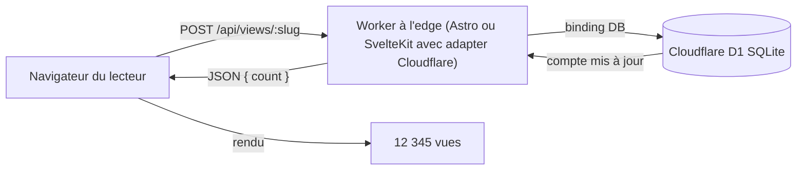

import Aside from "@rgglez/astro-aside";
import DownloadChecklist from "@rgglez/astro-downloadchecklist";

## Introduction

Il fut un temps, avant Google Analytics et avant les tableaux de bord produit, où presque n'importe quel site web affichait fièrement un petit compteur en bas de page : _« Vous êtes le visiteur numéro 12 345 »_. Ces compteurs **à l'ancienne** ne suivaient pas les personnes, ne profilaient pas les audiences et n'envoyaient pas de données à des tiers. Ils comptaient seulement les impressions et affichaient un nombre honnête.

Ce guide décrit comment recréer cette idée pour un blog moderne déployé sur **Cloudflare** : un compteur d'**impressions** ou de **vues** par article, persisté dans une base de données, sans serveur séparé, pratiquement sans coût et sans sacrifier la confidentialité du lecteur.

Le stockage sera <a href="https://developers.cloudflare.com/d1/" target="_blank">**Cloudflare D1**</a>, une base de données **SQLite** managée qui s'exécute à l'edge et se connecte à votre Worker au moyen d'un _binding_. D1 a été choisi à la place de <a href="https://developers.cloudflare.com/kv/" target="_blank">**KV**</a>, car KV ne dispose pas d'incrément atomique ; avec du trafic concurrent, il perdrait donc des comptes. D1 exécute `count = count + 1` de manière atomique dans une seule instruction SQL.

Le guide couvre **deux implémentations** du même modèle :

- **Astro** (plus précisément un blog de type **AstroPaper**) avec l'adapter `@astrojs/cloudflare` et `output: 'server'`.
- **SvelteKit** avec l'adapter `@sveltejs/adapter-cloudflare`, également en SSR.

Dans les deux cas, le résultat possède ces propriétés :

- Le compteur vit dans un endpoint propre au même projet ; il n'y a ni serveur ni déploiement séparé.
- Le site n'a pas besoin de SSR supplémentaire : si vous utilisez déjà un adapter Cloudflare, l'endpoint réutilise ce même Worker.
- L'utilisateur n'est pas suivi, il n'y a pas de cookies tiers ni d'identifiants persistants ; seule une impression est comptée.
- L'incrément est atomique, donc le compteur n'est pas corrompu en cas de concurrence.
- Pour un blog personnel, le coût est effectivement nul.

<Aside type="note" title="Que compte exactement ce compteur ?">

Il compte des **impressions de page**, pas des utilisateurs uniques. C'est volontaire : reproduire le compteur classique, simple et honnête. Plus bas, une variante optionnelle avec déduplication par `localStorage` permet de ne pas compter les rechargements du même visiteur, et une note explique le filtrage des bots. Si vous avez besoin d'analytique d'audience, ce n'est pas le bon composant ; utilisez un outil d'analytique respectueux de la vie privée.

</Aside>

---

## Table des matières

---

## Architecture générale

Le modèle est identique dans les deux frameworks. Seule change la façon dont le framework expose le _binding_ D1 au code de l'endpoint.



Le flux à chaque chargement d'article :

1. La page se rend normalement (statique ou SSR, peu importe).
2. Un petit script côté client envoie `POST /api/views/<slug>` au chargement.
3. L'endpoint, dans le même Worker, exécute un `UPSERT` atomique dans D1 et renvoie le nouveau total.
4. Le script écrit le nombre dans le DOM.

<Aside type="tip" title="Vous n'avez pas besoin d'activer le SSR uniquement pour cela">

Si votre site est entièrement statique, le compteur fonctionne quand même : les **pages** peuvent être statiques et seul l'**endpoint** du compteur est servi dynamiquement. Dans Astro, cela se fait avec `export const prerender = false` dans la route de l'endpoint. Dans SvelteKit, une route `+server.ts` est dynamique par nature. La seule hypothèse de ce guide est que vous déployez sur Cloudflare avec l'un des adapters ; `output: 'server'` global est pratique, mais pas obligatoire.

</Aside>

---

## Prérequis

Utilisez cette checklist avant d'implémenter :

<DownloadChecklist filename="checklist-compteur-visites-cloudflare-d1.csv">
  - [ ] Vous avez un blog déployé sur **Cloudflare Workers** (ou Pages) avec
  Astro + `@astrojs/cloudflare`, ou avec SvelteKit +
  `@sveltejs/adapter-cloudflare`. - [ ] Vous avez installé et authentifié
  **Wrangler** (`npx wrangler login`). - [ ] Votre projet se déploie déjà
  correctement avant d'ajouter le compteur. - [ ] Vous connaissez le **slug** ou
  l'identifiant unique de chaque article, disponible au moment du rendu
  (frontmatter, paramètre de route, etc.). - [ ] Vous acceptez que le compteur
  initial commence à zéro ; il n'y a pas de données historiques à importer (si
  vous en avez, vous pouvez les précharger avec un `INSERT`). - [ ] Vous êtes
  d'accord pour compter des **impressions**, pas des utilisateurs uniques, sauf
  si vous appliquez la déduplication optionnelle décrite plus bas.
</DownloadChecklist>

<Aside type="caution" title="Le slug doit être stable et unique">

Le `slug` est la clé primaire dans D1. Si vous renommez le slug d'un article, le compteur repart de zéro pour cet article (l'ancienne ligne reste orpheline avec l'ancien slug). Utilisez un identifiant qui ne change pas : le slug canonique du billet convient généralement.

</Aside>

<Aside type="tip" title="Vous utilisez Bun ? Remplacez npx par bunx">

Les commandes de ce guide utilisent `npx` (l'exécuteur de Node). Si votre environnement utilise <a href="https://bun.sh/" target="_blank">**Bun**</a>, vous pouvez remplacer `npx` par `bunx` dans n'importe laquelle d'entre elles sans autre changement : par exemple, `bunx wrangler d1 create views` au lieu de `npx wrangler d1 create views`. Les deux téléchargent et exécutent le binaire de Wrangler ; `bunx` est souvent plus rapide pour résoudre le paquet.

</Aside>

---

## Est-ce payant ?

Pour un blog personnel, **non**. Les limites du plan gratuit de Cloudflare sont très supérieures à ce que consomme un compteur de visites :

| Ressource              | Limite du plan gratuit      | Ce que consomme le compteur     |
| ---------------------- | --------------------------- | ------------------------------- |
| Workers / invocations  | 100 000 requêtes/jour       | 1 POST par chargement d'article |
| Lectures de lignes D1  | 5 000 000 lignes lues/jour  | 1 ligne par impression          |
| Écritures de lignes D1 | 100 000 lignes écrites/jour | 1 ligne par impression          |
| Stockage D1            | 5 Go                        | une minuscule ligne par article |

Une seule ligne par article (slug + entier) pèse quelques octets. Même un blog avec des dizaines de milliers de visites quotidiennes reste largement dans le plan gratuit. Si vous le dépassez un jour, le plan payant de D1 facture les lignes lues/écrites et les Go-mois, pour des montants de l'ordre de quelques centimes dans ce cas d'usage.

<Aside type="note" title="Une écriture par impression">

Le design de base écrit dans D1 à **chaque** impression. C'est ce qui garde le compteur temps réel et simple. Si votre trafic était suffisamment élevé pour que les écritures comptent, la bonne mitigation serait la déduplication côté client (moins d'écritures) ou l'agrégation par lots ; les deux sont mentionnées à la fin. Pour un blog typique, ce n'est pas nécessaire.

</Aside>

---

## Créer la base de données D1

Cette étape est **identique** pour Astro et SvelteKit. La table est la même.

Créez la base de données :

```bash
npx wrangler d1 create views
```

Wrangler affiche un bloc contenant le `database_id`. Conservez-le ; vous en aurez besoin dans `wrangler.jsonc`.

Créez la table. Il est préférable de la garder dans un fichier de schéma versionné :

```sql title="schema.sql"
CREATE TABLE IF NOT EXISTS views (
  slug  TEXT PRIMARY KEY,
  count INTEGER NOT NULL DEFAULT 0
);
```

Appliquez-le d'abord à distance (la vraie base utilisée par votre Worker déployé) :

```bash
npx wrangler d1 execute views --remote --file=./schema.sql
```

Et, si vous développez localement avec `wrangler dev`, appliquez-le aussi à la copie locale :

```bash
npx wrangler d1 execute views --local --file=./schema.sql
```

<Aside type="tip" title="Vous avez des compteurs historiques à migrer ?">

Si vous venez d'un autre compteur et voulez conserver les nombres, préchargez les lignes :

```sql
INSERT INTO views (slug, count) VALUES
  ('mon-premier-article', 4821),
  ('autre-article', 1290)
ON CONFLICT(slug) DO UPDATE SET count = excluded.count;
```

</Aside>

---

## Partie 1 : Astro (AstroPaper) en SSR avec l'adapter Cloudflare

Cette partie suppose un blog de type **AstroPaper** avec `output: 'server'` et `adapter: cloudflare()`.

### Déclarer le binding D1 dans wrangler

Ajoutez le binding `DB` à votre `wrangler.jsonc` (avec `assets`, `compatibility_date`, etc.) :

```jsonc title="wrangler.jsonc"
{
  "name": "mon-blog",
  "compatibility_date": "2026-03-06",
  "compatibility_flags": ["nodejs_compat"],
  "assets": {
    "binding": "ASSETS",
    "directory": "./dist",
  },
  // [!code ++]
  "d1_databases": [
    // [!code ++]
    {
      // [!code ++]
      "binding": "DB",
      // [!code ++]
      "database_name": "views",
      // [!code ++]
      "database_id": "COLLEZ-ICI-LE-DATABASE-ID",
      // [!code ++]
    },
    // [!code ++]
  ],
}
```

### Typer le binding pour TypeScript

Dans **Astro 6** (adapter `@astrojs/cloudflare` 13.x), générez les types à partir des bindings déclarés dans `wrangler.jsonc` :

```bash
npx wrangler types
```

Cela crée un `worker-configuration.d.ts` avec l'interface globale `Env` (qui inclut déjà votre `DB`) et les définitions du module `cloudflare:workers`. Le fichier est récupéré par votre `tsconfig.json` via le motif `include` habituel.

<Aside type="tip" title="Régénérez les types quand les bindings changent">

Relancez `npx wrangler types` chaque fois que vous modifiez les bindings dans `wrangler.jsonc` (ajout d'une base D1, d'un KV, d'un secret, etc.). Sinon, `worker-configuration.d.ts` devient obsolète et TypeScript signalera des erreurs ou ne verra pas les nouveaux bindings.

</Aside>

<Aside type="caution" title="Changement cassant dans Astro 6 : adieu Astro.locals.runtime.env">

Si vous venez de guides ou de projets plus anciens, vous vous souvenez peut-être du motif `Astro.locals.runtime.env.DB` avec un `env.d.ts` déclarant `interface Locals extends Runtime<Env>`. **Dans Astro 6, il a été supprimé** : `Astro.locals.runtime.env` n'existe plus et provoque une erreur à l'exécution. L'accès aux bindings se fait maintenant en important `env` depuis le module `cloudflare:workers`, comme le montre l'endpoint ci-dessous. Autres équivalents : `Astro.request.cf` (anciennement `runtime.cf`), le global `caches` (anciennement `runtime.caches`) et `Astro.locals.cfContext` (anciennement `runtime.ctx`).

</Aside>

### L'endpoint du compteur

Créez `src/pages/api/views/[slug].ts`. Un seul `POST` incrémente et renvoie le total :

```ts title="src/pages/api/views/[slug].ts"
import type { APIRoute } from "astro";
import { env } from "cloudflare:workers";

// Le site peut être statique ; cet endpoint doit être dynamique.
export const prerender = false;

export const POST: APIRoute = async ({ params }) => {
  const slug = params.slug;
  if (!slug) {
    return new Response("Slug manquant", { status: 400 });
  }

  const db = env.DB;

  // UPSERT atomique : insère avec 1, ou ajoute 1 si la ligne existe déjà.
  await db
    .prepare(
      "INSERT INTO views (slug, count) VALUES (?, 1) " +
        "ON CONFLICT(slug) DO UPDATE SET count = count + 1"
    )
    .bind(slug)
    .run();

  const row = await db
    .prepare("SELECT count FROM views WHERE slug = ?")
    .bind(slug)
    .first<{ count: number }>();

  return Response.json({ count: row?.count ?? 0 });
};

// Optionnel : lire sans incrémenter (p. ex. pour une page de statistiques).
export const GET: APIRoute = async ({ params }) => {
  const slug = params.slug;
  if (!slug) return new Response("Slug manquant", { status: 400 });

  const row = await env.DB.prepare("SELECT count FROM views WHERE slug = ?")
    .bind(slug)
    .first<{ count: number }>();

  return Response.json({ count: row?.count ?? 0 });
};
```

### Le composant visuel

Créez un composant réutilisable `src/components/ViewCounter.astro` qui reçoit le slug et affiche le nombre :

```astro title="src/components/ViewCounter.astro"
---
interface Props {
  slug: string;
}
const { slug } = Astro.props;
---

<span class="view-counter" aria-live="polite">
  <span id="view-count" data-slug={slug}>…</span> vues
</span>

<script>
  function loadViewCount() {
    const el = document.getElementById("view-count");
    if (!el) return;
    const slug = el.dataset.slug;
    fetch(`/api/views/${slug}`, { method: "POST" })
      .then(r => r.json() as Promise<{ count: number }>)
      .then(d => {
        el.textContent = new Intl.NumberFormat().format(d.count);
      })
      .catch(() => {
        el.textContent = "—";
      });
  }
  // astro:page-load s'exécute au chargement initial et après chaque navigation ClientRouter.
  document.addEventListener("astro:page-load", loadViewCount);
</script>
```

<Aside type="caution" title="Si vous utilisez View Transitions (ClientRouter), écoutez astro:page-load">

Les blocs `<script>` de module Astro ne s'exécutent **qu'une seule fois** lors du chargement complet de la page. Si votre site utilise le <a href="https://docs.astro.build/en/guides/view-transitions/" target="_blank">`ClientRouter`</a> (View Transitions), naviguer entre articles remplace le DOM sans rechargement et le script **ne s'exécute pas de nouveau** : le compteur reste sur `…` jusqu'à un rechargement manuel (F5). La solution consiste à envelopper la logique dans une fonction et à la déclencher avec l'événement `astro:page-load`, émis à la fois au chargement initial et après chaque navigation. Cherchez de nouveau l'élément à l'intérieur de la fonction, car l'ancien nœud n'existe plus après le _swap_. Si votre site **n'utilise pas** View Transitions, il suffit d'appeler directement `loadViewCount()`.

</Aside>

Utilisez-le dans le layout de l'article (dans AstroPaper, typiquement `src/layouts/PostDetails.astro` ou équivalent), en lui passant le slug du billet :

```astro
---
import ViewCounter from "@/components/ViewCounter.astro";
// `post` est l'entrée de l'article dans votre layout.
---

<ViewCounter slug={post.id} />
```

<Aside type="caution" title="Quel slug passer dans AstroPaper">

Selon la version d'AstroPaper et de l'API de collections d'Astro, l'identifiant du billet peut se trouver dans `post.id`, `post.slug` ou être dérivé de la route. Utilisez la même valeur que celle employée pour construire l'URL de l'article, afin que le slug soit cohérent entre l'URL publique et la clé D1.

</Aside>

---

## Partie 2 : SvelteKit avec l'adapter Cloudflare en SSR

Le modèle est le même ; la mécanique du framework change. SvelteKit expose les bindings Cloudflare via `event.platform.env`.

### Adapter et binding

Assurez-vous d'utiliser `@sveltejs/adapter-cloudflare` dans `svelte.config.js` :

```js title="svelte.config.js"
import adapter from "@sveltejs/adapter-cloudflare";
import { vitePreprocess } from "@sveltejs/vite-plugin-svelte";

export default {
  preprocess: vitePreprocess(),
  kit: {
    adapter: adapter(),
  },
};
```

Déclarez le binding `DB` comme précédemment, dans `wrangler.jsonc` :

```jsonc title="wrangler.jsonc"
{
  "name": "mon-blog-sveltekit",
  "compatibility_date": "2026-03-06",
  "compatibility_flags": ["nodejs_compat"],
  "d1_databases": [
    {
      "binding": "DB",
      "database_name": "views",
      "database_id": "COLLEZ-ICI-LE-DATABASE-ID",
    },
  ],
}
```

### Typer la plateforme

Dans SvelteKit, les bindings vivent dans `App.Platform`. Déclarez-les dans `src/app.d.ts` :

```ts title="src/app.d.ts"
declare global {
  namespace App {
    interface Platform {
      env: {
        DB: D1Database;
      };
    }
  }
}

export {};
```

<Aside type="note" title="platform est undefined dans certains contextes">

`event.platform` n'est disponible que lorsque le code s'exécute dans le runtime Cloudflare (déploiement ou `wrangler dev` / `vite dev` avec l'adapter configuré). C'est pourquoi l'endpoint valide son existence avant de l'utiliser. Dans un `vite dev` pur sans émulation de plateforme, `platform` peut être `undefined`.

</Aside>

### L'endpoint du compteur

Créez `src/routes/api/views/[slug]/+server.ts` :

```ts title="src/routes/api/views/[slug]/+server.ts"
import { json, error } from "@sveltejs/kit";
import type { RequestHandler } from "./$types";

export const POST: RequestHandler = async ({ params, platform }) => {
  const db = platform?.env.DB;
  if (!db) throw error(500, "Binding D1 non disponible");

  const slug = params.slug;

  await db
    .prepare(
      "INSERT INTO views (slug, count) VALUES (?, 1) " +
        "ON CONFLICT(slug) DO UPDATE SET count = count + 1"
    )
    .bind(slug)
    .run();

  const row = await db
    .prepare("SELECT count FROM views WHERE slug = ?")
    .bind(slug)
    .first<{ count: number }>();

  return json({ count: row?.count ?? 0 });
};

export const GET: RequestHandler = async ({ params, platform }) => {
  const db = platform?.env.DB;
  if (!db) throw error(500, "Binding D1 non disponible");

  const row = await db
    .prepare("SELECT count FROM views WHERE slug = ?")
    .bind(params.slug)
    .first<{ count: number }>();

  return json({ count: row?.count ?? 0 });
};
```

### Le composant visuel

Créez `src/lib/components/ViewCounter.svelte` :

```svelte title="src/lib/components/ViewCounter.svelte"
<script lang="ts">
  import { onMount } from "svelte";

  export let slug: string;

  let count: number | null = null;

  onMount(async () => {
    try {
      const r = await fetch(`/api/views/${slug}`, { method: "POST" });
      const d = (await r.json()) as { count: number };
      count = d.count;
    } catch {
      count = null;
    }
  });
</script>

<span aria-live="polite">
  {count === null ? "—" : new Intl.NumberFormat().format(count)} vues
</span>
```

Utilisez-le dans la page de l'article (`src/routes/blog/[slug]/+page.svelte` ou là où vous rendez le billet) :

```svelte
<script lang="ts">
  import ViewCounter from "$lib/components/ViewCounter.svelte";
  export let data; // vient de votre +page.ts / load
</script>

<ViewCounter slug={data.post.slug} />
```

<Aside type="tip" title="Svelte 5 avec runes">

Le composant utilise la syntaxe classique `export let` / `onMount` pour une large compatibilité. Si vous utilisez Svelte 5 avec runes, vous pouvez le réécrire avec `$props()` et `$state()`, mais la logique du fetch est identique.

</Aside>

---

## Personnalisation graphique optionnelle

Le nombre honnête suffit déjà, mais une partie du charme des compteurs à l'ancienne venait de leur apparence : chiffres blancs sur fond noir, style affichage LED ou compteur mécanique. Il existe deux chemins pour l'obtenir.

<Aside type="tip" title="Recommandation : utilisez CSS, pas des images">

Dans presque tous les cas, **CSS est la meilleure option**. Le nombre reste du vrai texte : il s'affiche nettement sur n'importe quel écran, reste accessible aux lecteurs d'écran, peut être sélectionné et copié, n'ajoute pas de requêtes HTTP et ne nécessite aucun sprite à précharger ou maintenir. Réservez les images de chiffres uniquement si vous recherchez un style pixel-art très spécifique que CSS ne peut pas reproduire.

</Aside>

### Option A (recommandée) : style LED avec CSS

Donnez au compteur une apparence d'afficheur numérique avec une police monospace, un fond sombre et une légère lueur. Le composant ne change pas : ajoutez seulement des styles. Sur le `<span class="view-counter">` du composant Astro (ou le `<span>` du composant Svelte), ajoutez :

```css title="styles du compteur (LED)"
.view-counter {
  display: inline-flex;
  align-items: center;
  gap: 0.35em;
  font-family: "Courier New", ui-monospace, monospace;
  font-weight: 700;
  letter-spacing: 0.08em;
  padding: 0.15em 0.5em;
  border-radius: 0.25em;
  background: #000;
  color: #00ff6a; /* vert phosphore classique */
  text-shadow: 0 0 6px #00ff6a; /* lueur LED */
}
```

Pour le classique **blanc sur noir** de l'annexe, remplacez par `color: #fff` et supprimez ou ajustez le `text-shadow`.

### Option A+ : chaque chiffre dans sa propre « case »

Le rendu de compteur mécanique (chaque chiffre dans son propre rectangle noir) nécessite d'envelopper chaque chiffre dans son propre élément. Modifiez le rendu pour construire un `<span>` par chiffre au lieu d'écrire le nombre brut. Dans le composant Astro :

```ts title="script du composant, rendu par chiffres"
fetch(`/api/views/${slug}`, { method: "POST" })
  .then(r => r.json() as Promise<{ count: number }>)
  .then(d => {
    const digits = new Intl.NumberFormat().format(d.count);
    el.textContent = "";
    for (const ch of digits) {
      const span = document.createElement("span");
      span.className = /\d/.test(ch) ? "digit" : "sep";
      span.textContent = ch;
      el.appendChild(span);
    }
  });
```

Avec son CSS :

```css title="cases par chiffre"
.view-counter :global(.digit) {
  display: inline-block;
  min-width: 1ch;
  padding: 0.1em 0.25em;
  margin: 0 1px;
  text-align: center;
  background: #111;
  color: #fff;
  border-radius: 3px;
  box-shadow: inset 0 0 0 1px #333;
}
.view-counter :global(.sep) {
  /* séparateur des milliers */
  padding: 0 0.1em;
  color: #888;
}
```

<Aside type="caution" title="Dans Astro, les styles sont scopés : utilisez :global pour les chiffres">

Les blocs `<style>` d'un composant Astro sont **scopés** par défaut : Astro ajoute un attribut hash seulement aux éléments présents dans le _template_. Comme les cases `.digit` et `.sep` sont créées par JavaScript avec `document.createElement`, elles **ne** reçoivent pas ce hash et le CSS scopé ne s'applique pas (vous verriez le nombre, mais sans les cases). C'est pourquoi les sélecteurs des enfants générés dynamiquement sont enveloppés dans `:global(...)`, tandis que le conteneur `.view-counter` —présent dans le template— reste scopé. La même chose s'applique à `.digit-img` dans l'Option B. Si vous utilisez plutôt du CSS global (une feuille de styles du site, pas un `<style>` de composant), cela ne vous affecte pas.

</Aside>

<Aside type="note" title="Détail d'accessibilité">

Même si vous divisez le nombre en cases, il reste du texte : un lecteur d'écran le lira comme un tout si vous conservez le `aria-live="polite"` du composant. Pour éviter qu'il l'épelle chiffre par chiffre, vous pouvez envelopper le groupe et exposer la valeur complète avec un `aria-label` sur le conteneur.

</Aside>

### Option B : images pour les chiffres (la méthode rétro)

C'est la méthode originale des années 1990 : une image par chiffre (`0.gif` … `9.gif`), ou un seul _sprite_ avec les dix chiffres, et le nombre est composé en plaçant l'image correcte pour chaque chiffre. Elle reproduit un pixel-art exact que CSS ne peut pas toujours imiter, mais avec des contreparties :

- Chaque chiffre est une image : il ne s'adapte pas nettement aux écrans haute densité sauf si vous préparez des versions @2x.
- Le nombre cesse d'être du texte sélectionnable ; vous devez fournir un `alt`/`aria-label` avec la valeur pour préserver l'accessibilité.
- Cela ajoute des requêtes HTTP ainsi que des sprites à maintenir et précharger.

Si vous le voulez quand même pour l'esthétique, le rendu place une balise `` par chiffre :

```ts title="script du composant, chiffres comme images"
fetch(`/api/views/${slug}`, { method: "POST" })
  .then(r => r.json() as Promise<{ count: number }>)
  .then(d => {
    const n = String(d.count); // sans séparateurs, plus simple
    el.textContent = "";
    el.setAttribute("aria-label", `${n} vues`);
    for (const ch of n) {
      const img = document.createElement("img");
      img.src = `/counter/${ch}.gif`; // 0.gif … 9.gif dans /public/counter/
      img.alt = ""; // décoratif ; aria-label porte la valeur
      img.className = "digit-img";
      el.appendChild(img);
    }
  });
```

```css title="images de chiffres"
.view-counter :global(.digit-img) {
  height: 1.2em;
  width: auto;
  image-rendering: pixelated; /* conserve les bords pixel-art lors du redimensionnement */
  vertical-align: middle;
}
```

Placez vos fichiers `0.gif`…`9.gif` dans `public/counter/` (Astro) ou `static/counter/` (SvelteKit) afin qu'ils soient servis comme assets statiques.

<Aside type="caution" title="Bords nets vs. poids">

`image-rendering: pixelated` évite le flou lors du redimensionnement du pixel-art, mais ne transforme pas une petite image en vraie haute résolution. Si la netteté sur écrans retina compte, exportez les chiffres au double de la taille et affichez-les à moitié. À ce stade, CSS donne généralement un meilleur résultat avec moins de travail.

</Aside>

---

## Variante optionnelle : ne pas compter les rechargements du même visiteur

Le design de base compte **chaque** impression, rechargements inclus. Pour vous rapprocher des « vues » sans suivre l'utilisateur, marquez dans `localStorage` que ce navigateur a déjà compté cet article. C'est une déduplication purement locale : pas de cookies, pas d'identifiants, pas de données envoyées à des tiers.

Remplacez l'appel `fetch` par :

```js
const key = `viewed:${slug}`;
if (!localStorage.getItem(key)) {
  localStorage.setItem(key, "1");
  fetch(`/api/views/${slug}`, { method: "POST" })
    .then(r => r.json())
    .then(d => {
      /* afficher d.count */
    });
} else {
  // Déjà compté auparavant : lire seulement le total sans incrémenter.
  fetch(`/api/views/${slug}`)
    .then(r => r.json())
    .then(d => {
      /* afficher d.count */
    });
}
```

<Aside type="caution" title="localStorage n'est pas infaillible">

`localStorage` est effacé avec les données du navigateur, n'est pas partagé entre appareils et n'existe pas pour certains bots. Ce n'est pas un comptage d'utilisateurs uniques rigoureux ; c'est une amélioration peu coûteuse pour éviter de gonfler le nombre avec des rechargements. Pour l'esprit « à l'ancienne », c'est largement suffisant.

</Aside>

---

## Durcissement de base

Quelques mesures optionnelles, par ordre d'utilité réelle pour un blog :

- **Filtrer les bots évidents.** Comme le compteur est déclenché par JavaScript côté client, la plupart des crawlers simples ne l'activent déjà pas (ils n'exécutent pas le script). Pour ceux qui le font, vous pouvez inspecter le `User-Agent` dans l'endpoint et ignorer l'incrément pour des motifs de bots connus. N'attendez pas la perfection.
- **Valider le slug.** Acceptez seulement les slugs qui existent réellement, afin que personne ne gonfle des lignes inutiles avec `POST /api/views/nimporte-quoi`. Si vous avez une liste de slugs publiés, rejetez les demandes absentes de cette liste ; ou restreignez le format avec une expression régulière simple.
- **Rate limiting.** Pour les abus délibérés, Cloudflare propose des <a href="https://developers.cloudflare.com/waf/rate-limiting-rules/" target="_blank">règles de rate limiting</a> à l'edge sur la route `/api/views/*`, sans toucher à votre code.
- **Réduire les écritures à grande échelle.** Si le volume le justifie un jour, dédupliquez par client (section précédente) ou accumulez les incréments en mémoire/KV et videz-les dans D1 par lots. C'est une optimisation prématurée pour presque tout blog ; ne la faites pas avant que les mesures montrent qu'elle est nécessaire.

---

## Troubleshooting

**Le nombre apparaît comme « — » ou ne change pas.**
Ouvrez la console du navigateur et l'onglet réseau. Vérifiez que `POST /api/views/<slug>` répond `200` avec `{ "count": N }`. Un `500` signifie généralement que le binding `DB` n'est pas arrivé jusqu'à l'endpoint.

**`env.DB is undefined` (Astro) ou `platform is undefined` (SvelteKit).**
Le binding n'est pas connecté. Vérifiez que `d1_databases` se trouve dans `wrangler.jsonc` avec le bon `database_id`, que le nom du `binding` correspond à celui utilisé dans le code (`DB`), que vous avez redéployé et —en développement— que vous exécutez avec l'adapter Cloudflare (pas un `dev` sans émulation de plateforme).

**`La propriété 'runtime' n'existe pas sur le type 'Locals'` (Astro).**
Vous utilisez l'ancien motif `Astro.locals.runtime.env`, supprimé dans Astro 6. Importez `env` depuis `cloudflare:workers` (voir l'endpoint) et générez les types avec `npx wrangler types`.

**`no such table: views`.**
Vous n'avez pas appliqué le schéma dans l'environnement que vous interrogez. Rappelez-vous que `--local` et `--remote` sont des bases différentes : exécutez le `schema.sql` dans les deux selon le cas.

**Cela fonctionne en local mais pas en production (ou l'inverse).**
C'est presque toujours le même problème `--local` vs `--remote`. La base locale de `wrangler dev` n'est pas la base utilisée par votre Worker déployé.

**Le compteur augmente de deux en deux.**
En développement, le _Strict Mode_ de React (si vous l'utilisez dans des îlots Astro) ou un double montage peuvent déclencher deux `fetch`. En production, cela ne se produit pas ; si cela vous gêne en dev, utilisez la variante avec `localStorage`.

---

## Conclusion

Recréer le compteur de visites à l'ancienne sur Cloudflare est étonnamment direct : une table D1 avec une ligne par article, un endpoint qui fait un `UPSERT` atomique et un script client d'une dizaine de lignes. Il ne faut pas de serveur séparé, il ne faut pas activer le SSR uniquement pour cela, et le coût est nul en pratique.

Le même modèle fonctionne pour **Astro** et **SvelteKit** ; la seule chose qui change est la manière dont chaque framework vous fournit le binding D1 : `import { env } from "cloudflare:workers"` dans Astro 6, `platform.env` dans SvelteKit. La logique de base de données —l'instruction SQL, l'incrément atomique, la lecture du total— est exactement la même dans les deux.

Et, fidèle à l'esprit original, le compteur compte les impressions honnêtement sans suivre personne : un simple nombre au pied de l'article, comme autrefois.

## Annexe : permissions du token API Cloudflare

Les opérations de **ce** guide —créer la base de données D1 et appliquer le schéma avec Wrangler— ne touchent que **D1**. Elles n'ont pas besoin de permissions Workers, DNS ni du reste du compte.

Si vous utilisez `wrangler login` (flux OAuth interactif), Wrangler obtient les permissions pour vous et vous **n'avez pas besoin de créer un token**. Cette annexe s'applique lorsque vous préférez un **token API explicite**, par exemple pour exécuter Wrangler dans un environnement non interactif ou avec des identifiants limités.

### Permission minimale nécessaire

L'opération est similaire à celle décrite dans <a href="https://rodolfo.gg/fr/posts/2026/04/deployer-sveltekit-cloudflare-workers/" target="_blank">cet article</a> sur le déploiement de SvelteKit sur Cloudflare.

Pour D1, la permission minimale est :

| Opération du guide                        | Commande                                                 | Permission requise      |
| ----------------------------------------- | -------------------------------------------------------- | ----------------------- |
| Créer la base de données                  | `wrangler d1 create views`                               | **Account → D1 → Edit** |
| Appliquer le schéma (distant)             | `wrangler d1 execute views --remote --file=./schema.sql` | **Account → D1 → Edit** |
| Précharger/consulter des lignes (distant) | `wrangler d1 execute ... --command "..."`                | **Account → D1 → Edit** |

Cela suffit. `Edit` inclut la lecture et l'écriture sur D1 ; vous n'avez pas besoin d'une permission de lecture séparée. Les opérations `--local` ne touchent pas l'API Cloudflare (elles s'exécutent contre une copie locale sur disque), donc elles ne consomment aucune permission du token.


### Créer le token

1. Allez dans <a href="https://dash.cloudflare.com/profile/api-tokens" target="_blank">**My Profile → API Tokens**</a> et choisissez **Create Token → Create Custom Token**.
2. Dans **Permissions**, ajoutez une ligne : `Account` · `D1` · `Edit`.
3. Dans **Account Resources**, sélectionnez **Include → votre compte** (pas « All accounts »).
4. Optionnel mais recommandé : définissez un **TTL** (date d'expiration) et, si votre réseau est fixe, limitez par **Client IP Address Filtering**.
5. Créez le token et **copiez-le une seule fois** ; Cloudflare ne l'affichera plus.

### Utiliser le token avec Wrangler

Wrangler lit le token depuis la variable d'environnement `CLOUDFLARE_API_TOKEN`. Pour les commandes D1, il est aussi utile de fixer `CLOUDFLARE_ACCOUNT_ID` (visible dans le tableau de bord de votre compte) :

```bash
export CLOUDFLARE_API_TOKEN="votre-token-limite-a-D1-Edit"
export CLOUDFLARE_ACCOUNT_ID="votre-account-id"

npx wrangler d1 create views
npx wrangler d1 execute views --remote --file=./schema.sql
```

<Aside type="caution" title="Moindre privilège et gestion du token">

Donnez au token seulement `D1 → Edit` et limitez-le à votre compte ; ainsi, même s'il fuit, il ne permet pas de toucher Workers, DNS ni d'autres ressources. Ne l'écrivez pas dans le dépôt ni dans `wrangler.jsonc` : passez-le par variable d'environnement ou par le _secret store_ de votre environnement (en CI, comme _secret_ du pipeline). Si vous soupçonnez une exposition, **révoquez-le** depuis le même panneau API Tokens et générez-en un nouveau.

</Aside>

<Aside type="note" title="Le token de déploiement est un autre sujet">

Le token (ou l'intégration) qui déploie le blog depuis GitHub nécessite des permissions différentes (typiquement Workers/Pages) et n'est pas couvert ici. Les garder **séparés** —un token pour D1, un autre pour le déploiement— est précisément l'avantage du moindre privilège.

</Aside>

---

## Références

- Cloudflare. (2026). _D1: Cloudflare's native serverless SQL database_. Cloudflare Docs. <a href="https://developers.cloudflare.com/d1/" target="_blank" rel="noopener noreferrer">https://developers.cloudflare.com/d1/</a>
- Cloudflare. (2026). _D1 Workers Binding API (prepare, bind, run, first)_. Cloudflare Docs. <a href="https://developers.cloudflare.com/d1/worker-api/" target="_blank" rel="noopener noreferrer">https://developers.cloudflare.com/d1/worker-api/</a>
- Cloudflare. (2026). _Wrangler commands: d1 create / d1 execute_. Cloudflare Docs. <a href="https://developers.cloudflare.com/workers/wrangler/commands/#d1" target="_blank" rel="noopener noreferrer">https://developers.cloudflare.com/workers/wrangler/commands/#d1</a>
- Cloudflare. (2026). _Create API token and token permissions_. Cloudflare Docs. <a href="https://developers.cloudflare.com/fundamentals/api/get-started/create-token/" target="_blank" rel="noopener noreferrer">https://developers.cloudflare.com/fundamentals/api/get-started/create-token/</a>
- Cloudflare. (2026). _Pricing: Workers & D1 free tier limits_. Cloudflare Docs. <a href="https://developers.cloudflare.com/d1/platform/pricing/" target="_blank" rel="noopener noreferrer">https://developers.cloudflare.com/d1/platform/pricing/</a>
- Astro. (2026). _Cloudflare adapter (@astrojs/cloudflare): accessing the runtime_. Astro Docs. <a href="https://docs.astro.build/en/guides/integrations-guide/cloudflare/" target="_blank" rel="noopener noreferrer">https://docs.astro.build/en/guides/integrations-guide/cloudflare/</a>
- Astro. (2026). _Endpoints and on-demand rendering (prerender)_. Astro Docs. <a href="https://docs.astro.build/en/guides/endpoints/" target="_blank" rel="noopener noreferrer">https://docs.astro.build/en/guides/endpoints/</a>
- SvelteKit. (2026). _adapter-cloudflare and platform.env bindings_. Svelte Docs. <a href="https://svelte.dev/docs/kit/adapter-cloudflare" target="_blank" rel="noopener noreferrer">https://svelte.dev/docs/kit/adapter-cloudflare</a>
- SvelteKit. (2026). _Server routes (+server.js)_. Svelte Docs. <a href="https://svelte.dev/docs/kit/routing#server" target="_blank" rel="noopener noreferrer">https://svelte.dev/docs/kit/routing#server</a>
- SQLite. (2026). _UPSERT (ON CONFLICT ... DO UPDATE)_. SQLite Documentation. <a href="https://www.sqlite.org/lang_upsert.html" target="_blank" rel="noopener noreferrer">https://www.sqlite.org/lang_upsert.html</a>
