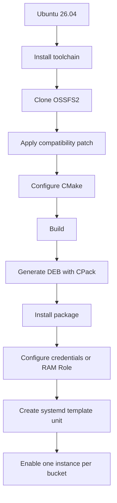
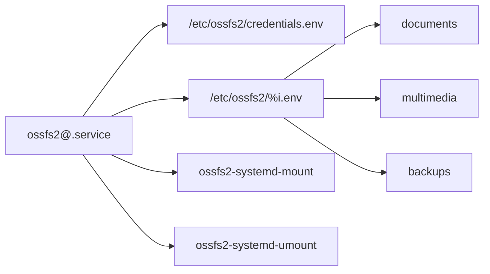

import Aside from "@rgglez/astro-aside";

## Introduction

OSSFS2 is Alibaba Cloud's high-performance client for mounting Aliyun Object Storage Service (OSS) buckets as a local filesystem through FUSE. This guide covers the complete procedure on Ubuntu 26.04: building from source, adapting it to a modern toolchain, creating a `.deb` package with CPack, and managing several mounts through a systemd template unit.

<Aside type="warning">

The official repository states that OSSFS2 is tested with GCC 9 through GCC 13. Ubuntu 26.04 ships a more recent version of GCC and of `libstdc++`. The patch presented here is a local compatibility adaptation so that OSSFS2 can be built; it is not an official upstream fix. Keep a record of the commit and of the applied patch for future updates.

</Aside>

<Aside type="warning">

OSSFS2 does not offer full POSIX semantics. It must not be used as a drop-in replacement for a local disk for databases, complex locking, atomic renames, or uncoordinated concurrent writes to the same object.

</Aside>



## 1. Install dependencies

```bash
# Update the local package index.
sudo apt update

# Install the compiler, CMake, Git, patch, FUSE 3 and Debian tools.
sudo apt install \
  build-essential \
  cmake \
  git \
  patch \
  pkg-config \
  libfuse3-dev \
  libaio-dev \
  libssl-dev \
  dpkg-dev \
  fakeroot
```

- `sudo` runs the command with administrative privileges.
- `apt update` refreshes the repository indexes.
- `apt install` installs the listed packages.
- `build-essential` provides GCC, G++, Make and basic headers.
- `cmake` generates the build system.
- `git` downloads the repository.
- `patch` applies unified diffs.
- `pkg-config` locates libraries.
- `libfuse3-dev`, `libaio-dev` and `libssl-dev` provide development headers.
- `dpkg-dev` and `fakeroot` are used to work with Debian packages.
- The backslash `\` continues the command on the following line.

Check the tools:

```bash
# Show the C++ compiler version.
c++ --version

# Show the CMake version.
cmake --version

# Locate the static standard library required by the project.
g++ -print-file-name=libstdc++.a
```

- `--version` requests the version.
- `-print-file-name=libstdc++.a` makes G++ resolve the path to the static standard library according to its own configuration.

## 2. Download the source tree

```bash
# Create an administrative directory for local sources.
sudo install -d -m 0755 -o root -g root /usr/local/src

# Enter the sources directory.
cd /usr/local/src

# Clone the official repository into the ossfs subdirectory.
sudo git clone https://github.com/aliyun/ossfs.git ossfs

# Hand the tree over to the current administrative user.
sudo chown -R "$USER":"$(id -gn)" /usr/local/src/ossfs

# Enter the repository.
cd /usr/local/src/ossfs

# Record the exact commit that will be built.
git rev-parse HEAD
```

- In `install`:
  - `-d` creates a directory.
  - `-m 0755` sets the permissions.
  - `-o root` defines the owner.
  - `-g root` defines the group.
- `git clone` takes the URL and the local name.
- `chown -R` changes the owner and the group recursively.
- `$USER` holds the current user.
- `$(id -gn)` obtains their primary group.
- `git rev-parse HEAD` prints the hash of the selected commit.

## 3. Why the patch is needed

With the modern toolchain, errors such as these may appear:

```text
error: ‘uint64_t’ does not name a type
error: ‘sort’ is not a member of ‘std’
error: no matching function for call to ‘min(<brace-enclosed initializer list>)’
```

The observed causes are missing transitive inclusions:

- PhotonLibOS uses `uint64_t` without explicitly including `<cstdint>`;
- some OSSFS2 files use `std::sort` and the initializer-list overload of `std::min` without including `<algorithm>`;
- earlier toolchains accidentally exposed those symbols through other headers;
- the recent standard library no longer guarantees those indirect inclusions.

## 4. And now, the patch

```bash
# Create a directory for local adaptations.
sudo install -d -m 0755 -o root -g root /usr/local/src/patches

# Hand the directory over to the current user.
sudo chown "$USER":"$(id -gn)" /usr/local/src/patches

# Open the patch file with the configured editor.
${EDITOR:-nano} /usr/local/src/patches/ossfs-ubuntu2604-compat.patch
```

- `install -d` creates the directory.
- `chown` changes the owner and the group.
- `${EDITOR:-nano}` uses the `EDITOR` variable, or `nano` as a fallback value.

Full contents:

```diff title="/usr/local/src/patches/ossfs-ubuntu2604-compat.patch"
# /usr/local/src/patches/ossfs-ubuntu2604-compat.patch
diff --git a/CMakeLists.txt b/CMakeLists.txt
--- a/CMakeLists.txt
+++ b/CMakeLists.txt
@@ -168,6 +168,14 @@

 add_library(ossfs2_common STATIC ${ossfs2_common_srcs})

+# PhotonLibOS and some ossfs2 sources rely on transitive inclusion of
+# standard headers. Preserve each "-include <header>" option as an
+# indivisible shell group so CMake's option de-duplication does not
+# separate the option from its argument.
+target_compile_options(ossfs2_common PRIVATE
+  "$<$<COMPILE_LANGUAGE:CXX>:SHELL:-include cstdint>"
+  "$<$<COMPILE_LANGUAGE:CXX>:SHELL:-include algorithm>")
+
 target_sources(ossfs2_common PRIVATE
   ${PHOTON_PATCHED_SRC_DIR}/ecosystem/oss_patched.cpp
 )
@@ -182,6 +190,11 @@
   src/*.cpp)

 add_executable(ossfs2 ${ossfs2_srcs})
+
+# The executable sources also include PhotonLibOS public headers directly.
+target_compile_options(ossfs2 PRIVATE
+  "$<$<COMPILE_LANGUAGE:CXX>:SHELL:-include cstdint>"
+  "$<$<COMPILE_LANGUAGE:CXX>:SHELL:-include algorithm>")

 # we will install libfuse to /usr/local/lib64/ossfs2, make sure ossfs2
 # can find it instead of using the system one
```

`target_compile_options` applies options to the given target; `PRIVATE` prevents them from propagating to its consumers, and `$<COMPILE_LANGUAGE:CXX>` restricts them to C++. CMake's `SHELL:` prefix keeps each `-include` grouped with its header during de-duplication; it does not select or run a command interpreter.

## 5. Verify and apply the patch with `patch`

```bash
# Enter the original tree.
cd /usr/local/src/ossfs

# Check that the tree has no local changes.
git status --short

# Simulate the application without modifying files.
patch --dry-run -p1 \
  < /usr/local/src/patches/ossfs-ubuntu2604-compat.patch

# Apply the actual patch.
patch -p1 \
  < /usr/local/src/patches/ossfs-ubuntu2604-compat.patch

# Show the change that was made.
git diff -- CMakeLists.txt
```

- `git status --short` shows a compact status.
- `patch --dry-run` simulates the application.
- `-p1` strips the first path component from paths such as `a/CMakeLists.txt`.
- `<` redirects the patch to standard input.
- `git diff -- CMakeLists.txt` limits the comparison to that file.

To revert it:

```bash
# Reverse the applied patch.
patch -R -p1 \
  < /usr/local/src/patches/ossfs-ubuntu2604-compat.patch
```

- `-R` applies the patch in reverse.

## 6. Configure CMake 4

CMake 4 removed compatibility with policies older than CMake 3.5. The `gflags 2.2.2` dependency declares an old version. The `CMAKE_POLICY_VERSION_MINIMUM=3.5` variable makes it possible to configure the subproject without modifying its source.

```bash
# Enter the repository.
cd /usr/local/src/ossfs

# Remove any previous binary tree.
rm -rf build

# Export the policy minimum for CMake and external subprocesses.
export CMAKE_POLICY_VERSION_MINIMUM=3.5

# Configure sources, output, Release type and DEB generator.
cmake \
  -S . \
  -B build \
  -DCMAKE_BUILD_TYPE=Release \
  -DCPACK_GENERATOR=DEB \
  -DCMAKE_EXPORT_COMPILE_COMMANDS=ON
```

- `rm -rf` deletes recursively without asking for confirmation.
- `export` propagates the variable to child processes, including the CMake processes run while building external dependencies.
- `-S .` selects the source tree.
- `-B build` selects the binary tree.
- `-DCMAKE_BUILD_TYPE=Release` enables optimization.
- `-DCPACK_GENERATOR=DEB` makes the Debian branches of `CMakeLists.txt` be evaluated during configuration.
- `-DCMAKE_EXPORT_COMPILE_COMMANDS=ON` generates `compile_commands.json`.

<Aside type="warning">

Keep `CMAKE_POLICY_VERSION_MINIMUM=3.5` during the build as well, because external dependencies may spawn new CMake processes from `cmake --build`.

</Aside>

## 7. Build

```bash
# Reassert the variable for the current session.
export CMAKE_POLICY_VERSION_MINIMUM=3.5

# Build using every available logical processor.
cmake --build build --parallel "$(nproc)"
```

- `cmake --build build` runs the generated build system.
- `--parallel` enables parallelism.
- `$(nproc)` substitutes the number of logical processors.

Check the binary:

```bash
# Identify the format and architecture of the executable.
file build/ossfs2

# Show the version without installing it.
build/ossfs2 --version
```

- `file` inspects the executable.
- `--version` shows the OSSFS2 version.

## 8. Generate a DEB package with CPack

I normally create installation packages with `checkinstall`, but the project already contains install rules and CPack configuration. That makes CPack more reproducible than `checkinstall` here.

```bash
# Enter the build tree.
cd /usr/local/src/ossfs/build

# Check that the Debian variables ended up in CPackConfig.cmake.
grep -E \
  'CPACK_GENERATOR|CPACK_DEBIAN_PACKAGE_MAINTAINER|CPACK_DEBIAN_PACKAGE_DEPENDS' \
  CPackConfig.cmake

# Generate only the main component in DEB format.
cpack \
  -G DEB \
  -C Release \
  -D CPACK_COMPONENTS_ALL=main
```

- `grep -E` uses extended regular expressions.
- In the regular expression, `|` represents alternatives.
- In `cpack`:
  - `-G DEB` selects the Debian generator.
  - `-C Release` selects the Release configuration.
  - `-D CPACK_COMPONENTS_ALL=main` limits the package to the main component.

<Aside type="note">

If CPack claims that the maintainer is missing or that there are no dependencies, reconfigure the build tree and generate the package again:

```bash
# Regenerate the configuration and include the Debian package metadata.
cmake \
  -S /usr/local/src/ossfs \
  -B /usr/local/src/ossfs/build \
  -DCMAKE_BUILD_TYPE=Release \
  -DCPACK_GENERATOR=DEB

# Run CPack from the reconfigured tree.
cd /usr/local/src/ossfs/build
cpack \
  -G DEB \
  -C Release \
  -D CPACK_COMPONENTS_ALL=main
```

- `-S` and `-B` select the source and build trees.
- `-DCPACK_GENERATOR=DEB` makes CMake include the Debian-specific configuration in `CPackConfig.cmake`.
- `cpack` generates the main component as a DEB package again.

</Aside>

Locate and inspect it:

```bash
# Save the path of the first main package found.
PACKAGE_PATH="$(find . -maxdepth 1 -type f -name 'ossfs2_*.deb' | head -n1)"

# Show the package metadata.
dpkg-deb --info "$PACKAGE_PATH"

# Show the files it will install.
dpkg-deb --contents "$PACKAGE_PATH"

# Show specific fields from the Debian control file.
dpkg-deb -f "$PACKAGE_PATH" \
  Package Version Architecture Maintainer Depends
```

- `find -maxdepth 1` does not descend into subdirectories.
- `-type f` selects files.
- `-name` filters by name.
- `head -n1` takes the first match.
- `dpkg-deb --info` shows metadata.
- `--contents` lists files.
- `-f` extracts fields.

## 9. Install the package

```bash
# Install the local file and let APT resolve dependencies.
sudo apt install "$PACKAGE_PATH"

# Locate the installed executable.
command -v ossfs2

# Check the installed version.
ossfs2 --version

# Query the package status in dpkg.
dpkg-query -W \
  -f='${Package}\t${Version}\t${Status}\n' \
  ossfs2
```

- `apt install` accepts a local path.
- `command -v` resolves the executable in `PATH`.
- `dpkg-query -W` queries the package.
- `-f` defines the output format.
- `\t` adds tabs.
- `\n` adds a line break.

## 10. systemd design for several buckets

A template unit, two shared scripts, an optional credentials file and one file per instance will be used:



`%i` is replaced with the name after `@`. `ossfs2@documents.service` will read `/etc/ossfs2/documents.env`.

## 11. Create directories

```bash
# Create the restricted configuration directory.
sudo install -d -m 0750 -o root -g root /etc/ossfs2

# Create the log root directory.
sudo install -d -m 0755 -o root -g root /var/log/ossfs2

# Create the root directory for mount points.
sudo install -d -m 0755 -o root -g root /mnt/oss
```

- `0750` grants access to `root` and to its group.
- `0755` lets other users traverse the directories, although the effective file permissions will depend on the mount.

## 12. Store credentials

<Aside type="note" label="Note">

On an ECS instance a RAM Role is preferable, because OSSFS2 obtains temporary STS credentials from the instance metadata and does not require permanent AccessKeys. OSSFS2 supports this authentication as of version 2.0.2.

1. In the RAM console, open **Identities > Roles** and create a role for an Alibaba Cloud service. Select **ECS** as the trusted service and give it a name, for example `EcsRamRoleOssDocuments`.
2. Attach to the role a custom policy that allows only the operations needed on the bucket and its objects. For a read-only mount you can use `AliyunOSSReadOnlyAccess`, although a policy limited to the specific bucket offers less privilege.
3. In the ECS console, open the instance and select **Instance Settings > Attach/Detach RAM Role**. Attach the role you created. An ECS instance can only have one RAM Role associated with it.
4. In `/etc/ossfs2/documents.env`, set `OSSFS_RAM_ROLE=EcsRamRoleOssDocuments`. Do not set `OSS_ACCESS_KEY_ID` or `OSS_ACCESS_KEY_SECRET`; the `/etc/ossfs2/credentials.env` file may be absent because the unit declares it optional.
5. Restart the mount and verify that it can reach the bucket:

   ```bash
   # Restart the instance so that OSSFS2 uses the RAM Role.
   sudo systemctl restart ossfs2@documents.service

   # Review the authentication or mount messages.
   sudo journalctl -u ossfs2@documents.service \
     -b --no-pager

   # Confirm that the bucket was mounted.
   findmnt /mnt/oss/documents
   ```

   - `restart` runs the mount again with the updated configuration.
   - `journalctl` lets you detect insufficient permissions or errors while obtaining the temporary credentials.
   - `findmnt` confirms that the mount point is active.

See the official procedure to <a href="https://www.alibabacloud.com/help/en/ecs/user-guide/attach-an-instance-ram-role-to-an-ecs-instance" target="_blank" rel="noopener noreferrer">create and attach a RAM Role to an ECS instance</a> and the <a href="https://www.alibabacloud.com/help/en/oss/developer-reference/configure-ossfs-2-0" target="_blank" rel="noopener noreferrer">OSSFS2 configuration with a RAM Role</a>.

</Aside>

Create a restricted file:

```bash
# Create an empty file owned by root and readable only by root.
sudo install -m 0600 -o root -g root \
  /dev/null /etc/ossfs2/credentials.env

# Edit the file administratively.
sudoedit /etc/ossfs2/credentials.env
```

- `0600` grants read and write access only to `root`.
- `sudoedit` edits a temporary copy with the user's editor and installs it safely.

Contents:

```ini title="/etc/ossfs2/credentials.env"
# Public identifier of the AccessKey pair.
OSS_ACCESS_KEY_ID=LTAI_REPLACE

# Private secret corresponding to the identifier above.
OSS_ACCESS_KEY_SECRET=REPLACE_WITH_SECRET
```

Lines starting with `#` are comments. Do not add spaces around `=`, and do not publish this file.

## 13. Shared mount script

```bash
# Create the empty script with executable permissions.
sudo install -m 0755 -o root -g root \
  /dev/null /usr/local/sbin/ossfs2-systemd-mount

# Edit the script.
sudoedit /usr/local/sbin/ossfs2-systemd-mount
```

`/usr/local/sbin/ossfs2-systemd-mount` has the following contents:

```bash title="/usr/local/sbin/ossfs2-systemd-mount"
#!/usr/bin/env bash
# Selects Bash through PATH.

set -euo pipefail
# Exits on errors, unset variables or pipeline failures.

OSSFS_BINARY=/usr/local/bin/ossfs2
# Defines the absolute path to the installed executable.

required_variables=(
# Starts the list of mandatory variables.
  OSSFS_BUCKET
# Real bucket name.
  OSSFS_ENDPOINT
# Regional OSS endpoint.
  OSSFS_MOUNTPOINT
# Local mount directory.
  OSSFS_LOG_DIR
# Dedicated log directory.
)
# Ends the list.

for variable in "${required_variables[@]}"; do
# Iterates over the mandatory names.
  if [[ -z "${!variable:-}" ]]; then
# Indirectly checks whether each variable is empty.
    printf 'Missing mandatory variable: %s\n' "$variable" >&2
# Writes the error to stderr.
    exit 1
# Exits reporting failure.
  fi
# Ends the check.
done
# Ends the loop.

if [[ ! -x "$OSSFS_BINARY" ]]; then
# Checks that the executable exists.
  printf 'Invalid executable: %s\n' "$OSSFS_BINARY" >&2
# Reports the offending path.
  exit 1
# Exits with failure.
fi
# Ends the check.

install -d -m 0755 -o root -g root "$OSSFS_MOUNTPOINT"
# Creates the mount point if it does not exist.

install -d -m 0755 -o root -g root "$OSSFS_LOG_DIR"
# Creates the instance log directory.

if mountpoint -q "$OSSFS_MOUNTPOINT"; then
# Silently checks whether it is already mounted.
  printf '%s is already mounted.\n' "$OSSFS_MOUNTPOINT"
# Records that there is nothing to do.
  exit 0
# Exits successfully.
fi
# Ends the check.

args=(
# Starts the argument array.
  mount
# Selects the mount subcommand.
  "$OSSFS_MOUNTPOINT"
# Indicates the mount point.
  "--oss_endpoint=$OSSFS_ENDPOINT"
# Indicates the OSS endpoint.
  "--oss_bucket=$OSSFS_BUCKET"
# Indicates the bucket.
  "--log_dir=$OSSFS_LOG_DIR"
# Keeps logs separated per instance.
)
# Ends the array.

if [[ -n "${OSSFS_RAM_ROLE:-}" ]]; then
# Checks whether a RAM Role was defined.
  args+=("--ram_role=$OSSFS_RAM_ROLE")
# Adds the role to the command.
fi
# Ends the RAM Role option.

exec "$OSSFS_BINARY" "${args[@]}"
# Replaces the shell with OSSFS2 and preserves its exit code.
```

- `set -euo pipefail` enables strict mode.
- `${!variable:-}` indirectly obtains the value of a variable.
- `>&2` redirects to stderr.
- `mountpoint -q` checks without printing.
- Arrays preserve argument boundaries.
- `exec` replaces the shell with OSSFS2.

Validate it:

```bash
# Parse the syntax without running the script.
sudo bash -n /usr/local/sbin/ossfs2-systemd-mount
```

- `bash -n` only validates the syntax.

## 14. Shared unmount script

```bash
# Create the executable script.
sudo install -m 0755 -o root -g root \
  /dev/null /usr/local/sbin/ossfs2-systemd-umount

# Edit the script.
sudoedit /usr/local/sbin/ossfs2-systemd-umount
```

Contents:

```bash title="/usr/local/sbin/ossfs2-systemd-umount"
#!/usr/bin/env bash

# Enables strict mode.
set -euo pipefail

# Checks that the mount point variable exists.
if [[ -z "${OSSFS_MOUNTPOINT:-}" ]]; then
  # Reports the error on stderr.
  echo 'OSSFS_MOUNTPOINT is not defined.' >&2
  # Exits with failure.
  exit 1
# Ends the validation.
fi

# Checks whether it is already unmounted.
if ! mountpoint -q "$OSSFS_MOUNTPOINT"; then
  # Reports that there is nothing to do.
  printf '%s is not mounted.\n' "$OSSFS_MOUNTPOINT"
  # Exits successfully.
  exit 0
# Ends the check.
fi

# Unmounts the filesystem.
umount "$OSSFS_MOUNTPOINT"
```

## 15. Template unit

```bash
# Create or edit the template unit.
sudoedit /etc/systemd/system/ossfs2@.service
```

Write the contents:

```ini title="/etc/systemd/system/ossfs2@.service"
# Starts metadata and ordering.
[Unit]

# %i is replaced with the instance name.
Description=Alibaba Cloud OSS mount through OSSFS2 for %i

# Records the main documentation.
Documentation=https://github.com/aliyun/ossfs

# Asks systemd to try to reach an operational network.
Wants=network-online.target

# Orders the mount after network-online.target.
After=network-online.target

# Starts the service definition.
[Service]

# ExecStart performs a finite operation.
Type=oneshot

# Loads credentials; the - prefix makes the file optional.
EnvironmentFile=-/etc/ossfs2/credentials.env

# Loads the mandatory instance configuration.
EnvironmentFile=/etc/ossfs2/%i.env

# Runs the shared mount script.
ExecStart=/usr/local/sbin/ossfs2-systemd-mount

# Runs the unmount when the unit is stopped.
ExecStop=/usr/local/sbin/ossfs2-systemd-umount

# Keeps the unit active after ExecStart finishes.
RemainAfterExit=yes

# Limits startup to 120 seconds.
TimeoutStartSec=120

# Limits unmounting to 60 seconds.
TimeoutStopSec=60

# Sends stdout to the journal.
StandardOutput=journal

# Sends stderr to the journal.
StandardError=journal

# Defines how the unit is enabled.
[Install]

# Ties it to the multi-user boot target.
WantedBy=multi-user.target
```

`Wants=` creates a weak dependency. `After=` defines ordering. `Type=oneshot` and `RemainAfterExit=yes` make it possible to represent a persistent mount created by a finite command. The `-` prefix in `EnvironmentFile` allows credentials to be omitted when a RAM Role is used.

Validate and reload:

```bash
# Validate the unit.
sudo systemd-analyze verify \
  /etc/systemd/system/ossfs2@.service

# Reload the service manager configuration.
sudo systemctl daemon-reload
```

- `systemd-analyze verify` detects errors.
- `daemon-reload` re-reads the units.

## 16. Per-bucket file

Example, `documents`:

```bash
# Create a restricted file for the instance.
sudo install -m 0600 -o root -g root \
  /dev/null /etc/ossfs2/documents.env

# Edit its variables.
sudoedit /etc/ossfs2/documents.env
```

Contents:

```ini title="/etc/ossfs2/documents.env"
# Real bucket name.
OSSFS_BUCKET=example-documents-bucket

# Regional endpoint; use -internal only with internal connectivity.
OSSFS_ENDPOINT=oss-cn-region-internal.aliyuncs.com

# Dedicated local mount point.
OSSFS_MOUNTPOINT=/mnt/oss/documents

# Dedicated log directory.
OSSFS_LOG_DIR=/var/log/ossfs2/documents

# Uncomment to use a RAM Role instead of AccessKeys.
# OSSFS_RAM_ROLE=example-oss-role
```

Repeat the pattern with `/etc/ossfs2/multimedia.env`, `/etc/ossfs2/backups.env` or other names. Each instance must have its own mount point and log directory.

## 17. Test and enable mounts

```bash
# Start one instance without enabling it yet.
sudo systemctl start ossfs2@documents.service

# Show its status.
systemctl status ossfs2@documents.service

# Show the logs of the current boot.
sudo journalctl -u ossfs2@documents.service \
  -b --no-pager

# Check the mount.
findmnt /mnt/oss/documents

# List the contents.
ls -la /mnt/oss/documents
```

- `start` starts the instance.
- `status` shows its state.
- In `journalctl`:
  - `-u` filters by unit.
  - `-b` limits the results to the current boot.
  - `--no-pager` prints directly.
- `findmnt` queries the mount table.
- `ls -la` uses the long format and includes hidden files.

Test writing and reading:

```bash
# Create a test object.
printf 'OSSFS2 test with systemd.\n' \
  | sudo tee /mnt/oss/documents/test.txt >/dev/null

# Read the object.
sudo cat /mnt/oss/documents/test.txt

# Delete the object.
sudo rm /mnt/oss/documents/test.txt
```

- `printf` generates text.
- `|` connects the output to `tee`.
- `tee` writes with privileges.
- `>/dev/null` hides its copy on stdout.
- `cat` reads the file.
- `rm` deletes it.

Enable several instances:

```bash
# Enable and start three independent mounts.
sudo systemctl enable --now \
  ossfs2@documents.service \
  ossfs2@multimedia.service \
  ossfs2@backups.service

# List all loaded instances.
systemctl list-units 'ossfs2@*.service' --all

# Show every submount under /mnt/oss.
findmnt --submounts /mnt/oss
```

- `enable` creates the links for boot.
- `--now` starts the units immediately.
- `list-units` lists the units.
- `--all` includes inactive units.
- `findmnt --submounts` includes descendant mounts.

## 18. Day-to-day operation

```bash
# Stop and unmount a single instance.
sudo systemctl stop ossfs2@multimedia.service

# Restart an instance.
sudo systemctl restart ossfs2@multimedia.service

# Disable and stop an instance.
sudo systemctl disable --now ossfs2@multimedia.service

# Follow the logs in real time.
sudo journalctl -u ossfs2@documents.service -f
```

- `stop` runs `ExecStop`.
- `restart` unmounts and mounts again.
- `disable --now` removes the enablement and stops the unit.
- `journalctl -f` follows new messages.

## 19. Diagnostics

If the build fails on gflags:

```bash
# Check the CMake compatibility variable.
printf '%s\n' "${CMAKE_POLICY_VERSION_MINIMUM:-not defined}"
```

- `${VAR:-fallback}` uses the fallback value when the variable does not exist.

If `uint64_t does not name a type` appears:

```bash
# Check the options added by the patch.
grep -n 'SHELL:-include' /usr/local/src/ossfs/CMakeLists.txt
```

- `-n` adds line numbers.
- There must be entries for `ossfs2_common` and `ossfs2`.

If CPack cannot find the maintainer:

```bash
# Reconfigure, explicitly enabling the DEB generator.
cmake -S /usr/local/src/ossfs \
  -B /usr/local/src/ossfs/build \
  -DCMAKE_BUILD_TYPE=Release \
  -DCPACK_GENERATOR=DEB
```

- `-S` and `-B` select the source and binary trees, respectively.
- `-DCPACK_GENERATOR=DEB` makes the Debian configuration be evaluated.

If unmounting reports that the target is busy:

```bash
# Show processes using the mount.
sudo fuser -vm /mnt/oss/documents
```

- `-v` uses the verbose format.
- `-m` treats the path as a filesystem.

## 20. Security and limitations

- Prefer an ECS RAM Role over permanent AccessKeys.
- Apply least privilege on buckets and operations.
- Keep `/etc/ossfs2/credentials.env` with `0600` permissions.
- Do not pass secrets as command-line arguments.
- Use a different `log_dir` per OSSFS2 process.
- Keep the commit hash and the applied patch.
- Revalidate the patch when updating the repository.
- Do not use OSSFS2 for an active database.
- Coordinate access when several clients mount the same bucket.

## Appendix A. Verified official references

1. Official OSSFS2 repository: <a href="https://github.com/aliyun/ossfs" target="_blank" rel="noopener noreferrer">https://github.com/aliyun/ossfs</a>
2. OSSFS2 mount options: <a href="https://help.aliyun.com/en/oss/developer-reference/description-of-mount-options" target="_blank" rel="noopener noreferrer">https://help.aliyun.com/en/oss/developer-reference/description-of-mount-options</a>
3. OSSFS2 automatic mounting: <a href="https://help.aliyun.com/en/oss/developer-reference/configure-auto-mount-on-for-ossfs-2-0" target="_blank" rel="noopener noreferrer">https://help.aliyun.com/en/oss/developer-reference/configure-auto-mount-on-for-ossfs-2-0</a>
4. CPack DEB generator: <a href="https://cmake.org/cmake/help/latest/cpack_gen/deb.html" target="_blank" rel="noopener noreferrer">https://cmake.org/cmake/help/latest/cpack_gen/deb.html</a>
5. `CMAKE_POLICY_VERSION_MINIMUM`: <a href="https://cmake.org/cmake/help/latest/variable/CMAKE_POLICY_VERSION_MINIMUM.html" target="_blank" rel="noopener noreferrer">https://cmake.org/cmake/help/latest/variable/CMAKE_POLICY_VERSION_MINIMUM.html</a>
6. `target_compile_options` and `SHELL:` groups: <a href="https://cmake.org/cmake/help/latest/command/target_compile_options.html" target="_blank" rel="noopener noreferrer">https://cmake.org/cmake/help/latest/command/target_compile_options.html</a>
7. systemd service units: <a href="https://www.freedesktop.org/software/systemd/man/latest/systemd.service.html" target="_blank" rel="noopener noreferrer">https://www.freedesktop.org/software/systemd/man/latest/systemd.service.html</a>
8. Templates, instances and `%i`: <a href="https://www.freedesktop.org/software/systemd/man/latest/systemd.unit.html" target="_blank" rel="noopener noreferrer">https://www.freedesktop.org/software/systemd/man/latest/systemd.unit.html</a>
9. `EnvironmentFile` and execution environment: <a href="https://www.freedesktop.org/software/systemd/man/latest/systemd.exec.html" target="_blank" rel="noopener noreferrer">https://www.freedesktop.org/software/systemd/man/latest/systemd.exec.html</a>
10. `network-online.target`: <a href="https://www.freedesktop.org/software/systemd/man/latest/systemd.special.html" target="_blank" rel="noopener noreferrer">https://www.freedesktop.org/software/systemd/man/latest/systemd.special.html</a>
11. Management with `systemctl`: <a href="https://www.freedesktop.org/software/systemd/man/latest/systemctl.html" target="_blank" rel="noopener noreferrer">https://www.freedesktop.org/software/systemd/man/latest/systemctl.html</a>
12. Querying logs with `journalctl`: <a href="https://www.freedesktop.org/software/systemd/man/latest/journalctl.html" target="_blank" rel="noopener noreferrer">https://www.freedesktop.org/software/systemd/man/latest/journalctl.html</a>

## Appendix B. Summarized build sequence

```bash
# Enter the original tree.
cd /usr/local/src/ossfs

# Simulate the patch.
patch --dry-run -p1 \
  < /usr/local/src/patches/ossfs-ubuntu2604-compat.patch

# Apply the patch.
patch -p1 \
  < /usr/local/src/patches/ossfs-ubuntu2604-compat.patch

# Remove previous builds.
rm -rf build

# Export the compatibility required by CMake 4.
export CMAKE_POLICY_VERSION_MINIMUM=3.5

# Configure the build and Debian packaging.
cmake -S . -B build \
  -DCMAKE_BUILD_TYPE=Release \
  -DCPACK_GENERATOR=DEB

# Build in parallel.
cmake --build build --parallel "$(nproc)"

# Enter the binary tree.
cd build

# Generate the main package.
cpack -G DEB -C Release \
  -D CPACK_COMPONENTS_ALL=main
```

- `patch --dry-run` validates the patch.
- `patch -p1` applies it.
- `rm -rf` removes the previous tree.
- `export` propagates the variable.
- `cmake -S/-B` configures the build.
- `cmake --build` compiles.
- `cpack -G DEB` generates the Debian package.
