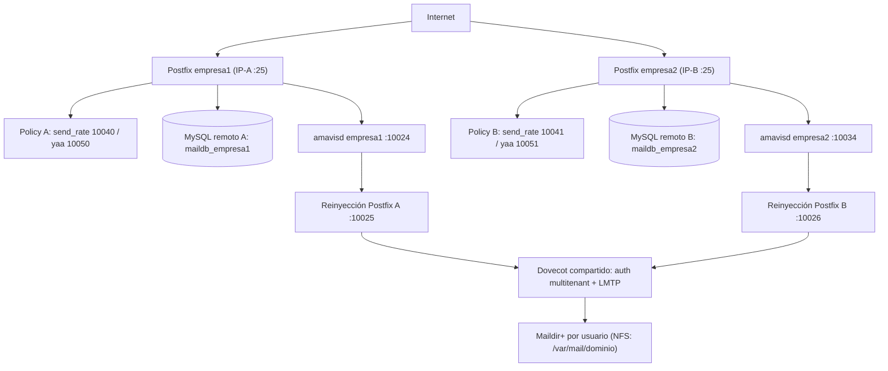

## Introducción

Esta guía describe cómo montar un servidor de correo **multitenant con aislamiento completo por dominio/tenant** en Ubuntu 24.04:

- **Postfix con `postmulti`**: una instancia de Postfix independiente por tenant, cada una con su propia configuración, cola, IP pública y mapas MySQL.
- **MySQL remoto por dominio**: cada tenant tiene su propia base de datos, en su propio servidor MySQL (ya existente). Esto permite que esa base se use también para otras cosas del tenant.
- **Dovecot compartido** pero con backends de autenticación separados por dominio.
- **Maildir+** almacenado en un NAS y montado por **NFS**.
- **SASL**, **STARTTLS** y certificados por dominio (SNI).
- **`send_rate_policyd.pl`** para límites de envío por remitente y **`yaa.pl`** (Yet Another Autoresponder) por dominio.
- **`amavisd-new`** por dominio, con ClamAV y SpamAssassin, y firma **DKIM** por dominio.

> Esta es la variante *database-per-tenant*. Si buscas el modelo más simple de un único servidor con todos los dominios en **una sola base de datos** (shared-schema con `domain_id`), consulta la guía hermana de Postfix/Dovecot con MySQL, STARTTLS y Amavis.

---

## Tabla de contenido

---

# 1. Arquitectura general



Cada **tenant** es un dominio con:

- Su propia instancia de Postfix (vía `postmulti`), enlazada a **su propia IP pública**.
- Su propio servidor MySQL remoto (ya existente).
- Su propio directorio base de buzones (ya existente, en el NAS).
- Sus propios daemons de policy (`send_rate_policyd.pl`, `yaa.pl`).
- Su propia instancia de `amavisd-new`.

Dovecot es **compartido**, pero usa archivos de autenticación separados por dominio, cada uno apuntando a la base MySQL del tenant y filtrando por su dominio.

> **Importante (IP por instancia):** dos instancias de Postfix **no pueden** enlazar `0.0.0.0:25` a la vez. Cada instancia debe enlazar **una IP pública distinta** (`inet_interfaces = <IP del tenant>`). En un solo host necesitas por tanto una IP por tenant (IP alias / varias NIC, o en la nube varias IP elásticas). Si tu proveedor no permite varias IP públicas por instancia, la alternativa es **un host por tenant**.

---

# 2. Prerequisitos y convenciones

### Variables de ejemplo usadas en esta guía

| Variable            | Valor de ejemplo              |
|---------------------|-------------------------------|
| `DOMINIO_A`         | `empresa1.com`                |
| `DOMINIO_B`         | `empresa2.net`                |
| `IP_PUB_A`          | `203.0.113.10` (IP pública empresa1) |
| `IP_PUB_B`          | `203.0.113.20` (IP pública empresa2) |
| `DB_HOST_A`         | `10.0.0.10`                   |
| `DB_HOST_B`         | `10.0.0.20`                   |
| `DB_USER_A`         | `mailuser_a`                  |
| `DB_PASS_A`         | `secretA`                     |
| `DB_NAME_A`         | `maildb_empresa1`             |
| `MAILDIR_BASE_A`    | `/var/mail/empresa1.com`      |
| `MAILDIR_BASE_B`    | `/var/mail/empresa2.net`      |
| `NAS_HOST`          | `nas.local`                   |
| `NFS_EXPORT_A`      | `/exports/empresa1`           |
| `NFS_EXPORT_B`      | `/exports/empresa2`           |
| `REINJECT_PORT_A`   | `10025` (reinyección Amavis → Postfix A) |
| `REINJECT_PORT_B`   | `10026` (reinyección Amavis → Postfix B) |
| `AMAVIS_PORT_A`     | `10024`                       |
| `AMAVIS_PORT_B`     | `10034`                       |
| `POLICY_PORT_A`     | `10040` (send_rate empresa1)  |
| `POLICY_PORT_B`     | `10041` (send_rate empresa2)  |
| `YAA_PORT_A`        | `10050`                       |
| `YAA_PORT_B`        | `10051`                       |

> El SMTP público de cada tenant es el **puerto 25 sobre su IP** (`IP_PUB_A`, `IP_PUB_B`). Los puertos `1002x`–`1005x` son **internos** (loopback): reinyección de Amavis y policy daemons.

### Requisitos previos

- Ubuntu 24.04 LTS instalado y actualizado.
- Acceso root o sudo.
- DNS configurado para ambos dominios (MX, A, PTR).
- Una **IP pública por tenant** en el servidor de correo.
- Certificados SSL disponibles (Let's Encrypt o propios) por dominio.
- Servidores MySQL remotos accesibles y bases de datos ya creadas.
- Directorios de Maildir ya existentes en el NAS, montados por NFS en `/var/mail/<dominio>`.
- UID del usuario `vmail` sincronizado entre el servidor de correo y el NAS.

---

# 3. Instalación de paquetes base

```bash
apt update && apt upgrade -y

# Postfix y soporte MySQL
apt install -y postfix postfix-mysql postfix-pcre \
               libsasl2-modules libsasl2-modules-sql sasl2-bin

# Dovecot con soporte MySQL y SSL
apt install -y dovecot-core dovecot-imapd dovecot-pop3d dovecot-lmtpd \
               dovecot-mysql dovecot-sieve dovecot-managesieved

# Amavis y sus dependencias (antivirus/antispam + DKIM)
apt install -y amavisd-new spamassassin clamav clamav-daemon \
               libmail-dkim-perl arj bzip2 cabextract cpio file \
               gzip nomarch pax razor unzip zip

# Perl y módulos para los policy daemons
apt install -y perl libdbi-perl libdbd-mysql-perl libnet-server-perl \
               libio-multiplex-perl libemail-address-perl libmime-lite-perl

# Cliente MySQL para pruebas (en 24.04 también sirve default-mysql-client)
apt install -y mysql-client-core-8.0 mailutils
```

> **Nota:** la firma DKIM se hará **dentro de Amavis** (`libmail-dkim-perl`), no con OpenDKIM. No instalamos un milter aparte; ver la sección 13.4.

Detén el Postfix por defecto (lo reemplazaremos con instancias `postmulti`):

```bash
systemctl stop postfix
systemctl disable postfix
```

---

# 4. Estructura de directorios y montaje NFS

## 4.1. Directorios del servidor de correo

```bash
# Configuración por instancia Postfix
mkdir -p /etc/postfix-empresa1/mysql
mkdir -p /etc/postfix-empresa2/mysql

# Configuración de policy daemons
mkdir -p /etc/mail-policy/empresa1
mkdir -p /etc/mail-policy/empresa2

# Logs separados por dominio (opcional pero recomendado)
mkdir -p /var/log/mail/empresa1
mkdir -p /var/log/mail/empresa2

# Usuario del sistema para entrega de correo virtual.
# IMPORTANTE: el UID (5000) debe coincidir con el propietario en el NAS.
getent passwd vmail || useradd -r -u 5000 -g mail -d /var/mail -s /usr/sbin/nologin vmail
```

> Los directorios de cola (`/var/spool/postfix-empresaN`) los crea automáticamente `postmulti` en la sección 5.

## 4.2. Montaje NFS de los Maildirs

Los buzones viven en el NAS y se montan en `/var/mail/<dominio>`. Los directorios en el NAS **ya existen**; sólo hay que montarlos.

Instala el cliente NFS y verifica los exports:

```bash
apt install -y nfs-common
showmount -e nas.local
```

Crea los puntos de montaje:

```bash
mkdir -p /var/mail/empresa1.com
mkdir -p /var/mail/empresa2.net
```

Añade a `/etc/fstab` para montaje persistente:

```text
# NFS Maildirs
nas.local:/exports/empresa1  /var/mail/empresa1.com  nfs  rw,hard,timeo=30,retrans=3,nfsvers=4.2,_netdev  0  0
nas.local:/exports/empresa2  /var/mail/empresa2.net  nfs  rw,hard,timeo=30,retrans=3,nfsvers=4.2,_netdev  0  0
```

Opciones relevantes:

| Opción       | Motivo                                                                 |
|--------------|------------------------------------------------------------------------|
| `hard`       | Si el NAS no responde, las operaciones se bloquean y reintentan (no fallan en silencio). |
| `timeo=30`   | Timeout de 3 segundos antes de reintentar (unidades de 0.1 s).         |
| `retrans=3`  | Tres reintentos antes de reportar error.                               |
| `nfsvers=4.2`| NFSv4 mejora el manejo de locks y permisos.                            |
| `_netdev`    | Esperar a que la red esté disponible antes de montar.                  |
| `noac`       | **Añádela si hay varios servidores** accediendo al mismo export, para evitar caché de atributos inconsistente. |

> La antigua opción `intr` ya **no tiene efecto** en kernels modernos (es un no-op desde hace años); por eso no se incluye.

Monta ahora y verifica:

```bash
mount -a
mount | grep /var/mail
df -h /var/mail/empresa1.com /var/mail/empresa2.net
```

## 4.3. UID/GID consistente entre servidor y NAS

Es el punto más crítico en NFS. Si el UID de `vmail` en el servidor no coincide con el propietario de los archivos en el NAS, los permisos fallarán.

```bash
# UID en el servidor de correo
id vmail
# uid=5000(vmail) gid=8(mail)

# En el NAS, propietario de los exports (por SSH/consola)
ls -ln /exports/empresa1
# drwxrws--- 2 5000 8 ...  -> debe coincidir con uid=5000, gid=8
```

Si no coinciden:

- **Opción A** — Cambiar el UID de `vmail` en el servidor para que coincida con el NAS:

```bash
usermod -u <UID_DEL_NAS> vmail
```

- **Opción B** — Usar `idmapd` (NFSv4) para mapear por nombre en vez de por UID, asegurando que el usuario `vmail` exista con el mismo nombre en el NAS.

## 4.4. Opciones de Dovecot específicas para NFS

Estas opciones se aplican en `10-mail.conf` (sección 8.2); se listan aquí por referencia:

```ini
mmap_disable     = yes   # NFS no soporta mmap de forma fiable
mail_nfs_storage = yes   # fsync() más agresivo al escribir
mail_nfs_index   = yes   # si los índices también están en NFS
mail_fsync       = always
```

> Maildir **no** necesita file locks (a diferencia de mbox), por lo que NFS es perfectamente viable.

---

# 5. Configuración de Postfix con postmulti

## 5.1. Inicializar postmulti

`postmulti` permite ejecutar varias instancias de Postfix en el mismo servidor, cada una con su directorio de configuración, cola y puertos propios.

```bash
# Habilitar postmulti en la instancia por defecto
postmulti -e init

# Crear una instancia por tenant
postmulti -e create -I postfix-empresa1 -G mta
postmulti -e create -I postfix-empresa2 -G mta

# Verificar
postmulti -l
```

Esto crea `/etc/postfix-empresa1/`, `/var/spool/postfix-empresa1/` (y sus equivalentes para empresa2).

## 5.2. `main.cf` para empresa1

Cada instancia enlaza **su propia IP pública** (`inet_interfaces`), no `all`.

```ini
# — Identidad —
myhostname = mail.empresa1.com
mydomain = empresa1.com
myorigin = $mydomain
inet_interfaces = 203.0.113.10
inet_protocols = ipv4

# — Dominios —
mydestination =
local_recipient_maps =
local_transport = error:local mail delivery is disabled

# Dominios virtuales desde MySQL
virtual_mailbox_domains = mysql:/etc/postfix-empresa1/mysql/virtual_domains.cf
virtual_mailbox_maps    = mysql:/etc/postfix-empresa1/mysql/virtual_mailbox.cf
virtual_alias_maps      = mysql:/etc/postfix-empresa1/mysql/virtual_aliases.cf

# — Entrega por LMTP a Dovecot (socket dentro de la cola de esta instancia) —
virtual_transport = lmtp:unix:private/dovecot-lmtp

# — Relay —
mynetworks = 127.0.0.0/8 [::ffff:127.0.0.0]/104 [::1]/128
relay_domains =
smtpd_relay_restrictions =
    permit_mynetworks,
    permit_sasl_authenticated,
    reject_unauth_destination

# — SASL (Dovecot) —
smtpd_sasl_type = dovecot
smtpd_sasl_path = private/auth-empresa1
smtpd_sasl_auth_enable = yes
smtpd_sasl_security_options = noanonymous
smtpd_sasl_local_domain = $myhostname

# — TLS —
smtpd_tls_cert_file = /etc/ssl/empresa1/fullchain.pem
smtpd_tls_key_file  = /etc/ssl/empresa1/privkey.pem
smtpd_tls_security_level = may
smtpd_tls_auth_only = yes
smtpd_tls_loglevel = 1
smtpd_tls_session_cache_database = btree:/var/lib/postfix-empresa1/smtpd_scache
smtp_tls_session_cache_database  = btree:/var/lib/postfix-empresa1/smtp_scache
smtpd_tls_protocols = !SSLv2, !SSLv3, !TLSv1, !TLSv1.1
smtpd_tls_ciphers = high

# — Restricciones SMTP —
smtpd_helo_required = yes
smtpd_helo_restrictions =
    permit_mynetworks,
    reject_invalid_helo_hostname,
    reject_non_fqdn_helo_hostname

smtpd_sender_restrictions =
    permit_mynetworks,
    permit_sasl_authenticated,
    reject_non_fqdn_sender,
    reject_unknown_sender_domain

smtpd_recipient_restrictions =
    permit_mynetworks,
    permit_sasl_authenticated,
    reject_unauth_destination,
    check_policy_service inet:127.0.0.1:10040,
    check_policy_service inet:127.0.0.1:10050

# — Content filter (amavis de empresa1) —
content_filter = smtp-amavis:[127.0.0.1]:10024

# — Tamaños —
message_size_limit = 52428800
mailbox_size_limit = 0

# — Cola de esta instancia —
queue_directory = /var/spool/postfix-empresa1

# — Misc —
biff = no
append_dot_mydomain = no
readme_directory = no
compatibility_level = 3.6
```

> Crea el directorio de caché TLS: `mkdir -p /var/lib/postfix-empresa1 && chown postfix: /var/lib/postfix-empresa1`.

## 5.3. `master.cf` para empresa1

```text
# SMTP público (25) en la IP de la instancia
smtp      inet  n       -       y       -       -       smtpd
  -o syslog_name=postfix-empresa1

# Submission (587) con STARTTLS obligatorio
submission inet n       -       y       -       -       smtpd
  -o syslog_name=postfix-empresa1/submission
  -o smtpd_tls_security_level=encrypt
  -o smtpd_sasl_auth_enable=yes
  -o smtpd_client_restrictions=permit_sasl_authenticated,reject
  -o milter_macro_daemon_name=ORIGINATING

# SMTPS (465)
smtps     inet  n       -       y       -       -       smtpd
  -o syslog_name=postfix-empresa1/smtps
  -o smtpd_tls_wrappermode=yes
  -o smtpd_sasl_auth_enable=yes
  -o smtpd_client_restrictions=permit_sasl_authenticated,reject

# Reinyección desde Amavis (puerto local 10025)
127.0.0.1:10025 inet n  -       n       -       -       smtpd
  -o syslog_name=postfix-empresa1/amavis
  -o content_filter=
  -o local_recipient_maps=
  -o relay_recipient_maps=
  -o smtpd_restriction_classes=
  -o smtpd_delay_reject=no
  -o smtpd_client_restrictions=permit_mynetworks,reject
  -o smtpd_helo_restrictions=
  -o smtpd_sender_restrictions=
  -o smtpd_recipient_restrictions=permit_mynetworks,reject
  -o mynetworks=127.0.0.0/8
  -o strict_rfc821_envelopes=yes

# Transporte de salida hacia Amavis
smtp-amavis unix -      -       n       -       2       smtp
  -o syslog_name=postfix-empresa1/amavis-out
  -o smtp_data_done_timeout=1200
  -o smtp_send_xforward_command=yes
  -o disable_dns_lookups=yes
  -o max_use=20

# Daemons internos
pickup    unix  n       -       y       60      1       pickup
cleanup   unix  n       -       y       -       0       cleanup
qmgr      unix  n       -       n       300     1       qmgr
tlsmgr    unix  -       -       y       1000?   1       tlsmgr
rewrite   unix  -       -       y       -       -       trivial-rewrite
bounce    unix  -       -       y       -       0       bounce
defer     unix  -       -       y       -       0       bounce
trace     unix  -       -       y       -       0       bounce
verify    unix  -       -       y       -       1       verify
flush     unix  n       -       y       1000?   0       flush
proxymap  unix  -       -       n       -       -       proxymap
proxywrite unix -       -       n       -       1       proxymap
smtp      unix  -       -       y       -       -       smtp
relay     unix  -       -       y       -       -       smtp
showq     unix  n       -       y       -       -       showq
error     unix  -       -       y       -       -       error
retry     unix  -       -       y       -       -       error
discard   unix  -       -       y       -       -       discard
local     unix  -       n       n       -       -       local
virtual   unix  -       n       n       -       -       virtual
lmtp      unix  -       -       y       -       -       lmtp
anvil     unix  -       -       y       -       1       anvil
scache    unix  -       -       y       -       1       scache
```

## 5.4. Repetir para empresa2

Copia y ajusta cambiando dominio, IP, puertos y certificados:

```bash
cp /etc/postfix-empresa1/main.cf   /etc/postfix-empresa2/main.cf
cp /etc/postfix-empresa1/master.cf /etc/postfix-empresa2/master.cf

sed -i 's/empresa1/empresa2/g' /etc/postfix-empresa2/main.cf
sed -i 's/203\.0\.113\.10/203.0.113.20/' /etc/postfix-empresa2/main.cf
sed -i 's/10024/10034/;s/10025/10026/;s/10040/10041/;s/10050/10051/' \
    /etc/postfix-empresa2/main.cf
sed -i 's/empresa1/empresa2/g;s/10025/10026/g' /etc/postfix-empresa2/master.cf
```

Luego revisa manualmente `myhostname`, `mydomain`, `.net` vs `.com`, rutas de certificados y `queue_directory` en `/etc/postfix-empresa2/main.cf`.

## 5.5. Habilitar instancias

```bash
postmulti -i postfix-empresa1 -e enable
postmulti -i postfix-empresa2 -e enable
```

---

# 6. Esquema MySQL por dominio

Este esquema se crea **en la base de datos de cada tenant** (en su servidor MySQL remoto). Como esa base puede usarse también para otras cosas del tenant, otorgamos permisos **sólo** sobre las tablas de correo.

```sql
-- Conectar al servidor remoto: mysql -h 10.0.0.10 -u root -p maildb_empresa1

CREATE TABLE IF NOT EXISTS `virtual_domains` (
  `id`      INT NOT NULL AUTO_INCREMENT,
  `name`    VARCHAR(255) NOT NULL,
  `active`  TINYINT(1) NOT NULL DEFAULT 1,
  PRIMARY KEY (`id`),
  UNIQUE KEY `name` (`name`)
) ENGINE=InnoDB DEFAULT CHARSET=utf8mb4;

CREATE TABLE IF NOT EXISTS `virtual_users` (
  `id`        INT NOT NULL AUTO_INCREMENT,
  `domain_id` INT NOT NULL,
  `email`     VARCHAR(255) NOT NULL,
  `password`  VARCHAR(255) NOT NULL,          -- formato {SHA512-CRYPT}$6$...
  `name`      VARCHAR(255),
  `quota`     BIGINT NOT NULL DEFAULT 0,      -- bytes; 0 = sin límite
  `active`    TINYINT(1) NOT NULL DEFAULT 1,
  `maildir`   VARCHAR(512) NOT NULL,          -- relativo, ej: empresa1.com/usuario/
  PRIMARY KEY (`id`),
  UNIQUE KEY `email` (`email`),
  FOREIGN KEY (`domain_id`) REFERENCES `virtual_domains`(`id`) ON DELETE CASCADE
) ENGINE=InnoDB DEFAULT CHARSET=utf8mb4;

CREATE TABLE IF NOT EXISTS `virtual_aliases` (
  `id`          INT NOT NULL AUTO_INCREMENT,
  `domain_id`   INT NOT NULL,
  `source`      VARCHAR(255) NOT NULL,
  `destination` VARCHAR(255) NOT NULL,
  `active`      TINYINT(1) NOT NULL DEFAULT 1,
  PRIMARY KEY (`id`),
  UNIQUE KEY `uniq_source` (`source`),
  FOREIGN KEY (`domain_id`) REFERENCES `virtual_domains`(`id`) ON DELETE CASCADE
) ENGINE=InnoDB DEFAULT CHARSET=utf8mb4;

CREATE TABLE IF NOT EXISTS `send_rate` (
  `id`            INT NOT NULL AUTO_INCREMENT,
  `email`         VARCHAR(255) NOT NULL,
  `msgs_per_day`  INT NOT NULL DEFAULT 500,
  `msgs_per_hour` INT NOT NULL DEFAULT 100,
  `active`        TINYINT(1) NOT NULL DEFAULT 1,
  PRIMARY KEY (`id`),
  UNIQUE KEY `email` (`email`)
) ENGINE=InnoDB DEFAULT CHARSET=utf8mb4;

-- Usuario de acceso remoto para el servidor de correo (SELECT en tablas de correo).
CREATE USER IF NOT EXISTS 'mailuser_a'@'IP_SERVIDOR_CORREO' IDENTIFIED BY 'secretA';
GRANT SELECT ON maildb_empresa1.virtual_domains TO 'mailuser_a'@'IP_SERVIDOR_CORREO';
GRANT SELECT ON maildb_empresa1.virtual_users   TO 'mailuser_a'@'IP_SERVIDOR_CORREO';
GRANT SELECT ON maildb_empresa1.virtual_aliases TO 'mailuser_a'@'IP_SERVIDOR_CORREO';
-- send_rate y send_rate_log necesitan también INSERT/DELETE (ver sección 11).
GRANT SELECT, INSERT, DELETE ON maildb_empresa1.send_rate     TO 'mailuser_a'@'IP_SERVIDOR_CORREO';
FLUSH PRIVILEGES;
```

> La columna `password` guarda el hash con prefijo de esquema (`{SHA512-CRYPT}$6$...`), generado con `doveadm pw -s SHA512-CRYPT`.

---

# 7. Mapas MySQL de Postfix por instancia

## 7.1. Dominios virtuales

```ini
# /etc/postfix-empresa1/mysql/virtual_domains.cf
hosts    = 10.0.0.10
user     = mailuser_a
password = secretA
dbname   = maildb_empresa1
query    = SELECT name FROM virtual_domains WHERE name='%s' AND active=1
```

## 7.2. Buzones virtuales

```ini
# /etc/postfix-empresa1/mysql/virtual_mailbox.cf
hosts    = 10.0.0.10
user     = mailuser_a
password = secretA
dbname   = maildb_empresa1
query    = SELECT maildir FROM virtual_users WHERE email='%s' AND active=1
```

## 7.3. Aliases virtuales

```ini
# /etc/postfix-empresa1/mysql/virtual_aliases.cf
hosts    = 10.0.0.10
user     = mailuser_a
password = secretA
dbname   = maildb_empresa1
query    = SELECT destination FROM virtual_aliases WHERE source='%s' AND active=1
```

## 7.4. Permisos de los archivos de mapas

```bash
chmod 640 /etc/postfix-empresa1/mysql/*.cf /etc/postfix-empresa2/mysql/*.cf
chown root:postfix /etc/postfix-empresa1/mysql/*.cf /etc/postfix-empresa2/mysql/*.cf
```

## 7.5. Probar consultas MySQL

```bash
postmap -q "empresa1.com" mysql:/etc/postfix-empresa1/mysql/virtual_domains.cf
postmap -q "usuario@empresa1.com" mysql:/etc/postfix-empresa1/mysql/virtual_mailbox.cf
```

---

# 8. Configuración de Dovecot multitenant

Dovecot es un único proceso compartido. La autenticación y los datos de buzón se resuelven con archivos SQL **separados por dominio**, cada uno conectado a la base del tenant y filtrando por su dominio.

## 8.1. Configuración principal `/etc/dovecot/dovecot.conf`

```ini
protocols = imap pop3 lmtp sieve
listen = *, ::

!include conf.d/*.conf
!include_try local.conf
```

## 8.2. `/etc/dovecot/conf.d/10-mail.conf`

Una **única** definición de ubicación de buzón (`%d` = dominio, `%n` = parte local), evitando definiciones en conflicto.

```ini
# Fuente única de la ubicación del buzón.
mail_location = maildir:/var/mail/%d/%n/Maildir

# Usuario del sistema para el correo virtual.
mail_uid = vmail
mail_gid = mail
mail_privileged_group = mail

# Optimizaciones NFS (sección 4.4)
mmap_disable     = yes
mail_nfs_storage = yes
mail_nfs_index   = yes
mail_fsync       = always

namespace inbox {
  inbox = yes
  separator = /
  prefix =
  mailbox Sent   { auto = subscribe  special_use = \Sent }
  mailbox Trash  { auto = subscribe  special_use = \Trash }
  mailbox Drafts { auto = subscribe  special_use = \Drafts }
  mailbox Junk   { auto = subscribe  special_use = \Junk }
}

first_valid_uid = 5000
last_valid_uid  = 5000
```

## 8.3. `/etc/dovecot/conf.d/10-auth.conf`

```ini
auth_mechanisms = plain login
disable_plaintext_auth = yes

!include auth-sql-empresa1.conf.ext
!include auth-sql-empresa2.conf.ext
```

## 8.4. Auth SQL empresa1: `/etc/dovecot/auth-sql-empresa1.conf.ext`

```ini
passdb {
  driver = sql
  args = /etc/dovecot/dovecot-sql-empresa1.conf.ext
}

userdb {
  driver = sql
  args = /etc/dovecot/dovecot-sql-empresa1.conf.ext
}
```

## 8.5. SQL empresa1: `/etc/dovecot/dovecot-sql-empresa1.conf.ext`

Las consultas usan el esquema `virtual_users` de la sección 6. El filtro `LIKE '%%@empresa1.com'` (el `%%` es un `%` literal en Dovecot) asegura que este backend sólo resuelva usuarios de empresa1.

```ini
driver  = mysql
connect = host=10.0.0.10 dbname=maildb_empresa1 user=mailuser_a password=secretA

# Fallback si algún hash no llevara prefijo de esquema.
default_pass_scheme = SHA512-CRYPT

# Autenticación: el hash guardado ya incluye el prefijo {SHA512-CRYPT}.
password_query = \
  SELECT email AS user, password \
  FROM virtual_users \
  WHERE email = '%u' AND active = 1 AND email LIKE '%%@empresa1.com'

# Datos de buzón: UID/GID fijos (vmail=5000), home a partir de la columna maildir,
# y cuota por usuario. mail_location global provee el layout Maildir.
user_query = \
  SELECT CONCAT('/var/mail/', maildir) AS home, \
         5000 AS uid, 5000 AS gid, \
         CONCAT('*:bytes=', quota) AS quota_rule \
  FROM virtual_users \
  WHERE email = '%u' AND active = 1

# Para herramientas como doveadm.
iterate_query = \
  SELECT email AS username FROM virtual_users WHERE active = 1
```

Repite para empresa2 en `dovecot-sql-empresa2.conf.ext` con sus credenciales MySQL y el filtro `LIKE '%%@empresa2.net'`.

> **Control por servicio (IMAP/POP3/SMTP):** si necesitas habilitar/deshabilitar un usuario por protocolo (por ejemplo, permitir SMTP pero no IMAP), añade columnas booleanas a `virtual_users` y filtra con ellas en las consultas correspondientes (no en `password_query`, que aplica a **todos** los servicios, incluido SASL).

## 8.6. `/etc/dovecot/conf.d/10-ssl.conf`

Certificado por dominio vía SNI. El cliente de cada tenant se conecta a `mail.<su-dominio>`.

```ini
ssl = required

# Certificado por defecto.
ssl_cert = </etc/ssl/empresa1/fullchain.pem
ssl_key  = </etc/ssl/empresa1/privkey.pem

local_name mail.empresa1.com {
  ssl_cert = </etc/ssl/empresa1/fullchain.pem
  ssl_key  = </etc/ssl/empresa1/privkey.pem
}

local_name mail.empresa2.net {
  ssl_cert = </etc/ssl/empresa2/fullchain.pem
  ssl_key  = </etc/ssl/empresa2/privkey.pem
}

ssl_min_protocol = TLSv1.2
ssl_cipher_list = ECDHE-ECDSA-AES256-GCM-SHA384:ECDHE-RSA-AES256-GCM-SHA384:HIGH:!aNULL:!MD5
ssl_prefer_server_ciphers = yes
```

## 8.7. `/etc/dovecot/conf.d/10-master.conf`

Los sockets LMTP y de autenticación se crean **dentro de la cola de cada instancia Postfix**, para que cada Postfix hable con Dovecot por su propio socket.

```ini
service imap-login {
  inet_listener imap  { port = 143 }
  inet_listener imaps { port = 993  ssl = yes }
}

service pop3-login {
  inet_listener pop3  { port = 110 }
  inet_listener pop3s { port = 995  ssl = yes }
}

service lmtp {
  unix_listener /var/spool/postfix-empresa1/private/dovecot-lmtp {
    mode = 0600
    user = postfix
    group = postfix
  }
  unix_listener /var/spool/postfix-empresa2/private/dovecot-lmtp {
    mode = 0600
    user = postfix
    group = postfix
  }
}

service auth {
  unix_listener /var/spool/postfix-empresa1/private/auth-empresa1 {
    mode = 0660
    user = postfix
    group = postfix
  }
  unix_listener /var/spool/postfix-empresa2/private/auth-empresa2 {
    mode = 0660
    user = postfix
    group = postfix
  }
  unix_listener auth-userdb {
    mode = 0600
    user = vmail
    group = mail
  }
}

service managesieve-login {
  inet_listener sieve { port = 4190 }
}
```

---

# 9. SASL: integración Postfix → Dovecot

La autenticación SASL se delega a Dovecot por socket Unix. En el `main.cf` de cada instancia ya está:

```ini
smtpd_sasl_type = dovecot
smtpd_sasl_path = private/auth-empresa1   # relativo a queue_directory
smtpd_sasl_auth_enable = yes
```

El socket lo crea Dovecot al arrancar (sección `service auth` en `10-master.conf`).

Verificación rápida:

```bash
# String AUTH PLAIN en base64
python3 -c "import base64; print(base64.b64encode(b'\x00usuario@empresa1.com\x00mipassword').decode())"

openssl s_client -starttls smtp -connect mail.empresa1.com:587 -quiet
# EHLO test
# AUTH PLAIN <base64>
```

---

# 10. TLS/STARTTLS con certificados por dominio

## 10.1. Obtener certificados con Let's Encrypt

```bash
apt install -y certbot

certbot certonly --standalone -d mail.empresa1.com \
  --email admin@empresa1.com --agree-tos --non-interactive

certbot certonly --standalone -d mail.empresa2.net \
  --email admin@empresa2.net --agree-tos --non-interactive
```

## 10.2. Organizar certificados

```bash
mkdir -p /etc/ssl/empresa1 /etc/ssl/empresa2

ln -sf /etc/letsencrypt/live/mail.empresa1.com/fullchain.pem /etc/ssl/empresa1/fullchain.pem
ln -sf /etc/letsencrypt/live/mail.empresa1.com/privkey.pem   /etc/ssl/empresa1/privkey.pem
ln -sf /etc/letsencrypt/live/mail.empresa2.net/fullchain.pem /etc/ssl/empresa2/fullchain.pem
ln -sf /etc/letsencrypt/live/mail.empresa2.net/privkey.pem   /etc/ssl/empresa2/privkey.pem
```

## 10.3. Renovación automática

```bash
# /etc/cron.d/certbot-renew
0 3 * * * root certbot renew --quiet && \
  postmulti -i postfix-empresa1 -p reload && \
  postmulti -i postfix-empresa2 -p reload && \
  systemctl reload dovecot
```

---

# 11. send_rate_policyd.pl por dominio

Daemon de policy de Postfix que limita la tasa de envío por remitente consultando la tabla `send_rate` en la base del tenant.

## 11.1. El script

```perl
#!/usr/bin/perl
# /usr/local/lib/send_rate_policyd.pl
use strict;
use warnings;
use DBI;
use POSIX qw(strftime);

my $db_host  = $ENV{POLICY_DB_HOST}  // '127.0.0.1';
my $db_name  = $ENV{POLICY_DB_NAME}  // 'maildb';
my $db_user  = $ENV{POLICY_DB_USER}  // 'mailuser';
my $db_pass  = $ENV{POLICY_DB_PASS}  // '';
my $log_file = $ENV{POLICY_LOG}      // '/var/log/send_rate_policy.log';

sub log_msg {
    open(my $fh, '>>', $log_file) or return;
    print $fh strftime("[%Y-%m-%d %H:%M:%S] ", localtime) . join(' ', @_) . "\n";
    close $fh;
}

my $dbh;
sub db_connect {
    $dbh = DBI->connect(
        "DBI:mysql:database=$db_name;host=$db_host", $db_user, $db_pass,
        { RaiseError => 0, PrintError => 0, AutoCommit => 1, mysql_reconnect => 1 }
    ) or do { log_msg("ERROR DB: " . $DBI::errstr); return 0; };
    return 1;
}

sub check_rate {
    my ($sender) = @_;
    return 'DUNNO' unless $sender;
    db_connect() unless ($dbh && $dbh->ping);
    return 'DUNNO' unless $dbh;

    my $row = $dbh->selectrow_hashref(
        "SELECT msgs_per_day, msgs_per_hour FROM send_rate WHERE email=? AND active=1 LIMIT 1",
        undef, $sender
    );
    return 'DUNNO' unless $row;

    my $day  = strftime("%Y-%m-%d 00:00:00", localtime);
    my $hour = strftime("%Y-%m-%d %H:00:00", localtime);

    my ($count_day)  = $dbh->selectrow_array(
        "SELECT COUNT(*) FROM send_rate_log WHERE email=? AND sent_at >= ?",
        undef, $sender, $day) // 0;
    my ($count_hour) = $dbh->selectrow_array(
        "SELECT COUNT(*) FROM send_rate_log WHERE email=? AND sent_at >= ?",
        undef, $sender, $hour) // 0;

    if ($count_day >= $row->{msgs_per_day}) {
        log_msg("RATE LIMIT DAY: $sender ($count_day/$row->{msgs_per_day})");
        return "defer_if_permit Daily sending limit exceeded";
    }
    if ($count_hour >= $row->{msgs_per_hour}) {
        log_msg("RATE LIMIT HOUR: $sender ($count_hour/$row->{msgs_per_hour})");
        return "defer_if_permit Hourly sending limit exceeded";
    }

    $dbh->do("INSERT INTO send_rate_log (email, sent_at) VALUES (?, NOW())", undef, $sender);
    return 'DUNNO';
}

# Bucle del policy delegation de Postfix: pares clave=valor, request termina en línea vacía.
$| = 1;
my %attrs;
while (<STDIN>) {
    chomp;
    if (/^(\S+)=(.*)$/) { $attrs{$1} = $2; }
    elsif (/^$/) {
        # Sólo aplica a remitentes autenticados (saliente).
        my $action = $attrs{sasl_username} ? check_rate($attrs{sender} // '') : 'DUNNO';
        print "action=$action\n\n";
        %attrs = ();
    }
}
```

```bash
chmod +x /usr/local/lib/send_rate_policyd.pl
```

## 11.2. Tabla de contadores

```sql
-- En la base de cada tenant.
CREATE TABLE IF NOT EXISTS `send_rate_log` (
  `id`      BIGINT NOT NULL AUTO_INCREMENT,
  `email`   VARCHAR(255) NOT NULL,
  `sent_at` DATETIME NOT NULL DEFAULT CURRENT_TIMESTAMP,
  PRIMARY KEY (`id`),
  KEY `idx_email_sent` (`email`, `sent_at`)
) ENGINE=InnoDB DEFAULT CHARSET=utf8mb4;

GRANT SELECT, INSERT, DELETE ON maildb_empresa1.send_rate_log TO 'mailuser_a'@'IP_SERVIDOR_CORREO';

-- Purga automática de registros > 7 días.
CREATE EVENT IF NOT EXISTS purge_rate_log
ON SCHEDULE EVERY 1 DAY
DO DELETE FROM send_rate_log WHERE sent_at < DATE_SUB(NOW(), INTERVAL 7 DAY);
```

## 11.3. Configuración por dominio

```ini
# /etc/mail-policy/empresa1/send_rate.env
POLICY_DB_HOST=10.0.0.10
POLICY_DB_NAME=maildb_empresa1
POLICY_DB_USER=mailuser_a
POLICY_DB_PASS=secretA
POLICY_LOG=/var/log/mail/empresa1/send_rate.log
```

```bash
chmod 600 /etc/mail-policy/empresa1/send_rate.env
# Repetir para empresa2 con 10.0.0.20 / maildb_empresa2 / mailuser_b / secretB
```

> El daemon se arranca por **socket systemd** (sección 14.4); no se usa un wrapper con `ncat`.

---

# 12. yaa.pl por dominio

**yaa.pl** (Yet Another Autoresponder) gestiona respuestas automáticas (fuera de oficina) consultando la base del tenant.

> **Nota de diseño:** yaa.pl actúa como policy daemon y **envía correo** durante la fase de recepción. Un policy service debe ser rápido; enviar mensajes de forma síncrona puede ralentizar la recepción y, mal configurado, provocar bucles. Se incluye porque forma parte de este stack, con guardas anti-bucle (no responder a `mailer-daemon`/`postmaster`/`no-reply`, y una vez por par emisor→destinatario por día). Como alternativa estándar existe **Sieve `vacation`** (ya instalamos `dovecot-sieve`), que evita estos riesgos.

## 12.1. El script

```perl
#!/usr/bin/perl
# /usr/local/lib/yaa.pl  — autoresponder multitenant
use strict;
use warnings;
use DBI;
use MIME::Lite;
use POSIX qw(strftime);

my $db_host  = $ENV{YAA_DB_HOST} // '127.0.0.1';
my $db_name  = $ENV{YAA_DB_NAME} // 'maildb';
my $db_user  = $ENV{YAA_DB_USER} // 'mailuser';
my $db_pass  = $ENV{YAA_DB_PASS} // '';
my $log_file = $ENV{YAA_LOG}     // '/var/log/yaa.log';
my $relay    = $ENV{YAA_RELAY}   // '127.0.0.1';
my $relay_pt = $ENV{YAA_RELAY_PORT} // 10025;   # reinyección del tenant

sub log_msg {
    open(my $fh, '>>', $log_file) or return;
    print $fh strftime("[%Y-%m-%d %H:%M:%S] ", localtime) . "@_\n";
    close $fh;
}

sub already_replied {
    my ($dbh, $to, $from) = @_;
    my ($count) = $dbh->selectrow_array(
        "SELECT COUNT(*) FROM autoresponder_log
         WHERE to_email=? AND from_email=? AND sent_at >= CURDATE()",
        undef, $to, $from) // 0;
    return $count > 0;
}

sub process_policy {
    my %attrs = @_;
    my $recipient = $attrs{recipient} // '';
    my $sender    = $attrs{sender}    // '';

    return 'DUNNO' if $sender eq '' || $sender =~ /^(mailer-daemon|postmaster|no-?reply)/i;

    my $dbh = DBI->connect(
        "DBI:mysql:database=$db_name;host=$db_host", $db_user, $db_pass,
        { RaiseError => 0, PrintError => 0, AutoCommit => 1, mysql_reconnect => 1 }
    ) or return 'DUNNO';

    my $row = $dbh->selectrow_hashref(
        "SELECT ar.subject, ar.body FROM autoresponders ar
         JOIN virtual_users vu ON vu.id = ar.user_id
         WHERE vu.email=? AND ar.active=1
           AND (ar.start_date IS NULL OR ar.start_date <= CURDATE())
           AND (ar.end_date   IS NULL OR ar.end_date   >= CURDATE())
         LIMIT 1",
        undef, $recipient
    );

    if ($row && !already_replied($dbh, $recipient, $sender)) {
        my $msg = MIME::Lite->new(
            From    => $recipient,
            To      => $sender,
            Subject => $row->{subject} // 'Fuera de oficina / Out of office',
            Data    => $row->{body},
        );
        $msg->attr('content-type.charset' => 'UTF-8');
        $msg->send('smtp', $relay, Port => $relay_pt);
        $dbh->do("INSERT INTO autoresponder_log (to_email, from_email, sent_at) VALUES (?, ?, NOW())",
                 undef, $recipient, $sender);
        log_msg("Autoresponder: $recipient -> $sender");
    }

    $dbh->disconnect;
    return 'DUNNO';
}

$| = 1;
my %attrs;
while (<STDIN>) {
    chomp;
    if (/^(\S+)=(.*)$/) { $attrs{$1} = $2; }
    elsif (/^$/) { print "action=" . process_policy(%attrs) . "\n\n"; %attrs = (); }
}
```

```bash
chmod +x /usr/local/lib/yaa.pl
```

## 12.2. Tablas para yaa.pl

```sql
-- En la base de cada tenant.
CREATE TABLE IF NOT EXISTS `autoresponders` (
  `id`         INT NOT NULL AUTO_INCREMENT,
  `user_id`    INT NOT NULL,
  `subject`    VARCHAR(255) NOT NULL DEFAULT 'Fuera de oficina',
  `body`       TEXT NOT NULL,
  `start_date` DATE,
  `end_date`   DATE,
  `active`     TINYINT(1) NOT NULL DEFAULT 1,
  PRIMARY KEY (`id`),
  FOREIGN KEY (`user_id`) REFERENCES `virtual_users`(`id`) ON DELETE CASCADE
) ENGINE=InnoDB DEFAULT CHARSET=utf8mb4;

CREATE TABLE IF NOT EXISTS `autoresponder_log` (
  `id`         BIGINT NOT NULL AUTO_INCREMENT,
  `to_email`   VARCHAR(255) NOT NULL,
  `from_email` VARCHAR(255) NOT NULL,
  `sent_at`    DATETIME NOT NULL DEFAULT CURRENT_TIMESTAMP,
  PRIMARY KEY (`id`),
  KEY `idx_to_from` (`to_email`, `from_email`, `sent_at`)
) ENGINE=InnoDB DEFAULT CHARSET=utf8mb4;
```

> `yaa.pl` necesita `SELECT` sobre `autoresponders`/`virtual_users` e `INSERT/SELECT` sobre `autoresponder_log`. Ajusta los `GRANT` en consecuencia.

---

# 13. Amavis-new por dominio

Cada dominio tiene su propia instancia de `amavisd-new` en un puerto distinto, con políticas y cuarentena independientes, y firma DKIM propia.

## 13.1. Antivirus y antispam base

```bash
systemctl enable --now clamav-freshclam
sa-update
```

## 13.2. Directorios por instancia

```bash
for d in empresa1 empresa2; do
  mkdir -p /var/lib/amavis/$d/tmp /var/lib/amavis/$d/db /var/lib/amavis/quarantine/$d
  chown -R amavis:amavis /var/lib/amavis/$d /var/lib/amavis/quarantine/$d
done
mkdir -p /run/amavis && chown amavis:amavis /run/amavis
```

## 13.3. Configuración de amavis para empresa1

Cada instancia necesita sus **propios** `$MYHOME`, `$pid_file`, `$lock_file`, `$db_home` y `$TEMPBASE`; de lo contrario dos `amavisd` colisionan en las rutas por defecto.

```perl
# /etc/amavis/conf.d/50-empresa1
use strict;

# — Identidad —
$myhostname  = 'mail.empresa1.com';
$mydomain    = 'empresa1.com';
$daemon_user = 'amavis';
$daemon_group = 'amavis';

# — Rutas propias de la instancia (evitan colisión entre instancias) —
$MYHOME     = '/var/lib/amavis/empresa1';
$pid_file   = '/run/amavis/empresa1.pid';
$lock_file  = '/run/amavis/empresa1.lock';
$db_home    = "$MYHOME/db";
$TEMPBASE   = "$MYHOME/tmp";
$QUARANTINEDIR = '/var/lib/amavis/quarantine/empresa1';

# — Red —
$inet_socket_port = 10024;              # entrada desde Postfix empresa1
$inet_socket_bind = '127.0.0.1';
$forward_method   = 'smtp:[127.0.0.1]:10025';  # reinyección a Postfix empresa1
$notify_method    = $forward_method;
@inet_acl = qw(127.0.0.1 [::1]);

# — Acciones —
$final_virus_destiny      = D_DISCARD;
$final_banned_destiny     = D_BOUNCE;
$final_spam_destiny       = D_PASS;
$final_bad_header_destiny = D_PASS;

# — Umbrales de spam —
$sa_spam_subject_tag = '*** SPAM *** ';
$sa_tag_level_deflt  = 2.0;
$sa_tag2_level_deflt = 6.31;
$sa_kill_level_deflt = 10.0;
$sa_dsn_cutoff_level = 10;

@local_domains_acl = ( 'empresa1.com' );

1;  # valor de retorno definido
```

Repite en `/etc/amavis/conf.d/50-empresa2` cambiando dominio, `$MYHOME`, pid/lock (`empresa2`), `$inet_socket_port = 10034`, y `$forward_method` a `:10026`.

## 13.4. Firma DKIM por dominio

DKIM se firma dentro de cada instancia de Amavis. Genera una clave por dominio y publícala en DNS.

```bash
mkdir -p /var/lib/dkim
amavisd-new genrsa /var/lib/dkim/empresa1.com.mail.key.pem 2048
amavisd-new genrsa /var/lib/dkim/empresa2.net.mail.key.pem 2048
chown -R amavis:amavis /var/lib/dkim
chmod 640 /var/lib/dkim/*.key.pem
```

Añade al final de cada `50-empresaN` (antes del `1;`):

```perl
# — DKIM (empresa1) —
$enable_dkim_signing      = 1;
$enable_dkim_verification = 1;
dkim_key('empresa1.com', 'mail', '/var/lib/dkim/empresa1.com.mail.key.pem');
@dkim_signature_options_bysender_maps = ({
  'empresa1.com' => { d => 'empresa1.com', a => 'rsa-sha256', c => 'relaxed/simple' },
});
```

Obtén el registro TXT a publicar (`mail._domainkey.<dominio>`):

```bash
amavisd-new -c /etc/amavis/conf.d/50-empresa1 showkeys
```

---

# 14. Systemd: units para cada componente

## 14.1. Postfix (postmulti genera las units)

```bash
postmulti -i postfix-empresa1 -p start
postmulti -i postfix-empresa2 -p start
```

## 14.2. Amavis por instancia

```ini
# /etc/systemd/system/amavis-empresa1.service
[Unit]
Description=Amavis Mail Filter - empresa1
After=network.target clamav-daemon.service

[Service]
Type=forking
User=amavis
Group=amavis
RuntimeDirectory=amavis
ExecStart=/usr/sbin/amavisd -c /etc/amavis/conf.d/50-empresa1 start
ExecStop=/usr/sbin/amavisd -c /etc/amavis/conf.d/50-empresa1 stop
ExecReload=/usr/sbin/amavisd -c /etc/amavis/conf.d/50-empresa1 reload
PIDFile=/run/amavis/empresa1.pid
Restart=on-failure

[Install]
WantedBy=multi-user.target
```

Crea `amavis-empresa2.service` análogo (config `50-empresa2`, pid `empresa2.pid`).

## 14.3. Nota sobre policy daemons con socket systemd

`send_rate_policyd.pl` y `yaa.pl` leen la petición por **STDIN** y responden por STDOUT. Con activación por socket y `Accept=yes`, systemd crea **una instancia de servicio por conexión** y conecta el socket a STDIN/STDOUT. Esto exige una **unit plantilla** (`nombre@.service`); la `.socket` la referencia automáticamente.

## 14.4. send_rate_policyd (socket + plantilla) empresa1

```ini
# /etc/systemd/system/send-rate-empresa1.socket
[Unit]
Description=Send Rate Policy Socket - empresa1

[Socket]
ListenStream=127.0.0.1:10040
Accept=yes

[Install]
WantedBy=sockets.target
```

```ini
# /etc/systemd/system/send-rate-empresa1@.service
[Unit]
Description=Send Rate Policy Daemon - empresa1 (conn %i)

[Service]
Type=simple
EnvironmentFile=/etc/mail-policy/empresa1/send_rate.env
ExecStart=/usr/bin/perl /usr/local/lib/send_rate_policyd.pl
StandardInput=socket
StandardOutput=socket
User=nobody
Group=nogroup
```

## 14.5. yaa.pl (socket + plantilla) empresa1

```ini
# /etc/systemd/system/yaa-empresa1.socket
[Unit]
Description=YAA Socket - empresa1

[Socket]
ListenStream=127.0.0.1:10050
Accept=yes

[Install]
WantedBy=sockets.target
```

```ini
# /etc/systemd/system/yaa-empresa1@.service
[Unit]
Description=Yet Another Autoresponder - empresa1 (conn %i)

[Service]
Type=simple
Environment=YAA_DB_HOST=10.0.0.10
Environment=YAA_DB_NAME=maildb_empresa1
Environment=YAA_DB_USER=mailuser_a
Environment=YAA_DB_PASS=secretA
Environment=YAA_LOG=/var/log/mail/empresa1/yaa.log
Environment=YAA_RELAY_PORT=10025
ExecStart=/usr/bin/perl /usr/local/lib/yaa.pl
StandardInput=socket
StandardOutput=socket
User=nobody
Group=nogroup
```

Crea los units análogos para empresa2 (puertos 10041/10051, base `maildb_empresa2`, `YAA_RELAY_PORT=10026`).

## 14.6. Habilitar y arrancar todo

```bash
systemctl daemon-reload

# Sockets de policy (activan el @.service por conexión)
systemctl enable --now send-rate-empresa1.socket send-rate-empresa2.socket
systemctl enable --now yaa-empresa1.socket yaa-empresa2.socket

# Amavis y Dovecot
systemctl enable --now amavis-empresa1 amavis-empresa2 dovecot

# Postfix
postmulti -p start
```

---

# 15. Firewall y puertos

```bash
ufw allow 25/tcp    comment 'SMTP'
ufw allow 465/tcp   comment 'SMTPS'
ufw allow 587/tcp   comment 'Submission'
ufw allow 143/tcp   comment 'IMAP'
ufw allow 993/tcp   comment 'IMAPS'
ufw allow 110/tcp   comment 'POP3'
ufw allow 995/tcp   comment 'POP3S'
ufw allow 4190/tcp  comment 'ManageSieve'
ufw enable
ufw status verbose
```

Los puertos internos (`1002x`–`1005x`) son sólo loopback; **no** se abren en el firewall externo.

### Puertos internos por dominio

| Puerto  | Servicio                          | Dominio   |
|---------|-----------------------------------|-----------|
| 10024   | Amavis (entrada desde Postfix)    | empresa1  |
| 10025   | Postfix (reinyección desde Amavis)| empresa1  |
| 10034   | Amavis (entrada desde Postfix)    | empresa2  |
| 10026   | Postfix (reinyección desde Amavis)| empresa2  |
| 10040   | send_rate_policyd                 | empresa1  |
| 10041   | send_rate_policyd                 | empresa2  |
| 10050   | yaa.pl                            | empresa1  |
| 10051   | yaa.pl                            | empresa2  |

---

# 16. Flujo de correo de extremo a extremo

### Entrante (empresa1.com)

```text
1. Cliente externo -> IP_PUB_A:25 -> Postfix-empresa1
2. Postfix verifica el dominio en MySQL (virtual_domains)
3. Policy: send_rate (10040) -> DUNNO para entrante (sólo aplica a autenticados)
          yaa.pl (10050) -> respuesta automática si el destinatario la tiene
4. Postfix -> Amavis empresa1 (10024): antivirus/antispam
5. Amavis reinyecta el correo limpio a Postfix (10025)
6. Postfix entrega por LMTP a Dovecot
7. Dovecot escribe en Maildir: /var/mail/empresa1.com/usuario/Maildir (NFS)
```

### Saliente autenticado (empresa1.com)

```text
1. Cliente -> IP_PUB_A:587 con STARTTLS
2. Postfix pide autenticación -> socket SASL de Dovecot (empresa1)
3. Dovecot valida contra MySQL de empresa1
4. Policy: send_rate (10040) -> aplica el límite de envío
5. Postfix -> Amavis empresa1 (10024): firma DKIM + antivirus
6. Amavis reinyecta a Postfix (10025)
7. Postfix entrega al servidor de destino
```

---

# 17. Pruebas y verificación

## 17.1. Montaje NFS

```bash
mount | grep /var/mail
sudo -u vmail touch /var/mail/empresa1.com/.test_write \
  && echo "OK escritura NFS empresa1" \
  && rm /var/mail/empresa1.com/.test_write
ls -ln /var/mail/empresa1.com | head -5   # uid debe ser 5000
```

## 17.2. Conectividad MySQL

```bash
mysql -h 10.0.0.10 -u mailuser_a -pSecretA maildb_empresa1 \
  -e "SELECT email FROM virtual_users LIMIT 5;"
```

## 17.3. Mapas Postfix

```bash
postmap -q "empresa1.com" mysql:/etc/postfix-empresa1/mysql/virtual_domains.cf
postmap -q "usuario@empresa1.com" mysql:/etc/postfix-empresa1/mysql/virtual_mailbox.cf
postmap -q "info@empresa1.com" mysql:/etc/postfix-empresa1/mysql/virtual_aliases.cf
```

## 17.4. Instancias Postfix

```bash
postmulti -l
postmulti -i postfix-empresa1 -p status
postqueue -c /etc/postfix-empresa1 -p
```

## 17.5. Autenticación Dovecot

```bash
doveadm auth test usuario@empresa1.com mipassword
doveadm user usuario@empresa1.com
```

## 17.6. Entrega de correo

```bash
swaks --to usuario@empresa1.com --from test@externo.com \
      --server mail.empresa1.com:25
journalctl -t postfix-empresa1 -f
```

## 17.7. Amavis y DKIM

```bash
systemctl status amavis-empresa1
amavisd-new -c /etc/amavis/conf.d/50-empresa1 testkeys
```

## 17.8. Policy daemons

```bash
printf 'request=smtpd_access_policy\nsasl_username=usuario@empresa1.com\nsender=usuario@empresa1.com\nrecipient=x@y.com\n\n' \
  | nc 127.0.0.1 10040
```

## 17.9. Aislamiento entre tenants

```bash
# Un usuario de empresa1 NO debe autenticar contra el backend de empresa2.
doveadm auth test usuario@empresa1.com mipassword   # OK
# Verifica en logs que resolvió contra maildb_empresa1, no empresa2.
```

---

# 18. Mantenimiento y rotación de logs

## 18.1. Logrotate

```text
# /etc/logrotate.d/mail-multitenant
/var/log/mail/empresa1/*.log
/var/log/mail/empresa2/*.log {
    daily
    rotate 14
    compress
    delaycompress
    missingok
    notifempty
}
```

## 18.2. Limpieza de cuarentena de Amavis

```bash
# /etc/cron.weekly/amavis-cleanup
#!/bin/bash
find /var/lib/amavis/quarantine -mtime +30 -delete
find /var/lib/amavis/empresa1/tmp -name "*.tmp" -mtime +1 -delete
find /var/lib/amavis/empresa2/tmp -name "*.tmp" -mtime +1 -delete
```

## 18.3. Estado global

```bash
# /usr/local/bin/mail-status.sh
#!/bin/bash
echo "== Instancias Postfix =="
postmulti -l
echo "== Servicios =="
for svc in dovecot amavis-empresa1 amavis-empresa2; do
  printf "  %-22s %s\n" "$svc" "$(systemctl is-active $svc)"
done
echo "== Puertos en escucha =="
ss -tlnp | grep -E ':(25|465|587|143|993|110|995|4190)'
```

## 18.4. Actualización de SpamAssassin

```text
# /etc/cron.d/spamassassin
0 4 * * * root sa-update --nogpg && systemctl reload amavis-empresa1 amavis-empresa2
```

---

## Referencias

- [Postfix Virtual README](https://www.postfix.org/VIRTUAL_README.html)
- [Postfix postmulti(1)](https://www.postfix.org/postmulti.1.html)
- [Dovecot: autenticación SQL](https://doc.dovecot.org/configuration_manual/authentication/sql/)
- [Dovecot: NFS](https://doc.dovecot.org/configuration_manual/nfs/)
- [Amavisd-new](https://www.amavis.org/)
- [SpamAssassin](https://spamassassin.apache.org/doc.html)

> **Seguridad:** guarda las contraseñas de base de datos en archivos con permisos `600` (o un gestor de secretos). Nunca uses contraseñas en texto plano en archivos legibles por todos.
