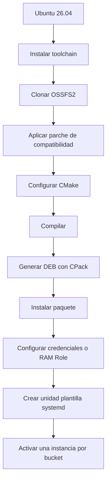
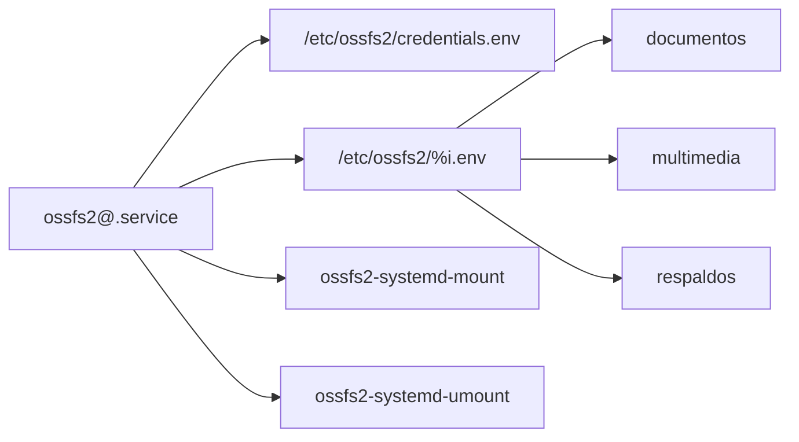

import Aside from "@rgglez/astro-aside";

## Introducción

OSSFS2 es el cliente de alto rendimiento de Alibaba Cloud para montar buckets de Aliyun Object Storage Service (OSS) como un sistema de archivos local mediante FUSE. Esta guía cubre el procedimiento completo en Ubuntu 26.04: compilación desde fuentes, adaptación a una toolchain moderna, creación de un paquete `.deb` con CPack y administración de varios montajes mediante una unidad plantilla de systemd.

<Aside type="warning">

El repositorio oficial indica que OSSFS2 se prueba con GCC 9 a GCC 13. Ubuntu 26.04 incorpora una versión más reciente de GCC y de `libstdc++`. El parche presentado aquí es una adaptación local de compatibilidad para que OSSFS2 pueda ser compilado; no es una corrección oficial upstream. Mantenga un registro del commit y del parche aplicado para futuras actualizaciones.

</Aside>

<Aside type="warning">

OSSFS2 no ofrece semántica POSIX completa. No debe utilizarse como sustituto directo de un disco local para bases de datos, bloqueos complejos, renombrados atómicos o escrituras concurrentes no coordinadas sobre el mismo objeto.

</Aside>




---

## Tabla de contenido

---

## 1. Instalar dependencias

```bash
# Actualiza el índice local de paquetes.
sudo apt update

# Instala el compilador, CMake, Git, patch, FUSE 3 y herramientas Debian.
sudo apt install \
  build-essential \
  cmake \
  git \
  patch \
  pkg-config \
  libfuse3-dev \
  libaio-dev \
  libssl-dev \
  dpkg-dev \
  fakeroot
```

- `sudo` ejecuta el comando con privilegios administrativos.
- `apt update` actualiza los índices de los repositorios.
- `apt install` instala los paquetes indicados.
- `build-essential` aporta GCC, G++, Make y cabeceras básicas.
- `cmake` genera el sistema de construcción.
- `git` descarga el repositorio.
- `patch` aplica diferencias unificadas.
- `pkg-config` localiza bibliotecas.
- `libfuse3-dev`, `libaio-dev` y `libssl-dev` aportan cabeceras de desarrollo.
- `dpkg-dev` y `fakeroot` sirven para trabajar con paquetes Debian.
- La barra invertida `\` continúa el comando en la línea siguiente.

Comprueba las herramientas:

```bash
# Muestra la versión del compilador de C++.
c++ --version

# Muestra la versión de CMake.
cmake --version

# Localiza la biblioteca estándar estática requerida por el proyecto.
g++ -print-file-name=libstdc++.a
```

- `--version` solicita la versión.
- `-print-file-name=libstdc++.a` hace que G++ resuelva la ruta de la biblioteca estándar estática según su propia configuración.

## 2. Descargar el árbol de fuentes

```bash
# Crea un directorio administrativo para fuentes locales.
sudo install -d -m 0755 -o root -g root /usr/local/src

# Entra al directorio de fuentes.
cd /usr/local/src

# Clona el repositorio oficial en el subdirectorio ossfs.
sudo git clone https://github.com/aliyun/ossfs.git ossfs

# Transfiere el árbol al usuario administrador actual.
sudo chown -R "$USER":"$(id -gn)" /usr/local/src/ossfs

# Entra al repositorio.
cd /usr/local/src/ossfs

# Registra el commit exacto que se compilará.
git rev-parse HEAD
```

- En `install`:
  - `-d` crea un directorio.
  - `-m 0755` fija los permisos.
  - `-o root` define el propietario.
  - `-g root` define el grupo.
- `git clone` recibe la URL y el nombre local.
- `chown -R` cambia el propietario y el grupo recursivamente.
- `$USER` contiene el usuario actual.
- `$(id -gn)` obtiene su grupo principal.
- `git rev-parse HEAD` imprime el hash del commit seleccionado.

## 3. Por qué hace falta el parche

Con la toolchain moderna pueden aparecer errores como:

```text
error: ‘uint64_t’ does not name a type
error: ‘sort’ is not a member of ‘std’
error: no matching function for call to ‘min(<brace-enclosed initializer list>)’
```

Las causas observadas son inclusiones transitivas ausentes:

- PhotonLibOS usa `uint64_t` sin incluir explícitamente `<cstdint>`;
- algunos archivos de OSSFS2 usan `std::sort` y la sobrecarga de `std::min` con lista sin incluir `<algorithm>`;
- toolchains anteriores exponían accidentalmente esos símbolos mediante otras cabeceras;
- la biblioteca estándar reciente ya no garantiza esas inclusiones indirectas.

## 4. Y ahora, el parche

```bash
# Crea un directorio para adaptaciones locales.
sudo install -d -m 0755 -o root -g root /usr/local/src/patches

# Transfiere el directorio al usuario actual.
sudo chown "$USER":"$(id -gn)" /usr/local/src/patches

# Abre el archivo del parche con el editor configurado.
${EDITOR:-nano} /usr/local/src/patches/ossfs-ubuntu2604-compat.patch
```

- `install -d` crea el directorio.
- `chown` cambia el propietario y el grupo.
- `${EDITOR:-nano}` usa la variable `EDITOR` o `nano` como valor alternativo.

Contenido completo:

```diff title="/usr/local/src/patches/ossfs-ubuntu2604-compat.patch"
# /usr/local/src/patches/ossfs-ubuntu2604-compat.patch
diff --git a/CMakeLists.txt b/CMakeLists.txt
--- a/CMakeLists.txt
+++ b/CMakeLists.txt
@@ -168,6 +168,14 @@

 add_library(ossfs2_common STATIC ${ossfs2_common_srcs})

+# PhotonLibOS and some ossfs2 sources rely on transitive inclusion of
+# standard headers. Preserve each "-include <header>" option as an
+# indivisible shell group so CMake's option de-duplication does not
+# separate the option from its argument.
+target_compile_options(ossfs2_common PRIVATE
+  "$<$<COMPILE_LANGUAGE:CXX>:SHELL:-include cstdint>"
+  "$<$<COMPILE_LANGUAGE:CXX>:SHELL:-include algorithm>")
+
 target_sources(ossfs2_common PRIVATE
   ${PHOTON_PATCHED_SRC_DIR}/ecosystem/oss_patched.cpp
 )
@@ -182,6 +190,11 @@
   src/*.cpp)

 add_executable(ossfs2 ${ossfs2_srcs})
+
+# The executable sources also include PhotonLibOS public headers directly.
+target_compile_options(ossfs2 PRIVATE
+  "$<$<COMPILE_LANGUAGE:CXX>:SHELL:-include cstdint>"
+  "$<$<COMPILE_LANGUAGE:CXX>:SHELL:-include algorithm>")

 # we will install libfuse to /usr/local/lib64/ossfs2, make sure ossfs2
 # can find it instead of using the system one
```

`target_compile_options` aplica opciones al objetivo indicado; `PRIVATE` evita propagarlas a sus consumidores y `$<COMPILE_LANGUAGE:CXX>` las limita a C++. El prefijo de CMake `SHELL:` agrupa cada `-include` con su cabecera durante la deduplicación; no selecciona ni ejecuta un intérprete de órdenes.

## 5. Verificar y aplicar el parche con `patch`

```bash
# Entra al árbol original.
cd /usr/local/src/ossfs

# Verifica que el árbol no tenga cambios locales.
git status --short

# Simula la aplicación sin modificar archivos.
patch --dry-run -p1 \
  < /usr/local/src/patches/ossfs-ubuntu2604-compat.patch

# Aplica el parche real.
patch -p1 \
  < /usr/local/src/patches/ossfs-ubuntu2604-compat.patch

# Muestra el cambio efectuado.
git diff -- CMakeLists.txt
```

- `git status --short` muestra un estado compacto.
- `patch --dry-run` simula la aplicación.
- `-p1` elimina el primer componente de rutas como `a/CMakeLists.txt`.
- `<` redirige el parche a la entrada estándar.
- `git diff -- CMakeLists.txt` limita la comparación a ese archivo.

Para revertirlo:

```bash
# Invierte el parche aplicado.
patch -R -p1 \
  < /usr/local/src/patches/ossfs-ubuntu2604-compat.patch
```

- `-R` aplica el parche en sentido inverso.

## 6. Configurar CMake 4

CMake 4 retiró la compatibilidad con políticas anteriores a CMake 3.5. La dependencia `gflags 2.2.2` declara una versión antigua. La variable `CMAKE_POLICY_VERSION_MINIMUM=3.5` permite configurar el subproyecto sin modificar su fuente.

```bash
# Entra al repositorio.
cd /usr/local/src/ossfs

# Elimina cualquier árbol binario anterior.
rm -rf build

# Exporta el mínimo de políticas para CMake y subprocesos externos.
export CMAKE_POLICY_VERSION_MINIMUM=3.5

# Configura fuentes, salida, tipo Release y generador DEB.
cmake \
  -S . \
  -B build \
  -DCMAKE_BUILD_TYPE=Release \
  -DCPACK_GENERATOR=DEB \
  -DCMAKE_EXPORT_COMPILE_COMMANDS=ON
```

- `rm -rf` elimina recursivamente sin pedir confirmación.
- `export` propaga la variable a procesos hijos, incluidos los procesos CMake ejecutados al compilar dependencias externas.
- `-S .` selecciona el árbol fuente.
- `-B build` selecciona el árbol binario.
- `-DCMAKE_BUILD_TYPE=Release` activa la optimización.
- `-DCPACK_GENERATOR=DEB` hace que las ramas Debian del `CMakeLists.txt` se evalúen durante la configuración.
- `-DCMAKE_EXPORT_COMPILE_COMMANDS=ON` genera `compile_commands.json`.

<Aside type="warning">

Conserva `CMAKE_POLICY_VERSION_MINIMUM=3.5` también durante la compilación, porque las dependencias externas pueden ejecutar nuevos procesos CMake desde `cmake --build`.

</Aside>

## 7. Compilar

```bash
# Reafirma la variable para la sesión actual.
export CMAKE_POLICY_VERSION_MINIMUM=3.5

# Compila usando todos los procesadores lógicos disponibles.
cmake --build build --parallel "$(nproc)"
```

- `cmake --build build` ejecuta el sistema de construcción generado.
- `--parallel` habilita el paralelismo.
- `$(nproc)` sustituye el número de procesadores lógicos.

Verifica el binario:

```bash
# Identifica el formato y arquitectura del ejecutable.
file build/ossfs2

# Muestra la versión sin instalarlo.
build/ossfs2 --version
```

- `file` inspecciona el ejecutable.
- `--version` muestra la versión de OSSFS2.

## 8. Generar un paquete DEB con CPack

Normalmente creo paquetes de instalación con `checkinstall`, pero el proyecto ya contiene reglas de instalación y configuración CPack. Por eso CPack resulta más reproducible que `checkinstall`.

```bash
# Entra al árbol de construcción.
cd /usr/local/src/ossfs/build

# Comprueba que las variables Debian quedaron en CPackConfig.cmake.
grep -E \
  'CPACK_GENERATOR|CPACK_DEBIAN_PACKAGE_MAINTAINER|CPACK_DEBIAN_PACKAGE_DEPENDS' \
  CPackConfig.cmake

# Genera sólo el componente principal en formato DEB.
cpack \
  -G DEB \
  -C Release \
  -D CPACK_COMPONENTS_ALL=main
```

- `grep -E` usa expresiones regulares extendidas.
- En la expresión regular, `|` representa alternativas.
- En `cpack`:
  - `-G DEB` selecciona el generador Debian.
  - `-C Release` selecciona la configuración Release.
  - `-D CPACK_COMPONENTS_ALL=main` limita el paquete al componente principal.

<Aside type="note">

Si CPack afirma que falta el mantenedor o que no existen dependencias, reconfigura el árbol de construcción y vuelve a generar el paquete:

```bash
# Regenera la configuración e incluye los metadatos del paquete Debian.
cmake \
  -S /usr/local/src/ossfs \
  -B /usr/local/src/ossfs/build \
  -DCMAKE_BUILD_TYPE=Release \
  -DCPACK_GENERATOR=DEB

# Ejecuta CPack desde el árbol reconfigurado.
cd /usr/local/src/ossfs/build
cpack \
  -G DEB \
  -C Release \
  -D CPACK_COMPONENTS_ALL=main
```

- `-S` y `-B` seleccionan los árboles fuente y de construcción.
- `-DCPACK_GENERATOR=DEB` hace que CMake incluya la configuración específica de Debian en `CPackConfig.cmake`.
- `cpack` genera de nuevo el componente principal como paquete DEB.

</Aside>

Localiza e inspecciona:

```bash
# Guarda la ruta del primer paquete principal encontrado.
PACKAGE_PATH="$(find . -maxdepth 1 -type f -name 'ossfs2_*.deb' | head -n1)"

# Muestra metadatos del paquete.
dpkg-deb --info "$PACKAGE_PATH"

# Muestra los archivos que instalará.
dpkg-deb --contents "$PACKAGE_PATH"

# Muestra campos concretos del control Debian.
dpkg-deb -f "$PACKAGE_PATH" \
  Package Version Architecture Maintainer Depends
```

- `find -maxdepth 1` no desciende a subdirectorios.
- `-type f` selecciona archivos.
- `-name` filtra por nombre.
- `head -n1` toma la primera coincidencia.
- `dpkg-deb --info` muestra metadatos.
- `--contents` lista archivos.
- `-f` extrae campos.

## 9. Instalar el paquete

```bash
# Instala el archivo local y permite que APT resuelva dependencias.
sudo apt install "$PACKAGE_PATH"

# Localiza el ejecutable instalado.
command -v ossfs2

# Comprueba la versión instalada.
ossfs2 --version

# Consulta el estado del paquete en dpkg.
dpkg-query -W \
  -f='${Package}\t${Version}\t${Status}\n' \
  ossfs2
```

- `apt install` acepta una ruta local.
- `command -v` resuelve el ejecutable en `PATH`.
- `dpkg-query -W` consulta el paquete.
- `-f` define el formato de salida.
- `\t` agrega tabuladores.
- `\n` agrega un salto de línea.

## 10. Diseño de systemd para varios buckets

Se usará una unidad plantilla, dos scripts comunes, un archivo opcional de credenciales y un archivo por instancia:



`%i` se sustituye por el nombre después de `@`. `ossfs2@documentos.service` leerá `/etc/ossfs2/documentos.env`.

## 11. Crear directorios

```bash
# Crea el directorio de configuración restringido.
sudo install -d -m 0750 -o root -g root /etc/ossfs2

# Crea el directorio raíz de logs.
sudo install -d -m 0755 -o root -g root /var/log/ossfs2

# Crea el directorio raíz de puntos de montaje.
sudo install -d -m 0755 -o root -g root /mnt/oss
```

- `0750` permite el acceso a `root` y a su grupo.
- `0755` permite que otros usuarios recorran los directorios, aunque los permisos efectivos de los archivos dependerán del montaje.

## 12. Guardar credenciales

<Aside type="note" label="Nota">

En una ECS es preferible un RAM Role porque OSSFS2 obtiene credenciales STS temporales desde los metadatos de la instancia y no requiere AccessKeys permanentes. OSSFS2 admite esta autenticación desde la versión 2.0.2.

1. En la consola de RAM, abre **Identidades > Roles** y crea un rol para un servicio de Alibaba Cloud. Selecciona **ECS** como servicio de confianza y asigna un nombre, por ejemplo, `EcsRamRoleOssDocumentos`.
2. Adjunta al rol una política personalizada que permita únicamente las operaciones necesarias sobre el bucket y sus objetos. Para un montaje de sólo lectura puede utilizarse `AliyunOSSReadOnlyAccess`, aunque una política limitada al bucket concreto ofrece menor privilegio.
3. En la consola de ECS, abre la instancia y selecciona **Configuración de instancia > Adjuntar/separar RAM Role**. Adjunta el rol creado. Una instancia ECS sólo puede tener un RAM Role asociado.
4. En `/etc/ossfs2/documentos.env`, define `OSSFS_RAM_ROLE=EcsRamRoleOssDocumentos`. No definas `OSS_ACCESS_KEY_ID` ni `OSS_ACCESS_KEY_SECRET`; el archivo `/etc/ossfs2/credentials.env` puede quedar ausente porque la unidad lo declara opcional.
5. Reinicia el montaje y verifica que pueda acceder al bucket:

   ```bash
   # Reinicia la instancia para que OSSFS2 use el RAM Role.
   sudo systemctl restart ossfs2@documentos.service

   # Revisa los mensajes de autenticación o montaje.
   sudo journalctl -u ossfs2@documentos.service \
     -b --no-pager

   # Confirma que el bucket quedó montado.
   findmnt /mnt/oss/documentos
   ```

   - `restart` vuelve a ejecutar el montaje con la configuración actualizada.
   - `journalctl` permite detectar permisos insuficientes o errores al obtener las credenciales temporales.
   - `findmnt` confirma que el punto de montaje está activo.

Consulta el procedimiento oficial para <a href="https://www.alibabacloud.com/help/en/ecs/user-guide/attach-an-instance-ram-role-to-an-ecs-instance" target="_blank" rel="noopener noreferrer">crear y adjuntar un RAM Role a una ECS</a> y la <a href="https://www.alibabacloud.com/help/en/oss/developer-reference/configure-ossfs-2-0" target="_blank" rel="noopener noreferrer">configuración de OSSFS2 con un RAM Role</a>.

</Aside>

Crea un archivo restringido:

```bash
# Crea un archivo vacío propiedad de root y legible sólo por root.
sudo install -m 0600 -o root -g root \
  /dev/null /etc/ossfs2/credentials.env

# Edita el archivo de forma administrativa.
sudoedit /etc/ossfs2/credentials.env
```

- `0600` concede lectura y escritura sólo a `root`.
- `sudoedit` edita una copia temporal con el editor del usuario y la instala de forma segura.

Contenido:

```ini title="/etc/ossfs2/credentials.env"
# Identificador público de la pareja AccessKey.
OSS_ACCESS_KEY_ID=LTAI_REEMPLAZAR

# Secreto privado correspondiente al identificador anterior.
OSS_ACCESS_KEY_SECRET=REEMPLAZAR_CON_SECRETO
```

Las líneas con `#` son comentarios. No agregues espacios alrededor de `=` y no publiques este archivo.

## 13. Script común de montaje

```bash
# Crea el script vacío con permisos ejecutables.
sudo install -m 0755 -o root -g root \
  /dev/null /usr/local/sbin/ossfs2-systemd-mount

# Edita el script.
sudoedit /usr/local/sbin/ossfs2-systemd-mount
```

`/usr/local/sbin/ossfs2-systemd-mount` lleva el siguiente contenido:

```bash title="/usr/local/sbin/ossfs2-systemd-mount"
#!/usr/bin/env bash
# Selecciona Bash mediante el PATH.

set -euo pipefail
# Termina ante errores, variables ausentes o fallos en tuberías.

OSSFS_BINARY=/usr/local/bin/ossfs2
# Define la ruta absoluta al ejecutable instalado.

required_variables=(
# Inicia la lista de variables obligatorias.
  OSSFS_BUCKET
# Nombre real del bucket.
  OSSFS_ENDPOINT
# Endpoint regional de OSS.
  OSSFS_MOUNTPOINT
# Directorio local de montaje.
  OSSFS_LOG_DIR
# Directorio exclusivo de logs.
  OSSFS_FILE_MODE
# Permisos octales para los archivos del bucket.
  OSSFS_DIR_MODE
# Permisos octales para los directorios del bucket.
)
# Finaliza la lista.

for variable in "${required_variables[@]}"; do
# Recorre los nombres obligatorios.
  if [[ -z "${!variable:-}" ]]; then
# Comprueba indirectamente si cada variable está vacía.
    printf 'Variable obligatoria ausente: %s\n' "$variable" >&2
# Escribe el error en stderr.
    exit 1
# Termina indicando fallo.
  fi
# Finaliza la comprobación.
done
# Finaliza el recorrido.

for variable in OSSFS_FILE_MODE OSSFS_DIR_MODE; do
# Recorre las variables que contienen permisos.
  if [[ ! "${!variable}" =~ ^0[0-7]{3}$ ]]; then
# Exige cuatro dígitos octales, por ejemplo 0644 o 0750.
    printf '%s debe ser un modo octal de cuatro dígitos (por ejemplo, 0644): %s\n' \
      "$variable" "${!variable}" >&2
# Explica el formato esperado y muestra el valor no válido.
    exit 1
# Impide montar con permisos ambiguos o incorrectos.
  fi
# Finaliza la validación.
done
# Finaliza el recorrido de los modos.

if [[ ! -x "$OSSFS_BINARY" ]]; then
# Comprueba que el ejecutable exista.
  printf 'Ejecutable no válido: %s\n' "$OSSFS_BINARY" >&2
# Informa la ruta problemática.
  exit 1
# Termina con fallo.
fi
# Finaliza la comprobación.

install -d -m 0755 -o root -g root "$OSSFS_MOUNTPOINT"
# Crea el punto de montaje si no existe.

install -d -m 0755 -o root -g root "$OSSFS_LOG_DIR"
# Crea el directorio de logs de la instancia.

if mountpoint -q "$OSSFS_MOUNTPOINT"; then
# Comprueba silenciosamente si ya está montado.
  printf '%s ya está montado.\n' "$OSSFS_MOUNTPOINT"
# Registra que no hay trabajo pendiente.
  exit 0
# Termina con éxito.
fi
# Finaliza la comprobación.

args=(
# Inicia el arreglo de argumentos.
  mount
# Selecciona el subcomando mount.
  "$OSSFS_MOUNTPOINT"
# Indica el punto de montaje.
  "--oss_endpoint=$OSSFS_ENDPOINT"
# Indica el endpoint OSS.
  "--oss_bucket=$OSSFS_BUCKET"
# Indica el bucket.
  "--log_dir=$OSSFS_LOG_DIR"
# Separa los logs por instancia.
  "--file_mode=$OSSFS_FILE_MODE"
# Fija los permisos que OSSFS2 muestra para todos los archivos.
  "--dir_mode=$OSSFS_DIR_MODE"
# Fija los permisos que OSSFS2 muestra para todos los directorios.
)
# Finaliza el arreglo.

if [[ -n "${OSSFS_RAM_ROLE:-}" ]]; then
# Comprueba si se definió un RAM Role.
  args+=("--ram_role=$OSSFS_RAM_ROLE")
# Añade el rol al comando.
fi
# Finaliza la opción de RAM Role.

exec "$OSSFS_BINARY" "${args[@]}"
# Sustituye el shell por OSSFS2 y conserva su código de salida.
```

- `set -euo pipefail` activa el modo estricto.
- `${!variable:-}` obtiene indirectamente el valor de una variable.
- `>&2` redirige a stderr.
- `mountpoint -q` comprueba sin imprimir.
- Los arreglos preservan los límites de los argumentos.
- `file_mode` y `dir_mode` están disponibles en OSSFS2 2.0.1 o posterior y fijan los permisos globales que presenta el montaje; no son una `umask`.
- `exec` reemplaza el shell por OSSFS2.

Valida:

```bash
# Analiza la sintaxis sin ejecutar el script.
sudo bash -n /usr/local/sbin/ossfs2-systemd-mount
```

- `bash -n` sólo valida la sintaxis.

## 14. Script común de desmontaje

```bash
# Crea el script ejecutable.
sudo install -m 0755 -o root -g root \
  /dev/null /usr/local/sbin/ossfs2-systemd-umount

# Edita el script.
sudoedit /usr/local/sbin/ossfs2-systemd-umount
```

Contenido:

```bash title="/usr/local/sbin/ossfs2-systemd-umount"
#!/usr/bin/env bash

# Activa modo estricto.
set -euo pipefail

# Comprueba que exista la variable del punto de montaje.
if [[ -z "${OSSFS_MOUNTPOINT:-}" ]]; then
  # Informa el error en stderr.
  echo 'OSSFS_MOUNTPOINT no está definido.' >&2
  # Termina con fallo.
  exit 1
# Finaliza la validación.
fi

# Comprueba si ya está desmontado.
if ! mountpoint -q "$OSSFS_MOUNTPOINT"; then
  # Informa que no hay trabajo pendiente.
  printf '%s no está montado.\n' "$OSSFS_MOUNTPOINT"
  # Termina con éxito.
  exit 0
# Finaliza la comprobación.
fi

# Desmonta el sistema de archivos.
umount "$OSSFS_MOUNTPOINT"
```

## 15. Unidad plantilla

```bash
# Crea o edita la unidad plantilla.
sudoedit /etc/systemd/system/ossfs2@.service
```

Escribe el contenido:

```ini title="/etc/systemd/system/ossfs2@.service"
# Inicia metadatos y ordenamiento.
[Unit]

# %i se sustituye por el nombre de instancia.
Description=Montaje de Alibaba Cloud OSS mediante OSSFS2 para %i

# Registra la documentación principal.
Documentation=https://github.com/aliyun/ossfs

# Solicita que systemd intente alcanzar red operativa.
Wants=network-online.target

# Ordena el montaje después de network-online.target.
After=network-online.target

# Inicia la definición del servicio.
[Service]

# ExecStart realiza una operación finita.
Type=oneshot

# Carga credenciales; el prefijo - hace opcional el archivo.
EnvironmentFile=-/etc/ossfs2/credentials.env

# Carga la configuración obligatoria de la instancia.
EnvironmentFile=/etc/ossfs2/%i.env

# Ejecuta el script común de montaje.
ExecStart=/usr/local/sbin/ossfs2-systemd-mount

# Ejecuta el desmontaje al detener la unidad.
ExecStop=/usr/local/sbin/ossfs2-systemd-umount

# Conserva la unidad activa tras terminar ExecStart.
RemainAfterExit=yes

# Limita el arranque a 120 segundos.
TimeoutStartSec=120

# Limita el desmontaje a 60 segundos.
TimeoutStopSec=60

# Envía stdout al journal.
StandardOutput=journal

# Envía stderr al journal.
StandardError=journal

# Define cómo se habilita la unidad.
[Install]

# La vincula al arranque multiusuario.
WantedBy=multi-user.target
```

`Wants=` crea una dependencia débil. `After=` define orden. `Type=oneshot` y `RemainAfterExit=yes` permiten representar un montaje persistente creado por una orden finita. El prefijo `-` en `EnvironmentFile` permite omitir credenciales cuando se usa RAM Role.

Valida y recarga:

```bash
# Valida la unidad.
sudo systemd-analyze verify \
  /etc/systemd/system/ossfs2@.service

# Recarga la configuración del administrador de servicios.
sudo systemctl daemon-reload
```

- `systemd-analyze verify` detecta errores.
- `daemon-reload` vuelve a leer las unidades.

## 16. Archivo por bucket

Ejemplo `documentos`:

```bash
# Crea un archivo restringido para la instancia.
sudo install -m 0600 -o root -g root \
  /dev/null /etc/ossfs2/documentos.env

# Edita sus variables.
sudoedit /etc/ossfs2/documentos.env
```

Contenido:

```ini title="/etc/ossfs2/documentos.env"
# Nombre real del bucket.
OSSFS_BUCKET=bucket-documentos-ejemplo

# Endpoint de la región; usa -internal sólo con conectividad interna.
OSSFS_ENDPOINT=oss-cn-region-internal.aliyuncs.com

# Punto de montaje local exclusivo.
OSSFS_MOUNTPOINT=/mnt/oss/documentos

# Directorio exclusivo de logs.
OSSFS_LOG_DIR=/var/log/ossfs2/documentos

# Permisos para todos los archivos visibles en el montaje.
OSSFS_FILE_MODE=0640

# Permisos para todos los directorios visibles en el montaje.
OSSFS_DIR_MODE=0750

# Descomenta para usar RAM Role en lugar de AccessKeys.
# OSSFS_RAM_ROLE=rol-oss-ejemplo
```

Repite el patrón con `/etc/ossfs2/multimedia.env`, `/etc/ossfs2/respaldos.env` u otros nombres. Cada instancia debe tener punto de montaje y directorio de logs propios. Ajusta `OSSFS_FILE_MODE` y `OSSFS_DIR_MODE` según el acceso que necesite cada bucket; los valores se aplican globalmente a los archivos y directorios que OSSFS2 presenta, incluidos los recién creados.

## 17. Probar y habilitar montajes

```bash
# Inicia una instancia sin habilitarla todavía.
sudo systemctl start ossfs2@documentos.service

# Muestra su estado.
systemctl status ossfs2@documentos.service

# Muestra los logs del arranque actual.
sudo journalctl -u ossfs2@documentos.service \
  -b --no-pager

# Comprueba el montaje.
findmnt /mnt/oss/documentos

# Lista el contenido.
ls -la /mnt/oss/documentos
```

- `start` inicia la instancia.
- `status` muestra su estado.
- En `journalctl`:
  - `-u` filtra por unidad.
  - `-b` limita los resultados al arranque actual.
  - `--no-pager` imprime directamente.
- `findmnt` consulta la tabla de montajes.
- `ls -la` usa el formato largo e incluye archivos ocultos.

Prueba escritura y lectura:

```bash
# Crea un objeto de prueba.
printf 'Prueba de OSSFS2 con systemd.\n' \
  | sudo tee /mnt/oss/documentos/prueba.txt >/dev/null

# Lee el objeto.
sudo cat /mnt/oss/documentos/prueba.txt

# Elimina el objeto.
sudo rm /mnt/oss/documentos/prueba.txt
```

- `printf` genera texto.
- `|` conecta la salida con `tee`.
- `tee` escribe con privilegios.
- `>/dev/null` oculta su copia por stdout.
- `cat` lee el archivo.
- `rm` lo elimina.

Habilita varias instancias:

```bash
# Habilita e inicia tres montajes independientes.
sudo systemctl enable --now \
  ossfs2@documentos.service \
  ossfs2@multimedia.service \
  ossfs2@respaldos.service

# Lista todas las instancias cargadas.
systemctl list-units 'ossfs2@*.service' --all

# Muestra todos los submontajes bajo /mnt/oss.
findmnt --submounts /mnt/oss
```

- `enable` crea enlaces para el arranque.
- `--now` inicia las unidades inmediatamente.
- `list-units` lista las unidades.
- `--all` incluye las unidades inactivas.
- `findmnt --submounts` incluye los montajes descendientes.

## 18. Operación diaria

```bash
# Detiene y desmonta una sola instancia.
sudo systemctl stop ossfs2@multimedia.service

# Reinicia una instancia.
sudo systemctl restart ossfs2@multimedia.service

# Deshabilita y detiene una instancia.
sudo systemctl disable --now ossfs2@multimedia.service

# Sigue los logs en tiempo real.
sudo journalctl -u ossfs2@documentos.service -f
```

- `stop` ejecuta `ExecStop`.
- `restart` desmonta y vuelve a montar.
- `disable --now` elimina la habilitación y detiene la unidad.
- `journalctl -f` sigue los mensajes nuevos.

## 19. Diagnóstico

Si la compilación falla en gflags:

```bash
# Comprueba la variable de compatibilidad CMake.
printf '%s\n' "${CMAKE_POLICY_VERSION_MINIMUM:-no definida}"
```

- `${VAR:-alternativa}` usa el valor alternativo cuando la variable no existe.

Si aparece `uint64_t does not name a type`:

```bash
# Comprueba las opciones añadidas por el parche.
grep -n 'SHELL:-include' /usr/local/src/ossfs/CMakeLists.txt
```

- `-n` agrega números de línea.
- Deben existir entradas para `ossfs2_common` y `ossfs2`.

Si CPack no encuentra mantenedor:

```bash
# Reconfigura activando explícitamente el generador DEB.
cmake -S /usr/local/src/ossfs \
  -B /usr/local/src/ossfs/build \
  -DCMAKE_BUILD_TYPE=Release \
  -DCPACK_GENERATOR=DEB
```

- `-S` y `-B` seleccionan los árboles fuente y binario, respectivamente.
- `-DCPACK_GENERATOR=DEB` hace que se evalúe la configuración Debian.

Si el desmontaje indica que el destino está ocupado:

```bash
# Muestra procesos que utilizan el montaje.
sudo fuser -vm /mnt/oss/documentos
```

- `-v` usa el formato detallado.
- `-m` trata la ruta como un sistema de archivos.

## 20. Seguridad y limitaciones

- Prefiere un RAM Role de ECS frente a AccessKeys permanentes.
- Aplica privilegio mínimo sobre buckets y operaciones.
- Mantén `/etc/ossfs2/credentials.env` con permisos `0600`.
- No pases secretos como argumentos de línea de comandos.
- Usa un `log_dir` diferente por proceso OSSFS2.
- Conserva el hash del commit y el parche aplicado.
- Revalida el parche al actualizar el repositorio.
- No utilices OSSFS2 para una base de datos activa.
- Coordina accesos cuando varios clientes monten el mismo bucket.

## Apéndice A. Referencias oficiales verificadas

1. Repositorio oficial de OSSFS2: <a href="https://github.com/aliyun/ossfs" target="_blank" rel="noopener noreferrer">https://github.com/aliyun/ossfs</a>
2. Opciones de montaje de OSSFS2: <a href="https://help.aliyun.com/en/oss/developer-reference/description-of-mount-options" target="_blank" rel="noopener noreferrer">https://help.aliyun.com/en/oss/developer-reference/description-of-mount-options</a>
3. Montaje automático de OSSFS2: <a href="https://help.aliyun.com/en/oss/developer-reference/configure-auto-mount-on-for-ossfs-2-0" target="_blank" rel="noopener noreferrer">https://help.aliyun.com/en/oss/developer-reference/configure-auto-mount-on-for-ossfs-2-0</a>
4. Generador DEB de CPack: <a href="https://cmake.org/cmake/help/latest/cpack_gen/deb.html" target="_blank" rel="noopener noreferrer">https://cmake.org/cmake/help/latest/cpack_gen/deb.html</a>
5. `CMAKE_POLICY_VERSION_MINIMUM`: <a href="https://cmake.org/cmake/help/latest/variable/CMAKE_POLICY_VERSION_MINIMUM.html" target="_blank" rel="noopener noreferrer">https://cmake.org/cmake/help/latest/variable/CMAKE_POLICY_VERSION_MINIMUM.html</a>
6. `target_compile_options` y grupos `SHELL:`: <a href="https://cmake.org/cmake/help/latest/command/target_compile_options.html" target="_blank" rel="noopener noreferrer">https://cmake.org/cmake/help/latest/command/target_compile_options.html</a>
7. Unidades de servicio de systemd: <a href="https://www.freedesktop.org/software/systemd/man/latest/systemd.service.html" target="_blank" rel="noopener noreferrer">https://www.freedesktop.org/software/systemd/man/latest/systemd.service.html</a>
8. Plantillas, instancias y `%i`: <a href="https://www.freedesktop.org/software/systemd/man/latest/systemd.unit.html" target="_blank" rel="noopener noreferrer">https://www.freedesktop.org/software/systemd/man/latest/systemd.unit.html</a>
9. `EnvironmentFile` y entorno de ejecución: <a href="https://www.freedesktop.org/software/systemd/man/latest/systemd.exec.html" target="_blank" rel="noopener noreferrer">https://www.freedesktop.org/software/systemd/man/latest/systemd.exec.html</a>
10. `network-online.target`: <a href="https://www.freedesktop.org/software/systemd/man/latest/systemd.special.html" target="_blank" rel="noopener noreferrer">https://www.freedesktop.org/software/systemd/man/latest/systemd.special.html</a>
11. Administración con `systemctl`: <a href="https://www.freedesktop.org/software/systemd/man/latest/systemctl.html" target="_blank" rel="noopener noreferrer">https://www.freedesktop.org/software/systemd/man/latest/systemctl.html</a>
12. Consulta de registros con `journalctl`: <a href="https://www.freedesktop.org/software/systemd/man/latest/journalctl.html" target="_blank" rel="noopener noreferrer">https://www.freedesktop.org/software/systemd/man/latest/journalctl.html</a>

## Apéndice B. Secuencia resumida de compilación

```bash
# Entra al árbol original.
cd /usr/local/src/ossfs

# Simula el parche.
patch --dry-run -p1 \
  < /usr/local/src/patches/ossfs-ubuntu2604-compat.patch

# Aplica el parche.
patch -p1 \
  < /usr/local/src/patches/ossfs-ubuntu2604-compat.patch

# Elimina construcciones anteriores.
rm -rf build

# Exporta la compatibilidad requerida por CMake 4.
export CMAKE_POLICY_VERSION_MINIMUM=3.5

# Configura construcción y empaquetado Debian.
cmake -S . -B build \
  -DCMAKE_BUILD_TYPE=Release \
  -DCPACK_GENERATOR=DEB

# Compila en paralelo.
cmake --build build --parallel "$(nproc)"

# Entra al árbol binario.
cd build

# Genera el paquete principal.
cpack -G DEB -C Release \
  -D CPACK_COMPONENTS_ALL=main
```

- `patch --dry-run` valida el parche.
- `patch -p1` lo aplica.
- `rm -rf` elimina el árbol previo.
- `export` propaga la variable.
- `cmake -S/-B` configura la construcción.
- `cmake --build` compila.
- `cpack -G DEB` genera el paquete Debian.
