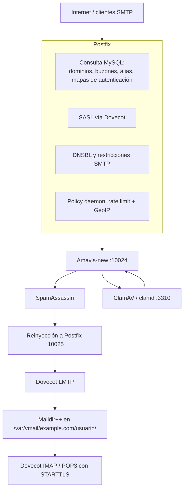

## Introducción

Esta guía explica cómo instalar y configurar una pila de correo compuesta por:

- **Postfix** como MTA, es decir, el servidor que recibe, enruta y entrega correo SMTP.
- **Dovecot** como servidor IMAP, POP3, LMTP y proveedor SASL para Postfix.
- **MySQL/MariaDB** como base de datos de dominios, buzones, alias y políticas. La guía asume que **MySQL ya está instalado y operativo**. No se cubre la instalación del servidor MySQL.
- **Maildir++** como formato de almacenamiento de buzones.
- **STARTTLS** para cifrado oportunista o requerido en SMTP, Submission, IMAP y POP3.
- **SASL** para autenticación SMTP de usuarios.
- **Amavis-new** como filtro de contenido.
- **SpamAssassin** como motor antispam.
- **ClamAV** (`clamd`) como motor antivirus invocado por Amavis.
- **DNSBL** para rechazo temprano de direcciones IP listadas en listas negras DNS.
- **Rate limiting** de envíos mediante una política externa respaldada por MySQL.
- **Control GeoIP** mediante una política externa respaldada por MaxMind GeoLite2 o una base similar.

---

## Tabla de contenido

---

## Arquitectura de la pila de correo

La arquitectura resultante será:



## Software utilizado

En la guía se utilizará el siguiente software y versiones aproximadas. Es preferible que instales los paquetes desde los repositorios oficiales de tu distribución para mantenerlos actualizados automáticamente.

| Software | Función | Enlace |
|---|---|---|
| Postfix | MTA: recibe, enruta y entrega correo SMTP | [postfix.org](https://www.postfix.org/) |
| Dovecot | Servidor IMAP/POP3/LMTP y proveedor SASL | [dovecot.org](https://www.dovecot.org/) |
| MySQL | Base de datos de dominios, buzones, alias y políticas | [mysql.com](https://www.mysql.com/) |
| MariaDB | Alternativa compatible a MySQL | [mariadb.org](https://mariadb.org/) |
| Amavis (amavisd-new) | Filtro de contenido entre Postfix y los motores antivirus/antispam | [gitlab.com/amavis/amavis](https://gitlab.com/amavis/amavis) |
| SpamAssassin | Motor antispam | [spamassassin.apache.org](https://spamassassin.apache.org/) |
| ClamAV (`clamd`) | Motor antivirus invocado por Amavis | [clamav.net](https://www.clamav.net/) |
| MaxMind GeoLite2 | Base de datos GeoIP para el control por país | [maxmind.com](https://www.maxmind.com/en/geoip-databases) |
| Let's Encrypt / Certbot | Emisión de certificados TLS para STARTTLS | [certbot.eff.org](https://certbot.eff.org/) |
| Python 3 | Runtime del policy daemon (rate limit + GeoIP) | [python.org](https://www.python.org/) |

## Supuestos de la guía

Usaremos estos valores de ejemplo:

| Concepto | Valor de ejemplo |
|---|---|
| Sistema operativo | Debian/Ubuntu moderno |
| Hostname del servidor | `mail.example.com` |
| Dominio de correo | `example.com` |
| Usuario virtual del sistema | `vmail` |
| Directorio de buzones | `/var/vmail` |
| Base de datos MySQL | `mailserver` |
| Usuario MySQL | `mailuser` |
| Contraseña MySQL | `CAMBIA_ESTA_PASSWORD` |
| Certificado TLS | `/etc/letsencrypt/live/mail.example.com/fullchain.pem` |
| Llave privada TLS | `/etc/letsencrypt/live/mail.example.com/privkey.pem` |

Ajusta todos los valores `example.com`, `mail.example.com` y `CAMBIA_ESTA_PASSWORD` a tu entorno real.

## Puertos usados

| Puerto | Servicio | Uso |
|---:|---|---|
| 25 | SMTP | Recepción de correo entre servidores |
| 587 | Submission | Envío autenticado de usuarios |
| 143 | IMAP | IMAP con STARTTLS |
| 110 | POP3 | POP3 con STARTTLS |
| 10024 | Amavis | Entrada de correo filtrado desde Postfix |
| 3310 | ClamAV (`clamd`) | Escaneo antivirus solicitado por Amavis (TCP local) |
| 10025 | Postfix | Reinyección desde Amavis |
| 24 | Dovecot LMTP | Entrega local desde Postfix a Dovecot |
| 10040 | Policy daemon | Rate limit y GeoIP (`check_policy_service`) |

En esta guía se configura STARTTLS en los puertos estándar. No se configura IMAPS en 993 ni POP3S en 995, aunque puedes habilitarlos si los necesitas.

---

# 1. Preparar el sistema

## 1.1. Actualizar el índice de paquetes

El siguiente comando actualiza el índice local de paquetes disponibles.

```bash
sudo apt update
```

Donde:

- `sudo`: ejecuta el comando con privilegios administrativos.
- `apt`: invoca el gestor de paquetes de Debian/Ubuntu.
- `update`: descarga la lista actualizada de paquetes desde los repositorios configurados.

## 1.2. Instalar Postfix, Dovecot, Amavis, SpamAssassin y ClamAV

El siguiente comando instala los componentes principales.

```bash
sudo apt install -y \
  postfix postfix-mysql \
  dovecot-core dovecot-imapd dovecot-pop3d dovecot-lmtpd dovecot-mysql \
  dovecot-sieve dovecot-managesieved \
  amavisd-new spamassassin spamc \
  clamav clamav-daemon clamav-freshclam \
  libnet-dns-perl libmail-spf-perl \
  pyzor razor \
  arj bzip2 cabextract cpio file gzip lzop nomarch p7zip-full rar unrar unzip zip
```

Donde:

- `sudo`: ejecuta el comando como administrador.
- `apt`: usa el gestor de paquetes.
- `install`: instala paquetes nuevos.
- `-y`: responde automáticamente “sí” a las preguntas de confirmación.
- `postfix`: instala el MTA Postfix.
- `postfix-mysql`: añade soporte MySQL a Postfix para mapas virtuales.
- `dovecot-core`: instala el núcleo de Dovecot.
- `dovecot-imapd`: habilita servidor IMAP.
- `dovecot-pop3d`: habilita servidor POP3.
- `dovecot-lmtpd`: habilita LMTP para entrega local desde Postfix.
- `dovecot-mysql`: permite que Dovecot consulte usuarios en MySQL.
- `dovecot-sieve`: soporte Sieve para filtros de usuario.
- `dovecot-managesieved`: servicio ManageSieve para administrar filtros.
- `amavisd-new`: filtro de contenido que conecta Postfix con antivirus/antispam.
- `spamassassin`: motor antispam.
- `spamc`: cliente ligero para consultar `spamd`.
- `clamav`: motor antivirus y utilidades de línea de comandos.
- `clamav-daemon`: demonio `clamd` que Amavis consulta para escanear.
- `clamav-freshclam`: servicio que descarga y actualiza las firmas de virus.
- `libnet-dns-perl`: dependencia útil para consultas DNS desde herramientas Perl.
- `libmail-spf-perl`: soporte SPF en componentes Perl.
- `pyzor`: sistema colaborativo de detección de spam.
- `razor`: sistema colaborativo de detección de spam.
- `arj`, `bzip2`, `cabextract`, `cpio`, `file`, `gzip`, `lzop`, `nomarch`, `p7zip-full`, `rar`, `unrar`, `unzip`, `zip`: herramientas que permiten a Amavis inspeccionar archivos comprimidos adjuntos.

Durante la instalación de Postfix, si aparece un asistente interactivo, selecciona:

```text
Internet Site
```

Y como nombre de sistema usa:

```text
mail.example.com
```

Después modificaremos la configuración manualmente.

---

# 2. Crear el usuario virtual `vmail`

No conviene crear un usuario Unix por cada buzón. Usaremos un solo usuario del sistema, llamado `vmail`, propietario de todos los buzones virtuales.

El siguiente comando crea el grupo y usuario virtual.

```bash
sudo groupadd -g 5000 vmail
```

Donde:

- `sudo`: ejecuta con privilegios administrativos.
- `groupadd`: crea un grupo Unix.
- `-g 5000`: asigna el GID numérico `5000`.
- `vmail`: nombre del grupo.

Ahora creamos el usuario.

```bash
sudo useradd -g vmail -u 5000 -d /var/vmail -m -s /usr/sbin/nologin vmail
```

Donde:

- `sudo`: ejecuta como administrador.
- `useradd`: crea un usuario del sistema.
- `-g vmail`: define el grupo principal del usuario.
- `-u 5000`: asigna el UID numérico `5000`.
- `-d /var/vmail`: define el directorio home del usuario.
- `-m`: crea el directorio home si no existe.
- `-s /usr/sbin/nologin`: impide login interactivo.
- `vmail`: nombre del usuario.

Aseguramos propiedad y permisos.

```bash
sudo chown -R vmail:vmail /var/vmail
```

Donde:

- `sudo`: privilegios administrativos.
- `chown`: cambia propietario y grupo.
- `-R`: aplica recursivamente.
- `vmail:vmail`: usuario y grupo propietarios.
- `/var/vmail`: ruta de buzones.

El siguiente comando ajusta permisos del directorio.

```bash
sudo chmod 750 /var/vmail
```

Donde:

- `sudo`: privilegios administrativos.
- `chmod`: cambia permisos.
- `750`: propietario puede leer/escribir/ejecutar; grupo puede leer/ejecutar; otros no tienen acceso.
- `/var/vmail`: ruta afectada.

---

# 3. Crear la base de datos de correo

La base de datos contendrá:

- dominios virtuales;
- buzones virtuales;
- alias;
- contraseñas;
- límites de envío;
- reglas GeoIP;
- registro de envíos para rate limiting.

Entra al cliente MySQL.

```bash
mysql -u root -p
```

Donde:

- `mysql`: abre el cliente de MySQL.
- `-u root`: usa el usuario `root`.
- `-p`: solicita contraseña.

Dentro de MySQL, ejecuta:

```sql
-- Crea la base de datos usada por Postfix, Dovecot y el policy daemon.
CREATE DATABASE mailserver
  CHARACTER SET utf8mb4
  COLLATE utf8mb4_unicode_ci;

-- Crea el usuario de aplicación.
CREATE USER 'mailuser'@'localhost'
  IDENTIFIED BY 'CAMBIA_ESTA_PASSWORD';

-- Otorga permisos sobre la base de datos de correo.
GRANT SELECT, INSERT, UPDATE, DELETE
  ON mailserver.*
  TO 'mailuser'@'localhost';

-- Aplica los cambios de privilegios.
FLUSH PRIVILEGES;

-- Selecciona la base de datos.
USE mailserver;

-- Tabla de dominios virtuales.
CREATE TABLE virtual_domains (
  id INT AUTO_INCREMENT PRIMARY KEY,
  name VARCHAR(255) NOT NULL UNIQUE,
  active TINYINT(1) NOT NULL DEFAULT 1
);

-- Tabla de buzones virtuales.
CREATE TABLE virtual_users (
  id INT AUTO_INCREMENT PRIMARY KEY,
  domain_id INT NOT NULL,
  email VARCHAR(255) NOT NULL UNIQUE,
  password VARCHAR(255) NOT NULL,
  quota_bytes BIGINT UNSIGNED NOT NULL DEFAULT 0,
  active TINYINT(1) NOT NULL DEFAULT 1,
  send_rate_limit_per_hour INT NOT NULL DEFAULT 200,
  created_at TIMESTAMP NOT NULL DEFAULT CURRENT_TIMESTAMP,
  FOREIGN KEY (domain_id) REFERENCES virtual_domains(id)
    ON DELETE CASCADE
);

-- Tabla de alias virtuales.
CREATE TABLE virtual_aliases (
  id INT AUTO_INCREMENT PRIMARY KEY,
  domain_id INT NOT NULL,
  source VARCHAR(255) NOT NULL,
  destination TEXT NOT NULL,
  active TINYINT(1) NOT NULL DEFAULT 1,
  FOREIGN KEY (domain_id) REFERENCES virtual_domains(id)
    ON DELETE CASCADE,
  -- source es la dirección completa (incluye dominio); no debe repetirse.
  UNIQUE KEY uniq_alias_source (domain_id, source)
);

-- Tabla para registrar envíos SMTP autenticados.
CREATE TABLE smtp_send_log (
  id BIGINT AUTO_INCREMENT PRIMARY KEY,
  sasl_username VARCHAR(255) NOT NULL,
  sender VARCHAR(255) NOT NULL,
  recipient VARCHAR(255) NOT NULL,
  client_address VARCHAR(64) NOT NULL,
  created_at TIMESTAMP NOT NULL DEFAULT CURRENT_TIMESTAMP,
  INDEX idx_user_time (sasl_username, created_at),
  INDEX idx_client_time (client_address, created_at)
);

-- Tabla de países permitidos o bloqueados, por dominio.
-- domain_id NULL = regla global (aplica a cualquier dominio sin regla propia).
-- domain_id con valor = regla específica de ese dominio (tenant).
CREATE TABLE geoip_policy (
  id INT AUTO_INCREMENT PRIMARY KEY,
  domain_id INT NULL,
  country_iso CHAR(2) NOT NULL,
  action ENUM('permit', 'reject') NOT NULL DEFAULT 'reject',
  description VARCHAR(255) NULL,
  active TINYINT(1) NOT NULL DEFAULT 1,
  UNIQUE KEY uniq_domain_country (domain_id, country_iso),
  FOREIGN KEY (domain_id) REFERENCES virtual_domains(id)
    ON DELETE CASCADE
);

-- Inserta un dominio de ejemplo.
INSERT INTO virtual_domains (name, active)
VALUES ('example.com', 1);

-- Inserta un usuario de ejemplo.
-- La contraseña debe generarse con doveadm pw, no escribirla en texto plano.
INSERT INTO virtual_users (
  domain_id,
  email,
  password,
  quota_bytes,
  active,
  send_rate_limit_per_hour
)
VALUES (
  1,
  'usuario@example.com',
  '{SHA512-CRYPT}$6$REEMPLAZA_ESTE_HASH',
  1073741824,
  1,
  200
);

-- Inserta un alias de ejemplo.
INSERT INTO virtual_aliases (
  domain_id,
  source,
  destination,
  active
)
VALUES (
  1,
  'postmaster@example.com',
  'usuario@example.com',
  1
);

-- Reglas GLOBALES (domain_id NULL): aplican a cualquier dominio sin regla propia.
-- Ejemplo: permitir México y Estados Unidos.
INSERT INTO geoip_policy (domain_id, country_iso, action, description, active)
VALUES
  (NULL, 'MX', 'permit', 'México permitido (global)', 1),
  (NULL, 'US', 'permit', 'Estados Unidos permitido (global)', 1);

-- Regla ESPECÍFICA de un dominio: sólo example.com (domain_id = 1) permite además Canadá.
-- Las reglas de dominio se combinan con las globales; para un país concreto,
-- la regla del dominio tiene prioridad sobre la global.
INSERT INTO geoip_policy (domain_id, country_iso, action, description, active)
VALUES
  (1, 'CA', 'permit', 'Canadá permitido sólo para example.com', 1);
```

Sal de MySQL:

```sql
EXIT;
```

Si ya tenías una instalación previa con `geoip_policy` global y `virtual_aliases` con `source` no único, migra los esquemas así (depura duplicados de `source` antes de crear el índice único):

```sql
-- GeoIP por dominio: agrega domain_id y cambia la unicidad a (domain_id, country_iso).
ALTER TABLE geoip_policy
  ADD COLUMN domain_id INT NULL AFTER id,
  DROP INDEX country_iso,
  ADD UNIQUE KEY uniq_domain_country (domain_id, country_iso),
  ADD FOREIGN KEY (domain_id) REFERENCES virtual_domains(id) ON DELETE CASCADE;

-- Alias: source único por dominio (elimina primero filas duplicadas de source).
ALTER TABLE virtual_aliases
  DROP INDEX source,
  ADD UNIQUE KEY uniq_alias_source (domain_id, source);
```

---

# 4. Generar hashes de contraseña para Dovecot

Dovecot debe recibir contraseñas hasheadas. No guardes contraseñas en texto plano.

El siguiente comando genera un hash compatible.

```bash
doveadm pw -s SHA512-CRYPT -p 'MiPasswordSegura'
```

Donde:

- `doveadm`: herramienta administrativa de Dovecot.
- `pw`: subcomando para generar o verificar contraseñas.
- `-s SHA512-CRYPT`: selecciona el esquema de hash `SHA512-CRYPT`.
- `-p 'MiPasswordSegura'`: contraseña original que será hasheada.

El resultado tendrá una forma similar a:

```text
{SHA512-CRYPT}$6$sal$hash...
```

Actualiza la contraseña del usuario en MySQL.

```bash
mysql -u mailuser -p mailserver -e \
"UPDATE virtual_users SET password='{SHA512-CRYPT}$6$sal$hash...' WHERE email='usuario@example.com';"
```

Donde:

- `mysql`: cliente MySQL.
- `-u mailuser`: conecta como el usuario de aplicación.
- `-p`: solicita contraseña.
- `mailserver`: base de datos destino.
- `-e`: ejecuta la sentencia SQL dada como argumento.

---

# 5. Configurar mapas MySQL para Postfix

Postfix consultará MySQL para saber:

- si un dominio existe;
- si un buzón existe;
- qué alias existen;
- qué usuarios pueden autenticarse como qué remitentes.

Crea el directorio de configuración SQL si no existe.

```bash
sudo mkdir -p /etc/postfix/mysql
```

Donde:

- `sudo`: privilegios administrativos.
- `mkdir`: crea directorios.
- `-p`: no falla si el directorio ya existe y crea padres intermedios.
- `/etc/postfix/mysql`: directorio donde guardaremos mapas SQL.

## 5.1. Mapa de dominios virtuales

Crea el archivo:

```bash
sudo nano /etc/postfix/mysql/virtual_mailbox_domains.cf
```

Contenido:

```ini
# Usuario MySQL usado por Postfix para consultar la base de datos.
user = mailuser

# Contraseña del usuario MySQL.
password = CAMBIA_ESTA_PASSWORD

# Host MySQL. localhost usa socket local en muchas distribuciones.
hosts = localhost

# Nombre de la base de datos.
dbname = mailserver

# Consulta SQL.
# Postfix reemplaza %s por el dominio consultado.
# Si devuelve una fila, el dominio existe y está activo.
query = SELECT 1 FROM virtual_domains WHERE name='%s' AND active=1
```

Protege el archivo porque contiene credenciales.

```bash
sudo chown root:postfix /etc/postfix/mysql/virtual_mailbox_domains.cf
```

Donde:

- `sudo`: privilegios administrativos.
- `chown`: cambia propietario.
- `root:postfix`: propietario `root`, grupo `postfix`.
- archivo: mapa SQL.

Ajusta los permisos del archivo.

```bash
sudo chmod 640 /etc/postfix/mysql/virtual_mailbox_domains.cf
```

Donde:

- `sudo`: privilegios administrativos.
- `chmod`: cambia permisos.
- `640`: propietario lee/escribe; grupo lee; otros no acceden.

## 5.2. Mapa de buzones virtuales

Crea el archivo:

```bash
sudo nano /etc/postfix/mysql/virtual_mailbox_maps.cf
```

Contenido:

```ini
# Usuario MySQL.
user = mailuser

# Contraseña MySQL.
password = CAMBIA_ESTA_PASSWORD

# Servidor MySQL.
hosts = localhost

# Base de datos.
dbname = mailserver

# Consulta de buzón.
# %s se reemplaza por la dirección completa, por ejemplo usuario@example.com.
# CONCAT(SUBSTRING_INDEX(email,'@',-1), '/', SUBSTRING_INDEX(email,'@',1), '/')
# produce rutas tipo: example.com/usuario/
# Postfix usará esta ruta relativa dentro de /var/vmail si se usa virtual_transport.
query = SELECT CONCAT(SUBSTRING_INDEX(email,'@',-1), '/', SUBSTRING_INDEX(email,'@',1), '/') FROM virtual_users WHERE email='%s' AND active=1
```

Permisos:

```bash
sudo chown root:postfix /etc/postfix/mysql/virtual_mailbox_maps.cf
sudo chmod 640 /etc/postfix/mysql/virtual_mailbox_maps.cf
```

## 5.3. Mapa de alias virtuales

Crea el archivo:

```bash
sudo nano /etc/postfix/mysql/virtual_alias_maps.cf
```

Contenido:

```ini
# Usuario MySQL.
user = mailuser

# Contraseña MySQL.
password = CAMBIA_ESTA_PASSWORD

# Servidor MySQL.
hosts = localhost

# Base de datos.
dbname = mailserver

# Consulta de alias.
# %s es la dirección fuente del alias.
# destination puede contener una dirección o varias separadas por coma.
query = SELECT destination FROM virtual_aliases WHERE source='%s' AND active=1
```

Permisos:

```bash
sudo chown root:postfix /etc/postfix/mysql/virtual_alias_maps.cf
sudo chmod 640 /etc/postfix/mysql/virtual_alias_maps.cf
```

## 5.4. Mapa de propietarios de login SMTP

Este mapa ayuda a impedir que un usuario autenticado envíe como otra dirección.

Crea:

```bash
sudo nano /etc/postfix/mysql/sender_login_maps.cf
```

Contenido:

```ini
# Usuario MySQL.
user = mailuser

# Contraseña MySQL.
password = CAMBIA_ESTA_PASSWORD

# Servidor MySQL.
hosts = localhost

# Base de datos.
dbname = mailserver

# Consulta para validar si un remitente pertenece al usuario autenticado.
# %s es la dirección de remitente.
# Devuelve la misma dirección si existe y está activa.
query = SELECT email FROM virtual_users WHERE email='%s' AND active=1
```

Permisos:

```bash
sudo chown root:postfix /etc/postfix/mysql/sender_login_maps.cf
sudo chmod 640 /etc/postfix/mysql/sender_login_maps.cf
```

---

# 6. Configurar Dovecot

Dovecot hará cuatro cosas:

1. autenticar usuarios contra MySQL;
2. exponer IMAP;
3. exponer POP3;
4. recibir correo desde Postfix mediante LMTP y guardarlo en Maildir++.

## 6.1. Activar protocolos

Edita:

```bash
sudo nano /etc/dovecot/dovecot.conf
```

Contenido recomendado:

```ini
# Protocolos habilitados por Dovecot.
# imap: permite acceso IMAP a los buzones.
# pop3: permite acceso POP3 a los buzones.
# lmtp: permite que Postfix entregue mensajes localmente a Dovecot.
protocols = imap pop3 lmtp

# Escucha en todas las interfaces IPv4 e IPv6.
# Si sólo quieres escuchar localmente, usa 127.0.0.1.
listen = *, ::
```

## 6.2. Configurar ubicación Maildir++

Edita:

```bash
sudo nano /etc/dovecot/conf.d/10-mail.conf
```

Busca y ajusta:

```ini
# mail_location define dónde y cómo se almacenan los buzones.
# maildir indica formato Maildir.
# /var/vmail/%d/%n/Maildir coloca cada buzón como:
#   /var/vmail/example.com/usuario/Maildir
# %d representa el dominio.
# %n representa la parte local antes de @.
# Dovecot usa layout Maildir++ por defecto para carpetas tipo .Sent, .Trash, etc.
mail_location = maildir:/var/vmail/%d/%n/Maildir

# mail_uid indica el usuario Unix propietario de los buzones.
mail_uid = vmail

# mail_gid indica el grupo Unix propietario de los buzones.
mail_gid = vmail

# first_valid_uid impide que Dovecot use usuarios Unix con UID menor.
# Como vmail tiene UID 5000, se permite sólo UID >= 5000.
first_valid_uid = 5000

# first_valid_gid hace lo mismo para grupos.
first_valid_gid = 5000
```

## 6.3. Configurar autenticación

Edita:

```bash
sudo nano /etc/dovecot/conf.d/10-auth.conf
```

Contenido relevante:

```ini
# disable_plaintext_auth=yes impide autenticación en texto claro
# salvo cuando la conexión está protegida por TLS.
disable_plaintext_auth = yes

# auth_mechanisms define métodos SASL soportados.
# plain: usuario y contraseña dentro de una conexión TLS.
# login: compatibilidad con clientes antiguos.
auth_mechanisms = plain login

# Deshabilitamos autenticación contra usuarios Unix locales.
#!include auth-system.conf.ext

# Habilitamos autenticación SQL.
!include auth-sql.conf.ext
```

Ahora edita:

```bash
sudo nano /etc/dovecot/conf.d/auth-sql.conf.ext
```

Contenido:

```ini
# passdb define dónde se validan las contraseñas.
passdb {
  # driver=sql indica que se consultará una base de datos SQL.
  driver = sql

  # args apunta al archivo de conexión y consultas SQL.
  args = /etc/dovecot/dovecot-sql.conf.ext
}

# userdb define dónde se obtiene información del usuario:
# UID, GID, home, ubicación de correo y cuota.
userdb {
  # driver=sql indica que los datos vienen de SQL.
  driver = sql

  # args apunta al archivo SQL principal.
  args = /etc/dovecot/dovecot-sql.conf.ext
}
```

## 6.4. Configurar SQL de Dovecot

Edita:

```bash
sudo nano /etc/dovecot/dovecot-sql.conf.ext
```

Contenido:

```ini
# driver define el motor SQL.
driver = mysql

# connect define los parámetros de conexión.
# host=localhost conecta al MySQL local.
# dbname=mailserver selecciona la base de datos.
# user=mailuser usa el usuario definido previamente.
# password=... es la contraseña del usuario SQL.
connect = host=localhost dbname=mailserver user=mailuser password=CAMBIA_ESTA_PASSWORD

# default_pass_scheme define el formato por defecto de hashes.
# SHA512-CRYPT coincide con los hashes generados por doveadm pw.
default_pass_scheme = SHA512-CRYPT

# password_query valida usuario y contraseña.
# %u es el usuario completo, por ejemplo usuario@example.com.
# password debe devolver el hash guardado.
# user devuelve el nombre normalizado.
password_query = \
  SELECT email AS user, password \
  FROM virtual_users \
  WHERE email = '%u' AND active = 1

# user_query devuelve datos del buzón.
# home indica el directorio base del usuario.
# uid y gid fuerzan el uso del usuario Unix vmail.
# mail define explícitamente la ubicación Maildir.
# quota_rule puede usarse después con plugin quota.
user_query = \
  SELECT \
    CONCAT('/var/vmail/', SUBSTRING_INDEX(email,'@',-1), '/', SUBSTRING_INDEX(email,'@',1)) AS home, \
    5000 AS uid, \
    5000 AS gid, \
    CONCAT('maildir:/var/vmail/', SUBSTRING_INDEX(email,'@',-1), '/', SUBSTRING_INDEX(email,'@',1), '/Maildir') AS mail, \
    CONCAT('*:bytes=', quota_bytes) AS quota_rule \
  FROM virtual_users \
  WHERE email = '%u' AND active = 1
```

Protege el archivo porque contiene credenciales.

```bash
sudo chown root:dovecot /etc/dovecot/dovecot-sql.conf.ext
sudo chmod 640 /etc/dovecot/dovecot-sql.conf.ext
```

## 6.5. Configurar TLS/STARTTLS en Dovecot

Edita:

```bash
sudo nano /etc/dovecot/conf.d/10-ssl.conf
```

Contenido:

```ini
# ssl=yes habilita TLS y STARTTLS.
# En IMAP y POP3 esto permite STARTTLS en 143 y 110.
ssl = yes

# Certificado público.
ssl_cert = </etc/letsencrypt/live/mail.example.com/fullchain.pem

# Llave privada.
ssl_key = </etc/letsencrypt/live/mail.example.com/privkey.pem

# Protocolos TLS mínimos.
# TLSv1 y TLSv1.1 son obsoletos.
ssl_min_protocol = TLSv1.2

# Preferimos el orden de cifrados del servidor.
ssl_prefer_server_ciphers = yes
```

## 6.6. Configurar sockets para LMTP y SASL

Edita:

```bash
sudo nano /etc/dovecot/conf.d/10-master.conf
```

Ajusta las secciones relevantes:

```ini
service imap-login {
  # inet_listener imap define el listener IMAP en el puerto 143.
  inet_listener imap {
    # port=143 es IMAP estándar con STARTTLS.
    port = 143
  }

  # Deshabilitamos IMAPS implícito en 993 para forzar uso de STARTTLS.
  inet_listener imaps {
    port = 0
  }
}

service pop3-login {
  # inet_listener pop3 define POP3 en puerto 110 con STARTTLS.
  inet_listener pop3 {
    port = 110
  }

  # Deshabilitamos POP3S implícito en 995.
  inet_listener pop3s {
    port = 0
  }
}

service lmtp {
  # Socket Unix usado por Postfix para entregar correo a Dovecot.
  unix_listener /var/spool/postfix/private/dovecot-lmtp {
    # mode=0600 permite sólo al propietario leer/escribir.
    mode = 0600

    # user=postfix hace que Postfix pueda usar el socket.
    user = postfix

    # group=postfix asigna el grupo postfix.
    group = postfix
  }
}

service auth {
  # Socket Unix usado por Postfix para autenticación SASL.
  unix_listener /var/spool/postfix/private/auth {
    # mode=0660 permite acceso a usuario y grupo.
    mode = 0660

    # user=postfix permite que Postfix acceda al socket.
    user = postfix

    # group=postfix asigna el grupo.
    group = postfix
  }

  # Socket administrativo de Dovecot.
  unix_listener auth-userdb {
    # mode=0600 restringe acceso.
    mode = 0600

    # user=vmail permite consultas userdb relacionadas con buzones.
    user = vmail

    # group=vmail asigna grupo.
    group = vmail
  }

  # Dovecot ejecuta auth como este usuario interno.
  user = dovecot
}
```

## 6.7. Reiniciar y probar Dovecot

El siguiente comando verifica la configuración.

```bash
sudo doveconf -n
```

Donde:

- `sudo`: privilegios administrativos.
- `doveconf`: imprime y valida configuración de Dovecot.
- `-n`: muestra sólo valores no predeterminados.

Reinicia Dovecot.

```bash
sudo systemctl restart dovecot
```

Donde:

- `sudo`: privilegios administrativos.
- `systemctl`: administra servicios systemd.
- `restart`: reinicia el servicio.
- `dovecot`: nombre del servicio.

Verifica estado.

```bash
sudo systemctl status dovecot --no-pager
```

Donde:

- `status`: muestra si el servicio está activo y errores recientes.
- `--no-pager`: evita abrir un paginador interactivo.

Prueba autenticación.

```bash
doveadm auth test usuario@example.com 'MiPasswordSegura'
```

Donde:

- `doveadm`: herramienta Dovecot.
- `auth`: operaciones de autenticación.
- `test`: prueba un login.
- `usuario@example.com`: usuario completo.
- `'MiPasswordSegura'`: contraseña a probar.

---

# 7. Configurar Postfix

## 7.1. Configuración principal de Postfix

Edita:

```bash
sudo nano /etc/postfix/main.cf
```

Contenido recomendado:

```ini
# Nombre completo del servidor de correo.
myhostname = mail.example.com

# Dominio principal del servidor.
mydomain = example.com

# Nombre usado localmente por Postfix.
myorigin = $mydomain

# Interfaces donde Postfix escucha.
# all permite escuchar en todas las interfaces.
inet_interfaces = all

# Protocolos IP.
# all permite IPv4 e IPv6 si están disponibles.
inet_protocols = all

# No aceptamos dominios locales salvo localhost.
# Los dominios reales se manejarán como virtuales.
mydestination = localhost

# Redes consideradas confiables.
# Sólo localhost debe poder usar el servidor sin SASL.
mynetworks = 127.0.0.0/8 [::1]/128

# No hacemos relay abierto.
relay_domains =

# Banner SMTP.
smtpd_banner = $myhostname ESMTP

# Directorio base de buzones virtuales.
virtual_mailbox_base = /var/vmail

# Mapa SQL de dominios virtuales.
virtual_mailbox_domains = mysql:/etc/postfix/mysql/virtual_mailbox_domains.cf

# Mapa SQL de buzones virtuales.
virtual_mailbox_maps = mysql:/etc/postfix/mysql/virtual_mailbox_maps.cf

# Mapa SQL de alias virtuales.
virtual_alias_maps = mysql:/etc/postfix/mysql/virtual_alias_maps.cf

# UID del usuario vmail.
virtual_uid_maps = static:5000

# GID del grupo vmail.
virtual_gid_maps = static:5000

# Entrega por LMTP a Dovecot.
virtual_transport = lmtp:unix:private/dovecot-lmtp

# TLS para SMTP entrante.
# may ofrece STARTTLS pero no lo exige en el puerto 25.
smtpd_tls_security_level = may

# Archivo de certificado TLS.
smtpd_tls_cert_file = /etc/letsencrypt/live/mail.example.com/fullchain.pem

# Llave privada TLS.
smtpd_tls_key_file = /etc/letsencrypt/live/mail.example.com/privkey.pem

# Loguea información básica de TLS.
smtpd_tls_loglevel = 1

# Cache de sesiones TLS entrantes.
smtpd_tls_session_cache_database = btree:${data_directory}/smtpd_scache

# TLS para SMTP saliente.
smtp_tls_security_level = may

# Cache de sesiones TLS salientes.
smtp_tls_session_cache_database = btree:${data_directory}/smtp_scache

# Deshabilita protocolos obsoletos para SMTP entrante.
smtpd_tls_protocols = !SSLv2, !SSLv3, !TLSv1, !TLSv1.1

# Deshabilita protocolos obsoletos para SMTP saliente.
smtp_tls_protocols = !SSLv2, !SSLv3, !TLSv1, !TLSv1.1

# Habilita autenticación SASL en smtpd.
smtpd_sasl_auth_enable = yes

# Usa Dovecot como backend SASL.
smtpd_sasl_type = dovecot

# Ruta del socket SASL relativo a /var/spool/postfix.
smtpd_sasl_path = private/auth

# No permitimos autenticación anónima.
smtpd_sasl_security_options = noanonymous

# Para clientes antiguos que no manejan bien opciones SASL.
broken_sasl_auth_clients = yes

# Mapa que relaciona remitentes con usuarios autenticados.
smtpd_sender_login_maps = mysql:/etc/postfix/mysql/sender_login_maps.cf

# Restricciones del comando HELO/EHLO.
smtpd_helo_required = yes

# Restricciones por cliente.
smtpd_client_restrictions =
    permit_mynetworks,
    permit_sasl_authenticated,
    reject_unknown_reverse_client_hostname

# Restricciones sobre HELO/EHLO.
smtpd_helo_restrictions =
    permit_mynetworks,
    permit_sasl_authenticated,
    reject_invalid_helo_hostname,
    reject_non_fqdn_helo_hostname

# Restricciones sobre remitente MAIL FROM.
smtpd_sender_restrictions =
    permit_mynetworks,
    permit_sasl_authenticated,
    reject_non_fqdn_sender,
    reject_unknown_sender_domain,
    reject_sender_login_mismatch

# Restricciones sobre destinatario RCPT TO.
smtpd_recipient_restrictions =
    permit_mynetworks,
    permit_sasl_authenticated,
    reject_unauth_destination,
    reject_non_fqdn_recipient,
    reject_unknown_recipient_domain,
    reject_rbl_client zen.spamhaus.org,
    reject_rbl_client bl.spamcop.net,
    check_policy_service inet:127.0.0.1:10040

# Restricciones de datos.
smtpd_data_restrictions =
    reject_unauth_pipelining

# Filtro de contenido hacia Amavis.
content_filter = smtp-amavis:[127.0.0.1]:10024

# Tamaño máximo de mensaje: 50 MiB.
message_size_limit = 52428800

# Tamaño máximo de buzón no se aplica aquí porque usamos virtual/LTMP.
mailbox_size_limit = 0

# Límites básicos de conexión.
smtpd_client_connection_count_limit = 20
smtpd_client_connection_rate_limit = 30

# Límite básico por cliente en anvil.
smtpd_client_message_rate_limit = 100

# Tiempo durante el cual anvil observa actividad.
anvil_rate_time_unit = 60s

# Deshabilita VRFY para no filtrar usuarios válidos.
disable_vrfy_command = yes
```

Notas importantes:

- `smtpd_tls_security_level = may` es apropiado para el puerto 25, porque muchos servidores remotos todavía usan cifrado oportunista.
- En el puerto 587 configuraremos `encrypt`, para exigir STARTTLS antes de autenticación.
- `reject_rbl_client` consulta DNSBL. Si una IP está listada, Postfix puede rechazarla.
- `check_policy_service inet:127.0.0.1:10040` llamará a nuestro policy daemon para rate limit y GeoIP.

## 7.2. Configurar servicios en `master.cf`

Edita:

```bash
sudo nano /etc/postfix/master.cf
```

Agrega o ajusta las siguientes secciones:

```ini
# Servicio SMTP público en puerto 25.
smtp      inet  n       -       y       -       -       smtpd

# Servicio Submission en puerto 587.
# Se usa para clientes autenticados.
submission inet n       -       y       -       -       smtpd
  # Exige TLS en submission.
  -o smtpd_tls_security_level=encrypt

  # Habilita autenticación SASL.
  -o smtpd_sasl_auth_enable=yes

  # Limpia restricciones heredadas y usa reglas específicas de submission.
  -o smtpd_recipient_restrictions=permit_sasl_authenticated,reject

  # Obliga a que el remitente pertenezca al usuario autenticado.
  -o smtpd_sender_restrictions=reject_sender_login_mismatch,permit_sasl_authenticated,reject

  # Usa el mapa de login de remitente.
  -o smtpd_sender_login_maps=mysql:/etc/postfix/mysql/sender_login_maps.cf

  # Marca el correo recibido como originado por cliente autenticado.
  -o milter_macro_daemon_name=ORIGINATING

# Transporte usado por Postfix para enviar correo a Amavis.
smtp-amavis unix -      -       y       -       2       smtp
  # Deshabilita DNS lookups para este transporte local.
  -o smtp_data_done_timeout=1200

  # No envía comandos XFORWARD si no se necesitan.
  -o smtp_send_xforward_command=yes

  # Desactiva TLS hacia Amavis porque es localhost.
  -o smtp_tls_security_level=none

# Servicio de reinyección desde Amavis hacia Postfix.
127.0.0.1:10025 inet n  -       y       -       -       smtpd
  # No aplica filtro de contenido otra vez para evitar bucles.
  -o content_filter=

  # No consulta mapas de alias locales.
  -o local_recipient_maps=

  # No exige relay domains.
  -o relay_recipient_maps=

  # Permite sólo localhost.
  -o mynetworks=127.0.0.0/8

  # No requiere SASL en reinyección local.
  -o smtpd_sasl_auth_enable=no

  # Permite recepción desde Amavis.
  -o smtpd_recipient_restrictions=permit_mynetworks,reject

  # Evita restricciones innecesarias en reinyección.
  -o smtpd_client_restrictions=
  -o smtpd_helo_restrictions=
  -o smtpd_sender_restrictions=

  # Evita aplicar DNSBL a correo ya recibido.
  -o receive_override_options=no_unknown_recipient_checks,no_header_body_checks,no_milters
```

Verifica sintaxis de Postfix.

```bash
sudo postfix check
```

Donde:

- `sudo`: privilegios administrativos.
- `postfix`: comando de control de Postfix.
- `check`: valida configuración y permisos comunes.

Reinicia Postfix.

```bash
sudo systemctl restart postfix
```

Verifica estado.

```bash
sudo systemctl status postfix --no-pager
```

---

# 8. Configurar Amavis-new y SpamAssassin

## 8.1. Habilitar SpamAssassin dentro de Amavis

Edita:

```bash
sudo nano /etc/amavis/conf.d/15-content_filter_mode
```

Contenido:

En Amavis la lógica es inversa: los mapas `@bypass_*_checks_maps` **desactivan** la revisión. Para **habilitar** antispam y antivirus hay que dejarlos **comentados** (así Amavis no omite nada). En Debian vienen activos por defecto, es decir, sin filtrar, por lo que hay que comentarlos.

```perl
use strict;

# Revisión antivirus HABILITADA: dejamos el mapa de bypass comentado.
# Con esto Amavis entrega el mensaje a ClamAV (clamd) para escanearlo.
# @bypass_virus_checks_maps = (
#    \%bypass_virus_checks, \@bypass_virus_checks_acl, \$bypass_virus_checks_re);

# Revisión antispam HABILITADA: dejamos el mapa de bypass comentado.
# Con esto Amavis invoca SpamAssassin para calcular la puntuación de spam.
# @bypass_spam_checks_maps = (
#    \%bypass_spam_checks, \@bypass_spam_checks_acl, \$bypass_spam_checks_re);

1;  # asegura un valor de retorno definido
```

## 8.2. Configuración básica de Amavis

Edita:

```bash
sudo nano /etc/amavis/conf.d/50-user
```

Contenido sugerido:

```perl
use strict;

# Dominio local usado por Amavis.
$mydomain = 'example.com';

# Hostname del servidor.
$myhostname = 'mail.example.com';

# Niveles POR DEFECTO (fallback global si un dominio no tiene override).
# Nivel a partir del cual se etiqueta como spam.
$sa_tag_level_deflt = 2.0;

# Nivel a partir del cual se agrega asunto tipo ***SPAM***.
$sa_tag2_level_deflt = 6.31;

# Nivel a partir del cual el mensaje se considera spam claro.
$sa_kill_level_deflt = 10.0;

# Umbrales de spam POR DOMINIO destinatario (multitenant).
# Amavis busca el dominio del destinatario en el hash; si no está,
# usa el escalar $sa_*_deflt de arriba como valor por defecto.
# Ajusta o agrega dominios según la sensibilidad que quiera cada tenant.
@spam_tag_level_maps = (
  { 'example.com' => 2.0, 'otro-tenant.com' => 4.0 },
  \$sa_tag_level_deflt,
);
@spam_tag2_level_maps = (
  { 'example.com' => 6.31, 'otro-tenant.com' => 7.5 },
  \$sa_tag2_level_deflt,
);
@spam_kill_level_maps = (
  { 'example.com' => 10.0, 'otro-tenant.com' => 8.0 },
  \$sa_kill_level_deflt,
);

# Asunto agregado a mensajes marcados como spam.
$sa_spam_subject_tag = '[SPAM] ';

# No descartar spam directamente; se entrega etiquetado.
# Cambia a D_DISCARD sólo si estás seguro.
$final_spam_destiny = D_PASS;

# Acción ante correo con cabeceras inválidas.
$final_bad_header_destiny = D_PASS;

# Acción ante virus. Si no hay antivirus, no tiene efecto.
$final_virus_destiny = D_DISCARD;

# Acción ante adjuntos bloqueados.
$final_banned_destiny = D_BOUNCE;

# Escucha local de Amavis.
$inet_socket_port = 10024;

# Dirección de escucha.
$inet_socket_bind = '127.0.0.1';

# Postfix reinyecta desde Amavis hacia este puerto.
$forward_method = 'smtp:[127.0.0.1]:10025';

# Método de notificación de rebotes.
$notify_method = 'smtp:[127.0.0.1]:10025';

# Redes permitidas para conectarse a Amavis.
@inet_acl = qw(127.0.0.1 [::1]);

# --- Firma y verificación DKIM (multitenant, una clave por dominio) ---
# Verifica DKIM del correo entrante.
$enable_dkim_verification = 1;

# Firma DKIM del correo saliente autenticado.
$enable_dkim_signing = 1;

# Una clave por dominio. El selector ('mail') y el archivo de clave
# se definen en la sección 17. Repite dkim_key por cada dominio del tenant.
dkim_key('example.com',      'mail', '/var/lib/dkim/example.com.mail.key.pem');
dkim_key('otro-tenant.com',  'mail', '/var/lib/dkim/otro-tenant.com.mail.key.pem');

# Selecciona qué clave usar según el dominio del remitente.
# La primera regla que casa gana; el patrón final '.' es el fallback.
@dkim_signature_options_bysender_maps = ({
  'example.com'      => { d => 'example.com',     a => 'rsa-sha256', c => 'relaxed/simple' },
  'otro-tenant.com'  => { d => 'otro-tenant.com', a => 'rsa-sha256', c => 'relaxed/simple' },
});

1;
```

Sobre la configuración por dominio de este archivo:

- Los `@spam_*_level_maps` fijan umbrales de spam por dominio destinatario; los escalares `$sa_*_deflt` quedan como fallback global. Para políticas más ricas (por buzón, listas blancas por tenant) Amavis soporta *policy banks* y lookup SQL, fuera del alcance de esta guía.
- Los `dkim_key` y `@dkim_signature_options_bysender_maps` firman el correo saliente con la clave del dominio del remitente. La generación de claves y los registros DNS se cubren en la sección 17.

## 8.3. Configurar SpamAssassin

Edita:

```bash
sudo nano /etc/spamassassin/local.cf
```

Contenido:

```ini
# required_score define la puntuación necesaria para marcar spam.
required_score 5.0

# report_safe 0 conserva el mensaje original y sólo añade cabeceras.
report_safe 0

# rewrite_header Subject agrega texto al asunto.
rewrite_header Subject [SPAM]

# use_bayes activa el clasificador bayesiano.
use_bayes 1

# bayes_auto_learn permite aprendizaje automático.
bayes_auto_learn 1

# skip_rbl_checks 0 permite que SpamAssassin consulte RBL propias.
skip_rbl_checks 0

# use_razor2 activa Razor si está instalado/configurado.
use_razor2 1

# use_pyzor activa Pyzor si está instalado/configurado.
use_pyzor 1

# normalize_charset mejora análisis de mensajes con charsets raros.
normalize_charset 1
```

## 8.4. Actualizar reglas de SpamAssassin

El siguiente comando actualiza reglas antispam.

```bash
sudo sa-update
```

Donde:

- `sudo`: privilegios administrativos.
- `sa-update`: descarga reglas oficiales de SpamAssassin.
- Sin argumentos: usa canales configurados por defecto.

Reinicia servicios.

```bash
sudo systemctl restart amavis
sudo systemctl restart spamassassin
```

Donde:

- `systemctl restart`: reinicia servicios systemd.
- `amavis`: reinicia Amavis.
- `spamassassin`: reinicia SpamAssassin si corre como daemon.

Verifica estado.

```bash
sudo systemctl status amavis --no-pager
sudo systemctl status spamassassin --no-pager
```

## 8.5. Instalar y configurar ClamAV

Amavis delega el escaneo antivirus en ClamAV. En la sección 1.2 ya instalamos `clamav`, `clamav-daemon` y `clamav-freshclam`. Aquí actualizamos las firmas, dejamos `clamd` escuchando en TCP y conectamos Amavis con él.

### 8.5.1. Actualizar las firmas de virus

`freshclam` descarga la base de firmas. El servicio `clamav-freshclam` lo hace de forma periódica, pero conviene forzar una primera actualización. Debe detenerse el servicio antes de ejecutar `freshclam` manualmente para que no compitan por el bloqueo.

```bash
sudo systemctl stop clamav-freshclam
sudo freshclam
sudo systemctl start clamav-freshclam
```

### 8.5.2. Configurar `clamd` para escuchar en TCP 3310

Por defecto, en Debian `clamd` sólo escucha en el socket Unix `/var/run/clamav/clamd.ctl`. Para que Amavis lo consulte por TCP en `127.0.0.1:3310`, edita:

```bash
sudo nano /etc/clamav/clamd.conf
```

Asegúrate de tener estas directivas, sólo en la interfaz local:

```ini
# Mantiene también el socket Unix local que usan otras herramientas.
LocalSocket /var/run/clamav/clamd.ctl

# Puerto TCP donde clamd atiende peticiones de escaneo.
TCPSocket 3310

# Escucha únicamente en loopback. Nunca expongas clamd a la red.
TCPAddr 127.0.0.1
```

Reinicia el demonio.

```bash
sudo systemctl restart clamav-daemon
```

### 8.5.3. Permitir que ClamAV lea los archivos temporales de Amavis

Amavis escribe cada mensaje en un directorio temporal que `clamd` debe poder leer. En Debian se resuelve agregando el usuario `clamav` al grupo `amavis`.

```bash
sudo adduser clamav amavis
sudo systemctl restart clamav-daemon
```

### 8.5.4. Conectar Amavis con ClamAV

Amavis trae definiciones de escáneres en `/etc/amavis/conf.d/15-av_scanners`. La entrada de ClamAV suele venir preparada para el socket Unix. Si prefieres usar el puerto TCP que acabamos de habilitar, edita ese archivo:

```bash
sudo nano /etc/amavis/conf.d/15-av_scanners
```

Y en la sección de ClamAV usa la dirección TCP:

```perl
### http://www.clamav.net/
['ClamAV-clamd',
  \&ask_daemon, ["CONTSCAN {}\n", "127.0.0.1:3310"],
  qr/\bOK$/m, qr/\bFOUND$/m,
  qr/^.*?: (?!Infected Archive)(.*) FOUND$/m ],
```

Reinicia Amavis para tomar la configuración.

```bash
sudo systemctl restart amavis
```

### 8.5.5. Verificar que ClamAV funciona

Comprueba que `clamd` responde y que Amavis lo detecta.

```bash
# Estado del demonio.
sudo systemctl status clamav-daemon --no-pager

# clamdscan usa el clamd en ejecución para escanear un archivo.
sudo clamdscan --version

# En el arranque de Amavis debe listar "ClamAV-clamd" entre los escáneres activos.
sudo journalctl -u amavis --no-pager | grep -i clamav
```

Para una prueba real de detección puedes usar el archivo de test EICAR (inofensivo). `clamdscan` debe reportarlo como infectado:

```bash
curl -s https://secure.eicar.org/eicar.com.txt | clamdscan -
```

---

# 9. DNSBL en Postfix

Ya agregamos esto en `smtpd_recipient_restrictions`:

```ini
reject_rbl_client zen.spamhaus.org,
reject_rbl_client bl.spamcop.net,
```

Donde:

- `reject_rbl_client`: consulta una DNSBL usando la IP del cliente SMTP.
- `zen.spamhaus.org`: lista compuesta de Spamhaus. Requiere revisar sus términos de uso.
- `bl.spamcop.net`: lista de SpamCop.

Una configuración más conservadora puede poner DNSBL antes del policy daemon pero después de `permit_sasl_authenticated`, como hicimos:

```ini
smtpd_recipient_restrictions =
    permit_mynetworks,
    permit_sasl_authenticated,
    reject_unauth_destination,
    reject_non_fqdn_recipient,
    reject_unknown_recipient_domain,
    reject_rbl_client zen.spamhaus.org,
    reject_rbl_client bl.spamcop.net,
    check_policy_service inet:127.0.0.1:10040
```

Esto evita que tus usuarios autenticados sean rechazados por DNSBL si están enviando desde una IP residencial listada.

---

# 10. Rate limit y GeoIP con policy daemon respaldado por MySQL

Postfix permite consultar servicios externos de política mediante `check_policy_service`.

El policy daemon recibe atributos como:

- `client_address`;
- `sasl_username`;
- `sender`;
- `recipient`;
- `protocol_state`;
- `request`.

Y responde con acciones como:

```text
action=permit
```

o:

```text
action=reject mensaje
```

## 10.1. Instalar dependencias Python

El siguiente comando instala dependencias para el policy daemon.

```bash
sudo apt install -y python3 python3-pip python3-venv python3-pymysql python3-geoip2
```

Donde:

- `sudo`: privilegios administrativos.
- `apt`: gestor de paquetes.
- `install`: instala paquetes.
- `-y`: confirma automáticamente.
- `python3`: intérprete Python.
- `python3-pip`: instalador de paquetes Python.
- `python3-venv`: soporte de entornos virtuales.
- `python3-pymysql`: cliente MySQL para Python.
- `python3-geoip2`: lector de bases MaxMind GeoIP2.

Crea un directorio para el servicio.

```bash
sudo mkdir -p /opt/postfix-policy
```

Donde:

- `mkdir`: crea directorios.
- `-p`: crea padres y no falla si existe.

## 10.2. Descargar base GeoLite2

Debes obtener una base GeoIP compatible con MaxMind DB, por ejemplo:

```text
/var/lib/GeoIP/GeoLite2-Country.mmdb
```

Crea el directorio:

```bash
sudo mkdir -p /var/lib/GeoIP
```

El proceso exacto de descarga depende de tu proveedor GeoIP y de la licencia que uses.

## 10.3. Crear el policy daemon

Edita:

```bash
sudo nano /opt/postfix-policy/policy.py
```

Contenido:

```python
#!/usr/bin/env python3

"""
Policy daemon para Postfix.

Funciones:
- Limitar envíos por usuario autenticado usando MySQL.
- Rechazar conexiones SMTP autenticadas desde países no permitidos.
- Registrar intentos aceptados en smtp_send_log.

Este script implementa el protocolo simple de policy delegation de Postfix:
Postfix envía pares clave=valor terminados por línea vacía.
El daemon responde action=... seguido de línea vacía.
"""

import socketserver
import sys
from datetime import datetime, timedelta

import pymysql
import geoip2.database
import geoip2.errors


MYSQL_CONFIG = {
    "host": "localhost",
    "user": "mailuser",
    "password": "CAMBIA_ESTA_PASSWORD",
    "database": "mailserver",
    "charset": "utf8mb4",
    "cursorclass": pymysql.cursors.DictCursor,
}

GEOIP_DB = "/var/lib/GeoIP/GeoLite2-Country.mmdb"

# Abrimos el lector GeoIP UNA sola vez al arrancar y lo reutilizamos en cada
# request. Abrir la base en cada conexión (un Reader por petición) es caro.
try:
    GEOIP_READER = geoip2.database.Reader(GEOIP_DB)
except FileNotFoundError:
    GEOIP_READER = None

HOST = "127.0.0.1"
PORT = 10040


def parse_policy_request(rfile):
    """
    Lee una solicitud de Postfix.

    Postfix envía líneas como:
      key=value

    La solicitud termina con una línea vacía.
    """
    data = {}

    while True:
        raw = rfile.readline()

        if not raw:
            break

        line = raw.decode("utf-8", errors="replace").strip()

        if line == "":
            break

        if "=" in line:
            key, value = line.split("=", 1)
            data[key] = value

    return data


def mysql_connection():
    """
    Abre una conexión MySQL nueva.

    Para cargas altas conviene usar pooling o un daemon más sofisticado.
    """
    return pymysql.connect(**MYSQL_CONFIG)


def country_for_ip(ip_address):
    """
    Devuelve el código ISO de país para una IP.

    Si la IP no existe en la base o es privada, devuelve None.
    """
    if GEOIP_READER is None:
        return None

    try:
        response = GEOIP_READER.country(ip_address)
        return response.country.iso_code
    except (geoip2.errors.AddressNotFoundError, ValueError):
        return None


def domain_of(address):
    """
    Devuelve la parte de dominio de una dirección (en minúsculas), o None.
    """
    if "@" in address:
        return address.rsplit("@", 1)[1].lower()
    return None


def geoip_allowed(conn, ip_address, sasl_username):
    """
    Verifica si la IP pertenece a un país permitido para el dominio del usuario.

    Política elegida (multitenant):
    - Si no se detecta país, se permite.
    - Se consultan las reglas del dominio del usuario y las globales (domain_id NULL).
    - Para un país dado, la regla del dominio tiene prioridad sobre la global.
    - Si hay una regla que casa, sólo se permite si action='permit'.
    - Si ningún país casa, se rechaza (lista blanca implícita).
    """
    country = country_for_ip(ip_address)

    if country is None:
        return True, "No GeoIP country detected"

    domain = domain_of(sasl_username)

    with conn.cursor() as cur:
        # domain_id IS NULL da 1 (global) y 0 (regla de dominio);
        # ORDER BY lo ordena ascendente, así la regla del dominio gana.
        cur.execute(
            """
            SELECT action
            FROM geoip_policy
            WHERE country_iso = %s
              AND active = 1
              AND (domain_id = (SELECT id FROM virtual_domains WHERE name = %s)
                   OR domain_id IS NULL)
            ORDER BY domain_id IS NULL
            LIMIT 1
            """,
            (country, domain),
        )
        row = cur.fetchone()

    if row is None:
        return False, f"SMTP not allowed from country {country}"

    if row["action"] == "permit":
        return True, f"Country {country} permitted"

    return False, f"SMTP rejected from country {country}"


def current_user_limit(conn, sasl_username):
    """
    Obtiene el límite horario del usuario autenticado.
    """
    with conn.cursor() as cur:
        cur.execute(
            """
            SELECT send_rate_limit_per_hour
            FROM virtual_users
            WHERE email = %s
              AND active = 1
            LIMIT 1
            """,
            (sasl_username,),
        )
        row = cur.fetchone()

    if row is None:
        return None

    return int(row["send_rate_limit_per_hour"])


def sent_count_last_hour(conn, sasl_username):
    """
    Cuenta cuántos mensajes envió el usuario en la última hora.
    """
    since = datetime.utcnow() - timedelta(hours=1)

    with conn.cursor() as cur:
        cur.execute(
            """
            SELECT COUNT(*) AS total
            FROM smtp_send_log
            WHERE sasl_username = %s
              AND created_at >= %s
            """,
            (sasl_username, since),
        )
        row = cur.fetchone()

    return int(row["total"])


def log_send(conn, sasl_username, sender, recipient, client_address):
    """
    Registra un envío aceptado.
    """
    with conn.cursor() as cur:
        cur.execute(
            """
            INSERT INTO smtp_send_log (
              sasl_username,
              sender,
              recipient,
              client_address
            )
            VALUES (%s, %s, %s, %s)
            """,
            (sasl_username, sender, recipient, client_address),
        )
    conn.commit()


class PolicyHandler(socketserver.StreamRequestHandler):
    """
    Handler TCP del policy daemon.
    """

    def handle(self):
        request = parse_policy_request(self.rfile)

        sasl_username = request.get("sasl_username", "")
        sender = request.get("sender", "")
        recipient = request.get("recipient", "")
        client_address = request.get("client_address", "")

        # Si no hay usuario SASL, no aplicamos rate limit de usuario.
        # El correo entrante no autenticado será controlado por otras reglas.
        if not sasl_username:
            self.respond("dunno")
            return

        try:
            conn = mysql_connection()

            allowed, reason = geoip_allowed(conn, client_address, sasl_username)
            if not allowed:
                self.respond(f"reject {reason}")
                return

            limit = current_user_limit(conn, sasl_username)
            if limit is None:
                self.respond("reject Authenticated user not found")
                return

            count = sent_count_last_hour(conn, sasl_username)
            if count >= limit:
                self.respond(
                    f"defer_if_permit Rate limit exceeded: {count}/{limit} messages per hour"
                )
                return

            log_send(conn, sasl_username, sender, recipient, client_address)
            self.respond("dunno")

        except Exception as exc:
            # En error interno usamos defer_if_permit para no perder correo por fallos temporales.
            print(f"Policy error: {exc}", file=sys.stderr)
            self.respond("defer_if_permit Temporary policy service error")

        finally:
            try:
                conn.close()
            except Exception:
                pass

    def respond(self, action):
        """
        Envía respuesta a Postfix.

        dunno significa: no decido; continúa con la siguiente regla.
        permit permite explícitamente.
        reject rechaza.
        defer_if_permit aplaza si de otro modo se permitiría.
        """
        response = f"action={action}\n\n"
        self.wfile.write(response.encode("utf-8"))


def main():
    with socketserver.ThreadingTCPServer((HOST, PORT), PolicyHandler) as server:
        server.allow_reuse_address = True
        print(f"Postfix policy daemon listening on {HOST}:{PORT}")
        server.serve_forever()


if __name__ == "__main__":
    main()
```

Hazlo ejecutable.

```bash
sudo chmod +x /opt/postfix-policy/policy.py
```

Donde:

- `chmod`: cambia permisos.
- `+x`: agrega permiso de ejecución.
- archivo: script Python.

## 10.4. Crear servicio systemd para el policy daemon

Edita:

```bash
sudo nano /etc/systemd/system/postfix-policy.service
```

Contenido:

```ini
[Unit]
# Descripción visible en systemctl.
Description=Postfix MySQL Rate Limit and GeoIP Policy Daemon

# Arranca después de red y MySQL.
After=network.target mysql.service mariadb.service

[Service]
# simple indica que el proceso principal queda en primer plano.
Type=simple

# Usuario bajo el cual corre el daemon.
User=nobody

# Grupo bajo el cual corre el daemon.
Group=nogroup

# Comando de arranque.
ExecStart=/usr/bin/python3 /opt/postfix-policy/policy.py

# Reinicia automáticamente ante fallos.
Restart=on-failure

# Espera 5 segundos antes de reiniciar.
RestartSec=5

[Install]
# multi-user.target permite arrancar en modo servidor normal.
WantedBy=multi-user.target
```

Recarga systemd.

```bash
sudo systemctl daemon-reload
```

Donde:

- `daemon-reload`: fuerza a systemd a leer unidades nuevas o modificadas.

Habilita el servicio al arranque.

```bash
sudo systemctl enable --now postfix-policy
```

Donde:

- `enable`: activa arranque automático.
- `--now`: además lo inicia inmediatamente.

Verifica estado:

```bash
sudo systemctl status postfix-policy --no-pager
```

---

# 11. Probar mapas de Postfix

## 11.1. Probar dominio virtual

El siguiente comando consulta un mapa Postfix.

```bash
postmap -q example.com mysql:/etc/postfix/mysql/virtual_mailbox_domains.cf
```

Donde:

- `postmap`: herramienta para consultar o generar mapas.
- `-q example.com`: pregunta por la clave `example.com`.
- `mysql:/etc/postfix/mysql/virtual_mailbox_domains.cf`: mapa SQL a consultar.

Debe devolver:

```text
1
```

## 11.2. Probar buzón virtual

```bash
postmap -q usuario@example.com mysql:/etc/postfix/mysql/virtual_mailbox_maps.cf
```

Debe devolver algo como:

```text
example.com/usuario/
```

## 11.3. Probar alias virtual

```bash
postmap -q postmaster@example.com mysql:/etc/postfix/mysql/virtual_alias_maps.cf
```

Debe devolver:

```text
usuario@example.com
```

---

# 12. Probar STARTTLS

## 12.1. Probar SMTP puerto 25

El siguiente comando abre una conexión SMTP con STARTTLS.

```bash
openssl s_client -starttls smtp -connect mail.example.com:25 -servername mail.example.com
```

Donde:

- `openssl`: herramienta TLS/SSL.
- `s_client`: cliente TLS de prueba.
- `-starttls smtp`: inicia como SMTP plano y luego ejecuta STARTTLS.
- `-connect mail.example.com:25`: conecta al host y puerto indicados.
- `-servername mail.example.com`: envía SNI para seleccionar certificado correcto.

Debes ver el certificado y una sesión TLS negociada.

## 12.2. Probar Submission puerto 587

```bash
openssl s_client -starttls smtp -connect mail.example.com:587 -servername mail.example.com
```

En puerto 587 la autenticación debe estar disponible después de STARTTLS.

## 12.3. Probar IMAP STARTTLS

```bash
openssl s_client -starttls imap -connect mail.example.com:143 -servername mail.example.com
```

Donde:

- `-starttls imap`: usa el flujo STARTTLS específico de IMAP.
- `-connect mail.example.com:143`: conecta al puerto IMAP estándar.

## 12.4. Probar POP3 STARTTLS

```bash
openssl s_client -starttls pop3 -connect mail.example.com:110 -servername mail.example.com
```

---

# 13. Probar envío autenticado

Puedes probar con `swaks`.

Instala `swaks`.

```bash
sudo apt install -y swaks
```

Donde:

- `apt install`: instala paquete.
- `swaks`: herramienta de pruebas SMTP.

Prueba envío autenticado.

```bash
swaks \
  --to destino@example.net \
  --from usuario@example.com \
  --server mail.example.com \
  --port 587 \
  --auth LOGIN \
  --auth-user usuario@example.com \
  --auth-password 'MiPasswordSegura' \
  --tls \
  --data 'Subject: prueba SMTP autenticada

Este es un mensaje de prueba.'
```

Donde:

- `swaks`: ejecuta la herramienta.
- `--to`: destinatario.
- `--from`: remitente.
- `--server`: servidor SMTP.
- `--port 587`: usa Submission.
- `--auth LOGIN`: usa autenticación LOGIN.
- `--auth-user`: usuario SMTP.
- `--auth-password`: contraseña SMTP.
- `--tls`: activa STARTTLS.
- `--data`: cuerpo del mensaje.

---

# 14. Probar IMAP

Instala `telnet` si no está disponible.

```bash
sudo apt install -y telnet
```

Para probar IMAP con STARTTLS es más cómodo usar `openssl`:

```bash
openssl s_client -starttls imap -connect mail.example.com:143 -servername mail.example.com
```

Después de conectar, puedes autenticar manualmente:

```text
a login usuario@example.com MiPasswordSegura
a list "" "*"
a logout
```

Donde:

- `a`: etiqueta arbitraria de comando IMAP.
- `login`: comando IMAP para autenticación.
- `list "" "*"`: lista buzones.
- `logout`: cierra sesión.

---

# 15. Probar POP3

Conecta:

```bash
openssl s_client -starttls pop3 -connect mail.example.com:110 -servername mail.example.com
```

Comandos POP3 manuales:

```text
USER usuario@example.com
PASS MiPasswordSegura
LIST
QUIT
```

Donde:

- `USER`: usuario POP3.
- `PASS`: contraseña.
- `LIST`: lista mensajes.
- `QUIT`: cierra sesión.

---

# 16. Registros importantes

## 16.1. Logs de Postfix

```bash
sudo journalctl -u postfix -f
```

Donde:

- `journalctl`: consulta logs de systemd.
- `-u postfix`: filtra por unidad Postfix.
- `-f`: sigue el log en tiempo real.

En sistemas con `/var/log/mail.log`:

```bash
sudo tail -f /var/log/mail.log
```

Donde:

- `tail`: muestra el final de un archivo.
- `-f`: sigue nuevos registros.
- `/var/log/mail.log`: archivo típico de correo.

## 16.2. Logs de Dovecot

```bash
sudo journalctl -u dovecot -f
```

## 16.3. Logs de Amavis

```bash
sudo journalctl -u amavis -f
```

## 16.4. Logs del policy daemon

```bash
sudo journalctl -u postfix-policy -f
```

---

# 17. Reglas SPF, DKIM y DMARC

Aunque esta guía se centra en Postfix, Dovecot, Amavis y SpamAssassin, un servidor real debe publicar y validar:

- SPF;
- DKIM;
- DMARC;
- PTR/rDNS correcto;
- hostname coherente;
- TLS válido;
- HELO/EHLO coherente.

Ejemplo de SPF básico para `example.com`:

```ini
example.com. IN TXT "v=spf1 mx -all"
```

Donde:

- `v=spf1`: versión SPF.
- `mx`: los servidores MX del dominio pueden enviar correo.
- `-all`: todo lo demás falla.

## 17.1. DKIM por dominio con Amavis

Como Amavis ya está en la ruta del correo, lo usamos también para firmar DKIM, con **una clave por dominio**. No hace falta OpenDKIM ni otro daemon. En la sección 8.2 ya activamos `$enable_dkim_signing` y declaramos los `dkim_key(...)`; aquí generamos las claves y publicamos los TXT.

Crea el directorio de claves y genera una clave RSA de 2048 bits por dominio.

```bash
sudo mkdir -p /var/lib/dkim

# Repite por cada dominio del tenant, cambiando el nombre del archivo.
sudo amavisd-new genrsa /var/lib/dkim/example.com.mail.key.pem 2048
sudo amavisd-new genrsa /var/lib/dkim/otro-tenant.com.mail.key.pem 2048

# Amavis debe poder leer las claves.
sudo chown -R amavis:amavis /var/lib/dkim
sudo chmod 640 /var/lib/dkim/*.key.pem
```

Reinicia Amavis y obtén el valor público que debes publicar en DNS.

```bash
sudo systemctl restart amavis

# Muestra el registro TXT de cada dominio configurado con dkim_key.
sudo amavisd-new showkeys
```

`showkeys` imprime, por dominio, un registro listo para publicar, por ejemplo:

```ini
mail._domainkey.example.com. IN TXT (
  "v=DKIM1; k=rsa; p=MIIBIjANBgkqhkiG9w0BAQEFA...IDAQAB" )
```

Publica el TXT `mail._domainkey.<dominio>` de cada tenant. El selector `mail` debe coincidir con el usado en `dkim_key(...)`. Verifica la firma con:

```bash
# Debe reportar "domainkeys: no signature" -> pasa a valid tras firmar,
# o usa un validador externo enviando a check-auth@verifier.port25.com.
sudo amavisd-new testkeys
```

**Multitenant:** por cada dominio nuevo repite: `dkim_key(...)` en `50-user`, `genrsa`, y el TXT `mail._domainkey.<dominio>`.

## 17.2. DMARC

```ini
_dmarc.example.com. IN TXT "v=DMARC1; p=quarantine; rua=mailto:dmarc@example.com"
```

Donde:

- `v=DMARC1`: versión DMARC.
- `p=quarantine`: política de cuarentena si SPF/DKIM fallan.
- `rua=mailto:dmarc@example.com`: dirección para reportes agregados.

Publica un `_dmarc.<dominio>` por cada tenant.

---

# 18. Endurecimiento recomendado

## 18.1. No abrir relay

Comprueba que tienes:

```ini
smtpd_recipient_restrictions =
    permit_mynetworks,
    permit_sasl_authenticated,
    reject_unauth_destination,
    ...
```

`reject_unauth_destination` es crítico. Sin esa regla, puedes convertir tu servidor en open relay.

## 18.2. Requerir TLS en Submission

En `master.cf`, puerto 587:

```ini
-o smtpd_tls_security_level=encrypt
```

Esto obliga STARTTLS antes de autenticación.

## 18.3. Restringir remitente autenticado

En `main.cf`:

```ini
smtpd_sender_login_maps = mysql:/etc/postfix/mysql/sender_login_maps.cf
```

Y en restricciones:

```ini
reject_sender_login_mismatch
```

Así evitas que `usuario@example.com` envíe como `admin@example.com` si no le corresponde.

## 18.4. Firewall

Ejemplo con UFW:

```bash
sudo ufw allow 25/tcp
sudo ufw allow 587/tcp
sudo ufw allow 143/tcp
sudo ufw allow 110/tcp
sudo ufw enable
```

Donde:

- `ufw`: firewall simple.
- `allow`: permite tráfico.
- `25/tcp`: SMTP.
- `587/tcp`: Submission.
- `143/tcp`: IMAP.
- `110/tcp`: POP3.
- `enable`: activa firewall.

## 18.5. Certificado por dominio con SNI (opcional, multitenant)

Por defecto todos los tenants conectan al host compartido `mail.example.com` con un único certificado. Esto funciona: el hostname del servidor es independiente del dominio de correo. Sólo necesitas SNI si quieres que cada tenant use su **propio** hostname (`mail.sudominio.com`) con su propio certificado.

Sigue siendo **una sola instancia** de Postfix/Dovecot; SNI únicamente selecciona el certificado según el nombre que pide el cliente. Requiere un certificado por hostname (por ejemplo, uno de Let's Encrypt por dominio).

**Postfix** (≥ 3.4), en `main.cf`:

```ini
# Mapa de certificados por nombre de servidor solicitado vía SNI.
tls_server_sni_maps = hash:/etc/postfix/vmail_sni
```

Crea `/etc/postfix/vmail_sni` con una línea por hostname; cada línea apunta a la clave y al certificado (en ese orden), separados por espacio:

```text
mail.example.com      /etc/letsencrypt/live/mail.example.com/privkey.pem /etc/letsencrypt/live/mail.example.com/fullchain.pem
mail.otro-tenant.com  /etc/letsencrypt/live/mail.otro-tenant.com/privkey.pem /etc/letsencrypt/live/mail.otro-tenant.com/fullchain.pem
```

Genera el mapa indexado y recarga. La opción `-F` indica que los valores son rutas de archivo:

```bash
sudo postmap -F hash:/etc/postfix/vmail_sni
sudo systemctl reload postfix
```

**Dovecot**, en `/etc/dovecot/conf.d/10-ssl.conf`, un bloque por hostname adicional. El certificado por defecto se mantiene; `local_name` sólo se aplica cuando el cliente pide ese nombre por SNI:

```ini
local_name mail.otro-tenant.com {
  ssl_cert = </etc/letsencrypt/live/mail.otro-tenant.com/fullchain.pem
  ssl_key  = </etc/letsencrypt/live/mail.otro-tenant.com/privkey.pem
}
```

```bash
sudo systemctl reload dovecot
```

Nota: los clientes de cada tenant deben configurar su servidor entrante/saliente como `mail.sudominio.com`, y ese hostname debe resolver a la IP del servidor.

---

# 19. Mantenimiento

## 19.1. Actualizar reglas antispam periódicamente

Crea un timer o cron para:

```bash
sudo sa-update && sudo systemctl restart spamassassin amavis
```

Donde:

- `sa-update`: descarga reglas nuevas.
- `&&`: ejecuta lo siguiente sólo si lo anterior tuvo éxito.
- `systemctl restart`: reinicia servicios.
- `spamassassin amavis`: servicios reiniciados.

## 19.2. Limpiar registros antiguos de rate limit

Los registros de `smtp_send_log` crecerán con el tiempo.

Puedes crear un cron diario:

```bash
mysql -u mailuser -p mailserver -e \
"DELETE FROM smtp_send_log WHERE created_at < NOW() - INTERVAL 30 DAY;"
```

Donde:

- borra registros de envíos con más de 30 días;
- conserva datos recientes para auditoría básica;
- evita crecimiento indefinido de la tabla.

## 19.3. Revisar cola de Postfix

```bash
mailq
```

`mailq` muestra la cola de correo pendiente.

Para intentar reenviar todo:

```bash
sudo postfix flush
```

Donde:

- `postfix flush`: pide a Postfix reintentar la entrega de mensajes en cola.

---

# 20. Troubleshooting frecuente

## 20.1. Error: SASL authentication failed

Revisa:

```bash
sudo journalctl -u dovecot -f
sudo journalctl -u postfix -f
```

Posibles causas:

- contraseña incorrecta;
- hash mal generado;
- Dovecot no puede leer `/etc/dovecot/dovecot-sql.conf.ext`;
- socket `/var/spool/postfix/private/auth` no existe;
- `smtpd_sasl_path` incorrecto.

## 20.2. Error: Relay access denied

Causas comunes:

- el usuario no autenticó;
- se está usando puerto 25 en vez de 587;
- falta `permit_sasl_authenticated`;
- falta `reject_unauth_destination`;
- el dominio destino no es local y el cliente no está autenticado.

## 20.3. No aparece el buzón Maildir

Revisa:

```bash
sudo ls -la /var/vmail/example.com/usuario/
```

Si no existe, envía un correo local de prueba o verifica LMTP:

```bash
sudo journalctl -u dovecot -f
```

## 20.4. Amavis genera bucle de correo

Verifica en `master.cf` que el servicio `127.0.0.1:10025` tenga:

```ini
-o content_filter=
```

Sin esa línea, el correo reinyectado puede volver a enviarse a Amavis indefinidamente.

## 20.5. DNSBL rechaza usuarios legítimos

Asegúrate de que `permit_sasl_authenticated` esté antes de `reject_rbl_client`.

Configuración correcta:

```ini
smtpd_recipient_restrictions =
    permit_mynetworks,
    permit_sasl_authenticated,
    reject_unauth_destination,
    reject_rbl_client zen.spamhaus.org
```

Configuración problemática:

```ini
smtpd_recipient_restrictions =
    reject_rbl_client zen.spamhaus.org,
    permit_sasl_authenticated,
    reject_unauth_destination
```

En la segunda, usuarios autenticados desde IPs residenciales listadas pueden ser rechazados antes de que Postfix llegue a `permit_sasl_authenticated`.

---

# 21. Resumen de archivos modificados

| Archivo | Uso |
|---|---|
| `/etc/postfix/main.cf` | Configuración principal de Postfix |
| `/etc/postfix/master.cf` | Servicios SMTP, Submission, Amavis y reinyección |
| `/etc/postfix/mysql/virtual_mailbox_domains.cf` | Dominios virtuales en MySQL |
| `/etc/postfix/mysql/virtual_mailbox_maps.cf` | Buzones virtuales en MySQL |
| `/etc/postfix/mysql/virtual_alias_maps.cf` | Alias virtuales en MySQL |
| `/etc/postfix/mysql/sender_login_maps.cf` | Control de remitentes autenticados |
| `/etc/dovecot/dovecot.conf` | Protocolos Dovecot |
| `/etc/dovecot/conf.d/10-mail.conf` | Maildir++ y usuario vmail |
| `/etc/dovecot/conf.d/10-auth.conf` | Autenticación |
| `/etc/dovecot/conf.d/auth-sql.conf.ext` | Backend SQL |
| `/etc/dovecot/dovecot-sql.conf.ext` | Consultas MySQL de Dovecot |
| `/etc/dovecot/conf.d/10-ssl.conf` | TLS/STARTTLS |
| `/etc/dovecot/conf.d/10-master.conf` | Sockets LMTP y SASL |
| `/etc/amavis/conf.d/15-content_filter_mode` | Activa filtro spam y antivirus |
| `/etc/amavis/conf.d/50-user` | Amavis: umbrales spam por dominio y firma DKIM |
| `/etc/amavis/conf.d/15-av_scanners` | Conecta Amavis con ClamAV (TCP 3310) |
| `/etc/clamav/clamd.conf` | `clamd` escuchando en `127.0.0.1:3310` |
| `/var/lib/dkim/*.key.pem` | Claves privadas DKIM, una por dominio |
| `/etc/spamassassin/local.cf` | Reglas locales SpamAssassin |
| `/opt/postfix-policy/policy.py` | Rate limit y GeoIP por dominio |
| `/etc/systemd/system/postfix-policy.service` | Servicio systemd del policy daemon |
| `/etc/postfix/vmail_sni` | Certificados por dominio vía SNI (opcional) |

---

# 22. Checklist final

Antes de considerar listo el servidor:

- [ ] El hostname `mail.example.com` resuelve correctamente.
- [ ] El registro MX de `example.com` apunta a `mail.example.com`.
- [ ] El PTR/rDNS de la IP apunta a `mail.example.com`.
- [ ] El certificado TLS cubre `mail.example.com`.
- [ ] Postfix escucha en 25 y 587.
- [ ] Dovecot escucha en 143 y 110.
- [ ] STARTTLS funciona en SMTP, Submission, IMAP y POP3.
- [ ] `doveadm auth test` funciona.
- [ ] `swaks` puede enviar autenticado por 587.
- [ ] Amavis reinyecta correctamente por 10025.
- [ ] SpamAssassin agrega cabeceras a mensajes sospechosos.
- [ ] `clamd` escucha en `127.0.0.1:3310` y Amavis lo lista como escáner activo.
- [ ] ClamAV detecta el archivo de prueba EICAR.
- [ ] Las DNSBL no bloquean usuarios autenticados legítimos.
- [ ] El policy daemon responde en `127.0.0.1:10040`.
- [ ] El rate limit se registra en `smtp_send_log`.
- [ ] GeoIP permite y bloquea según `geoip_policy` (reglas por dominio y globales).
- [ ] SPF está publicado por cada dominio.
- [ ] Amavis firma DKIM y `amavisd-new testkeys` valida cada clave.
- [ ] Cada dominio publica su TXT `mail._domainkey.<dominio>` y su `_dmarc.<dominio>`.
- [ ] El firewall sólo expone los puertos necesarios.

---

# 23. Conclusión

Con esta configuración tienes una pila de correo funcional y razonablemente endurecida:

- Postfix recibe y envía correo;
- Dovecot autentica usuarios y sirve buzones por IMAP/POP3;
- MySQL centraliza dominios, usuarios, alias y políticas;
- Maildir++ permite almacenamiento simple por usuario;
- STARTTLS protege credenciales y transporte;
- SASL permite envío autenticado;
- Amavis y SpamAssassin agregan filtrado antispam;
- DNSBL reduce spam antes del filtrado pesado;
- un policy daemon externo agrega rate limiting y control GeoIP.

Para producción, el siguiente paso recomendado sería agregar DKIM con OpenDKIM o Rspamd, monitoreo de cola, backups de `/var/vmail`, backups de MySQL y métricas de entregabilidad.
