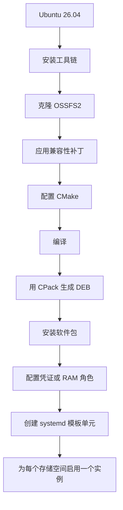
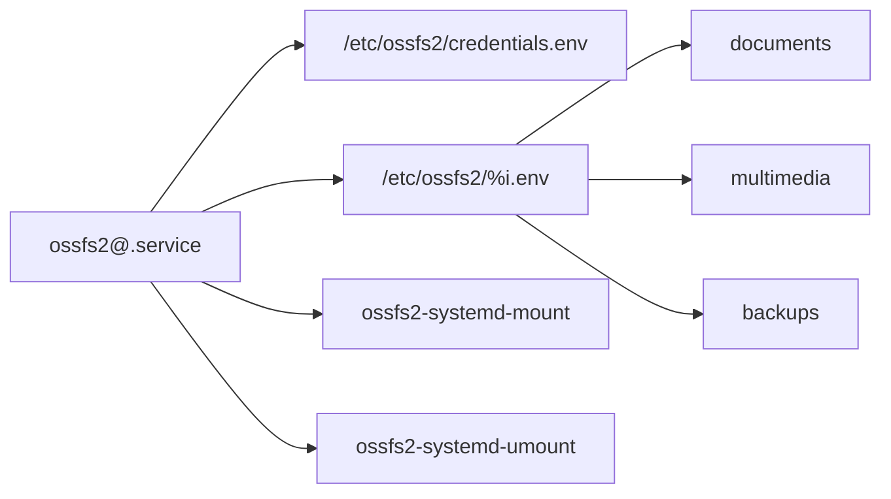

import Aside from "@rgglez/astro-aside";

## 简介

OSSFS2 是阿里云推出的高性能客户端，可通过 FUSE 将阿里云对象存储服务（OSS）的存储空间挂载为本地文件系统。本指南涵盖在 Ubuntu 26.04 上的完整流程：从源码编译、适配现代工具链、使用 CPack 生成 `.deb` 软件包，以及通过 systemd 模板单元管理多个挂载点。

<Aside type="warning">

官方仓库说明 OSSFS2 的测试范围是 GCC 9 到 GCC 13。Ubuntu 26.04 自带的 GCC 和 `libstdc++` 版本更新。这里给出的补丁是本地的兼容性适配，目的仅是让 OSSFS2 能够编译通过；它不是官方上游修复。请记录所用的 commit 和已应用的补丁，以备日后升级时参考。

</Aside>

<Aside type="warning">

OSSFS2 并不提供完整的 POSIX 语义。不应把它当作本地磁盘的直接替代品，用于数据库、复杂的文件锁、原子重命名，或对同一对象进行未经协调的并发写入。

</Aside>




---

## 目录

---

## 1. 安装依赖

```bash
# 更新本地软件包索引。
sudo apt update

# 安装编译器、CMake、Git、patch、FUSE 3 以及 Debian 工具。
sudo apt install \
  build-essential \
  cmake \
  git \
  patch \
  pkg-config \
  libfuse3-dev \
  libaio-dev \
  libssl-dev \
  dpkg-dev \
  fakeroot
```

- `sudo` 以管理员权限执行命令。
- `apt update` 刷新软件源索引。
- `apt install` 安装所列出的软件包。
- `build-essential` 提供 GCC、G++、Make 和基础头文件。
- `cmake` 生成构建系统。
- `git` 下载仓库。
- `patch` 应用统一格式的差异文件。
- `pkg-config` 定位库文件。
- `libfuse3-dev`、`libaio-dev` 和 `libssl-dev` 提供开发头文件。
- `dpkg-dev` 与 `fakeroot` 用于处理 Debian 软件包。
- 反斜杠 `\` 表示命令在下一行继续。

检查工具：

```bash
# 显示 C++ 编译器版本。
c++ --version

# 显示 CMake 版本。
cmake --version

# 定位项目所需的静态标准库。
g++ -print-file-name=libstdc++.a
```

- `--version` 用于查询版本。
- `-print-file-name=libstdc++.a` 让 G++ 依据自身配置解析静态标准库的路径。

## 2. 下载源码树

```bash
# 创建用于存放本地源码的管理目录。
sudo install -d -m 0755 -o root -g root /usr/local/src

# 进入源码目录。
cd /usr/local/src

# 将官方仓库克隆到 ossfs 子目录。
sudo git clone https://github.com/aliyun/ossfs.git ossfs

# 将该源码树移交给当前的管理员用户。
sudo chown -R "$USER":"$(id -gn)" /usr/local/src/ossfs

# 进入仓库目录。
cd /usr/local/src/ossfs

# 记录将要编译的确切 commit。
git rev-parse HEAD
```

- 在 `install` 中：
  - `-d` 创建目录。
  - `-m 0755` 设置权限。
  - `-o root` 指定属主。
  - `-g root` 指定属组。
- `git clone` 接收 URL 和本地名称。
- `chown -R` 递归修改属主和属组。
- `$USER` 保存当前用户名。
- `$(id -gn)` 获取其主组。
- `git rev-parse HEAD` 打印所选 commit 的哈希值。

## 3. 为什么需要补丁

使用现代工具链时，可能出现如下错误：

```text
error: ‘uint64_t’ does not name a type
error: ‘sort’ is not a member of ‘std’
error: no matching function for call to ‘min(<brace-enclosed initializer list>)’
```

观察到的原因是缺失的传递性包含：

- PhotonLibOS 使用了 `uint64_t`，却没有显式包含 `<cstdint>`；
- OSSFS2 的部分源文件使用了 `std::sort` 以及 `std::min` 的初始化列表重载，却没有包含 `<algorithm>`；
- 较旧的工具链会通过其他头文件意外地暴露这些符号；
- 新版标准库不再保证这类间接包含。

## 4. 现在来看补丁

```bash
# 创建存放本地适配的目录。
sudo install -d -m 0755 -o root -g root /usr/local/src/patches

# 将该目录移交给当前用户。
sudo chown "$USER":"$(id -gn)" /usr/local/src/patches

# 用已配置的编辑器打开补丁文件。
${EDITOR:-nano} /usr/local/src/patches/ossfs-ubuntu2604-compat.patch
```

- `install -d` 创建目录。
- `chown` 修改属主和属组。
- `${EDITOR:-nano}` 使用 `EDITOR` 变量，若未设置则回退为 `nano`。

完整内容：

```diff title="/usr/local/src/patches/ossfs-ubuntu2604-compat.patch"
# /usr/local/src/patches/ossfs-ubuntu2604-compat.patch
diff --git a/CMakeLists.txt b/CMakeLists.txt
--- a/CMakeLists.txt
+++ b/CMakeLists.txt
@@ -168,6 +168,14 @@

 add_library(ossfs2_common STATIC ${ossfs2_common_srcs})

+# PhotonLibOS and some ossfs2 sources rely on transitive inclusion of
+# standard headers. Preserve each "-include <header>" option as an
+# indivisible shell group so CMake's option de-duplication does not
+# separate the option from its argument.
+target_compile_options(ossfs2_common PRIVATE
+  "$<$<COMPILE_LANGUAGE:CXX>:SHELL:-include cstdint>"
+  "$<$<COMPILE_LANGUAGE:CXX>:SHELL:-include algorithm>")
+
 target_sources(ossfs2_common PRIVATE
   ${PHOTON_PATCHED_SRC_DIR}/ecosystem/oss_patched.cpp
 )
@@ -182,6 +190,11 @@
   src/*.cpp)

 add_executable(ossfs2 ${ossfs2_srcs})
+
+# The executable sources also include PhotonLibOS public headers directly.
+target_compile_options(ossfs2 PRIVATE
+  "$<$<COMPILE_LANGUAGE:CXX>:SHELL:-include cstdint>"
+  "$<$<COMPILE_LANGUAGE:CXX>:SHELL:-include algorithm>")

 # we will install libfuse to /usr/local/lib64/ossfs2, make sure ossfs2
 # can find it instead of using the system one
```

`target_compile_options` 为指定目标添加编译选项；`PRIVATE` 避免这些选项传播给它的使用者，`$<COMPILE_LANGUAGE:CXX>` 将其限制在 C++ 上。CMake 的 `SHELL:` 前缀会在去重过程中把每个 `-include` 与其头文件保持为一组；它并不会选择或调用任何命令解释器。

## 5. 用 `patch` 验证并应用补丁

```bash
# 进入原始源码树。
cd /usr/local/src/ossfs

# 确认源码树没有本地改动。
git status --short

# 模拟应用过程，不修改任何文件。
patch --dry-run -p1 \
  < /usr/local/src/patches/ossfs-ubuntu2604-compat.patch

# 真正应用补丁。
patch -p1 \
  < /usr/local/src/patches/ossfs-ubuntu2604-compat.patch

# 查看所做的改动。
git diff -- CMakeLists.txt
```

- `git status --short` 显示紧凑的状态信息。
- `patch --dry-run` 模拟应用过程。
- `-p1` 去掉 `a/CMakeLists.txt` 这类路径的第一层目录。
- `<` 把补丁重定向到标准输入。
- `git diff -- CMakeLists.txt` 将比较范围限定在该文件。

若要撤销：

```bash
# 反向应用已打上的补丁。
patch -R -p1 \
  < /usr/local/src/patches/ossfs-ubuntu2604-compat.patch
```

- `-R` 反向应用补丁。

## 6. 配置 CMake 4

CMake 4 移除了对早于 CMake 3.5 的策略的兼容支持。依赖项 `gflags 2.2.2` 声明了较旧的版本。变量 `CMAKE_POLICY_VERSION_MINIMUM=3.5` 使得无需修改子项目源码即可完成配置。

```bash
# 进入仓库目录。
cd /usr/local/src/ossfs

# 删除此前的构建目录。
rm -rf build

# 为 CMake 及外部子进程导出策略最低版本。
export CMAKE_POLICY_VERSION_MINIMUM=3.5

# 配置源码目录、输出目录、Release 类型和 DEB 生成器。
cmake \
  -S . \
  -B build \
  -DCMAKE_BUILD_TYPE=Release \
  -DCPACK_GENERATOR=DEB \
  -DCMAKE_EXPORT_COMPILE_COMMANDS=ON
```

- `rm -rf` 递归删除且不要求确认。
- `export` 把变量传递给子进程，包括编译外部依赖时启动的 CMake 进程。
- `-S .` 指定源码树。
- `-B build` 指定构建树。
- `-DCMAKE_BUILD_TYPE=Release` 启用优化。
- `-DCPACK_GENERATOR=DEB` 使 `CMakeLists.txt` 中的 Debian 分支在配置阶段被求值。
- `-DCMAKE_EXPORT_COMPILE_COMMANDS=ON` 生成 `compile_commands.json`。

<Aside type="warning">

编译阶段也要保留 `CMAKE_POLICY_VERSION_MINIMUM=3.5`，因为外部依赖可能会从 `cmake --build` 中启动新的 CMake 进程。

</Aside>

## 7. 编译

```bash
# 为当前会话重新声明该变量。
export CMAKE_POLICY_VERSION_MINIMUM=3.5

# 使用全部可用逻辑处理器进行编译。
cmake --build build --parallel "$(nproc)"
```

- `cmake --build build` 运行已生成的构建系统。
- `--parallel` 启用并行编译。
- `$(nproc)` 替换为逻辑处理器数量。

检查生成的可执行文件：

```bash
# 识别可执行文件的格式和架构。
file build/ossfs2

# 不安装即可查看版本。
build/ossfs2 --version
```

- `file` 检查可执行文件。
- `--version` 显示 OSSFS2 的版本。

## 8. 用 CPack 生成 DEB 软件包

我通常用 `checkinstall` 制作安装包，但该项目已经自带安装规则和 CPack 配置。因此这里 CPack 比 `checkinstall` 更具可重现性。

```bash
# 进入构建目录。
cd /usr/local/src/ossfs/build

# 确认 Debian 相关变量已写入 CPackConfig.cmake。
grep -E \
  'CPACK_GENERATOR|CPACK_DEBIAN_PACKAGE_MAINTAINER|CPACK_DEBIAN_PACKAGE_DEPENDS' \
  CPackConfig.cmake

# 仅以 DEB 格式生成主组件。
cpack \
  -G DEB \
  -C Release \
  -D CPACK_COMPONENTS_ALL=main
```

- `grep -E` 使用扩展正则表达式。
- 在正则表达式中，`|` 表示可选分支。
- 在 `cpack` 中：
  - `-G DEB` 选择 Debian 生成器。
  - `-C Release` 选择 Release 配置。
  - `-D CPACK_COMPONENTS_ALL=main` 将软件包限定为主组件。

<Aside type="note">

如果 CPack 提示缺少维护者，或提示不存在依赖关系，请重新配置构建目录并再次生成软件包：

```bash
# 重新生成配置，并包含 Debian 软件包的元数据。
cmake \
  -S /usr/local/src/ossfs \
  -B /usr/local/src/ossfs/build \
  -DCMAKE_BUILD_TYPE=Release \
  -DCPACK_GENERATOR=DEB

# 在重新配置后的构建树中运行 CPack。
cd /usr/local/src/ossfs/build
cpack \
  -G DEB \
  -C Release \
  -D CPACK_COMPONENTS_ALL=main
```

- `-S` 和 `-B` 分别指定源码树和构建树。
- `-DCPACK_GENERATOR=DEB` 让 CMake 把 Debian 专有配置写入 `CPackConfig.cmake`。
- `cpack` 重新把主组件生成为 DEB 软件包。

</Aside>

定位并检查软件包：

```bash
# 保存找到的第一个主软件包的路径。
PACKAGE_PATH="$(find . -maxdepth 1 -type f -name 'ossfs2_*.deb' | head -n1)"

# 显示软件包元数据。
dpkg-deb --info "$PACKAGE_PATH"

# 显示它将安装的文件。
dpkg-deb --contents "$PACKAGE_PATH"

# 显示 Debian 控制文件中的特定字段。
dpkg-deb -f "$PACKAGE_PATH" \
  Package Version Architecture Maintainer Depends
```

- `find -maxdepth 1` 不进入子目录。
- `-type f` 只选择文件。
- `-name` 按名称过滤。
- `head -n1` 取第一个匹配项。
- `dpkg-deb --info` 显示元数据。
- `--contents` 列出文件。
- `-f` 提取字段。

## 9. 安装软件包

```bash
# 安装本地文件，并让 APT 解决依赖。
sudo apt install "$PACKAGE_PATH"

# 定位已安装的可执行文件。
command -v ossfs2

# 检查已安装的版本。
ossfs2 --version

# 在 dpkg 中查询软件包状态。
dpkg-query -W \
  -f='${Package}\t${Version}\t${Status}\n' \
  ossfs2
```

- `apt install` 接受本地路径。
- `command -v` 在 `PATH` 中解析可执行文件。
- `dpkg-query -W` 查询软件包。
- `-f` 定义输出格式。
- `\t` 添加制表符。
- `\n` 添加换行符。

## 10. 面向多个存储空间的 systemd 设计

将使用一个模板单元、两个公共脚本、一个可选的凭证文件，以及每个实例一个的配置文件：



`%i` 会被替换为 `@` 之后的名称。`ossfs2@documents.service` 将读取 `/etc/ossfs2/documents.env`。

## 11. 创建目录

```bash
# 创建受限的配置目录。
sudo install -d -m 0750 -o root -g root /etc/ossfs2

# 创建日志根目录。
sudo install -d -m 0755 -o root -g root /var/log/ossfs2

# 创建挂载点的根目录。
sudo install -d -m 0755 -o root -g root /mnt/oss
```

- `0750` 只允许 `root` 及其属组访问。
- `0755` 允许其他用户穿越这些目录，但文件的实际权限取决于挂载参数。

## 12. 保存凭证

<Aside type="note" label="注意">

在 ECS 实例上更推荐使用 RAM 角色，因为 OSSFS2 会从实例元数据获取临时的 STS 凭证，不需要长期有效的 AccessKey。OSSFS2 从 2.0.2 版本起支持这种认证方式。

1. 在 RAM 控制台中打开 **身份管理 > 角色**，创建一个面向阿里云服务的角色。选择 **ECS** 作为受信服务并为其命名，例如 `EcsRamRoleOssDocuments`。
2. 为该角色附加一条自定义策略，只允许对该存储空间及其对象执行必要的操作。只读挂载可以使用 `AliyunOSSReadOnlyAccess`，不过限定到具体存储空间的策略权限更小。
3. 在 ECS 控制台中打开该实例，选择 **实例设置 > 授予/收回 RAM 角色**，附加刚创建的角色。一个 ECS 实例只能关联一个 RAM 角色。
4. 在 `/etc/ossfs2/documents.env` 中设置 `OSSFS_RAM_ROLE=EcsRamRoleOssDocuments`。不要设置 `OSS_ACCESS_KEY_ID` 和 `OSS_ACCESS_KEY_SECRET`；`/etc/ossfs2/credentials.env` 文件可以不存在，因为单元文件把它声明为可选。
5. 重启挂载并确认能够访问存储空间：

   ```bash
   # 重启实例，让 OSSFS2 使用 RAM 角色。
   sudo systemctl restart ossfs2@documents.service

   # 查看认证或挂载相关的消息。
   sudo journalctl -u ossfs2@documents.service \
     -b --no-pager

   # 确认存储空间已挂载。
   findmnt /mnt/oss/documents
   ```

   - `restart` 会以更新后的配置重新执行挂载。
   - `journalctl` 可用于发现权限不足，或获取临时凭证时的错误。
   - `findmnt` 确认挂载点处于活动状态。

请参阅官方文档中<a href="https://www.alibabacloud.com/help/en/ecs/user-guide/attach-an-instance-ram-role-to-an-ecs-instance" target="_blank" rel="noopener noreferrer">为 ECS 实例创建并附加 RAM 角色</a>的步骤，以及 <a href="https://www.alibabacloud.com/help/en/oss/developer-reference/configure-ossfs-2-0" target="_blank" rel="noopener noreferrer">使用 RAM 角色配置 OSSFS2</a>。

</Aside>

创建一个受限文件：

```bash
# 创建一个属主为 root、且仅 root 可读的空文件。
sudo install -m 0600 -o root -g root \
  /dev/null /etc/ossfs2/credentials.env

# 以管理方式编辑该文件。
sudoedit /etc/ossfs2/credentials.env
```

- `0600` 只授予 `root` 读写权限。
- `sudoedit` 用用户自己的编辑器编辑一份临时副本，然后安全地安装回原位置。

内容：

```ini title="/etc/ossfs2/credentials.env"
# AccessKey 对中的公开标识。
OSS_ACCESS_KEY_ID=LTAI_REPLACE

# 与上述标识对应的私密密钥。
OSS_ACCESS_KEY_SECRET=REPLACE_WITH_SECRET
```

以 `#` 开头的行是注释。不要在 `=` 两侧添加空格，也不要公开此文件。

## 13. 公共挂载脚本

```bash
# 创建具有可执行权限的空脚本。
sudo install -m 0755 -o root -g root \
  /dev/null /usr/local/sbin/ossfs2-systemd-mount

# 编辑该脚本。
sudoedit /usr/local/sbin/ossfs2-systemd-mount
```

`/usr/local/sbin/ossfs2-systemd-mount` 的内容如下：

```bash title="/usr/local/sbin/ossfs2-systemd-mount"
#!/usr/bin/env bash
# 通过 PATH 选择 Bash。

set -euo pipefail
# 遇到错误、未定义变量或管道失败即退出。

OSSFS_BINARY=/usr/local/bin/ossfs2
# 定义已安装可执行文件的绝对路径。

required_variables=(
# 开始必需变量列表。
  OSSFS_BUCKET
# 存储空间的真实名称。
  OSSFS_ENDPOINT
# OSS 的地域访问端点。
  OSSFS_MOUNTPOINT
# 本地挂载目录。
  OSSFS_LOG_DIR
# 专用日志目录。
  OSSFS_FILE_MODE
# 存储桶中文件的八进制权限。
  OSSFS_DIR_MODE
# 存储桶中目录的八进制权限。
)
# 结束列表。

for variable in "${required_variables[@]}"; do
# 遍历必需的变量名。
  if [[ -z "${!variable:-}" ]]; then
# 间接检查每个变量是否为空。
    printf '缺少必需的变量：%s\n' "$variable" >&2
# 把错误写入 stderr。
    exit 1
# 以失败状态退出。
  fi
# 结束检查。
done
# 结束循环。

for variable in OSSFS_FILE_MODE OSSFS_DIR_MODE; do
# 遍历包含权限的变量。
  if [[ ! "${!variable}" =~ ^0[0-7]{3}$ ]]; then
# 要求使用四位八进制数，例如 0644 或 0750。
    printf '%s 必须是四位八进制权限（例如 0644）：%s\n' \
      "$variable" "${!variable}" >&2
# 说明预期格式并显示无效值。
    exit 1
# 防止使用含糊或无效的权限挂载。
  fi
# 结束验证。
done
# 结束权限循环。

if [[ ! -x "$OSSFS_BINARY" ]]; then
# 检查可执行文件是否存在。
  printf '无效的可执行文件：%s\n' "$OSSFS_BINARY" >&2
# 报告出问题的路径。
  exit 1
# 以失败状态退出。
fi
# 结束检查。

install -d -m 0755 -o root -g root "$OSSFS_MOUNTPOINT"
# 若挂载点不存在则创建它。

install -d -m 0755 -o root -g root "$OSSFS_LOG_DIR"
# 创建该实例的日志目录。

if mountpoint -q "$OSSFS_MOUNTPOINT"; then
# 静默检查是否已经挂载。
  printf '%s 已经挂载。\n' "$OSSFS_MOUNTPOINT"
# 记录无需继续处理。
  exit 0
# 以成功状态退出。
fi
# 结束检查。

args=(
# 开始参数数组。
  mount
# 选择 mount 子命令。
  "$OSSFS_MOUNTPOINT"
# 指定挂载点。
  "--oss_endpoint=$OSSFS_ENDPOINT"
# 指定 OSS 访问端点。
  "--oss_bucket=$OSSFS_BUCKET"
# 指定存储空间。
  "--log_dir=$OSSFS_LOG_DIR"
# 按实例分离日志。
  "--file_mode=$OSSFS_FILE_MODE"
# 设置 OSSFS2 为所有文件显示的权限。
  "--dir_mode=$OSSFS_DIR_MODE"
# 设置 OSSFS2 为所有目录显示的权限。
)
# 结束数组。

if [[ -n "${OSSFS_RAM_ROLE:-}" ]]; then
# 检查是否定义了 RAM 角色。
  args+=("--ram_role=$OSSFS_RAM_ROLE")
# 把角色加入命令。
fi
# 结束 RAM 角色选项。

exec "$OSSFS_BINARY" "${args[@]}"
# 用 OSSFS2 替换当前 shell，并保留其退出码。
```

- `set -euo pipefail` 启用严格模式。
- `${!variable:-}` 间接获取变量的值。
- `>&2` 重定向到 stderr。
- `mountpoint -q` 只检查而不输出。
- 数组能保留各个参数的边界。
- `file_mode` 和 `dir_mode` 自 OSSFS2 2.0.1 起可用，用于设置挂载所呈现的全局权限；它们不是 `umask`。
- `exec` 用 OSSFS2 替换当前 shell。

验证：

```bash
# 只解析语法而不执行脚本。
sudo bash -n /usr/local/sbin/ossfs2-systemd-mount
```

- `bash -n` 仅校验语法。

## 14. 公共卸载脚本

```bash
# 创建可执行脚本。
sudo install -m 0755 -o root -g root \
  /dev/null /usr/local/sbin/ossfs2-systemd-umount

# 编辑该脚本。
sudoedit /usr/local/sbin/ossfs2-systemd-umount
```

内容：

```bash title="/usr/local/sbin/ossfs2-systemd-umount"
#!/usr/bin/env bash

# 启用严格模式。
set -euo pipefail

# 检查挂载点变量是否存在。
if [[ -z "${OSSFS_MOUNTPOINT:-}" ]]; then
  # 把错误信息输出到 stderr。
  echo 'OSSFS_MOUNTPOINT 未定义。' >&2
  # 以失败状态退出。
  exit 1
# 结束校验。
fi

# 检查是否已经卸载。
if ! mountpoint -q "$OSSFS_MOUNTPOINT"; then
  # 说明无需继续处理。
  printf '%s 未挂载。\n' "$OSSFS_MOUNTPOINT"
  # 以成功状态退出。
  exit 0
# 结束检查。
fi

# 卸载文件系统。
umount "$OSSFS_MOUNTPOINT"
```

## 15. 模板单元

```bash
# 创建或编辑模板单元。
sudoedit /etc/systemd/system/ossfs2@.service
```

写入以下内容：

```ini title="/etc/systemd/system/ossfs2@.service"
# 开始元数据与启动顺序设置。
[Unit]

# %i 会被替换为实例名称。
Description=通过 OSSFS2 挂载阿里云 OSS（实例 %i）

# 记录主要文档地址。
Documentation=https://github.com/aliyun/ossfs

# 请求 systemd 尝试等待网络就绪。
Wants=network-online.target

# 让挂载在 network-online.target 之后执行。
After=network-online.target

# 开始服务定义。
[Service]

# ExecStart 执行的是一次性操作。
Type=oneshot

# 加载凭证；前缀 - 使该文件成为可选。
EnvironmentFile=-/etc/ossfs2/credentials.env

# 加载该实例必需的配置。
EnvironmentFile=/etc/ossfs2/%i.env

# 执行公共挂载脚本。
ExecStart=/usr/local/sbin/ossfs2-systemd-mount

# 停止单元时执行卸载。
ExecStop=/usr/local/sbin/ossfs2-systemd-umount

# ExecStart 结束后仍将单元保持为活动状态。
RemainAfterExit=yes

# 将启动时限设为 120 秒。
TimeoutStartSec=120

# 将卸载时限设为 60 秒。
TimeoutStopSec=60

# 把 stdout 发送到 journal。
StandardOutput=journal

# 把 stderr 发送到 journal。
StandardError=journal

# 定义该单元的启用方式。
[Install]

# 将其挂接到多用户启动目标。
WantedBy=multi-user.target
```

`Wants=` 创建弱依赖。`After=` 定义顺序。`Type=oneshot` 与 `RemainAfterExit=yes` 使得可以用一条有限时长的命令来表示一个持久存在的挂载。`EnvironmentFile` 中的 `-` 前缀允许在使用 RAM 角色时省略凭证文件。

验证并重新加载：

```bash
# 校验单元文件。
sudo systemd-analyze verify \
  /etc/systemd/system/ossfs2@.service

# 重新加载服务管理器的配置。
sudo systemctl daemon-reload
```

- `systemd-analyze verify` 可发现错误。
- `daemon-reload` 重新读取单元文件。

## 16. 每个存储空间的配置文件

以 `documents` 为例：

```bash
# 为该实例创建受限的配置文件。
sudo install -m 0600 -o root -g root \
  /dev/null /etc/ossfs2/documents.env

# 编辑其中的变量。
sudoedit /etc/ossfs2/documents.env
```

内容：

```ini title="/etc/ossfs2/documents.env"
# 存储空间的真实名称。
OSSFS_BUCKET=example-documents-bucket

# 该地域的访问端点；只有在内网连通时才使用 -internal。
OSSFS_ENDPOINT=oss-cn-region-internal.aliyuncs.com

# 专用的本地挂载点。
OSSFS_MOUNTPOINT=/mnt/oss/documents

# 专用日志目录。
OSSFS_LOG_DIR=/var/log/ossfs2/documents

# 挂载中所有文件的权限。
OSSFS_FILE_MODE=0640

# 挂载中所有目录的权限。
OSSFS_DIR_MODE=0750

# 取消注释即可用 RAM 角色代替 AccessKey。
# OSSFS_RAM_ROLE=example-oss-role
```

按同样的方式创建 `/etc/ossfs2/multimedia.env`、`/etc/ossfs2/backups.env` 或其他名称的文件。每个实例都必须拥有各自独立的挂载点和日志目录。请根据每个存储桶所需的访问权限设置 `OSSFS_FILE_MODE` 和 `OSSFS_DIR_MODE`；这些值会全局应用于 OSSFS2 所呈现的文件和目录，包括新创建的项目。

## 17. 测试并启用挂载

```bash
# 先启动一个实例，暂不设为开机自启。
sudo systemctl start ossfs2@documents.service

# 显示其状态。
systemctl status ossfs2@documents.service

# 显示本次启动以来的日志。
sudo journalctl -u ossfs2@documents.service \
  -b --no-pager

# 检查挂载情况。
findmnt /mnt/oss/documents

# 列出内容。
ls -la /mnt/oss/documents
```

- `start` 启动该实例。
- `status` 显示其状态。
- 在 `journalctl` 中：
  - `-u` 按单元过滤。
  - `-b` 把结果限定在本次启动。
  - `--no-pager` 直接输出。
- `findmnt` 查询挂载表。
- `ls -la` 使用长格式并包含隐藏文件。

测试写入与读取：

```bash
# 创建一个测试对象。
printf '使用 systemd 的 OSSFS2 测试。\n' \
  | sudo tee /mnt/oss/documents/test.txt >/dev/null

# 读取该对象。
sudo cat /mnt/oss/documents/test.txt

# 删除该对象。
sudo rm /mnt/oss/documents/test.txt
```

- `printf` 生成文本。
- `|` 把输出接到 `tee`。
- `tee` 以特权写入。
- `>/dev/null` 隐藏它在 stdout 上的副本。
- `cat` 读取文件。
- `rm` 删除文件。

启用多个实例：

```bash
# 启用并启动三个相互独立的挂载。
sudo systemctl enable --now \
  ossfs2@documents.service \
  ossfs2@multimedia.service \
  ossfs2@backups.service

# 列出所有已加载的实例。
systemctl list-units 'ossfs2@*.service' --all

# 显示 /mnt/oss 下的所有子挂载。
findmnt --submounts /mnt/oss
```

- `enable` 创建开机启动所需的链接。
- `--now` 立即启动这些单元。
- `list-units` 列出单元。
- `--all` 包含未激活的单元。
- `findmnt --submounts` 包含下级挂载。

## 18. 日常运维

```bash
# 停止并卸载单个实例。
sudo systemctl stop ossfs2@multimedia.service

# 重启某个实例。
sudo systemctl restart ossfs2@multimedia.service

# 取消开机自启并停止某个实例。
sudo systemctl disable --now ossfs2@multimedia.service

# 实时跟踪日志。
sudo journalctl -u ossfs2@documents.service -f
```

- `stop` 会执行 `ExecStop`。
- `restart` 会先卸载再重新挂载。
- `disable --now` 取消自启并停止该单元。
- `journalctl -f` 持续跟踪新消息。

## 19. 故障诊断

如果编译在 gflags 处失败：

```bash
# 检查 CMake 兼容性变量。
printf '%s\n' "${CMAKE_POLICY_VERSION_MINIMUM:-未定义}"
```

- 变量不存在时，`${VAR:-替代值}` 会使用替代值。

如果出现 `uint64_t does not name a type`：

```bash
# 检查补丁添加的编译选项。
grep -n 'SHELL:-include' /usr/local/src/ossfs/CMakeLists.txt
```

- `-n` 添加行号。
- 应该同时存在 `ossfs2_common` 和 `ossfs2` 的条目。

如果 CPack 找不到维护者：

```bash
# 重新配置，并显式启用 DEB 生成器。
cmake -S /usr/local/src/ossfs \
  -B /usr/local/src/ossfs/build \
  -DCMAKE_BUILD_TYPE=Release \
  -DCPACK_GENERATOR=DEB
```

- `-S` 和 `-B` 分别指定源码树和构建树。
- `-DCPACK_GENERATOR=DEB` 使 Debian 相关配置被求值。

如果卸载时提示目标正忙：

```bash
# 显示正在使用该挂载的进程。
sudo fuser -vm /mnt/oss/documents
```

- `-v` 使用详细格式。
- `-m` 把该路径视为一个文件系统。

## 20. 安全性与限制

- 优先使用 ECS 的 RAM 角色，而不是长期有效的 AccessKey。
- 对存储空间和操作实行最小权限原则。
- 保持 `/etc/ossfs2/credentials.env` 的权限为 `0600`。
- 不要把密钥作为命令行参数传递。
- 为每个 OSSFS2 进程使用不同的 `log_dir`。
- 保留 commit 哈希和已应用的补丁。
- 更新仓库后重新验证补丁是否仍然适用。
- 不要用 OSSFS2 承载活跃的数据库。
- 当多个客户端挂载同一个存储空间时，要协调各自的访问。

## 附录 A. 已核实的官方参考资料

1. OSSFS2 官方仓库：<a href="https://github.com/aliyun/ossfs" target="_blank" rel="noopener noreferrer">https://github.com/aliyun/ossfs</a>
2. OSSFS2 挂载选项：<a href="https://help.aliyun.com/en/oss/developer-reference/description-of-mount-options" target="_blank" rel="noopener noreferrer">https://help.aliyun.com/en/oss/developer-reference/description-of-mount-options</a>
3. OSSFS2 自动挂载：<a href="https://help.aliyun.com/en/oss/developer-reference/configure-auto-mount-on-for-ossfs-2-0" target="_blank" rel="noopener noreferrer">https://help.aliyun.com/en/oss/developer-reference/configure-auto-mount-on-for-ossfs-2-0</a>
4. CPack 的 DEB 生成器：<a href="https://cmake.org/cmake/help/latest/cpack_gen/deb.html" target="_blank" rel="noopener noreferrer">https://cmake.org/cmake/help/latest/cpack_gen/deb.html</a>
5. `CMAKE_POLICY_VERSION_MINIMUM`：<a href="https://cmake.org/cmake/help/latest/variable/CMAKE_POLICY_VERSION_MINIMUM.html" target="_blank" rel="noopener noreferrer">https://cmake.org/cmake/help/latest/variable/CMAKE_POLICY_VERSION_MINIMUM.html</a>
6. `target_compile_options` 与 `SHELL:` 分组：<a href="https://cmake.org/cmake/help/latest/command/target_compile_options.html" target="_blank" rel="noopener noreferrer">https://cmake.org/cmake/help/latest/command/target_compile_options.html</a>
7. systemd 服务单元：<a href="https://www.freedesktop.org/software/systemd/man/latest/systemd.service.html" target="_blank" rel="noopener noreferrer">https://www.freedesktop.org/software/systemd/man/latest/systemd.service.html</a>
8. 模板、实例与 `%i`：<a href="https://www.freedesktop.org/software/systemd/man/latest/systemd.unit.html" target="_blank" rel="noopener noreferrer">https://www.freedesktop.org/software/systemd/man/latest/systemd.unit.html</a>
9. `EnvironmentFile` 与执行环境：<a href="https://www.freedesktop.org/software/systemd/man/latest/systemd.exec.html" target="_blank" rel="noopener noreferrer">https://www.freedesktop.org/software/systemd/man/latest/systemd.exec.html</a>
10. `network-online.target`：<a href="https://www.freedesktop.org/software/systemd/man/latest/systemd.special.html" target="_blank" rel="noopener noreferrer">https://www.freedesktop.org/software/systemd/man/latest/systemd.special.html</a>
11. 使用 `systemctl` 进行管理：<a href="https://www.freedesktop.org/software/systemd/man/latest/systemctl.html" target="_blank" rel="noopener noreferrer">https://www.freedesktop.org/software/systemd/man/latest/systemctl.html</a>
12. 使用 `journalctl` 查询日志：<a href="https://www.freedesktop.org/software/systemd/man/latest/journalctl.html" target="_blank" rel="noopener noreferrer">https://www.freedesktop.org/software/systemd/man/latest/journalctl.html</a>

## 附录 B. 编译流程速览

```bash
# 进入原始源码树。
cd /usr/local/src/ossfs

# 模拟应用补丁。
patch --dry-run -p1 \
  < /usr/local/src/patches/ossfs-ubuntu2604-compat.patch

# 应用补丁。
patch -p1 \
  < /usr/local/src/patches/ossfs-ubuntu2604-compat.patch

# 删除此前的构建结果。
rm -rf build

# 导出 CMake 4 所需的兼容性设置。
export CMAKE_POLICY_VERSION_MINIMUM=3.5

# 配置构建与 Debian 打包。
cmake -S . -B build \
  -DCMAKE_BUILD_TYPE=Release \
  -DCPACK_GENERATOR=DEB

# 并行编译。
cmake --build build --parallel "$(nproc)"

# 进入构建目录。
cd build

# 生成主软件包。
cpack -G DEB -C Release \
  -D CPACK_COMPONENTS_ALL=main
```

- `patch --dry-run` 验证补丁。
- `patch -p1` 应用补丁。
- `rm -rf` 删除此前的构建树。
- `export` 传递该变量。
- `cmake -S/-B` 配置构建。
- `cmake --build` 执行编译。
- `cpack -G DEB` 生成 Debian 软件包。
