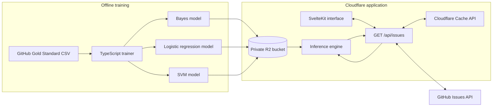
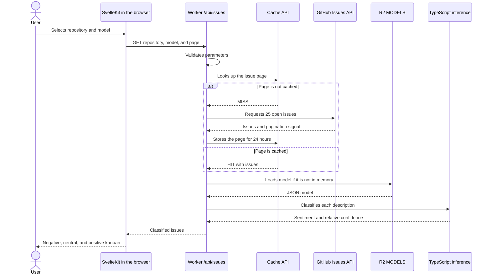

import Aside from "@rgglez/astro-aside";

## Introduction

To improve the GitHub user experience in a visually appealing way—and qualify
for the developer program along the way—I decided to develop a sentiment
analyzer for repository issues. The idea was to automatically classify issue
comments and descriptions as positive, negative, or neutral, allowing
developers to better prioritize their responses and actions.

Sentiment classification is a common use case in AI-based text analysis, and
several techniques and tools can be used for this purpose. Below, I describe the
process I followed to develop this sentiment analyzer, the challenges I faced,
and the solutions I implemented.

---

## Table of contents

---

## Requirements analysis

The first step was to define the project requirements. I needed a tool capable
of analyzing GitHub issue comments and descriptions and classifying them into
sentiment categories. I also wanted the tool to work in real time through an
attractive, easy-to-use web interface. It was important for it to be free and
open source, so that other developers could contribute to and improve it. The
software and cloud resources also had to be free and legally accessible, since
I had no budget for this project.

This limited the tools and services I could use, but as Jean-Michel Jarre says,
“creativity comes from constraints.”

For the initial MVP (Minimum Viable Product), I decided to focus on issue
descriptions. They are easier to retrieve and analyze than comments, and they
usually contain the most relevant information about an issue. The functionality
could later be expanded to include comments.

For the analysis, I ruled out large language models (LLMs), since most services
that provide them charge for usage, and I did not want to depend on an external
service whose policies or prices could change in the future. As mentioned
before, the budget was USD $0.00, so I could not afford an LLM service for this
project. Instead, I chose a free, open-source natural language processing
library that could run locally or on my own server. This gave me more control
over the process and allowed me to customize the model for my needs.

In classical machine learning, several techniques can be used for sentiment
analysis, including Naive Bayes and SVM. They rely on supervised learning and
therefore use labeled datasets, or corpora. These models are lighter and faster
than LLMs and can be trained with smaller datasets tailored to the GitHub issue
domain.

The three algorithms used have different characteristics:

| Model               | Text representation                               | Classification criterion                                  | Main advantage                                                                          | Main limitation                                                                               |
| ------------------- | ------------------------------------------------- | --------------------------------------------------------- | --------------------------------------------------------------------------------------- | --------------------------------------------------------------------------------------------- |
| Naive Bayes         | Presence of normalized words with Porter stemming | Probability of each class based on feature frequency      | Simple and fast training and inference; works well as a baseline                        | Assumes independence between words and loses contextual relationships                         |
| Linear SVM          | Sparse, L2-normalized TF-IDF vectors              | Three _one-vs-rest_ classifiers optimized with hinge loss | Often separates high-dimensional text well and produces a portable model                | Its margins are not probabilities; the displayed percentage is relative confidence            |
| Logistic regression | The same TF-IDF vectors used by SVM               | Multiclass _softmax_ function over linear scores          | Produces comparable scores across the three classes while keeping inference lightweight | Remains a linear model and cannot understand sarcasm, complex negation, or long-range context |

Another important consideration was where the analyzer would run. Once again,
the budget ruled out cloud services that charge by usage, so I decided to run
the analyzer on a Cloudflare Worker. Cloudflare offers a free plan with some
limitations, but it is perfectly suitable for this project, especially as an
MVP. Cloudflare Workers also run JavaScript at the network edge, allowing the
analyzer to be closer to its users and provide better latency and performance.

<Aside type="tip" title="Note">
  I genuinely recommend Cloudflare Workers. The service is very easy to use and
  configure, and its free plan is sufficient for many small or personal
  projects.
</Aside>

Svelte and SvelteKit are an excellent option for Cloudflare Workers. They make
it possible to create modern, reactive web applications with excellent
performance and a very small bundle. SvelteKit also has an official Cloudflare
adapter, `@sveltejs/adapter-cloudflare`, which simplifies application deployment
and management. I therefore chose SvelteKit as the framework for the sentiment
analyzer and Svelte as the component layer for its user interface.

However, using JavaScript—or TypeScript—to develop the sentiment analyzer also
imposes significant constraints. Most sentiment-analysis libraries are written
in Python and cannot run directly on a Cloudflare Worker. I therefore had to
find a free, open-source sentiment-analysis library written in JavaScript or
TypeScript and, above all, compatible with Cloudflare Workers. Fortunately,
there are some options, such as <a href="https://naturalnode.github.io/natural/">
Natural</a>, which provides a Naive Bayes classifier and other text-analysis
techniques. Natural depends on Node APIs, so I reserved it for the offline
trainer. The Worker does not load the library; it consumes the model already
serialized as JSON and performs inference in pure TypeScript.

The main alternatives I evaluated can be summarized as follows. None of them
provides sentiment analysis by itself: they all require labeled text and a
preliminary tokenization and feature-extraction stage.

| Library                                                         | Supervised models                                                                    | Text preparation                                     | Advantages                                                                              | Limitations for this project                                                                                 |
| --------------------------------------------------------------- | ------------------------------------------------------------------------------------ | ---------------------------------------------------- | --------------------------------------------------------------------------------------- | ------------------------------------------------------------------------------------------------------------ |
| [Natural](https://naturalnode.github.io/natural/)               | Naive Bayes and logistic regression                                                  | Includes tokenization, stemming, and TF-IDF          | NLP-oriented API, straightforward training, and JSON-serializable models                | Depends on Node APIs; best used in the trainer, with inference reproduced in pure TypeScript                 |
| [ML.js](https://github.com/mljs) (`ml-naivebayes` and `ml-svm`) | Gaussian or multinomial Naive Bayes and SVM                                          | Requires converting text into numeric vectors        | Small, independent packages with exportable models                                      | `ml-svm` is an educational, binary implementation; multiclass classification requires an additional strategy |
| [libsvm-js](https://github.com/mljs/libsvm)                     | Classification and regression SVMs with linear, polynomial, RBF, and sigmoid kernels | Requires vectors such as TF-IDF                      | Full LIBSVM implementation with multiclass support, cross-validation, and serialization | Uses WebAssembly and is heavier than linear inference written specifically for the Worker                    |
| [TensorFlow.js](https://www.tensorflow.org/js)                  | Dense, convolutional, and recurrent neural networks, among others                    | Requires designing the text encoding or tokenization | Maximum flexibility, with training in either the browser or Node.js                     | Greater complexity, bundle size, and execution cost for a small classical classifier                         |

The final question was the training dataset. Having ruled out paid hosted
inference services, such as OpenAI, and pretrained Hugging Face Hub models that
were too heavy for a Worker, I needed a free dataset containing examples of
GitHub issue comments and descriptions. Fortunately, a dataset called

<a href="https://figshare.com/articles/dataset/A_gold_standard_for_polarity_of_emotions_of_software_developers_in_GitHub/11604597?file=21001260">
  GitHub Gold Standard
</a>
contains more than 7,000 GitHub comments and issue descriptions labeled by
polarity—positive, negative, or neutral. Despite its limitations, it is ideal
for training a sentiment-analysis model specific to the software-development
domain, which is my use case.

<Aside type="note" title="Note">
  The GitHub Gold Standard dataset was created by researchers at the University
  of Bari, Italy, and is available under an open-access license. It is a
  valuable resource for the developer community and for those working on
  sentiment analysis in the context of software development.

> N. Novielli, F. Calefato, D. Dongiovanni, D. Girardi, F. Lanubile (2020). 'Can We Use SE-specific Sentiment Analysis Tools in a Cross-Platform Setting?'. In Proceedings of the 17th International Conference on Mining Software Repositories (MSR 2020).

</Aside>

Before choosing it, I compared the Gold Standard with
[`rsl-ai/github-issues`](https://huggingface.co/datasets/rsl-ai/github-issues),
another corpus available on Hugging Face:

| Characteristic   | GitHub Gold Standard                                        | `rsl-ai/github-issues`                                                           |
| ---------------- | ----------------------------------------------------------- | -------------------------------------------------------------------------------- |
| Size             | 7,122 comments                                              | 1,000 issues and pull requests                                                   |
| Unit of analysis | Commit and pull request comments                            | Complete record for each issue or pull request                                   |
| Available text   | Comment text                                                | Title, body, and comments, plus GitHub API metadata                              |
| Sentiment labels | Yes: positive, neutral, and negative                        | Does not include polarity or sentiment                                           |
| Annotation type  | Manually labeled with disagreement resolution               | Data collected directly from the GitHub API                                      |
| License          | CC BY 4.0                                                   | MIT for the dataset; source data retains the terms of GitHub and each repository |
| Best suited for  | Supervised training and evaluation of sentiment classifiers | Issue analysis, summarization, enrichment, or creation of a new labeled corpus   |

Although `rsl-ai/github-issues` better reflects the complete structure of an
issue, it cannot be used directly to train the three classifiers because it
does not contain the variable they must learn to predict. Its texts would have
needed manual labeling, or provisional labels followed by validation. For this
MVP, the Gold Standard provided the shortest path to a reproducible supervised
model.

## System architecture

The first architectural decision was to divide the system into two parts that
do not need to run at the same time: model training and the application that
uses those models to classify issues. Training is a relatively intensive
process, but it only runs occasionally on a local computer. Inference, on the
other hand, must be fast and available whenever a user queries a repository.

This separation kept the Worker small. Nothing is trained in production, the
dataset is never loaded there, and neither Python, an external service, nor a
native library is required. The Worker receives text, loads a JSON file with
the model parameters, and performs classification in TypeScript.

At a high level, the architecture looks like this:



### Training outside the Worker

The repository contains a TypeScript command-line program that reads the
**GitHub Gold Standard** dataset. Each row includes text written by a developer
and a polarity: positive, neutral, or negative. Before passing a row to a
classifier, the program validates its structure with Zod, normalizes the label,
and removes fragments that could introduce noise, such as URLs, commit hashes,
and code blocks.

The trainer can produce three different models:

- **Naive Bayes**, using the classifier from the Natural library.
- **Multiclass logistic regression**, trained on sparse TF-IDF vectors.
- **Linear SVM**, also trained on TF-IDF, with a _one-vs-rest_ strategy for the
  three sentiment classes.

For the linear models, I built a shared TF-IDF representation. The vocabulary
keeps up to 10,000 terms and discards those appearing in fewer than two
documents. Each text is transformed into a sparse vector and L2-normalized. As
a result, the model stores only the vocabulary, IDF values, labels, weights,
and biases required to repeat the calculation during inference.

Each training run produces a JSON file:

```text
github-sentiment-bayes-model.json
github-sentiment-logistic-model.json
github-sentiment-svm-model.json
```

These files are the contract between the two halves of the system. The trainer
can evolve without becoming part of the deployment, while the Worker only needs
to understand the serialized format. Once generated, the models are uploaded
manually to a private Cloudflare R2 bucket with Wrangler.

<Aside type="note" title="R2 stores models, not issues">

I chose R2 for the machine-learning artifacts because they are relatively
large files, remain immutable between training runs, and do not need a public
URL. Issues retrieved from GitHub follow another path: they are temporarily
stored in the Cloudflare Cache API. Keeping both data types separate avoids
turning a response cache into permanent storage, or vice versa.

</Aside>

### The classification application

The visible part of the system is a SvelteKit application deployed as a
Cloudflare Worker. Svelte handles the interface, while SvelteKit provides the
`GET /api/issues` endpoint, which acts as the boundary between the browser,
GitHub, the cache, and the models.

When a user enters a repository URL, selects a classifier, and presses the
analysis button, the browser sends three parameters to the endpoint:

- The repository, as a GitHub URL or in `owner/repository` format.
- The selected model: `svm`, `bayes`, or `logistic`.
- The requested results page.

The endpoint validates these values before performing any external operation.
The page must be between 1 and 40, the model name must belong to the supported
list, and the repository must contain exactly two segments: owner and name.
This produces clearer error messages and prevents arbitrary input from being
used to construct the GitHub request or cache key.

The complete path of a request is as follows:



#### Retrieving and caching issues

The GitHub API returns issues and pull requests from the same endpoint. Since
this project focuses on issues, the Worker removes any item containing the
`pull_request` property. It also verifies that a title exists and that the
resulting URL belongs to `https://github.com/`.

Each request retrieves up to 25 open items. To constrain response size and
inference work, only the title, URL, and first 255 characters of the description
are retained. These fields form a minimal representation of each issue, and the
page is stored in the Cache API for 24 hours.

One detail matters: the cache key includes the repository and page, but not the
model. The cache stores data retrieved from GitHub before classification.
Sentiment is calculated after that data is retrieved. Consequently, users can
switch from SVM to Bayes or logistic regression without triggering another
GitHub request or keeping three copies of the same page.

Cache writes are passed to `waitUntil`, so the Worker does not need to delay the
response while storing the copy. The key also includes a schema version. If the
shape of cached data changes later, incrementing that version prevents old
entries from being read with an incompatible structure.

#### Loading and running the models

The R2 bucket is connected to the Worker through the `MODELS` binding. Because
this is a private binding, JSON files are never exposed directly to the browser.
The endpoint maps the user's selection to its corresponding key, downloads the
object, and validates its structure before use.

For linear models, it verifies that the vocabulary, IDF values, weight matrices,
biases, and labels have compatible dimensions. For Bayes, it checks the feature
tables and totals for each class. It also rejects models exceeding the expected
maximum size. A missing or malformed file therefore becomes a controlled error
instead of silently producing an incorrect classification.

Once validated, the model is retained in a promise shared by requests handled
by the same warm Worker instance. This avoids reading and parsing the same JSON
for every page. If loading fails, the promise is removed so a later request can
retry; otherwise, a transient R2 failure would remain cached for the lifetime
of the instance.

Inference reproduces the training transformations. SVM and logistic regression
clean and tokenize the text, build a sparse TF-IDF vector, and calculate a
linear score for each label. Bayes uses the features present and accumulates
probabilities in log space to avoid numerical problems. Finally, a _softmax_
function transforms the scores into relative values that the interface can
display as confidence.

<Aside type="warning" title="Confidence does not mean certainty">

The displayed percentage is useful for comparing the model's preference among
its three classes, but it does not guarantee that the prediction is correct.
In particular, SVM margins are not calibrated probabilities. The value is
useful in the interface as long as it is interpreted as a relative measure and
not as an absolute statistical truth.

</Aside>

#### Presenting the results

The endpoint response contains the repository, page, cache status, and a list
of issues with their prediction and confidence. Svelte distributes that list
across three kanban columns: negative, neutral, and positive. Each card displays
the title, a description excerpt, the confidence percentage, and a link to the
original issue.

Results load incrementally. An `IntersectionObserver` watches an element at the
end of the page and requests the next block before the user reaches it. This
provides infinite scrolling without pagination buttons and without downloading
every repository issue at once.

The sentiment distribution can be highly uneven. In a repository with many
neutral results, for example, a newly added positive or negative card could
appear outside the visible area and go unnoticed. To prevent this, the
interface checks whether a card is visible in the destination column. If none
is visible, it temporarily presents the new issue with the same width and
position as that column, holds it for two seconds, and then slides it upward
before adding it to the stack. The animation respects the system preference for
reduced motion.

### Conclusions

With this architecture, the browser focuses on interaction, the Worker
coordinates and classifies, the Cache API reduces repeated GitHub requests, and
R2 keeps the models out of the bundle. The trainer remains entirely outside the
request path. For an MVP with a USD $0.00 budget, this separation provides a
reasonable balance of cost, speed, and maintainability.

The GitHub Gold Standard dataset is sufficient to train a sentiment-analysis
model for the software-development domain, although it has limitations. Despite
the number of examples, the diversity of projects and programming languages is
limited, and comment polarity can be subjective. The model may therefore fail
to generalize well to every GitHub repository, and fine-tuning or retraining
with newer or more specific data may be required to improve accuracy. Sentiment
classification is also a complex problem, and determining the polarity of a
comment or description is not always straightforward. For example, the trained
models struggle to identify sarcasm, irony, or humor and may misinterpret double
negatives or ambiguous expressions. Their results should therefore be treated
with caution.

A future improvement could involve using a Transformer-based model, such as
BERT, or a large language model (LLM) to classify sentiment.

## Links

- <a
    href="https://github.com/rgglez/github-issues-sentiment-analyzer"
    target="_blank"
  >
    Project repository
  </a>
- <a href="https://gitmotions.rodolfo.gg" target="_blank">
    Live application
  </a>

## References

Cortes, C., & Vapnik, V. (1995). Support-vector networks. _Machine Learning,
20_, 273–297. [https://doi.org/10.1007/BF00994018](https://doi.org/10.1007/BF00994018)

Coutinho, D., Braga, B., Canuto, T., Pereira, J. A., Assunção, W. K. G.,
Steinmacher, I., Gerosa, M., & Garcia, A. (2026). Leveraging large language
models for sentiment analysis in GitHub pull request discussions. _Empirical
Software Engineering, 31_, Article 140.
[https://doi.org/10.1007/s10664-026-10868-6](https://doi.org/10.1007/s10664-026-10868-6)

Cox, D. R. (1958). The regression analysis of binary sequences. _Journal of the
Royal Statistical Society: Series B (Methodological), 20_(2), 215–242.
[https://doi.org/10.1111/j.2517-6161.1958.tb00292.x](https://doi.org/10.1111/j.2517-6161.1958.tb00292.x)

Devlin, J., Chang, M.-W., Lee, K., & Toutanova, K. (2019). BERT: Pre-training
of deep bidirectional transformers for language understanding. In _Proceedings
of the 2019 Conference of the North American Chapter of the Association for
Computational Linguistics: Human Language Technologies, Volume 1 (Long and
Short Papers)_ (pp. 4171–4186). Association for Computational Linguistics.
[https://doi.org/10.18653/v1/N19-1423](https://doi.org/10.18653/v1/N19-1423)

Novielli, N., Calefato, F., Dongiovanni, D., Girardi, D., & Lanubile, F.
(2020a). _A gold standard for polarity of emotions of software developers in
GitHub_ [Data set]. figshare.
[https://doi.org/10.6084/m9.figshare.11604597](https://doi.org/10.6084/m9.figshare.11604597)

Novielli, N., Calefato, F., Dongiovanni, D., Girardi, D., & Lanubile, F.
(2020b). Can we use SE-specific sentiment analysis tools in a cross-platform
setting? In _Proceedings of the 17th International Conference on Mining
Software Repositories_ (pp. 158–168). Association for Computing Machinery.
[https://doi.org/10.1145/3379597.3387446](https://doi.org/10.1145/3379597.3387446)

Webb, G. I., Boughton, J. R., & Wang, Z. (2005). Not so naive Bayes: Aggregating
one-dependence estimators. _Machine Learning, 58_(1), 5–24.
[https://doi.org/10.1007/s10994-005-4258-6](https://doi.org/10.1007/s10994-005-4258-6)
