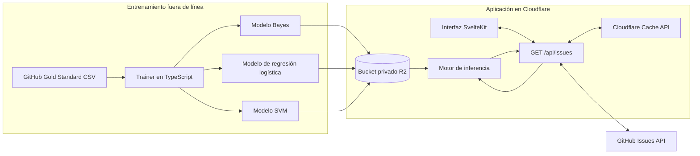
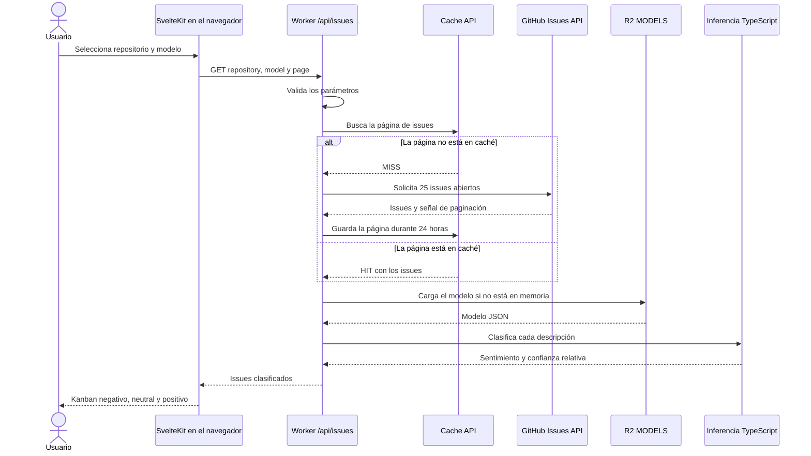

import Aside from "@rgglez/astro-aside";

## Introducción

Con el objetivo de mejorar la experiencia de los usuarios de GitHub de una manera
atractiva visualmente, y de paso calificar para el programa de desarrolladores,
decidí desarrollar un analizador de sentimientos para issues de repositorios. La
idea era poder clasificar automáticamente los comentarios y descripciones de los
issues en categorías como positivo, negativo o neutral, lo que permitiría a los
desarrolladores priorizar mejor sus respuestas y acciones.

La clasificación de sentimientos es un caso de uso muy frecuente en el análisis
de texto mediante inteligencia artificial, y existen varias técnicas y
herramientas que se pueden utilizar para este propósito. A continuación,
describo el proceso que seguí para desarrollar este analizador de sentimientos,
los desafíos que enfrenté y las soluciones que implementé.

---

## Tabla de contenido

---

## Análisis de requisitos

El primer paso fue definir los requisitos del proyecto. Necesitaba una
herramienta que pudiera analizar los comentarios y descripciones de los issues
de GitHub y clasificarlos en categorías de sentimientos. Además, quería que la
herramienta funcionara en tiempo real, con una interfaz web atractiva y fácil de
usar. También era importante que la herramienta fuera libre y de código abierto,
para que otros desarrolladores pudieran contribuir y mejorarla. Y que los
recursos a utilizar, tanto de software como de cloud, fueran gratuitos y
legalmente accesibles, ya que no contaba con un presupuesto para este proyecto.

Esto limitaba las opciones de herramientas y servicios que podía utilizar, pero,
como dice Jean-Michel Jarre, "la creatividad surge de las limitaciones".

De entrada, para tener una versión MVP (Minimum Viable Product), decidí enfocarme
en analizar las descripciones de los issues, ya que son más fáciles de obtener y
analizar que los comentarios, y además suelen contener la información más
relevante sobre el issue. Posteriormente, podría expandir la funcionalidad para
incluir los comentarios.

Para realizar el análisis decidí dejar de lado el uso de modelos de lenguaje
grandes (LLM) debido a que la mayoría de los servicios que los ofrecen son de
pago, y no quería depender de un servicio externo que pudiera cambiar sus
políticas o precios en el futuro. Además, como dije antes, el presupuesto era de
$0.00 USD, por lo que no podía permitirme pagar por un servicio de LLM para este
proyecto. Por lo tanto, opté por utilizar una librería de procesamiento de
lenguaje natural gratuita y de código abierto, que pudiera ejecutarse localmente
o en un servidor propio. Esto me daba más control sobre el proceso y me permitía
personalizar el modelo según mis necesidades.

En aprendizaje automático clásico, existen varias técnicas para el análisis de
sentimientos, como Naive Bayes o SVM, que se basan en aprendizaje supervisado y
por tanto utilizan datasets, o corpora, etiquetados. Estos modelos son más
ligeros y rápidos que los LLM, y pueden ser entrenados con datasets más pequeños
y específicos para el dominio de los issues de GitHub.

Los tres algoritmos utilizados tienen características diferentes:

| Modelo | Representación del texto | Criterio de clasificación | Ventaja principal | Limitación principal |
| --- | --- | --- | --- | --- |
| Naive Bayes | Presencia de palabras normalizadas con stemming de Porter | Probabilidad de cada clase a partir de la frecuencia de sus características | Entrenamiento e inferencia simples y rápidos; funciona bien como modelo base | Supone independencia entre palabras y pierde relaciones de contexto |
| SVM lineal | Vectores TF-IDF dispersos y normalizados con L2 | Tres clasificadores _one-vs-rest_ optimizados con pérdida hinge | Suele separar bien textos de alta dimensionalidad y produce un modelo portable | Sus márgenes no son probabilidades; el porcentaje mostrado es una confianza relativa |
| Regresión logística | Los mismos vectores TF-IDF utilizados por SVM | Función _softmax_ multiclase sobre puntajes lineales | Entrega puntajes comparables entre las tres clases y mantiene una inferencia ligera | Continúa siendo un modelo lineal y no comprende sarcasmo, negaciones complejas ni contexto lejano |

Otro punto importante era el lugar de ejecución del analizador. Nuevamente,
debido a la limitación de presupuesto, no podía utilizar servicios de cloud
que cobraran por uso, por lo que decidí ejecutar el analizador en un Worker de
Cloudflare, que ofrece un plan gratuito con ciertas limitaciones, pero
perfectamente funcional para este proyecto, sobre todo en forma de MVP. Además,
los Workers de Cloudflare permiten ejecutar código JavaScript en el borde de la
red, lo que significa que el analizador podría estar más cerca de los usuarios y
ofrecer una mejor experiencia de latencia y rendimiento.

<Aside type="tip" title="Nota">
  En verdad recomiendo el servicio de Workers de Cloudflare, ya que es muy fácil
  de usar y configurar, y además ofrece un plan gratuito que es suficiente para
  muchos proyectos pequeños o personales.
</Aside>

Una opción muy buena para Cloudflare Workers es desarrollar en Svelte+SvelteKit,
ya que permite crear aplicaciones web modernas y reactivas con un rendimiento
excelente y un tamaño de bundle muy pequeño. Además, SvelteKit cuenta con un
adaptador oficial para Cloudflare, `@sveltejs/adapter-cloudflare`, lo que
facilita el despliegue y la gestión de la aplicación. Por lo tanto, decidí
utilizar SvelteKit como framework para el desarrollo del analizador de
sentimientos, y Svelte como capa de componentes para la interfaz de usuario.

Sin embargo, el uso de JavaScript (o TypeScript) para el desarrollo del analizador
de sentimientos también impone restricciones importantes, ya que la mayoría de
las bibliotecas de análisis de sentimientos están escritas en Python, y no se
pueden ejecutar directamente en un Worker de Cloudflare. Por lo tanto, tuve que
buscar una biblioteca de análisis de sentimientos que estuviera escrita en
JavaScript o TypeScript, y que fuera de código abierto y gratuita, y sobre todo,
compatible con Cloudflare Workers. Afortunadamente, existen algunas opciones
disponibles, como la biblioteca <a href="https://naturalnode.github.io/natural/">
Natural</a>, que ofrece un clasificador Naive Bayes y otras técnicas de análisis
de texto. Natural depende de APIs de Node, así que la reservé para el entrenador
que se ejecuta fuera de línea; el Worker no la carga, sino que consume el modelo
ya serializado en JSON y realiza la inferencia con TypeScript puro.

Las principales alternativas que evalué se pueden resumir así. Ninguna resuelve
por sí sola el análisis de sentimientos: todas necesitan texto etiquetado y una
fase previa de tokenización y extracción de características.

| Biblioteca                                                    | Modelos supervisados                                                            | Preparación del texto                                     | Ventajas                                                                          | Limitaciones para este proyecto                                                                                   |
| ------------------------------------------------------------- | ------------------------------------------------------------------------------- | --------------------------------------------------------- | --------------------------------------------------------------------------------- | ----------------------------------------------------------------------------------------------------------------- |
| [Natural](https://naturalnode.github.io/natural/)             | Naive Bayes y regresión logística                                               | Incluye tokenización, stemming y TF-IDF                   | API orientada a NLP, entrenamiento sencillo y modelos serializables en JSON       | Depende de APIs de Node; conviene usarla en el entrenador y reproducir la inferencia en TypeScript puro           |
| [ML.js](https://github.com/mljs) (`ml-naivebayes` y `ml-svm`) | Naive Bayes gaussiano o multinomial y SVM                                       | Requiere convertir el texto en vectores numéricos         | Paquetes pequeños, independientes y con modelos exportables                       | `ml-svm` es una implementación educativa y binaria; la clasificación multiclase requiere una estrategia adicional |
| [libsvm-js](https://github.com/mljs/libsvm)                   | SVM de clasificación y regresión con kernels lineal, polinomial, RBF y sigmoide | Requiere vectores como TF-IDF                             | Implementación completa de LIBSVM, multiclase, validación cruzada y serialización | Usa WebAssembly y es más pesada que una inferencia lineal escrita específicamente para el Worker                  |
| [TensorFlow.js](https://www.tensorflow.org/js)                | Redes densas, convolucionales y recurrentes, entre otras                        | Requiere diseñar la codificación o tokenización del texto | Máxima flexibilidad y entrenamiento tanto en navegador como en Node.js            | Mayor complejidad, tamaño y costo de ejecución para un clasificador clásico pequeño                               |

Y finalmente quedaba la cuestión del dataset de entrenamiento. Descartados los
servicios de inferencia hospedada de pago, como los de OpenAI, y los modelos
preentrenados del Hub de Hugging Face, demasiado pesados para un Worker, tuve que
buscar un dataset libre y gratuito que contuviera ejemplos de comentarios y
descripciones de issues. Afortunadamente, existe un dataset llamado

<a href="https://figshare.com/articles/dataset/A_gold_standard_for_polarity_of_emotions_of_software_developers_in_GitHub/11604597?file=21001260">GitHub Gold Standard</a>,
que contiene más de 7,000 comentarios y descripciones de issues de GitHub,
etiquetados con su polaridad (positivo, negativo o neutral). Este dataset es
ideal, aun con sus limitaciones, para entrenar un modelo de análisis de
sentimientos específico para el dominio del desarrollo de software, que es mi
caso de uso.

<Aside type="note" title="Nota">
  El dataset GitHub Gold Standard fue creado por investigadores de la Universidad
  de Bari, Italia, y está disponible bajo una licencia de acceso abierto. Es un
  recurso valioso para la comunidad de desarrolladores y para quienes trabajan
  en el análisis de sentimientos en el contexto del desarrollo de software.

> N. Novielli, F. Calefato, D. Dongiovanni, D. Girardi, F. Lanubile (2020). 'Can We Use SE-specific Sentiment Analysis Tools in a Cross-Platform Setting?'. In Proceedings of the 17th International Conference on Mining Software Repositories (MSR 2020).
</Aside>

Antes de elegirlo, comparé el Gold Standard con
[`rsl-ai/github-issues`](https://huggingface.co/datasets/rsl-ai/github-issues),
otro corpus disponible en Hugging Face:

| Característica | GitHub Gold Standard | `rsl-ai/github-issues` |
| --- | --- | --- |
| Tamaño | 7,122 comentarios | 1,000 issues y pull requests |
| Unidad de análisis | Comentarios de commits y pull requests | Registro completo de cada issue o pull request |
| Texto disponible | Texto del comentario | Título, cuerpo y comentarios, además de metadatos de la API de GitHub |
| Etiquetas de sentimiento | Sí: positivo, neutral y negativo | No incluye polaridad ni sentimiento |
| Tipo de anotación | Etiquetado manual con resolución de desacuerdos | Datos recolectados directamente de la API de GitHub |
| Licencia | CC BY 4.0 | MIT para el dataset; los datos fuente conservan las condiciones de GitHub y de cada repositorio |
| Uso más adecuado | Entrenamiento y evaluación supervisados de clasificadores de sentimiento | Análisis de issues, resumen, enriquecimiento o creación de un nuevo corpus etiquetado |

Aunque `rsl-ai/github-issues` refleja mejor la estructura completa de un issue,
no puede utilizarse directamente para entrenar los tres clasificadores porque no
contiene la variable que deben aprender a predecir. Habría sido necesario
etiquetar manualmente sus textos o generar etiquetas provisionales y después
validarlas. Para este MVP, el Gold Standard ofrecía el camino más corto hacia un
modelo supervisado reproducible.

## Arquitectura del sistema

La primera decisión de arquitectura fue separar el sistema en dos partes que no
necesitan ejecutarse al mismo tiempo: por un lado, el entrenamiento de los
modelos; por el otro, la aplicación que los utiliza para clasificar issues. El
entrenamiento es un proceso relativamente pesado, pero se ejecuta de manera
ocasional en una computadora local. La inferencia, en cambio, debe ser rápida y
estar disponible cada vez que un usuario consulta un repositorio.

Esta separación permitió mantener al Worker pequeño. En producción no se entrena
nada, no se carga el dataset y tampoco se necesita ejecutar Python, un servicio
externo o una biblioteca nativa. El Worker recibe texto, carga un archivo JSON
con los parámetros del modelo y realiza la clasificación con TypeScript.

Vista desde arriba, la arquitectura quedó de la siguiente forma:



### Entrenamiento fuera del Worker

El repositorio contiene un programa de línea de comandos escrito en TypeScript
que lee el dataset **GitHub Gold Standard**. Cada fila incluye un texto escrito
por un desarrollador y una polaridad: positiva, neutral o negativa. Antes de
entregar una fila a un clasificador, el programa valida su estructura con Zod,
normaliza la etiqueta y limpia fragmentos que podrían introducir ruido, como
URLs, hashes de commits y bloques de código.

El entrenador permite producir tres modelos distintos:

- **Naive Bayes**, utilizando el clasificador de la biblioteca Natural.
- **Regresión logística multiclase**, entrenada sobre vectores TF-IDF dispersos.
- **SVM lineal**, también sobre TF-IDF y con una estrategia _one-vs-rest_ para
  las tres clases de sentimiento.

Para los modelos lineales construí una representación TF-IDF compartida. El
vocabulario conserva hasta 10,000 términos y descarta aquellos que aparecen en
menos de dos documentos. Cada texto se transforma en un vector disperso y se
normaliza con la norma L2. De esta manera, el modelo guarda solamente el
vocabulario, los valores IDF, las etiquetas, los pesos y los sesgos necesarios
para repetir el cálculo durante la inferencia.

El resultado de cada entrenamiento es un archivo JSON:

```text
github-sentiment-bayes-model.json
github-sentiment-logistic-model.json
github-sentiment-svm-model.json
```

Estos archivos son el contrato entre ambas mitades del sistema. El entrenador
puede evolucionar sin formar parte del despliegue, mientras que el Worker solo
necesita comprender el formato serializado. Una vez generados los modelos, se
suben manualmente a un bucket privado de Cloudflare R2 mediante Wrangler.

<Aside type="note" title="R2 almacena modelos, no issues">

Elegí R2 para los artefactos de aprendizaje porque son archivos relativamente
grandes, inmutables entre entrenamientos y no necesitan una URL pública. Los
issues obtenidos desde GitHub siguen otro camino: se guardan temporalmente en la
Cache API de Cloudflare. Separar ambos tipos de datos evita convertir una caché
de respuestas en un almacén permanente, o viceversa.

</Aside>

### La aplicación de clasificación

La parte visible del sistema es una aplicación SvelteKit desplegada como
Cloudflare Worker. Svelte se encarga de la interfaz y SvelteKit aporta el
endpoint `GET /api/issues`, que funciona como frontera entre el navegador,
GitHub, la caché y los modelos.

Cuando el usuario escribe la URL de un repositorio, elige un clasificador y
presiona el botón de análisis, el navegador envía tres parámetros al endpoint:

- El repositorio, como URL de GitHub o en formato `propietario/repositorio`.
- El modelo seleccionado: `svm`, `bayes` o `logistic`.
- La página de resultados que se desea obtener.

El endpoint valida esos valores antes de realizar cualquier operación externa.
La página debe encontrarse entre 1 y 40, el nombre del modelo debe pertenecer a
la lista soportada y el repositorio debe tener exactamente dos segmentos:
propietario y nombre. Esto no solo produce mensajes de error más claros; también
evita utilizar entradas arbitrarias para construir la solicitud hacia GitHub o
la clave de caché.

El recorrido completo de una solicitud es el siguiente:



#### Obtención y caché de issues

La API de GitHub devuelve issues y pull requests en el mismo endpoint. Como el
objetivo del proyecto son los issues, el Worker elimina cualquier elemento que
incluya la propiedad `pull_request`. También verifica que exista un título y que
la URL resultante pertenezca a `https://github.com/`.

Cada petición recupera hasta 25 elementos abiertos. Para mantener acotados el
tamaño de la respuesta y el trabajo de inferencia, se conservan solamente el
título, la URL y los primeros 255 caracteres de la descripción. Con esos campos
se construye una representación mínima de cada issue y se guarda la página en la
Cache API durante 24 horas.

Hay un detalle importante: la clave de caché incluye el repositorio y la página,
pero no el modelo. La caché contiene los datos obtenidos desde GitHub, todavía
sin clasificación. El sentimiento se calcula después de recuperar esos datos.
Gracias a esto, el usuario puede cambiar de SVM a Bayes o regresión logística sin
provocar otra consulta a GitHub ni mantener tres copias de la misma página.

La escritura en caché se entrega a `waitUntil`, por lo que el Worker no necesita
retrasar la respuesta mientras termina de almacenar la copia. Además, la clave
incluye una versión de esquema. Si en el futuro cambia la forma de los datos
guardados, basta con incrementar esa versión para no intentar leer entradas
antiguas con una estructura incompatible.

#### Carga e inferencia de los modelos

El bucket R2 está conectado al Worker mediante el binding `MODELS`. Como se
trata de un binding privado, los archivos JSON nunca se exponen directamente al
navegador. El endpoint traduce el nombre elegido por el usuario a la clave
correspondiente, descarga el objeto y valida su estructura antes de utilizarlo.

Para los modelos lineales comprueba que el vocabulario, los valores IDF, las
matrices de pesos, los sesgos y las etiquetas tengan dimensiones compatibles.
Para Bayes verifica las tablas de características y los totales por clase.
También rechaza cualquier modelo que exceda el tamaño máximo esperado. Un archivo
ausente o mal formado se convierte así en un error controlado, en lugar de
producir una clasificación silenciosamente incorrecta.

Una vez validado, el modelo se conserva en una promesa compartida por las
solicitudes atendidas por la misma instancia caliente del Worker. Esto evita
leer y parsear el mismo JSON para cada página. Si la carga falla, la promesa se
elimina para que una solicitud posterior pueda reintentarla; de otro modo, un
fallo transitorio de R2 quedaría memorizado durante toda la vida de la
instancia.

La inferencia reproduce las transformaciones del entrenamiento. SVM y regresión
logística limpian el texto, lo tokenizan, construyen un vector TF-IDF disperso y
calculan un puntaje lineal para cada etiqueta. Bayes utiliza las características
presentes y acumula probabilidades en espacio logarítmico para evitar problemas
numéricos. Finalmente, una función _softmax_ transforma los puntajes en valores
relativos que la interfaz puede mostrar como confianza.

<Aside type="warning" title="Confianza no significa certeza">

El porcentaje mostrado sirve para comparar la preferencia del modelo entre sus
tres clases, pero no es una garantía de que la predicción sea correcta. En
particular, los márgenes de una SVM no son probabilidades calibradas. El número
resulta útil para la interfaz, siempre que se interprete como una medida relativa
y no como una verdad estadística absoluta.

</Aside>

#### Presentación de los resultados

La respuesta del endpoint contiene el repositorio, la página, el estado de la
caché y una lista de issues con su predicción y confianza. Svelte distribuye esa
lista en tres columnas tipo kanban: negativa, neutral y positiva. Cada tarjeta
muestra el título, un fragmento de la descripción, el porcentaje de confianza y
un enlace al issue original.

La carga de resultados es incremental. Un `IntersectionObserver` vigila un
elemento al final de la página y solicita el siguiente bloque antes de que el
usuario llegue hasta él. Esto produce un desplazamiento infinito sin botones de
paginación y sin descargar de una sola vez todos los issues del repositorio.

La distribución de sentimientos puede ser muy desigual. En un repositorio con
muchos resultados neutrales, por ejemplo, una tarjeta positiva o negativa nueva
podría agregarse fuera del área visible y pasar inadvertida. Para evitarlo, la
interfaz comprueba si existe una tarjeta visible en la columna de destino. Si no
la hay, presenta temporalmente el nuevo issue con el mismo ancho y posición de
esa columna, lo mantiene durante dos segundos y después lo desliza hacia arriba
antes de incorporarlo a la pila. La animación respeta la preferencia del sistema
para reducir movimiento.

### Conclusiones

Con esta arquitectura, el navegador se concentra en la interacción, el Worker
coordina y clasifica, la Cache API reduce las consultas repetidas a GitHub y R2
mantiene los modelos fuera del bundle. El entrenador queda completamente fuera
del camino de cada solicitud. Para un MVP con presupuesto de $0.00 USD, esa
separación ofrece un equilibrio razonable entre costo, velocidad y facilidad de
mantenimiento.

El dataset GitHub Gold Standard es suficiente para entrenar un modelo de análisis
de sentimientos específico para el dominio del desarrollo de software, aunque
tiene sus limitaciones. A pesar del número de ejemplos, la diversidad de
proyectos y lenguajes de programación es limitada, y la polaridad de los
comentarios puede ser subjetiva. Por lo tanto, es posible que el modelo no
generalice bien a todos los repositorios de GitHub, y que se requiera un ajuste
fino o un reentrenamiento con datos más recientes o específicos para mejorar la
precisión. Asimismo, la clasificación de sentimientos es un problema complejo y
no siempre es fácil determinar la polaridad de un comentario o descripción. Por
ejemplo, los modelos entrenados tienen dificultades para identificar sarcasmo,
ironía o humor, y pueden confundir dobles negaciones o expresiones ambiguas.
Por lo tanto, es importante interpretar los resultados con cautela.

Una mejora futura del sistema podría consistir en utilizar un modelo basado en
Transformers, como BERT, o un modelo de lenguaje grande (LLM) para clasificar
sentimientos.

## Enlaces

- <a href="https://github.com/rgglez/github-issues-sentiment-analyzer" target="_blank">Repositorio del proyecto</a>
- <a href="https://gitmotions.rodolfo.gg" target="_blank">Aplicación en vivo</a>

## Referencias

Cortes, C., & Vapnik, V. (1995). Support-vector networks. _Machine Learning,
20_, 273–297. [https://doi.org/10.1007/BF00994018](https://doi.org/10.1007/BF00994018)

Coutinho, D., Braga, B., Canuto, T., Pereira, J. A., Assunção, W. K. G.,
Steinmacher, I., Gerosa, M., & Garcia, A. (2026). Leveraging large language
models for sentiment analysis in GitHub pull request discussions. _Empirical
Software Engineering, 31_, Article 140.
[https://doi.org/10.1007/s10664-026-10868-6](https://doi.org/10.1007/s10664-026-10868-6)

Cox, D. R. (1958). The regression analysis of binary sequences. _Journal of the
Royal Statistical Society: Series B (Methodological), 20_(2), 215–242.
[https://doi.org/10.1111/j.2517-6161.1958.tb00292.x](https://doi.org/10.1111/j.2517-6161.1958.tb00292.x)

Devlin, J., Chang, M.-W., Lee, K., & Toutanova, K. (2019). BERT: Pre-training
of deep bidirectional transformers for language understanding. In _Proceedings
of the 2019 Conference of the North American Chapter of the Association for
Computational Linguistics: Human Language Technologies, Volume 1 (Long and
Short Papers)_ (pp. 4171–4186). Association for Computational Linguistics.
[https://doi.org/10.18653/v1/N19-1423](https://doi.org/10.18653/v1/N19-1423)

Novielli, N., Calefato, F., Dongiovanni, D., Girardi, D., & Lanubile, F.
(2020a). _A gold standard for polarity of emotions of software developers in
GitHub_ [Data set]. figshare.
[https://doi.org/10.6084/m9.figshare.11604597](https://doi.org/10.6084/m9.figshare.11604597)

Novielli, N., Calefato, F., Dongiovanni, D., Girardi, D., & Lanubile, F.
(2020b). Can we use SE-specific sentiment analysis tools in a cross-platform
setting? In _Proceedings of the 17th International Conference on Mining
Software Repositories_ (pp. 158–168). Association for Computing Machinery.
[https://doi.org/10.1145/3379597.3387446](https://doi.org/10.1145/3379597.3387446)

Webb, G. I., Boughton, J. R., & Wang, Z. (2005). Not so naive Bayes: Aggregating
one-dependence estimators. _Machine Learning, 58_(1), 5–24.
[https://doi.org/10.1007/s10994-005-4258-6](https://doi.org/10.1007/s10994-005-4258-6)
