import Aside from "@rgglez/astro-aside";

## Introducción

Los **sistemas cognitivos artificiales** son sistemas computacionales diseñados para realizar, de manera parcial y orientada a una tarea, capacidades relacionadas con la cognición: percibir regularidades, construir representaciones, aprender de la experiencia, predecir, decidir y adaptar su comportamiento. No reproducen una mente completa ni una copia fiel del cerebro; combinan datos, modelos matemáticos, objetivos de aprendizaje y recursos de cómputo para resolver problemas que requieren interpretar información o elegir acciones.

Este glosario estudia tales sistemas principalmente desde el aprendizaje profundo. Parte de las neuronas artificiales y la retropropagación, continúa con los frameworks y las técnicas prácticas de entrenamiento, y después aborda arquitecturas especializadas: redes convolucionales para visión, representaciones distribuidas para lenguaje, redes recurrentes para secuencias y aprendizaje por refuerzo para decisiones sucesivas. También explica cómo las GPU, el entrenamiento distribuido y la nube permiten escalar el cálculo, y cómo el _serving_, la validación y la monitorización convierten un modelo entrenado en un sistema confiable en producción.

El recorrido concluye con modelos generativos y metaaprendizaje, que amplían el objetivo desde predecir una etiqueta hasta aprender distribuciones, producir muestras nuevas o mejorar el propio proceso de aprendizaje. En conjunto, el glosario presenta un sistema cognitivo artificial como una cadena completa: los datos se transforman en representaciones, una función de pérdida orienta el aprendizaje, el modelo produce decisiones o contenido y la infraestructura mantiene su funcionamiento en condiciones reales.

---

## Tabla de contenido

---

## 1. Introducción al aprendizaje profundo

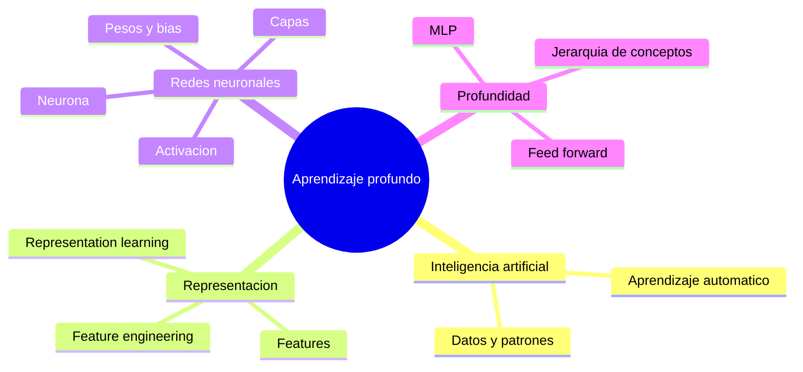

### Inteligencia artificial (IA)

Disciplina que construye sistemas capaces de resolver tareas asociadas con la percepción, el lenguaje, la decisión o el razonamiento. Abarca tanto sistemas basados en reglas explícitas como métodos que adquieren regularidades a partir de datos.

### Aprendizaje automático (_machine learning_)

Área de la IA en la que un algoritmo obtiene patrones desde ejemplos o experiencia y los utiliza para predecir, clasificar o estructurar datos nuevos. A diferencia de un sistema de reglas escrito a mano, el conocimiento operativo queda codificado en parámetros aprendidos.

### Característica (_feature_)

Variable utilizada para representar un aspecto relevante de un ejemplo. En una imagen podría ser un píxel, una forma o una textura; en un problema clínico, una medición seleccionada por especialistas. La utilidad del modelo depende en gran medida de que la representación exponga información pertinente.

### Ingeniería de características (_feature engineering_)

Proceso humano de seleccionar, transformar o construir características que faciliten el aprendizaje. Puede ser eficaz, pero exige conocimiento del dominio y resulta difícil cuando los patrones útiles son numerosos, variables o demasiado complejos para describirlos manualmente.

### Aprendizaje de representaciones (_representation learning_)

Enfoque en el que el sistema aprende también la forma de representar los datos, en vez de recibir únicamente características diseñadas por personas. Su objetivo es producir variables internas que hagan más sencilla la tarea final.

### Aprendizaje profundo (_deep learning_)

Subcampo del aprendizaje automático que construye representaciones jerárquicas: las capas iniciales detectan regularidades simples y las posteriores las combinan en conceptos más abstractos. La profundidad suele asociarse con el número de transformaciones o capas, no con un umbral universal.

### Neurona artificial o unidad

Unidad de cómputo que combina entradas ponderadas, añade un término independiente y aplica una función de activación. Para una entrada $\mathbf{x}$, pesos $\mathbf{w}$ y sesgo $b$:

$$
z = \mathbf{w}^{\mathsf T}\mathbf{x} + b,
\qquad
a = \phi(z)
$$

**Símbolos:** $\mathbf{x}$ es el vector de entrada; $\mathbf{w}$, el vector de pesos; $\mathsf T$ indica transposición; $b$ es el sesgo; $z$, la combinación lineal; $\phi$, la función de activación; y $a$, la salida de la unidad.

### Peso (_weight_)

Parámetro que regula cuánto influye una entrada en la salida de una neurona. Entrenar la red consiste, en gran parte, en ajustar sus pesos para reducir el error observado en los ejemplos.

### Sesgo (_bias_)

Parámetro aditivo que permite desplazar la respuesta de la neurona con independencia de sus entradas. Gracias a él, la transformación no queda obligada a pasar por el origen.

### Función de activación o no linealidad

Transformación aplicada a la combinación lineal de una unidad. Sin activaciones no lineales, encadenar capas seguiría siendo equivalente a una sola transformación lineal y la red no podría modelar relaciones complejas.

### Función sigmoide

Activación que comprime cualquier número real al intervalo $(0,1)$, por lo que puede interpretarse como una probabilidad en ciertos modelos:

$$
\sigma(z)=\frac{1}{1+e^{-z}}
$$

**Símbolos:** $z$ es la entrada de la activación; $\sigma(z)$, su salida; y $e$, la constante de Euler.

### Perceptrón multicapa (MLP)

Red formada por múltiples capas de unidades. Cada capa utiliza la salida de la anterior, lo que permite combinar rasgos simples en representaciones progresivamente más complejas.

### Capa de entrada, capa oculta y capa de salida

La **capa de entrada** recibe la representación del ejemplo; las **capas ocultas** realizan transformaciones intermedias; y la **capa de salida** produce la predicción requerida por la tarea.

### Red totalmente conectada (_fully connected network_)

Arquitectura en la que cada unidad de una capa recibe la salida de todas las unidades de la capa precedente. Esta conectividad ofrece flexibilidad, pero puede generar muchos parámetros.

### Red prealimentada (_feed-forward network_)

Red cuyo flujo de información avanza desde la entrada hasta la salida sin ciclos. Se distingue de las redes recurrentes, que realimentan un estado interno para procesar secuencias.

### Inspiración biológica

Analogía histórica entre las unidades artificiales y las neuronas biológicas: ambas reciben señales, las integran y producen una salida. El parecido es limitado; las arquitecturas y activaciones del aprendizaje profundo son modelos matemáticos, no reproducciones fieles del cerebro.

---

## 2. Entrenamiento de redes neuronales

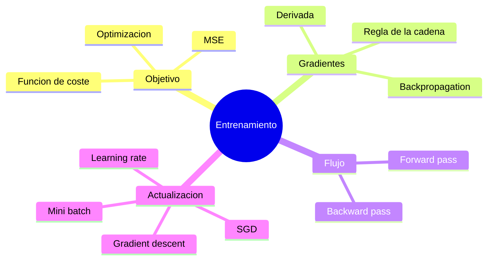

### MNIST

Conjunto de imágenes pequeñas de dígitos manuscritos utilizado como problema introductorio y _benchmark_ de clasificación. Cada imagen de $28\times28$ píxeles puede convertirse en un vector de 784 entradas y la salida suele contener diez clases.

### _Benchmark_

Problema, conjunto de datos y protocolo de evaluación que permiten comparar métodos bajo condiciones comunes. Un resultado de _benchmark_ solo es comparable cuando se mantienen las mismas particiones, métricas y reglas de evaluación.

### Hiperparámetro

Valor elegido antes o durante el proceso de entrenamiento que no se aprende como un peso ordinario. Son hiperparámetros, por ejemplo, el número de unidades ocultas, el tamaño del lote y la tasa de aprendizaje.

### Función de coste o pérdida (_loss_)

Función diferenciable que cuantifica la discrepancia entre la salida del modelo y el valor esperado. El entrenamiento busca los parámetros $\theta$ que minimizan el coste promedio:

$$
J(\theta)=\frac{1}{m}\sum_{i=1}^{m}\ell\!\left(f_\theta(x_i),y_i\right)
$$

**Símbolos:** $J$ es el coste promedio; $\theta$, el conjunto de parámetros del modelo; $m$, el número de ejemplos; $i$, el índice de cada ejemplo; $f_\theta(x_i)$, la predicción para la entrada $x_i$; $y_i$, su valor esperado; y $\ell$, la pérdida de un ejemplo.

### Error cuadrático medio (MSE)

Pérdida que promedia el cuadrado de la diferencia entre predicción y objetivo. Para salidas vectoriales:

$$
\operatorname{MSE}=\frac{1}{m}\sum_{i=1}^{m}
\left\lVert f_\theta(x_i)-y_i\right\rVert_2^2
$$

**Símbolos:** $m$ es el número de ejemplos; $\theta$, los parámetros del modelo; $f_\theta(x_i)$, la predicción para $x_i$; $y_i$, el objetivo correspondiente; y $\lVert\cdot\rVert_2$, la norma euclídea, cuyo cuadrado mide la magnitud del error.

El cuadrado evita cancelaciones de signo y produce una función diferenciable.

### Optimización

Proceso de buscar parámetros que reduzcan una función objetivo. En redes neuronales, el espacio suele tener muchas dimensiones y no se obtiene una solución cerrada, por lo que se emplean métodos iterativos.

### Derivada y derivada parcial

La derivada mide la variación local de una función respecto de una variable. Cuando la función depende de varias variables, una derivada parcial cambia una de ellas y mantiene fijas las demás.

$$
\frac{\partial f}{\partial x_j}
=\lim_{h\to0}\frac{f(x_1,\ldots,x_j+h,\ldots)-f(\mathbf{x})}{h}
$$

**Símbolos:** $f$ es una función de varias variables; $\mathbf{x}$, su vector de entrada; $x_j$, la variable respecto de la cual se deriva; $j$, su índice; y $h$, una perturbación que tiende a cero.

### Gradiente

Vector que reúne las derivadas parciales de una función y apunta hacia su mayor incremento local:

$$
\nabla J(\theta)=
\left[
\frac{\partial J}{\partial \theta_1},\ldots,
\frac{\partial J}{\partial \theta_n}
\right]^{\mathsf T}
$$

**Símbolos:** $J$ es la función objetivo; $\theta$ es el vector de parámetros; $\theta_1,\ldots,\theta_n$ son sus $n$ componentes; $\nabla J$ es el gradiente; y $\mathsf T$ indica que las derivadas se organizan como un vector columna.

### Descenso de gradiente (_gradient descent_)

Algoritmo que actualiza los parámetros en la dirección opuesta al gradiente para reducir el coste:

$$
\theta_{t+1}=\theta_t-\eta\nabla_\theta J(\theta_t)
$$

**Símbolos:** $\theta_t$ contiene los parámetros en la iteración $t$; $\theta_{t+1}$, sus valores actualizados; $\eta$, la tasa de aprendizaje; $J$, el coste; y $\nabla_\theta J(\theta_t)$, su gradiente respecto de los parámetros actuales.

### Tasa de aprendizaje (_learning rate_)

Hiperparámetro $\eta$ que determina la longitud del paso de optimización. Un valor excesivo puede rebasar regiones útiles o hacer divergir el coste; uno demasiado pequeño vuelve lento el aprendizaje.

### Descenso de gradiente estocástico (SGD)

Variante que estima el gradiente con un ejemplo o con un subconjunto aleatorio del conjunto de entrenamiento, en vez de usar todos los datos en cada actualización. Reduce el coste por paso e introduce ruido que puede ayudar a explorar el espacio de parámetros.

### Lote y minilote (_batch_ y _mini-batch_)

Grupo de ejemplos procesados conjuntamente para calcular una actualización. Los minilotes equilibran la estabilidad de una estimación basada en varios ejemplos con la eficiencia de las operaciones vectorizadas.

### Pase hacia delante (_forward pass_)

Evaluación del grafo desde las entradas hasta la salida. Durante el entrenamiento se conservan resultados intermedios que después permiten calcular derivadas.

### Regla de la cadena

Regla que permite derivar una composición de funciones. Si $y=f(u)$ y $u=g(x)$:

$$
\frac{dy}{dx}=\frac{dy}{du}\frac{du}{dx}
$$

**Símbolos:** $x$ es la variable de entrada; $u=g(x)$, el valor intermedio; $y=f(u)$, la salida; y cada cociente diferencial expresa la sensibilidad de una variable respecto de otra.

Es la base matemática para propagar la influencia de la pérdida a través de las capas.

### Retropropagación (_backpropagation_)

Algoritmo que recorre el grafo en sentido inverso y aplica repetidamente la regla de la cadena para obtener el gradiente de la pérdida respecto de cada parámetro. Hace viable entrenar redes con grandes cantidades de pesos sin derivar manualmente cada expresión completa.

### Pase hacia atrás (_backward pass_)

Fase en la que los gradientes fluyen desde la pérdida hacia las operaciones anteriores. Cada nodo combina el gradiente recibido con su derivada local y lo entrega a sus entradas.

<Aside type="caution" title="Backpropagation no es el optimizador">
  La retropropagación calcula gradientes; SGD, Adam u otro optimizador decide
  cómo usarlos para actualizar los parámetros. Son pasos relacionados, pero no
  equivalentes.
</Aside>

---

## 3. Frameworks de aprendizaje profundo

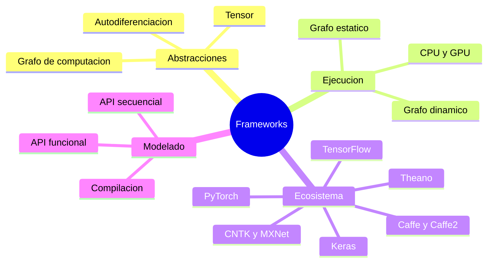

### Framework de aprendizaje profundo

Biblioteca o conjunto de bibliotecas que proporciona operaciones, capas, optimizadores y herramientas para definir y entrenar redes neuronales. Reduce la necesidad de programar a mano el cálculo vectorial y las derivadas.

### Tensor

Arreglo numérico de dimensión arbitraria: un escalar es un tensor de orden cero, un vector de orden uno y una matriz de orden dos. Los frameworks expresan datos, parámetros y resultados intermedios como tensores.

### Grafo de computación

Representación dirigida de un cálculo: los nodos son operaciones y las aristas transportan tensores. Permite conocer dependencias, ordenar la ejecución, calcular gradientes y distribuir operaciones entre dispositivos.

### Diferenciación automática

Mecanismo que construye derivadas a partir de las operaciones registradas en el grafo. Aplica reglas locales y la regla de la cadena, evitando implementar manualmente el _backward pass_ de cada modelo completo.

### Grafo estático

Grafo definido antes de ejecutar los datos. Conocer toda la estructura por adelantado facilita validaciones y optimizaciones globales, aunque puede volver menos natural el código con control dinámico.

### Grafo dinámico

Grafo construido a medida que se ejecutan las operaciones. Hace que la definición se parezca al flujo ordinario del programa y permite variar la estructura entre ejemplos o iteraciones.

### TensorFlow

Framework de computación numérica orientado especialmente al aprendizaje automático. Su modelo original utilizaba grafos estáticos y sesiones; las versiones modernas adoptaron la ejecución inmediata como comportamiento habitual.

### Sesión de TensorFlow

En la API histórica de TensorFlow 1.x, entorno que reservaba recursos y evaluaba las operaciones de un grafo mediante llamadas a `run()`. Es un concepto relevante para mantener o migrar código antiguo, pero no describe la interfaz principal actual.

<Aside type="note" title="Estado en 2026: TensorFlow 1.x">
  Las sesiones y `tf.Session()` están obsoletas para código nuevo. En TensorFlow
  2, el equivalente habitual es la ejecución inmediata; cuando se necesita un
  grafo optimizable se utiliza `tf.function`. `tf.compat.v1` se conserva para
  migraciones, no como API recomendada. Consulta la [guía oficial de migración
  de TensorFlow](https://www.tensorflow.org/guide/migrate/tf1_vs_tf2).
</Aside>

### Ejecución inmediata (_eager execution_)

Modo en el que cada operación se evalúa al invocarse, sin requerir una sesión explícita. Facilita la inspección de valores y la depuración interactiva.

### TensorBoard

Herramienta de visualización para inspeccionar grafos, métricas, distribuciones y otros datos de un experimento. Ayuda a diagnosticar el entrenamiento y comparar ejecuciones.

### Theano

Biblioteca pionera de computación numérica con grafos y aceleración por GPU. Influyó en frameworks posteriores; su desarrollo oficial terminó y actualmente tiene un valor principalmente histórico.

<Aside type="note" title="Estado en 2026: Theano">
  Theano está obsoleto.
  [PyTensor](https://pytensor.readthedocs.io/en/latest/introduction.html)
  continúa su linaje de grafos tensoriales para computación simbólica, pero su
  propia documentación aclara que no es un framework de aprendizaje profundo.
  Para desarrollar redes nuevas, los equivalentes prácticos son PyTorch,
  TensorFlow, JAX o Keras 3.
</Aside>

### Torch (Lua)

Framework de cálculo científico y aprendizaje profundo cuyo lenguaje principal era Lua. Aportó tensores, módulos neuronales y aceleración mediante CPU o GPU, y constituye el antecedente directo de PyTorch.

<Aside type="note" title="Estado en 2026: Torch">
  [Torch basado en Lua](https://github.com/torch/torch7) ya no tiene desarrollo
  activo y no es la opción vigente para proyectos nuevos. Su sucesor práctico es
  **PyTorch**, que conserva buena parte de su enfoque tensorial dentro del
  ecosistema de Python.
</Aside>

### PyTorch

Framework que popularizó un estilo imperativo con grafos dinámicos y diferenciación automática. Este enfoque simplifica el código de investigación y la definición de estructuras que dependen de los datos.

<Aside type="note" title="Estado en 2026: PyTorch">
  PyTorch sigue vigente y cubre tanto investigación como producción. Además de
  reemplazar al antiguo Torch de Lua, incorporó Caffe2 a su repositorio en 2018,
  según la [documentación del
  proyecto](https://github.com/pytorch/pytorch/blob/main/CONTRIBUTING.md#caffe2-notes).
</Aside>

### Caffe y Caffe2

**Caffe** fue un framework centrado en visión y despliegue que describía las redes mediante archivos `prototxt`. **Caffe2** amplió esa idea con grafos estáticos, una interfaz de Python y mayor atención a escenarios de producción.

<Aside type="note" title="Estado en 2026: Caffe y Caffe2">
  Caffe debe considerarse tecnología heredada: su repositorio continúa
  disponible, pero su versión estable y sus instrucciones corresponden a un
  ecosistema antiguo. Caffe2 dejó de ser un framework independiente al
  integrarse en PyTorch. Para desarrollo nuevo, el equivalente general es
  **PyTorch**; TensorFlow también cubre entrenamiento y producción. Consulta el
  [repositorio de Caffe](https://github.com/BVLC/caffe) y el [historial de la
  integración de
  Caffe2](https://pytorch.org/blog/pytorch-the-open-language-of-ai/).
</Aside>

### Microsoft Cognitive Toolkit (CNTK)

Framework de Microsoft orientado al entrenamiento distribuido de redes profundas. Permitía expresar modelos como grafos de cómputo y ejecutarlos sobre CPU o GPU.

<Aside type="note" title="Estado en 2026: CNTK">
  CNTK está obsoleto: la versión 2.7 fue anunciada como su última versión
  principal y el repositorio quedó archivado en 2026. Microsoft recomienda ONNX
  y ONNX Runtime para operar modelos existentes; para entrenamiento nuevo se
  emplean frameworks mantenidos como PyTorch, TensorFlow o JAX. Consulta el
  [aviso oficial de CNTK](https://github.com/microsoft/CNTK).
</Aside>

### Apache MXNet

Framework de aprendizaje profundo concebido para ofrecer eficiencia, flexibilidad y escalado distribuido. Mantuvo una asociación histórica con los servicios de AWS.

<Aside type="note" title="Estado en 2026: Apache MXNet">
  MXNet está obsoleto como proyecto activo: Apache lo retiró en septiembre de
  2023 y lo trasladó al Attic en 2024. Para sistemas nuevos se utilizan PyTorch,
  TensorFlow o JAX. Consulta el [registro oficial de Apache
  MXNet](https://attic.apache.org/projects/mxnet.html).
</Aside>

### Keras

API de alto nivel para componer capas, configurar el entrenamiento y ejecutar modelos con menos código. Abstrae operaciones de bajo nivel sin impedir definir arquitecturas más complejas cuando se necesita.

<Aside type="note" title="Estado en 2026: Keras">
  **Keras 3** sigue vigente y funciona con TensorFlow, JAX o PyTorch; Theano y
  CNTK ya no son backends actuales. Los modelos que solo utilizan componentes
  integrados pueden cambiar de backend con pocas modificaciones. Consulta la
  [documentación oficial de Keras 3](https://keras.io/keras_3/).
</Aside>

### API secuencial

Estilo de Keras que encadena capas en un único recorrido lineal. Es adecuado cuando cada capa tiene exactamente una entrada y una salida dentro de una pila simple.

### API funcional

Estilo que conecta explícitamente tensores y capas. Permite ramas, múltiples entradas o salidas, reutilización de capas y topologías que no caben en una secuencia lineal.

### Capa densa (_Dense_)

Capa totalmente conectada que calcula una transformación afín seguida, opcionalmente, de una activación:

$$
\mathbf{y}=\phi\!\left(W\mathbf{x}+\mathbf{b}\right)
$$

**Símbolos:** $\mathbf{x}$ es el vector de entrada; $W$, la matriz de pesos; $\mathbf{b}$, el vector de sesgos; $\phi$, la función de activación; y $\mathbf{y}$, el vector de salida.

### Compilación del modelo

Configuración que asocia al modelo una pérdida, un optimizador y métricas. En APIs de alto nivel también verifica compatibilidad de formas y prepara el procedimiento de entrenamiento.

### Entropía cruzada categórica

Pérdida habitual para clasificación multiclase. Si $y_k$ es la etiqueta y $\hat y_k$ la probabilidad predicha para la clase $k$:

$$
\mathcal{L}=-\sum_{k=1}^{K} y_k\log \hat y_k
$$

**Símbolos:** $\mathcal{L}$ es la pérdida; $K$, el número de clases; $k$, el índice de clase; $y_k$, la etiqueta real para esa clase; y $\hat y_k$, la probabilidad que el modelo le asigna.

---

## 4. Entrenamiento práctico: activación, inicialización, optimización y regularización

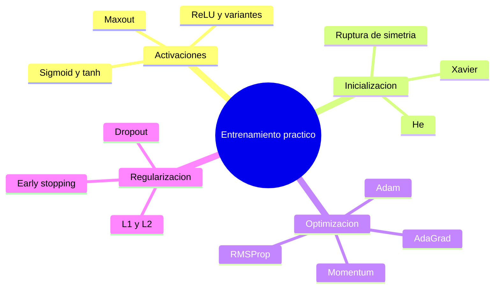

### Saturación

Región de una activación donde cambios grandes en la entrada producen variaciones mínimas en la salida. Allí la derivada se acerca a cero y el gradiente que atraviesa la unidad puede debilitarse.

### Tangente hiperbólica (_tanh_)

Activación acotada entre $-1$ y $1$ y centrada en cero:

$$
\tanh(z)=\frac{e^z-e^{-z}}{e^z+e^{-z}}
$$

**Símbolos:** $z$ es la entrada; $\tanh(z)$, la salida de la activación; y $e$, la constante de Euler.

Aunque mejora el centrado respecto de la sigmoide, también se satura para entradas de gran magnitud.

### Unidad lineal rectificada (ReLU)

Activación que conserva los valores positivos y anula los negativos:

$$
\operatorname{ReLU}(z)=\max(0,z)
$$

**Símbolos:** $z$ es la entrada de la unidad y $\operatorname{ReLU}(z)$ es su salida rectificada.

Es barata de calcular y no se satura en el tramo positivo, cualidades que favorecen el entrenamiento de redes profundas.

### ReLU muerta

Unidad ReLU que queda siempre en el tramo negativo y, por tanto, produce salida y gradiente iguales a cero. Actualizaciones demasiado grandes pueden provocar este estado.

### Leaky ReLU y PReLU

Variantes que conservan una pendiente pequeña cuando $z<0$ para evitar unidades completamente inactivas:

$$
\operatorname{LeakyReLU}(z)=\max(\alpha z,z)
$$

**Símbolos:** $z$ es la entrada y $\alpha$ es la pendiente aplicada en la región negativa; en Leaky ReLU se fija como una constante pequeña y en PReLU se aprende como parámetro.

### ELU

Activación lineal para valores positivos y exponencial para negativos. Su rama negativa permite salidas por debajo de cero y suaviza la transición respecto de una ReLU básica.

### Maxout

Unidad que devuelve el máximo entre varias transformaciones afines. Puede representar funciones lineales por tramos flexibles, a cambio de incrementar el número de parámetros.

### Ruptura de simetría

Necesidad de iniciar unidades equivalentes con pesos diferentes. Si todos los pesos comienzan en cero, unidades de una misma capa reciben gradientes idénticos y aprenden la misma función.

### Inicialización aleatoria

Asignación de valores pequeños y distintos a los pesos para romper la simetría. La escala importa: valores extremos pueden saturar activaciones y valores demasiado pequeños pueden debilitar señales en redes profundas.

### Inicialización Xavier o Glorot

Estrategia que escala los pesos según el número de entradas y salidas para conservar aproximadamente la varianza entre capas:

$$
\operatorname{Var}(W)\approx\frac{2}{n_{\text{in}}+n_{\text{out}}}
$$

**Símbolos:** $W$ es la matriz de pesos; $\operatorname{Var}(W)$, la varianza buscada para sus valores; $n_{\text{in}}$ y $n_{\text{out}}$, los números de conexiones de entrada y salida; y $2$, el factor de escala de esta inicialización.

### Inicialización He

Escalado pensado para activaciones ReLU, cuya varianza típica es:

$$
\operatorname{Var}(W)\approx\frac{2}{n_{\text{in}}}
$$

**Símbolos:** $W$ es la matriz de pesos; $\operatorname{Var}(W)$, la varianza buscada; $n_{\text{in}}$, el número de conexiones de entrada; y $2$, el factor que compensa el efecto de las activaciones ReLU.

### Normalización por lotes (_batch normalization_)

Normaliza activaciones con la media y la varianza del minilote, y después aplica escala y desplazamiento aprendibles:

$$
\hat{x}_i=\frac{x_i-\mu_B}{\sqrt{\sigma_B^2+\varepsilon}},
\qquad
y_i=\gamma\hat{x}_i+\beta
$$

**Símbolos:** $x_i$ es la activación del ejemplo $i$; $B$, el minilote; $\mu_B$ y $\sigma_B^2$, su media y varianza; $\varepsilon$, una constante pequeña que evita inestabilidad numérica; $\hat{x}_i$, la activación normalizada; $\gamma$ y $\beta$, la escala y el desplazamiento aprendibles; y $y_i$, la salida transformada.

Durante inferencia se emplean estadísticas acumuladas, no las de un lote nuevo.

### Momento (_momentum_)

Extensión de SGD que acumula una velocidad basada en gradientes anteriores. Reduce oscilaciones y mantiene avance en direcciones coherentes:

$$
v_t=\rho v_{t-1}-\eta\nabla J(\theta_t),
\qquad
\theta_{t+1}=\theta_t+v_t
$$

**Símbolos:** $v_t$ es la velocidad acumulada en la iteración $t$; $\rho$, el coeficiente que conserva parte de la velocidad anterior; $\eta$, la tasa de aprendizaje; $J$, el coste; $\theta_t$, los parámetros actuales; y $\nabla J(\theta_t)$, su gradiente.

### Momento de Nesterov

Variante que calcula el gradiente después de anticipar el desplazamiento asociado con la velocidad. Esta "mirada hacia delante" puede mejorar la corrección del paso.

### AdaGrad

Optimizador que adapta una tasa distinta a cada parámetro al dividir el gradiente por la raíz de los cuadrados acumulados. Favorece parámetros con gradientes infrecuentes, pero su tasa efectiva puede disminuir demasiado.

### RMSProp

Evita la acumulación ilimitada de AdaGrad usando una media móvil exponencial de los gradientes cuadrados. Así mantiene tasas adaptativas sin detener prematuramente el aprendizaje.

### Adam

Optimizador adaptativo que combina una media móvil del gradiente con otra de su cuadrado, junto con correcciones de sesgo. En forma simplificada:

$$
\theta_{t+1}=\theta_t-
\eta\frac{\hat m_t}{\sqrt{\hat v_t}+\varepsilon}
$$

**Símbolos:** $\theta_t$ son los parámetros en la iteración $t$; $\eta$, la tasa de aprendizaje; $\hat m_t$, la estimación corregida del promedio del gradiente; $\hat v_t$, la estimación corregida del promedio de su cuadrado; y $\varepsilon$, una constante pequeña de estabilidad numérica.

### Decaimiento de la tasa de aprendizaje

Reducción programada de $\eta$ durante el entrenamiento. Permite pasos grandes al principio y ajustes más finos cerca de una solución; puede seguir escalones, una curva exponencial u otra agenda.

### Sobreajuste (_overfitting_)

Situación en la que el modelo se adapta demasiado a particularidades del conjunto de entrenamiento y pierde rendimiento en datos no vistos. Se observa cuando el error de entrenamiento sigue bajando mientras el de validación comienza a subir.

### Generalización

Capacidad del modelo para conservar un buen desempeño en ejemplos que no participaron en su ajuste. Es el objetivo real del aprendizaje, no la memorización del conjunto de entrenamiento.

### Regularización

Conjunto de técnicas que limitan la capacidad efectiva del modelo o introducen restricciones para reducir el sobreajuste.

### Regularización L2

Añade a la pérdida una penalización por el cuadrado de los pesos:

$$
J_{L2}(\theta)=J(\theta)+\lambda\sum_j w_j^2
$$

**Símbolos:** $J_{L2}$ es el coste regularizado; $J$ es el coste original; $\theta$, el conjunto de parámetros; $\lambda$, la intensidad de la penalización; y $w_j$, cada peso penalizado.

Favorece pesos pequeños y distribuidos; normalmente no se aplica a los términos de sesgo.

### Regularización L1

Penaliza el valor absoluto de los pesos:

$$
J_{L1}(\theta)=J(\theta)+\lambda\sum_j |w_j|
$$

**Símbolos:** $J_{L1}$ es el coste regularizado; $J$ es el coste original; $\theta$, el conjunto de parámetros; $\lambda$, la intensidad de la penalización; y $w_j$, cada peso penalizado.

Tiende a producir soluciones dispersas, con numerosos pesos iguales o cercanos a cero.

### Regularización por norma máxima (_max-norm_)

Restringe la norma de los vectores de pesos para que no supere un límite. Tras una actualización, los pesos que exceden ese radio se proyectan de nuevo al conjunto permitido.

### _Dropout_

Durante el entrenamiento desactiva aleatoriamente una fracción de las unidades. Impide dependencias excesivas entre activaciones y puede interpretarse como el entrenamiento de muchas subredes compartiendo parámetros. En inferencia se usa la red completa con el escalado correspondiente.

### Parada temprana (_early stopping_)

Interrumpe el entrenamiento cuando la métrica de validación deja de mejorar. Evita continuar hacia una región que reduce el error de entrenamiento pero empeora la generalización.

### Conjunto de validación

Subconjunto separado del entrenamiento que sirve para elegir hiperparámetros, decidir cuándo detener el ajuste y comparar configuraciones. No debe reemplazar al conjunto de prueba final.

---

## 5. Redes neuronales convolucionales (CNN)

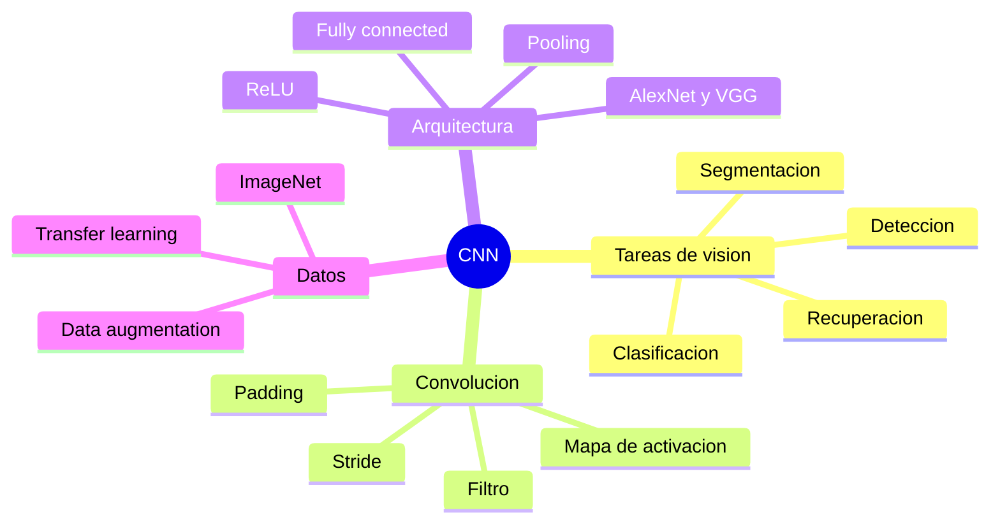

### Red neuronal convolucional (CNN)

Arquitectura que explota la estructura espacial de imágenes u otros datos en rejilla. Usa filtros locales con pesos compartidos, por lo que necesita muchos menos parámetros que una capa totalmente conectada aplicada directamente a todos los píxeles.

### Clasificación de imágenes

Tarea de asignar una o varias categorías a una imagen completa. La salida suele ser una distribución de probabilidad sobre las clases.

### Recuperación de imágenes (_image retrieval_)

Búsqueda de imágenes visualmente o semánticamente similares. Puede comparar representaciones internas extraídas por una CNN, en vez de los píxeles sin procesar.

### Detección de objetos

Problema que combina clasificación y localización: identifica qué objetos aparecen y estima sus regiones o cajas delimitadoras.

### Segmentación

Asignación de una clase a cada píxel o región de la imagen. A diferencia de la clasificación global, conserva explícitamente la distribución espacial de los elementos.

### Filtro o _kernel_ convolucional

Pequeño tensor de pesos que recorre el volumen de entrada. En cada posición calcula un producto local y aprende a responder ante patrones como bordes, texturas o formas.

### Capa convolucional

Capa que aplica varios filtros compartidos a distintas posiciones del dato. Para una convolución bidimensional simplificada:

$$
y_{i,j,k}=b_k+\sum_{u,v,c}W_{u,v,c,k}\,x_{i+u,j+v,c}
$$

**Símbolos:** $y_{i,j,k}$ es la salida en la posición $(i,j)$ y el canal $k$; $b_k$, el sesgo del filtro $k$; $W_{u,v,c,k}$, su peso en el desplazamiento espacial $(u,v)$ y el canal de entrada $c$; y $x_{i+u,j+v,c}$, el valor de entrada cubierto por ese peso.

Cada índice $k$ corresponde a un filtro y, por tanto, a un canal de salida.

### Mapa de activación

Matriz producida al desplazar un filtro sobre la entrada. Indica dónde y con qué intensidad se detectó el patrón asociado con ese filtro.

### Profundidad o canales

Tercera dimensión de una imagen o volumen de activaciones. Una imagen RGB tiene tres canales; una capa convolucional produce tantos canales de salida como filtros tenga.

### Paso (_stride_)

Cantidad de posiciones que avanza el filtro en cada desplazamiento. Un paso mayor reduce las dimensiones espaciales de la salida.

### Relleno con ceros (_zero-padding_)

Adición de ceros alrededor de la entrada para controlar el tamaño de salida y permitir que el filtro procese los bordes. Para entrada $N$, filtro $F$, relleno $P$ y paso $S$:

$$
N_{\text{salida}}=\left\lfloor\frac{N-F+2P}{S}\right\rfloor+1
$$

**Símbolos:** $N$ es el tamaño espacial de la entrada; $F$, el tamaño del filtro; $P$, el relleno aplicado a cada lado; $S$, el paso; y $N_{\text{salida}}$, el tamaño espacial resultante.

### _Pooling_

Operación fija que resume regiones vecinas para reducir dimensiones espaciales. No añade pesos y aporta cierta tolerancia a pequeños desplazamientos.

### _Max pooling_

Forma de _pooling_ que conserva el máximo de cada ventana. Puede interpretarse como seleccionar la activación más fuerte de una región.

### ImageNet e ILSVRC

ImageNet es un gran conjunto de imágenes etiquetadas; ILSVRC fue una competición de reconocimiento visual construida sobre parte de esos datos. Su uso impulsó comparaciones estandarizadas entre arquitecturas profundas.

### LeNet-5

Arquitectura convolucional temprana aplicada al reconocimiento de caracteres y dígitos. Demostró que convolución, reducción espacial y entrenamiento por gradiente podían formar un sistema práctico de visión.

### AlexNet

CNN profunda que obtuvo una mejora decisiva en ILSVRC 2012. Combinó convoluciones, ReLU, _dropout_, aumento de datos y entrenamiento acelerado con GPU.

### VGGNet

Familia de CNN profundas basada en bloques repetidos de filtros $3\times3$ y _pooling_. VGG16 y VGG19 muestran cómo filtros pequeños apilados pueden construir campos receptivos mayores, aunque con muchos parámetros.

### Aumento de datos (_data augmentation_)

Generación de ejemplos de entrenamiento mediante transformaciones que preservan la etiqueta, como recortes, reflejos o cambios moderados de brillo. Aumenta la variabilidad observada y actúa como regularizador.

### Aprendizaje por transferencia (_transfer learning_)

Reutilización de un modelo entrenado en una tarea amplia como punto de partida para otra relacionada. Las capas iniciales aportan representaciones generales y las finales se sustituyen o reajustan.

### Congelación de capas

Decisión de mantener fijos ciertos pesos durante la transferencia. Reduce el número de parámetros que deben ajustarse y es útil cuando el nuevo conjunto de datos es pequeño.

---

## 6. Representaciones del lenguaje y Word2Vec

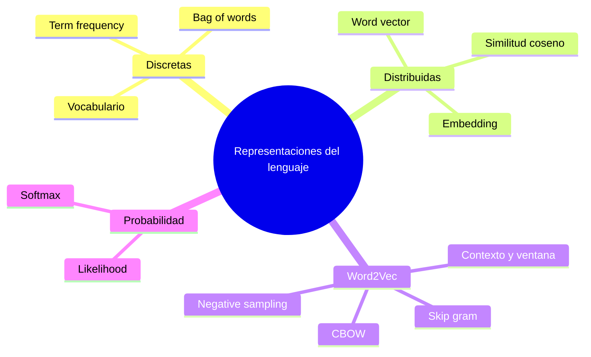

### Procesamiento del lenguaje natural (PLN)

Área que desarrolla métodos computacionales para analizar o generar lenguaje humano. Su dificultad procede, entre otros factores, de la ambigüedad, el contexto y el cambio continuo de significados.

### WordNet

Recurso léxico que agrupa palabras por significado y registra relaciones como sinonimia o antonimia. Representa conocimiento semántico explícito, pero exige mantenimiento manual y no proporciona por sí solo una geometría continua del significado.

### Vocabulario

Conjunto finito de unidades lingüísticas reconocidas por un modelo. En las representaciones discretas, cada posición del vector suele corresponder a una palabra del vocabulario.

### Frecuencia de término (_term frequency_)

Número de veces que una palabra aparece en un texto. Produce una representación simple, pero no conserva el orden ni distingue por sí misma la relevancia semántica.

### Bolsa de palabras (_bag-of-words_)

Representación que registra presencia o frecuencia de términos e ignora su orden. Es compacta conceptualmente, aunque pierde información sintáctica y relaciones entre palabras.

### Representación discreta

Codificación en la que cada palabra ocupa una dimensión independiente. Dos términos distintos resultan ortogonales aun cuando sus significados sean cercanos.

### Representación distribuida

Vector denso en el que el significado se reparte entre múltiples dimensiones aprendidas. Palabras usadas en contextos parecidos tienden a ocupar regiones próximas.

### Vector de palabra o _embedding_

Representación numérica densa de una palabra. Su geometría permite usar similitudes y relaciones semánticas como entrada de otros modelos.

### Corpus

Colección de textos usada para obtener estadísticas lingüísticas o entrenar representaciones. La cobertura, calidad y sesgos del corpus afectan directamente a los vectores aprendidos.

### Contexto y ventana

El contexto es el conjunto de palabras próximas a un término central; la ventana define cuántas posiciones a cada lado se consideran. Word2Vec aprende a partir de estas coapariciones.

### Word2Vec

Familia de modelos que aprende vectores prediciendo palabras relacionadas por contexto. Su supuesto distributivo es que términos usados en entornos lingüísticos semejantes suelen guardar una relación semántica.

### Verosimilitud (_likelihood_)

Medida de qué tan probables son los contextos observados bajo los vectores actuales. En _skip-gram_, una formulación del objetivo es:

$$
L(\theta)=\prod_{t=1}^{T}
\prod_{\substack{-m\le j\le m\\j\ne0}}
p(w_{t+j}\mid w_t;\theta)
$$

**Símbolos:** $L(\theta)$ es la verosimilitud; $\theta$, los parámetros de los vectores; $T$, la longitud de la secuencia; $t$, la posición de la palabra central $w_t$; $m$, el radio de la ventana; $j$, el desplazamiento dentro de ella; y $p(w_{t+j}\mid w_t;\theta)$, la probabilidad de una palabra de contexto dada la central.

El entrenamiento suele minimizar el logaritmo negativo, que transforma productos en sumas.

### Similitud coseno

Mide la orientación compartida por dos vectores, independientemente de su escala:

$$
\operatorname{cos}(\mathbf{u},\mathbf{v})=
\frac{\mathbf{u}^{\mathsf T}\mathbf{v}}{\lVert\mathbf{u}\rVert_2\lVert\mathbf{v}\rVert_2}
$$

**Símbolos:** $\mathbf{u}$ y $\mathbf{v}$ son los vectores comparados; $\mathbf{u}^{\mathsf T}\mathbf{v}$ es su producto escalar; y $\lVert\mathbf{u}\rVert_2$ y $\lVert\mathbf{v}\rVert_2$ son sus magnitudes euclídeas.

Valores cercanos a 1 indican direcciones similares.

### _Softmax_

Función que convierte una colección de puntuaciones en una distribución de probabilidad:

$$
\operatorname{softmax}(z_i)=
\frac{e^{z_i}}{\sum_{j=1}^{K}e^{z_j}}
$$

**Símbolos:** $z_i$ es la puntuación de la clase $i$; $K$, el número de clases; $j$, el índice usado para normalizar todas las puntuaciones; $e$, la constante de Euler; y $\operatorname{softmax}(z_i)$, la probabilidad asignada a la clase $i$.

En Word2Vec, las puntuaciones pueden ser productos escalares entre vectores centrales y de contexto.

### Muestreo negativo (_negative sampling_)

Aproximación que contrasta pares de palabras observados con unos pocos pares elegidos como negativos. Evita normalizar sobre todo el vocabulario en cada paso y acelera el entrenamiento.

### _Skip-gram_

Variante de Word2Vec que predice las palabras del contexto a partir de una palabra central.

### _Continuous bag-of-words_ (CBOW)

Variante que combina las palabras del contexto para predecir la palabra central. Invierte la dirección predictiva de _skip-gram_.

### Vectores preentrenados

Embeddings aprendidos previamente con corpus extensos y reutilizados como entrada de otra tarea. Constituyen una forma de transferencia de conocimiento lingüístico.

<Aside type="caution" title="Los embeddings heredan el corpus">
  La proximidad vectorial refleja regularidades estadísticas, no una definición
  objetiva del significado. Los vectores también pueden codificar ausencias,
  errores y sesgos presentes en los textos de entrenamiento.
</Aside>

---

## 7. Redes neuronales recurrentes (RNN)

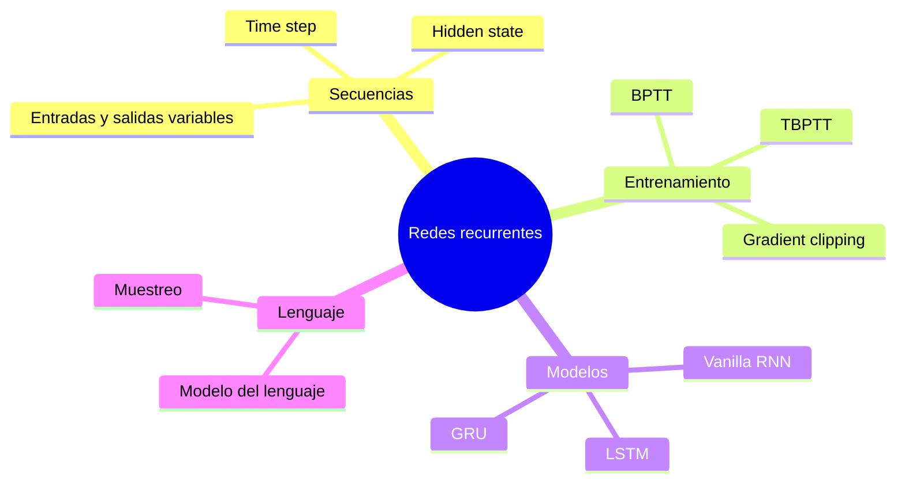

### Secuencia

Colección ordenada de elementos cuya posición o dependencia temporal es relevante. Texto, audio, vídeo y series de sensores son ejemplos de datos secuenciales.

### Red neuronal recurrente (RNN)

Red que procesa una secuencia manteniendo un estado interno. En cada paso combina el elemento actual con la memoria acumulada, lo que permite entradas y salidas de longitud variable.

### Estado oculto (_hidden state_)

Vector que resume la información procesada hasta un punto de la secuencia. Para una RNN básica:

$$
\mathbf{h}_t=\tanh\!\left(W_{xh}\mathbf{x}_t+W_{hh}\mathbf{h}_{t-1}+\mathbf{b}_h\right)
$$

**Símbolos:** $\mathbf{x}_t$ es la entrada del paso $t$; $\mathbf{h}_{t-1}$ y $\mathbf{h}_t$, los estados ocultos anterior y actual; $W_{xh}$, la matriz de pesos de entrada a estado; $W_{hh}$, la matriz recurrente; $\mathbf{b}_h$, el sesgo; y $\tanh$, la activación.

### Paso temporal (_time step_)

Iteración en la que la RNN consume un elemento $\mathbf{x}_t$ y actualiza su estado. El término no implica necesariamente tiempo físico: también puede ser la posición de una palabra.

### RNN básica (_vanilla RNN_)

Forma elemental de red recurrente que usa una sola transformación, normalmente `tanh`, para actualizar el estado. Comparte las mismas matrices de pesos en todos los pasos.

### Desenrollado de una RNN

Representación del ciclo recurrente como una cadena de copias a lo largo de la secuencia. Las copias comparten parámetros, pero mantienen estados intermedios distintos.

### Retropropagación a través del tiempo (BPTT)

Aplicación de _backpropagation_ sobre la red desenrollada. La pérdida puede recibir aportaciones de varios pasos y el gradiente recorre las dependencias temporales hacia atrás.

### BPTT truncada (TBPTT)

Variante que divide secuencias largas y limita cuántos pasos atraviesa el gradiente. Conserva el estado entre fragmentos, pero reduce memoria y coste computacional.

### Modelo del lenguaje

Modelo que asigna probabilidad a una secuencia. Mediante la regla del producto:

$$
p(w_1,\ldots,w_T)=\prod_{t=1}^{T}p(w_t\mid w_1,\ldots,w_{t-1})
$$

**Símbolos:** $w_1,\ldots,w_T$ son los elementos de una secuencia de longitud $T$; $t$, la posición actual; $p(w_1,\ldots,w_T)$, la probabilidad de la secuencia completa; y $p(w_t\mid w_1,\ldots,w_{t-1})$, la probabilidad del elemento actual dado su historial.

Puede puntuar secuencias o generar nuevos elementos de forma autoregresiva.

### Muestreo autoregresivo

Procedimiento de generar un elemento desde la distribución predicha y utilizarlo como entrada del paso siguiente. Muestrear, en vez de elegir siempre el máximo, produce secuencias diversas.

### Gradiente explosivo

Gradiente cuya magnitud crece de forma descontrolada al multiplicarse repetidamente durante BPTT. Puede producir actualizaciones inestables y valores numéricos inválidos.

### Recorte de gradiente (_gradient clipping_)

Control que reescala el gradiente cuando su norma supera un umbral $c$:

$$
\mathbf{g}\leftarrow
\mathbf{g}\min\!\left(1,\frac{c}{\lVert\mathbf{g}\rVert_2}\right)
$$

**Símbolos:** $\mathbf{g}$ es el vector de gradiente; $c$, la norma máxima permitida; $\lVert\mathbf{g}\rVert_2$, su norma euclídea; y $\leftarrow$ indica que el gradiente se reemplaza por su versión reescalada.

Mitiga gradientes explosivos, pero no resuelve los que se desvanecen.

### Gradiente desvanecido

Gradiente que se aproxima a cero al atravesar muchas operaciones. Impide que los pasos lejanos influyan de forma efectiva en los parámetros iniciales de la secuencia.

### LSTM (_long short-term memory_)

Unidad recurrente con un estado de celda y puertas que regulan qué información olvidar, incorporar y exponer. Su ruta aditiva facilita conservar dependencias más largas que una RNN básica.

### Estado de celda (_cell state_)

Memoria interna $mathbf{c}_t$ de una LSTM. Se actualiza combinando parte de la memoria anterior con nueva información candidata:

$$
\mathbf{c}_t=\mathbf{f}_t\odot\mathbf{c}_{t-1}
+\mathbf{i}_t\odot\tilde{\mathbf{c}}_t
$$

**Símbolos:** $\mathbf{c}_t$ y $\mathbf{c}_{t-1}$ son los estados de celda actual y anterior; $\mathbf{f}_t$, la puerta de olvido; $\mathbf{i}_t$, la puerta de entrada; $\tilde{\mathbf{c}}_t$, la memoria candidata; y $\odot$, la multiplicación elemento a elemento.

### Puertas de una LSTM

Vectores con valores entre cero y uno que funcionan como controles. La puerta de olvido $mathbf{f}_t$ conserva o descarta memoria; la de entrada $mathbf{i}_t$ escribe información; y la de salida $mathbf{o}_t$ regula el estado visible.

### GRU (_gated recurrent unit_)

Unidad recurrente con puertas que combina estado oculto y memoria en un solo vector. Es más simple que una LSTM y también busca preservar dependencias largas.

### RNN apilada

Arquitectura profunda donde la secuencia de salidas de una RNN alimenta a otra. Las capas superiores pueden aprender patrones temporales más abstractos.

### RNN bidireccional

Arquitectura que procesa la secuencia en ambos sentidos y combina las representaciones. Es útil cuando la predicción puede usar contexto anterior y posterior.

---

## 8. Agentes inteligentes y aprendizaje profundo por refuerzo

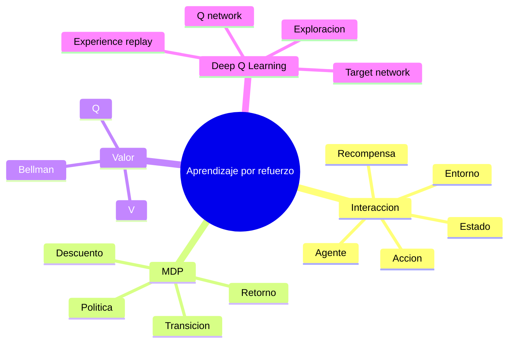

### Aprendizaje por refuerzo (RL)

Paradigma en el que un agente aprende a elegir acciones mediante su interacción con un entorno. No recibe la respuesta correcta para cada estado; recibe recompensas y busca maximizar su acumulación a largo plazo.

### Agente

Entidad que observa un estado, selecciona una acción y actualiza su comportamiento según la experiencia.

### Entorno

Sistema externo sobre el que actúa el agente. Determina el estado siguiente y la recompensa producida por una acción.

### Estado

Representación de la situación relevante para decidir. Puede ser compacta, como posición y velocidad, o de alta dimensión, como varios fotogramas de un videojuego.

### Acción

Decisión disponible para el agente en un estado. El conjunto puede ser discreto, continuo o depender del estado.

### Recompensa (_reward_)

Señal escalar inmediata que expresa el resultado local de una transición. Diseñar recompensas adecuadas es crucial, pues el agente optimiza esa señal y no una intención no formalizada.

### Proceso de decisión de Markov (MDP)

Modelo matemático definido, en una notación común, por la tupla $(\mathcal S,\mathcal A,P,R,\gamma)$: estados, acciones, probabilidades de transición, recompensas y factor de descuento.

### Propiedad de Markov

Supuesto de que el estado actual contiene toda la información necesaria para modelar la transición siguiente; dado $s_t$ y $a_t$, el pasado no añade información relevante.

### Política

Regla de comportamiento $\pi(a\mid s)$ que asigna acciones, o probabilidades sobre acciones, a cada estado.

### Factor de descuento

Valor $\gamma\in[0,1]$ que reduce el peso de recompensas futuras. El retorno desde $t$ es:

$$
G_t=\sum_{k=0}^{\infty}\gamma^k r_{t+k+1}
$$

**Símbolos:** $G_t$ es el retorno desde el paso $t$; $k$, la distancia hasta una recompensa futura; $\gamma$, el factor de descuento; y $r_{t+k+1}$, la recompensa recibida $k+1$ pasos después.

### Política óptima

Política $\pi^*$ que maximiza el retorno esperado. Puede no ser única si varias acciones obtienen el mismo valor.

### Función de valor de estado

Retorno esperado al comenzar en $s$ y seguir una política $\pi$:

$$
V^\pi(s)=\mathbb E_\pi[G_t\mid S_t=s]
$$

**Símbolos:** $V^\pi(s)$ es el valor del estado $s$ bajo la política $\pi$; $G_t$, el retorno desde $t$; $S_t$, la variable aleatoria que representa el estado en ese paso; y $\mathbb E_\pi$, la esperanza sobre trayectorias generadas por la política.

### Función de valor de acción (Q)

Retorno esperado después de ejecutar $a$ en $s$ y continuar según $\pi$:

$$
Q^\pi(s,a)=\mathbb E_\pi[G_t\mid S_t=s,A_t=a]
$$

**Símbolos:** $Q^\pi(s,a)$ es el valor de ejecutar la acción $a$ en el estado $s$ y continuar con la política $\pi$; $G_t$ es el retorno; y $S_t$ y $A_t$ son las variables aleatorias de estado y acción en el paso $t$.

### Ecuación de optimalidad de Bellman

Relaciona el valor óptimo de una acción con la recompensa inmediata y el mejor valor futuro:

$$
Q^*(s,a)=\mathbb E\!\left[r+\gamma\max_{a'}Q^*(s',a')\mid s,a\right]
$$

**Símbolos:** $Q^*(s,a)$ es el valor óptimo de la acción $a$ en el estado $s$; $r$, la recompensa inmediata; $\gamma$, el factor de descuento; $s'$, el estado siguiente; $a'$, una posible acción en ese estado; y $\mathbb E$, la esperanza sobre las transiciones posibles.

### Iteración de valores

Método que aplica repetidamente una actualización de Bellman hasta aproximar el valor óptimo. Una tabla explícita deja de ser práctica cuando el espacio de estados es enorme.

### Q-learning

Algoritmo que aprende valores de acción a partir de transiciones sin exigir que la política seguida sea la misma que se evalúa como óptima.

### Red Q profunda (DQN)

Red neuronal $Q(s,a;\theta)$ que aproxima la función Q en espacios de alta dimensión. Puede recibir el estado y producir un valor por cada acción discreta.

### Memoria de repetición de experiencias

Buffer de transiciones $(s,a,r,s')$ del que se extraen minilotes aleatorios. Reduce la correlación entre ejemplos consecutivos y permite reutilizar experiencia.

### Red objetivo (_target network_)

Copia de la Q-network cuyos parámetros se actualizan con menor frecuencia. Estabiliza el objetivo de Bellman evitando que cambie al mismo ritmo que la red entrenada.

### Episodio

Trayectoria desde un estado inicial hasta una condición terminal, como una partida completa.

### Compromiso exploración-explotación

Equilibrio entre elegir acciones conocidas por su buen rendimiento y probar otras que podrían revelar mejores resultados. Una política $\varepsilon$-greedy actúa al azar con probabilidad $\varepsilon$ y elige la mejor acción conocida en caso contrario.

---

## 9. GPU y entrenamiento distribuido

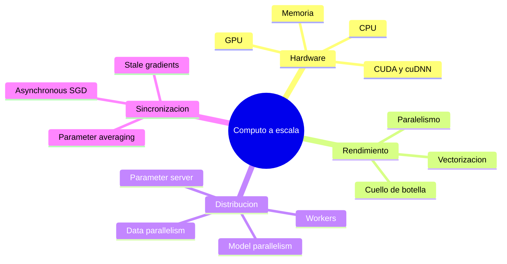

### Unidad de procesamiento gráfico (GPU)

Coprocesador con muchos núcleos relativamente simples, diseñado para ejecutar gran cantidad de operaciones numéricas en paralelo. Resulta eficaz para productos de matrices y convoluciones de redes neuronales.

### Unidad central de procesamiento (CPU)

Procesador de propósito general con menos núcleos, pero más complejos y rápidos en tareas secuenciales. Suele coordinar la ejecución y preparar datos para el acelerador.

### Ancho de banda de memoria

Cantidad de datos transferible por unidad de tiempo entre memoria y procesador. El entrenamiento puede quedar limitado por esta transferencia aunque exista capacidad aritmética disponible.

### CUDA

Plataforma de NVIDIA para programación paralela sobre sus GPU. Proporciona el entorno sobre el que funcionan bibliotecas numéricas optimizadas.

### cuDNN

Biblioteca de primitivas para redes profundas aceleradas en GPU NVIDIA, como convoluciones, _pooling_, normalización y operaciones recurrentes. Los frameworks la utilizan sin exponer normalmente su implementación de bajo nivel.

### OpenCL

Estándar abierto para cómputo paralelo en diferentes clases de dispositivos. Ofrece una alternativa más general a tecnologías ligadas a un fabricante.

### Cuello de botella de entrada

Situación en la que lectura, decodificación o transformación de datos es más lenta que el entrenamiento. Se mitiga con almacenamiento rápido, procesamiento paralelo, buffers y carga anticipada.

### Paralelismo de modelo

División de una red entre varios dispositivos o máquinas. Permite ejecutar modelos que no caben en un solo acelerador, pero introduce comunicación entre sus partes.

### Paralelismo de datos

Replicación del modelo en varios trabajadores, cada uno con un subconjunto de ejemplos. Los gradientes o parámetros se combinan para mantener un modelo compartido.

### Trabajador (_worker_)

Proceso o máquina que ejecuta una parte del entrenamiento distribuido, normalmente el cálculo de predicciones y gradientes sobre un lote local.

### Servidor de parámetros

Componente que almacena los parámetros globales, recibe actualizaciones de los trabajadores y distribuye nuevas versiones del modelo.

### Promedio de parámetros

Esquema síncrono en el que cada trabajador entrena una copia y el servidor promedia los parámetros recibidos. La espera al trabajador más lento limita el rendimiento y la tolerancia a fallos.

### SGD asíncrono

Entrenamiento en el que los trabajadores envían gradientes sin esperar a los demás. Aumenta utilización y tolerancia a retrasos, pero cada gradiente puede haberse calculado con una versión anterior del modelo.

### Downpour SGD

Diseño asíncrono basado en paralelismo de datos y servidores de parámetros. Cada trabajador obtiene parámetros, calcula gradientes y los entrega independientemente para que el servidor actualice el modelo.

### Gradiente obsoleto (_stale gradient_)

Gradiente calculado con parámetros que ya fueron modificados por otros trabajadores. Un retraso excesivo puede deteriorar la convergencia.

### _Benchmark_ de rendimiento

Medición controlada del tiempo, rendimiento o uso de recursos de una configuración. Debe especificar hardware, software, modelo, tamaño de lote y precisión numérica para ser interpretable.

---

## 10. Nube y puesta en producción de modelos

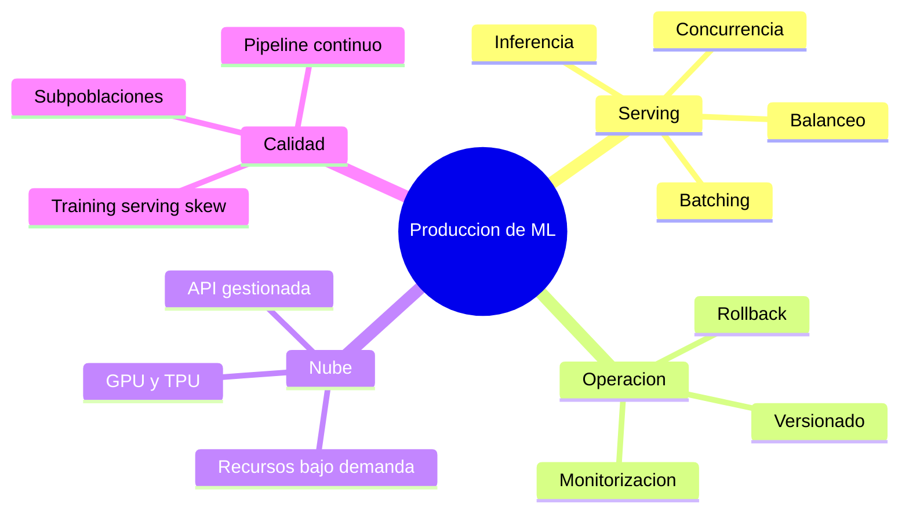

### Inferencia

Uso de un modelo entrenado para producir una salida a partir de datos nuevos. Normalmente requiere solo un pase hacia delante, sin retropropagación ni actualización de parámetros.

### Tiempo de servicio (_serving time_)

Etapa operativa en la que el modelo responde solicitudes reales. También se denomina tiempo de predicción o de inferencia y se contrapone al entrenamiento.

### Servidor de modelos

Servicio que carga artefactos entrenados y expone una interfaz de predicción. Puede incorporar concurrencia, lotes dinámicos, control de versiones y métricas operativas.

<Aside type="note" title="Estado en 2026: servidores de modelos">
  **[TensorFlow Serving](https://www.tensorflow.org/tfx/guide/serving)** y
  **[DeepDetect](https://www.deepdetect.com/)** continúan disponibles.
  **[Clipper](https://github.com/ucbrise/clipper)** ya no se mantiene y se
  conserva como artefacto de investigación; **[MXNet Model Server/Multi Model
  Server](https://github.com/awslabs/multi-model-server)** quedó archivado y
  MXNet fue retirado. Para una plataforma nueva y multiformato, equivalentes
  actuales son [KServe](https://kserve.github.io/website/docs/intro) sobre
  Kubernetes y [NVIDIA Triton Inference
  Server](https://docs.nvidia.com/triton-inference-server/index.html);
  TensorFlow Serving sigue siendo una opción específica para TensorFlow.
</Aside>

### Concurrencia

Capacidad para atender varias solicitudes durante el mismo intervalo. Evita que una predicción lenta bloquee por completo las siguientes.

### Latencia y tiempo de ida y vuelta

La latencia es el tiempo hasta obtener una respuesta; el _round-trip time_ incluye el recorrido completo de la solicitud y su respuesta. Un modelo puede ser rápido aisladamente y aun así sufrir latencia por red, colas o preprocesamiento.

### _Batching_ de inferencia

Agrupación de solicitudes en un tensor para aprovechar operaciones vectorizadas. Aumenta el rendimiento total, aunque esperar a formar el lote puede elevar la latencia individual.

### Buffer

Almacenamiento temporal donde se acumulan solicitudes o datos antes de procesarlos. En _serving_ permite crear lotes, siempre con límites de tiempo y tamaño.

### Balanceador de carga

Componente que reparte solicitudes entre réplicas del servicio según disponibilidad o carga. Facilita el escalado horizontal y la tolerancia a fallos.

### Versionado y _rollback_ de modelos

Identificación explícita de cada artefacto desplegado y capacidad de volver a una versión anterior. Permite rastrear predicciones y recuperarse si el modelo nuevo empeora el servicio.

### REST y gRPC

Formas comunes de exponer predicciones por red. REST suele intercambiar recursos mediante HTTP; gRPC define contratos y llamadas remotas eficientes. La elección depende del ecosistema y los requisitos de interoperabilidad y rendimiento.

### Computación en la nube

Provisión bajo demanda de cómputo, almacenamiento y servicios gestionados. Permite ampliar o reducir recursos sin mantener toda la infraestructura física propia.

### TPU (_tensor processing unit_)

Acelerador especializado para operaciones tensoriales de aprendizaje automático. Es un ejemplo de hardware ofrecido mediante ecosistemas de nube para entrenamiento e inferencia.

### API de IA gestionada

Servicio listo para tareas como visión, voz, traducción o análisis de texto. Reduce la infraestructura propia, pero introduce dependencia del proveedor y limita el control sobre datos y modelo.

### Monitorización

Recopilación de métricas técnicas y del comportamiento del modelo: tráfico, errores, latencia, distribuciones de entrada y calidad de predicción. Debe permitir alertar antes de que la degradación sea grave.

### Métricas _offline_ y _online_

Las métricas _offline_ se calculan con datos retenidos antes del despliegue; las _online_ miden el efecto real del sistema en producción. Un buen resultado _offline_ no garantiza impacto positivo para todos los usuarios.

### Desviación entre entrenamiento y servicio (_training-serving skew_)

Degradación causada por diferencias entre los datos o transformaciones usados al entrenar y al predecir. También aparece cuando cambia la distribución real con el tiempo o entre poblaciones.

### Comportamiento por subpoblaciones

Evaluación separada de grupos relevantes. Una métrica agregada puede mejorar mientras un grupo pequeño empeora de forma importante, por lo que conviene definir segmentos y umbrales explícitos.

### Pipeline de entrenamiento continuo

Flujo automatizado que ingiere y valida datos, entrena, evalúa y despliega nuevas versiones cuando el dominio exige actualización frecuente.

### Validación de datos

Comprobaciones de esquema, valores ausentes, rangos y distribuciones antes de entrenar o servir. Debe detener el pipeline si una anomalía amenaza la validez del modelo.

### Validación del modelo

Puerta previa al despliegue que verifica compatibilidad, métricas globales, desempeño por segmentos y ausencia de regresiones frente a la versión vigente.

<Aside type="danger" title="Un modelo no es todo el sistema">
  Datos, transformaciones, infraestructura, monitorización y mecanismos de
  reversión condicionan el resultado en producción. Desplegar solo el archivo de
  pesos no constituye un servicio de aprendizaje automático confiable.
</Aside>

---

## 11. Modelos generativos y metaaprendizaje

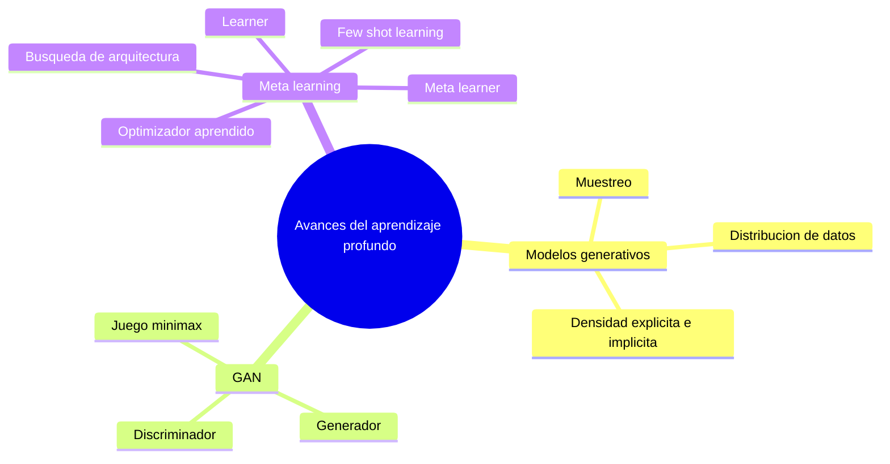

### Modelo generativo

Modelo que aprende regularidades de la distribución de los datos para producir ejemplos nuevos con propiedades similares a los observados.

### Muestreo

Obtención de una realización concreta desde una distribución. En generación, variar la muestra latente permite producir salidas distintas.

### Estimación explícita de densidad

Enfoque que representa o aproxima directamente una función de probabilidad sobre los datos. Los modelos autoregresivos y los autoencoders variacionales pertenecen a esta familia.

### Estimación implícita de densidad

Enfoque que aprende un procedimiento para generar muestras sin evaluar de forma explícita la densidad de cada dato. Las GAN pertenecen a esta categoría.

### PixelRNN y PixelCNN

Modelos autoregresivos de imagen que factorizan la probabilidad conjunta en probabilidades condicionadas de píxeles. PixelRNN emplea recurrencia; PixelCNN usa convoluciones enmascaradas.

### Autoencoder variacional (VAE)

Modelo generativo latente que aprende una distribución aproximada para codificar datos y un decodificador para reconstruir o generar ejemplos. Optimiza una cota variacional que combina reconstrucción y regularización del espacio latente.

### Red generativa adversarial (GAN)

Sistema con dos redes entrenadas en oposición: el generador produce muestras y el discriminador intenta distinguirlas de los datos reales.

### Generador

Red $G$ que transforma un vector aleatorio $\mathbf z$ en una muestra sintética $G(\mathbf z)$. Aprende a producir resultados que el discriminador considere reales.

### Discriminador

Red $D$ que estima la probabilidad de que una muestra proceda de los datos y no del generador. Su señal de error guía indirectamente el aprendizaje de $G$.

### Objetivo minimax de una GAN

Juego de dos participantes en el que el discriminador maximiza la clasificación correcta y el generador intenta engañarlo:

$$
\min_G\max_D\;
\mathbb E_{\mathbf{x}\sim p_{\text{data}}}[\log D(\mathbf{x})]
+\mathbb E_{\mathbf{z}\sim p_{\mathbf z}}[\log(1-D(G(\mathbf z)))]
$$

**Símbolos:** $G$ es el generador y $D$, el discriminador; $\mathbf{x}$ es una muestra real extraída de $p_{\text{data}}$; $\mathbf{z}$, un vector latente extraído de la distribución $p_{\mathbf z}$; $D(\mathbf{x})$, la probabilidad asignada a una muestra real; y $D(G(\mathbf z))$, la asignada a una muestra generada. $\mathbb E$ representa el promedio esperado sobre cada distribución.

Entrenar ambas redes requiere equilibrio; si una domina demasiado pronto, la otra recibe una señal poco útil.

### Metaaprendizaje (_meta-learning_)

Familia de métodos que optimiza la capacidad de aprender tareas nuevas usando experiencia obtenida en tareas anteriores. Su meta no es solo ajustar un modelo, sino mejorar el propio proceso de adaptación.

### Ajuste de hiperparámetros

Búsqueda de configuraciones para un modelo y una tarea concretos. Se relaciona con metaaprendizaje, pero no es equivalente: elegir una configuración no implica aprender una estrategia transferible entre tareas.

### _Learner_ y _meta-learner_

El _learner_ resuelve una tarea particular; el _meta-learner_ modifica cómo se inicializa, actualiza o diseña el primero para que aprenda nuevas tareas con mayor rapidez.

### Aprendizaje de optimizadores

Enfoque donde un modelo auxiliar aprende una regla de actualización de parámetros. Puede usar una RNN para aprovechar la historia de gradientes y proponer pasos adaptados a una familia de problemas.

### Búsqueda de arquitecturas neuronales (NAS)

Automatización del diseño de redes. Un controlador propone arquitecturas hijas, recibe su rendimiento como señal y mejora sus propuestas sucesivas.

### Controlador y red hija

En NAS, el **controlador** genera descripciones de arquitectura y la **red hija** se entrena y evalúa. La métrica de la hija proporciona realimentación al controlador.

### Aprendizaje con pocos ejemplos (_few-shot learning_)

Capacidad de adaptarse a una tarea con una cantidad reducida de ejemplos etiquetados. En metaaprendizaje se entrena sobre muchas tareas y se evalúa la adaptación a tareas no vistas.

### Metaentrenamiento y metaprueba

El **metaentrenamiento** usa una distribución de tareas para aprender el mecanismo de adaptación; la **metaprueba** mide ese mecanismo en tareas separadas, cada una con pocos datos propios.

---

## 12. Apéndice: mapa mental global de relaciones

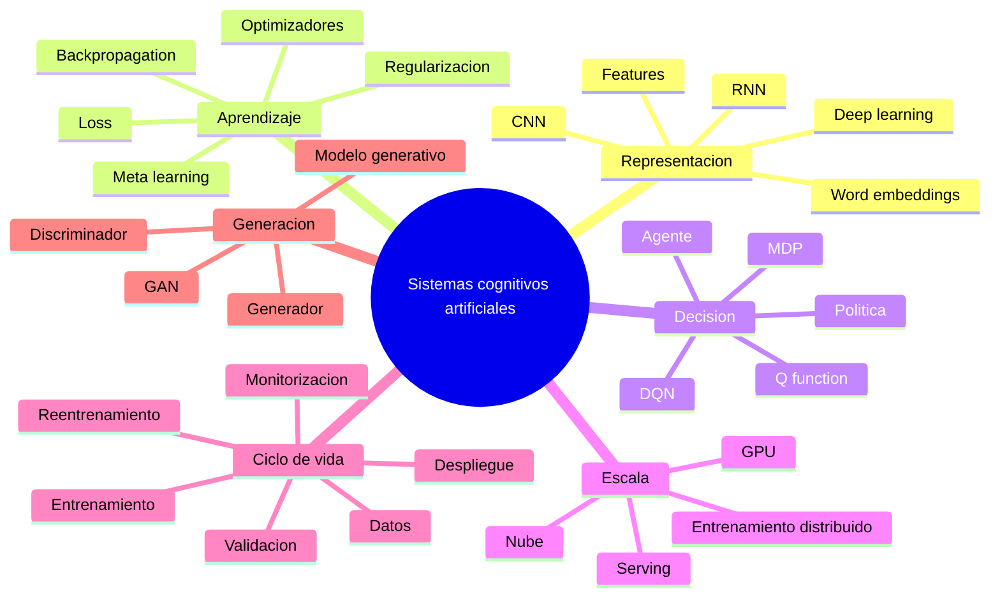

El mapa resume un recorrido común: los datos se convierten en representaciones; una función de pérdida guía el aprendizaje; las arquitecturas se especializan según el tipo de dato o decisión; el hardware permite escalar el cálculo; y el sistema productivo cierra el ciclo mediante validación, monitorización y actualización.

---

## 13. Referencias

Apache Software Foundation. (2024). _Apache MXNet_. The Apache Attic. https://attic.apache.org/projects/mxnet.html

Andrychowicz, M., Denil, M., Gómez, S., Hoffman, M. W., Pfau, D., Schaul, T., Shillingford, B., & de Freitas, N. (2016). Learning to learn by gradient descent by gradient descent. En _Advances in Neural Information Processing Systems 29_. https://proceedings.neurips.cc/paper_files/paper/2016/hash/fb87582825f9d28a8d42c5e5e5e8b23d-Abstract.html

Berkeley Vision and Learning Center. (s. f.). _Caffe: A fast open framework for deep learning_ [Repositorio de código]. GitHub. Recuperado el 30 de agosto de 2026, de https://github.com/BVLC/caffe

Dean, J., Corrado, G., Monga, R., Chen, K., Devin, M., Mao, M., Ranzato, M. A., Senior, A., Tucker, P., Yang, K., Le, Q. V., & Ng, A. Y. (2012). Large scale distributed deep networks. En _Advances in Neural Information Processing Systems 25_. https://proceedings.neurips.cc/paper/2012/hash/6aca97005c68f1206823815f66102863-Abstract.html

Finn, C., Abbeel, P., & Levine, S. (2017). Model-agnostic meta-learning for fast adaptation of deep networks. En _Proceedings of the 34th International Conference on Machine Learning_ (Vol. 70, pp. 1126-1135). PMLR. https://proceedings.mlr.press/v70/finn17a.html

Goodfellow, I., Bengio, Y., & Courville, A. (2016). _Deep learning_. MIT Press. https://www.deeplearningbook.org/

Goodfellow, I. J., Pouget-Abadie, J., Mirza, M., Xu, B., Warde-Farley, D., Ozair, S., Courville, A., & Bengio, Y. (2014). Generative adversarial nets. En _Advances in Neural Information Processing Systems 27_ (pp. 2672-2680). https://proceedings.neurips.cc/paper_files/paper/2014/hash/f033ed80deb0234979a61f95710dbe25-Abstract.html

Hochreiter, S., & Schmidhuber, J. (1997). Long short-term memory. _Neural Computation, 9_(8), 1735-1780. https://doi.org/10.1162/neco.1997.9.8.1735

Ioffe, S., & Szegedy, C. (2015). Batch normalization: Accelerating deep network training by reducing internal covariate shift. En _Proceedings of the 32nd International Conference on Machine Learning_ (Vol. 37, pp. 448-456). PMLR. https://proceedings.mlr.press/v37/ioffe15.html

Keras Team. (s. f.). _Keras 3_. Recuperado el 30 de agosto de 2026, de https://keras.io/keras_3/

KServe Authors. (s. f.). _KServe documentation_. Recuperado el 30 de agosto de 2026, de https://kserve.github.io/website/docs/intro

Krizhevsky, A., Sutskever, I., & Hinton, G. E. (2012). ImageNet classification with deep convolutional neural networks. En _Advances in Neural Information Processing Systems 25_. https://proceedings.neurips.cc/paper/2012/hash/c399862d3b9d6b76c8436e924a68c45b-Abstract.html

LeCun, Y., Bengio, Y., & Hinton, G. (2015). Deep learning. _Nature, 521_, 436-444. https://doi.org/10.1038/nature14539

Mikolov, T., Sutskever, I., Chen, K., Corrado, G. S., & Dean, J. (2013). Distributed representations of words and phrases and their compositionality. En _Advances in Neural Information Processing Systems 26_. https://proceedings.neurips.cc/paper_files/paper/2013/hash/9aa42b31882ec039965f3c4923ce901b-Abstract.html

Microsoft. (s. f.). _Microsoft Cognitive Toolkit (CNTK)_ [Repositorio de código archivado]. GitHub. Recuperado el 30 de agosto de 2026, de https://github.com/microsoft/CNTK

Mnih, V., Kavukcuoglu, K., Silver, D., Rusu, A. A., Veness, J., Bellemare, M. G., Graves, A., Riedmiller, M., Fidjeland, A. K., Ostrovski, G., Petersen, S., Beattie, C., Sadik, A., Antonoglou, I., King, H., Kumaran, D., Wierstra, D., Legg, S., & Hassabis, D. (2015). Human-level control through deep reinforcement learning. _Nature, 518_, 529-533. https://doi.org/10.1038/nature14236

NVIDIA. (2026). _NVIDIA Triton Inference Server documentation_. https://docs.nvidia.com/triton-inference-server/index.html

PyTensor Development Team. (s. f.). _Getting started_. Recuperado el 30 de agosto de 2026, de https://pytensor.readthedocs.io/en/latest/introduction.html

PyTorch Contributors. (s. f.). _Contributing to PyTorch_ [Documentación del repositorio]. GitHub. Recuperado el 30 de agosto de 2026, de https://github.com/pytorch/pytorch/blob/main/CONTRIBUTING.md

RISELab. (s. f.). _Clipper: A low-latency prediction-serving system_ [Repositorio de código]. GitHub. Recuperado el 30 de agosto de 2026, de https://github.com/ucbrise/clipper

Rumelhart, D. E., Hinton, G. E., & Williams, R. J. (1986). Learning representations by back-propagating errors. _Nature, 323_, 533-536. https://doi.org/10.1038/323533a0

Sculley, D., Holt, G., Golovin, D., Davydov, E., Phillips, T., Ebner, D., Chaudhary, V., Young, M., Crespo, J.-F., & Dennison, D. (2015). Hidden technical debt in machine learning systems. En _Advances in Neural Information Processing Systems 28_. https://proceedings.neurips.cc/paper/2015/hash/86df7dcfd896fcaf2674f757a2463eba-Abstract.html

TensorFlow. (s. f.). _TensorFlow 1.x vs. TensorFlow 2: Behaviors and APIs_. Recuperado el 30 de agosto de 2026, de https://www.tensorflow.org/guide/migrate/tf1_vs_tf2

Torch7 Contributors. (s. f.). _Torch7_ [Repositorio de código sin desarrollo activo]. GitHub. Recuperado el 30 de agosto de 2026, de https://github.com/torch/torch7

Universidad Internacional de La Rioja. (s. f.). _Sistemas cognitivos artificiales_ [Material didáctico de maestría]. UNIR.
