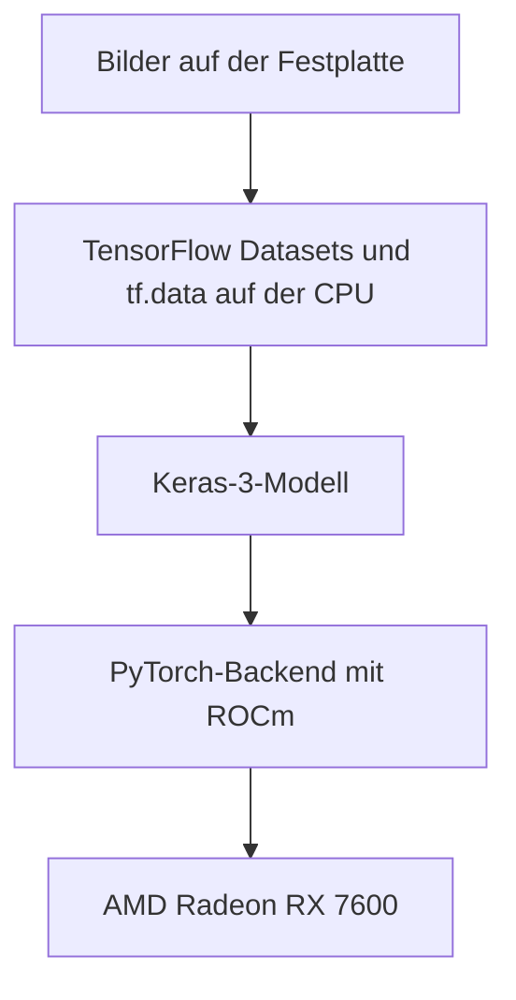

import Aside from "@rgglez/astro-aside";
import { Image } from "astro:assets";

import image01 from "@/assets/posts/2026/09/usar-keras-radeon-RX-7600/93747fc0-692d-4ea5-83c8-825f3d80dcdc.png";

{/* Cabecera generada con la herramienta integrada imagegen. Prompt final: Genera una imagen apta tanto para og:image como para hero header de un blog post. Fondo blanco. Trazos negros. Escala de grises. Caricaturezco y minimalista. Una computadora desktop por cuya ventana lateral se ve una tarjeta gráfica Radeon RX 7600 recibe pequeñas imágenes de perros y gatos a través de una cinta transportadora y alimenta una red neuronal. Junto en la mesa se ve un cuaderno de código abierto como alegoría a un notebook de Jupyter. Composición horizontal panorámica aproximadamente 1.91:1, adecuada para compartir en redes y como cabecera. Ilustración editorial a tinta de líneas negras claras y escasas sombras grises sobre blanco puro. La computadora es una torre de escritorio en vista de tres cuartos, con panel lateral transparente y una tarjeta gráfica claramente visible dentro, etiquetada exactamente «Radeon RX 7600». La cinta transportadora lleva pequeñas tarjetas con dibujos sencillos de perros y gatos hasta la torre. Desde la torre sale una conexión hacia una red neuronal representada por tres columnas de nodos conectados. Sobre la misma mesa, al lado de la torre, hay un cuaderno físico abierto con unas pocas líneas de código manuscritas en sus páginas, una alegoría visual de Jupyter. Mantén los elementos principales centrados y totalmente dentro del encuadre, con márgenes blancos generosos. Sin colores, sin título superpuesto, sin marca de agua, sin objetos adicionales. */}

## Einführung

Vor Kurzem musste ich für mein Masterstudium eine Aufgabe bearbeiten, bei der
mehrere Modelle zur Bildklassifikation mit Keras und TensorFlow trainiert
wurden. Mein aktueller Rechner hat eine AMD Radeon RX 7600 (mit nur 8 GB VRAM)
und läuft unter Debian Sid. TensorFlow bietet für diese Karte jedoch leider
keine offizielle ROCm-Unterstützung. Glücklicherweise ist Keras seit Version 3
_backendunabhängig_. Du kannst also die Trainings-Engine auf PyTorch umstellen,
das ROCm unterstützt und die GPU nutzen kann. So lassen sich Keras-Modelle auf
der Radeon RX 7600 trainieren, während TensorFlow die Daten weiterhin auf der
CPU vorbereitet.

<Image
  src={image01}
  alt="Radeon RX 7600"
  loading="lazy"
  class="float-right mb-4 ml-6 h-auto w-2/5 max-w-50"
/>

Wenn dein Notebook Keras verwendet und TensorFlow nur die CPU erkennt, kannst du
also die Schichten des Modells beibehalten und die Trainings-Engine wechseln. In
dieser Anleitung konfigurierst du **Keras 3 mit dem PyTorch-Backend und ROCm**,
um eine AMD Radeon RX 7600 unter Linux zu nutzen. TensorFlow bereitet die Daten
weiterhin auf der CPU vor.

<Aside type="note" title="Andere AMD-Karten">

Ich gehe davon aus, dass diese Anleitung auch für andere AMD-Karten der
Mittelklasse mit ROCm-Unterstützung funktioniert, kann das aber natürlich nicht
garantieren. Schreibe in die Kommentare, ob deine Karte mit diesem Verfahren
funktioniert und welche Trainingszeiten du erreichst.

</Aside>

Der Referenzfall ist ein Klassifikator für 37 Hunde- und Katzenrassen mit
MobileNetV2. Lokale Messungen ergaben etwa 5 Sekunden pro Epoche auf der GPU
gegenüber 28,6 Sekunden auf der CPU. Das Ergebnis gilt für diesen Rechner und
diese Arbeitslast: Prüfe zuerst die grundlegenden Operationen und miss danach
dein eigenes Training.

---

## Inhaltsverzeichnis

---

## Was der Wechsel des Backends löst

Keras definiert das Modell und überträgt seine Ausführung an ein Backend. Wenn
du `torch` auswählst, verwenden die portablen Keras-Schichten PyTorch. Dessen
ROCm-Build führt GPU-Operationen über die Bibliotheken von AMD aus.



Das TensorFlow-Paket in der Referenzumgebung suchte nach CUDA und konnte nicht
auf der Radeon trainieren. Das Ändern einer Variablen macht aus diesem
TensorFlow-Build keinen ROCm-Build. AMD stellt Varianten für TensorFlow bereit,
ihre Kompatibilität hängt jedoch von der GPU, dem System sowie den Python- und
ROCm-Versionen ab.

Auf diesem Rechner wurde der Wechsel des Keras-Backends erfolgreich geprüft. Das
funktioniert bei Modellen, die mit portablen Operationen aufgebaut sind;
Schichten oder Trainingsschleifen, die direkt mit `tf.*` geschrieben wurden,
müssen überprüft werden.

<Aside type="warning" title="Beobachtete Funktion und offizielle Unterstützung">

Die RX 7600 ist nicht in der Radeon-Kompatibilitätsmatrix für Linux unter ROCm
7.2.1 aufgeführt, die für diese Anleitung herangezogen wurde. Dass PyTorch
`gfx1102` erkennt und ein Training abschließt, macht diese Konfiguration nicht
zu einer von AMD offiziell unterstützten Kombination. Prüfe die

<a
  href="https://rocm.docs.amd.com/projects/radeon-ryzen/en/latest/docs/compatibility/compatibilityrad/native_linux/native_linux_compatibility.html"
  target="_blank"
>
  Kompatibilitätsmatrix
</a>
der Version, die du verwenden möchtest.

</Aside>

## Voraussetzungen und Referenzumgebung

Du brauchst Linux mit dem Treiber `amdgpu`, Zugriff auf die Rechengeräte und
eine funktionsfähige ROCm-Installation. Diese Anleitung setzt diese Installation
voraus: Sie ersetzt nicht die Anweisungen von AMD zur Treiberinstallation für
deine Distribution. Führe die Befehle im Stammverzeichnis deines
Trainingsprojekts aus.

<Aside type="note" title="Tests vom 15. September 2026">

Die Testumgebung verwendete Python `3.13.15`, Keras `3.15.1`, PyTorch
`2.9.1+rocm6.4`, TensorFlow `2.21.0`, TensorFlow Datasets `4.9.10` und NumPy
`2.5.2`. Die Messungen beziehen sich auf den unten beschriebenen Rechner und
dienen als Leistungsreferenz. Die offizielle Dokumentation wurde am 18.
September 2026 konsultiert.

</Aside>

| Komponente                 | Erfasster Wert                                |
| :------------------------- | :-------------------------------------------- |
| GPU                        | AMD Radeon RX 7600, `gfx1102`, 8.176 MiB VRAM |
| CPU                        | AMD Ryzen 9 5900XT, 16 Kerne                  |
| Kernel                     | Linux `7.1.13+deb14-amd64`                    |
| Treiber                    | `amdgpu`                                      |
| ROCm des Systems           | `rocm-core` `7.1.1`                           |
| HIP des Systems            | `hip-runtime-amd` `7.1.52802`                 |
| MIOpen des Systems         | `3.5.1`                                       |
| Von PyTorch gemeldetes HIP | `6.4.43484-123eb5128`                         |
| Triton von PyTorch         | `pytorch-triton-rocm` `3.5.1`                 |

Das Suffix `rocm6.4` kennzeichnet den PyTorch-Build; es ist nicht die Version
des auf dem System installierten Pakets `rocm-core`. Beide Versionen waren auf
dem Referenzrechner gleichzeitig vorhanden. Übertrage dieses Ergebnis nicht auf
beliebige Kombinationen aus Bibliotheken und Treibern: Prüfe die

<a
  href="https://rocm.docs.amd.com/en/docs-7.1.0/compatibility/compatibility-matrix.html"
  target="_blank"
>
  Kompatibilität zwischen Treiber und Userspace
</a>
.

## Schritt 1: ROCm und GPU-Berechtigungen prüfen

Prüfe, ob ROCm die Karte erkennt:

```bash
rocminfo | grep -E "Marketing Name|gfx"
rocm-smi --showmeminfo vram
```

Zu den `rocminfo`-Einträgen des Referenzrechners gehören:

```text
  Marketing Name:          AMD Radeon RX 7600
  Name:                    gfx1102
```

Wenn `rocminfo` die GPU nicht erkennt, behebe zuerst das Problem mit der
ROCm-Installation. Schlägt es wegen fehlender Berechtigungen fehl, prüfe die
Geräte und die Gruppen deiner Sitzung:

```bash
ls -l /dev/kfd /dev/dri/renderD*
id
```

Auf Systemen, die den Zugriff über die Gruppen `render` und `video` gewähren,
füge deinen Benutzer hinzu und melde dich erneut an:

```bash
sudo usermod -aG render,video "$USER"
```

Eine grafische Sitzung kann über ACLs Berechtigungen erhalten, auch wenn der
Benutzer diesen Gruppen nicht angehört. Deshalb kann ein lokaler Test
funktionieren, während derselbe Test über SSH fehlschlägt. AMD dokumentiert
beide Mechanismen in den

<a
  href="https://rocm.docs.amd.com/projects/install-on-linux/en/latest/install/prerequisites.html"
  target="_blank"
>
  Installationsvoraussetzungen
</a>
.

## Schritt 2: PyTorch mit ROCm in der virtuellen Umgebung installieren

Wenn du bereits eine `.venv`-Umgebung mit Keras 3 und TensorFlow hast, verwende
sie. Um eine neue anzulegen, prüfe zuerst, ob `python3.13` dem Interpreter
entspricht, den du verwenden möchtest:

```bash
python3.13 --version
python3.13 -m venv .venv
```

Installiere PyTorch `2.9.1` aus dem ROCm-Index:

```bash
.venv/bin/python -m pip install "torch==2.9.1" \
  --index-url https://download.pytorch.org/whl/rocm6.4
```

Der Index wählt die ROCm-Pakete aus. Der Befehl steht in den

<a href="https://pytorch.org/get-started/previous-versions/" target="_blank">
  Anweisungen für PyTorch 2.9.1
</a>
; für diese Beispiele reicht `torch`, ohne `torchvision` oder `torchaudio`.
Plane mehrere Gigabyte Speicherplatz für den Download und die Installation ein.

Installiere in einer neuen Umgebung auch die Pakete, die in den Beispielen
verwendet werden:

```bash
.venv/bin/python -m pip install \
  "keras==3.15.1" "tensorflow==2.21.0" \
  "tensorflow-datasets==4.9.10" "numpy==2.5.2"
.venv/bin/python -m pip check
```

Diese Befehle legen die Versionen der wichtigsten Abhängigkeiten der getesteten
Umgebung fest. Wenn `pip` kein Paket für deinen Interpreter oder deine Plattform
findet, prüfe die verfügbaren Wheels, bevor du Versionen austauschst.

Prüfe den Build und den GPU-Zugriff:

```bash
.venv/bin/python -c "import torch; print(torch.__version__, torch.cuda.is_available())"
```

Erfasste Ausgabe:

```text
2.9.1+rocm6.4 True
```

Obwohl die GPU von AMD stammt, verwendet PyTorch den Namensraum `torch.cuda` und
das Gerät `cuda:0`. Das ist das dokumentierte Verhalten seiner

<a href="https://docs.pytorch.org/docs/main/notes/hip.html" target="_blank">
  HIP-Implementierung
</a>
. Prüfe auch `torch.version.hip`: Bei einem ROCm-Build muss dort ein Wert
stehen.

## Schritt 3: Matrizen und Faltungen vor dem Notebook testen

Dass die Karte erkannt wird, beweist nicht, dass die Operationen des Modells
funktionieren. Speichere den folgenden Code als `probar_rocm.py`. Er prüft
zuerst eine Matrixmultiplikation und trainiert anschließend eine Faltung mit
Keras. Synthetische Daten verhindern, dass ein Download oder der Datensatz einen
GPU-Fehler verdeckt.

```python
import os

os.environ["KERAS_BACKEND"] = "torch"

import numpy as np
import torch
import keras

assert torch.version.hip is not None, "PyTorch no utiliza ROCm"
assert torch.cuda.is_available(), "La GPU no está disponible"
assert keras.backend.backend() == "torch", "Backend incorrecto"
print("PyTorch:", torch.__version__, "HIP:", torch.version.hip)
print("GPU:", torch.cuda.get_device_name(0))

a = torch.randn(1024, 1024, device="cuda:0")
b = torch.randn(1024, 1024, device="cuda:0")
c = a @ b
torch.cuda.synchronize()
assert torch.isfinite(c).all().item(), "Resultado no finito"
print("OK: multiplicación de matrices")
del a, b, c

keras.utils.set_random_seed(42)
model = keras.Sequential([
    keras.layers.Input(shape=(32, 32, 3)),
    keras.layers.Conv2D(8, 3, activation="relu"),
    keras.layers.GlobalAveragePooling2D(),
    keras.layers.Dense(2, activation="softmax"),
])
model.compile(optimizer="adam", loss="sparse_categorical_crossentropy")
x = np.random.rand(32, 32, 32, 3).astype("float32")
y = np.random.randint(0, 2, size=32)
history = model.fit(x, y, batch_size=8, epochs=1, verbose=2)
torch.cuda.synchronize()
assert np.isfinite(history.history["loss"]).all(), "Pérdida no finita"
assert all(p.device.type == "cuda" for p in model.parameters())
print("OK: entrenamiento de convolución en GPU")
print("VRAM pico, MiB:", round(torch.cuda.max_memory_allocated() / 2**20))
```

Führe den Test aus:

```bash
.venv/bin/python probar_rocm.py
```

Beide Prüfungen müssen abgeschlossen werden. Die zweite testet auch die
Rückpropagation durch die Faltung und prüft, ob sich die Modellparameter auf der
GPU befinden. Verwende diesen Test, um die Installation zu überprüfen, bevor du
die Leistung mit einem echten Datensatz misst.

## Schritt 4: Keras am Anfang des Notebooks konfigurieren

Wähle in Jupyter den Interpreter `.venv/bin/python`. Starte den Kernel neu und
führe diese Zelle aus, bevor du Keras oder Module importierst, die Keras
importieren:

```python
import os

os.environ["KERAS_BACKEND"] = "torch"

import tensorflow as tf

tf.config.set_visible_devices([], "GPU")

import keras
import torch

keras.utils.set_random_seed(42)
assert keras.backend.backend() == "torch", "Reinicia el kernel"
assert torch.cuda.is_available(), "La GPU no está disponible"
print("Backend:", keras.backend.backend())
print("GPU:", torch.cuda.get_device_name(0))
```

`tf.config.set_visible_devices([], "GPU")` verhindert, dass TensorFlow die GPU
verwendet, und belässt die Verarbeitung von `tf.data` auf der CPU. Es
deaktiviert die GPU nicht für PyTorch und garantiert nicht, dass beim Import von
TensorFlow alle CUDA-Meldungen verschwinden.

Verwende `import keras` und Imports aus `keras.layers`, `keras.models` und
`keras.callbacks`. Der direkte Import macht die Verwendung von Keras 3 explizit
und vermeidet eine Vermischung mit dem älteren Paket `tf_keras`. In modernem
TensorFlow kann auch `tf.keras` auf Keras 3 verweisen. Siehe die

<a href="https://keras.io/getting_started/" target="_blank">
  offizielle Keras-Konfiguration
</a>
.

So startest du Jupyter mit bereits festgelegtem Backend, sofern es in dieser
Umgebung installiert ist:

```bash
KERAS_BACKEND=torch .venv/bin/jupyter lab
```

Die Variable in eine `.env`-Datei zu schreiben, lädt sie nicht automatisch in
Python. Wenn du Imports in einer anderen Reihenfolge ausgeführt hast, starte den
Kernel neu.

## Schritt 5: MobileNetV2 mit TensorFlow Datasets trainieren

Um einen vollständigen Trainingslauf zu prüfen, verwende MobileNetV2 mit dem
öffentlichen Datensatz Oxford-IIIT Pet, der Bilder von 37 Hunde- und
Katzenrassen enthält. Das Beispiel zeigt, wie du einem Keras-Modell von
TensorFlow vorbereitete Daten zuführst und seine Ausführung auf CPU und GPU
vergleichst.

Speichere den Code als `entrenar_keras.py` im Stammverzeichnis des Projekts. Er
benötigt eine **von TFDS vorbereitete** Kopie in `datasets/`. Lade sie einmal
herunter und bereite sie vor:

```bash
.venv/bin/python -c "import tensorflow_datasets as tfds; tfds.builder('oxford_iiit_pet:4.0.0', data_dir='datasets').download_and_prepare()"
```

Danach wird `download=False` verwendet, um eine fehlende Kopie zu erkennen, ohne
einen weiteren Download zu starten. Die ImageNet-Gewichte von MobileNetV2 werden
heruntergeladen, wenn Keras sie zum ersten Mal benötigt.

```python
import os
import sys
import time
from pathlib import Path

os.environ["KERAS_BACKEND"] = "torch"
usar_cpu = "cpu" in sys.argv[1:]
if usar_cpu:
    os.environ["HIP_VISIBLE_DEVICES"] = "-1"
    os.environ["CUDA_VISIBLE_DEVICES"] = "-1"

import tensorflow as tf

tf.config.set_visible_devices([], "GPU")

import tensorflow_datasets as tfds
import torch
import keras

assert keras.backend.backend() == "torch"
if usar_cpu:
    assert not torch.cuda.is_available(), "La GPU sigue visible"
else:
    assert torch.version.hip is not None, "PyTorch no utiliza ROCm"
    assert torch.cuda.is_available(), "La GPU no está disponible"

keras.utils.set_random_seed(42)
data_dir = str(Path(__file__).resolve().parent / "datasets")
(train_raw, val_raw, test_raw), info = tfds.load(
    "oxford_iiit_pet:4.0.0",
    split=["train[:80%]", "train[80%:90%]", "train[90%:]"],
    with_info=True,
    as_supervised=True,
    data_dir=data_dir,
    download=False,
)

def preparar(imagen, etiqueta):
    imagen = tf.image.resize(imagen, (160, 160))
    return imagen / 127.5 - 1.0, etiqueta

auto = tf.data.AUTOTUNE
train = train_raw.map(preparar, num_parallel_calls=auto)
train = train.batch(32).prefetch(auto)
val = val_raw.map(preparar, num_parallel_calls=auto)
val = val.batch(32).prefetch(auto)

base = keras.applications.MobileNetV2(
    input_shape=(160, 160, 3), include_top=False, weights="imagenet"
)
base.trainable = False
model = keras.Sequential([
    base,
    keras.layers.GlobalAveragePooling2D(),
    keras.layers.Dropout(0.2),
    keras.layers.Dense(info.features["label"].num_classes),
])
model.compile(
    optimizer="adam",
    loss=keras.losses.SparseCategoricalCrossentropy(from_logits=True),
    metrics=["accuracy"],
)

if not usar_cpu:
    torch.cuda.reset_peak_memory_stats()
    torch.cuda.synchronize()
inicio = time.perf_counter()
history = model.fit(train, validation_data=val, epochs=3, verbose=2)
if not usar_cpu:
    torch.cuda.synchronize()
segundos = time.perf_counter() - inicio
dispositivo = "cpu" if usar_cpu else "cuda"
assert all(p.device.type == dispositivo for p in model.parameters())
print("Dispositivo:", dispositivo)
print(f"Total: {segundos:.1f} s; media: {segundos / 3:.1f} s/época")
print("Exactitud de validación:", history.history["val_accuracy"][-1])
if not usar_cpu:
    print("VRAM pico, MiB:", round(torch.cuda.max_memory_allocated() / 2**20))
```

Vergleiche beide Geräte in getrennten Prozessen:

```bash
.venv/bin/python entrenar_keras.py
.venv/bin/python entrenar_keras.py cpu
```

**Beide Befehle verwenden das PyTorch-Backend.** Der Vergleich isoliert den
Gerätewechsel; er vergleicht nicht TensorFlow auf der CPU mit PyTorch auf der
GPU. Die Zeitmessung umfasst Training und Validierung, schließt aber das
anfängliche Laden des Datensatzes und der Gewichte aus.

Der `train`-Split des Datensatzes enthält 3.680 Bilder: Das Beispiel verwendet
2.944 für das Training, 368 für die Validierung und reserviert die letzten 368.
Der offizielle `test`-Split mit 3.669 Bildern wird in diesem Benchmark nicht
verwendet. Diese Größen sind im

<a
  href="https://www.tensorflow.org/datasets/catalog/oxford_iiit_pet"
  target="_blank"
>
  TFDS-Katalog
</a>
beschrieben.

Die `split`-Ausdrücke wählen jeweils 80 %, die nächsten 10 % und die letzten 10
% von `train` aus. Du kannst diese Anteile mit der

<a href="https://www.tensorflow.org/datasets/splits" target="_blank">
  Split-Syntax von TFDS
</a>
anpassen. Reserviere die Testdaten für die abschließende Auswertung, nachdem du
das Modell anhand der Validierung ausgewählt hast.

## Leistung und Speicherverbrauch einordnen

Die folgenden Messungen wurden auf dem eingangs beschriebenen Rechner erfasst.
MobileNetV2 wurde mit eingefrorener Basis, `GlobalAveragePooling2D`,
`Dropout(0.2)` und `Dense(37)`, Bildern von 160 × 160, Batches von 32 und Adam
trainiert. Sowohl auf der CPU als auch auf der GPU wurde das PyTorch-Backend
verwendet. Die Zahlen dienen zur Abschätzung des Gewinns bei dieser Arbeitslast;
führe `entrenar_keras.py` in beiden Modi aus, um die Zeiten auf deinem Rechner
zu messen.

| Erfasste Metrik                           | RX 7600            | Ryzen 9 5900XT   |
| :---------------------------------------- | :----------------- | :--------------- |
| Erste Epoche mit leerem MIOpen-Cache      | 11 s               | 30 s             |
| Nachfolgende Epochen                      | Ungefähr 5 s       | 28,6 s           |
| Zeit pro Batch                            | 53–57 ms           | 307 ms           |
| Validierungsgenauigkeit nach drei Epochen | 0,875–0,905        | 0,878            |
| Spitzenwert des PyTorch-VRAM-Verbrauchs   | Ungefähr 1.485 MiB | Nicht zutreffend |

Das Verhältnis zwischen 28,6 und 5 Sekunden beträgt ungefähr **5,7 zu 1**. Für
30 Epochen lassen sich damit etwa 14,3 Minuten auf der CPU und 2,5 Minuten auf
der GPU abschätzen, ohne den anfänglichen Zusatzaufwand. Das ist eine
Hochrechnung, keine Messung eines Trainings mit 30 Epochen.

In den Tests war der erste Lauf langsamer; die folgenden profitierten vom
MIOpen-Cache. Erfasse den Start und die nachfolgenden Epochen getrennt, damit du
keinen kalten mit einem warmen Lauf vergleichst.

Auch der Desktop und andere Anwendungen verbrauchen VRAM. Der von
`torch.cuda.max_memory_allocated()` angezeigte Spitzenwert misst
Tensorallokationen von PyTorch, nicht den gesamten Speicherverbrauch der Karte.
Beobachte auch den Gesamtzustand:

```bash
watch -n1 rocm-smi
```

Wenn zwischen Batches Pausen auftreten und die GPU wenig ausgelastet ist,
untersuche die Datenpipeline. Du kannst `.cache()` nach der Größenanpassung und
Normalisierung ausprobieren, vor `.batch()` und einem eventuellen `.shuffle()`.
Die 2.944 Bilder mit 160 × 160 × 3 in `float32` belegen etwa 0,84 GiB RAM
zuzüglich Zusatzaufwand. Dieser Benchmark behält die Reihenfolge der Daten bei;
für reguläres Training solltest du prüfen, ob du dem Trainingsdatensatz
`.shuffle(2944, seed=42)` hinzufügst.

Das Auftauen der Basis, eine höhere Auflösung oder eine andere Batchgröße
verändern den Verbrauch und die Arbeitslast der GPU. Miss jede Konfiguration
separat, einschließlich Fine-Tuning und gemischter Genauigkeit.

## Portabilität, Speichern und Reproduzierbarkeit

Prüfe beim Backendwechsel, ob dein Modell Training, Auswertung, Vorhersagen und
die verwendeten Callbacks vollständig ausführt. Keras akzeptiert
`tf.data.Dataset` als Eingabe für seine Trainingsmethoden; du kannst diese
Pipeline beim Backendwechsel beibehalten, wie im

<a
  href="https://keras.io/guides/training_with_built_in_methods/"
  target="_blank"
>
  Leitfaden zu Training und Auswertung
</a>
dokumentiert.

Prüfe `tf.*`-Aufrufe in benutzerdefinierten Schichten, Verlustfunktionen und
Trainingsschleifen. Verwende für portable Operationen innerhalb des Modells
`keras.ops` entsprechend dem

<a href="https://keras.io/guides/migrating_to_keras_3/" target="_blank">
  Migrationsleitfaden für Keras 3
</a>
. Die `tf.image`-Operationen der obigen Pipeline können auf der CPU bleiben.

So speicherst du das Beispielmodell und lädst es wieder:

```python
model.save("modelo.keras")
recuperado = keras.models.load_model("modelo.keras")
```

Mit dem Format `.keras` kannst du das Modell speichern, um weiter daran zu
arbeiten. Der Export für die Inferenz mit `model.export()` ist ein anderer
Vorgang: Seine Formate und Abhängigkeiten variieren je nach Backend und Version.
Die

<a href="https://keras.io/api/models/model_saving_apis/export/" target="_blank">
  Exportdokumentation
</a>
beschreibt die verfügbaren Optionen für das Torch-Backend.

`keras.utils.set_random_seed(42)` hilft beim Wiederholen von Experimenten,
garantiert aber keine identischen Ergebnisse zwischen CPU und GPU, Versionen
oder Algorithmen. PyTorch erläutert diese Grenzen im

<a
  href="https://docs.pytorch.org/docs/main/notes/randomness.html"
  target="_blank"
>
  Leitfaden zur Reproduzierbarkeit
</a>
.

In Jupyter beeinflusst die Reihenfolge der Zellen, wie der
Zufallszahlengenerator verbraucht wird. Um Modelle unter kontrollierten
Anfangsbedingungen zu vergleichen, setze den Seed vor dem Aufbau jedes Modells
und führe das gesamte Notebook der Reihe nach aus. Ein Genauigkeitsunterschied
zwischen zwei Läufen beweist nicht, dass ein Gerät besser lernt.

## Eine Konfiguration für Colab beibehalten

Wenn du das Notebook mit jemandem teilst, der Colab verwendet, kannst du das
Backend in der ersten Zelle auswählen. Diese Alternative ersetzt die lokale
Konfiguration aus Schritt 4; führe sie in einem neuen Kernel aus:

```python
import os
import sys

en_colab = "google.colab" in sys.modules
os.environ["KERAS_BACKEND"] = "tensorflow" if en_colab else "torch"

import tensorflow as tf

if not en_colab:
    tf.config.set_visible_devices([], "GPU")

import keras

keras.utils.set_random_seed(42)
print("Backend:", keras.backend.backend())
```

Die Auswahl des Backends stellt dir keine GPU bereit: In Colab musst du eine
Umgebung mit Beschleuniger auswählen und dessen Verfügbarkeit prüfen. Auch der
Pfad `datasets/` wird nicht automatisch übertragen; bereite den Datensatz in
dieser Umgebung vor.

Lokales Training bewahrt Daten und Modelle zwischen den Sitzungen auf. Eine
entfernte Umgebung kann nützlich sein, wenn du mehr Speicher brauchst oder das
Notebook teilen möchtest, ohne ROCm zu installieren. Entscheide anhand der
Anforderungen deines Modells und der tatsächlich verfügbaren Ressourcen.

## Fehlerbehebung

| Problem                                                 | Prüfung und Lösung                                                                                                                                                       |
| :------------------------------------------------------ | :----------------------------------------------------------------------------------------------------------------------------------------------------------------------- |
| `torch.cuda.is_available()` gibt `False` zurück         | Prüfe `rocminfo`, die Berechtigungen für `/dev/kfd` und `/dev/dri/renderD*` sowie Variablen, die Geräte ausblenden. Melde dich nach Gruppenänderungen erneut an.         |
| `torch.version.hip` gibt `None` zurück                  | Der Prozess verwendet nicht den ROCm-Build. Prüfe den Jupyter-Interpreter und installiere `torch` erneut aus dem Index in Schritt 2.                                     |
| Keras zeigt `tensorflow` an                             | Starte den Kernel neu und setze `KERAS_BACKEND` vor jedem Import, der Keras laden könnte.                                                                                |
| Eine Faltung schlägt fehl, obwohl die GPU erkannt wird  | Reproduziere den Fehler mit `probar_rocm.py` und prüfe GPU, Wheel und Treiber. Die Erkennung garantiert keine MIOpen-Kompatibilität.                                     |
| `Memory access fault` oder `HSA_STATUS_ERROR` erscheint | Bewahre die vollständige Meldung sowie die Versionen von PyTorch, ROCm und dem Treiber für die Diagnose auf. Prüfe die Kompatibilität dieser Kombination mit deiner GPU. |
| Die erste Epoche dauert länger                          | Vergleiche mit nachfolgenden Läufen: Initialisierung und MIOpen-Cache können beim Start zusätzliche Arbeit verursachen.                                                  |
| `HIP out of memory` erscheint                           | Reduziere die Batchgröße von 32 auf 16, prüfe die Auflösung und gib Speicher frei, den andere Prozesse belegen.                                                          |
| TensorFlow zeigt einen `cuInit`-Fehler an               | Prüfe das Backend und den PyTorch-Test. Diese TensorFlow-Meldung beweist nicht, dass ROCm fehlgeschlagen ist.                                                            |
| TFDS findet den Datensatz nicht                         | Prüfe, ob `data_dir` auf das Verzeichnis zeigt, in dem TFDS den Datensatz vorbereitet hat, und ob die angeforderte Version verfügbar ist.                                |
| Der Desktop läuft nicht mehr flüssig                    | Reduziere die Last und schließe Anwendungen, die dieselbe GPU verwenden; Anzeige und Training teilen sich die Ressourcen.                                                |

## Verifizierte Quellen

Dokumentation konsultiert am 18. September 2026. Die Leistungswerte stammen aus
den im Artikel beschriebenen lokalen Tests.

- <a href="https://keras.io/getting_started/" target="_blank">
    Keras: Installation und Backend-Konfiguration
  </a>
  .
- <a href="https://keras.io/guides/migrating_to_keras_3/" target="_blank">
    Keras: Migration zu Keras 3 und portable Operationen
  </a>
  .
- <a
    href="https://keras.io/guides/training_with_built_in_methods/"
    target="_blank"
  >
    Keras: Training und Auswertung mit integrierten Methoden
  </a>
  .
- <a
    href="https://keras.io/api/models/model_saving_apis/model_saving_and_loading/"
    target="_blank"
  >
    Keras: Speichern und Laden vollständiger Modelle
  </a>
  .
- <a
    href="https://keras.io/api/models/model_saving_apis/export/"
    target="_blank"
  >
    Keras: Export für die Inferenz
  </a>
  .
- <a href="https://pytorch.org/get-started/previous-versions/" target="_blank">
    PyTorch: Installation früherer Versionen, einschließlich 2.9.1 mit ROCm 6.4
  </a>
  .
- <a href="https://docs.pytorch.org/docs/main/notes/hip.html" target="_blank">
    PyTorch: HIP-Semantik und Wiederverwendung der CUDA-API
  </a>
  .
- <a
    href="https://docs.pytorch.org/docs/main/notes/randomness.html"
    target="_blank"
  >
    PyTorch: Reproduzierbarkeit
  </a>
  .
- <a
    href="https://rocm.docs.amd.com/projects/radeon-ryzen/en/latest/docs/compatibility/compatibilityrad/native_linux/native_linux_compatibility.html"
    target="_blank"
  >
    AMD: Radeon-Kompatibilitätsmatrizen für Linux
  </a>
  .
- <a
    href="https://rocm.docs.amd.com/en/docs-7.1.0/compatibility/compatibility-matrix.html"
    target="_blank"
  >
    AMD: Kompatibilitätsmatrix für ROCm 7.1.0
  </a>
  .
- <a
    href="https://rocm.docs.amd.com/projects/install-on-linux/en/latest/install/prerequisites.html"
    target="_blank"
  >
    AMD: Installationsvoraussetzungen und GPU-Zugriffsrechte
  </a>
  .
- <a
    href="https://www.tensorflow.org/datasets/catalog/oxford_iiit_pet"
    target="_blank"
  >
    TensorFlow Datasets: Oxford-IIIT Pet
  </a>
  .
- <a href="https://www.tensorflow.org/datasets/splits" target="_blank">
    TensorFlow Datasets: Splits und Teilbereiche
  </a>
  .
