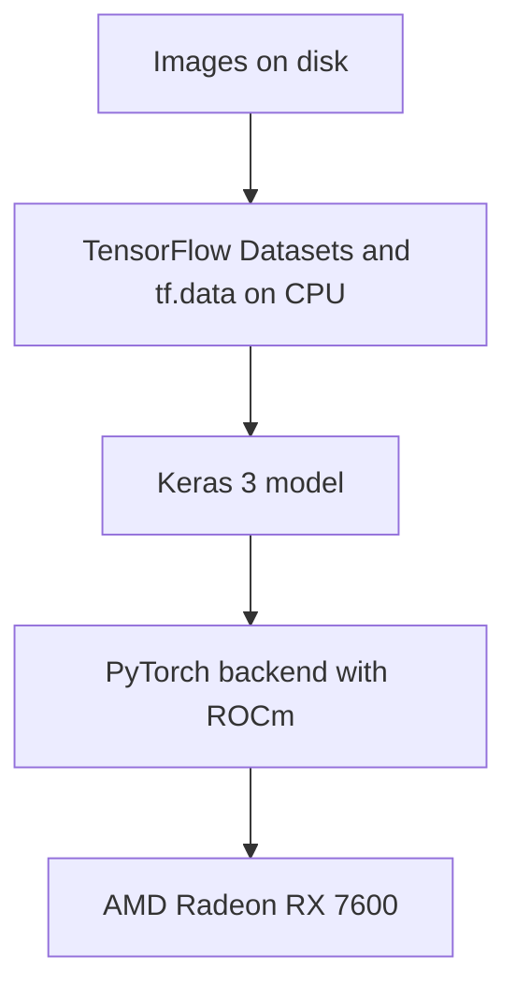

import Aside from "@rgglez/astro-aside";
import { Image } from "astro:assets";

import image01 from "@/assets/posts/2026/09/usar-keras-radeon-RX-7600/93747fc0-692d-4ea5-83c8-825f3d80dcdc.png";

{/* Cabecera generada con la herramienta integrada imagegen. Prompt final: Genera una imagen apta tanto para og:image como para hero header de un blog post. Fondo blanco. Trazos negros. Escala de grises. Caricaturezco y minimalista. Una computadora desktop por cuya ventana lateral se ve una tarjeta gráfica Radeon RX 7600 recibe pequeñas imágenes de perros y gatos a través de una cinta transportadora y alimenta una red neuronal. Junto en la mesa se ve un cuaderno de código abierto como alegoría a un notebook de Jupyter. Composición horizontal panorámica aproximadamente 1.91:1, adecuada para compartir en redes y como cabecera. Ilustración editorial a tinta de líneas negras claras y escasas sombras grises sobre blanco puro. La computadora es una torre de escritorio en vista de tres cuartos, con panel lateral transparente y una tarjeta gráfica claramente visible dentro, etiquetada exactamente «Radeon RX 7600». La cinta transportadora lleva pequeñas tarjetas con dibujos sencillos de perros y gatos hasta la torre. Desde la torre sale una conexión hacia una red neuronal representada por tres columnas de nodos conectados. Sobre la misma mesa, al lado de la torre, hay un cuaderno físico abierto con unas pocas líneas de código manuscritas en sus páginas, una alegoría visual de Jupyter. Mantén los elementos principales centrados y totalmente dentro del encuadre, con márgenes blancos generosos. Sin colores, sin título superpuesto, sin marca de agua, sin objetos adicionales. */}

## Introduction

I recently had to complete an assignment for my master's degree that involved
training several image classification models with Keras and TensorFlow. My
current machine has an AMD Radeon RX 7600 (with only 8 GB of VRAM) and runs
Debian Sid, but unfortunately TensorFlow has no official ROCm support for this
card. Fortunately, since version 3, Keras has been _backend agnostic_, which
means you can switch the training engine to PyTorch, which supports ROCm and can
use the GPU. This lets you train Keras models on the Radeon RX 7600 while
TensorFlow continues preparing the data on the CPU.

<Image
  src={image01}
  alt="Radeon RX 7600"
  loading="lazy"
  class="float-right mb-4 ml-6 h-auto w-2/5 max-w-50"
/>

So, if your notebook uses Keras and TensorFlow only detects the CPU, you can
keep the model's layers and change the training engine. In this guide, you will
configure **Keras 3 with the PyTorch backend and ROCm** to use an AMD Radeon RX
7600 on Linux. TensorFlow will keep preparing the data on the CPU.

<Aside type="note" title="Other AMD cards">

I assume these instructions will work for other midrange AMD cards with ROCm
support, but I obviously cannot guarantee it. Leave a comment to share whether
your card works with this procedure and what training times you get.

</Aside>

The reference case is a classifier for 37 breeds of cats and dogs using
MobileNetV2. Local measurements recorded around 5 seconds per epoch on the GPU
versus 28.6 seconds on the CPU. The result applies to that machine and workload:
check basic operations first, then measure your own training.

---

## Table of contents

---

## What changing the backend solves

Keras defines the model and delegates its execution to a backend. When you
select `torch`, portable Keras layers use PyTorch, whose ROCm build runs GPU
operations through AMD's libraries.



The TensorFlow package used in the reference environment looked for CUDA and
could not train on the Radeon. Changing a variable does not turn that TensorFlow
build into a ROCm build. AMD distributes options for TensorFlow, but their
compatibility depends on the GPU, the system, and the Python and ROCm versions.

The approach verified on this machine was to change the Keras backend. This
works with models built using portable operations; layers or training loops
written directly with `tf.*` need to be reviewed.

<Aside type="warning" title="Observed behavior and official support">

The RX 7600 does not appear in the ROCm 7.2.1 Radeon compatibility matrix for
Linux consulted for this guide. PyTorch detecting `gfx1102` and completing a
training run does not make this configuration officially supported by AMD. Check
the
<a href="https://rocm.docs.amd.com/projects/radeon-ryzen/en/latest/docs/compatibility/compatibilityrad/native_linux/native_linux_compatibility.html" target="_blank">compatibility
matrix</a> for the version you plan to use.

</Aside>

## Prerequisites and reference environment

You need Linux with the `amdgpu` driver, access to the compute devices, and a
working ROCm installation. This guide assumes that setup is already in place: it
does not replace AMD's instructions for installing the driver on your
distribution. Run the commands from the root of your training project.

<Aside type="note" title="Tests recorded on September 15, 2026">

The test environment used Python `3.13.15`, Keras `3.15.1`, PyTorch
`2.9.1+rocm6.4`, TensorFlow `2.21.0`, TensorFlow Datasets `4.9.10`, and NumPy
`2.5.2`. The measurements apply to the machine described below and serve as a
performance reference. The official documentation was consulted on September
18, 2026.

</Aside>

| Component               | Recorded value                                   |
| :---------------------- | :----------------------------------------------- |
| GPU                     | AMD Radeon RX 7600, `gfx1102`, 8,176 MiB of VRAM |
| CPU                     | AMD Ryzen 9 5900XT, 16 cores                     |
| Kernel                  | Linux `7.1.13+deb14-amd64`                       |
| Driver                  | `amdgpu`                                         |
| System ROCm             | `rocm-core` `7.1.1`                              |
| System HIP              | `hip-runtime-amd` `7.1.52802`                    |
| System MIOpen           | `3.5.1`                                          |
| HIP reported by PyTorch | `6.4.43484-123eb5128`                            |
| PyTorch Triton          | `pytorch-triton-rocm` `3.5.1`                    |

The `rocm6.4` suffix identifies the PyTorch build; it is not the version of the
`rocm-core` package installed on the system. Both versions coexisted on the
reference machine. Do not extrapolate that result to arbitrary combinations of
libraries and drivers: check
<a href="https://rocm.docs.amd.com/en/docs-7.1.0/compatibility/compatibility-matrix.html" target="_blank">driver
and user space compatibility</a>.

## Step 1: check ROCm and GPU permissions

Check that ROCm recognizes the card:

```bash
rocminfo | grep -E "Marketing Name|gfx"
rocm-smi --showmeminfo vram
```

The reference machine's `rocminfo` entries include:

```text
  Marketing Name:          AMD Radeon RX 7600
  Name:                    gfx1102
```

If `rocminfo` does not detect the GPU, fix the ROCm installation first. If it
fails because of permissions, inspect the devices and your session's groups:

```bash
ls -l /dev/kfd /dev/dri/renderD*
id
```

On systems that grant access through the `render` and `video` groups, add your
user and log in again:

```bash
sudo usermod -aG render,video "$USER"
```

A graphical session may receive permissions through ACLs even if the user does
not belong to those groups. That is why a local test can work while the same
test over SSH fails. AMD documents both mechanisms in its
<a href="https://rocm.docs.amd.com/projects/install-on-linux/en/latest/install/prerequisites.html" target="_blank">installation
prerequisites</a>.

## Step 2: install PyTorch with ROCm in the virtual environment

If you already have a `.venv` environment with Keras 3 and TensorFlow, use it.
To create a new one, first check that `python3.13` is the interpreter you want
to use:

```bash
python3.13 --version
python3.13 -m venv .venv
```

Install PyTorch `2.9.1` from the ROCm index:

```bash
.venv/bin/python -m pip install "torch==2.9.1" \
  --index-url https://download.pytorch.org/whl/rocm6.4
```

The index selects the ROCm packages. The command appears in the
<a href="https://pytorch.org/get-started/previous-versions/" target="_blank">PyTorch
2.9.1 instructions</a>; these examples only need `torch`, without `torchvision`
or `torchaudio`. Allow several gigabytes of disk space for the download and
installation.

In a new environment, also install the packages used by the examples:

```bash
.venv/bin/python -m pip install \
  "keras==3.15.1" "tensorflow==2.21.0" \
  "tensorflow-datasets==4.9.10" "numpy==2.5.2"
.venv/bin/python -m pip check
```

These commands pin the main dependency versions of the tested environment. If
`pip` cannot find a package for your interpreter or platform, check its wheels
before substituting versions.

Verify the build and GPU access:

```bash
.venv/bin/python -c "import torch; print(torch.__version__, torch.cuda.is_available())"
```

Recorded output:

```text
2.9.1+rocm6.4 True
```

Even though the GPU is AMD, PyTorch uses the `torch.cuda` namespace and the
`cuda:0` device. This is the documented behavior of its
<a href="https://docs.pytorch.org/docs/main/notes/hip.html" target="_blank">HIP
implementation</a>. Also check `torch.version.hip`: it must have a value in a
ROCm build.

## Step 3: test matrices and convolutions before the notebook

Detecting the card does not prove that the model's operations work. Save the
following as `probar_rocm.py`. It first checks a matrix multiplication, then
trains a convolution with Keras. Synthetic data prevents a download or the
dataset from masking a GPU failure.

```python
import os

os.environ["KERAS_BACKEND"] = "torch"

import numpy as np
import torch
import keras

assert torch.version.hip is not None, "PyTorch no utiliza ROCm"
assert torch.cuda.is_available(), "La GPU no está disponible"
assert keras.backend.backend() == "torch", "Backend incorrecto"
print("PyTorch:", torch.__version__, "HIP:", torch.version.hip)
print("GPU:", torch.cuda.get_device_name(0))

a = torch.randn(1024, 1024, device="cuda:0")
b = torch.randn(1024, 1024, device="cuda:0")
c = a @ b
torch.cuda.synchronize()
assert torch.isfinite(c).all().item(), "Resultado no finito"
print("OK: multiplicación de matrices")
del a, b, c

keras.utils.set_random_seed(42)
model = keras.Sequential([
    keras.layers.Input(shape=(32, 32, 3)),
    keras.layers.Conv2D(8, 3, activation="relu"),
    keras.layers.GlobalAveragePooling2D(),
    keras.layers.Dense(2, activation="softmax"),
])
model.compile(optimizer="adam", loss="sparse_categorical_crossentropy")
x = np.random.rand(32, 32, 32, 3).astype("float32")
y = np.random.randint(0, 2, size=32)
history = model.fit(x, y, batch_size=8, epochs=1, verbose=2)
torch.cuda.synchronize()
assert np.isfinite(history.history["loss"]).all(), "Pérdida no finita"
assert all(p.device.type == "cuda" for p in model.parameters())
print("OK: entrenamiento de convolución en GPU")
print("VRAM pico, MiB:", round(torch.cuda.max_memory_allocated() / 2**20))
```

Run the test:

```bash
.venv/bin/python probar_rocm.py
```

It must complete both checks. The second also exercises backpropagation through
the convolution and verifies that the model parameters are on the GPU. Use this
test to verify the installation before measuring performance with a real
dataset.

## Step 4: configure Keras at the start of the notebook

Select the `.venv/bin/python` interpreter in Jupyter. Restart the kernel and run
this cell before importing Keras or modules that import it:

```python
import os

os.environ["KERAS_BACKEND"] = "torch"

import tensorflow as tf

tf.config.set_visible_devices([], "GPU")

import keras
import torch

keras.utils.set_random_seed(42)
assert keras.backend.backend() == "torch", "Reinicia el kernel"
assert torch.cuda.is_available(), "La GPU no está disponible"
print("Backend:", keras.backend.backend())
print("GPU:", torch.cuda.get_device_name(0))
```

`tf.config.set_visible_devices([], "GPU")` prevents TensorFlow from using the
GPU and keeps `tf.data` processing on the CPU. It does not disable the GPU for
PyTorch or guarantee that all CUDA messages disappear when importing TensorFlow.

Use `import keras` and imports from `keras.layers`, `keras.models`, and
`keras.callbacks`. The direct import makes the use of Keras 3 explicit and
avoids mixing it with the legacy `tf_keras` package. In modern TensorFlow,
`tf.keras` can also point to Keras 3. See the
<a href="https://keras.io/getting_started/" target="_blank">official Keras setup
instructions</a>.

To start Jupyter with the backend already defined, if it is installed in that
environment:

```bash
KERAS_BACKEND=torch .venv/bin/jupyter lab
```

Writing the variable in a `.env` file does not automatically load it into
Python. If you ran imports in a different order, restart the kernel.

## Step 5: train MobileNetV2 with TensorFlow Datasets

To check a complete training run, use MobileNetV2 with the public Oxford-IIIT
Pet dataset, which contains images of 37 breeds of cats and dogs. The example
shows how to feed a Keras model with data prepared by TensorFlow and compare its
execution on CPU and GPU.

Save the code as `entrenar_keras.py` in the project root. It needs a copy
**prepared by TFDS** in `datasets/`. Download and prepare it once:

```bash
.venv/bin/python -c "import tensorflow_datasets as tfds; tfds.builder('oxford_iiit_pet:4.0.0', data_dir='datasets').download_and_prepare()"
```

Afterward, `download=False` is used to detect a missing copy without starting
another download. MobileNetV2's ImageNet weights are downloaded the first time
Keras needs them.

```python
import os
import sys
import time
from pathlib import Path

os.environ["KERAS_BACKEND"] = "torch"
usar_cpu = "cpu" in sys.argv[1:]
if usar_cpu:
    os.environ["HIP_VISIBLE_DEVICES"] = "-1"
    os.environ["CUDA_VISIBLE_DEVICES"] = "-1"

import tensorflow as tf

tf.config.set_visible_devices([], "GPU")

import tensorflow_datasets as tfds
import torch
import keras

assert keras.backend.backend() == "torch"
if usar_cpu:
    assert not torch.cuda.is_available(), "La GPU sigue visible"
else:
    assert torch.version.hip is not None, "PyTorch no utiliza ROCm"
    assert torch.cuda.is_available(), "La GPU no está disponible"

keras.utils.set_random_seed(42)
data_dir = str(Path(__file__).resolve().parent / "datasets")
(train_raw, val_raw, test_raw), info = tfds.load(
    "oxford_iiit_pet:4.0.0",
    split=["train[:80%]", "train[80%:90%]", "train[90%:]"],
    with_info=True,
    as_supervised=True,
    data_dir=data_dir,
    download=False,
)

def preparar(imagen, etiqueta):
    imagen = tf.image.resize(imagen, (160, 160))
    return imagen / 127.5 - 1.0, etiqueta

auto = tf.data.AUTOTUNE
train = train_raw.map(preparar, num_parallel_calls=auto)
train = train.batch(32).prefetch(auto)
val = val_raw.map(preparar, num_parallel_calls=auto)
val = val.batch(32).prefetch(auto)

base = keras.applications.MobileNetV2(
    input_shape=(160, 160, 3), include_top=False, weights="imagenet"
)
base.trainable = False
model = keras.Sequential([
    base,
    keras.layers.GlobalAveragePooling2D(),
    keras.layers.Dropout(0.2),
    keras.layers.Dense(info.features["label"].num_classes),
])
model.compile(
    optimizer="adam",
    loss=keras.losses.SparseCategoricalCrossentropy(from_logits=True),
    metrics=["accuracy"],
)

if not usar_cpu:
    torch.cuda.reset_peak_memory_stats()
    torch.cuda.synchronize()
inicio = time.perf_counter()
history = model.fit(train, validation_data=val, epochs=3, verbose=2)
if not usar_cpu:
    torch.cuda.synchronize()
segundos = time.perf_counter() - inicio
dispositivo = "cpu" if usar_cpu else "cuda"
assert all(p.device.type == dispositivo for p in model.parameters())
print("Dispositivo:", dispositivo)
print(f"Total: {segundos:.1f} s; media: {segundos / 3:.1f} s/época")
print("Exactitud de validación:", history.history["val_accuracy"][-1])
if not usar_cpu:
    print("VRAM pico, MiB:", round(torch.cuda.max_memory_allocated() / 2**20))
```

Compare both devices in separate processes:

```bash
.venv/bin/python entrenar_keras.py
.venv/bin/python entrenar_keras.py cpu
```

**Both commands use the PyTorch backend.** The comparison isolates the device
change; it does not compare TensorFlow on CPU against PyTorch on GPU. The timer
includes training and validation but excludes the initial loading of the dataset
and weights.

The dataset's `train` split contains 3,680 images: the example uses 2,944 for
training, 368 for validation, and sets aside the last 368. The official `test`
split, with 3,669 images, is not used in this benchmark. These sizes are
described in the
<a href="https://www.tensorflow.org/datasets/catalog/oxford_iiit_pet" target="_blank">TFDS
catalog</a>.

The `split` expressions select 80%, the next 10%, and the last 10% of `train`,
respectively. You can adjust those proportions using the
<a href="https://www.tensorflow.org/datasets/splits" target="_blank">TFDS split
syntax</a>. Reserve the test data for the final evaluation, after selecting the
model through validation.

## Interpreting performance and memory usage

The following measurements were obtained on the machine described at the start.
MobileNetV2 was trained with a frozen base, `GlobalAveragePooling2D`,
`Dropout(0.2)`, and `Dense(37)`, 160 × 160 images, batches of 32, and Adam. The
PyTorch backend was used on both CPU and GPU. The figures help estimate the
improvement for this workload; run `entrenar_keras.py` in both modes to measure
the times on your machine.

| Recorded metric                        | RX 7600                 | Ryzen 9 5900XT |
| :------------------------------------- | :---------------------- | :------------- |
| First epoch with an empty MIOpen cache | 11 s                    | 30 s           |
| Subsequent epochs                      | Approximately 5 s       | 28.6 s         |
| Time per batch                         | 53–57 ms                | 307 ms         |
| Validation accuracy after three epochs | 0.875–0.905             | 0.878          |
| Peak PyTorch VRAM                      | Approximately 1,485 MiB | Not applicable |

The ratio between 28.6 and 5 seconds is around **5.7 times**. For 30 epochs,
these figures give an estimate of about 14.3 minutes on CPU and 2.5 minutes on
GPU, excluding startup overhead. This is an extrapolation, not a measurement of
a 30-epoch training run.

In the tests, the first run was slower and subsequent runs benefited from the
MIOpen cache. Record startup and subsequent epochs separately to avoid comparing
a cold run against a warm one.

The desktop and other applications also consume VRAM. The peak shown by
`torch.cuda.max_memory_allocated()` measures PyTorch tensor allocations, not all
the memory used by the card. Monitor the overall state too:

```bash
watch -n1 rocm-smi
```

If there are pauses between batches and low GPU utilization, investigate the
data pipeline. You can try `.cache()` after resizing and normalization, before
`.batch()` and any `.shuffle()`. The 2,944 images of 160 × 160 × 3 in `float32`
occupy about 0.84 GiB of RAM, plus overhead. This benchmark preserves the data
order; for regular training, consider adding `.shuffle(2944, seed=42)` to the
training set.

Unfreezing the base, increasing the resolution, or changing the batch size
alters GPU usage and workload. Measure each configuration separately, including
fine-tuning and mixed precision.

## Portability, saving, and reproducibility

When changing backends, check that your model completes training, evaluation,
predictions, and the callbacks you use. Keras accepts `tf.data.Dataset` as input
to its training methods; you can keep that pipeline when changing backends, as
documented in its
<a href="https://keras.io/guides/training_with_built_in_methods/" target="_blank">training
and evaluation guide</a>.

Review `tf.*` calls inside custom layers, losses, and training loops. For
portable operations inside the model, use `keras.ops`, following the
<a href="https://keras.io/guides/migrating_to_keras_3/" target="_blank">Keras 3
migration guide</a>. The `tf.image` operations in the pipeline above can remain
on the CPU.

To save and reload the example model:

```python
model.save("modelo.keras")
recuperado = keras.models.load_model("modelo.keras")
```

The `.keras` format lets you preserve the model to continue working. Exporting
for inference with `model.export()` is a different operation: its formats and
dependencies vary with the backend and version. The
<a href="https://keras.io/api/models/model_saving_apis/export/" target="_blank">export
documentation</a> details the options available for the Torch backend.

Setting `keras.utils.set_random_seed(42)` helps repeat experiments but does not
guarantee identical results across CPUs and GPUs, versions, or algorithms.
PyTorch explains these limits in its
<a href="https://docs.pytorch.org/docs/main/notes/randomness.html" target="_blank">reproducibility
guide</a>.

In Jupyter, cell order changes how the random number generator is consumed. To
compare models under controlled initial conditions, set the seed before building
each one and run the entire notebook in order. An accuracy difference between
two runs does not prove that one device learns better.

## Keeping a configuration for Colab

If you share the notebook with someone who uses Colab, you can choose the
backend in the first cell. This alternative replaces the local configuration
from step 4; run it in a fresh kernel:

```python
import os
import sys

en_colab = "google.colab" in sys.modules
os.environ["KERAS_BACKEND"] = "tensorflow" if en_colab else "torch"

import tensorflow as tf

if not en_colab:
    tf.config.set_visible_devices([], "GPU")

import keras

keras.utils.set_random_seed(42)
print("Backend:", keras.backend.backend())
```

Selecting the backend does not grant you a GPU: in Colab, you must select an
environment with an accelerator and check its availability. The `datasets/` path
is not transferred automatically either; prepare the dataset in that
environment.

Local training preserves data and models between sessions. A remote environment
can be useful when you need more memory or want to share the notebook without
installing ROCm. Decide based on your model's needs and the resources actually
available.

## Troubleshooting

| Problem                                             | Check and solution                                                                                                                        |
| :-------------------------------------------------- | :---------------------------------------------------------------------------------------------------------------------------------------- |
| `torch.cuda.is_available()` returns `False`         | Check `rocminfo`, permissions on `/dev/kfd` and `/dev/dri/renderD*`, and variables that hide devices. Log in again after changing groups. |
| `torch.version.hip` returns `None`                  | The process is not using the ROCm build. Check the Jupyter interpreter and reinstall `torch` from the index in step 2.                    |
| Keras shows `tensorflow`                            | Restart the kernel and set `KERAS_BACKEND` before any import that might load Keras.                                                       |
| A convolution fails even though the GPU is detected | Reproduce the failure with `probar_rocm.py` and check the GPU, wheel, and driver. Detection does not guarantee MIOpen compatibility.      |
| `Memory access fault` or `HSA_STATUS_ERROR` appears | Keep the full message and the PyTorch, ROCm, and driver versions for diagnosis. Check that combination's compatibility with your GPU.     |
| The first epoch takes longer                        | Compare with subsequent runs: initialization and the MIOpen cache can add work at startup.                                                |
| `HIP out of memory` appears                         | Reduce the batch size from 32 to 16, check the resolution, and free memory occupied by other processes.                                   |
| TensorFlow shows a `cuInit` error                   | Check the backend and the PyTorch test. That TensorFlow message does not prove that ROCm has failed.                                      |
| TFDS cannot find the dataset                        | Verify that `data_dir` points to the directory where TFDS prepared the dataset and that the requested version is available.               |
| The desktop becomes sluggish                        | Reduce the load and close applications using the same GPU; display and training share resources.                                          |

## Verified sources

Documentation consulted on September 18, 2026. Performance figures come from the
local tests described in the article.

- <a href="https://keras.io/getting_started/" target="_blank">
    Keras: installation and backend configuration
  </a>
  .
- <a href="https://keras.io/guides/migrating_to_keras_3/" target="_blank">
    Keras: migrating to Keras 3 and portable operations
  </a>
  .
- <a
    href="https://keras.io/guides/training_with_built_in_methods/"
    target="_blank"
  >
    Keras: training and evaluation with built-in methods
  </a>
  .
- <a
    href="https://keras.io/api/models/model_saving_apis/model_saving_and_loading/"
    target="_blank"
  >
    Keras: saving and loading complete models
  </a>
  .
- <a
    href="https://keras.io/api/models/model_saving_apis/export/"
    target="_blank"
  >
    Keras: exporting for inference
  </a>
  .
- <a href="https://pytorch.org/get-started/previous-versions/" target="_blank">
    PyTorch: installing previous versions, including 2.9.1 with ROCm 6.4
  </a>
  .
- <a href="https://docs.pytorch.org/docs/main/notes/hip.html" target="_blank">
    PyTorch: HIP semantics and reuse of the CUDA API
  </a>
  .
- <a
    href="https://docs.pytorch.org/docs/main/notes/randomness.html"
    target="_blank"
  >
    PyTorch: reproducibility
  </a>
  .
- <a
    href="https://rocm.docs.amd.com/projects/radeon-ryzen/en/latest/docs/compatibility/compatibilityrad/native_linux/native_linux_compatibility.html"
    target="_blank"
  >
    AMD: Radeon compatibility matrices for Linux
  </a>
  .
- <a
    href="https://rocm.docs.amd.com/en/docs-7.1.0/compatibility/compatibility-matrix.html"
    target="_blank"
  >
    AMD: ROCm 7.1.0 compatibility matrix
  </a>
  .
- <a
    href="https://rocm.docs.amd.com/projects/install-on-linux/en/latest/install/prerequisites.html"
    target="_blank"
  >
    AMD: installation prerequisites and GPU access permissions
  </a>
  .
- <a
    href="https://www.tensorflow.org/datasets/catalog/oxford_iiit_pet"
    target="_blank"
  >
    TensorFlow Datasets: Oxford-IIIT Pet
  </a>
  .
- <a href="https://www.tensorflow.org/datasets/splits" target="_blank">
    TensorFlow Datasets: splits and slices
  </a>
  .
