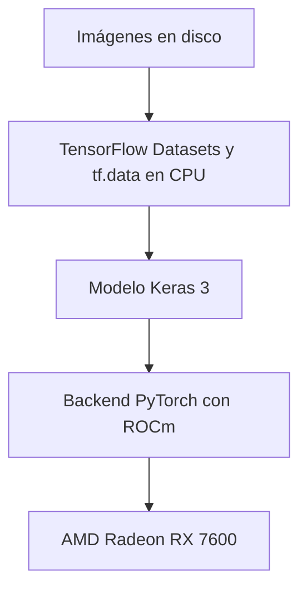

import Aside from "@rgglez/astro-aside";
import { Image } from 'astro:assets';

import image01 from '@/assets/posts/2026/09/usar-keras-radeon-RX-7600/93747fc0-692d-4ea5-83c8-825f3d80dcdc.png';

{/* Cabecera generada con la herramienta integrada imagegen. Prompt final: Genera una imagen apta tanto para og:image como para hero header de un blog post. Fondo blanco. Trazos negros. Escala de grises. Caricaturezco y minimalista. Una computadora desktop por cuya ventana lateral se ve una tarjeta gráfica Radeon RX 7600 recibe pequeñas imágenes de perros y gatos a través de una cinta transportadora y alimenta una red neuronal. Junto en la mesa se ve un cuaderno de código abierto como alegoría a un notebook de Jupyter. Composición horizontal panorámica aproximadamente 1.91:1, adecuada para compartir en redes y como cabecera. Ilustración editorial a tinta de líneas negras claras y escasas sombras grises sobre blanco puro. La computadora es una torre de escritorio en vista de tres cuartos, con panel lateral transparente y una tarjeta gráfica claramente visible dentro, etiquetada exactamente «Radeon RX 7600». La cinta transportadora lleva pequeñas tarjetas con dibujos sencillos de perros y gatos hasta la torre. Desde la torre sale una conexión hacia una red neuronal representada por tres columnas de nodos conectados. Sobre la misma mesa, al lado de la torre, hay un cuaderno físico abierto con unas pocas líneas de código manuscritas en sus páginas, una alegoría visual de Jupyter. Mantén los elementos principales centrados y totalmente dentro del encuadre, con márgenes blancos generosos. Sin colores, sin título superpuesto, sin marca de agua, sin objetos adicionales. */}

## Introducción

Recientemente tuve que realizar una actividad para la maestría, que consistió
en entrenar varios modelos de clasificación de imágenes con Keras y TensorFlow.
Mi equipo actual dispone de una AMD Radeon RX 7600 (con solo 8 Gb de VRAM) y
Debian Sid, pero TensorFlow desafortunadamente no tiene soporte oficial para
ROCm en esa tarjeta. Afortunadamente, desde la versión 3 de Keras, este es
*backend agnostic*, lo que significa que puedes cambiar el motor de entrenamiento
a PyTorch, que sí tiene soporte para ROCm y puede aprovechar la GPU. Esto permite
entrenar modelos de Keras en la Radeon RX 7600, mientras que TensorFlow
continúa preparando los datos en la CPU.

<Image src={image01} alt="Radeon RX 7600" loading="lazy" class="float-right ml-6 mb-4 w-2/5 max-w-50 h-auto" />

Por tanto, si tu notebook usa Keras, y TensorFlow solo detecta la CPU, puedes
conservar las capas del modelo y cambiar el motor de entrenamiento. En esta guía
configurarás **Keras 3 con el backend PyTorch y ROCm** para utilizar una AMD
Radeon RX 7600 en Linux. TensorFlow seguirá preparando los datos en CPU.

<Aside type="note" title="Otras tarjetas AMD">

Presumo que estas instrucciones servirán para otras tarjetas AMD de gama media
con soporte ROCm, pero obviamente no puedo garantizarlo. Deja en los comentarios
si tu tarjeta funciona con este procedimiento y qué tiempos de entrenamiento
obtienes.

</Aside>

El caso de referencia es un clasificador de 37 razas de perros y gatos con
MobileNetV2. Las mediciones locales registraron unos 5 segundos por época en GPU
frente a 28,6 segundos en CPU. El resultado corresponde a ese equipo y esa
carga: comprueba primero las operaciones básicas y después mide tu propio
entrenamiento.

---

## Tabla de contenido

---

## Qué resuelve el cambio de backend

Keras define el modelo y delega su ejecución en un backend. Al seleccionar
`torch`, las capas portables de Keras utilizan PyTorch, que en su compilación
ROCm ejecuta las operaciones de GPU mediante las bibliotecas de AMD.



El paquete de TensorFlow utilizado en el entorno de referencia buscaba CUDA y no
podía entrenar en la Radeon. Cambiar una variable no convierte esa compilación
de TensorFlow en una compilación ROCm. AMD distribuye opciones para TensorFlow,
pero su compatibilidad depende de la GPU, el sistema y las versiones de Python y
ROCm.

La vía que se comprobó en este equipo fue cambiar el backend de Keras. Esto
funciona con modelos construidos con operaciones portables; las capas o los
bucles de entrenamiento escritos directamente con `tf.*` requieren revisión.

<Aside type="warning" title="Funcionamiento observado y soporte oficial">

La RX 7600 no figura en la matriz de Radeon para Linux de ROCm 7.2.1 consultada
para esta guía. Que PyTorch detecte `gfx1102` y complete un entrenamiento no
convierte esta configuración en una combinación soportada oficialmente por AMD.
Consulta la <a href="https://rocm.docs.amd.com/projects/radeon-ryzen/en/latest/docs/compatibility/compatibilityrad/native_linux/native_linux_compatibility.html" target="_blank">matriz de compatibilidad</a>
de la versión que vayas a utilizar.

</Aside>

## Requisitos previos y entorno de referencia

Necesitas Linux con el controlador `amdgpu`, acceso a los dispositivos de
cómputo y ROCm operativo. Esta guía parte de esa instalación: no sustituye las
instrucciones de AMD para instalar el controlador en tu distribución. Ejecuta
los comandos desde la raíz de tu proyecto de entrenamiento.

<Aside type="note" title="Pruebas registradas el 15 de septiembre de 2026">

El entorno utilizado en las pruebas tenía Python `3.13.15`, Keras `3.15.1`,
PyTorch `2.9.1+rocm6.4`, TensorFlow `2.21.0`, TensorFlow Datasets `4.9.10` y
NumPy `2.5.2`. Las mediciones corresponden al equipo descrito a continuación
y sirven como referencia de rendimiento. La documentación oficial se consultó
el 18 de septiembre de 2026.

</Aside>

| Componente               | Valor registrado                                 |
| :----------------------- | :----------------------------------------------- |
| GPU                      | AMD Radeon RX 7600, `gfx1102`, 8.176 MiB de VRAM |
| CPU                      | AMD Ryzen 9 5900XT, 16 núcleos                   |
| Kernel                   | Linux `7.1.13+deb14-amd64`                       |
| Controlador              | `amdgpu`                                         |
| ROCm del sistema         | `rocm-core` `7.1.1`                              |
| HIP del sistema          | `hip-runtime-amd` `7.1.52802`                    |
| MIOpen del sistema       | `3.5.1`                                          |
| HIP indicado por PyTorch | `6.4.43484-123eb5128`                            |
| Triton de PyTorch        | `pytorch-triton-rocm` `3.5.1`                    |

El sufijo `rocm6.4` identifica la compilación de PyTorch; no es la versión del
paquete `rocm-core` instalado en el sistema. Ambas versiones coexistieron en el
equipo de referencia. No extrapoles ese resultado a cualquier mezcla de
bibliotecas y controladores: revisa la <a href="https://rocm.docs.amd.com/en/docs-7.1.0/compatibility/compatibility-matrix.html" target="_blank">compatibilidad entre el controlador y el espacio de usuario</a>.

## Paso 1: comprobar ROCm y los permisos de la GPU

Comprueba que ROCm reconoce la tarjeta:

```bash
rocminfo | grep -E "Marketing Name|gfx"
rocm-smi --showmeminfo vram
```

Entre las entradas de `rocminfo` del equipo de referencia aparecen:

```text
  Marketing Name:          AMD Radeon RX 7600
  Name:                    gfx1102
```

Si `rocminfo` no detecta la GPU, resuelve primero la instalación de ROCm. Si
falla por permisos, inspecciona los dispositivos y los grupos de tu sesión:

```bash
ls -l /dev/kfd /dev/dri/renderD*
id
```

En sistemas que conceden acceso mediante los grupos `render` y `video`, añade tu
usuario y vuelve a iniciar sesión:

```bash
sudo usermod -aG render,video "$USER"
```

Una sesión gráfica puede recibir permisos mediante ACL aunque el usuario no
pertenezca a esos grupos. Por eso una prueba local puede funcionar y la misma
prueba por SSH fallar. AMD documenta ambos mecanismos en sus <a href="https://rocm.docs.amd.com/projects/install-on-linux/en/latest/install/prerequisites.html" target="_blank">requisitos de instalación</a>.

## Paso 2: instalar PyTorch con ROCm en el entorno virtual

Si ya tienes un entorno `.venv` con Keras 3 y TensorFlow, úsalo. Para crear uno
nuevo, comprueba primero que `python3.13` corresponde al intérprete que quieres
emplear:

```bash
python3.13 --version
python3.13 -m venv .venv
```

Instala PyTorch `2.9.1` desde el índice ROCm:

```bash
.venv/bin/python -m pip install "torch==2.9.1" \
  --index-url https://download.pytorch.org/whl/rocm6.4
```

El índice selecciona los paquetes ROCm. El comando está recogido en las <a href="https://pytorch.org/get-started/previous-versions/" target="_blank">instrucciones de PyTorch 2.9.1</a>; para estos ejemplos basta con `torch`, sin `torchvision` ni `torchaudio`.
Reserva varios gigabytes de disco para la descarga y la instalación.

En un entorno nuevo, instala también los paquetes utilizados por los ejemplos:

```bash
.venv/bin/python -m pip install \
  "keras==3.15.1" "tensorflow==2.21.0" \
  "tensorflow-datasets==4.9.10" "numpy==2.5.2"
.venv/bin/python -m pip check
```

Estos comandos fijan las versiones de las dependencias principales del entorno
probado. Si `pip` no encuentra un paquete para tu intérprete o plataforma,
comprueba sus wheels antes de sustituir versiones.

Verifica la compilación y el acceso a la GPU:

```bash
.venv/bin/python -c "import torch; print(torch.__version__, torch.cuda.is_available())"
```

Resultado registrado:

```text
2.9.1+rocm6.4 True
```

Aunque la GPU sea AMD, PyTorch utiliza el espacio de nombres `torch.cuda` y el
dispositivo `cuda:0`. Es el comportamiento documentado de su <a href="https://docs.pytorch.org/docs/main/notes/hip.html" target="_blank">implementación HIP</a>. Comprueba también `torch.version.hip`: debe tener un valor en una compilación
ROCm.

## Paso 3: probar matrices y convoluciones antes del notebook

Detectar la tarjeta no demuestra que las operaciones del modelo funcionen.
Guarda lo siguiente como `probar_rocm.py`. Primero comprueba una multiplicación
de matrices y después entrena una convolución con Keras. Los datos sintéticos
evitan que una descarga o el dataset oculten un fallo de GPU.

```python
import os

os.environ["KERAS_BACKEND"] = "torch"

import numpy as np
import torch
import keras

assert torch.version.hip is not None, "PyTorch no utiliza ROCm"
assert torch.cuda.is_available(), "La GPU no está disponible"
assert keras.backend.backend() == "torch", "Backend incorrecto"
print("PyTorch:", torch.__version__, "HIP:", torch.version.hip)
print("GPU:", torch.cuda.get_device_name(0))

a = torch.randn(1024, 1024, device="cuda:0")
b = torch.randn(1024, 1024, device="cuda:0")
c = a @ b
torch.cuda.synchronize()
assert torch.isfinite(c).all().item(), "Resultado no finito"
print("OK: multiplicación de matrices")
del a, b, c

keras.utils.set_random_seed(42)
model = keras.Sequential([
    keras.layers.Input(shape=(32, 32, 3)),
    keras.layers.Conv2D(8, 3, activation="relu"),
    keras.layers.GlobalAveragePooling2D(),
    keras.layers.Dense(2, activation="softmax"),
])
model.compile(optimizer="adam", loss="sparse_categorical_crossentropy")
x = np.random.rand(32, 32, 32, 3).astype("float32")
y = np.random.randint(0, 2, size=32)
history = model.fit(x, y, batch_size=8, epochs=1, verbose=2)
torch.cuda.synchronize()
assert np.isfinite(history.history["loss"]).all(), "Pérdida no finita"
assert all(p.device.type == "cuda" for p in model.parameters())
print("OK: entrenamiento de convolución en GPU")
print("VRAM pico, MiB:", round(torch.cuda.max_memory_allocated() / 2**20))
```

Ejecuta la prueba:

```bash
.venv/bin/python probar_rocm.py
```

Debe completar ambas comprobaciones. La segunda ejercita también la
retropropagación de la convolución y comprueba que los parámetros del modelo
están en la GPU. Utiliza esta prueba para verificar la instalación antes de
medir el rendimiento con un dataset real.

## Paso 4: configurar Keras al principio del notebook

Selecciona en Jupyter el intérprete `.venv/bin/python`. Reinicia el kernel y
ejecuta esta celda antes de importar Keras o módulos que lo importen:

```python
import os

os.environ["KERAS_BACKEND"] = "torch"

import tensorflow as tf

tf.config.set_visible_devices([], "GPU")

import keras
import torch

keras.utils.set_random_seed(42)
assert keras.backend.backend() == "torch", "Reinicia el kernel"
assert torch.cuda.is_available(), "La GPU no está disponible"
print("Backend:", keras.backend.backend())
print("GPU:", torch.cuda.get_device_name(0))
```

`tf.config.set_visible_devices([], "GPU")` impide que TensorFlow utilice la GPU
y deja el procesamiento de `tf.data` en CPU. No desactiva la GPU para PyTorch ni
garantiza que desaparezcan todos los mensajes de CUDA al importar TensorFlow.

Usa `import keras` y los imports de `keras.layers`, `keras.models` y
`keras.callbacks`. El import directo hace explícito el uso de Keras 3 y evita
mezclarlo con el paquete heredado `tf_keras`. En TensorFlow moderno,
`tf.keras` también puede apuntar a Keras 3. Consulta
la <a href="https://keras.io/getting_started/" target="_blank">configuración oficial de Keras</a>.

Para iniciar Jupyter con el backend ya definido, si está instalado en ese
entorno:

```bash
KERAS_BACKEND=torch .venv/bin/jupyter lab
```

Escribir la variable en un archivo `.env` no la carga automáticamente en Python.
Si ejecutaste imports en otro orden, reinicia el kernel.

## Paso 5: entrenar MobileNetV2 con TensorFlow Datasets

Para comprobar un entrenamiento completo, utiliza MobileNetV2 con el dataset
público Oxford-IIIT Pet, que contiene imágenes de 37 razas de perros y gatos.
El ejemplo muestra cómo alimentar un modelo de Keras con datos preparados por
TensorFlow y comparar su ejecución en CPU y GPU.

Guarda el código como `entrenar_keras.py` en la raíz del proyecto. Necesita una
copia **preparada por TFDS** en `datasets/`. Descárgala y prepárala una vez:

```bash
.venv/bin/python -c "import tensorflow_datasets as tfds; tfds.builder('oxford_iiit_pet:4.0.0', data_dir='datasets').download_and_prepare()"
```

Después se usa `download=False` para detectar una copia ausente sin iniciar otra
descarga. Los pesos ImageNet de MobileNetV2 sí se descargan la primera vez que
Keras los necesita.

```python
import os
import sys
import time
from pathlib import Path

os.environ["KERAS_BACKEND"] = "torch"
usar_cpu = "cpu" in sys.argv[1:]
if usar_cpu:
    os.environ["HIP_VISIBLE_DEVICES"] = "-1"
    os.environ["CUDA_VISIBLE_DEVICES"] = "-1"

import tensorflow as tf

tf.config.set_visible_devices([], "GPU")

import tensorflow_datasets as tfds
import torch
import keras

assert keras.backend.backend() == "torch"
if usar_cpu:
    assert not torch.cuda.is_available(), "La GPU sigue visible"
else:
    assert torch.version.hip is not None, "PyTorch no utiliza ROCm"
    assert torch.cuda.is_available(), "La GPU no está disponible"

keras.utils.set_random_seed(42)
data_dir = str(Path(__file__).resolve().parent / "datasets")
(train_raw, val_raw, test_raw), info = tfds.load(
    "oxford_iiit_pet:4.0.0",
    split=["train[:80%]", "train[80%:90%]", "train[90%:]"],
    with_info=True,
    as_supervised=True,
    data_dir=data_dir,
    download=False,
)

def preparar(imagen, etiqueta):
    imagen = tf.image.resize(imagen, (160, 160))
    return imagen / 127.5 - 1.0, etiqueta

auto = tf.data.AUTOTUNE
train = train_raw.map(preparar, num_parallel_calls=auto)
train = train.batch(32).prefetch(auto)
val = val_raw.map(preparar, num_parallel_calls=auto)
val = val.batch(32).prefetch(auto)

base = keras.applications.MobileNetV2(
    input_shape=(160, 160, 3), include_top=False, weights="imagenet"
)
base.trainable = False
model = keras.Sequential([
    base,
    keras.layers.GlobalAveragePooling2D(),
    keras.layers.Dropout(0.2),
    keras.layers.Dense(info.features["label"].num_classes),
])
model.compile(
    optimizer="adam",
    loss=keras.losses.SparseCategoricalCrossentropy(from_logits=True),
    metrics=["accuracy"],
)

if not usar_cpu:
    torch.cuda.reset_peak_memory_stats()
    torch.cuda.synchronize()
inicio = time.perf_counter()
history = model.fit(train, validation_data=val, epochs=3, verbose=2)
if not usar_cpu:
    torch.cuda.synchronize()
segundos = time.perf_counter() - inicio
dispositivo = "cpu" if usar_cpu else "cuda"
assert all(p.device.type == dispositivo for p in model.parameters())
print("Dispositivo:", dispositivo)
print(f"Total: {segundos:.1f} s; media: {segundos / 3:.1f} s/época")
print("Exactitud de validación:", history.history["val_accuracy"][-1])
if not usar_cpu:
    print("VRAM pico, MiB:", round(torch.cuda.max_memory_allocated() / 2**20))
```

Compara ambos dispositivos en procesos separados:

```bash
.venv/bin/python entrenar_keras.py
.venv/bin/python entrenar_keras.py cpu
```

**Ambos comandos usan el backend PyTorch.** La comparación aísla el cambio de
dispositivo; no compara TensorFlow en CPU contra PyTorch en GPU. El temporizador
incluye entrenamiento y validación, pero excluye la carga inicial del dataset y
de los pesos.

La partición `train` del dataset contiene 3.680 imágenes: el ejemplo utiliza
2.944 para entrenamiento, 368 para validación y reserva las últimas 368.
El `test` oficial, con 3.669
imágenes, no se utiliza en este benchmark. Estos tamaños se describen en el <a href="https://www.tensorflow.org/datasets/catalog/oxford_iiit_pet" target="_blank">catálogo de TFDS</a>.

Las expresiones de `split` seleccionan el 80 %, el siguiente 10 % y el último
10 % de `train`, respectivamente. Puedes ajustar esas proporciones mediante
la <a href="https://www.tensorflow.org/datasets/splits" target="_blank">sintaxis de particiones de TFDS</a>.
Reserva los datos de prueba para la evaluación final, después de elegir el
modelo con validación.

## Interpretar el rendimiento y el uso de memoria

Las siguientes mediciones se obtuvieron en el equipo descrito al inicio.
Se entrenó MobileNetV2 con la base congelada,
`GlobalAveragePooling2D`, `Dropout(0.2)` y `Dense(37)`, imágenes de 160 × 160,
lotes de 32 y Adam. Se utilizó el backend PyTorch tanto en CPU como en GPU.
Las cifras sirven para estimar la mejora con esta carga de trabajo; ejecuta
`entrenar_keras.py` en ambos modos para medir los tiempos en tu equipo.

| Métrica registrada                       | RX 7600                   | Ryzen 9 5900XT |
| :--------------------------------------- | :------------------------ | :------------- |
| Primera época con caché de MIOpen vacía  | 11 s                      | 30 s           |
| Épocas posteriores                       | Aproximadamente 5 s       | 28,6 s         |
| Tiempo por lote                          | 53–57 ms                  | 307 ms         |
| Exactitud de validación tras tres épocas | 0,875–0,905               | 0,878          |
| VRAM pico de PyTorch                     | Aproximadamente 1.485 MiB | No aplica      |

La relación entre 28,6 y 5 segundos ronda **5,7 veces**. Para 30 épocas, esas
cifras permiten estimar unos 14,3 minutos en CPU y 2,5 minutos en GPU, sin
contar sobrecostes iniciales. Es una extrapolación, no una medición de un
entrenamiento de 30 épocas.

En las pruebas, la primera ejecución fue más lenta y las siguientes aprovecharon
la caché de MIOpen. Registra por separado el arranque y las épocas posteriores
para no comparar una ejecución fría contra otra caliente.

El escritorio y otras aplicaciones también consumen VRAM. El pico mostrado
por `torch.cuda.max_memory_allocated()` mide asignaciones de tensores de
PyTorch, no toda la memoria usada por la tarjeta. Observa también el estado
global:

```bash
watch -n1 rocm-smi
```

Si hay pausas entre lotes y poca utilización de GPU, investiga el pipeline de
datos. Puedes probar `.cache()` después de redimensionar y normalizar, antes de
`.batch()` y de un eventual `.shuffle()`. Las 2.944 imágenes de 160 × 160 × 3 en
`float32` ocupan unos 0,84 GiB de RAM, más sobrecostes. Este benchmark conserva
el orden de los datos; para entrenamiento habitual, evalúa añadir
`.shuffle(2944, seed=42)` al conjunto de entrenamiento.

Descongelar la base, aumentar la resolución o cambiar el lote modifica el
consumo y el trabajo de GPU. Mide cada configuración por separado, incluido
el ajuste fino y el uso de precisión mixta.

## Portabilidad, guardado y reproducibilidad

Al cambiar de backend, revisa que tu modelo complete el entrenamiento, la
evaluación, las predicciones y los callbacks que utilices. Keras acepta
`tf.data.Dataset` como entrada a sus métodos de entrenamiento; puedes mantener
ese pipeline al cambiar de backend, como documenta su <a href="https://keras.io/guides/training_with_built_in_methods/" target="_blank">guía de entrenamiento y evaluación</a>.

Revisa las llamadas `tf.*` dentro de capas personalizadas, pérdidas y bucles de
entrenamiento. Para operaciones portables dentro del modelo utiliza `keras.ops`,
siguiendo la <a href="https://keras.io/guides/migrating_to_keras_3/" target="_blank">guía de migración a Keras 3</a>. Las operaciones `tf.image` del pipeline anterior pueden permanecer en CPU.

Para guardar y recuperar el modelo del ejemplo:

```python
model.save("modelo.keras")
recuperado = keras.models.load_model("modelo.keras")
```

El formato `.keras` permite conservar el modelo para continuar trabajando. La
exportación para inferencia mediante `model.export()` es otra operación: sus
formatos y dependencias varían con el backend y la versión. La <a href="https://keras.io/api/models/model_saving_apis/export/" target="_blank">documentación de exportación</a>
detalla las opciones disponibles para el backend Torch.

Fijar `keras.utils.set_random_seed(42)` ayuda a repetir experimentos, pero no
garantiza resultados idénticos entre CPU y GPU, versiones o algoritmos.
PyTorch explica estos límites en su <a href="https://docs.pytorch.org/docs/main/notes/randomness.html" target="_blank">guía de reproducibilidad</a>.

En Jupyter, el orden de las celdas cambia el consumo del generador aleatorio.
Para comparar modelos desde condiciones iniciales controladas, fija la semilla
antes de construir cada uno y ejecuta el notebook completo en orden. Una
diferencia de exactitud entre dos ejecuciones no demuestra que un dispositivo
aprenda mejor.

## Mantener una configuración para Colab

Si compartes el notebook con alguien que usa Colab, puedes elegir el backend en
la primera celda. Esta alternativa sustituye la configuración local del paso 4;
ejecútala en un kernel nuevo:

```python
import os
import sys

en_colab = "google.colab" in sys.modules
os.environ["KERAS_BACKEND"] = "tensorflow" if en_colab else "torch"

import tensorflow as tf

if not en_colab:
    tf.config.set_visible_devices([], "GPU")

import keras

keras.utils.set_random_seed(42)
print("Backend:", keras.backend.backend())
```

La selección del backend no concede una GPU: en Colab debes seleccionar un
entorno con acelerador y comprobar su disponibilidad. La ruta `datasets/`
tampoco se transfiere automáticamente; prepara el dataset en ese entorno.

El entrenamiento local conserva datos y modelos entre sesiones. Un entorno
remoto puede resultar útil cuando necesitas más memoria o compartir el notebook
sin instalar ROCm. Decide con las necesidades de tu modelo y los recursos
realmente disponibles.

## Resolución de problemas

| Problema                                           | Comprobación y solución                                                                                                                                        |
| :------------------------------------------------- | :------------------------------------------------------------------------------------------------------------------------------------------------------------- |
| `torch.cuda.is_available()` devuelve `False`       | Revisa `rocminfo`, los permisos sobre `/dev/kfd` y `/dev/dri/renderD*`, y las variables que ocultan dispositivos. Reinicia la sesión tras cambiar grupos.      |
| `torch.version.hip` devuelve `None`                | El proceso no está usando la compilación ROCm. Comprueba el intérprete de Jupyter y reinstala `torch` desde el índice del paso 2.                              |
| Keras muestra `tensorflow`                         | Reinicia el kernel y configura `KERAS_BACKEND` antes de cualquier import que pueda cargar Keras.                                                               |
| Falla una convolución aunque se detecte la GPU     | Reproduce el fallo con `probar_rocm.py` y revisa GPU, wheel y controlador. La detección no garantiza compatibilidad de MIOpen.                                 |
| Aparece `Memory access fault` o `HSA_STATUS_ERROR` | Conserva el mensaje completo y las versiones de PyTorch, ROCm y el controlador para diagnosticarlo. Comprueba la compatibilidad de esa combinación con tu GPU. |
| La primera época tarda más                         | Compara con ejecuciones posteriores: la inicialización y la caché de MIOpen pueden añadir trabajo al arranque.                                                 |
| Aparece `HIP out of memory`                        | Reduce el lote de 32 a 16, revisa la resolución y libera memoria ocupada por otros procesos.                                                                   |
| TensorFlow muestra un error de `cuInit`            | Comprueba el backend y la prueba de PyTorch. Ese mensaje de TensorFlow no demuestra que ROCm haya fallado.                                                     |
| TFDS no encuentra el dataset                       | Verifica que `data_dir` apunte al directorio donde TFDS preparó el dataset y que la versión solicitada esté disponible.                                        |
| El escritorio pierde fluidez                       | Reduce la carga y cierra aplicaciones que usen la misma GPU; pantalla y entrenamiento comparten recursos.                                                      |

## Fuentes verificadas

Documentación consultada el 18 de septiembre de 2026. Las cifras de rendimiento
proceden de las pruebas locales descritas en el artículo.

- <a href="https://keras.io/getting_started/" target="_blank">
    Keras: instalación y configuración del backend
  </a>
  .
- <a href="https://keras.io/guides/migrating_to_keras_3/" target="_blank">
    Keras: migración a Keras 3 y operaciones portables
  </a>
  .
- <a
    href="https://keras.io/guides/training_with_built_in_methods/"
    target="_blank"
  >
    Keras: entrenamiento y evaluación con los métodos integrados
  </a>
  .
- <a
    href="https://keras.io/api/models/model_saving_apis/model_saving_and_loading/"
    target="_blank"
  >
    Keras: guardado y carga de modelos completos
  </a>
  .
- <a
    href="https://keras.io/api/models/model_saving_apis/export/"
    target="_blank"
  >
    Keras: exportación para inferencia
  </a>
  .
- <a href="https://pytorch.org/get-started/previous-versions/" target="_blank">
    PyTorch: instalación de versiones anteriores, incluida 2.9.1 con ROCm 6.4
  </a>
  .
- <a href="https://docs.pytorch.org/docs/main/notes/hip.html" target="_blank">
    PyTorch: semántica HIP y reutilización de la API CUDA
  </a>
  .
- <a
    href="https://docs.pytorch.org/docs/main/notes/randomness.html"
    target="_blank"
  >
    PyTorch: reproducibilidad
  </a>
  .
- <a
    href="https://rocm.docs.amd.com/projects/radeon-ryzen/en/latest/docs/compatibility/compatibilityrad/native_linux/native_linux_compatibility.html"
    target="_blank"
  >
    AMD: matrices de compatibilidad de Radeon en Linux
  </a>
  .
- <a
    href="https://rocm.docs.amd.com/en/docs-7.1.0/compatibility/compatibility-matrix.html"
    target="_blank"
  >
    AMD: matriz de compatibilidad de ROCm 7.1.0
  </a>
  .
- <a
    href="https://rocm.docs.amd.com/projects/install-on-linux/en/latest/install/prerequisites.html"
    target="_blank"
  >
    AMD: requisitos de instalación y permisos de acceso a la GPU
  </a>
  .
- <a
    href="https://www.tensorflow.org/datasets/catalog/oxford_iiit_pet"
    target="_blank"
  >
    TensorFlow Datasets: Oxford-IIIT Pet
  </a>
  .
- <a href="https://www.tensorflow.org/datasets/splits" target="_blank">
    TensorFlow Datasets: particiones e intervalos
  </a>
  .
