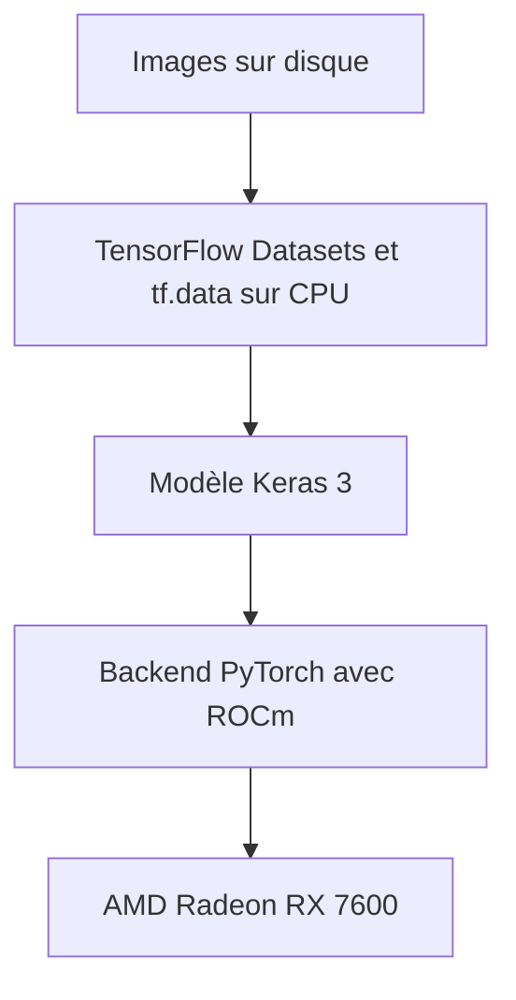

---
title:
  "Comment entraîner un modèle avec Keras 3 et une AMD Radeon RX 7600 sous
  Linux."
description: >-
  Configurez Keras 3 avec PyTorch et ROCm pour entraîner un modèle sur une
  Radeon RX 7600. Vérifiez le calcul sur GPU, conservez votre pipeline
  TensorFlow Datasets et comparez les performances au CPU avec MobileNetV2.
slug: "entrainer-keras-radeon-rx-7600"
pubDatetime: 2026-09-18T00:00:00-06:00
modDatetime: 2026-09-18T00:00:00-06:00
lang: fr
ogImage: "../../../../../assets/posts/2026/09/usar-keras-radeon-RX-7600/header.webp"
featured: false
draft: false
tags:
  - keras
  - pytorch
  - rocm
  - amd
  - linux
  - apprentissage-profond
timezone: "America/Mexico_City"
license: "CC BY-NC-ND 4.0"
licenseUrl: "https://creativecommons.org/licenses/by-nc-nd/4.0/legalcode.fr"
---

import Aside from "@rgglez/astro-aside";
import { Image } from "astro:assets";

import image01 from "@/assets/posts/2026/09/usar-keras-radeon-RX-7600/93747fc0-692d-4ea5-83c8-825f3d80dcdc.png";

{/* Cabecera generada con la herramienta integrada imagegen. Prompt final: Genera una imagen apta tanto para og:image como para hero header de un blog post. Fondo blanco. Trazos negros. Escala de grises. Caricaturezco y minimalista. Una computadora desktop por cuya ventana lateral se ve una tarjeta gráfica Radeon RX 7600 recibe pequeñas imágenes de perros y gatos a través de una cinta transportadora y alimenta una red neuronal. Junto en la mesa se ve un cuaderno de código abierto como alegoría a un notebook de Jupyter. Composición horizontal panorámica aproximadamente 1.91:1, adecuada para compartir en redes y como cabecera. Ilustración editorial a tinta de líneas negras claras y escasas sombras grises sobre blanco puro. La computadora es una torre de escritorio en vista de tres cuartos, con panel lateral transparente y una tarjeta gráfica claramente visible dentro, etiquetada exactamente «Radeon RX 7600». La cinta transportadora lleva pequeñas tarjetas con dibujos sencillos de perros y gatos hasta la torre. Desde la torre sale una conexión hacia una red neuronal representada por tres columnas de nodos conectados. Sobre la misma mesa, al lado de la torre, hay un cuaderno físico abierto con unas pocas líneas de código manuscritas en sus páginas, una alegoría visual de Jupyter. Mantén los elementos principales centrados y totalmente dentro del encuadre, con márgenes blancos generosos. Sin colores, sin título superpuesto, sin marca de agua, sin objetos adicionales. */}

## Introduction

J'ai récemment dû réaliser un travail pour mon master qui consistait à entraîner
plusieurs modèles de classification d'images avec Keras et TensorFlow. Ma
machine actuelle dispose d'une AMD Radeon RX 7600 (avec seulement 8 Go de VRAM)
et tourne sous Debian Sid, mais TensorFlow ne prend malheureusement pas
officiellement en charge ROCm pour cette carte. Heureusement, depuis sa version
3, Keras est _indépendant du backend_, ce qui permet de remplacer le moteur
d'entraînement par PyTorch, qui prend en charge ROCm et peut exploiter le GPU.
Cela permet d'entraîner des modèles Keras sur la Radeon RX 7600 pendant que
TensorFlow continue de préparer les données sur le CPU.

<Image
  src={image01}
  alt="Radeon RX 7600"
  loading="lazy"
  class="float-right mb-4 ml-6 h-auto w-2/5 max-w-50"
/>

Ainsi, si votre notebook utilise Keras et que TensorFlow ne détecte que le CPU,
vous pouvez conserver les couches du modèle et changer de moteur d'entraînement.
Dans ce guide, vous configurerez **Keras 3 avec le backend PyTorch et ROCm**
pour utiliser une AMD Radeon RX 7600 sous Linux. TensorFlow continuera de
préparer les données sur le CPU.

<Aside type="note" title="Autres cartes AMD">

Je suppose que ces instructions fonctionneront avec d'autres cartes AMD de
milieu de gamme compatibles avec ROCm, mais je ne peux évidemment pas le
garantir. Indiquez dans les commentaires si votre carte fonctionne avec cette
procédure et quels temps d'entraînement vous obtenez.

</Aside>

Le cas de référence est un classificateur de 37 races de chiens et de chats
utilisant MobileNetV2. Les mesures locales ont donné environ 5 secondes par
époque sur GPU, contre 28,6 secondes sur CPU. Ce résultat correspond à cette
machine et à cette charge de travail : vérifiez d'abord les opérations de base,
puis mesurez votre propre entraînement.

---

## Table des matières

---

## Ce que résout le changement de backend

Keras définit le modèle et délègue son exécution à un backend. Lorsque vous
sélectionnez `torch`, les couches portables de Keras utilisent PyTorch, dont la
version ROCm exécute les opérations GPU au moyen des bibliothèques d'AMD.



Le paquet TensorFlow utilisé dans l'environnement de référence recherchait CUDA
et ne pouvait pas entraîner de modèle sur la Radeon. Changer une variable ne
transforme pas cette version de TensorFlow en une version ROCm. AMD propose des
solutions pour TensorFlow, mais leur compatibilité dépend du GPU, du système et
des versions de Python et de ROCm.

La méthode vérifiée sur cette machine consistait à changer le backend de Keras.
Cela fonctionne pour les modèles construits avec des opérations portables ; les
couches ou les boucles d'entraînement écrites directement avec `tf.*` doivent
être examinées.

<Aside type="warning" title="Fonctionnement observé et prise en charge officielle">

La RX 7600 ne figure pas dans la matrice de compatibilité Radeon sous Linux pour
ROCm 7.2.1 consultée pour ce guide. Le fait que PyTorch détecte `gfx1102` et
termine un entraînement ne fait pas de cette configuration une combinaison
officiellement prise en charge par AMD. Consultez la
<a href="https://rocm.docs.amd.com/projects/radeon-ryzen/en/latest/docs/compatibility/compatibilityrad/native_linux/native_linux_compatibility.html" target="_blank">matrice
de compatibilité</a> de la version que vous comptez utiliser.

</Aside>

## Prérequis et environnement de référence

Vous avez besoin de Linux avec le pilote `amdgpu`, d'un accès aux périphériques
de calcul et d'une installation ROCm opérationnelle. Ce guide suppose que cette
installation est déjà en place : il ne remplace pas les instructions d'AMD pour
installer le pilote sur votre distribution. Exécutez les commandes depuis la
racine de votre projet d'entraînement.

<Aside type="note" title="Tests enregistrés le 15 septembre 2026">

L'environnement de test utilisait Python `3.13.15`, Keras `3.15.1`, PyTorch
`2.9.1+rocm6.4`, TensorFlow `2.21.0`, TensorFlow Datasets `4.9.10` et NumPy
`2.5.2`. Les mesures correspondent à la machine décrite ci-dessous et servent de
référence de performance. La documentation officielle a été consultée le 18
septembre 2026.

</Aside>

| Composant               | Valeur enregistrée                               |
| :---------------------- | :----------------------------------------------- |
| GPU                     | AMD Radeon RX 7600, `gfx1102`, 8 176 MiB de VRAM |
| CPU                     | AMD Ryzen 9 5900XT, 16 cœurs                     |
| Noyau                   | Linux `7.1.13+deb14-amd64`                       |
| Pilote                  | `amdgpu`                                         |
| ROCm du système         | `rocm-core` `7.1.1`                              |
| HIP du système          | `hip-runtime-amd` `7.1.52802`                    |
| MIOpen du système       | `3.5.1`                                          |
| HIP indiqué par PyTorch | `6.4.43484-123eb5128`                            |
| Triton de PyTorch       | `pytorch-triton-rocm` `3.5.1`                    |

Le suffixe `rocm6.4` identifie la version compilée de PyTorch ; ce n'est pas la
version du paquet `rocm-core` installé sur le système. Les deux versions
coexistaient sur la machine de référence. N'extrapolez pas ce résultat à
n'importe quelle combinaison de bibliothèques et de pilotes : vérifiez la

<a
  href="https://rocm.docs.amd.com/en/docs-7.1.0/compatibility/compatibility-matrix.html"
  target="_blank"
>
  compatibilité entre le pilote et l'espace utilisateur
</a>
.

## Étape 1 : vérifier ROCm et les permissions du GPU

Vérifiez que ROCm reconnaît la carte :

```bash
rocminfo | grep -E "Marketing Name|gfx"
rocm-smi --showmeminfo vram
```

Parmi les entrées de `rocminfo` sur la machine de référence figurent :

```text
  Marketing Name:          AMD Radeon RX 7600
  Name:                    gfx1102
```

Si `rocminfo` ne détecte pas le GPU, corrigez d'abord l'installation de ROCm. En
cas d'échec dû aux permissions, inspectez les périphériques et les groupes de
votre session :

```bash
ls -l /dev/kfd /dev/dri/renderD*
id
```

Sur les systèmes qui accordent l'accès via les groupes `render` et `video`,
ajoutez votre utilisateur et reconnectez-vous :

```bash
sudo usermod -aG render,video "$USER"
```

Une session graphique peut recevoir des permissions via des ACL même si
l'utilisateur n'appartient pas à ces groupes. Un test local peut donc
fonctionner alors que le même test échoue via SSH. AMD documente ces deux
mécanismes dans ses
<a href="https://rocm.docs.amd.com/projects/install-on-linux/en/latest/install/prerequisites.html" target="_blank">prérequis
d'installation</a>.

## Étape 2 : installer PyTorch avec ROCm dans l'environnement virtuel

Si vous disposez déjà d'un environnement `.venv` avec Keras 3 et TensorFlow,
utilisez-le. Pour en créer un nouveau, vérifiez d'abord que `python3.13`
correspond à l'interpréteur que vous souhaitez utiliser :

```bash
python3.13 --version
python3.13 -m venv .venv
```

Installez PyTorch `2.9.1` depuis l'index ROCm :

```bash
.venv/bin/python -m pip install "torch==2.9.1" \
  --index-url https://download.pytorch.org/whl/rocm6.4
```

L'index sélectionne les paquets ROCm. La commande figure dans les
<a href="https://pytorch.org/get-started/previous-versions/" target="_blank">instructions
de PyTorch 2.9.1</a> ; pour ces exemples, `torch` suffit, sans `torchvision` ni
`torchaudio`. Prévoyez plusieurs gigaoctets d'espace disque pour le
téléchargement et l'installation.

Dans un nouvel environnement, installez également les paquets utilisés par les
exemples :

```bash
.venv/bin/python -m pip install \
  "keras==3.15.1" "tensorflow==2.21.0" \
  "tensorflow-datasets==4.9.10" "numpy==2.5.2"
.venv/bin/python -m pip check
```

Ces commandes fixent les versions des principales dépendances de l'environnement
testé. Si `pip` ne trouve pas de paquet pour votre interpréteur ou votre
plateforme, vérifiez les wheels disponibles avant de remplacer les versions.

Vérifiez la version compilée et l'accès au GPU :

```bash
.venv/bin/python -c "import torch; print(torch.__version__, torch.cuda.is_available())"
```

Résultat enregistré :

```text
2.9.1+rocm6.4 True
```

Bien que le GPU soit une carte AMD, PyTorch utilise l'espace de noms
`torch.cuda` et le périphérique `cuda:0`. C'est le comportement documenté de son

<a href="https://docs.pytorch.org/docs/main/notes/hip.html" target="_blank">
  implémentation HIP
</a>
. Vérifiez également `torch.version.hip` : il doit avoir une valeur dans une
version compilée pour ROCm.

## Étape 3 : tester les matrices et les convolutions avant le notebook

Détecter la carte ne prouve pas que les opérations du modèle fonctionnent.
Enregistrez le code suivant dans `probar_rocm.py`. Il vérifie d'abord une
multiplication de matrices, puis entraîne une convolution avec Keras. Les
données synthétiques évitent qu'un téléchargement ou le jeu de données ne masque
une défaillance du GPU.

```python
import os

os.environ["KERAS_BACKEND"] = "torch"

import numpy as np
import torch
import keras

assert torch.version.hip is not None, "PyTorch no utiliza ROCm"
assert torch.cuda.is_available(), "La GPU no está disponible"
assert keras.backend.backend() == "torch", "Backend incorrecto"
print("PyTorch:", torch.__version__, "HIP:", torch.version.hip)
print("GPU:", torch.cuda.get_device_name(0))

a = torch.randn(1024, 1024, device="cuda:0")
b = torch.randn(1024, 1024, device="cuda:0")
c = a @ b
torch.cuda.synchronize()
assert torch.isfinite(c).all().item(), "Resultado no finito"
print("OK: multiplicación de matrices")
del a, b, c

keras.utils.set_random_seed(42)
model = keras.Sequential([
    keras.layers.Input(shape=(32, 32, 3)),
    keras.layers.Conv2D(8, 3, activation="relu"),
    keras.layers.GlobalAveragePooling2D(),
    keras.layers.Dense(2, activation="softmax"),
])
model.compile(optimizer="adam", loss="sparse_categorical_crossentropy")
x = np.random.rand(32, 32, 32, 3).astype("float32")
y = np.random.randint(0, 2, size=32)
history = model.fit(x, y, batch_size=8, epochs=1, verbose=2)
torch.cuda.synchronize()
assert np.isfinite(history.history["loss"]).all(), "Pérdida no finita"
assert all(p.device.type == "cuda" for p in model.parameters())
print("OK: entrenamiento de convolución en GPU")
print("VRAM pico, MiB:", round(torch.cuda.max_memory_allocated() / 2**20))
```

Exécutez le test :

```bash
.venv/bin/python probar_rocm.py
```

Les deux vérifications doivent se terminer. La seconde teste également la
rétropropagation à travers la convolution et vérifie que les paramètres du
modèle se trouvent sur le GPU. Utilisez ce test pour vérifier l'installation
avant de mesurer les performances avec un véritable jeu de données.

## Étape 4 : configurer Keras au début du notebook

Sélectionnez l'interpréteur `.venv/bin/python` dans Jupyter. Redémarrez le noyau
et exécutez cette cellule avant d'importer Keras ou des modules qui l'importent
:

```python
import os

os.environ["KERAS_BACKEND"] = "torch"

import tensorflow as tf

tf.config.set_visible_devices([], "GPU")

import keras
import torch

keras.utils.set_random_seed(42)
assert keras.backend.backend() == "torch", "Reinicia el kernel"
assert torch.cuda.is_available(), "La GPU no está disponible"
print("Backend:", keras.backend.backend())
print("GPU:", torch.cuda.get_device_name(0))
```

`tf.config.set_visible_devices([], "GPU")` empêche TensorFlow d'utiliser le GPU
et maintient le traitement de `tf.data` sur le CPU. Cela ne désactive pas le GPU
pour PyTorch et ne garantit pas la disparition de tous les messages CUDA lors de
l'importation de TensorFlow.

Utilisez `import keras` et les imports de `keras.layers`, `keras.models` et
`keras.callbacks`. L'import direct rend explicite l'utilisation de Keras 3 et
évite de le mélanger avec l'ancien paquet `tf_keras`. Dans les versions modernes
de TensorFlow, `tf.keras` peut également pointer vers Keras 3. Consultez la

<a href="https://keras.io/getting_started/" target="_blank">
  configuration officielle de Keras
</a>
.

Pour démarrer Jupyter avec le backend déjà défini, s'il est installé dans cet
environnement :

```bash
KERAS_BACKEND=torch .venv/bin/jupyter lab
```

Écrire la variable dans un fichier `.env` ne la charge pas automatiquement dans
Python. Si vous avez exécuté les imports dans un autre ordre, redémarrez le
noyau.

## Étape 5 : entraîner MobileNetV2 avec TensorFlow Datasets

Pour vérifier un entraînement complet, utilisez MobileNetV2 avec le jeu de
données public Oxford-IIIT Pet, qui contient des images de 37 races de chiens et
de chats. L'exemple montre comment alimenter un modèle Keras avec des données
préparées par TensorFlow et comparer son exécution sur CPU et sur GPU.

Enregistrez le code dans `entrenar_keras.py`, à la racine du projet. Il
nécessite une copie **préparée par TFDS** dans `datasets/`. Téléchargez-la et
préparez-la une seule fois :

```bash
.venv/bin/python -c "import tensorflow_datasets as tfds; tfds.builder('oxford_iiit_pet:4.0.0', data_dir='datasets').download_and_prepare()"
```

Ensuite, `download=False` permet de détecter une copie absente sans lancer un
autre téléchargement. Les poids ImageNet de MobileNetV2 sont téléchargés la
première fois que Keras en a besoin.

```python
import os
import sys
import time
from pathlib import Path

os.environ["KERAS_BACKEND"] = "torch"
usar_cpu = "cpu" in sys.argv[1:]
if usar_cpu:
    os.environ["HIP_VISIBLE_DEVICES"] = "-1"
    os.environ["CUDA_VISIBLE_DEVICES"] = "-1"

import tensorflow as tf

tf.config.set_visible_devices([], "GPU")

import tensorflow_datasets as tfds
import torch
import keras

assert keras.backend.backend() == "torch"
if usar_cpu:
    assert not torch.cuda.is_available(), "La GPU sigue visible"
else:
    assert torch.version.hip is not None, "PyTorch no utiliza ROCm"
    assert torch.cuda.is_available(), "La GPU no está disponible"

keras.utils.set_random_seed(42)
data_dir = str(Path(__file__).resolve().parent / "datasets")
(train_raw, val_raw, test_raw), info = tfds.load(
    "oxford_iiit_pet:4.0.0",
    split=["train[:80%]", "train[80%:90%]", "train[90%:]"],
    with_info=True,
    as_supervised=True,
    data_dir=data_dir,
    download=False,
)

def preparar(imagen, etiqueta):
    imagen = tf.image.resize(imagen, (160, 160))
    return imagen / 127.5 - 1.0, etiqueta

auto = tf.data.AUTOTUNE
train = train_raw.map(preparar, num_parallel_calls=auto)
train = train.batch(32).prefetch(auto)
val = val_raw.map(preparar, num_parallel_calls=auto)
val = val.batch(32).prefetch(auto)

base = keras.applications.MobileNetV2(
    input_shape=(160, 160, 3), include_top=False, weights="imagenet"
)
base.trainable = False
model = keras.Sequential([
    base,
    keras.layers.GlobalAveragePooling2D(),
    keras.layers.Dropout(0.2),
    keras.layers.Dense(info.features["label"].num_classes),
])
model.compile(
    optimizer="adam",
    loss=keras.losses.SparseCategoricalCrossentropy(from_logits=True),
    metrics=["accuracy"],
)

if not usar_cpu:
    torch.cuda.reset_peak_memory_stats()
    torch.cuda.synchronize()
inicio = time.perf_counter()
history = model.fit(train, validation_data=val, epochs=3, verbose=2)
if not usar_cpu:
    torch.cuda.synchronize()
segundos = time.perf_counter() - inicio
dispositivo = "cpu" if usar_cpu else "cuda"
assert all(p.device.type == dispositivo for p in model.parameters())
print("Dispositivo:", dispositivo)
print(f"Total: {segundos:.1f} s; media: {segundos / 3:.1f} s/época")
print("Exactitud de validación:", history.history["val_accuracy"][-1])
if not usar_cpu:
    print("VRAM pico, MiB:", round(torch.cuda.max_memory_allocated() / 2**20))
```

Comparez les deux périphériques dans des processus distincts :

```bash
.venv/bin/python entrenar_keras.py
.venv/bin/python entrenar_keras.py cpu
```

**Les deux commandes utilisent le backend PyTorch.** La comparaison isole le
changement de périphérique ; elle ne compare pas TensorFlow sur CPU à PyTorch
sur GPU. Le chronométrage inclut l'entraînement et la validation, mais exclut le
chargement initial du jeu de données et des poids.

La partition `train` du jeu de données contient 3 680 images : l'exemple en
utilise 2 944 pour l'entraînement, 368 pour la validation et réserve les 368
dernières. La partition `test` officielle, qui contient 3 669 images, n'est pas
utilisée dans ce benchmark. Ces tailles sont décrites dans le

<a
  href="https://www.tensorflow.org/datasets/catalog/oxford_iiit_pet"
  target="_blank"
>
  catalogue TFDS
</a>
.

Les expressions `split` sélectionnent respectivement 80 %, les 10 % suivants et
les 10 % restants de `train`. Vous pouvez ajuster ces proportions à l'aide de la
<a href="https://www.tensorflow.org/datasets/splits" target="_blank">syntaxe des
partitions TFDS</a>. Réservez les données de test à l'évaluation finale, après
avoir choisi le modèle à l'aide de la validation.

## Interpréter les performances et l'utilisation de la mémoire

Les mesures suivantes ont été obtenues sur la machine décrite au début.
MobileNetV2 a été entraîné avec une base gelée, `GlobalAveragePooling2D`,
`Dropout(0.2)` et `Dense(37)`, des images de 160 × 160, des lots de 32 et Adam.
Le backend PyTorch a été utilisé sur CPU comme sur GPU. Les chiffres permettent
d'estimer le gain pour cette charge de travail ; exécutez `entrenar_keras.py`
dans les deux modes pour mesurer les temps sur votre machine.

| Mesure enregistrée                           | RX 7600           | Ryzen 9 5900XT |
| :------------------------------------------- | :---------------- | :------------- |
| Première époque avec un cache MIOpen vide    | 11 s              | 30 s           |
| Époques suivantes                            | Environ 5 s       | 28,6 s         |
| Temps par lot                                | 53–57 ms          | 307 ms         |
| Exactitude de validation après trois époques | 0,875–0,905       | 0,878          |
| Pic de VRAM de PyTorch                       | Environ 1 485 MiB | Sans objet     |

Le rapport entre 28,6 et 5 secondes est d'environ **5,7 fois**. Pour 30 époques,
ces chiffres permettent d'estimer environ 14,3 minutes sur CPU et 2,5 minutes
sur GPU, sans compter les surcoûts initiaux. Il s'agit d'une extrapolation, pas
d'une mesure d'un entraînement de 30 époques.

Lors des tests, la première exécution était plus lente et les suivantes ont
profité du cache MIOpen. Mesurez séparément le démarrage et les époques
suivantes pour ne pas comparer une exécution à froid à une exécution à chaud.

Le bureau et les autres applications consomment également de la VRAM. Le pic
affiché par `torch.cuda.max_memory_allocated()` mesure les allocations de
tenseurs de PyTorch, pas toute la mémoire utilisée par la carte. Surveillez
aussi l'état global :

```bash
watch -n1 rocm-smi
```

En cas de pauses entre les lots et de faible utilisation du GPU, examinez le
pipeline de données. Vous pouvez essayer `.cache()` après le redimensionnement
et la normalisation, avant `.batch()` et un éventuel `.shuffle()`. Les 2 944
images de 160 × 160 × 3 en `float32` occupent environ 0,84 GiB de RAM, auxquels
s'ajoutent les surcoûts. Ce benchmark conserve l'ordre des données ; pour un
entraînement habituel, envisagez d'ajouter `.shuffle(2944, seed=42)` au jeu
d'entraînement.

Dégeler la base, augmenter la résolution ou modifier la taille du lot change la
consommation et la charge de travail du GPU. Mesurez chaque configuration
séparément, y compris l'ajustement fin et l'utilisation de la précision mixte.

## Portabilité, sauvegarde et reproductibilité

Lorsque vous changez de backend, vérifiez que votre modèle termine
l'entraînement, l'évaluation, les prédictions et les callbacks que vous
utilisez. Keras accepte `tf.data.Dataset` en entrée de ses méthodes
d'entraînement ; vous pouvez conserver ce pipeline lorsque vous changez de
backend, comme l'indique son
<a href="https://keras.io/guides/training_with_built_in_methods/" target="_blank">guide
d'entraînement et d'évaluation</a>.

Examinez les appels `tf.*` dans les couches personnalisées, les fonctions de
perte et les boucles d'entraînement. Pour des opérations portables au sein du
modèle, utilisez `keras.ops`, en suivant le
<a href="https://keras.io/guides/migrating_to_keras_3/" target="_blank">guide de
migration vers Keras 3</a>. Les opérations `tf.image` du pipeline précédent
peuvent rester sur le CPU.

Pour sauvegarder et recharger le modèle de l'exemple :

```python
model.save("modelo.keras")
recuperado = keras.models.load_model("modelo.keras")
```

Le format `.keras` permet de conserver le modèle pour continuer à travailler.
L'exportation pour l'inférence via `model.export()` est une autre opération :
ses formats et ses dépendances varient selon le backend et la version. La
<a href="https://keras.io/api/models/model_saving_apis/export/" target="_blank">documentation
d'exportation</a> détaille les options disponibles pour le backend Torch.

Définir `keras.utils.set_random_seed(42)` aide à répéter les expériences, mais
ne garantit pas des résultats identiques entre CPU et GPU, versions ou
algorithmes. PyTorch explique ces limites dans son
<a href="https://docs.pytorch.org/docs/main/notes/randomness.html" target="_blank">guide
de reproductibilité</a>.

Dans Jupyter, l'ordre des cellules modifie la consommation du générateur de
nombres aléatoires. Pour comparer des modèles dans des conditions initiales
contrôlées, fixez la graine avant de construire chacun d'eux et exécutez le
notebook entier dans l'ordre. Une différence d'exactitude entre deux exécutions
ne prouve pas qu'un périphérique apprend mieux.

## Conserver une configuration pour Colab

Si vous partagez le notebook avec une personne qui utilise Colab, vous pouvez
choisir le backend dans la première cellule. Cette variante remplace la
configuration locale de l'étape 4 ; exécutez-la dans un nouveau noyau :

```python
import os
import sys

en_colab = "google.colab" in sys.modules
os.environ["KERAS_BACKEND"] = "tensorflow" if en_colab else "torch"

import tensorflow as tf

if not en_colab:
    tf.config.set_visible_devices([], "GPU")

import keras

keras.utils.set_random_seed(42)
print("Backend:", keras.backend.backend())
```

Le choix du backend ne vous attribue pas de GPU : dans Colab, vous devez
sélectionner un environnement avec accélérateur et vérifier sa disponibilité. Le
chemin `datasets/` n'est pas non plus transféré automatiquement ; préparez le
jeu de données dans cet environnement.

L'entraînement local conserve les données et les modèles entre les sessions. Un
environnement distant peut être utile si vous avez besoin de plus de mémoire ou
souhaitez partager le notebook sans installer ROCm. Décidez en fonction des
besoins de votre modèle et des ressources réellement disponibles.

## Résolution des problèmes

| Problème                                             | Vérification et solution                                                                                                                                                             |
| :--------------------------------------------------- | :----------------------------------------------------------------------------------------------------------------------------------------------------------------------------------- |
| `torch.cuda.is_available()` renvoie `False`          | Vérifiez `rocminfo`, les permissions sur `/dev/kfd` et `/dev/dri/renderD*`, ainsi que les variables qui masquent des périphériques. Reconnectez-vous après avoir changé les groupes. |
| `torch.version.hip` renvoie `None`                   | Le processus n'utilise pas la version compilée pour ROCm. Vérifiez l'interpréteur de Jupyter et réinstallez `torch` depuis l'index de l'étape 2.                                     |
| Keras affiche `tensorflow`                           | Redémarrez le noyau et définissez `KERAS_BACKEND` avant tout import susceptible de charger Keras.                                                                                    |
| Une convolution échoue alors que le GPU est détecté  | Reproduisez l'échec avec `probar_rocm.py` et vérifiez le GPU, le wheel et le pilote. La détection ne garantit pas la compatibilité avec MIOpen.                                      |
| `Memory access fault` ou `HSA_STATUS_ERROR` apparaît | Conservez le message complet ainsi que les versions de PyTorch, de ROCm et du pilote pour le diagnostic. Vérifiez la compatibilité de cette combinaison avec votre GPU.              |
| La première époque prend plus de temps               | Comparez avec les exécutions suivantes : l'initialisation et le cache MIOpen peuvent ajouter du travail au démarrage.                                                                |
| `HIP out of memory` apparaît                         | Réduisez la taille du lot de 32 à 16, vérifiez la résolution et libérez la mémoire occupée par d'autres processus.                                                                   |
| TensorFlow affiche une erreur `cuInit`               | Vérifiez le backend et le test PyTorch. Ce message de TensorFlow ne prouve pas une défaillance de ROCm.                                                                              |
| TFDS ne trouve pas le jeu de données                 | Vérifiez que `data_dir` pointe vers le répertoire où TFDS a préparé le jeu de données et que la version demandée est disponible.                                                     |
| Le bureau perd en fluidité                           | Réduisez la charge et fermez les applications qui utilisent le même GPU ; l'affichage et l'entraînement partagent les ressources.                                                    |

## Sources vérifiées

Documentation consultée le 18 septembre 2026. Les chiffres de performance
proviennent des tests locaux décrits dans l'article.

- <a href="https://keras.io/getting_started/" target="_blank">
    Keras : installation et configuration du backend
  </a>
  .
- <a href="https://keras.io/guides/migrating_to_keras_3/" target="_blank">
    Keras : migration vers Keras 3 et opérations portables
  </a>
  .
- <a
    href="https://keras.io/guides/training_with_built_in_methods/"
    target="_blank"
  >
    Keras : entraînement et évaluation avec les méthodes intégrées
  </a>
  .
- <a
    href="https://keras.io/api/models/model_saving_apis/model_saving_and_loading/"
    target="_blank"
  >
    Keras : sauvegarde et chargement de modèles complets
  </a>
  .
- <a
    href="https://keras.io/api/models/model_saving_apis/export/"
    target="_blank"
  >
    Keras : exportation pour l'inférence
  </a>
  .
- <a href="https://pytorch.org/get-started/previous-versions/" target="_blank">
    PyTorch : installation de versions antérieures, dont 2.9.1 avec ROCm 6.4
  </a>
  .
- <a href="https://docs.pytorch.org/docs/main/notes/hip.html" target="_blank">
    PyTorch : sémantique HIP et réutilisation de l'API CUDA
  </a>
  .
- <a
    href="https://docs.pytorch.org/docs/main/notes/randomness.html"
    target="_blank"
  >
    PyTorch : reproductibilité
  </a>
  .
- <a
    href="https://rocm.docs.amd.com/projects/radeon-ryzen/en/latest/docs/compatibility/compatibilityrad/native_linux/native_linux_compatibility.html"
    target="_blank"
  >
    AMD : matrices de compatibilité Radeon sous Linux
  </a>
  .
- <a
    href="https://rocm.docs.amd.com/en/docs-7.1.0/compatibility/compatibility-matrix.html"
    target="_blank"
  >
    AMD : matrice de compatibilité de ROCm 7.1.0
  </a>
  .
- <a
    href="https://rocm.docs.amd.com/projects/install-on-linux/en/latest/install/prerequisites.html"
    target="_blank"
  >
    AMD : prérequis d'installation et permissions d'accès au GPU
  </a>
  .
- <a
    href="https://www.tensorflow.org/datasets/catalog/oxford_iiit_pet"
    target="_blank"
  >
    TensorFlow Datasets : Oxford-IIIT Pet
  </a>
  .
- <a href="https://www.tensorflow.org/datasets/splits" target="_blank">
    TensorFlow Datasets : partitions et intervalles
  </a>
  .
